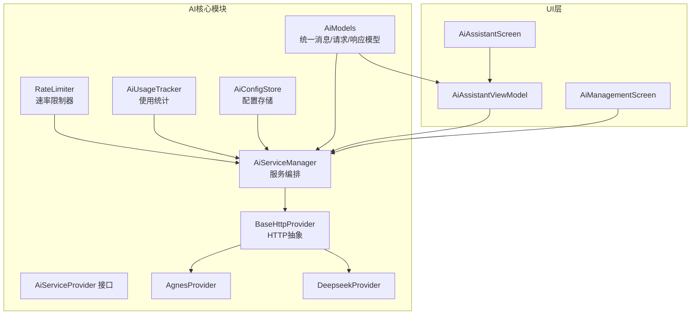
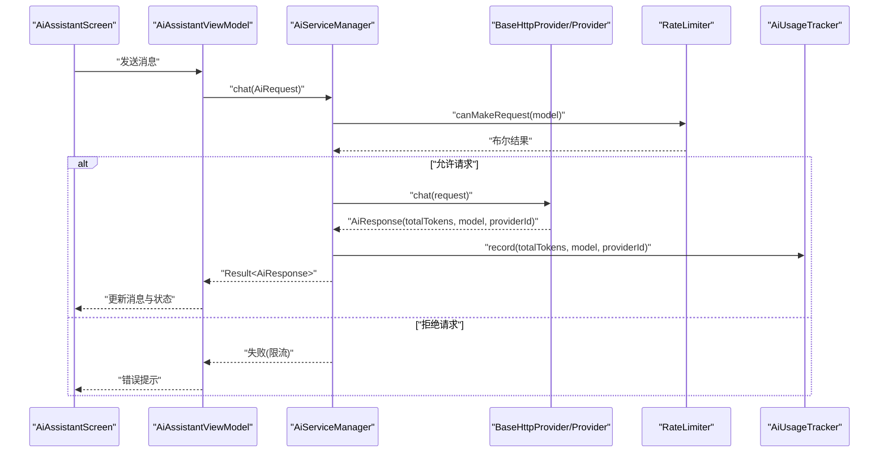
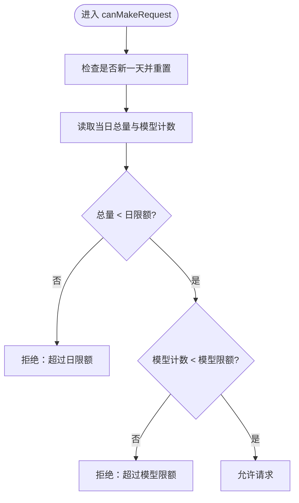
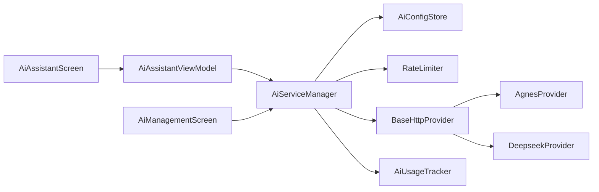

# AI使用控制

<cite>
**本文引用的文件**   
- [RateLimiter.kt](file://app/src/main/java/com/diary/app/ai/RateLimiter.kt)
- [AiUsageTracker.kt](file://app/src/main/java/com/diary/app/ai/AiUsageTracker.kt)
- [AiConfigStore.kt](file://app/src/main/java/com/diary/app/ai/AiConfigStore.kt)
- [AiModels.kt](file://app/src/main/java/com/diary/app/ai/AiModels.kt)
- [AiServiceManager.kt](file://app/src/main/java/com/diary/app/ai/AiServiceManager.kt)
- [BaseHttpProvider.kt](file://app/src/main/java/com/diary/app/ai/BaseHttpProvider.kt)
- [AiServiceProvider.kt](file://app/src/main/java/com/diary/app/ai/AiServiceProvider.kt)
- [AgnesProvider.kt](file://app/src/main/java/com/diary/app/ai/AgnesProvider.kt)
- [DeepseekProvider.kt](file://app/src/main/java/com/diary/app/ai/DeepseekProvider.kt)
- [AiAssistantViewModel.kt](file://app/src/main/java/com/diary/app/ai/AiAssistantViewModel.kt)
- [AiAssistantScreen.kt](file://app/src/main/java/com/diary/app/ui/assistant/AiAssistantScreen.kt)
- [AiManagementScreen.kt](file://app/src/main/java/com/diary/app/ui/tools/AiManagementScreen.kt)
- [RateLimiterTest.kt](file://app/src/test/java/com/diary/app/ai/RateLimiterTest.kt)
</cite>

## 目录
1. [简介](#简介)
2. [项目结构](#项目结构)
3. [核心组件](#核心组件)
4. [架构总览](#架构总览)
5. [详细组件分析](#详细组件分析)
6. [依赖分析](#依赖分析)
7. [性能考虑](#性能考虑)
8. [故障排查指南](#故障排查指南)
9. [结论](#结论)
10. [附录](#附录)

## 简介
本文件面向“AI使用控制”子系统，系统性阐述以下主题：
- 速率限制器的实现机制：包含令牌桶思想的简化版本、配额管理与每日重置逻辑、实时监控与统计展示。
- AI使用统计的采集与分析：请求次数、Token消耗、模型维度与提供商维度的追踪，以及成本估算与可视化。
- 模型参数配置管理：模型选择、参数调优（温度、最大Token）、性能基准与可用模型清单。
- 使用限制的配置示例与最佳实践：异常处理策略、用户体验优化与错误提示。

## 项目结构
AI使用控制相关代码主要位于 app/src/main/java/com/diary/app/ai 目录下，UI层在 app/src/main/java/com/diary/app/ui 下，测试位于 app/src/test/java/com/diary/app/ai。

图表来源
- [AiServiceManager.kt:1-104](file://app/src/main/java/com/diary/app/ai/AiServiceManager.kt#L1-L104)
- [BaseHttpProvider.kt:1-119](file://app/src/main/java/com/diary/app/ai/BaseHttpProvider.kt#L1-L119)
- [AgnesProvider.kt:1-16](file://app/src/main/java/com/diary/app/ai/AgnesProvider.kt#L1-L16)
- [DeepseekProvider.kt:1-19](file://app/src/main/java/com/diary/app/ai/DeepseekProvider.kt#L1-L19)
- [AiUsageTracker.kt:1-96](file://app/src/main/java/com/diary/app/ai/AiUsageTracker.kt#L1-L96)
- [RateLimiter.kt:1-94](file://app/src/main/java/com/diary/app/ai/RateLimiter.kt#L1-L94)
- [AiConfigStore.kt:1-132](file://app/src/main/java/com/diary/app/ai/AiConfigStore.kt#L1-L132)
- [AiModels.kt:1-59](file://app/src/main/java/com/diary/app/ai/AiModels.kt#L1-L59)
- [AiAssistantViewModel.kt:1-364](file://app/src/main/java/com/diary/app/ai/AiAssistantViewModel.kt#L1-L364)
- [AiAssistantScreen.kt:1-571](file://app/src/main/java/com/diary/app/ui/assistant/AiAssistantScreen.kt#L1-L571)
- [AiManagementScreen.kt:1-603](file://app/src/main/java/com/diary/app/ui/tools/AiManagementScreen.kt#L1-L603)

章节来源
- [AiServiceManager.kt:1-104](file://app/src/main/java/com/diary/app/ai/AiServiceManager.kt#L1-L104)
- [AiAssistantViewModel.kt:1-364](file://app/src/main/java/com/diary/app/ai/AiAssistantViewModel.kt#L1-L364)
- [AiManagementScreen.kt:1-603](file://app/src/main/java/com/diary/app/ui/tools/AiManagementScreen.kt#L1-L603)

## 核心组件
- 速率限制器（RateLimiter）
  - 采用每日总量与按模型分组计数的双维度配额控制，支持跨线程安全访问与自动日期重置。
  - 提供可读的UsageStats数据类用于UI展示与阈值判断。
- 使用统计（AiUsageTracker）
  - 以键空间隔离的方式记录当日请求次数与Token消耗，并按模型与提供商聚合统计。
  - 支持JSON序列化/反序列化模型映射，具备容错解析能力。
- 配置存储（AiConfigStore）
  - 支持全局开关、活动提供商、多提供商独立的API Key、Endpoint与模型配置。
  - 向后兼容旧版单一提供商配置，提供迁移路径。
- 服务编排（AiServiceManager）
  - 负责提供商注册、可用性检查、缓存命中、错误归一化与统计上报。
  - 对外暴露统一的聊天接口与统计查询接口。
- HTTP抽象与提供商（BaseHttpProvider、AgnesProvider、DeepseekProvider）
  - 统一HTTP请求流程、超时设置、错误码映射与响应解析。
  - 各提供商覆盖默认模型、可用模型与特定超时差异。
- 统一模型（AiModels）
  - 定义消息、请求、响应与流式分片的数据结构，以及错误类型与便捷构造函数。
- UI层（AiAssistantViewModel、AiAssistantScreen、AiManagementScreen）
  - ViewModel负责上下文构建、消息持久化、调用AI服务与状态管理。
  - Management界面提供提供商切换、配置编辑、用量统计展示与交互反馈。

章节来源
- [RateLimiter.kt:1-94](file://app/src/main/java/com/diary/app/ai/RateLimiter.kt#L1-L94)
- [AiUsageTracker.kt:1-96](file://app/src/main/java/com/diary/app/ai/AiUsageTracker.kt#L1-L96)
- [AiConfigStore.kt:1-132](file://app/src/main/java/com/diary/app/ai/AiConfigStore.kt#L1-L132)
- [AiServiceManager.kt:1-104](file://app/src/main/java/com/diary/app/ai/AiServiceManager.kt#L1-L104)
- [BaseHttpProvider.kt:1-119](file://app/src/main/java/com/diary/app/ai/BaseHttpProvider.kt#L1-L119)
- [AiModels.kt:1-59](file://app/src/main/java/com/diary/app/ai/AiModels.kt#L1-L59)
- [AiAssistantViewModel.kt:1-364](file://app/src/main/java/com/diary/app/ai/AiAssistantViewModel.kt#L1-L364)
- [AiAssistantScreen.kt:1-571](file://app/src/main/java/com/diary/app/ui/assistant/AiAssistantScreen.kt#L1-L571)
- [AiManagementScreen.kt:1-603](file://app/src/main/java/com/diary/app/ui/tools/AiManagementScreen.kt#L1-L603)

## 架构总览
AI使用控制的整体流程如下：
- UI触发聊天请求（AiAssistantScreen → AiAssistantViewModel）。
- ViewModel通过AiServiceManager发起请求。
- AiServiceManager根据活动提供商与配置调用BaseHttpProvider派生类。
- 请求前进行配置校验与速率限制检查；成功后记录Token统计与模型使用。
- 结果返回并可选地写入本地缓存，随后更新UI状态。

图表来源
- [AiAssistantScreen.kt:1-571](file://app/src/main/java/com/diary/app/ui/assistant/AiAssistantScreen.kt#L1-L571)
- [AiAssistantViewModel.kt:1-364](file://app/src/main/java/com/diary/app/ai/AiAssistantViewModel.kt#L1-L364)
- [AiServiceManager.kt:1-104](file://app/src/main/java/com/diary/app/ai/AiServiceManager.kt#L1-L104)
- [BaseHttpProvider.kt:1-119](file://app/src/main/java/com/diary/app/ai/BaseHttpProvider.kt#L1-L119)
- [RateLimiter.kt:1-94](file://app/src/main/java/com/diary/app/ai/RateLimiter.kt#L1-L94)
- [AiUsageTracker.kt:1-96](file://app/src/main/java/com/diary/app/ai/AiUsageTracker.kt#L1-L96)

## 详细组件分析

### 速率限制器（RateLimiter）
- 设计要点
  - 双维度配额：每日总量与按模型分组计数，分别对应常量上限。
  - 自动日期重置：每日首次访问时将总量与模型计数清零，确保自然日边界正确。
  - 线程安全：对关键操作加同步锁，避免并发竞态。
  - 内部函数可测试：将判定逻辑拆分为内部函数，便于单元测试验证边界条件。
- 数据结构与复杂度
  - 存储：SharedPreferences键值对，O(1)读写。
  - 模型使用映射：JSON字符串存储，解析为Map，时间复杂度O(n)（n为模型数量）。
- 错误处理
  - 解析模型映射失败时回退为空Map，保证稳定性。
- 性能影响
  - 每次请求仅做一次读取与一次写入（总量+1），开销极低。
  - 模型映射读写涉及JSON序列化/反序列化，但频率较低。

图表来源
- [RateLimiter.kt:26-32](file://app/src/main/java/com/diary/app/ai/RateLimiter.kt#L26-L32)
- [RateLimiter.kt:71-81](file://app/src/main/java/com/diary/app/ai/RateLimiter.kt#L71-L81)
- [RateLimiter.kt:84-93](file://app/src/main/java/com/diary/app/ai/RateLimiter.kt#L84-L93)

章节来源
- [RateLimiter.kt:1-94](file://app/src/main/java/com/diary/app/ai/RateLimiter.kt#L1-L94)
- [RateLimiterTest.kt:1-100](file://app/src/test/java/com/diary/app/ai/RateLimiterTest.kt#L1-L100)

### 使用统计（AiUsageTracker）
- 设计要点
  - 以“日期键”作为命名空间，避免跨日统计混淆。
  - 分别维护请求次数、Token总数、模型维度与提供商维度的映射。
  - JSON序列化模型映射，解析失败时回退为空映射，保证健壮性。
- 数据结构
  - 以字符串键拼接“前缀+日期”的形式组织数据，便于按日聚合。
  - UsageStats数据类承载当日统计结果，供UI展示。
- 成本估算
  - UI层提供格式化函数将大数值显示为K/M单位，便于阅读。
- 性能影响
  - 每次记录涉及多次读写与一次JSON解析/序列化，频率较低，影响可忽略。

章节来源
- [AiUsageTracker.kt:1-96](file://app/src/main/java/com/diary/app/ai/AiUsageTracker.kt#L1-L96)
- [AiManagementScreen.kt:496-502](file://app/src/main/java/com/diary/app/ui/tools/AiManagementScreen.kt#L496-L502)

### 配置存储（AiConfigStore）
- 设计要点
  - 支持全局开关与活动提供商标识。
  - 多提供商独立配置：API Key、Endpoint、模型，键名带提供商后缀。
  - 向后兼容：当无独立配置时尝试从旧键迁移。
  - 便捷方法：提供isConfigured快速判断。
- 最佳实践
  - 新增提供商时仅需扩展键名规则，不破坏现有结构。
  - 在BaseHttpProvider中通过getActiveProvider自动选择当前提供商配置。

章节来源
- [AiConfigStore.kt:1-132](file://app/src/main/java/com/diary/app/ai/AiConfigStore.kt#L1-L132)
- [BaseHttpProvider.kt:24-28](file://app/src/main/java/com/diary/app/ai/BaseHttpProvider.kt#L24-L28)

### 服务编排（AiServiceManager）
- 设计要点
  - 注册多个提供商实例，按活动提供商调度。
  - 缓存机制：基于请求消息哈希的SharedPreferences缓存，24小时TTL。
  - 统一错误处理：捕获异常并转换为AiError枚举，便于UI一致化展示。
  - 统计上报：在收到totalTokens>0时记录AiUsageTracker。
- 性能优化
  - 缓存命中可显著减少网络请求与Token消耗。
  - SHA-256哈希生成与JSON序列化为O(n)（n为消息条目数），通常很小。

章节来源
- [AiServiceManager.kt:1-104](file://app/src/main/java/com/diary/app/ai/AiServiceManager.kt#L1-L104)

### HTTP抽象与提供商（BaseHttpProvider、AgnesProvider、DeepseekProvider）
- 设计要点
  - BaseHttpProvider封装通用流程：配置校验、速率限制检查、HTTP请求、错误映射、响应解析。
  - 各提供商覆盖默认模型与可用模型列表，部分提供商调整连接与读取超时。
  - 错误映射：429映射为限流，401映射为API Key无效，402映射为配额用尽。
- 参数与性能
  - 温度与最大Token由AiRequest传入，不同提供商默认值可不同。
  - 超时设置针对不同提供商差异化配置，提升稳定性。

章节来源
- [BaseHttpProvider.kt:1-119](file://app/src/main/java/com/diary/app/ai/BaseHttpProvider.kt#L1-L119)
- [AgnesProvider.kt:1-16](file://app/src/main/java/com/diary/app/ai/AgnesProvider.kt#L1-L16)
- [DeepseekProvider.kt:1-19](file://app/src/main/java/com/diary/app/ai/DeepseekProvider.kt#L1-L19)

### 统一模型（AiModels）
- 设计要点
  - AiMessage/AiRequest/AiResponse定义统一的消息与请求/响应结构。
  - AiError统一错误类型，便于上层处理。
  - aiRequest便捷构造函数简化调用侧代码。
- 参数调优
  - temperature与maxTokens在请求侧可控，配合不同提供商模型效果差异。

章节来源
- [AiModels.kt:1-59](file://app/src/main/java/com/diary/app/ai/AiModels.kt#L1-L59)

### UI层（AiAssistantViewModel、AiAssistantScreen、AiManagementScreen）
- 设计要点
  - ViewModel负责构建系统提示词与历史消息，调用AiServiceManager并持久化消息。
  - AiAssistantScreen提供对话列表、发送输入、加载指示与错误重试按钮。
  - AiManagementScreen展示提供商卡片、用量统计、模型明细与配置弹窗。
- 用户体验
  - 自动滚动至最新消息、轻量动画、错误信息友好化提示。
  - 用量统计以K/M格式展示，直观反映Token消耗。

章节来源
- [AiAssistantViewModel.kt:1-364](file://app/src/main/java/com/diary/app/ai/AiAssistantViewModel.kt#L1-L364)
- [AiAssistantScreen.kt:1-571](file://app/src/main/java/com/diary/app/ui/assistant/AiAssistantScreen.kt#L1-L571)
- [AiManagementScreen.kt:1-603](file://app/src/main/java/com/diary/app/ui/tools/AiManagementScreen.kt#L1-L603)

## 依赖分析
- 组件耦合
  - AiServiceManager依赖AiConfigStore、RateLimiter与各提供商实现。
  - BaseHttpProvider依赖AiConfigStore与RateLimiter，向上提供统一接口。
  - AiAssistantViewModel依赖AiServiceManager与数据库DAO，向下驱动UI。
- 外部依赖
  - SharedPreferences用于本地持久化。
  - Gson用于JSON序列化/反序列化。
  - Android网络栈用于HTTP请求。
- 循环依赖
  - 未发现循环依赖，职责清晰分离。

图表来源
- [AiServiceManager.kt:1-104](file://app/src/main/java/com/diary/app/ai/AiServiceManager.kt#L1-L104)
- [BaseHttpProvider.kt:1-119](file://app/src/main/java/com/diary/app/ai/BaseHttpProvider.kt#L1-L119)
- [AiConfigStore.kt:1-132](file://app/src/main/java/com/diary/app/ai/AiConfigStore.kt#L1-L132)
- [RateLimiter.kt:1-94](file://app/src/main/java/com/diary/app/ai/RateLimiter.kt#L1-L94)
- [AiUsageTracker.kt:1-96](file://app/src/main/java/com/diary/app/ai/AiUsageTracker.kt#L1-L96)
- [AiAssistantViewModel.kt:1-364](file://app/src/main/java/com/diary/app/ai/AiAssistantViewModel.kt#L1-L364)
- [AiAssistantScreen.kt:1-571](file://app/src/main/java/com/diary/app/ui/assistant/AiAssistantScreen.kt#L1-L571)
- [AiManagementScreen.kt:1-603](file://app/src/main/java/com/diary/app/ui/tools/AiManagementScreen.kt#L1-L603)

章节来源
- [AiServiceManager.kt:1-104](file://app/src/main/java/com/diary/app/ai/AiServiceManager.kt#L1-L104)
- [BaseHttpProvider.kt:1-119](file://app/src/main/java/com/diary/app/ai/BaseHttpProvider.kt#L1-L119)

## 性能考虑
- 速率限制
  - 读写SharedPreferences为O(1)，每日重置仅在首访触发，成本极低。
- 统计记录
  - JSON解析/序列化在记录时发生，频率与请求次数相关，通常开销较小。
- 缓存
  - 24小时TTL的响应缓存可显著降低重复请求与Token消耗，建议合理使用。
- 网络
  - 不同提供商的超时配置差异有助于在弱网环境下提升成功率。
- UI渲染
  - 列表懒加载与动画参数已适度配置，避免过度卡顿。

## 故障排查指南
- 常见错误与定位
  - 未配置API Key：检查AiConfigStore的isConfigured与提供商配置项。
  - 今日调用次数已用完：查看RateLimiter的UsageStats与AiUsageTracker的当日统计。
  - 网络不可用/超时：检查网络状态与BaseHttpProvider的超时设置。
  - API Key无效/配额用尽：根据HTTP状态码映射到AiError.ApiError。
- 异常处理策略
  - UI层对SocketTimeoutException与包含“timeout”的异常进行友好提示。
  - 服务层捕获未知异常并转换为AiError.Unknown，便于统一处理。
- 最佳实践
  - 在发送前先调用isAvailable进行可用性探测。
  - 对于频繁重复请求，启用缓存以减少网络与Token消耗。
  - 在UI中展示用量统计，帮助用户感知配额使用情况。

章节来源
- [BaseHttpProvider.kt:41-51](file://app/src/main/java/com/diary/app/ai/BaseHttpProvider.kt#L41-L51)
- [AiAssistantViewModel.kt:201-213](file://app/src/main/java/com/diary/app/ai/AiAssistantViewModel.kt#L201-L213)
- [AiModels.kt:28-43](file://app/src/main/java/com/diary/app/ai/AiModels.kt#L28-L43)

## 结论
本AI使用控制系统通过“配置存储 + 服务编排 + 速率限制 + 统计上报 + UI展示”的完整闭环，实现了：
- 稳定可靠的配额控制与实时监控；
- 可观测的Token消耗与模型/提供商维度分析；
- 易扩展的多提供商接入与参数调优；
- 友好的用户体验与错误处理策略。

建议在后续迭代中：
- 增加更细粒度的成本估算与预算告警；
- 扩展更多提供商与模型，完善默认参数与超时策略；
- 优化统计面板，增加趋势图与导出能力。

## 附录
- 使用限制配置示例（概念性说明）
  - 日限额与模型限额：在RateLimiter中定义常量，可通过内部函数自定义传参。
  - 模型限额：按模型维度独立计数，适用于区分不同模型的Token消耗。
  - 重置策略：每日首次访问自动重置，无需额外定时任务。
- 最佳实践
  - 在调用前先检查isAvailable，避免不必要的网络请求。
  - 合理设置temperature与maxTokens，平衡质量与成本。
  - 在UI中展示用量统计，引导用户关注Token消耗。
  - 对高频重复请求启用缓存，减少网络与Token压力。