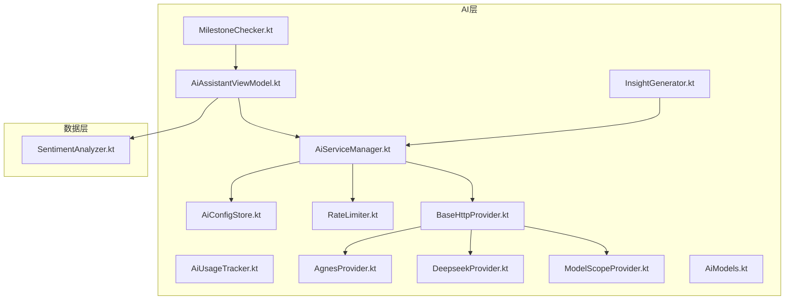
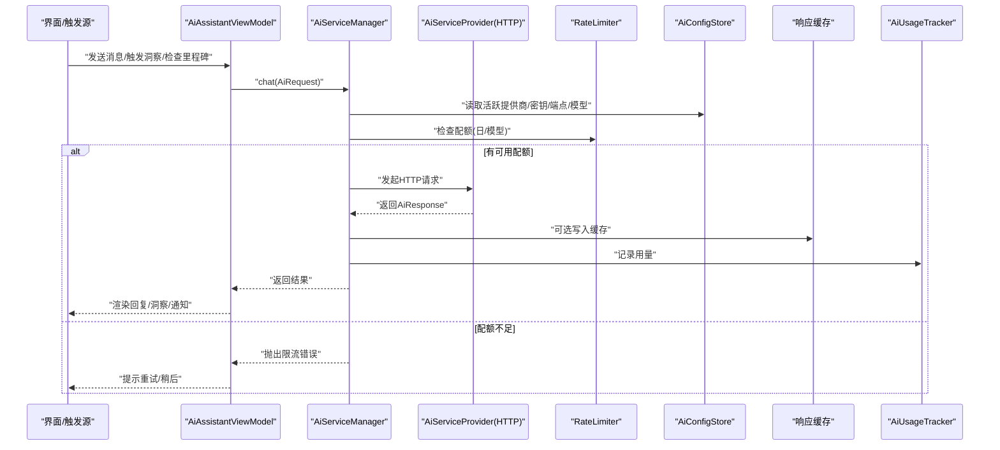
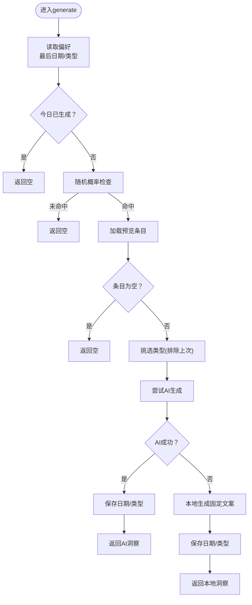
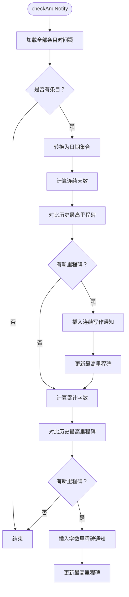
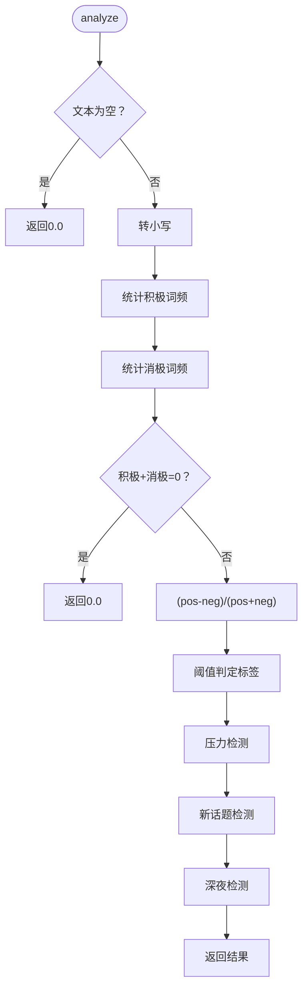
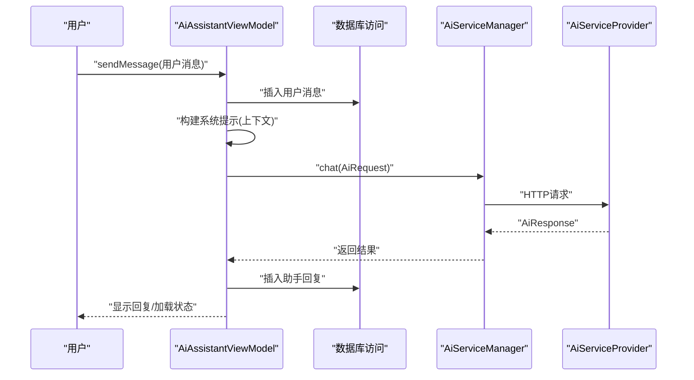
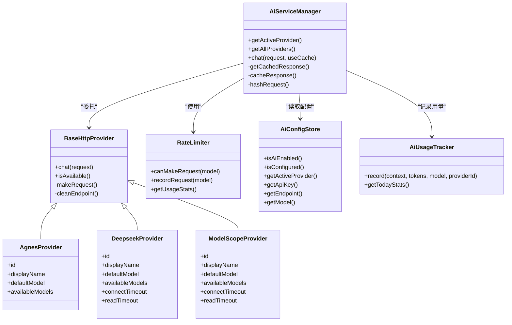
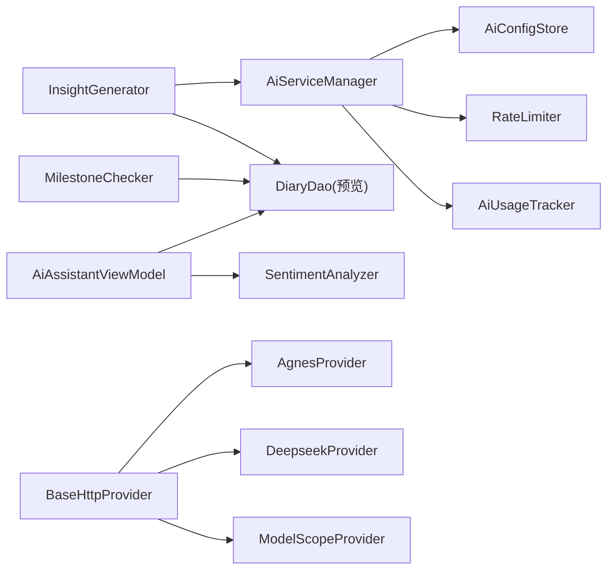

# AI功能实现

<cite>
**本文引用的文件**
- [InsightGenerator.kt](file://app/src/main/java/com/diary/app/ai/InsightGenerator.kt)
- [MilestoneChecker.kt](file://app/src/main/java/com/diary/app/ai/MilestoneChecker.kt)
- [SentimentAnalyzer.kt](file://app/src/main/java/com/diary/app/data/SentimentAnalyzer.kt)
- [AiAssistantViewModel.kt](file://app/src/main/java/com/diary/app/ai/AiAssistantViewModel.kt)
- [AiServiceManager.kt](file://app/src/main/java/com/diary/app/ai/AiServiceManager.kt)
- [AiModels.kt](file://app/src/main/java/com/diary/app/ai/AiModels.kt)
- [AiConfigStore.kt](file://app/src/main/java/com/diary/app/ai/AiConfigStore.kt)
- [RateLimiter.kt](file://app/src/main/java/com/diary/app/ai/RateLimiter.kt)
- [AiUsageTracker.kt](file://app/src/main/java/com/diary/app/ai/AiUsageTracker.kt)
- [BaseHttpProvider.kt](file://app/src/main/java/com/diary/app/ai/BaseHttpProvider.kt)
- [AgnesProvider.kt](file://app/src/main/java/com/diary/app/ai/AgnesProvider.kt)
- [DeepseekProvider.kt](file://app/src/main/java/com/diary/app/ai/DeepseekProvider.kt)
- [ModelScopeProvider.kt](file://app/src/main/java/com/diary/app/ai/ModelScopeProvider.kt)
- [InsightGeneratorTest.kt](file://app/src/test/java/com/diary/app/ai/InsightGeneratorTest.kt)
- [RateLimiterTest.kt](file://app/src/test/java/com/diary/app/ai/RateLimiterTest.kt)
</cite>

## 目录
1. [简介](#简介)
2. [项目结构](#项目结构)
3. [核心组件](#核心组件)
4. [架构总览](#架构总览)
5. [详细组件分析](#详细组件分析)
6. [依赖关系分析](#依赖关系分析)
7. [性能考量](#性能考量)
8. [故障排查指南](#故障排查指南)
9. [结论](#结论)
10. [附录](#附录)

## 简介
本文件系统化梳理日记应用中的AI功能实现，重点覆盖以下三个方面：
- 洞察生成功能：基于日记内容进行情绪回应、鼓励、模式提示与问候，支持本地兜底与云端AI增强两种路径。
- 里程碑检查器：根据连续写作天数与累计字数，自动评估并触发成就通知。
- 情感分析器：对纯文本进行情感倾向评分与标签化，并提供压力检测、新话题识别与深夜内容识别能力。

同时给出使用示例、配置项说明与性能优化建议，帮助开发者与产品人员快速理解与落地。

## 项目结构
AI相关代码主要位于 app/src/main/java/com/diary/app/ai 与 app/src/main/java/com/diary/app/data 下，采用按职责分层组织：
- ai 层：AI服务编排、模型抽象、限流与用量统计、洞察与助手对话逻辑。
- data 层：情感分析器与数据实体辅助工具。
- 测试层：针对洞察生成与限流策略的关键行为进行单元测试。

图示来源
- [AiAssistantViewModel.kt:1-364](file://app/src/main/java/com/diary/app/ai/AiAssistantViewModel.kt#L1-L364)
- [AiServiceManager.kt:1-104](file://app/src/main/java/com/diary/app/ai/AiServiceManager.kt#L1-L104)
- [AiConfigStore.kt:1-132](file://app/src/main/java/com/diary/app/ai/AiConfigStore.kt#L1-L132)
- [RateLimiter.kt:1-94](file://app/src/main/java/com/diary/app/ai/RateLimiter.kt#L1-L94)
- [AiUsageTracker.kt:1-96](file://app/src/main/java/com/diary/app/ai/AiUsageTracker.kt#L1-L96)
- [BaseHttpProvider.kt:1-119](file://app/src/main/java/com/diary/app/ai/BaseHttpProvider.kt#L1-L119)
- [AgnesProvider.kt:1-16](file://app/src/main/java/com/diary/app/ai/AgnesProvider.kt#L1-L16)
- [DeepseekProvider.kt:1-19](file://app/src/main/java/com/diary/app/ai/DeepseekProvider.kt#L1-L19)
- [ModelScopeProvider.kt:1-24](file://app/src/main/java/com/diary/app/ai/ModelScopeProvider.kt#L1-L24)
- [AiModels.kt:1-59](file://app/src/main/java/com/diary/app/ai/AiModels.kt#L1-L59)
- [SentimentAnalyzer.kt:1-102](file://app/src/main/java/com/diary/app/data/SentimentAnalyzer.kt#L1-L102)

章节来源
- [AiAssistantViewModel.kt:1-364](file://app/src/main/java/com/diary/app/ai/AiAssistantViewModel.kt#L1-L364)
- [AiServiceManager.kt:1-104](file://app/src/main/java/com/diary/app/ai/AiServiceManager.kt#L1-L104)
- [AiConfigStore.kt:1-132](file://app/src/main/java/com/diary/app/ai/AiConfigStore.kt#L1-L132)
- [RateLimiter.kt:1-94](file://app/src/main/java/com/diary/app/ai/RateLimiter.kt#L1-L94)
- [AiUsageTracker.kt:1-96](file://app/src/main/java/com/diary/app/ai/AiUsageTracker.kt#L1-L96)
- [BaseHttpProvider.kt:1-119](file://app/src/main/java/com/diary/app/ai/BaseHttpProvider.kt#L1-L119)
- [AgnesProvider.kt:1-16](file://app/src/main/java/com/diary/app/ai/AgnesProvider.kt#L1-L16)
- [DeepseekProvider.kt:1-19](file://app/src/main/java/com/diary/app/ai/DeepseekProvider.kt#L1-L19)
- [ModelScopeProvider.kt:1-24](file://app/src/main/java/com/diary/app/ai/ModelScopeProvider.kt#L1-L24)
- [AiModels.kt:1-59](file://app/src/main/java/com/diary/app/ai/AiModels.kt#L1-L59)
- [SentimentAnalyzer.kt:1-102](file://app/src/main/java/com/diary/app/data/SentimentAnalyzer.kt#L1-L102)

## 核心组件
- 洞察生成器 InsightGenerator：负责每日一次的“智能问候/情绪回应/习惯提醒/鼓励”四类洞察生成，优先调用云端AI，失败时回退到本地规则。
- 里程碑检查器 MilestoneChecker：基于连续写作天数与累计字数，自动发现新里程碑并插入通知。
- 情感分析器 SentimentAnalyzer：基于关键词匹配计算情感强度与标签，提供压力、新话题与深夜内容识别。
- 助手对话 AiAssistantViewModel：构建上下文（写作时长、连续天数、情绪分布、标签、地点、时间模式、随机/近期日记片段），调用AI服务生成回复。
- 服务管理 AiServiceManager：统一调度多提供商（Agnes/ModelScope/Deepseek），内置缓存、限流与用量统计。
- 配置与限流 AiConfigStore/RateLimiter/AiUsageTracker：集中管理API Key/端点/模型配置，控制每日与模型级调用上限，追踪用量。
- HTTP提供者 BaseHttpProvider 及其子类：封装HTTP请求、鉴权、超时、错误码映射与响应解析。

章节来源
- [InsightGenerator.kt:16-174](file://app/src/main/java/com/diary/app/ai/InsightGenerator.kt#L16-L174)
- [MilestoneChecker.kt:11-107](file://app/src/main/java/com/diary/app/ai/MilestoneChecker.kt#L11-L107)
- [SentimentAnalyzer.kt:7-102](file://app/src/main/java/com/diary/app/data/SentimentAnalyzer.kt#L7-L102)
- [AiAssistantViewModel.kt:33-364](file://app/src/main/java/com/diary/app/ai/AiAssistantViewModel.kt#L33-L364)
- [AiServiceManager.kt:10-104](file://app/src/main/java/com/diary/app/ai/AiServiceManager.kt#L10-L104)
- [AiConfigStore.kt:5-132](file://app/src/main/java/com/diary/app/ai/AiConfigStore.kt#L5-L132)
- [RateLimiter.kt:6-94](file://app/src/main/java/com/diary/app/ai/RateLimiter.kt#L6-L94)
- [AiUsageTracker.kt:10-96](file://app/src/main/java/com/diary/app/ai/AiUsageTracker.kt#L10-L96)
- [BaseHttpProvider.kt:10-119](file://app/src/main/java/com/diary/app/ai/BaseHttpProvider.kt#L10-L119)
- [AgnesProvider.kt:5-16](file://app/src/main/java/com/diary/app/ai/AgnesProvider.kt#L5-L16)
- [DeepseekProvider.kt:5-19](file://app/src/main/java/com/diary/app/ai/DeepseekProvider.kt#L5-L19)
- [ModelScopeProvider.kt:5-24](file://app/src/main/java/com/diary/app/ai/ModelScopeProvider.kt#L5-L24)

## 架构总览
下图展示了AI功能的整体交互：应用通过 ViewModel 构建上下文，调用服务管理器选择提供商，经由 HTTP 提供者发送请求，返回后写入缓存与用量统计；洞察生成器与里程碑检查器分别在合适时机触发。

图示来源
- [AiAssistantViewModel.kt:128-226](file://app/src/main/java/com/diary/app/ai/AiAssistantViewModel.kt#L128-L226)
- [AiServiceManager.kt:43-61](file://app/src/main/java/com/diary/app/ai/AiServiceManager.kt#L43-L61)
- [BaseHttpProvider.kt:21-51](file://app/src/main/java/com/diary/app/ai/BaseHttpProvider.kt#L21-L51)
- [RateLimiter.kt:26-44](file://app/src/main/java/com/diary/app/ai/RateLimiter.kt#L26-L44)
- [AiUsageTracker.kt:27-60](file://app/src/main/java/com/diary/app/ai/AiUsageTracker.kt#L27-L60)

## 详细组件分析

### 洞察生成功能（InsightGenerator）
- 触发策略：每日最多一次，带随机概率阈值，避免频繁打扰；类型轮换（排除上次类型），保证多样性。
- 数据来源：全量预览条目，最近7天用于趋势分析。
- 类型与提示词：
  - 情绪问候：结合平均心情等级与总篇数，生成温和回应。
  - 鼓励：基于首次写作日期与总篇数，生成鼓励语。
  - 模式：统计最近天气分布，指出常见写作环境。
  - 打招呼：依据小时判断时段，自然问候。
- 回退机制：若AI调用异常，使用本地规则生成固定文案，确保稳定性。
- 存储：SharedPreferences 记录最后生成日期与类型，避免重复。

图示来源
- [InsightGenerator.kt:23-52](file://app/src/main/java/com/diary/app/ai/InsightGenerator.kt#L23-L52)
- [InsightGenerator.kt:56-119](file://app/src/main/java/com/diary/app/ai/InsightGenerator.kt#L56-L119)
- [InsightGenerator.kt:121-123](file://app/src/main/java/com/diary/app/ai/InsightGenerator.kt#L121-L123)
- [InsightGenerator.kt:131-173](file://app/src/main/java/com/diary/app/ai/InsightGenerator.kt#L131-L173)

章节来源
- [InsightGenerator.kt:16-174](file://app/src/main/java/com/diary/app/ai/InsightGenerator.kt#L16-L174)
- [InsightGeneratorTest.kt:14-229](file://app/src/test/java/com/diary/app/ai/InsightGeneratorTest.kt#L14-L229)

### 里程碑检查器（MilestoneChecker）
- 连续天数：从所有写作日期集合中，自最大日期向前回溯，统计连续天数。
- 累计字数：遍历全部条目的纯文本长度求和。
- 触发条件：对比历史里程碑阈值，发现新的更高里程碑即插入通知。
- 通知内容：为不同里程碑设置专属标题与副标题，颜色与图标区分类型。

图示来源
- [MilestoneChecker.kt:20-68](file://app/src/main/java/com/diary/app/ai/MilestoneChecker.kt#L20-L68)
- [MilestoneChecker.kt:70-81](file://app/src/main/java/com/diary/app/ai/MilestoneChecker.kt#L70-L81)
- [MilestoneChecker.kt:83-105](file://app/src/main/java/com/diary/app/ai/MilestoneChecker.kt#L83-L105)

章节来源
- [MilestoneChecker.kt:11-107](file://app/src/main/java/com/diary/app/ai/MilestoneChecker.kt#L11-L107)

### 情感分析器（SentimentAnalyzer）
- 关键词库：分别维护积极、消极、中性词汇列表。
- 情感强度：统计积极与消极词频，归一化得到[-1,1]区间分数。
- 标签化：以阈值划分正向/中性/负向。
- 辅助能力：压力检测、新话题识别（基于主题关键词）、深夜内容识别（基于创作时刻）。

图示来源
- [SentimentAnalyzer.kt:32-91](file://app/src/main/java/com/diary/app/data/SentimentAnalyzer.kt#L32-L91)

章节来源
- [SentimentAnalyzer.kt:7-102](file://app/src/main/java/com/diary/app/data/SentimentAnalyzer.kt#L7-L102)

### 助手对话（AiAssistantViewModel）
- 上下文构建：统计写作总量、跨度天数、连续天数、情绪分布、近7天趋势、常用标签、常去地点、写作高峰时段、随机与近期日记片段。
- 对话流程：保存用户消息 → 构建系统提示与历史 → 调用AI服务 → 写入助手回复 → 更新会话时间与消息裁剪。
- 错误处理：网络超时、解析异常、服务错误均有明确提示文案。

图示来源
- [AiAssistantViewModel.kt:128-226](file://app/src/main/java/com/diary/app/ai/AiAssistantViewModel.kt#L128-L226)
- [AiAssistantViewModel.kt:228-330](file://app/src/main/java/com/diary/app/ai/AiAssistantViewModel.kt#L228-L330)

章节来源
- [AiAssistantViewModel.kt:33-364](file://app/src/main/java/com/diary/app/ai/AiAssistantViewModel.kt#L33-L364)

### 服务管理与提供商（AiServiceManager / BaseHttpProvider / 子类）
- 服务管理：注册多提供商，统一缓存（SHA-256哈希键，24h TTL）、限流与用量统计。
- HTTP提供者：标准化请求体、鉴权头、超时、错误码映射与响应解析。
- 子类差异：各提供商默认模型、可用模型与超时配置略有不同。

图示来源
- [AiServiceManager.kt:10-104](file://app/src/main/java/com/diary/app/ai/AiServiceManager.kt#L10-L104)
- [BaseHttpProvider.kt:10-119](file://app/src/main/java/com/diary/app/ai/BaseHttpProvider.kt#L10-L119)
- [AgnesProvider.kt:5-16](file://app/src/main/java/com/diary/app/ai/AgnesProvider.kt#L5-L16)
- [DeepseekProvider.kt:5-19](file://app/src/main/java/com/diary/app/ai/DeepseekProvider.kt#L5-L19)
- [ModelScopeProvider.kt:5-24](file://app/src/main/java/com/diary/app/ai/ModelScopeProvider.kt#L5-L24)
- [RateLimiter.kt:6-94](file://app/src/main/java/com/diary/app/ai/RateLimiter.kt#L6-L94)
- [AiConfigStore.kt:5-132](file://app/src/main/java/com/diary/app/ai/AiConfigStore.kt#L5-L132)
- [AiUsageTracker.kt:10-96](file://app/src/main/java/com/diary/app/ai/AiUsageTracker.kt#L10-L96)

章节来源
- [AiServiceManager.kt:10-104](file://app/src/main/java/com/diary/app/ai/AiServiceManager.kt#L10-L104)
- [BaseHttpProvider.kt:10-119](file://app/src/main/java/com/diary/app/ai/BaseHttpProvider.kt#L10-L119)
- [AgnesProvider.kt:5-16](file://app/src/main/java/com/diary/app/ai/AgnesProvider.kt#L5-L16)
- [DeepseekProvider.kt:5-19](file://app/src/main/java/com/diary/app/ai/DeepseekProvider.kt#L5-L19)
- [ModelScopeProvider.kt:5-24](file://app/src/main/java/com/diary/app/ai/ModelScopeProvider.kt#L5-L24)
- [AiConfigStore.kt:5-132](file://app/src/main/java/com/diary/app/ai/AiConfigStore.kt#L5-L132)
- [RateLimiter.kt:6-94](file://app/src/main/java/com/diary/app/ai/RateLimiter.kt#L6-L94)
- [AiUsageTracker.kt:10-96](file://app/src/main/java/com/diary/app/ai/AiUsageTracker.kt#L10-L96)

## 依赖关系分析
- 组件耦合：
  - InsightGenerator 依赖 AiServiceManager 与 DiaryDao 的预览数据。
  - MilestoneChecker 依赖 DiaryDao 的全量条目与通知插入接口。
  - AiAssistantViewModel 依赖 DAO 的聊天与日记数据，间接依赖情感分析器。
  - AiServiceManager 依赖配置存储、限流与用量统计。
  - BaseHttpProvider 抽象出HTTP细节，子类仅定义标识与默认模型。
- 外部依赖：
  - 网络请求、JSON解析、SharedPreferences、Gson。
- 循环依赖：未见循环依赖迹象。

图示来源
- [InsightGenerator.kt:23-52](file://app/src/main/java/com/diary/app/ai/InsightGenerator.kt#L23-L52)
- [MilestoneChecker.kt:20-68](file://app/src/main/java/com/diary/app/ai/MilestoneChecker.kt#L20-L68)
- [AiAssistantViewModel.kt:36-37](file://app/src/main/java/com/diary/app/ai/AiAssistantViewModel.kt#L36-L37)
- [AiServiceManager.kt:12-24](file://app/src/main/java/com/diary/app/ai/AiServiceManager.kt#L12-L24)
- [BaseHttpProvider.kt:14](file://app/src/main/java/com/diary/app/ai/BaseHttpProvider.kt#L14-L14)

章节来源
- [AiModels.kt:4-59](file://app/src/main/java/com/diary/app/ai/AiModels.kt#L4-L59)
- [AiServiceManager.kt:10-104](file://app/src/main/java/com/diary/app/ai/AiServiceManager.kt#L10-L104)
- [BaseHttpProvider.kt:10-119](file://app/src/main/java/com/diary/app/ai/BaseHttpProvider.kt#L10-L119)

## 性能考量
- 请求缓存：AiServiceManager 使用SHA-256哈希作为缓存键，24h TTL，减少重复请求与网络开销。
- 限流策略：每日总量与模型级限额双维度控制，避免突发流量导致服务端限流或费用激增。
- 上下文裁剪：助手对话仅取最近N条消息与少量随机/近期条目，降低token消耗与延迟。
- IO隔离：网络与数据库操作均在IO调度器执行，避免阻塞主线程。
- 本地回退：洞察生成在AI失败时走本地规则，保障可用性与一致性。

章节来源
- [AiServiceManager.kt:43-95](file://app/src/main/java/com/diary/app/ai/AiServiceManager.kt#L43-L95)
- [RateLimiter.kt:26-52](file://app/src/main/java/com/diary/app/ai/RateLimiter.kt#L26-L52)
- [AiAssistantViewModel.kt:150-226](file://app/src/main/java/com/diary/app/ai/AiAssistantViewModel.kt#L150-L226)

## 故障排查指南
- 未配置API Key：AiConfigStore.isConfigured为false时，AiServiceManager会返回未配置错误；检查活跃提供商与对应密钥/端点/模型。
- 限流触发：当当日或模型级限额达到上限，BaseHttpProvider会抛出限流错误；可通过AiUsageTracker查看今日用量。
- 网络异常：SocketTimeoutException或HTTP非200状态码会转化为友好提示；检查endpoint与网络连通性。
- 缓存失效：缓存过期或解析失败会自动忽略缓存，重新请求；确认缓存键与TTL设置。
- 单元测试参考：InsightGeneratorTest与RateLimiterTest提供了关键行为验证，便于定位问题。

章节来源
- [AiConfigStore.kt:127-131](file://app/src/main/java/com/diary/app/ai/AiConfigStore.kt#L127-L131)
- [BaseHttpProvider.kt:87-93](file://app/src/main/java/com/diary/app/ai/BaseHttpProvider.kt#L87-L93)
- [AiUsageTracker.kt:62-73](file://app/src/main/java/com/diary/app/ai/AiUsageTracker.kt#L62-L73)
- [InsightGeneratorTest.kt:14-229](file://app/src/test/java/com/diary/app/ai/InsightGeneratorTest.kt#L14-L229)
- [RateLimiterTest.kt:8-100](file://app/src/test/java/com/diary/app/ai/RateLimiterTest.kt#L8-L100)

## 结论
本AI功能体系以“稳定可用 + 渐进增强”为核心设计原则：洞察生成与里程碑检查提供稳定的日常体验，情感分析为内容理解与个性化建议奠定基础，而助手对话通过上下文构建与多提供商支持，实现更丰富的交互。配合完善的配置、限流与用量统计，既保障用户体验，又兼顾成本与可靠性。

## 附录

### 使用示例与配置选项
- 启用AI与选择提供商
  - 在设置中开启AI开关，并选择活跃提供商（Agnes/ModelScope/Deepseek）。
  - 配置API Key、端点与模型名称；系统支持按提供商独立配置与迁移兼容。
- 参数调整
  - 洞察生成：随机概率阈值、类型轮换策略、提示词模板与温度/最大token。
  - 限流：日总量与模型级限额，可在限流器内部调整。
  - 缓存：TTL与哈希策略可按需扩展。
- 性能优化建议
  - 控制上下文长度与消息数量，避免过度token消耗。
  - 合理利用缓存，减少重复请求。
  - 在弱网环境下适当提高超时阈值或启用本地回退。
  - 定期清理旧对话与无用条目，保持数据库健康。

章节来源
- [AiConfigStore.kt:20-31](file://app/src/main/java/com/diary/app/ai/AiConfigStore.kt#L20-L31)
- [AiConfigStore.kt:35-86](file://app/src/main/java/com/diary/app/ai/AiConfigStore.kt#L35-L86)
- [AiServiceManager.kt:43-61](file://app/src/main/java/com/diary/app/ai/AiServiceManager.kt#L43-L61)
- [RateLimiter.kt:12-14](file://app/src/main/java/com/diary/app/ai/RateLimiter.kt#L12-L14)
- [AiAssistantViewModel.kt:176-183](file://app/src/main/java/com/diary/app/ai/AiAssistantViewModel.kt#L176-L183)