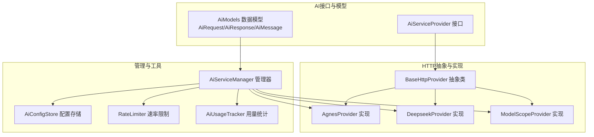
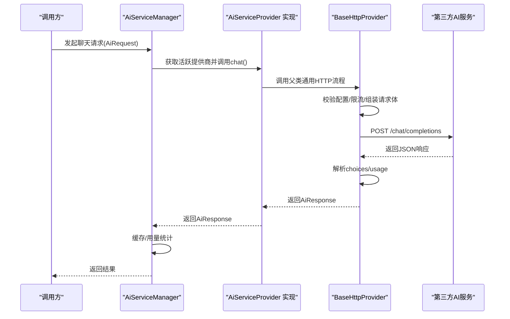
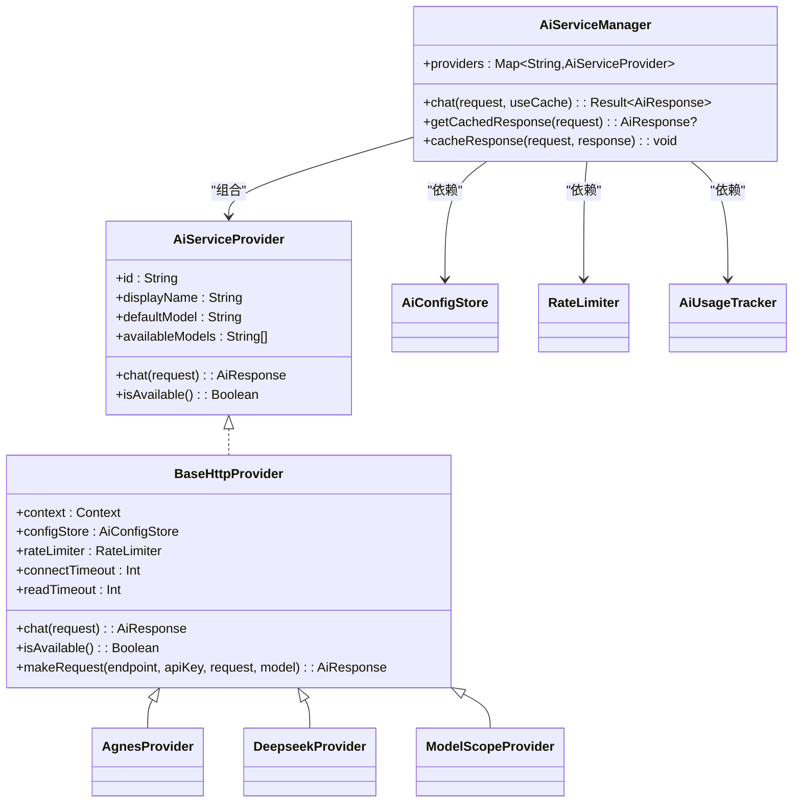

# AI提供商集成

<cite>
**本文引用的文件**
- [BaseHttpProvider.kt](file://app/src/main/java/com/diary/app/ai/BaseHttpProvider.kt)
- [AgnesProvider.kt](file://app/src/main/java/com/diary/app/ai/AgnesProvider.kt)
- [DeepseekProvider.kt](file://app/src/main/java/com/diary/app/ai/DeepseekProvider.kt)
- [ModelScopeProvider.kt](file://app/src/main/java/com/diary/app/ai/ModelScopeProvider.kt)
- [AiServiceProvider.kt](file://app/src/main/java/com/diary/app/ai/AiServiceProvider.kt)
- [AiServiceManager.kt](file://app/src/main/java/com/diary/app/ai/AiServiceManager.kt)
- [AiConfigStore.kt](file://app/src/main/java/com/diary/app/ai/AiConfigStore.kt)
- [AiModels.kt](file://app/src/main/java/com/diary/app/ai/AiModels.kt)
- [RateLimiter.kt](file://app/src/main/java/com/diary/app/ai/RateLimiter.kt)
- [AiUsageTracker.kt](file://app/src/main/java/com/diary/app/ai/AiUsageTracker.kt)
- [InsightGenerator.kt](file://app/src/main/java/com/diary/app/ai/InsightGenerator.kt)
- [MilestoneChecker.kt](file://app/src/main/java/com/diary/app/ai/MilestoneChecker.kt)
- [RateLimiterTest.kt](file://app/src/test/java/com/diary/app/ai/RateLimiterTest.kt)
- [InsightGeneratorTest.kt](file://app/src/test/java/com/diary/app/ai/InsightGeneratorTest.kt)
</cite>

## 目录
1. [简介](#简介)
2. [项目结构](#项目结构)
3. [核心组件](#核心组件)
4. [架构总览](#架构总览)
5. [详细组件分析](#详细组件分析)
6. [依赖关系分析](#依赖关系分析)
7. [性能考量](#性能考量)
8. [故障排查指南](#故障排查指南)
9. [结论](#结论)
10. [附录：配置与调试](#附录配置与调试)

## 简介
本文件系统性梳理了应用中AI提供商集成的整体设计与实现，覆盖以下要点：
- 各AI提供商（Agnes、Deepseek、ModelScope）的集成架构与技术差异
- BaseHttpProvider基类的设计模式与通用HTTP通信机制
- 认证方式、API端点配置与请求参数格式
- 负载均衡与故障转移策略
- 配置示例与调试技巧（网络错误处理、超时与重试）

## 项目结构
AI相关模块位于应用源码的AI包下，采用“接口+抽象基类+多实现”的分层设计，配合配置存储、限流与用量统计，形成可扩展、可维护的统一接入层。

图表来源
- [AiServiceProvider.kt:1-12](file://app/src/main/java/com/diary/app/ai/AiServiceProvider.kt#L1-L12)
- [BaseHttpProvider.kt:10-119](file://app/src/main/java/com/diary/app/ai/BaseHttpProvider.kt#L10-L119)
- [AgnesProvider.kt:5-16](file://app/src/main/java/com/diary/app/ai/AgnesProvider.kt#L5-L16)
- [DeepseekProvider.kt:5-19](file://app/src/main/java/com/diary/app/ai/DeepseekProvider.kt#L5-L19)
- [ModelScopeProvider.kt:5-24](file://app/src/main/java/com/diary/app/ai/ModelScopeProvider.kt#L5-L24)
- [AiServiceManager.kt:10-104](file://app/src/main/java/com/diary/app/ai/AiServiceManager.kt#L10-L104)
- [AiConfigStore.kt:5-132](file://app/src/main/java/com/diary/app/ai/AiConfigStore.kt#L5-L132)
- [RateLimiter.kt:6-94](file://app/src/main/java/com/diary/app/ai/RateLimiter.kt#L6-L94)
- [AiUsageTracker.kt:10-96](file://app/src/main/java/com/diary/app/ai/AiUsageTracker.kt#L10-L96)

章节来源
- [AiServiceManager.kt:20-24](file://app/src/main/java/com/diary/app/ai/AiServiceManager.kt#L20-L24)
- [AiConfigStore.kt:26-31](file://app/src/main/java/com/diary/app/ai/AiConfigStore.kt#L26-L31)

## 核心组件
- 接口层：AiServiceProvider定义统一能力（id/displayName/defaultModel/availableModels、聊天与可用性检测）
- 抽象层：BaseHttpProvider封装通用HTTP通信、鉴权、超时、错误解析与响应解析
- 实现层：AgnesProvider、DeepseekProvider、ModelScopeProvider分别覆盖各自id、显示名、默认模型与可用模型集合；部分实现覆写连接与读取超时
- 管理层：AiServiceManager负责提供商注册、活跃提供商选择、缓存、用量统计与错误日志
- 存储层：AiConfigStore提供全局开关、活跃提供商、各提供商的API Key、端点、模型配置，含历史兼容迁移
- 限流与用量：RateLimiter按日与按模型维度进行限额控制；AiUsageTracker记录当日请求次数与token消耗
- 辅助：AiModels统一消息与请求/响应结构；InsightGenerator/MilestoneChecker展示AI能力的应用场景

章节来源
- [AiServiceProvider.kt:3-11](file://app/src/main/java/com/diary/app/ai/AiServiceProvider.kt#L3-L11)
- [BaseHttpProvider.kt:10-119](file://app/src/main/java/com/diary/app/ai/BaseHttpProvider.kt#L10-L119)
- [AiServiceManager.kt:10-104](file://app/src/main/java/com/diary/app/ai/AiServiceManager.kt#L10-L104)
- [AiConfigStore.kt:5-132](file://app/src/main/java/com/diary/app/ai/AiConfigStore.kt#L5-L132)
- [RateLimiter.kt:6-94](file://app/src/main/java/com/diary/app/ai/RateLimiter.kt#L6-L94)
- [AiUsageTracker.kt:10-96](file://app/src/main/java/com/diary/app/ai/AiUsageTracker.kt#L10-L96)
- [AiModels.kt:4-59](file://app/src/main/java/com/diary/app/ai/AiModels.kt#L4-L59)

## 架构总览
统一的AI服务管理器负责路由到具体提供商，提供商通过统一的HTTP协议与第三方服务交互。配置存储与限流贯穿于请求生命周期，用量统计用于运营监控。

图表来源
- [AiServiceManager.kt:43-61](file://app/src/main/java/com/diary/app/ai/AiServiceManager.kt#L43-L61)
- [BaseHttpProvider.kt:21-117](file://app/src/main/java/com/diary/app/ai/BaseHttpProvider.kt#L21-L117)

## 详细组件分析

### BaseHttpProvider 抽象类
- 设计模式：模板方法 + 可覆写属性（超时、默认模型、可用模型），子类仅需声明id与显示信息
- 通用HTTP机制：
  - 连接与读取超时可由子类覆写
  - 自动清理端点尾部斜杠与拼接/chat/completions
  - 请求头包含Content-Type与Authorization(Bearer)
  - 请求体包含model/messages/temperature/max_tokens/stream=false
  - 响应解析choices[0].message.content与usage.total_tokens
- 错误处理：
  - 429/401/402映射为特定AiError
  - 其他非200响应解析错误体并抛出ApiError
  - 异常捕获统一包装为Unknown
- 限流与可用性：
  - chat前检查配置与限流
  - isAvailable通过构造一次测试请求验证连通性

章节来源
- [BaseHttpProvider.kt:18-19](file://app/src/main/java/com/diary/app/ai/BaseHttpProvider.kt#L18-L19)
- [BaseHttpProvider.kt:53-55](file://app/src/main/java/com/diary/app/ai/BaseHttpProvider.kt#L53-L55)
- [BaseHttpProvider.kt:63-80](file://app/src/main/java/com/diary/app/ai/BaseHttpProvider.kt#L63-L80)
- [BaseHttpProvider.kt:86-93](file://app/src/main/java/com/diary/app/ai/BaseHttpProvider.kt#L86-L93)
- [BaseHttpProvider.kt:108-113](file://app/src/main/java/com/diary/app/ai/BaseHttpProvider.kt#L108-L113)

### AgnesProvider
- id/displayName：agnes/Agnes AI
- 默认模型：agnes-2.0-flash
- 可用模型：["agnes-2.0-flash"]
- 特点：继承BaseHttpProvider默认超时设置

章节来源
- [AgnesProvider.kt:11-14](file://app/src/main/java/com/diary/app/ai/AgnesProvider.kt#L11-L14)

### DeepseekProvider
- id/displayName：deepseek/Deepseek
- 默认模型：deepseek-v4-flash
- 可用模型：["deepseek-v4-flash", "deepseek-v4-pro"]
- 超时：连接15秒，读取60秒（适合长文本生成）

章节来源
- [DeepseekProvider.kt:11-18](file://app/src/main/java/com/diary/app/ai/DeepseekProvider.kt#L11-L18)

### ModelScopeProvider
- id/displayName：modelscope/ModelScope
- 默认模型：Qwen/Qwen2.5-7B-Instruct
- 可用模型：["Qwen/Qwen2.5-7B-Instruct", "Qwen/Qwen2.5-14B-Instruct", "Qwen/Qwen2.5-32B-Instruct", "Qwen/Qwen3.5-35B-A3B"]
- 超时：连接15秒，读取30秒

章节来源
- [ModelScopeProvider.kt:11-23](file://app/src/main/java/com/diary/app/ai/ModelScopeProvider.kt#L11-L23)

### AiServiceManager 管理器
- 注册与选择：初始化时注册三个提供商；根据配置的活跃提供商id选择实例
- 聊天流程：支持缓存命中直接返回；否则在IO调度器执行提供商chat，成功后缓存；记录token用量
- 缓存策略：基于请求消息序列的SHA-256哈希作为键，TTL 24小时
- 可用性：isAiEnabled结合配置状态判断是否启用

章节来源
- [AiServiceManager.kt:20-24](file://app/src/main/java/com/diary/app/ai/AiServiceManager.kt#L20-L24)
- [AiServiceManager.kt:43-61](file://app/src/main/java/com/diary/app/ai/AiServiceManager.kt#L43-L61)
- [AiServiceManager.kt:63-95](file://app/src/main/java/com/diary/app/ai/AiServiceManager.kt#L63-L95)

### 配置存储 AiConfigStore
- 开关与活跃提供商：ai_enabled、ai_active_provider
- 按提供商独立存储：ai_key_{id}、ai_endpoint_{id}、ai_model_{id}
- 兼容迁移：若无独立键则回退读取旧键（agnes）
- isConfigured：以当前活跃提供商的API Key是否为空为准

章节来源
- [AiConfigStore.kt:26-31](file://app/src/main/java/com/diary/app/ai/AiConfigStore.kt#L26-L31)
- [AiConfigStore.kt:35-47](file://app/src/main/java/com/diary/app/ai/AiConfigStore.kt#L35-L47)
- [AiConfigStore.kt:53-64](file://app/src/main/java/com/diary/app/ai/AiConfigStore.kt#L53-L64)
- [AiConfigStore.kt:71-82](file://app/src/main/java/com/diary/app/ai/AiConfigStore.kt#L71-L82)
- [AiConfigStore.kt:127-130](file://app/src/main/java/com/diary/app/ai/AiConfigStore.kt#L127-L130)

### 速率限制与用量统计
- RateLimiter：每日总量与按模型用量双维度限制，默认每日2000、单模型200；跨日自动重置
- AiUsageTracker：按日期记录请求次数与token数，支持聚合到模型与提供商维度

章节来源
- [RateLimiter.kt:19-52](file://app/src/main/java/com/diary/app/ai/RateLimiter.kt#L19-L52)
- [AiUsageTracker.kt:62-73](file://app/src/main/java/com/diary/app/ai/AiUsageTracker.kt#L62-L73)

### 应用场景：洞察生成与里程碑提醒
- InsightGenerator：按概率与日期策略触发，调用AiServiceManager进行内容生成，失败时回退本地生成
- MilestoneChecker：计算连续写作天数与累计字数里程碑，插入通知

章节来源
- [InsightGenerator.kt:23-52](file://app/src/main/java/com/diary/app/ai/InsightGenerator.kt#L23-L52)
- [InsightGenerator.kt:107-119](file://app/src/main/java/com/diary/app/ai/InsightGenerator.kt#L107-L119)
- [MilestoneChecker.kt:20-68](file://app/src/main/java/com/diary/app/ai/MilestoneChecker.kt#L20-L68)

## 依赖关系分析

图表来源
- [AiServiceProvider.kt:3-11](file://app/src/main/java/com/diary/app/ai/AiServiceProvider.kt#L3-L11)
- [BaseHttpProvider.kt:10-14](file://app/src/main/java/com/diary/app/ai/BaseHttpProvider.kt#L10-L14)
- [AgnesProvider.kt:5-16](file://app/src/main/java/com/diary/app/ai/AgnesProvider.kt#L5-L16)
- [DeepseekProvider.kt:5-19](file://app/src/main/java/com/diary/app/ai/DeepseekProvider.kt#L5-L19)
- [ModelScopeProvider.kt:5-24](file://app/src/main/java/com/diary/app/ai/ModelScopeProvider.kt#L5-L24)
- [AiServiceManager.kt:10-15](file://app/src/main/java/com/diary/app/ai/AiServiceManager.kt#L10-L15)

章节来源
- [AiServiceManager.kt:12-15](file://app/src/main/java/com/diary/app/ai/AiServiceManager.kt#L12-L15)

## 性能考量
- 连接与读取超时：Deepseek与ModelScope覆写更长读取超时，适配大模型长输出；Agnes使用默认值
- 缓存：AiServiceManager对相同请求进行24小时缓存，降低重复请求成本
- 限流：RateLimiter按日与按模型双重限制，避免单一模型或整体过载
- IO调度：聊天在IO线程执行，避免阻塞主线程

章节来源
- [DeepseekProvider.kt:16-18](file://app/src/main/java/com/diary/app/ai/DeepseekProvider.kt#L16-L18)
- [ModelScopeProvider.kt:21-23](file://app/src/main/java/com/diary/app/ai/ModelScopeProvider.kt#L21-L23)
- [AiServiceManager.kt:53](file://app/src/main/java/com/diary/app/ai/AiServiceManager.kt#L53)
- [RateLimiter.kt:27-32](file://app/src/main/java/com/diary/app/ai/RateLimiter.kt#L27-L32)

## 故障排查指南
- 未配置API Key：检查AiConfigStore的活跃提供商API Key；可通过isConfigured确认
- 429/配额耗尽：触发RateLimited；等待次日或调整模型使用策略
- 401/API Key无效：检查Authorization头与密钥有效性
- 402/配额用完：需要充值或切换提供商
- 其他HTTP错误：查看响应体中的错误信息；确认端点与网络可达
- 日志定位：AiServiceManager在失败时记录日志，便于追踪异常
- 单元测试参考：
  - RateLimiter边界条件与统计字段校验
  - InsightGenerator类型排除与本地回退逻辑

章节来源
- [AiConfigStore.kt:127-130](file://app/src/main/java/com/diary/app/ai/AiConfigStore.kt#L127-L130)
- [BaseHttpProvider.kt:86-93](file://app/src/main/java/com/diary/app/ai/BaseHttpProvider.kt#L86-L93)
- [AiServiceManager.kt:57-60](file://app/src/main/java/com/diary/app/ai/AiServiceManager.kt#L57-L60)
- [RateLimiterTest.kt:12-67](file://app/src/test/java/com/diary/app/ai/RateLimiterTest.kt#L12-L67)
- [InsightGeneratorTest.kt:18-44](file://app/src/test/java/com/diary/app/ai/InsightGeneratorTest.kt#L18-L44)

## 结论
该AI集成方案以统一接口与抽象HTTP基类为核心，辅以配置存储、限流与用量统计，实现了多提供商的可插拔扩展。通过缓存与合理的超时设置，兼顾了性能与稳定性。InsightGenerator与MilestoneChecker展示了AI能力在产品中的实际价值。

## 附录：配置与调试

### 认证方式
- Authorization头：Bearer {API Key}
- API Key来源：AiConfigStore按活跃提供商读取

章节来源
- [BaseHttpProvider.kt:67](file://app/src/main/java/com/diary/app/ai/BaseHttpProvider.kt#L67)
- [AiConfigStore.kt:35-47](file://app/src/main/java/com/diary/app/ai/AiConfigStore.kt#L35-L47)

### API端点配置
- 端点来源：AiConfigStore.getEndpoint(activeProvider)
- 端点清洗：BaseHttpProvider.cleanEndpoint移除尾部斜杠与特定路径后拼接/chat/completions
- 默认端点：未配置时使用内置默认值

章节来源
- [AiConfigStore.kt:53-64](file://app/src/main/java/com/diary/app/ai/AiConfigStore.kt#L53-L64)
- [BaseHttpProvider.kt:53-55](file://app/src/main/java/com/diary/app/ai/BaseHttpProvider.kt#L53-L55)
- [BaseHttpProvider.kt:28](file://app/src/main/java/com/diary/app/ai/BaseHttpProvider.kt#L28)

### 请求参数格式
- 必填：model、messages（role/content）
- 可选：temperature、max_tokens、stream=false
- 响应：content来自choices[0].message.content，total_tokens来自usage

章节来源
- [BaseHttpProvider.kt:73-79](file://app/src/main/java/com/diary/app/ai/BaseHttpProvider.kt#L73-L79)
- [BaseHttpProvider.kt:98-106](file://app/src/main/java/com/diary/app/ai/BaseHttpProvider.kt#L98-L106)

### 负载均衡与故障转移
- 负载均衡：AiServiceManager通过配置切换活跃提供商，实现逻辑上的“均衡”
- 故障转移：InsightGenerator在AI生成失败时回退至本地生成策略

章节来源
- [AiServiceManager.kt:27-28](file://app/src/main/java/com/diary/app/ai/AiServiceManager.kt#L27-L28)
- [InsightGenerator.kt:40-44](file://app/src/main/java/com/diary/app/ai/InsightGenerator.kt#L40-L44)

### 超时与重试策略
- 连接/读取超时：由各提供商覆写；默认值见BaseHttpProvider
- 重试建议：当前实现未内置自动重试；可在上层调用侧按业务需求增加指数退避重试

章节来源
- [BaseHttpProvider.kt:18-19](file://app/src/main/java/com/diary/app/ai/BaseHttpProvider.kt#L18-L19)
- [DeepseekProvider.kt:16-18](file://app/src/main/java/com/diary/app/ai/DeepseekProvider.kt#L16-L18)
- [ModelScopeProvider.kt:21-23](file://app/src/main/java/com/diary/app/ai/ModelScopeProvider.kt#L21-L23)

### 配置示例（步骤说明）
- 启用AI：AiConfigStore.setAiEnabled(true)
- 设置活跃提供商：AiConfigStore.setActiveProvider("modelscope")
- 写入API Key：AiConfigStore.setApiKey("modelscope", "{YOUR_API_KEY}")
- 写入端点（可选）：AiConfigStore.setEndpoint("modelscope", "{YOUR_ENDPOINT}")

章节来源
- [AiConfigStore.kt:22-31](file://app/src/main/java/com/diary/app/ai/AiConfigStore.kt#L22-L31)
- [AiConfigStore.kt:49-51](file://app/src/main/java/com/diary/app/ai/AiConfigStore.kt#L49-L51)
- [AiConfigStore.kt:67-69](file://app/src/main/java/com/diary/app/ai/AiConfigStore.kt#L67-L69)