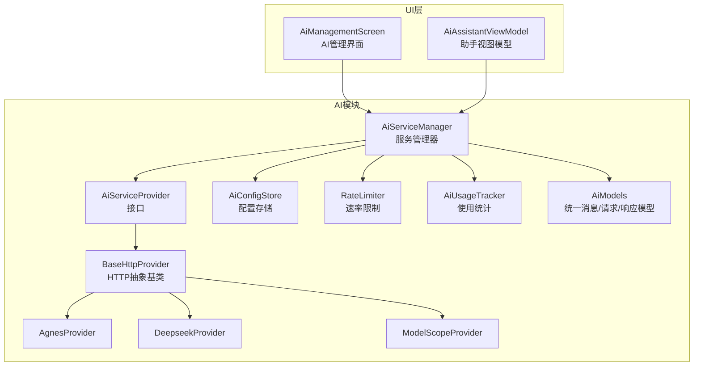
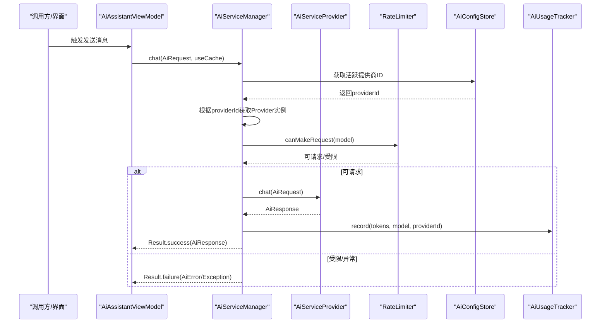
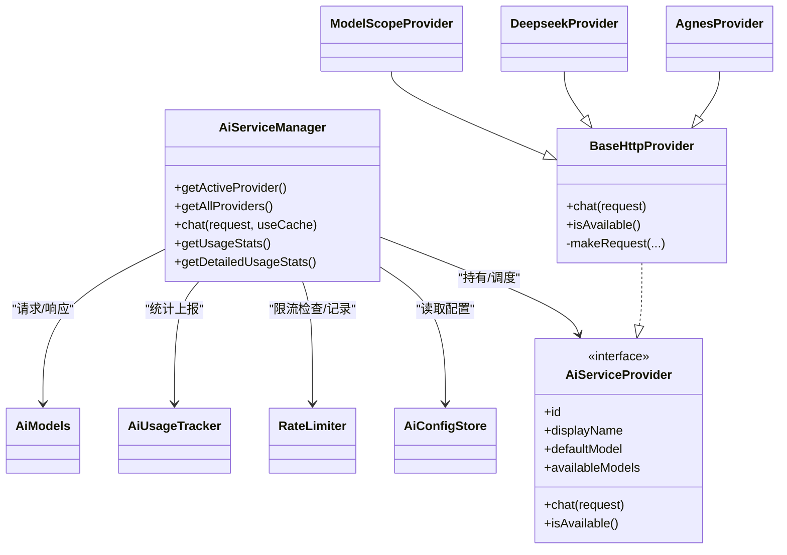
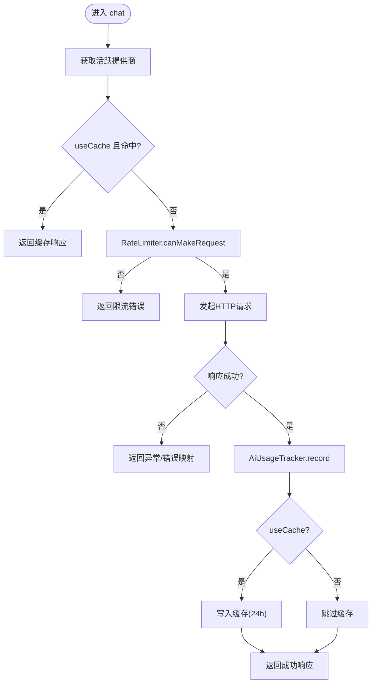

# AI服务管理器

<cite>
**本文引用的文件**
- [AiServiceManager.kt](file://app/src/main/java/com/diary/app/ai/AiServiceManager.kt)
- [AiServiceProvider.kt](file://app/src/main/java/com/diary/app/ai/AiServiceProvider.kt)
- [BaseHttpProvider.kt](file://app/src/main/java/com/diary/app/ai/BaseHttpProvider.kt)
- [AiConfigStore.kt](file://app/src/main/java/com/diary/app/ai/AiConfigStore.kt)
- [AiUsageTracker.kt](file://app/src/main/java/com/diary/app/ai/AiUsageTracker.kt)
- [AgnesProvider.kt](file://app/src/main/java/com/diary/app/ai/AgnesProvider.kt)
- [DeepseekProvider.kt](file://app/src/main/java/com/diary/app/ai/DeepseekProvider.kt)
- [ModelScopeProvider.kt](file://app/src/main/java/com/diary/app/ai/ModelScopeProvider.kt)
- [AiModels.kt](file://app/src/main/java/com/diary/app/ai/AiModels.kt)
- [RateLimiter.kt](file://app/src/main/java/com/diary/app/ai/RateLimiter.kt)
- [AiAssistantViewModel.kt](file://app/src/main/java/com/diary/app/ai/AiAssistantViewModel.kt)
- [AiManagementScreen.kt](file://app/src/main/java/com/diary/app/ui/tools/AiManagementScreen.kt)
- [AppContainer.kt](file://app/src/main/java/com/diary/app/di/AppContainer.kt)
- [InsightGenerator.kt](file://app/src/main/java/com/diary/app/ai/InsightGenerator.kt)
</cite>

## 目录
1. [简介](#简介)
2. [项目结构](#项目结构)
3. [核心组件](#核心组件)
4. [架构总览](#架构总览)
5. [组件详解](#组件详解)
6. [依赖关系分析](#依赖关系分析)
7. [性能与缓存策略](#性能与缓存策略)
8. [故障排查指南](#故障排查指南)
9. [结论](#结论)
10. [附录](#附录)

## 简介
本文件为“AI服务管理器”的深度技术文档，围绕 AiServiceManager 的核心架构与运行机制展开，重点覆盖以下主题：
- 服务初始化、提供商注册与动态切换
- 聊天接口的请求处理、响应缓存策略与错误处理
- 配置存储与使用统计的集成方式
- 生命周期管理与最佳实践
- 实际使用示例（含缓存开关、错误处理与性能监控）

## 项目结构
AI能力位于 app/src/main/java/com/diary/app/ai 目录下，采用“接口 + 抽象基类 + 多提供商实现 + 管理器 + 配置/统计”的分层组织方式。UI侧通过 AiManagementScreen 进行提供商配置与用量查看，业务逻辑由 AiAssistantViewModel 驱动。

图表来源
- [AiServiceManager.kt:10-24](file://app/src/main/java/com/diary/app/ai/AiServiceManager.kt#L10-L24)
- [AiServiceProvider.kt:3-11](file://app/src/main/java/com/diary/app/ai/AiServiceProvider.kt#L3-L11)
- [BaseHttpProvider.kt:10-14](file://app/src/main/java/com/diary/app/ai/BaseHttpProvider.kt#L10-L14)
- [AgnesProvider.kt:5-15](file://app/src/main/java/com/diary/app/ai/AgnesProvider.kt#L5-L15)
- [DeepseekProvider.kt:5-18](file://app/src/main/java/com/diary/app/ai/DeepseekProvider.kt#L5-L18)
- [ModelScopeProvider.kt:5-23](file://app/src/main/java/com/diary/app/ai/ModelScopeProvider.kt#L5-L23)
- [AiConfigStore.kt:5-31](file://app/src/main/java/com/diary/app/ai/AiConfigStore.kt#L5-L31)
- [RateLimiter.kt:6-24](file://app/src/main/java/com/diary/app/ai/RateLimiter.kt#L6-L24)
- [AiUsageTracker.kt:10-20](file://app/src/main/java/com/diary/app/ai/AiUsageTracker.kt#L10-L20)
- [AiModels.kt:4-26](file://app/src/main/java/com/diary/app/ai/AiModels.kt#L4-L26)
- [AiManagementScreen.kt:64-78](file://app/src/main/java/com/diary/app/ui/tools/AiManagementScreen.kt#L64-L78)
- [AiAssistantViewModel.kt:33-58](file://app/src/main/java/com/diary/app/ai/AiAssistantViewModel.kt#L33-L58)

章节来源
- [AiServiceManager.kt:10-24](file://app/src/main/java/com/diary/app/ai/AiServiceManager.kt#L10-L24)
- [AiManagementScreen.kt:64-78](file://app/src/main/java/com/diary/app/ui/tools/AiManagementScreen.kt#L64-L78)
- [AiAssistantViewModel.kt:33-58](file://app/src/main/java/com/diary/app/ai/AiAssistantViewModel.kt#L33-L58)

## 核心组件
- AiServiceManager：统一入口，负责提供商注册、活跃提供商选择、聊天请求调度、缓存读取与写入、错误包装与统计上报。
- AiServiceProvider：定义提供商契约（ID、显示名、可用模型、聊天与可用性检测）。
- BaseHttpProvider：HTTP抽象基类，封装通用网络请求、鉴权头、超时、限流检查、错误映射与响应解析。
- AgnesProvider/DeepseekProvider/ModelScopeProvider：具体提供商实现，覆盖默认模型、可用模型与特定超时配置。
- AiConfigStore：集中式配置存储，支持全局开关、活跃提供商、按提供商维度的API Key/Endpoint/Model持久化，并兼容旧键迁移。
- RateLimiter：每日总量与按模型用量的双维度限流，跨进程共享偏好存储。
- AiUsageTracker：按天聚合请求次数与Token消耗，支持模型与提供商维度统计。
- AiModels：统一的消息、请求、响应与流式分片模型，以及便捷构造函数。
- AiAssistantViewModel/AiManagementScreen：UI侧对话与提供商配置入口，驱动服务管理器执行聊天并展示用量。

章节来源
- [AiServiceManager.kt:10-104](file://app/src/main/java/com/diary/app/ai/AiServiceManager.kt#L10-L104)
- [AiServiceProvider.kt:3-11](file://app/src/main/java/com/diary/app/ai/AiServiceProvider.kt#L3-L11)
- [BaseHttpProvider.kt:10-119](file://app/src/main/java/com/diary/app/ai/BaseHttpProvider.kt#L10-L119)
- [AgnesProvider.kt:5-15](file://app/src/main/java/com/diary/app/ai/AgnesProvider.kt#L5-L15)
- [DeepseekProvider.kt:5-18](file://app/src/main/java/com/diary/app/ai/DeepseekProvider.kt#L5-L18)
- [ModelScopeProvider.kt:5-23](file://app/src/main/java/com/diary/app/ai/ModelScopeProvider.kt#L5-L23)
- [AiConfigStore.kt:5-132](file://app/src/main/java/com/diary/app/ai/AiConfigStore.kt#L5-L132)
- [RateLimiter.kt:6-94](file://app/src/main/java/com/diary/app/ai/RateLimiter.kt#L6-L94)
- [AiUsageTracker.kt:10-96](file://app/src/main/java/com/diary/app/ai/AiUsageTracker.kt#L10-L96)
- [AiModels.kt:4-59](file://app/src/main/java/com/diary/app/ai/AiModels.kt#L4-L59)
- [AiAssistantViewModel.kt:33-364](file://app/src/main/java/com/diary/app/ai/AiAssistantViewModel.kt#L33-L364)
- [AiManagementScreen.kt:64-603](file://app/src/main/java/com/diary/app/ui/tools/AiManagementScreen.kt#L64-L603)

## 架构总览
AiServiceManager 作为控制中心，持有 AiConfigStore、RateLimiter 与多个 AiServiceProvider 实例。聊天流程在 IO 上下文中调用活跃提供商，支持可选缓存命中与Token统计上报。

图表来源
- [AiServiceManager.kt:43-61](file://app/src/main/java/com/diary/app/ai/AiServiceManager.kt#L43-L61)
- [BaseHttpProvider.kt:21-39](file://app/src/main/java/com/diary/app/ai/BaseHttpProvider.kt#L21-L39)
- [RateLimiter.kt:26-32](file://app/src/main/java/com/diary/app/ai/RateLimiter.kt#L26-L32)
- [AiUsageTracker.kt:27-60](file://app/src/main/java/com/diary/app/ai/AiUsageTracker.kt#L27-L60)

## 组件详解

### AiServiceManager：服务管理与聊天编排
- 初始化与提供商注册
  - 在构造阶段注册内置提供商（如 modelscope、agnes、deepseek），并通过 AiConfigStore 与 RateLimiter 注入。
- 活跃提供商选择
  - 通过 AiConfigStore.getActiveProvider(context) 获取当前活跃提供商ID，再从内存映射中取出对应实例。
- 聊天接口
  - 支持 useCache 参数，默认开启。若开启缓存且命中，则直接返回缓存响应；否则在 IO 上下文中调用提供商 chat 并写入缓存。
  - 成功后根据响应中的 totalTokens 上报 AiUsageTracker。
  - 异常捕获并包装为 Result.failure，便于上层统一处理。
- 缓存策略
  - 使用 SharedPreferences 存储，键为请求消息拼接后的 SHA-256 哈希，值为包含内容、模型、提供商ID与过期时间的 JSON。
  - TTL 为 24 小时，过期自动清理。
- 配置与统计
  - isAiEnabled：综合 AiConfigStore 的开关与是否已配置。
  - getUsageStats/getDetailedUsageStats：分别返回全局限流统计与按天聚合的模型/提供商维度统计。

章节来源
- [AiServiceManager.kt:10-24](file://app/src/main/java/com/diary/app/ai/AiServiceManager.kt#L10-L24)
- [AiServiceManager.kt:26-41](file://app/src/main/java/com/diary/app/ai/AiServiceManager.kt#L26-L41)
- [AiServiceManager.kt:43-61](file://app/src/main/java/com/diary/app/ai/AiServiceManager.kt#L43-L61)
- [AiServiceManager.kt:63-95](file://app/src/main/java/com/diary/app/ai/AiServiceManager.kt#L63-L95)

### AiServiceProvider 与 BaseHttpProvider：接口与HTTP实现
- 接口职责
  - 定义提供商标识、显示名、默认模型与可用模型列表。
  - 提供异步 chat 与 isAvailable 能力。
- HTTP抽象
  - 在 chat 中先校验配置与限流，随后组装标准 OpenAI 兼容请求体，设置 Authorization 与 Content-Type，发起HTTP请求。
  - 对常见HTTP状态码进行 AiError 映射（429/401/402等），并对响应结构进行解析，提取 content、model 与 total_tokens。
  - 记录请求以更新限流统计。

章节来源
- [AiServiceProvider.kt:3-11](file://app/src/main/java/com/diary/app/ai/AiServiceProvider.kt#L3-L11)
- [BaseHttpProvider.kt:21-39](file://app/src/main/java/com/diary/app/ai/BaseHttpProvider.kt#L21-L39)
- [BaseHttpProvider.kt:57-117](file://app/src/main/java/com/diary/app/ai/BaseHttpProvider.kt#L57-L117)

### 具体提供商实现
- AgnesProvider：默认模型为 agnes-2.0-flash，适合入门与免费场景。
- DeepseekProvider：支持 deepseek-v4-flash 与 deepseek-v4-pro，连接与读超时更长以适配其服务特性。
- ModelScopeProvider：提供多版本 Qwen 模型，连接与读超时适配其推理服务。

章节来源
- [AgnesProvider.kt:5-15](file://app/src/main/java/com/diary/app/ai/AgnesProvider.kt#L5-L15)
- [DeepseekProvider.kt:5-18](file://app/src/main/java/com/diary/app/ai/DeepseekProvider.kt#L5-L18)
- [ModelScopeProvider.kt:5-23](file://app/src/main/java/com/diary/app/ai/ModelScopeProvider.kt#L5-L23)

### 配置存储与迁移
- 键空间
  - 全局：ai_enabled、ai_active_provider
  - 按提供商：ai_key_{id}、ai_endpoint_{id}、ai_model_{id}
- 兼容性
  - 若不存在 per-provider 键，会尝试从旧键（agnes）迁移，保证平滑升级。
- UI交互
  - AiManagementScreen 提供配置弹窗，支持保存 API Key、Endpoint 与模型，并自动清洗 Endpoint 后缀。

章节来源
- [AiConfigStore.kt:5-132](file://app/src/main/java/com/diary/app/ai/AiConfigStore.kt#L5-L132)
- [AiManagementScreen.kt:257-278](file://app/src/main/java/com/diary/app/ui/tools/AiManagementScreen.kt#L257-L278)
- [AiManagementScreen.kt:504-602](file://app/src/main/java/com/diary/app/ui/tools/AiManagementScreen.kt#L504-L602)

### 速率限制与使用统计
- 速率限制
  - 每日总量上限与按模型用量上限，跨进程共享偏好存储，按自然日重置。
- 使用统计
  - 按天记录请求次数与Token总数，同时支持模型与提供商维度的聚合，用于界面展示与运营分析。

章节来源
- [RateLimiter.kt:6-94](file://app/src/main/java/com/diary/app/ai/RateLimiter.kt#L6-L94)
- [AiUsageTracker.kt:10-96](file://app/src/main/java/com/diary/app/ai/AiUsageTracker.kt#L10-L96)

### 数据模型与便捷构造
- 统一模型
  - AiMessage/AiRequest/AiResponse/AiStreamChunk 定义清晰的请求/响应结构。
- 便捷函数
  - aiRequest 支持快速构建带 systemPrompt 的请求，简化调用端代码。

章节来源
- [AiModels.kt:4-59](file://app/src/main/java/com/diary/app/ai/AiModels.kt#L4-L59)

### UI集成与工作流
- AiAssistantViewModel
  - 负责对话历史加载、消息发送、上下文构建、错误处理与消息持久化。
  - 发送消息时构建 systemPrompt 与历史消息，调用 aiService.chat，并将结果回写数据库与状态流。
- AiManagementScreen
  - 展示所有提供商卡片、当前活跃状态、配置按钮与今日用量统计。
  - 通过 AiConfigStore 切换活跃提供商并持久化。

章节来源
- [AiAssistantViewModel.kt:128-226](file://app/src/main/java/com/diary/app/ai/AiAssistantViewModel.kt#L128-L226)
- [AiManagementScreen.kt:64-278](file://app/src/main/java/com/diary/app/ui/tools/AiManagementScreen.kt#L64-L278)

## 依赖关系分析
- 管理器对提供商的依赖通过 AiConfigStore 的活跃提供商ID解耦，便于动态切换。
- BaseHttpProvider 统一封装网络细节，降低各提供商实现复杂度。
- RateLimiter 与 AiUsageTracker 与 AiServiceManager 解耦，通过方法调用进行统计上报。
- UI层仅依赖 AiServiceManager 与 AiConfigStore，保持业务逻辑清晰。

图表来源
- [AiServiceManager.kt:10-104](file://app/src/main/java/com/diary/app/ai/AiServiceManager.kt#L10-L104)
- [AiServiceProvider.kt:3-11](file://app/src/main/java/com/diary/app/ai/AiServiceProvider.kt#L3-L11)
- [BaseHttpProvider.kt:10-119](file://app/src/main/java/com/diary/app/ai/BaseHttpProvider.kt#L10-L119)
- [AgnesProvider.kt:5-15](file://app/src/main/java/com/diary/app/ai/AgnesProvider.kt#L5-L15)
- [DeepseekProvider.kt:5-18](file://app/src/main/java/com/diary/app/ai/DeepseekProvider.kt#L5-L18)
- [ModelScopeProvider.kt:5-23](file://app/src/main/java/com/diary/app/ai/ModelScopeProvider.kt#L5-L23)
- [AiConfigStore.kt:5-132](file://app/src/main/java/com/diary/app/ai/AiConfigStore.kt#L5-L132)
- [RateLimiter.kt:6-94](file://app/src/main/java/com/diary/app/ai/RateLimiter.kt#L6-L94)
- [AiUsageTracker.kt:10-96](file://app/src/main/java/com/diary/app/ai/AiUsageTracker.kt#L10-L96)
- [AiModels.kt:4-59](file://app/src/main/java/com/diary/app/ai/AiModels.kt#L4-L59)

## 性能与缓存策略
- 缓存命中路径
  - 请求消息序列经 SHA-256 得到键，命中即直接返回，避免重复网络请求。
  - 缓存条目包含过期时间，过期自动删除，确保一致性。
- 限流与并发
  - RateLimiter 在进入网络请求前进行检查，减少无效IO。
  - chat 在 Dispatchers.IO 执行，避免阻塞主线程。
- Token统计
  - 成功响应后上报 AiUsageTracker，支持模型/提供商维度聚合，便于成本控制与趋势分析。

图表来源
- [AiServiceManager.kt:43-61](file://app/src/main/java/com/diary/app/ai/AiServiceManager.kt#L43-L61)
- [AiServiceManager.kt:63-95](file://app/src/main/java/com/diary/app/ai/AiServiceManager.kt#L63-L95)
- [BaseHttpProvider.kt:25-38](file://app/src/main/java/com/diary/app/ai/BaseHttpProvider.kt#L25-L38)
- [AiUsageTracker.kt:27-60](file://app/src/main/java/com/diary/app/ai/AiUsageTracker.kt#L27-L60)

## 故障排查指南
- 未配置API Key
  - 现象：返回 AiError.NotConfigured 或抛出 AiError.NotConfigured。
  - 处理：在 AiManagementScreen 中完成提供商配置（API Key/Endpoint/Model）。
- 今日额度用尽
  - 现象：返回 AiError.RateLimited 或 HTTP 429。
  - 处理：等待次日或切换更低配额的提供商/模型。
- API Key无效/配额不足
  - 现象：HTTP 401/402，映射为 AiError.ApiError。
  - 处理：检查密钥有效性与账户余额。
- 网络异常/超时
  - 现象：SocketTimeoutException 或 Unknown AiError。
  - 处理：检查网络连通性与Endpoint正确性；必要时调整超时参数。
- 缓存异常
  - 现象：缓存读取失败或过期残留。
  - 处理：忽略缓存重新请求；或手动清理相关键值。

章节来源
- [BaseHttpProvider.kt:87-93](file://app/src/main/java/com/diary/app/ai/BaseHttpProvider.kt#L87-L93)
- [BaseHttpProvider.kt:34-38](file://app/src/main/java/com/diary/app/ai/BaseHttpProvider.kt#L34-L38)
- [AiAssistantViewModel.kt:201-213](file://app/src/main/java/com/diary/app/ai/AiAssistantViewModel.kt#L201-L213)

## 结论
AiServiceManager 通过“接口 + 抽象基类 + 多提供商 + 配置/统计”四件套，实现了高内聚、低耦合的AI服务编排。其具备完善的限流与统计能力、可选缓存与错误映射，配合UI层的配置与用量展示，形成闭环的用户体验与可观测性体系。建议在生产环境中结合缓存策略与限额阈值进行灰度验证，并持续关注Token成本与稳定性指标。

## 附录

### 使用示例：如何进行AI对话（含缓存、错误处理与监控）
- 基本对话（禁用缓存）
  - 步骤：准备 AiRequest（可使用 aiRequest 快捷函数），调用 aiService.chat(request, useCache = false)，解析 Result。
  - 参考路径：[AiAssistantViewModel.kt:176-183](file://app/src/main/java/com/diary/app/ai/AiAssistantViewModel.kt#L176-L183)
- 启用缓存
  - 默认行为：aiService.chat(request, useCache = true) 将优先命中缓存，未命中则请求网络并写入缓存。
  - 参考路径：[AiServiceManager.kt:47-56](file://app/src/main/java/com/diary/app/ai/AiServiceManager.kt#L47-L56)
- 错误处理
  - 统一通过 Result 处理，异常会被包装为 AiError 或 Unknown；UI层可根据错误类型提示用户。
  - 参考路径：[AiAssistantViewModel.kt:201-213](file://app/src/main/java/com/diary/app/ai/AiAssistantViewModel.kt#L201-L213)
- 性能监控
  - 通过 aiService.getUsageStats() 与 getDetailedUsageStats() 获取全局与按天聚合的统计信息。
  - 参考路径：[AiServiceManager.kt:39-41](file://app/src/main/java/com/diary/app/ai/AiServiceManager.kt#L39-L41)

### 生命周期管理与最佳实践
- 生命周期
  - AiServiceManager 作为单例式管理器，建议在应用启动时完成初始化（注册提供商、加载配置）。
  - 限流与统计基于偏好存储，天然跨进程共享，注意按自然日重置。
- 最佳实践
  - 为不同提供商设置合理的超时与模型限额，避免长时间阻塞。
  - 在高频对话场景启用缓存，减少重复请求与Token消耗。
  - 通过 AiManagementScreen 动态切换提供商，结合用量统计进行成本优化。
  - 对异常进行分级处理，避免UI线程阻塞，必要时降级为本地生成提示。

章节来源
- [AiServiceManager.kt:10-24](file://app/src/main/java/com/diary/app/ai/AiServiceManager.kt#L10-L24)
- [RateLimiter.kt:71-81](file://app/src/main/java/com/diary/app/ai/RateLimiter.kt#L71-L81)
- [AiManagementScreen.kt:64-278](file://app/src/main/java/com/diary/app/ui/tools/AiManagementScreen.kt#L64-L278)