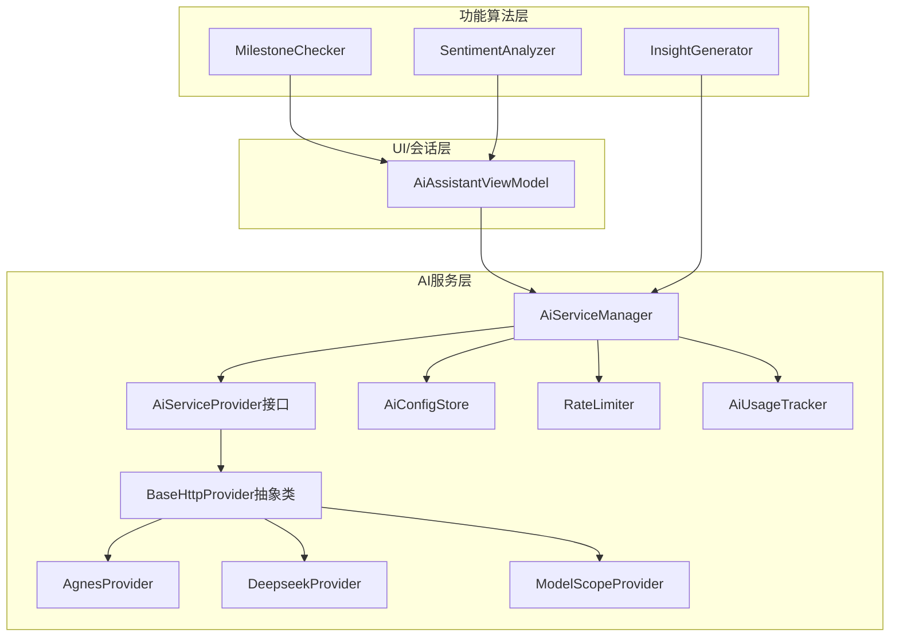
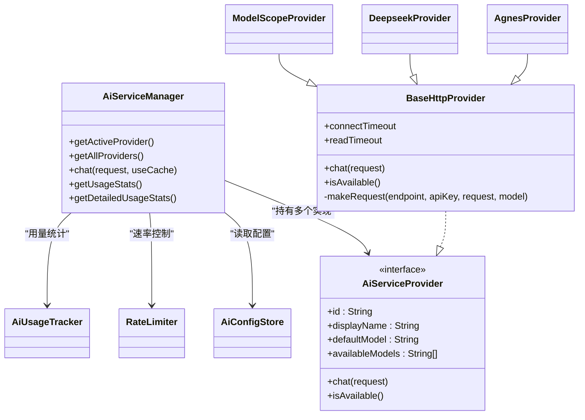
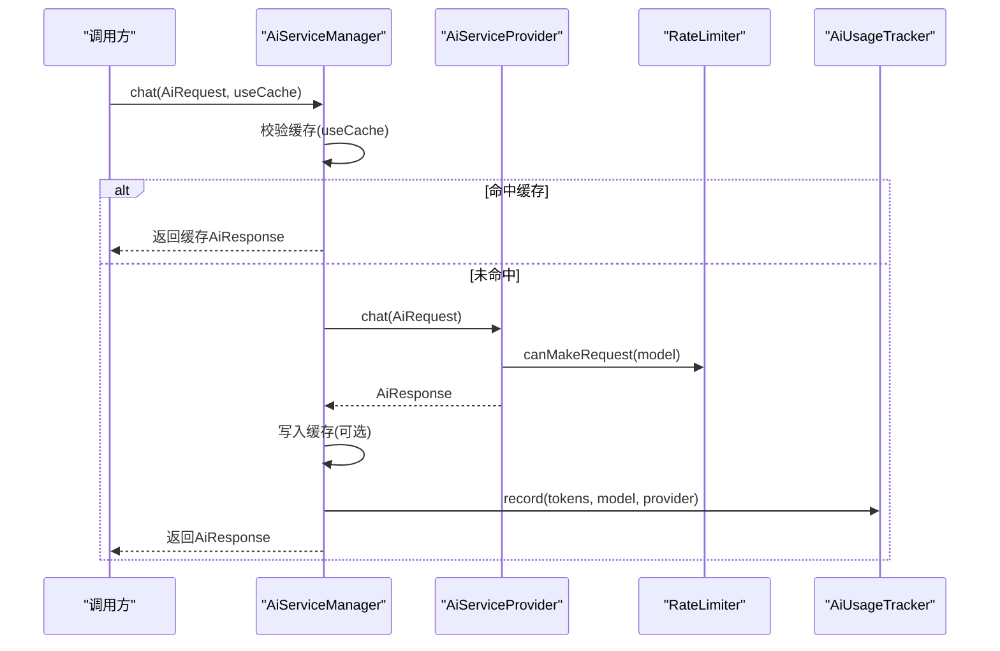
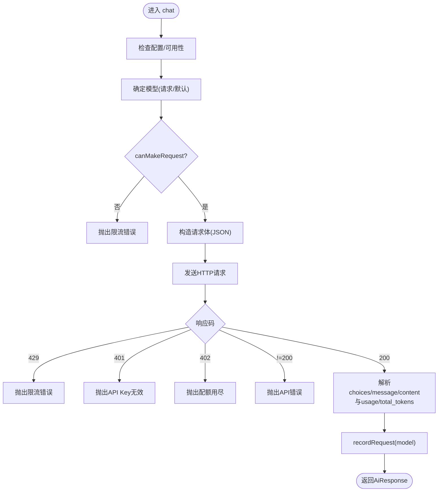
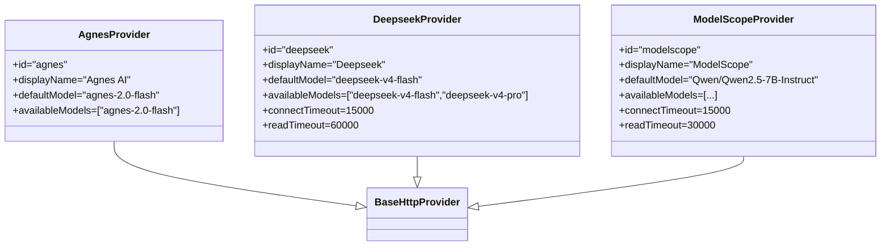
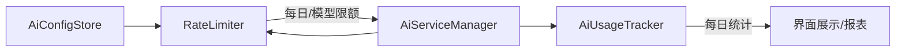
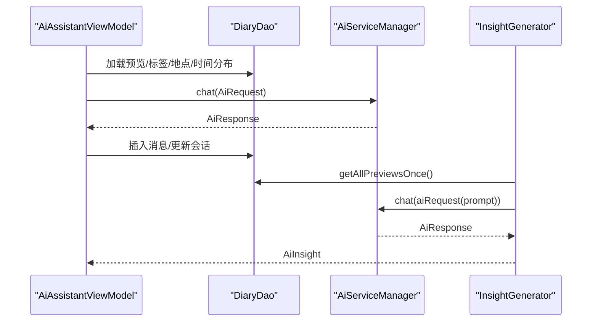
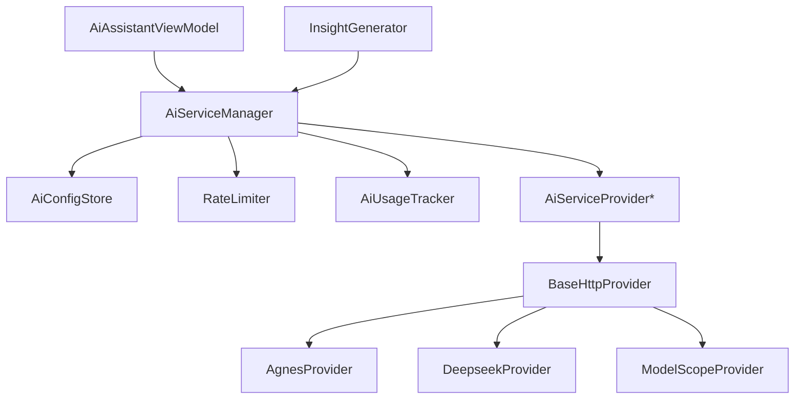

# AI服务集成

<cite>
**本文引用的文件**
- [AiServiceManager.kt](file://app/src/main/java/com/diary/app/ai/AiServiceManager.kt)
- [AiServiceProvider.kt](file://app/src/main/java/com/diary/app/ai/AiServiceProvider.kt)
- [BaseHttpProvider.kt](file://app/src/main/java/com/diary/app/ai/BaseHttpProvider.kt)
- [RateLimiter.kt](file://app/src/main/java/com/diary/app/ai/RateLimiter.kt)
- [AiConfigStore.kt](file://app/src/main/java/com/diary/app/ai/AiConfigStore.kt)
- [AgnesProvider.kt](file://app/src/main/java/com/diary/app/ai/AgnesProvider.kt)
- [DeepseekProvider.kt](file://app/src/main/java/com/diary/app/ai/DeepseekProvider.kt)
- [ModelScopeProvider.kt](file://app/src/main/java/com/diary/app/ai/ModelScopeProvider.kt)
- [AiModels.kt](file://app/src/main/java/com/diary/app/ai/AiModels.kt)
- [AiUsageTracker.kt](file://app/src/main/java/com/diary/app/ai/AiUsageTracker.kt)
- [InsightGenerator.kt](file://app/src/main/java/com/diary/app/ai/InsightGenerator.kt)
- [MilestoneChecker.kt](file://app/src/main/java/com/diary/app/ai/MilestoneChecker.kt)
- [AiAssistantViewModel.kt](file://app/src/main/java/com/diary/app/ai/AiAssistantViewModel.kt)
- [SentimentAnalyzer.kt](file://app/src/main/java/com/diary/app/data/SentimentAnalyzer.kt)
</cite>

## 目录
1. [简介](#简介)
2. [项目结构](#项目结构)
3. [核心组件](#核心组件)
4. [架构总览](#架构总览)
5. [详细组件分析](#详细组件分析)
6. [依赖分析](#依赖分析)
7. [性能考虑](#性能考虑)
8. [故障排查指南](#故障排查指南)
9. [结论](#结论)
10. [附录](#附录)

## 简介
本文件系统化梳理 DiaryApp 的 AI 服务集成方案，涵盖 AI 服务管理器的设计与多提供商支持、HTTP 调用与参数配置、速率控制与使用统计、以及内容生成、情感分析与洞察生成等核心能力。文档以“可读性优先”的原则，配合图示帮助非专业读者理解整体架构与关键流程。

## 项目结构
AI 相关代码集中在 app/src/main/java/com/diary/app/ai 及 app/src/main/java/com/diary/app/data 下，采用按职责分层组织：
- 接口与基础抽象：AiServiceProvider、BaseHttpProvider
- 服务编排：AiServiceManager
- 配置与限流：AiConfigStore、RateLimiter、AiUsageTracker
- 提供商实现：AgnesProvider、DeepseekProvider、ModelScopeProvider
- 数据模型与错误类型：AiModels
- 功能算法：InsightGenerator、MilestoneChecker
- 上下文与会话：AiAssistantViewModel
- 辅助分析：SentimentAnalyzer

图表来源
- [AiServiceManager.kt:10-24](file://app/src/main/java/com/diary/app/ai/AiServiceManager.kt#L10-L24)
- [AiServiceProvider.kt:3-11](file://app/src/main/java/com/diary/app/ai/AiServiceProvider.kt#L3-L11)
- [BaseHttpProvider.kt:10-14](file://app/src/main/java/com/diary/app/ai/BaseHttpProvider.kt#L10-L14)
- [AgnesProvider.kt:5-15](file://app/src/main/java/com/diary/app/ai/AgnesProvider.kt#L5-L15)
- [DeepseekProvider.kt:5-18](file://app/src/main/java/com/diary/app/ai/DeepseekProvider.kt#L5-L18)
- [ModelScopeProvider.kt:5-23](file://app/src/main/java/com/diary/app/ai/ModelScopeProvider.kt#L5-L23)
- [AiConfigStore.kt:5-131](file://app/src/main/java/com/diary/app/ai/AiConfigStore.kt#L5-L131)
- [RateLimiter.kt:6-93](file://app/src/main/java/com/diary/app/ai/RateLimiter.kt#L6-L93)
- [AiUsageTracker.kt:10-95](file://app/src/main/java/com/diary/app/ai/AiUsageTracker.kt#L10-L95)
- [AiAssistantViewModel.kt:33-58](file://app/src/main/java/com/diary/app/ai/AiAssistantViewModel.kt#L33-L58)
- [InsightGenerator.kt:16-52](file://app/src/main/java/com/diary/app/ai/InsightGenerator.kt#L16-L52)
- [MilestoneChecker.kt:11-68](file://app/src/main/java/com/diary/app/ai/MilestoneChecker.kt#L11-L68)
- [SentimentAnalyzer.kt:7-101](file://app/src/main/java/com/diary/app/data/SentimentAnalyzer.kt#L7-L101)

章节来源
- [AiServiceManager.kt:10-24](file://app/src/main/java/com/diary/app/ai/AiServiceManager.kt#L10-L24)
- [AiServiceProvider.kt:3-11](file://app/src/main/java/com/diary/app/ai/AiServiceProvider.kt#L3-L11)
- [BaseHttpProvider.kt:10-14](file://app/src/main/java/com/diary/app/ai/BaseHttpProvider.kt#L10-L14)
- [AiConfigStore.kt:5-131](file://app/src/main/java/com/diary/app/ai/AiConfigStore.kt#L5-L131)
- [RateLimiter.kt:6-93](file://app/src/main/java/com/diary/app/ai/RateLimiter.kt#L6-L93)
- [AiUsageTracker.kt:10-95](file://app/src/main/java/com/diary/app/ai/AiUsageTracker.kt#L10-L95)
- [AgnesProvider.kt:5-15](file://app/src/main/java/com/diary/app/ai/AgnesProvider.kt#L5-L15)
- [DeepseekProvider.kt:5-18](file://app/src/main/java/com/diary/app/ai/DeepseekProvider.kt#L5-L18)
- [ModelScopeProvider.kt:5-23](file://app/src/main/java/com/diary/app/ai/ModelScopeProvider.kt#L5-L23)
- [AiAssistantViewModel.kt:33-58](file://app/src/main/java/com/diary/app/ai/AiAssistantViewModel.kt#L33-L58)
- [InsightGenerator.kt:16-52](file://app/src/main/java/com/diary/app/ai/InsightGenerator.kt#L16-L52)
- [MilestoneChecker.kt:11-68](file://app/src/main/java/com/diary/app/ai/MilestoneChecker.kt#L11-L68)
- [SentimentAnalyzer.kt:7-101](file://app/src/main/java/com/diary/app/data/SentimentAnalyzer.kt#L7-L101)

## 核心组件
- AiServiceManager：统一入口，负责提供商注册、活跃提供商选择、缓存命中、调用转发、用量统计与错误处理。
- AiServiceProvider：定义提供商统一接口，包含标识、显示名、可用模型、聊天与可用性检查方法。
- BaseHttpProvider：HTTP 抽象基类，封装通用鉴权、端点清理、请求体构造、响应解析、错误映射与速率记录。
- AgnesProvider/DeepseekProvider/ModelScopeProvider：具体提供商实现，覆盖 id、显示名、默认模型与可用模型列表，并可覆写超时等细节。
- AiConfigStore：集中式配置存储，支持全局开关、活跃提供商、按提供商独立的 API Key、Endpoint、Model，兼容历史键迁移。
- RateLimiter：每日与模型级双维度限流，含统计查询与重置逻辑。
- AiUsageTracker：按日统计请求次数、Token 数量及按模型/提供商细分的使用明细。
- InsightGenerator：基于近期日记生成“心情问候/鼓励/模式/问好”等洞察，具备回退到本地生成的能力。
- MilestoneChecker：计算连续写作天数与累计字数里程碑，触发通知。
- AiAssistantViewModel：会话与上下文构建，调用 AI 服务并持久化消息。
- SentimentAnalyzer：简单情感分析器，用于辅助 UI 展示与提醒策略。

章节来源
- [AiServiceManager.kt:10-103](file://app/src/main/java/com/diary/app/ai/AiServiceManager.kt#L10-L103)
- [AiServiceProvider.kt:3-11](file://app/src/main/java/com/diary/app/ai/AiServiceProvider.kt#L3-L11)
- [BaseHttpProvider.kt:10-118](file://app/src/main/java/com/diary/app/ai/BaseHttpProvider.kt#L10-L118)
- [AgnesProvider.kt:5-15](file://app/src/main/java/com/diary/app/ai/AgnesProvider.kt#L5-L15)
- [DeepseekProvider.kt:5-18](file://app/src/main/java/com/diary/app/ai/DeepseekProvider.kt#L5-L18)
- [ModelScopeProvider.kt:5-23](file://app/src/main/java/com/diary/app/ai/ModelScopeProvider.kt#L5-L23)
- [AiConfigStore.kt:5-131](file://app/src/main/java/com/diary/app/ai/AiConfigStore.kt#L5-L131)
- [RateLimiter.kt:6-93](file://app/src/main/java/com/diary/app/ai/RateLimiter.kt#L6-L93)
- [AiUsageTracker.kt:10-95](file://app/src/main/java/com/diary/app/ai/AiUsageTracker.kt#L10-L95)
- [InsightGenerator.kt:16-173](file://app/src/main/java/com/diary/app/ai/InsightGenerator.kt#L16-L173)
- [MilestoneChecker.kt:11-106](file://app/src/main/java/com/diary/app/ai/MilestoneChecker.kt#L11-L106)
- [AiAssistantViewModel.kt:33-363](file://app/src/main/java/com/diary/app/ai/AiAssistantViewModel.kt#L33-L363)
- [SentimentAnalyzer.kt:7-101](file://app/src/main/java/com/diary/app/data/SentimentAnalyzer.kt#L7-L101)

## 架构总览
AI 服务采用“管理器 + 抽象 + 具体提供商”的分层设计。管理器负责：
- 选择活跃提供商
- 缓存命中与写入
- 调用转发至提供商
- 记录 Token 使用与提供商/模型维度统计
- 暴露使用统计与可用性检查

图表来源
- [AiServiceManager.kt:10-41](file://app/src/main/java/com/diary/app/ai/AiServiceManager.kt#L10-L41)
- [AiServiceProvider.kt:3-11](file://app/src/main/java/com/diary/app/ai/AiServiceProvider.kt#L3-L11)
- [BaseHttpProvider.kt:10-51](file://app/src/main/java/com/diary/app/ai/BaseHttpProvider.kt#L10-L51)
- [AgnesProvider.kt:5-15](file://app/src/main/java/com/diary/app/ai/AgnesProvider.kt#L5-L15)
- [DeepseekProvider.kt:5-18](file://app/src/main/java/com/diary/app/ai/DeepseekProvider.kt#L5-L18)
- [ModelScopeProvider.kt:5-23](file://app/src/main/java/com/diary/app/ai/ModelScopeProvider.kt#L5-L23)
- [AiConfigStore.kt:5-131](file://app/src/main/java/com/diary/app/ai/AiConfigStore.kt#L5-L131)
- [RateLimiter.kt:6-93](file://app/src/main/java/com/diary/app/ai/RateLimiter.kt#L6-L93)
- [AiUsageTracker.kt:10-95](file://app/src/main/java/com/diary/app/ai/AiUsageTracker.kt#L10-L95)

## 详细组件分析

### AiServiceManager：统一服务编排
- 职责
  - 注册并维护多个提供商实例
  - 依据配置选择活跃提供商
  - 请求缓存（SHA-256 哈希键，SharedPreferences，24 小时 TTL）
  - 调用提供商并记录 Token 使用
  - 暴露使用统计与可用性查询
- 关键流程
  - chat：校验配置与缓存 → 转发至提供商 → 写入缓存 → 记录用量
  - 缓存键：对消息串拼接后做 SHA-256
- 错误处理
  - 捕获异常并返回 Result.failure，日志记录

图表来源
- [AiServiceManager.kt:43-61](file://app/src/main/java/com/diary/app/ai/AiServiceManager.kt#L43-L61)
- [AiServiceManager.kt:63-95](file://app/src/main/java/com/diary/app/ai/AiServiceManager.kt#L63-L95)
- [RateLimiter.kt:27-32](file://app/src/main/java/com/diary/app/ai/RateLimiter.kt#L27-L32)
- [AiUsageTracker.kt:28-60](file://app/src/main/java/com/diary/app/ai/AiUsageTracker.kt#L28-L60)

章节来源
- [AiServiceManager.kt:10-103](file://app/src/main/java/com/diary/app/ai/AiServiceManager.kt#L10-L103)

### BaseHttpProvider：HTTP 抽象与通用逻辑
- 职责
  - 读取配置（API Key、Endpoint、Model），执行可用性自检
  - 构造标准 OpenAI 风格请求体（model/messages/temperature/max_tokens/stream=false）
  - 解析响应（choices/message/content、usage/total_tokens）
  - 映射 HTTP 状态码为业务错误（429/401/402 等）
  - 记录请求并更新速率指标
- 超时策略
  - 默认连接/读取超时可由子类覆写（如 Deepseek/ModelScope）

图表来源
- [BaseHttpProvider.kt:21-51](file://app/src/main/java/com/diary/app/ai/BaseHttpProvider.kt#L21-L51)
- [BaseHttpProvider.kt:57-117](file://app/src/main/java/com/diary/app/ai/BaseHttpProvider.kt#L57-L117)

章节来源
- [BaseHttpProvider.kt:10-118](file://app/src/main/java/com/diary/app/ai/BaseHttpProvider.kt#L10-L118)

### 提供商实现：Agnes、Deepseek、ModelScope
- 共同点
  - 均继承 BaseHttpProvider，复用统一的 HTTP 调用与错误处理
  - 定义唯一 id、显示名、默认模型与可用模型列表
- 差异点
  - 超时时间不同（Deepseek/ModelScope 更长）
  - 可用模型集合不同（ModelScope 支持更多规模模型）

图表来源
- [AgnesProvider.kt:5-15](file://app/src/main/java/com/diary/app/ai/AgnesProvider.kt#L5-L15)
- [DeepseekProvider.kt:5-18](file://app/src/main/java/com/diary/app/ai/DeepseekProvider.kt#L5-L18)
- [ModelScopeProvider.kt:5-23](file://app/src/main/java/com/diary/app/ai/ModelScopeProvider.kt#L5-L23)

章节来源
- [AgnesProvider.kt:5-15](file://app/src/main/java/com/diary/app/ai/AgnesProvider.kt#L5-L15)
- [DeepseekProvider.kt:5-18](file://app/src/main/java/com/diary/app/ai/DeepseekProvider.kt#L5-L18)
- [ModelScopeProvider.kt:5-23](file://app/src/main/java/com/diary/app/ai/ModelScopeProvider.kt#L5-L23)

### 配置与限流：AiConfigStore、RateLimiter、AiUsageTracker
- AiConfigStore
  - 存储全局开关、活跃提供商、按提供商独立的 API Key、Endpoint、Model
  - 兼容历史键（agnes）迁移
- RateLimiter
  - 每日总量与模型级限额（默认 2000/200）
  - 按日自动重置，线程安全
- AiUsageTracker
  - 按日统计请求次数、Token 总量，以及按模型/提供商细分的维度

图表来源
- [AiConfigStore.kt:5-131](file://app/src/main/java/com/diary/app/ai/AiConfigStore.kt#L5-L131)
- [RateLimiter.kt:6-93](file://app/src/main/java/com/diary/app/ai/RateLimiter.kt#L6-L93)
- [AiUsageTracker.kt:10-95](file://app/src/main/java/com/diary/app/ai/AiUsageTracker.kt#L10-L95)

章节来源
- [AiConfigStore.kt:5-131](file://app/src/main/java/com/diary/app/ai/AiConfigStore.kt#L5-L131)
- [RateLimiter.kt:6-93](file://app/src/main/java/com/diary/app/ai/RateLimiter.kt#L6-L93)
- [AiUsageTracker.kt:10-95](file://app/src/main/java/com/diary/app/ai/AiUsageTracker.kt#L10-L95)

### AI 功能实现：内容生成、情感分析、洞察生成
- 内容生成（AiAssistantViewModel）
  - 构建系统提示词与对话历史，调用 AiServiceManager.chat
  - 保存消息、更新会话标题、限制历史数量
- 情感分析（SentimentAnalyzer）
  - 基于关键词计数计算情感分数 [-1,1]，并提供标签与压力/新话题识别
- 洞察生成（InsightGenerator）
  - 基于近期日记统计（平均心情、天气偏好、时间段分布等）生成“问候/鼓励/模式/问好”
  - 支持回退到本地生成策略，避免无输入时失败
- 里程碑（MilestoneChecker）
  - 计算连续写作天数与累计字数里程碑，插入通知

图表来源
- [AiAssistantViewModel.kt:128-226](file://app/src/main/java/com/diary/app/ai/AiAssistantViewModel.kt#L128-L226)
- [AiAssistantViewModel.kt:228-330](file://app/src/main/java/com/diary/app/ai/AiAssistantViewModel.kt#L228-L330)
- [InsightGenerator.kt:23-52](file://app/src/main/java/com/diary/app/ai/InsightGenerator.kt#L23-L52)
- [InsightGenerator.kt:56-119](file://app/src/main/java/com/diary/app/ai/InsightGenerator.kt#L56-L119)

章节来源
- [AiAssistantViewModel.kt:33-363](file://app/src/main/java/com/diary/app/ai/AiAssistantViewModel.kt#L33-L363)
- [SentimentAnalyzer.kt:7-101](file://app/src/main/java/com/diary/app/data/SentimentAnalyzer.kt#L7-L101)
- [InsightGenerator.kt:16-173](file://app/src/main/java/com/diary/app/ai/InsightGenerator.kt#L16-L173)
- [MilestoneChecker.kt:11-106](file://app/src/main/java/com/diary/app/ai/MilestoneChecker.kt#L11-L106)

## 依赖分析
- 组件耦合
  - AiServiceManager 依赖 AiConfigStore、RateLimiter、AiUsageTracker 与 AiServiceProvider 实现
  - BaseHttpProvider 依赖 AiConfigStore、RateLimiter 并被具体提供商继承
  - ViewModel 通过应用注入的 AiServiceManager 调用 AI 能力
- 外部依赖
  - Android SharedPreferences 用于配置与缓存
  - Gson 用于序列化/反序列化
  - HttpURLConnection 用于 HTTP 请求
- 潜在风险
  - BaseHttpProvider 对 Endpoint 的清理逻辑依赖字符串处理
  - 速率控制与使用统计均为内存内状态，重启后重置（符合每日重置语义）

图表来源
- [AiServiceManager.kt:10-33](file://app/src/main/java/com/diary/app/ai/AiServiceManager.kt#L10-L33)
- [BaseHttpProvider.kt:10-14](file://app/src/main/java/com/diary/app/ai/BaseHttpProvider.kt#L10-L14)
- [AiAssistantViewModel.kt:33-58](file://app/src/main/java/com/diary/app/ai/AiAssistantViewModel.kt#L33-L58)
- [InsightGenerator.kt:23-44](file://app/src/main/java/com/diary/app/ai/InsightGenerator.kt#L23-L44)

章节来源
- [AiServiceManager.kt:10-33](file://app/src/main/java/com/diary/app/ai/AiServiceManager.kt#L10-L33)
- [BaseHttpProvider.kt:10-14](file://app/src/main/java/com/diary/app/ai/BaseHttpProvider.kt#L10-L14)
- [AiAssistantViewModel.kt:33-58](file://app/src/main/java/com/diary/app/ai/AiAssistantViewModel.kt#L33-L58)
- [InsightGenerator.kt:23-44](file://app/src/main/java/com/diary/app/ai/InsightGenerator.kt#L23-L44)

## 性能考虑
- 连接与读取超时
  - BaseHttpProvider 提供默认超时，子类可按提供商特性调整（如 Deepseek/ModelScope）
- 缓存策略
  - 24 小时 TTL 的请求级缓存，减少重复调用与网络开销
- 速率控制
  - 每日总量与模型级限额，避免突发流量导致配额耗尽
- 请求体精简
  - 固定 stream=false，简化响应解析路径
- 会话裁剪
  - 限制历史消息数量，降低上下文长度与 Token 消耗

章节来源
- [BaseHttpProvider.kt:18-19](file://app/src/main/java/com/diary/app/ai/BaseHttpProvider.kt#L18-L19)
- [DeepseekProvider.kt:16-18](file://app/src/main/java/com/diary/app/ai/DeepseekProvider.kt#L16-L18)
- [ModelScopeProvider.kt:21-23](file://app/src/main/java/com/diary/app/ai/ModelScopeProvider.kt#L21-L23)
- [AiServiceManager.kt:17-18](file://app/src/main/java/com/diary/app/ai/AiServiceManager.kt#L17-L18)
- [RateLimiter.kt:12-13](file://app/src/main/java/com/diary/app/ai/RateLimiter.kt#L12-L13)
- [AiAssistantViewModel.kt:218-224](file://app/src/main/java/com/diary/app/ai/AiAssistantViewModel.kt#L218-L224)

## 故障排查指南
- 常见错误与定位
  - 未配置 API Key：检查 AiConfigStore 是否存在有效 Key
  - 限流：查看 RateLimiter 的每日/模型限额与统计
  - 网络错误：检查连接/读取超时设置与 Endpoint 清理逻辑
  - 解析错误：确认响应包含 choices/message/content 且非空
- 日志与统计
  - AiServiceManager 在失败时记录日志
  - AiUsageTracker 提供按日维度的请求与 Token 统计
- 回退策略
  - InsightGenerator 在 AI 调用失败时回退到本地生成
  - AiAssistantViewModel 对网络超时给出友好提示

章节来源
- [AiServiceManager.kt:57-60](file://app/src/main/java/com/diary/app/ai/AiServiceManager.kt#L57-L60)
- [BaseHttpProvider.kt:87-93](file://app/src/main/java/com/diary/app/ai/BaseHttpProvider.kt#L87-L93)
- [InsightGenerator.kt:42-44](file://app/src/main/java/com/diary/app/ai/InsightGenerator.kt#L42-L44)
- [AiAssistantViewModel.kt:201-211](file://app/src/main/java/com/diary/app/ai/AiAssistantViewModel.kt#L201-L211)
- [AiUsageTracker.kt:62-73](file://app/src/main/java/com/diary/app/ai/AiUsageTracker.kt#L62-L73)

## 结论
DiaryApp 的 AI 服务集成以“管理器 + 抽象 + 多提供商”为核心，结合配置、限流与使用统计，形成稳定可控的调用链路。通过缓存与超时策略优化性能，通过回退机制提升健壮性。InsightGenerator、MilestoneChecker 与情感分析进一步增强用户体验与激励机制。建议后续可引入负载均衡与故障转移策略，以提升高并发场景下的稳定性与成本控制能力。

## 附录
- 配置项概览
  - 全局开关：ai_enabled
  - 活跃提供商：ai_active_provider
  - 按提供商存储：ai_key_{provider}、ai_endpoint_{provider}、ai_model_{provider}
- 速率限制
  - 每日总量：2000
  - 模型级限额：200
- 使用统计
  - requests/tokens 及按模型/提供商细分的维度

章节来源
- [AiConfigStore.kt:7-131](file://app/src/main/java/com/diary/app/ai/AiConfigStore.kt#L7-L131)
- [RateLimiter.kt:12-13](file://app/src/main/java/com/diary/app/ai/RateLimiter.kt#L12-L13)
- [AiUsageTracker.kt:87-94](file://app/src/main/java/com/diary/app/ai/AiUsageTracker.kt#L87-L94)