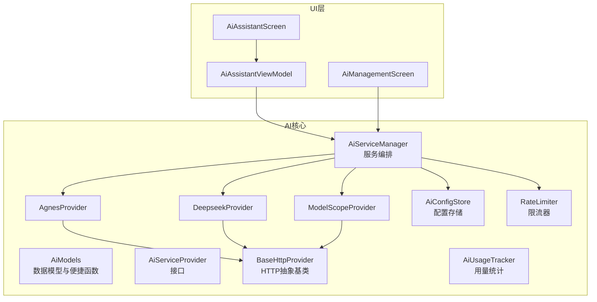
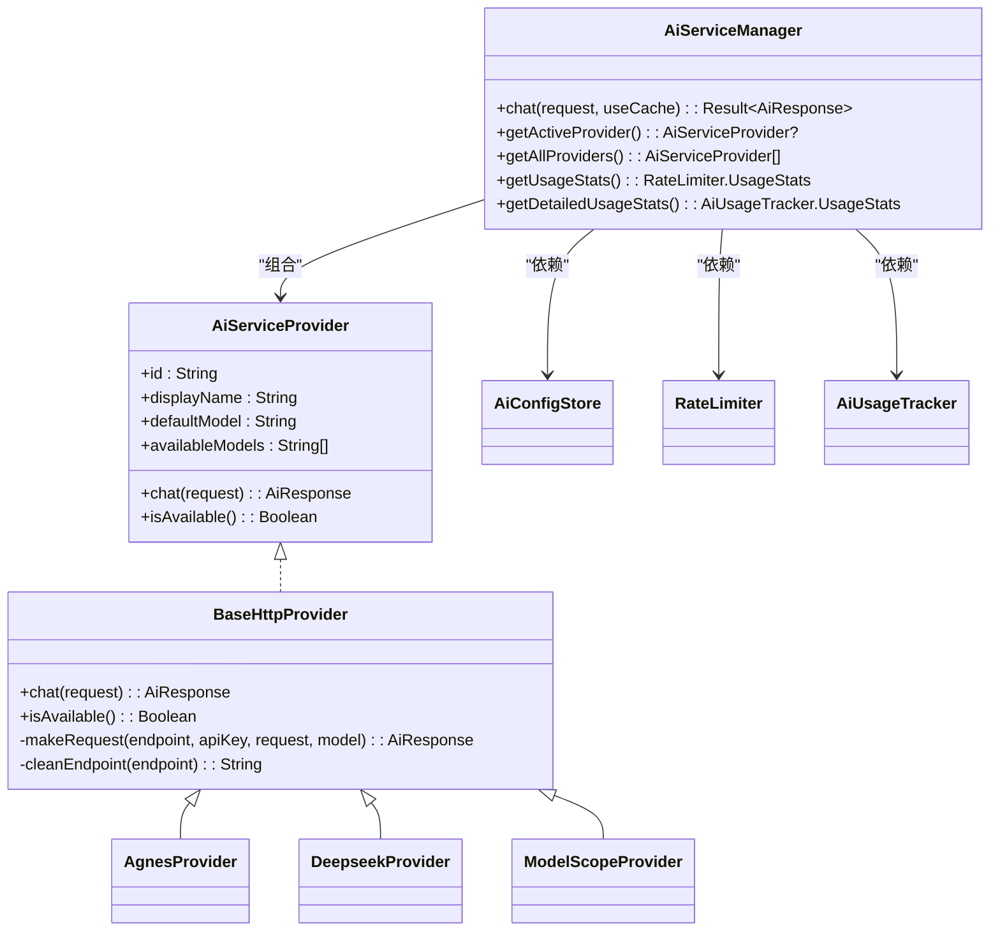
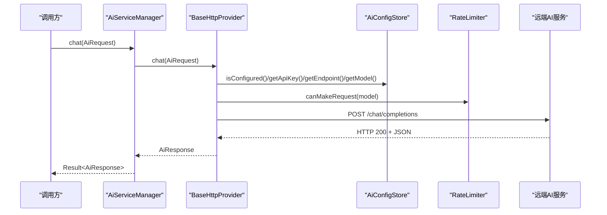
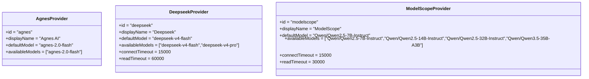
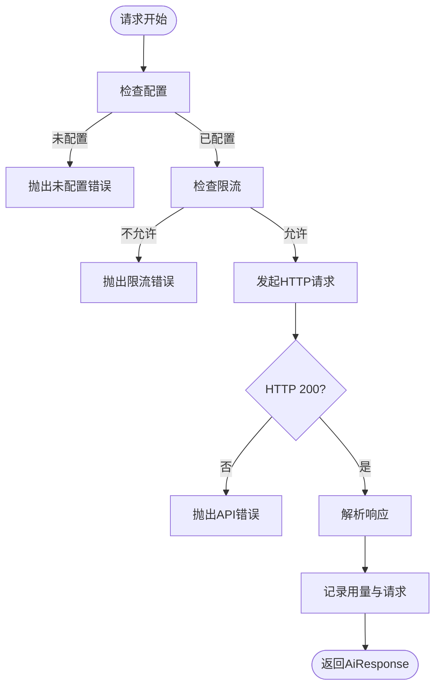
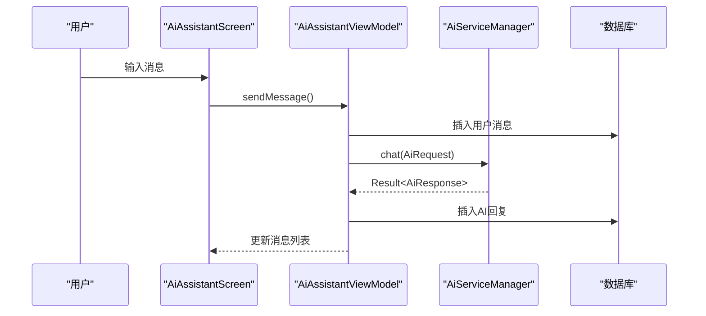
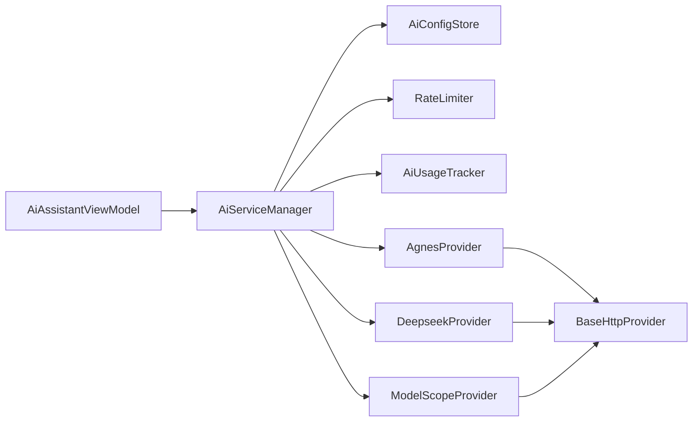

# AI服务API接口

<cite>
**本文引用的文件**
- [AiModels.kt](file://app/src/main/java/com/diary/app/ai/AiModels.kt)
- [BaseHttpProvider.kt](file://app/src/main/java/com/diary/app/ai/BaseHttpProvider.kt)
- [AiServiceManager.kt](file://app/src/main/java/com/diary/app/ai/AiServiceManager.kt)
- [AiConfigStore.kt](file://app/src/main/java/com/diary/app/ai/AiConfigStore.kt)
- [AgnesProvider.kt](file://app/src/main/java/com/diary/app/ai/AgnesProvider.kt)
- [DeepseekProvider.kt](file://app/src/main/java/com/diary/app/ai/DeepseekProvider.kt)
- [ModelScopeProvider.kt](file://app/src/main/java/com/diary/app/ai/ModelScopeProvider.kt)
- [AiServiceProvider.kt](file://app/src/main/java/com/diary/app/ai/AiServiceProvider.kt)
- [AiUsageTracker.kt](file://app/src/main/java/com/diary/app/ai/AiUsageTracker.kt)
- [RateLimiter.kt](file://app/src/main/java/com/diary/app/ai/RateLimiter.kt)
- [AiAssistantViewModel.kt](file://app/src/main/java/com/diary/app/ai/AiAssistantViewModel.kt)
- [AiAssistantScreen.kt](file://app/src/main/java/com/diary/app/ui/assistant/AiAssistantScreen.kt)
- [AiManagementScreen.kt](file://app/src/main/java/com/diary/app/ui/tools/AiManagementScreen.kt)
</cite>

## 目录
1. [简介](#简介)
2. [项目结构](#项目结构)
3. [核心组件](#核心组件)
4. [架构总览](#架构总览)
5. [详细组件分析](#详细组件分析)
6. [依赖关系分析](#依赖关系分析)
7. [性能考虑](#性能考虑)
8. [故障排查指南](#故障排查指南)
9. [结论](#结论)
10. [附录](#附录)

## 简介
本文件系统性梳理了日记应用中的AI服务API接口设计与实现，覆盖统一请求/响应数据模型、错误类型与处理策略、便捷构建函数、多提供商集成与差异对比、以及限流与用量统计机制。目标是帮助开发者快速理解并正确使用AI服务，同时为UI层与业务逻辑提供清晰的对接指南。

## 项目结构
AI相关能力主要集中在应用模块的ai包内，并通过管理器与配置存储对外暴露统一能力；UI层通过视图模型与屏幕进行交互。

图表来源
- [AiModels.kt:1-59](file://app/src/main/java/com/diary/app/ai/AiModels.kt#L1-L59)
- [AiServiceProvider.kt:1-12](file://app/src/main/java/com/diary/app/ai/AiServiceProvider.kt#L1-L12)
- [BaseHttpProvider.kt:1-119](file://app/src/main/java/com/diary/app/ai/BaseHttpProvider.kt#L1-L119)
- [AgnesProvider.kt:1-16](file://app/src/main/java/com/diary/app/ai/AgnesProvider.kt#L1-L16)
- [DeepseekProvider.kt:1-19](file://app/src/main/java/com/diary/app/ai/DeepseekProvider.kt#L1-L19)
- [ModelScopeProvider.kt:1-24](file://app/src/main/java/com/diary/app/ai/ModelScopeProvider.kt#L1-L24)
- [AiConfigStore.kt:1-132](file://app/src/main/java/com/diary/app/ai/AiConfigStore.kt#L1-L132)
- [RateLimiter.kt:1-94](file://app/src/main/java/com/diary/app/ai/RateLimiter.kt#L1-L94)
- [AiUsageTracker.kt:1-96](file://app/src/main/java/com/diary/app/ai/AiUsageTracker.kt#L1-L96)
- [AiServiceManager.kt:1-104](file://app/src/main/java/com/diary/app/ai/AiServiceManager.kt#L1-L104)
- [AiAssistantViewModel.kt:1-364](file://app/src/main/java/com/diary/app/ai/AiAssistantViewModel.kt#L1-L364)
- [AiAssistantScreen.kt:1-571](file://app/src/main/java/com/diary/app/ui/assistant/AiAssistantScreen.kt#L1-L571)
- [AiManagementScreen.kt:1-603](file://app/src/main/java/com/diary/app/ui/tools/AiManagementScreen.kt#L1-L603)

章节来源
- [AiServiceManager.kt:20-24](file://app/src/main/java/com/diary/app/ai/AiServiceManager.kt#L20-L24)
- [AiConfigStore.kt:26-31](file://app/src/main/java/com/diary/app/ai/AiConfigStore.kt#L26-L31)
- [AiServiceProvider.kt:3-11](file://app/src/main/java/com/diary/app/ai/AiServiceProvider.kt#L3-L11)

## 核心组件
- 数据模型与便捷函数
  - AiMessage：统一的消息元素，包含角色与内容
  - AiRequest：统一请求体，包含消息列表、可选模型、温度与最大token数
  - AiResponse：统一响应体，包含内容、模型、提供商标识与token用量
  - AiStreamChunk：流式分片（delta与完成标记）
  - AiError：统一错误类型，涵盖未配置、限流、网络、API错误、解析错误与未知错误
  - aiRequest：便捷构建函数，支持系统提示与默认参数
- 接口与抽象
  - AiServiceProvider：定义提供商接口（id、显示名、默认模型、可用模型、聊天与可用性检测）
  - BaseHttpProvider：HTTP抽象基类，封装鉴权、端点清理、请求构造、响应解析与错误映射
- 服务编排与配置
  - AiServiceManager：聚合提供商、缓存、限流与用量统计，负责对外统一调用
  - AiConfigStore：跨提供商配置存储（API Key、Endpoint、模型），兼容历史键
  - RateLimiter：每日总量与按模型用量限制
  - AiUsageTracker：按日期、模型、提供商维度统计请求次数与token消耗

章节来源
- [AiModels.kt:4-59](file://app/src/main/java/com/diary/app/ai/AiModels.kt#L4-L59)
- [AiServiceProvider.kt:3-11](file://app/src/main/java/com/diary/app/ai/AiServiceProvider.kt#L3-L11)
- [BaseHttpProvider.kt:10-119](file://app/src/main/java/com/diary/app/ai/BaseHttpProvider.kt#L10-L119)
- [AiServiceManager.kt:10-104](file://app/src/main/java/com/diary/app/ai/AiServiceManager.kt#L10-L104)
- [AiConfigStore.kt:5-132](file://app/src/main/java/com/diary/app/ai/AiConfigStore.kt#L5-L132)
- [RateLimiter.kt:6-94](file://app/src/main/java/com/diary/app/ai/RateLimiter.kt#L6-L94)
- [AiUsageTracker.kt:10-96](file://app/src/main/java/com/diary/app/ai/AiUsageTracker.kt#L10-L96)

## 架构总览
AI服务采用“接口+抽象基类+多提供商”的分层设计，AiServiceManager作为门面协调配置、限流、缓存与用量统计，具体提供商继承BaseHttpProvider实现HTTP调用细节。

图表来源
- [AiServiceProvider.kt:3-11](file://app/src/main/java/com/diary/app/ai/AiServiceProvider.kt#L3-L11)
- [BaseHttpProvider.kt:10-119](file://app/src/main/java/com/diary/app/ai/BaseHttpProvider.kt#L10-L119)
- [AgnesProvider.kt:5-15](file://app/src/main/java/com/diary/app/ai/AgnesProvider.kt#L5-L15)
- [DeepseekProvider.kt:5-18](file://app/src/main/java/com/diary/app/ai/DeepseekProvider.kt#L5-L18)
- [ModelScopeProvider.kt:5-23](file://app/src/main/java/com/diary/app/ai/ModelScopeProvider.kt#L5-L23)
- [AiServiceManager.kt:10-104](file://app/src/main/java/com/diary/app/ai/AiServiceManager.kt#L10-L104)
- [AiConfigStore.kt:5-132](file://app/src/main/java/com/diary/app/ai/AiConfigStore.kt#L5-L132)
- [RateLimiter.kt:6-94](file://app/src/main/java/com/diary/app/ai/RateLimiter.kt#L6-L94)
- [AiUsageTracker.kt:10-96](file://app/src/main/java/com/diary/app/ai/AiUsageTracker.kt#L10-L96)

## 详细组件分析

### 数据模型与便捷函数
- 字段定义与用途
  - AiMessage
    - role：消息角色，如system、user、assistant
    - content：消息文本
  - AiRequest
    - messages：消息列表
    - model：可选，null时使用提供商默认模型
    - temperature：采样温度，默认0.7
    - maxTokens：最大生成token数，默认512
  - AiResponse
    - content：模型回复内容
    - model：实际使用的模型标识
    - providerId：提供商标识
    - totalTokens：本次请求总token用量
  - AiStreamChunk
    - delta：本次增量内容
    - isFinished：是否结束
  - AiError
    - NotConfigured：未配置API Key
    - RateLimited：超出当日/模型限额
    - NetworkError：网络不可用
    - ApiError(code, message)：HTTP错误码与描述
    - ParseError(message)：响应解析失败
    - Unknown(cause)：未知异常
  - aiRequest(userMessage, systemPrompt?, model?, temperature?, maxTokens?)
    - 快速构建AiRequest，自动注入system与user消息
- 使用示例（路径参考）
  - 构建基础请求：[AiAssistantViewModel.kt:176-183](file://app/src/main/java/com/diary/app/ai/AiAssistantViewModel.kt#L176-L183)
  - 构建带系统提示的请求：[AiAssistantViewModel.kt:160-174](file://app/src/main/java/com/diary/app/ai/AiAssistantViewModel.kt#L160-L174)
  - 便捷构建函数：[AiModels.kt:46-59](file://app/src/main/java/com/diary/app/ai/AiModels.kt#L46-L59)

章节来源
- [AiModels.kt:4-59](file://app/src/main/java/com/diary/app/ai/AiModels.kt#L4-L59)
- [AiAssistantViewModel.kt:160-183](file://app/src/main/java/com/diary/app/ai/AiAssistantViewModel.kt#L160-L183)

### HTTP抽象与统一请求/响应格式
- 请求流程
  - 配置校验：若未配置则抛出未配置错误
  - 模型选择：优先使用请求指定模型，否则使用配置存储中的模型，再回退到提供商默认模型
  - 限流检查：基于RateLimiter判断是否允许发起请求
  - 发起HTTP请求：POST /chat/completions，携带model、messages、temperature、max_tokens、stream=false
  - 错误映射：429映射为限流，401映射为API Key无效，402映射为配额用尽，其他非200映射为API错误
  - 响应解析：提取choices[0].message.content与usage.total_tokens，构造AiResponse
- 统一响应格式
  - 返回AiResponse，包含content、model、providerId、totalTokens
- 超时与连接参数
  - 默认连接超时与读取超时由各提供商覆盖（如Deepseek/ModelScope）

图表来源
- [AiServiceManager.kt:43-61](file://app/src/main/java/com/diary/app/ai/AiServiceManager.kt#L43-L61)
- [BaseHttpProvider.kt:21-39](file://app/src/main/java/com/diary/app/ai/BaseHttpProvider.kt#L21-L39)
- [BaseHttpProvider.kt:57-117](file://app/src/main/java/com/diary/app/ai/BaseHttpProvider.kt#L57-L117)
- [AiConfigStore.kt:26-31](file://app/src/main/java/com/diary/app/ai/AiConfigStore.kt#L26-L31)
- [RateLimiter.kt:27-32](file://app/src/main/java/com/diary/app/ai/RateLimiter.kt#L27-L32)

章节来源
- [BaseHttpProvider.kt:21-117](file://app/src/main/java/com/diary/app/ai/BaseHttpProvider.kt#L21-L117)
- [AiServiceManager.kt:43-61](file://app/src/main/java/com/diary/app/ai/AiServiceManager.kt#L43-L61)

### 错误类型与处理策略
- 分类与含义
  - 未配置：缺少API Key或未选择提供商
  - 限流：当日总量或单模型用量超限
  - 网络：网络不可用或连接超时
  - API错误：HTTP状态码非200或特定错误码
  - 解析错误：响应结构不符合预期
  - 未知错误：其他异常包装为未知错误
- 处理建议
  - UI层捕获并展示友好提示（如“网络不太好”、“稍后再聊”）
  - 对于网络/超时错误，可引导用户检查网络或重试
  - 对于配额/限流，提示用户更换提供商或等待重置

章节来源
- [AiModels.kt:28-43](file://app/src/main/java/com/diary/app/ai/AiModels.kt#L28-L43)
- [BaseHttpProvider.kt:87-93](file://app/src/main/java/com/diary/app/ai/BaseHttpProvider.kt#L87-L93)
- [AiAssistantViewModel.kt:201-213](file://app/src/main/java/com/diary/app/ai/AiAssistantViewModel.kt#L201-L213)

### 便捷构建函数与最佳实践
- aiRequest函数
  - 支持传入用户消息、可选系统提示、模型、温度与最大token数
  - 自动将system与user消息拼接到messages列表
- 最佳实践
  - 在调用前确保已配置API Key与Endpoint
  - 合理设置temperature与maxTokens，平衡创造性与成本
  - 使用AiServiceManager的缓存能力减少重复请求
  - 对网络异常进行降级处理，避免阻塞UI线程

章节来源
- [AiModels.kt:46-59](file://app/src/main/java/com/diary/app/ai/AiModels.kt#L46-L59)
- [AiServiceManager.kt:47-56](file://app/src/main/java/com/diary/app/ai/AiServiceManager.kt#L47-L56)

### 多提供商集成与差异对比
- 提供商注册与选择
  - AiServiceManager在初始化时注册modelscope、agnes、deepseek三种提供商
  - 通过AiConfigStore.getActiveProvider()决定当前活跃提供商
- 默认模型与可用模型
  - Agnes：默认模型为agnes-2.0-flash，仅一种可用模型
  - Deepseek：默认模型为deepseek-v4-flash，支持pro版本
  - ModelScope：默认模型为Qwen/Qwen2.5-7B-Instruct，支持多种规模
- 连接与读取超时
  - Deepseek与ModelScope提供更长的读取超时，适配大模型推理延迟
- Endpoint与兼容性
  - BaseHttpProvider对Endpoint进行清理，自动拼接/chat/completions
  - UI层提供配置弹窗，支持自定义Endpoint与模型选择

图表来源
- [AgnesProvider.kt:5-15](file://app/src/main/java/com/diary/app/ai/AgnesProvider.kt#L5-L15)
- [DeepseekProvider.kt:5-18](file://app/src/main/java/com/diary/app/ai/DeepseekProvider.kt#L5-L18)
- [ModelScopeProvider.kt:5-23](file://app/src/main/java/com/diary/app/ai/ModelScopeProvider.kt#L5-L23)

章节来源
- [AiServiceManager.kt:20-24](file://app/src/main/java/com/diary/app/ai/AiServiceManager.kt#L20-L24)
- [AiConfigStore.kt:26-31](file://app/src/main/java/com/diary/app/ai/AiConfigStore.kt#L26-L31)
- [AgnesProvider.kt:11-15](file://app/src/main/java/com/diary/app/ai/AgnesProvider.kt#L11-L15)
- [DeepseekProvider.kt:11-18](file://app/src/main/java/com/diary/app/ai/DeepseekProvider.kt#L11-L18)
- [ModelScopeProvider.kt:11-23](file://app/src/main/java/com/diary/app/ai/ModelScopeProvider.kt#L11-L23)

### 限流与用量统计
- 限流规则
  - 每日总量上限与按模型用量上限，跨模型独立计数
  - 新日期自动重置计数
- 用量统计
  - 按日期、模型、提供商维度统计请求次数与token消耗
  - UI层展示今日用量与模型明细

图表来源
- [BaseHttpProvider.kt:21-39](file://app/src/main/java/com/diary/app/ai/BaseHttpProvider.kt#L21-L39)
- [BaseHttpProvider.kt:87-117](file://app/src/main/java/com/diary/app/ai/BaseHttpProvider.kt#L87-L117)
- [RateLimiter.kt:27-52](file://app/src/main/java/com/diary/app/ai/RateLimiter.kt#L27-L52)
- [AiUsageTracker.kt:28-60](file://app/src/main/java/com/diary/app/ai/AiUsageTracker.kt#L28-L60)

章节来源
- [RateLimiter.kt:19-52](file://app/src/main/java/com/diary/app/ai/RateLimiter.kt#L19-L52)
- [AiUsageTracker.kt:62-73](file://app/src/main/java/com/diary/app/ai/AiUsageTracker.kt#L62-L73)

### UI集成与典型流程
- 对话界面
  - 用户输入消息后，AiAssistantViewModel构建上下文与历史消息，调用AiServiceManager.chat
  - 将用户消息与AI回复持久化到数据库，并更新UI状态
  - 对网络/超时错误进行降级提示，支持重试
- 管理界面
  - 展示各提供商配置状态与今日用量
  - 支持切换活跃提供商、修改API Key/Endpoint/模型

图表来源
- [AiAssistantScreen.kt:328-391](file://app/src/main/java/com/diary/app/ui/assistant/AiAssistantScreen.kt#L328-L391)
- [AiAssistantViewModel.kt:128-226](file://app/src/main/java/com/diary/app/ai/AiAssistantViewModel.kt#L128-L226)
- [AiServiceManager.kt:43-61](file://app/src/main/java/com/diary/app/ai/AiServiceManager.kt#L43-L61)

章节来源
- [AiAssistantScreen.kt:78-396](file://app/src/main/java/com/diary/app/ui/assistant/AiAssistantScreen.kt#L78-L396)
- [AiAssistantViewModel.kt:128-226](file://app/src/main/java/com/diary/app/ai/AiAssistantViewModel.kt#L128-L226)
- [AiManagementScreen.kt:63-278](file://app/src/main/java/com/diary/app/ui/tools/AiManagementScreen.kt#L63-L278)

## 依赖关系分析
- 组件耦合
  - AiServiceManager聚合提供商、配置、限流与用量统计，承担编排职责
  - BaseHttpProvider依赖AiConfigStore与RateLimiter，实现HTTP细节
  - UI层通过ViewModel与Manager交互，保持业务与界面解耦
- 外部依赖
  - 网络库：Java标准库HttpURLConnection
  - 序列化：Gson
  - 存储：SharedPreferences

图表来源
- [AiServiceManager.kt:12-24](file://app/src/main/java/com/diary/app/ai/AiServiceManager.kt#L12-L24)
- [BaseHttpProvider.kt:10-14](file://app/src/main/java/com/diary/app/ai/BaseHttpProvider.kt#L10-L14)
- [AiAssistantViewModel.kt:176-183](file://app/src/main/java/com/diary/app/ai/AiAssistantViewModel.kt#L176-L183)

章节来源
- [AiServiceManager.kt:12-24](file://app/src/main/java/com/diary/app/ai/AiServiceManager.kt#L12-L24)
- [AiConfigStore.kt:15-17](file://app/src/main/java/com/diary/app/ai/AiConfigStore.kt#L15-L17)
- [RateLimiter.kt:16-17](file://app/src/main/java/com/diary/app/ai/RateLimiter.kt#L16-L17)
- [AiUsageTracker.kt:19-20](file://app/src/main/java/com/diary/app/ai/AiUsageTracker.kt#L19-L20)

## 性能考虑
- 缓存策略
  - AiServiceManager对请求结果进行SHA-256哈希缓存，TTL 24小时，显著降低重复请求开销
- 限流与配额
  - 通过RateLimiter控制每日总量与模型用量，避免触发远端限流
- 超时配置
  - 不同提供商设置不同的连接与读取超时，平衡稳定性与响应速度
- UI体验
  - 对网络/超时错误进行即时反馈与重试入口，提升可用性

章节来源
- [AiServiceManager.kt:63-95](file://app/src/main/java/com/diary/app/ai/AiServiceManager.kt#L63-L95)
- [RateLimiter.kt:27-52](file://app/src/main/java/com/diary/app/ai/RateLimiter.kt#L27-L52)
- [DeepseekProvider.kt:16-18](file://app/src/main/java/com/diary/app/ai/DeepseekProvider.kt#L16-L18)
- [ModelScopeProvider.kt:21-23](file://app/src/main/java/com/diary/app/ai/ModelScopeProvider.kt#L21-L23)

## 故障排查指南
- 常见错误与定位
  - 未配置API Key：检查AiConfigStore中对应提供商的API Key是否填写
  - 限流：查看RateLimiter统计，确认是否达到每日或模型用量上限
  - 网络错误：确认设备网络状态与Endpoint可达性
  - API错误：检查HTTP状态码与远端返回信息
  - 解析错误：确认远端返回结构符合choices/message/content约定
- UI层提示
  - 对SocketTimeoutException与包含“timeout”的异常，UI显示“网络不太好”
  - 其他异常显示“稍后再聊”，并提供重试入口

章节来源
- [AiModels.kt:28-43](file://app/src/main/java/com/diary/app/ai/AiModels.kt#L28-L43)
- [BaseHttpProvider.kt:87-93](file://app/src/main/java/com/diary/app/ai/BaseHttpProvider.kt#L87-L93)
- [AiAssistantViewModel.kt:201-213](file://app/src/main/java/com/diary/app/ai/AiAssistantViewModel.kt#L201-L213)

## 结论
本AI服务API通过统一的数据模型、抽象的HTTP基类与灵活的提供商扩展，实现了跨平台、可配置且具备限流与用量统计能力的服务体系。配合UI层的对话与管理界面，能够为用户提供稳定、可控的智能对话体验。建议在生产环境中持续监控用量与错误指标，合理配置模型与参数，以获得最佳性价比与用户体验。

## 附录
- 关键API与路径参考
  - 统一请求/响应模型与便捷函数：[AiModels.kt:4-59](file://app/src/main/java/com/diary/app/ai/AiModels.kt#L4-L59)
  - HTTP抽象与错误映射：[BaseHttpProvider.kt:21-117](file://app/src/main/java/com/diary/app/ai/BaseHttpProvider.kt#L21-L117)
  - 服务编排与缓存：[AiServiceManager.kt:43-95](file://app/src/main/java/com/diary/app/ai/AiServiceManager.kt#L43-L95)
  - 配置存储与迁移：[AiConfigStore.kt:35-86](file://app/src/main/java/com/diary/app/ai/AiConfigStore.kt#L35-L86)
  - 限流与用量统计：[RateLimiter.kt:27-60](file://app/src/main/java/com/diary/app/ai/RateLimiter.kt#L27-L60)
  - UI集成示例：[AiAssistantViewModel.kt:128-226](file://app/src/main/java/com/diary/app/ai/AiAssistantViewModel.kt#L128-L226)，[AiAssistantScreen.kt:328-391](file://app/src/main/java/com/diary/app/ui/assistant/AiAssistantScreen.kt#L328-L391)，[AiManagementScreen.kt:257-278](file://app/src/main/java/com/diary/app/ui/tools/AiManagementScreen.kt#L257-L278)