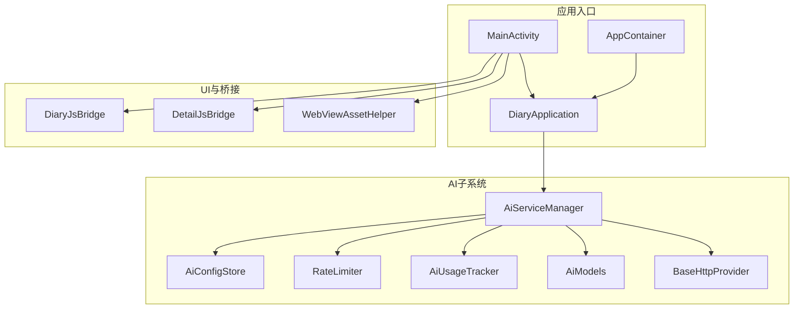
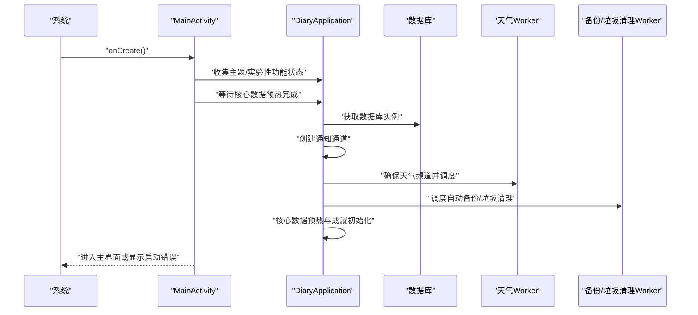
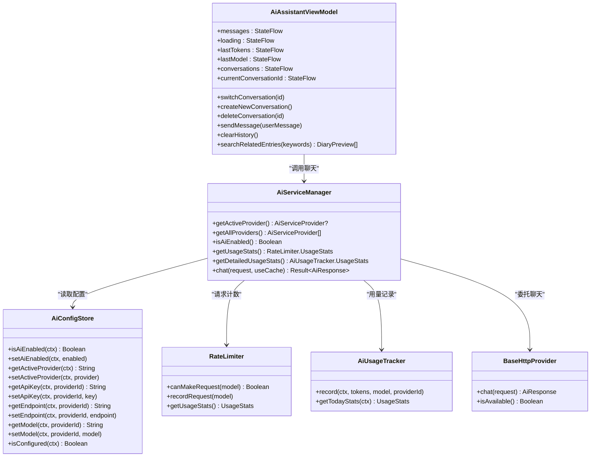
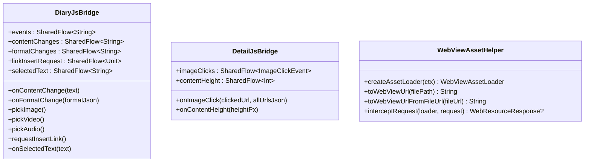
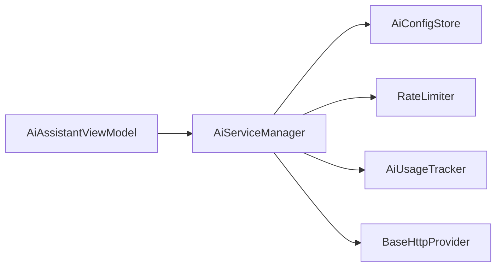

# API参考

<cite>
**本文引用的文件**
- [DiaryApplication.kt](file://app/src/main/java/com/diary/app/DiaryApplication.kt)
- [MainActivity.kt](file://app/src/main/java/com/diary/app/MainActivity.kt)
- [AppContainer.kt](file://app/src/main/java/com/diary/app/di/AppContainer.kt)
- [AiServiceManager.kt](file://app/src/main/java/com/diary/app/ai/AiServiceManager.kt)
- [AiModels.kt](file://app/src/main/java/com/diary/app/ai/AiModels.kt)
- [BaseHttpProvider.kt](file://app/src/main/java/com/diary/app/ai/BaseHttpProvider.kt)
- [AiAssistantViewModel.kt](file://app/src/main/java/com/diary/app/ai/AiAssistantViewModel.kt)
- [AiConfigStore.kt](file://app/src/main/java/com/diary/app/ai/AiConfigStore.kt)
- [RateLimiter.kt](file://app/src/main/java/com/diary/app/ai/RateLimiter.kt)
- [AiUsageTracker.kt](file://app/src/main/java/com/diary/app/ai/AiUsageTracker.kt)
- [DetailJsBridge.kt](file://app/src/main/java/com/diary/app/ui/detail/DetailJsBridge.kt)
- [DiaryJsBridge.kt](file://app/src/main/java/com/diary/app/ui/editor/DiaryJsBridge.kt)
- [WebViewAssetHelper.kt](file://app/src/main/java/com/diary/app/ui/components/WebViewAssetHelper.kt)
</cite>

## 目录
1. [简介](#简介)
2. [项目结构](#项目结构)
3. [核心组件](#核心组件)
4. [架构总览](#架构总览)
5. [详细组件分析](#详细组件分析)
6. [依赖分析](#依赖分析)
7. [性能考虑](#性能考虑)
8. [故障排查指南](#故障排查指南)
9. [结论](#结论)
10. [附录](#附录)

## 简介
本文件为 DiaryApp 的完整 API 参考文档，覆盖以下方面：
- 公共接口与回调函数：应用生命周期、实验性功能开关、主题模式设置、通知与更新检查等。
- AI 服务相关 API：统一的数据模型、请求/响应结构、错误类型、限流与用量统计、HTTP 提供商基类及具体实现。
- JavaScript 桥接接口：WebView 与原生代码交互（图片点击、内容高度、编辑器事件、选中文本等）。
- 数据模型：字段定义、验证规则与序列化方式。
- 类图与接口关系图：帮助开发者快速定位与理解 API 使用方法。

## 项目结构
DiaryApp 采用 Kotlin/Compose 原生 Android 应用架构，核心模块包含：
- 应用入口与全局状态：DiaryApplication、MainActivity、AppContainer
- AI 子系统：AiServiceManager、AiModels、AiConfigStore、BaseHttpProvider、各提供商实现、RateLimiter、AiUsageTracker
- UI 与桥接：DetailJsBridge、DiaryJsBridge、WebViewAssetHelper
- 数据层：DiaryDatabase、DAO、实体与仓库（在其他文件中定义）

图表来源
- [DiaryApplication.kt:30-156](file://app/src/main/java/com/diary/app/DiaryApplication.kt#L30-L156)
- [MainActivity.kt:79-435](file://app/src/main/java/com/diary/app/MainActivity.kt#L79-L435)
- [AppContainer.kt:11-14](file://app/src/main/java/com/diary/app/di/AppContainer.kt#L11-L14)
- [AiServiceManager.kt:10-103](file://app/src/main/java/com/diary/app/ai/AiServiceManager.kt#L10-L103)
- [AiConfigStore.kt:5-131](file://app/src/main/java/com/diary/app/ai/AiConfigStore.kt#L5-L131)
- [RateLimiter.kt:6-93](file://app/src/main/java/com/diary/app/ai/RateLimiter.kt#L6-L93)
- [AiUsageTracker.kt:10-95](file://app/src/main/java/com/diary/app/ai/AiUsageTracker.kt#L10-L95)
- [AiModels.kt:4-59](file://app/src/main/java/com/diary/app/ai/AiModels.kt#L4-L59)
- [BaseHttpProvider.kt:10-118](file://app/src/main/java/com/diary/app/ai/BaseHttpProvider.kt#L10-L118)
- [DiaryJsBridge.kt:8-59](file://app/src/main/java/com/diary/app/ui/editor/DiaryJsBridge.kt#L8-L59)
- [DetailJsBridge.kt:12-42](file://app/src/main/java/com/diary/app/ui/detail/DetailJsBridge.kt#L12-L42)
- [WebViewAssetHelper.kt:15-68](file://app/src/main/java/com/diary/app/ui/components/WebViewAssetHelper.kt#L15-L68)

章节来源
- [DiaryApplication.kt:30-156](file://app/src/main/java/com/diary/app/DiaryApplication.kt#L30-L156)
- [MainActivity.kt:79-435](file://app/src/main/java/com/diary/app/MainActivity.kt#L79-L435)
- [AppContainer.kt:11-14](file://app/src/main/java/com/diary/app/di/AppContainer.kt#L11-L14)

## 核心组件
本节概述应用级公共接口与回调函数，涵盖：
- 应用初始化与状态：数据库、容器、AI 服务、通知通道、定时任务调度、核心数据预热。
- 主题与实验性功能：主题模式读取与设置、多项实验性功能开关。
- 启动流程：启动状态管理、错误展示、字体缩放监听。
- 更新检查与下载安装：版本号比较、下载进度与安装流程。

章节来源
- [DiaryApplication.kt:30-156](file://app/src/main/java/com/diary/app/DiaryApplication.kt#L30-L156)
- [MainActivity.kt:79-435](file://app/src/main/java/com/diary/app/MainActivity.kt#L79-L435)
- [AppContainer.kt:11-14](file://app/src/main/java/com/diary/app/di/AppContainer.kt#L11-L14)

## 架构总览
下图展示应用启动与更新检查的整体流程，以及与 AI 服务、通知与工作调度的关系。

图表来源
- [MainActivity.kt:83-120](file://app/src/main/java/com/diary/app/MainActivity.kt#L83-L120)
- [DiaryApplication.kt:46-105](file://app/src/main/java/com/diary/app/DiaryApplication.kt#L46-L105)

## 详细组件分析

### AI 服务子系统
AI 子系统由统一的请求/响应模型、配置存储、限流与用量追踪、HTTP 提供商基类及具体提供商组成。

图表来源
- [AiServiceManager.kt:10-103](file://app/src/main/java/com/diary/app/ai/AiServiceManager.kt#L10-L103)
- [AiConfigStore.kt:5-131](file://app/src/main/java/com/diary/app/ai/AiConfigStore.kt#L5-L131)
- [RateLimiter.kt:6-93](file://app/src/main/java/com/diary/app/ai/RateLimiter.kt#L6-L93)
- [AiUsageTracker.kt:10-95](file://app/src/main/java/com/diary/app/ai/AiUsageTracker.kt#L10-L95)
- [BaseHttpProvider.kt:10-118](file://app/src/main/java/com/diary/app/ai/BaseHttpProvider.kt#L10-L118)
- [AiAssistantViewModel.kt:33-363](file://app/src/main/java/com/diary/app/ai/AiAssistantViewModel.kt#L33-L363)

#### 数据模型与序列化
- 请求模型：消息列表、可选模型、温度、最大 Token 数。
- 响应模型：内容、模型名、提供商 ID、总 Token 数。
- 流式分片：delta 内容与完成标记。
- 错误类型：未配置、限流、网络错误、API 错误、解析错误、未知错误。
- 便捷构造：aiRequest 工厂函数，支持系统提示词与默认参数。

章节来源
- [AiModels.kt:4-59](file://app/src/main/java/com/diary/app/ai/AiModels.kt#L4-L59)

#### HTTP 提供商基类
- 默认超时、端点清洗、统一请求体构建。
- 认证头 Authorization: Bearer。
- 错误码映射：429（限流）、401（API Key 无效）、402（配额用尽），其他非 200 视作 API 错误。
- 响应解析：choices[0].message.content、usage.total_tokens。

章节来源
- [BaseHttpProvider.kt:10-118](file://app/src/main/java/com/diary/app/ai/BaseHttpProvider.kt#L10-L118)

#### 限流与用量统计
- 日累计与模型维度限制，跨日重置。
- 用量追踪：按日记录请求次数、Token 数，并细分到模型与提供商。

章节来源
- [RateLimiter.kt:6-93](file://app/src/main/java/com/diary/app/ai/RateLimiter.kt#L6-L93)
- [AiUsageTracker.kt:10-95](file://app/src/main/java/com/diary/app/ai/AiUsageTracker.kt#L10-L95)

#### AI 助手 ViewModel
- 对话管理：加载/切换/新建/删除对话，维护消息列表与最近 Token/模型。
- 上下文构建：基于日记预览统计（连续写作天数、情绪分布、标签、地点、写作时间、随机片段与近期条目）。
- 发送消息：构建系统提示词与历史消息，调用 AiServiceManager.chat，持久化回复并更新会话时间与消息上限。

章节来源
- [AiAssistantViewModel.kt:33-363](file://app/src/main/java/com/diary/app/ai/AiAssistantViewModel.kt#L33-L363)

#### AI 服务管理器
- 提供器注册与选择、活跃提供器查询、是否启用与配置检查。
- 缓存策略：SHA-256 请求哈希 + SharedPreferences TTL 24h。
- 使用统计：记录 Token 用量并更新 AiUsageTracker。

章节来源
- [AiServiceManager.kt:10-103](file://app/src/main/java/com/diary/app/ai/AiServiceManager.kt#L10-L103)

### JavaScript 桥接接口
DiaryApp 在详情页与编辑器页面通过 WebView 与原生代码进行交互，使用 JavaScriptInterface 暴露回调，配合 WebViewAssetHelper 实现本地资源访问。

图表来源
- [DiaryJsBridge.kt:8-59](file://app/src/main/java/com/diary/app/ui/editor/DiaryJsBridge.kt#L8-L59)
- [DetailJsBridge.kt:12-42](file://app/src/main/java/com/diary/app/ui/detail/DetailJsBridge.kt#L12-L42)
- [WebViewAssetHelper.kt:15-68](file://app/src/main/java/com/diary/app/ui/components/WebViewAssetHelper.kt#L15-L68)

#### WebView 与原生交互流程
- 编辑器：接收内容变更、格式变更、媒体选择请求、链接插入请求、选中文本。
- 详情页：接收图片点击事件（含全部图片 URL 列表）与内容高度变化。
- 资源加载：通过 WebViewAssetLoader 将 assets 与 diary_media 目录映射到 https://appassets/，解决 file:// 跨目录访问限制。

章节来源
- [DiaryJsBridge.kt:8-59](file://app/src/main/java/com/diary/app/ui/editor/DiaryJsBridge.kt#L8-L59)
- [DetailJsBridge.kt:12-42](file://app/src/main/java/com/diary/app/ui/detail/DetailJsBridge.kt#L12-L42)
- [WebViewAssetHelper.kt:15-68](file://app/src/main/java/com/diary/app/ui/components/WebViewAssetHelper.kt#L15-L68)

### 应用入口与全局状态
- DiaryApplication：应用单例，持有数据库、DI 容器、AI 服务管理器，负责通知通道创建、定时任务调度、核心数据预热与启动错误上报。
- MainActivity：根据应用状态渲染启动画面、错误画面或主界面；集成更新检查与下载安装；管理生物识别/PIN 锁定与通知横幅。
- AppContainer：简单服务定位器，集中提供数据库与 DAO 实例。

章节来源
- [DiaryApplication.kt:30-156](file://app/src/main/java/com/diary/app/DiaryApplication.kt#L30-L156)
- [MainActivity.kt:79-435](file://app/src/main/java/com/diary/app/MainActivity.kt#L79-L435)
- [AppContainer.kt:11-14](file://app/src/main/java/com/diary/app/di/AppContainer.kt#L11-L14)

## 依赖分析
- 组件耦合：AiServiceManager 依赖 AiConfigStore、RateLimiter、AiUsageTracker 与提供商实现；AiAssistantViewModel 依赖 AiServiceManager 与数据库 DAO。
- 外部依赖：Android WebView、AndroidX WebKit、Gson、WorkManager（通过应用初始化间接使用）。
- 潜在循环：未见直接循环依赖；AiServiceManager 作为门面聚合各组件，避免深层耦合。

图表来源
- [AiServiceManager.kt:10-103](file://app/src/main/java/com/diary/app/ai/AiServiceManager.kt#L10-L103)
- [AiConfigStore.kt:5-131](file://app/src/main/java/com/diary/app/ai/AiConfigStore.kt#L5-L131)
- [RateLimiter.kt:6-93](file://app/src/main/java/com/diary/app/ai/RateLimiter.kt#L6-L93)
- [AiUsageTracker.kt:10-95](file://app/src/main/java/com/diary/app/ai/AiUsageTracker.kt#L10-L95)
- [BaseHttpProvider.kt:10-118](file://app/src/main/java/com/diary/app/ai/BaseHttpProvider.kt#L10-L118)
- [AiAssistantViewModel.kt:33-363](file://app/src/main/java/com/diary/app/ai/AiAssistantViewModel.kt#L33-L363)

## 性能考虑
- AI 请求缓存：对相同请求进行 SHA-256 哈希缓存，24h 过期，减少重复调用。
- 限流控制：日累计与模型维度限制，防止突发流量导致配额耗尽。
- IO 分发：网络请求在 Dispatchers.IO 执行，避免阻塞主线程。
- WebView 资源映射：通过 WebViewAssetLoader 统一本地资源访问，降低跨域与权限问题带来的性能损耗。
- UI 状态流：使用 StateFlow/SharedFlow 以响应式方式驱动界面更新，避免不必要的重组。

## 故障排查指南
- AI 未配置：检查 AiConfigStore 中是否已设置有效的 API Key；可通过 isConfigured 判断。
- 限流触发：查看 RateLimiter 的 UsageStats，确认日累计与模型维度使用量是否达到阈值。
- 网络错误：确认 BaseHttpProvider 返回的 HTTP 状态码与错误信息，401 表示 API Key 无效，429 表示限流，402 表示配额用尽。
- 解析错误：当 API 返回的 choices 数组为空或缺失时，会抛出 ParseError。
- WebView 图片点击异常：DetailJsBridge 在解析 JSON 失败时回退为单张图片 URL。
- WebView 资源无法加载：确认 WebViewAssetHelper 的 toWebViewUrl 转换逻辑与 AssetLoader 映射路径一致。

章节来源
- [AiConfigStore.kt:127-131](file://app/src/main/java/com/diary/app/ai/AiConfigStore.kt#L127-L131)
- [RateLimiter.kt:26-52](file://app/src/main/java/com/diary/app/ai/RateLimiter.kt#L26-L52)
- [BaseHttpProvider.kt:87-117](file://app/src/main/java/com/diary/app/ai/BaseHttpProvider.kt#L87-L117)
- [AiModels.kt:28-43](file://app/src/main/java/com/diary/app/ai/AiModels.kt#L28-L43)
- [DetailJsBridge.kt:25-41](file://app/src/main/java/com/diary/app/ui/detail/DetailJsBridge.kt#L25-L41)
- [WebViewAssetHelper.kt:37-54](file://app/src/main/java/com/diary/app/ui/components/WebViewAssetHelper.kt#L37-L54)

## 结论
DiaryApp 的 API 设计围绕“统一模型 + 可插拔提供商 + 限流与用量追踪”的思路展开，既保证了易用性，又兼顾了稳定性与可观测性。WebView 桥接与资源映射完善地解决了混合开发中的跨平台交互与资源访问问题。建议在生产环境中：
- 严格管理 API Key 与端点配置，定期校验可用性。
- 关注限流阈值，合理规划批量操作。
- 使用缓存与增量更新策略，提升用户体验与性能。

## 附录
- 实验性功能开关：支持主屏滑动、待办项保持位置、写作里程碑、AI 洞察卡片、AI 助手、悬浮气泡、健康数据、地图、AI 传记等。
- 主题模式：支持纯亮/暗色等主题模式，持久化存储于偏好设置。

章节来源
- [DiaryApplication.kt:107-155](file://app/src/main/java/com/diary/app/DiaryApplication.kt#L107-L155)