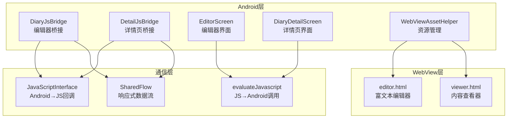
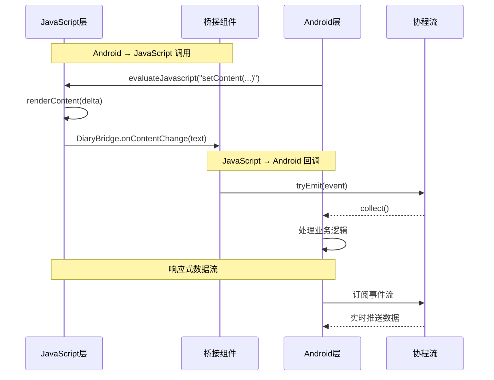
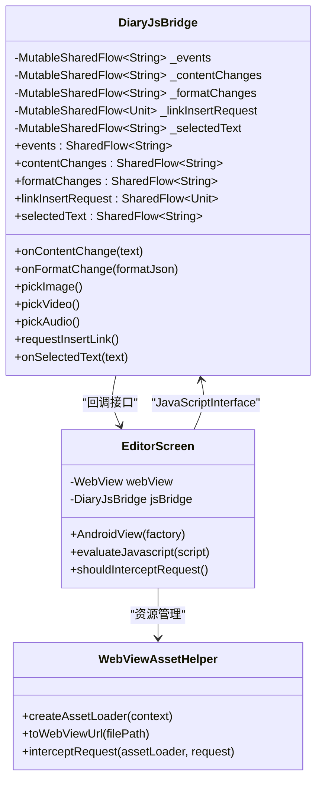
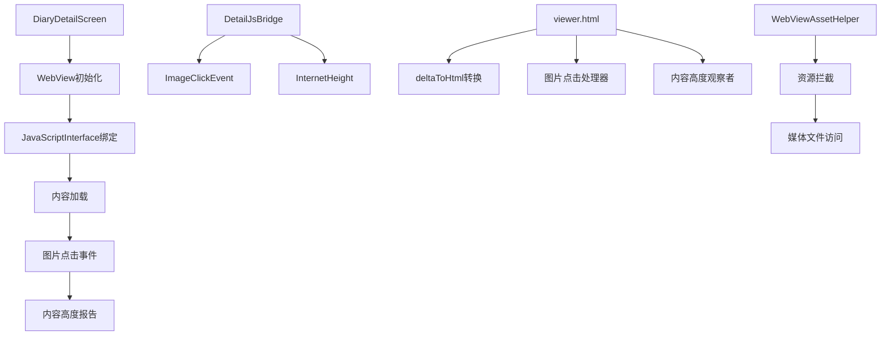
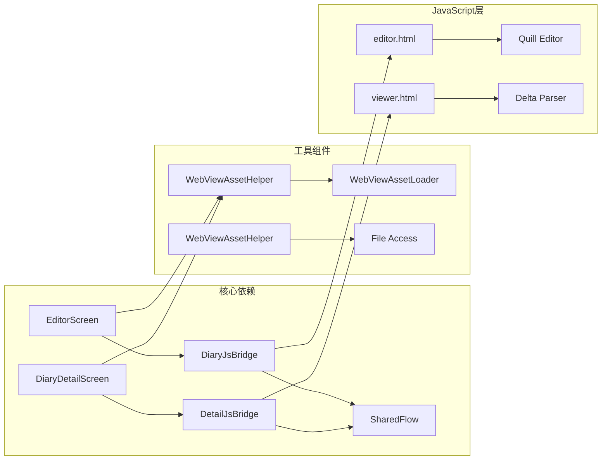

# JavaScript桥接API

<cite>
**本文档引用的文件**
- [DiaryJsBridge.kt](file://app/src/main/java/com/diary/app/ui/editor/DiaryJsBridge.kt)
- [DetailJsBridge.kt](file://app/src/main/java/com/diary/app/ui/detail/DetailJsBridge.kt)
- [EditorScreen.kt](file://app/src/main/java/com/diary/app/ui/editor/EditorScreen.kt)
- [DiaryDetailScreen.kt](file://app/src/main/java/com/diary/app/ui/detail/DiaryDetailScreen.kt)
- [WebViewAssetHelper.kt](file://app/src/main/java/com/diary/app/ui/components/WebViewAssetHelper.kt)
- [editor.html](file://app/src/main/assets/editor.html)
- [viewer.html](file://app/src/main/assets/viewer.html)
</cite>

## 目录
1. [简介](#简介)
2. [项目结构](#项目结构)
3. [核心组件](#核心组件)
4. [架构概览](#架构概览)
5. [详细组件分析](#详细组件分析)
6. [依赖关系分析](#依赖关系分析)
7. [性能考虑](#性能考虑)
8. [故障排除指南](#故障排除指南)
9. [结论](#结论)

## 简介

本文档详细介绍了Diary应用中JavaScript桥接API的设计与实现，重点涵盖DiaryJsBridge和DetailJsBridge类的公共方法和回调接口。该系统实现了Android原生代码与WebView中JavaScript之间的双向通信，支持编辑器和详情页的内容渲染、事件处理和状态同步。

系统采用基于协程流（SharedFlow）的响应式设计，通过JavaScriptInterface实现Android到JavaScript的回调，以及通过evaluateJavascript实现JavaScript到Android的方法调用。这种设计确保了线程安全和高效的异步通信。

## 项目结构

Diary应用的JavaScript桥接系统主要分布在以下几个关键位置：

**图表来源**
- [DiaryJsBridge.kt:1-60](file://app/src/main/java/com/diary/app/ui/editor/DiaryJsBridge.kt#L1-L60)
- [DetailJsBridge.kt:1-43](file://app/src/main/java/com/diary/app/ui/detail/DetailJsBridge.kt#L1-L43)
- [EditorScreen.kt:1228-1277](file://app/src/main/java/com/diary/app/ui/editor/EditorScreen.kt#L1228-L1277)
- [DiaryDetailScreen.kt:446-448](file://app/src/main/java/com/diary/app/ui/detail/DiaryDetailScreen.kt#L446-L448)

**章节来源**
- [DiaryJsBridge.kt:1-60](file://app/src/main/java/com/diary/app/ui/editor/DiaryJsBridge.kt#L1-L60)
- [DetailJsBridge.kt:1-43](file://app/src/main/java/com/diary/app/ui/detail/DetailJsBridge.kt#L1-L43)
- [EditorScreen.kt:1228-1277](file://app/src/main/java/com/diary/app/ui/editor/EditorScreen.kt#L1228-L1277)
- [DiaryDetailScreen.kt:446-448](file://app/src/main/java/com/diary/app/ui/detail/DiaryDetailScreen.kt#L446-L448)

## 核心组件

### DiaryJsBridge - 编辑器桥接组件

DiaryJsBridge是编辑器页面的核心桥接组件，负责处理来自JavaScript编辑器的各种事件和状态变更。

**主要功能特性：**
- 内容变更监听：实时捕获编辑器内容变化
- 格式变更监听：跟踪文本格式状态
- 媒体选择事件：处理图片、视频、音频插入请求
- 链接插入请求：支持外部链接插入功能
- AI助手集成：提供选中文本给AI助手使用

**数据流设计：**
组件使用多个SharedFlow实例来管理不同类型的数据流，每个流都配置了缓冲容量为1，确保最新的事件能够及时传递。

**章节来源**
- [DiaryJsBridge.kt:8-59](file://app/src/main/java/com/diary/app/ui/editor/DiaryJsBridge.kt#L8-L59)

### DetailJsBridge - 详情页桥接组件

DetailJsBridge专注于详情页的交互处理，主要负责图片点击事件和内容高度报告。

**核心能力：**
- 图片点击事件处理：将点击的图片URL和所有可浏览图片URL传递给Android层
- 内容高度监控：实时报告内容渲染后的高度变化
- 错误处理：对JSON解析异常进行优雅降级

**章节来源**
- [DetailJsBridge.kt:12-42](file://app/src/main/java/com/diary/app/ui/detail/DetailJsBridge.kt#L12-L42)

## 架构概览

系统采用分层架构设计，实现了清晰的职责分离和松耦合的组件交互。

**图表来源**
- [EditorScreen.kt:1274](file://app/src/main/java/com/diary/app/ui/editor/EditorScreen.kt#L1274)
- [DiaryDetailScreen.kt:446](file://app/src/main/java/com/diary/app/ui/detail/DiaryDetailScreen.kt#L446)
- [DiaryJsBridge.kt:15-58](file://app/src/main/java/com/diary/app/ui/editor/DiaryJsBridge.kt#L15-L58)

### 数据传递机制

系统实现了双向数据传递机制，确保编辑器和详情页的功能完整性。

**Android到JavaScript的调用流程：**
1. Android层通过evaluateJavascript方法执行JavaScript函数
2. JavaScript端接收参数并执行相应操作
3. 支持内容设置、格式调整、主题切换等功能

**JavaScript到Android的回调流程：**
1. JavaScript通过DiaryBridge对象调用Android方法
2. @JavascriptInterface注解确保方法可被JavaScript访问
3. Android层使用协程流异步处理事件

**章节来源**
- [EditorScreen.kt:1338](file://app/src/main/java/com/diary/app/ui/editor/EditorScreen.kt#L1338)
- [DiaryDetailScreen.kt:476](file://app/src/main/java/com/diary/app/ui/detail/DiaryDetailScreen.kt#L476)

## 详细组件分析

### 编辑器JavaScript集成点

编辑器页面集成了Quill富文本编辑器，提供了完整的文本编辑功能。

**图表来源**
- [DiaryJsBridge.kt:8-59](file://app/src/main/java/com/diary/app/ui/editor/DiaryJsBridge.kt#L8-L59)
- [EditorScreen.kt:1228-1277](file://app/src/main/java/com/diary/app/ui/editor/EditorScreen.kt#L1228-L1277)
- [WebViewAssetHelper.kt:15-68](file://app/src/main/java/com/diary/app/ui/components/WebViewAssetHelper.kt#L15-L68)

**章节来源**
- [DiaryJsBridge.kt:8-59](file://app/src/main/java/com/diary/app/ui/editor/DiaryJsBridge.kt#L8-L59)
- [EditorScreen.kt:1228-1277](file://app/src/main/java/com/diary/app/ui/editor/EditorScreen.kt#L1228-L1277)

### 详情页JavaScript集成点

详情页专注于内容展示和用户交互，提供了优化的阅读体验。

**图表来源**
- [DetailJsBridge.kt:12-42](file://app/src/main/java/com/diary/app/ui/detail/DetailJsBridge.kt#L12-L42)
- [DiaryDetailScreen.kt:446-448](file://app/src/main/java/com/diary/app/ui/detail/DiaryDetailScreen.kt#L446-L448)
- [viewer.html:498-528](file://app/src/main/assets/viewer.html#L498-L528)

**章节来源**
- [DetailJsBridge.kt:12-42](file://app/src/main/java/com/diary/app/ui/detail/DetailJsBridge.kt#L12-L42)
- [DiaryDetailScreen.kt:446-448](file://app/src/main/java/com/diary/app/ui/detail/DiaryDetailScreen.kt#L446-L448)

### 内容渲染与状态同步

系统实现了高效的内容渲染和状态同步机制，确保编辑器和详情页的一致性。

**内容渲染流程：**
1. 编辑器使用Quill Delta格式存储内容
2. 详情页通过deltaToHtml函数转换为HTML
3. 支持Base64编码的大内容传输
4. 实现内容变更的实时同步

**状态同步机制：**
- 文本格式状态实时报告
- 编辑器焦点和光标位置管理
- 主题切换状态同步
- 字体大小和布局参数传递

**章节来源**
- [editor.html:619-680](file://app/src/main/assets/editor.html#L619-L680)
- [viewer.html:375-452](file://app/src/main/assets/viewer.html#L375-L452)

## 依赖关系分析

系统采用模块化设计，各组件间依赖关系清晰明确。

**图表来源**
- [WebViewAssetHelper.kt:15-68](file://app/src/main/java/com/diary/app/ui/components/WebViewAssetHelper.kt#L15-L68)
- [EditorScreen.kt:1228-1277](file://app/src/main/java/com/diary/app/ui/editor/EditorScreen.kt#L1228-L1277)
- [DiaryDetailScreen.kt:446-448](file://app/src/main/java/com/diary/app/ui/detail/DiaryDetailScreen.kt#L446-L448)

**章节来源**
- [WebViewAssetHelper.kt:15-68](file://app/src/main/java/com/diary/app/ui/components/WebViewAssetHelper.kt#L15-L68)
- [EditorScreen.kt:1228-1277](file://app/src/main/java/com/diary/app/ui/editor/EditorScreen.kt#L1228-L1277)
- [DiaryDetailScreen.kt:446-448](file://app/src/main/java/com/diary/app/ui/detail/DiaryDetailScreen.kt#L446-L448)

## 性能考虑

系统在设计时充分考虑了性能优化，采用了多种策略来提升用户体验。

### 资源加载优化
- 使用WebViewAssetLoader解决跨目录file://访问限制
- 支持HTTPS和HTTP混合内容兼容模式
- 实现媒体文件的智能缓存和懒加载

### 内存管理
- SharedFlow配置缓冲容量为1，避免内存泄漏
- 协程作用域内的异步操作确保线程安全
- 及时释放WebView资源和JavaScript接口

### 渲染性能
- 编辑器内容变更采用防抖机制减少回调频率
- 详情页内容高度报告使用延迟策略避免频繁计算
- HTML转换过程中的DOM操作最小化

## 故障排除指南

### 常见问题及解决方案

**JavaScript接口调用失败**
- 检查JavaScriptInterface注解是否正确添加
- 确认WebView的JavaScript启用设置
- 验证Android版本兼容性

**内容渲染异常**
- 检查Delta JSON格式的完整性和有效性
- 验证Base64编码内容的正确性
- 确认媒体文件URL的可访问性

**事件处理延迟**
- 检查SharedFlow订阅和取消订阅的时机
- 验证协程作用域的正确使用
- 确认UI线程更新的必要性

**章节来源**
- [DiaryJsBridge.kt:15-58](file://app/src/main/java/com/diary/app/ui/editor/DiaryJsBridge.kt#L15-L58)
- [DetailJsBridge.kt:25-41](file://app/src/main/java/com/diary/app/ui/detail/DetailJsBridge.kt#L25-L41)

### 调试技巧

1. **启用WebView调试**：使用Chrome DevTools检查JavaScript执行情况
2. **日志追踪**：在关键节点添加详细的日志输出
3. **网络监控**：检查资源加载和跨域访问情况
4. **内存监控**：定期检查内存使用和垃圾回收情况

## 结论

Diary应用的JavaScript桥接API系统展现了现代移动应用开发中WebView技术的最佳实践。通过精心设计的桥接组件、响应式的数据流架构和完善的错误处理机制，系统实现了稳定可靠的Android与JavaScript双向通信。

该系统的成功之处在于：
- 清晰的职责分离和模块化设计
- 基于协程流的响应式编程模型
- 完善的资源管理和安全策略
- 优化的性能表现和用户体验

未来可以考虑的改进方向包括：增强离线功能支持、扩展更多编辑器功能、优化大内容处理性能等。这个桥接系统为类似的应用场景提供了优秀的参考模板。