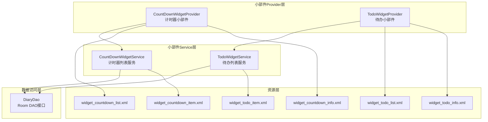
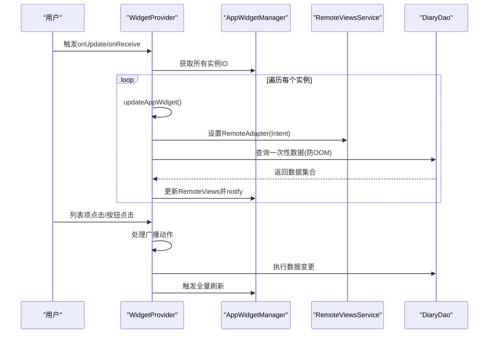
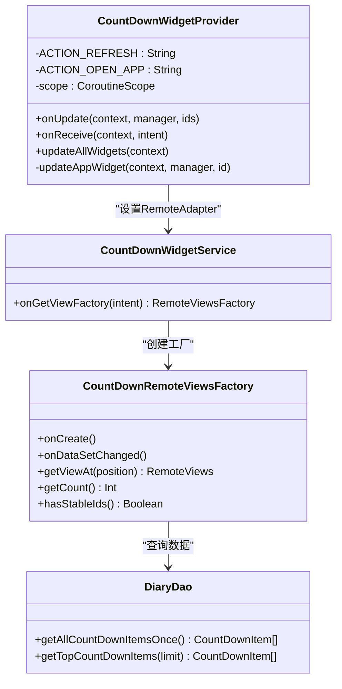
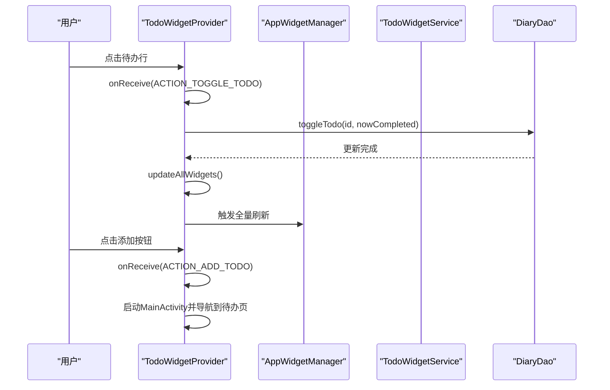
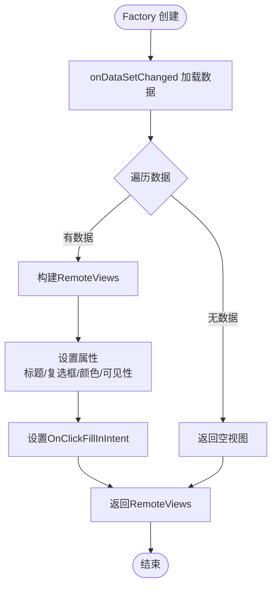
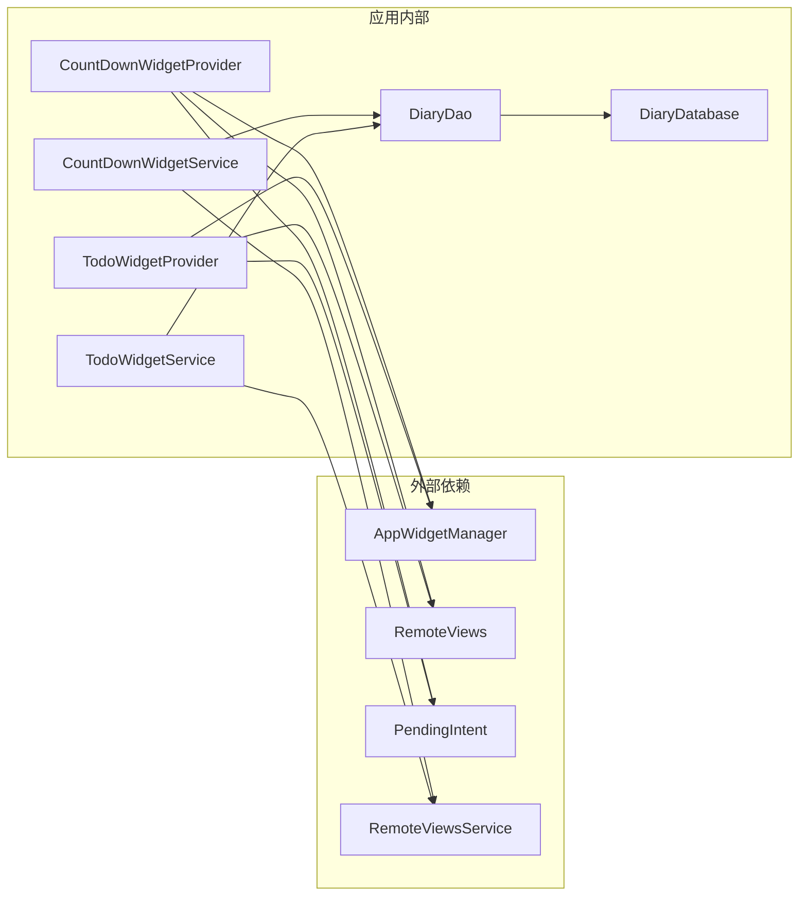

# 小部件API

<cite>
**本文档引用的文件**
- [CountDownWidgetProvider.kt](file://app/src/main/java/com/diary/app/widget/CountDownWidgetProvider.kt)
- [TodoWidgetProvider.kt](file://app/src/main/java/com/diary/app/widget/TodoWidgetProvider.kt)
- [CountDownWidgetService.kt](file://app/src/main/java/com/diary/app/widget/CountDownWidgetService.kt)
- [TodoWidgetService.kt](file://app/src/main/java/com/diary/app/widget/TodoWidgetService.kt)
- [widget_countdown_list.xml](file://app/src/main/res/layout/widget_countdown_list.xml)
- [widget_countdown_item.xml](file://app/src/main/res/layout/widget_countdown_item.xml)
- [widget_todo_list.xml](file://app/src/main/res/layout/widget_todo_list.xml)
- [widget_todo_item.xml](file://app/src/main/res/layout/widget_todo_item.xml)
- [widget_countdown_info.xml](file://app/src/main/res/xml/widget_countdown_info.xml)
- [widget_todo_info.xml](file://app/src/main/res/xml/widget_todo_info.xml)
- [CountDownItem.kt](file://app/src/main/java/com/diary/app/data/CountDownItem.kt)
- [TodoItem.kt](file://app/src/main/java/com/diary/app/data/TodoItem.kt)
- [DiaryDao.kt](file://app/src/main/java/com/diary/app/data/DiaryDao.kt)
- [colors.xml](file://app/src/main/res/values/colors.xml)
- [strings.xml](file://app/src/main/res/values/strings.xml)
</cite>

## 目录
1. [简介](#简介)
2. [项目结构](#项目结构)
3. [核心组件](#核心组件)
4. [架构概览](#架构概览)
5. [详细组件分析](#详细组件分析)
6. [依赖关系分析](#依赖关系分析)
7. [性能考虑](#性能考虑)
8. [故障排除指南](#故障排除指南)
9. [结论](#结论)

## 简介
本文件详细记录了DiaryApp中小部件API的设计与实现，重点涵盖以下内容：
- CountDownWidgetProvider与TodoWidgetProvider的公共方法与配置选项
- 小部件生命周期管理、更新机制与用户交互处理
- RemoteViews的使用方法与布局动态更新策略
- 小部件服务的Intent处理与数据绑定方式
- 小部件配置Activity与自定义属性设置
- 性能优化技巧与内存管理策略

## 项目结构
小部件相关代码采用典型的Android AppWidget架构组织，主要由以下层次构成：
- Provider层：负责小部件的生命周期回调与UI更新触发
- Service层：通过RemoteViewsService提供列表项的数据绑定
- 数据层：Room DAO接口提供一次性查询以避免OOM
- 资源层：XML布局定义小部件UI结构与样式

**图表来源**
- [CountDownWidgetProvider.kt:1-126](file://app/src/main/java/com/diary/app/widget/CountDownWidgetProvider.kt#L1-L126)
- [TodoWidgetProvider.kt:1-175](file://app/src/main/java/com/diary/app/widget/TodoWidgetProvider.kt#L1-L175)
- [CountDownWidgetService.kt:1-87](file://app/src/main/java/com/diary/app/widget/CountDownWidgetService.kt#L1-L87)
- [TodoWidgetService.kt:1-135](file://app/src/main/java/com/diary/app/widget/TodoWidgetService.kt#L1-L135)
- [DiaryDao.kt:1-665](file://app/src/main/java/com/diary/app/data/DiaryDao.kt#L1-L665)

**章节来源**
- [CountDownWidgetProvider.kt:1-126](file://app/src/main/java/com/diary/app/widget/CountDownWidgetProvider.kt#L1-L126)
- [TodoWidgetProvider.kt:1-175](file://app/src/main/java/com/diary/app/widget/TodoWidgetProvider.kt#L1-L175)
- [CountDownWidgetService.kt:1-87](file://app/src/main/java/com/diary/app/widget/CountDownWidgetService.kt#L1-L87)
- [TodoWidgetService.kt:1-135](file://app/src/main/java/com/diary/app/widget/TodoWidgetService.kt#L1-L135)

## 核心组件
本节概述两个小部件Provider的关键职责与公共能力。

- CountDownWidgetProvider
  - 负责倒数日小部件的UI更新与交互处理
  - 提供全局刷新与打开应用的广播动作
  - 使用协程在IO线程执行数据库查询，避免阻塞主线程
  - 通过RemoteViews设置空状态视图与列表适配器

- TodoWidgetProvider
  - 负责待办事项小部件的UI更新与交互处理
  - 支持待办切换、添加待办、全局刷新等广播动作
  - 实现行级点击切换待办状态，并通过PendingIntent模板传递数据
  - 动态计算并展示待完成数量

**章节来源**
- [CountDownWidgetProvider.kt:23-126](file://app/src/main/java/com/diary/app/widget/CountDownWidgetProvider.kt#L23-L126)
- [TodoWidgetProvider.kt:25-175](file://app/src/main/java/com/diary/app/widget/TodoWidgetProvider.kt#L25-L175)

## 架构概览
小部件系统遵循标准的AppWidget生命周期与RemoteViews数据绑定模式：

**图表来源**
- [CountDownWidgetProvider.kt:25-123](file://app/src/main/java/com/diary/app/widget/CountDownWidgetProvider.kt#L25-L123)
- [TodoWidgetProvider.kt:27-155](file://app/src/main/java/com/diary/app/widget/TodoWidgetProvider.kt#L27-L155)
- [CountDownWidgetService.kt:17-87](file://app/src/main/java/com/diary/app/widget/CountDownWidgetService.kt#L17-L87)
- [TodoWidgetService.kt:17-135](file://app/src/main/java/com/diary/app/widget/TodoWidgetService.kt#L17-L135)
- [DiaryDao.kt:327-501](file://app/src/main/java/com/diary/app/data/DiaryDao.kt#L327-L501)

## 详细组件分析

### CountDownWidgetProvider 分析
该Provider负责倒数日小部件的完整生命周期管理。

- 公共方法
  - onUpdate(context, manager, appWidgetIds): 遍历所有实例并调用内部更新逻辑
  - onReceive(context, intent): 异步处理广播，支持刷新与打开应用动作
  - updateAllWidgets(context): 静态方法，触发所有实例的全量刷新

- 配置选项
  - ACTION_REFRESH/ACTION_OPEN_APP: 自定义广播动作常量
  - 协程作用域使用SupervisorJob() + Dispatchers.IO，确保异常不影响其他任务
  - 使用一次性查询(getAllCountDownItemsOnce)避免大数据集导致的内存问题

- 生命周期管理
  - 在onUpdate中逐个实例更新，保证多实例一致性
  - onReceive中使用goAsync()配合try-finally确保异步处理完成后finish()

- 用户交互
  - 列表项点击通过PendingIntent模板传递上下文
  - 点击模板指向ACTION_OPEN_APP，启动MainActivity并导航到倒数日页面

- RemoteViews与布局更新
  - 使用widget_countdown_list.xml作为根布局
  - 通过setRemoteAdapter绑定CountDownWidgetService
  - setEmptyView设置空状态视图
  - notifyAppWidgetViewDataChanged通知列表数据变化

**图表来源**
- [CountDownWidgetProvider.kt:23-126](file://app/src/main/java/com/diary/app/widget/CountDownWidgetProvider.kt#L23-L126)
- [CountDownWidgetService.kt:16-87](file://app/src/main/java/com/diary/app/widget/CountDownWidgetService.kt#L16-L87)
- [DiaryDao.kt:496-501](file://app/src/main/java/com/diary/app/data/DiaryDao.kt#L496-L501)

**章节来源**
- [CountDownWidgetProvider.kt:23-126](file://app/src/main/java/com/diary/app/widget/CountDownWidgetProvider.kt#L23-L126)
- [CountDownWidgetService.kt:16-87](file://app/src/main/java/com/diary/app/widget/CountDownWidgetService.kt#L16-L87)
- [widget_countdown_list.xml:1-56](file://app/src/main/res/layout/widget_countdown_list.xml#L1-L56)
- [widget_countdown_item.xml:1-40](file://app/src/main/res/layout/widget_countdown_item.xml#L1-L40)
- [widget_countdown_info.xml:1-13](file://app/src/main/res/xml/widget_countdown_info.xml#L1-L13)
- [DiaryDao.kt:496-501](file://app/src/main/java/com/diary/app/data/DiaryDao.kt#L496-L501)

### TodoWidgetProvider 分析
该Provider负责待办事项小部件的完整生命周期管理。

- 公共方法
  - onUpdate(context, manager, appWidgetIds): 遍历所有实例并调用内部更新逻辑
  - onReceive(context, intent): 异步处理广播，支持待办切换、添加待办、刷新动作
  - updateAllWidgets(context): 静态方法，触发所有实例的全量刷新

- 配置选项
  - ACTION_TOGGLE_TODO/ACTION_ADD_TODO/ACTION_REFRESH: 广播动作常量
  - EXTRA_TODO_ID: 待办ID额外参数键
  - 协程作用域使用SupervisorJob() + Dispatchers.IO，确保异常不影响其他任务

- 生命周期管理
  - 在onUpdate中逐个实例更新，保证多实例一致性
  - onReceive中使用goAsync()配合try-finally确保异步处理完成后finish()

- 用户交互
  - 行级点击通过OnClickFillInIntent传递todo_id
  - 模板点击切换待办状态，触发ACTION_TOGGLE_TODO广播
  - 添加按钮点击触发ACTION_ADD_TODO广播，启动MainActivity并导航到待办页面

- RemoteViews与布局更新
  - 使用widget_todo_list.xml作为根布局
  - 通过setRemoteAdapter绑定TodoWidgetService
  - setEmptyView设置空状态视图
  - setOnClickPendingIntent为添加按钮设置点击事件
  - notifyAppWidgetViewDataChanged通知列表数据变化

**图表来源**
- [TodoWidgetProvider.kt:37-81](file://app/src/main/java/com/diary/app/widget/TodoWidgetProvider.kt#L37-L81)
- [TodoWidgetProvider.kt:157-173](file://app/src/main/java/com/diary/app/widget/TodoWidgetProvider.kt#L157-L173)
- [TodoWidgetService.kt:53-117](file://app/src/main/java/com/diary/app/widget/TodoWidgetService.kt#L53-L117)
- [DiaryDao.kt:298-299](file://app/src/main/java/com/diary/app/data/DiaryDao.kt#L298-L299)

**章节来源**
- [TodoWidgetProvider.kt:25-175](file://app/src/main/java/com/diary/app/widget/TodoWidgetProvider.kt#L25-L175)
- [TodoWidgetService.kt:17-135](file://app/src/main/java/com/diary/app/widget/TodoWidgetService.kt#L17-L135)
- [widget_todo_list.xml:1-81](file://app/src/main/res/layout/widget_todo_list.xml#L1-L81)
- [widget_todo_item.xml:1-79](file://app/src/main/res/layout/widget_todo_item.xml#L1-L79)
- [widget_todo_info.xml:1-13](file://app/src/main/res/xml/widget_todo_info.xml#L1-L13)
- [DiaryDao.kt:327-331](file://app/src/main/java/com/diary/app/data/DiaryDao.kt#L327-L331)

### RemoteViews 服务与数据绑定
两个小部件均采用RemoteViewsService模式实现列表数据绑定。

- CountDownRemoteViewsFactory
  - 在onDataSetChanged中通过runBlocking加载数据
  - getViewAt(position)构建每个列表项的RemoteViews
  - 计算剩余天数并根据状态设置不同文本与颜色
  - 使用hasStableIds()与getItemId()确保列表滚动性能

- TodoRemoteViewsFactory
  - 在onDataSetChanged中通过runBlocking加载数据
  - getViewAt(position)构建每个列表项的RemoteViews
  - 设置标题、复选框状态、优先级指示器、分类标签、到期日期
  - 使用OnClickFillInIntent传递todo_id，实现行级点击切换

**图表来源**
- [CountDownWidgetService.kt:22-87](file://app/src/main/java/com/diary/app/widget/CountDownWidgetService.kt#L22-L87)
- [TodoWidgetService.kt:23-135](file://app/src/main/java/com/diary/app/widget/TodoWidgetService.kt#L23-L135)

**章节来源**
- [CountDownWidgetService.kt:22-87](file://app/src/main/java/com/diary/app/widget/CountDownWidgetService.kt#L22-L87)
- [TodoWidgetService.kt:23-135](file://app/src/main/java/com/diary/app/widget/TodoWidgetService.kt#L23-L135)

### 布局与样式设计
- 颜色系统
  - 使用colors.xml定义深色主题配色方案
  - 包含背景、文本、强调色及优先级颜色
  - 优先级高/中/低分别对应不同颜色标识

- 布局结构
  - 列表布局包含标题、列表视图、空状态视图
  - 待办列表额外包含添加按钮区域
  - 项目布局采用水平排列，包含标题、优先级指示器、分类标签、到期日期等元素

**章节来源**
- [colors.xml:1-17](file://app/src/main/res/values/colors.xml#L1-L17)
- [widget_countdown_list.xml:1-56](file://app/src/main/res/layout/widget_countdown_list.xml#L1-L56)
- [widget_todo_list.xml:1-81](file://app/src/main/res/layout/widget_todo_list.xml#L1-L81)
- [widget_countdown_item.xml:1-40](file://app/src/main/res/layout/widget_countdown_item.xml#L1-L40)
- [widget_todo_item.xml:1-79](file://app/src/main/res/layout/widget_todo_item.xml#L1-L79)

## 依赖关系分析
小部件系统的核心依赖关系如下：

**图表来源**
- [CountDownWidgetProvider.kt:3-21](file://app/src/main/java/com/diary/app/widget/CountDownWidgetProvider.kt#L3-L21)
- [TodoWidgetProvider.kt:3-23](file://app/src/main/java/com/diary/app/widget/TodoWidgetProvider.kt#L3-L23)
- [CountDownWidgetService.kt:3-14](file://app/src/main/java/com/diary/app/widget/CountDownWidgetService.kt#L3-L14)
- [TodoWidgetService.kt:3-15](file://app/src/main/java/com/diary/app/widget/TodoWidgetService.kt#L3-L15)

**章节来源**
- [CountDownWidgetProvider.kt:3-21](file://app/src/main/java/com/diary/app/widget/CountDownWidgetProvider.kt#L3-L21)
- [TodoWidgetProvider.kt:3-23](file://app/src/main/java/com/diary/app/widget/TodoWidgetProvider.kt#L3-L23)
- [DiaryDao.kt:12-665](file://app/src/main/java/com/diary/app/data/DiaryDao.kt#L12-L665)

## 性能考虑
基于代码实现，小部件系统采用了多项性能优化策略：

- 内存管理
  - 使用一次性查询接口避免大数据集加载导致的内存溢出
  - RemoteViewsFactory在onDestroy中清空数据引用，防止内存泄漏
  - 列表项布局采用轻量级设计，减少视图层级

- 线程管理
  - 协程作用域使用SupervisorJob()，单个任务异常不影响整体运行
  - 使用Dispatchers.IO执行数据库查询，避免阻塞主线程
  - onReceive中使用goAsync()处理异步广播，确保系统稳定性

- UI渲染优化
  - hasStableIds()与getItemId()配合，提升列表滚动性能
  - 使用notifyAppWidgetViewDataChanged精确通知数据变化
  - 空状态视图减少无效渲染

- 数据访问优化
  - 倒数日：限制查询数量为10条
  - 待办事项：限制查询数量为20条
  - 使用runBlocking在后台线程执行数据加载

**章节来源**
- [CountDownWidgetProvider.kt:109-122](file://app/src/main/java/com/diary/app/widget/CountDownWidgetProvider.kt#L109-L122)
- [TodoWidgetProvider.kt:140-154](file://app/src/main/java/com/diary/app/widget/TodoWidgetProvider.kt#L140-L154)
- [CountDownWidgetService.kt:30-37](file://app/src/main/java/com/diary/app/widget/CountDownWidgetService.kt#L30-L37)
- [TodoWidgetService.kt:35-44](file://app/src/main/java/com/diary/app/widget/TodoWidgetService.kt#L35-L44)

## 故障排除指南
针对小部件常见问题提供排查建议：

- 小部件不显示数据
  - 检查onDataSetChanged中的数据库查询是否抛出异常
  - 确认RemoteViewsFactory的getCount()返回正确数量
  - 验证setEmptyView的设置是否正确

- 点击无响应
  - 检查PendingIntent的创建参数是否正确
  - 确认ACTION常量与Intent.action匹配
  - 验证setPendingIntentTemplate与setOnClickPendingIntent的使用

- 刷新不生效
  - 确认updateAllWidgets()是否被正确调用
  - 检查notifyAppWidgetViewDataChanged的调用时机
  - 验证AppWidgetManager.updateAppWidget()的调用

- 内存问题
  - 检查onDestroy中是否清空数据引用
  - 确认协程作用域的正确使用
  - 验证一次性查询接口的使用

**章节来源**
- [CountDownWidgetProvider.kt:35-64](file://app/src/main/java/com/diary/app/widget/CountDownWidgetProvider.kt#L35-L64)
- [TodoWidgetProvider.kt:37-81](file://app/src/main/java/com/diary/app/widget/TodoWidgetProvider.kt#L37-L81)
- [CountDownWidgetService.kt:39-41](file://app/src/main/java/com/diary/app/widget/CountDownWidgetService.kt#L39-L41)
- [TodoWidgetService.kt:47-49](file://app/src/main/java/com/diary/app/widget/TodoWidgetService.kt#L47-L49)

## 结论
DiaryApp的小部件API实现了完整的生命周期管理、数据绑定与用户交互处理。通过合理的架构设计与性能优化策略，系统能够在保持良好用户体验的同时有效控制资源消耗。关键优势包括：
- 清晰的职责分离与模块化设计
- 完善的异步处理与错误隔离机制
- 针对内存与性能的多项优化措施
- 可扩展的数据绑定与布局系统

这些特性为后续功能扩展与维护奠定了坚实基础。