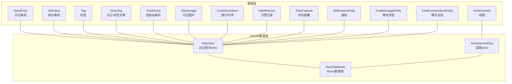
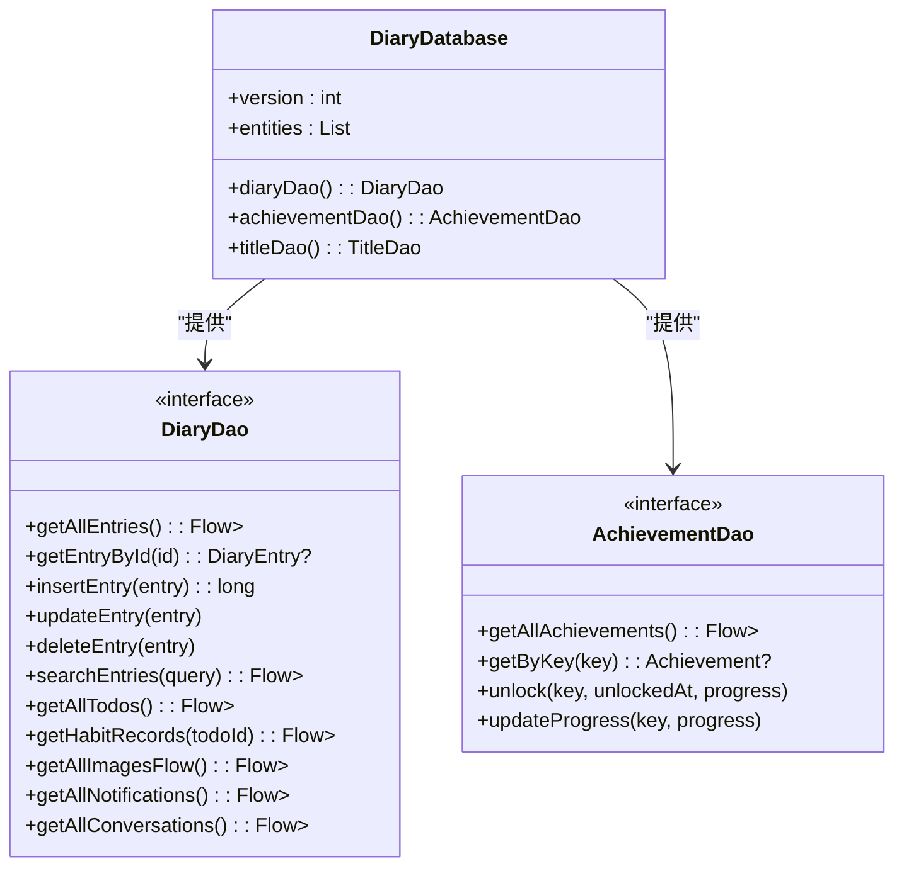
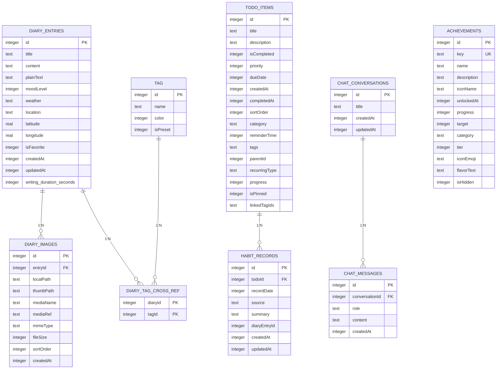

# 数据模型API

<cite>
**本文引用的文件**
- [DiaryEntry.kt](file://app/src/main/java/com/diary/app/data/DiaryEntry.kt)
- [Achievement.kt](file://app/src/main/java/com/diary/app/data/Achievement.kt)
- [TodoItem.kt](file://app/src/main/java/com/diary/app/data/TodoItem.kt)
- [DiaryDao.kt](file://app/src/main/java/com/diary/app/data/DiaryDao.kt)
- [AchievementDao.kt](file://app/src/main/java/com/diary/app/data/AchievementDao.kt)
- [DiaryDatabase.kt](file://app/src/main/java/com/diary/app/data/DiaryDatabase.kt)
- [Tag.kt](file://app/src/main/java/com/diary/app/data/Tag.kt)
- [DiaryTag.kt](file://app/src/main/java/com/diary/app/data/DiaryTag.kt)
- [TrashEntry.kt](file://app/src/main/java/com/diary/app/data/TrashEntry.kt)
- [DiaryImage.kt](file://app/src/main/java/com/diary/app/data/DiaryImage.kt)
- [CountDownItem.kt](file://app/src/main/java/com/diary/app/data/CountDownItem.kt)
- [HabitRecord.kt](file://app/src/main/java/com/diary/app/data/HabitRecord.kt)
- [TimeCapsule.kt](file://app/src/main/java/com/diary/app/data/TimeCapsule.kt)
- [NotificationEntity.kt](file://app/src/main/java/com/diary/app/data/NotificationEntity.kt)
- [ChatMessageEntity.kt](file://app/src/main/java/com/diary/app/data/ChatMessageEntity.kt)
- [ChatConversationEntity.kt](file://app/src/main/java/com/diary/app/data/ChatConversationEntity.kt)
</cite>

## 目录
1. [简介](#简介)
2. [项目结构](#项目结构)
3. [核心组件](#核心组件)
4. [架构总览](#架构总览)
5. [详细组件分析](#详细组件分析)
6. [依赖分析](#依赖分析)
7. [性能考虑](#性能考虑)
8. [故障排查指南](#故障排查指南)
9. [结论](#结论)
10. [附录](#附录)

## 简介
本文件为日记应用数据模型API的完整参考文档，聚焦于Room数据库实体与DAO接口的设计与使用，涵盖以下要点：
- 实体字段定义、数据类型与约束
- Room注解的使用方式与配置
- DAO接口方法签名、查询语义与返回类型
- 实体间关系与外键约束
- 序列化/反序列化与迁移策略

## 项目结构
数据模型位于模块“app”内，采用按功能域分层组织：实体类集中于data包，DAO接口与数据库入口位于同一包内，便于通过Room统一管理。

图表来源
- [DiaryEntry.kt:1-33](file://app/src/main/java/com/diary/app/data/DiaryEntry.kt#L1-L33)
- [Achievement.kt:1-27](file://app/src/main/java/com/diary/app/data/Achievement.kt#L1-L27)
- [TodoItem.kt:1-90](file://app/src/main/java/com/diary/app/data/TodoItem.kt#L1-L90)
- [Tag.kt:1-14](file://app/src/main/java/com/diary/app/data/Tag.kt#L1-L14)
- [DiaryTag.kt:1-18](file://app/src/main/java/com/diary/app/data/DiaryTag.kt#L1-L18)
- [TrashEntry.kt:1-30](file://app/src/main/java/com/diary/app/data/TrashEntry.kt#L1-L30)
- [DiaryImage.kt:1-32](file://app/src/main/java/com/diary/app/data/DiaryImage.kt#L1-L32)
- [CountDownItem.kt:1-17](file://app/src/main/java/com/diary/app/data/CountDownItem.kt#L1-L17)
- [HabitRecord.kt:1-38](file://app/src/main/java/com/diary/app/data/HabitRecord.kt#L1-L38)
- [TimeCapsule.kt:1-30](file://app/src/main/java/com/diary/app/data/TimeCapsule.kt#L1-L30)
- [NotificationEntity.kt:1-20](file://app/src/main/java/com/diary/app/data/NotificationEntity.kt#L1-L20)
- [ChatMessageEntity.kt:1-27](file://app/src/main/java/com/diary/app/data/ChatMessageEntity.kt#L1-L27)
- [ChatConversationEntity.kt:1-13](file://app/src/main/java/com/diary/app/data/ChatConversationEntity.kt#L1-L13)
- [DiaryDao.kt:1-665](file://app/src/main/java/com/diary/app/data/DiaryDao.kt#L1-L665)
- [AchievementDao.kt:1-65](file://app/src/main/java/com/diary/app/data/AchievementDao.kt#L1-L65)
- [DiaryDatabase.kt:10-14](file://app/src/main/java/com/diary/app/data/DiaryDatabase.kt#L10-L14)

章节来源
- [DiaryDatabase.kt:10-14](file://app/src/main/java/com/diary/app/data/DiaryDatabase.kt#L10-L14)

## 核心组件
本节对关键实体进行字段与约束说明，并总结Room注解的使用模式。

- DiaryEntry（日记条目）
  - 表名：diary_entries
  - 主键：id（自增）
  - 索引：createdAt、isFavorite、moodLevel
  - 关键字段：title、content（Quill.js Delta JSON）、plainText（纯文本摘要/搜索）、moodLevel（1-6）、weather、location、经纬度、是否收藏、创建/更新时间、写作时长（秒）
  - 约束：content字段在导出/预览时可能被截断以避免超大数据传输；写作时长可为空

- Achievement（成就）
  - 表名：achievements
  - 主键：id（自增）
  - 唯一索引：key
  - 字段：key、name、description、iconName、unlockedAt、progress、target、category、tier、iconEmoji、flavorText、isHidden
  - 约束：key唯一；支持统一成就体系字段

- TodoItem（待办事项）
  - 表名：todo_items
  - 主键：id（自增）
  - 索引：dueDate、isCompleted、category、reminderTime、parentId、tags
  - 字段：标题、描述、完成状态、优先级、截止时间、创建时间、完成时间、排序、分类、提醒时间、标签、父任务ID、周期类型、进度、置顶、关联标签ID列表
  - 约束：tags与linkedTagIds采用逗号分隔存储；parentId支持父子层级

- Tag（标签）与 DiaryTag（关联表）
  - Tag：主键id，名称、ARGB颜色、是否预设
  - DiaryTag：复合主键(diaryId, tagId)，索引(tagId, diaryId)

- TrashEntry（回收站条目）
  - 表名：trash_entries
  - 主键：id（自增），索引：deletedAt
  - 字段：originalId（原条目ID）、标题、内容、plainText、moodLevel、weather、location、经纬度、是否收藏、创建/更新/删除时间

- DiaryImage（日记图片）
  - 表名：diary_images
  - 外键：entryId → diary_entries(id)（级联删除）
  - 索引：entryId
  - 字段：本地路径、缩略图路径、媒体名、媒体引用、MIME类型、文件大小、排序、创建时间

- CountDownItem（倒计时项）
  - 表名：countdown_items
  - 字段：标题、目标时间、是否正向计时、颜色、是否年重复、置顶、创建时间

- HabitRecord（习惯记录）
  - 表名：habit_records
  - 唯一索引：(todoId, recordDate)
  - 字段：todoId、recordDate（LocalDate的epoch day）、来源、摘要、日记条目ID、创建/更新时间

- TimeCapsule（时光胶囊）
  - 表名：time_capsules
  - 字段：标题、内容、创建时间、解锁时间、阅读/打开标记、主题枚举、附件图片、解锁时间点

- NotificationEntity（通知）
  - 表名：notifications
  - 主键：id（字符串）
  - 字段：类型、标题、副标题、图标类型、颜色、关联ID、已读/已删除标记、创建/删除时间

- ChatMessageEntity / ChatConversationEntity（聊天）
  - ChatConversationEntity：主键id，标题、创建/更新时间
  - ChatMessageEntity：外键conversationId → chat_conversations(id)（级联删除），字段role、content、createdAt

章节来源
- [DiaryEntry.kt:8-32](file://app/src/main/java/com/diary/app/data/DiaryEntry.kt#L8-L32)
- [Achievement.kt:7-26](file://app/src/main/java/com/diary/app/data/Achievement.kt#L7-L26)
- [TodoItem.kt:7-17](file://app/src/main/java/com/diary/app/data/TodoItem.kt#L7-L17)
- [Tag.kt:6-13](file://app/src/main/java/com/diary/app/data/Tag.kt#L6-L13)
- [DiaryTag.kt:6-17](file://app/src/main/java/com/diary/app/data/DiaryTag.kt#L6-L17)
- [TrashEntry.kt:7-29](file://app/src/main/java/com/diary/app/data/TrashEntry.kt#L7-L29)
- [DiaryImage.kt:8-31](file://app/src/main/java/com/diary/app/data/DiaryImage.kt#L8-L31)
- [CountDownItem.kt:6-16](file://app/src/main/java/com/diary/app/data/CountDownItem.kt#L6-L16)
- [HabitRecord.kt:7-24](file://app/src/main/java/com/diary/app/data/HabitRecord.kt#L7-L24)
- [TimeCapsule.kt:16-29](file://app/src/main/java/com/diary/app/data/TimeCapsule.kt#L16-L29)
- [NotificationEntity.kt:6-19](file://app/src/main/java/com/diary/app/data/NotificationEntity.kt#L6-L19)
- [ChatMessageEntity.kt:8-26](file://app/src/main/java/com/diary/app/data/ChatMessageEntity.kt#L8-L26)
- [ChatConversationEntity.kt:6-12](file://app/src/main/java/com/diary/app/data/ChatConversationEntity.kt#L6-L12)

## 架构总览
Room数据库通过@Database声明实体集合与版本号，DAO接口提供对各实体的CRUD与复杂查询能力。DAO方法广泛使用Flow返回响应式流，支持协程挂起操作以避免阻塞UI线程。

图表来源
- [DiaryDatabase.kt:10-19](file://app/src/main/java/com/diary/app/data/DiaryDatabase.kt#L10-L19)
- [DiaryDao.kt:12-13](file://app/src/main/java/com/diary/app/data/DiaryDao.kt#L12-L13)
- [AchievementDao.kt:10-11](file://app/src/main/java/com/diary/app/data/AchievementDao.kt#L10-L11)

## 详细组件分析

### DiaryEntry（日记条目）
- 字段与类型
  - id: Long（主键，自增）
  - title: String
  - content: String（Quill.js Delta JSON）
  - plainText: String（用于预览/搜索）
  - moodLevel: Int?（1-6）
  - weather: String?
  - location: String?
  - latitude/longitude: Double?
  - isFavorite: Boolean
  - createdAt/updatedAt: Long
  - writingDurationSeconds: Int?（写作时长，秒）

- 注解与约束
  - @Entity(table = "diary_entries", indices([...]))
  - @PrimaryKey(autoGenerate = true)
  - createdAt/moodLevel/isFavorite建立索引，提升查询效率

- 查询与返回
  - 列表视图使用轻量投影（不含content）避免内存溢出
  - 支持全文检索（标题、正文、标签），并按创建时间倒序

章节来源
- [DiaryEntry.kt:8-32](file://app/src/main/java/com/diary/app/data/DiaryEntry.kt#L8-L32)
- [DiaryDao.kt:14-36](file://app/src/main/java/com/diary/app/data/DiaryDao.kt#L14-L36)
- [DiaryDao.kt:110-135](file://app/src/main/java/com/diary/app/data/DiaryDao.kt#L110-L135)

### Achievement（成就）
- 字段与类型
  - id: Long（主键，自增）
  - key: String（唯一索引）
  - name/description/iconName: String
  - unlockedAt: Long?
  - progress/target: Int
  - category/tier/iconEmoji/flavorText/isHidden: String/Int/Boolean

- 查询与返回
  - 按解锁时间倒序、key升序列出
  - 支持按分类、等级、总数统计等聚合查询

- 统一成就系统
  - 新增category、tier、iconEmoji、flavorText、isHidden、target等字段，兼容旧系统并扩展能力

章节来源
- [Achievement.kt:7-26](file://app/src/main/java/com/diary/app/data/Achievement.kt#L7-L26)
- [AchievementDao.kt:12-64](file://app/src/main/java/com/diary/app/data/AchievementDao.kt#L12-L64)

### TodoItem（待办事项）
- 字段与类型
  - id: Long（主键，自增）
  - 标题/描述、完成状态、优先级、截止时间、创建/完成时间、排序
  - 分类(category)、提醒时间(reminderTime)、标签(tags)、父任务(parentId)、周期类型(recurringType)、进度(progress)、置顶(isPinned)、关联标签ID列表(linkedTagIds)

- 查询与返回
  - 支持按分类、标签、日期范围、完成状态、优先级、排序等过滤
  - 提供今日待办、即将到来、置顶优先等常用视图

- 工具函数
  - 标签与关联ID的解析/序列化工具（逗号分隔）

章节来源
- [TodoItem.kt:7-89](file://app/src/main/java/com/diary/app/data/TodoItem.kt#L7-L89)
- [DiaryDao.kt:264-335](file://app/src/main/java/com/diary/app/data/DiaryDao.kt#L264-L335)

### 标签与关联表
- Tag
  - 主键id，名称、颜色（ARGB Long）、是否预设
- DiaryTag（多对多关联）
  - 复合主键(diaryId, tagId)，索引(tagId, diaryId)

- 查询与返回
  - 获取日记的标签信息、按标签筛选日记、统计标签使用频次

章节来源
- [Tag.kt:6-13](file://app/src/main/java/com/diary/app/data/Tag.kt#L6-L13)
- [DiaryTag.kt:6-17](file://app/src/main/java/com/diary/app/data/DiaryTag.kt#L6-L17)
- [DiaryDao.kt:152-203](file://app/src/main/java/com/diary/app/data/DiaryDao.kt#L152-L203)

### 回收站、图片、倒计时、习惯记录、通知、聊天
- 回收站
  - TrashEntry：记录被删除的日记快照，deletedAt索引
- 图片
  - DiaryImage：外键关联DiaryEntry，级联删除；索引entryId
- 倒计时
  - CountDownItem：目标时间、是否年重复、置顶、颜色等
- 习惯记录
  - HabitRecord：(todoId, recordDate)唯一索引，支持按日期范围查询
- 通知
  - NotificationEntity：主键id，类型、标题、副标题、图标类型、颜色、关联ID、已读/已删标记、时间戳
- 聊天
  - ChatConversationEntity：会话基本信息
  - ChatMessageEntity：外键关联会话，级联删除

章节来源
- [TrashEntry.kt:7-29](file://app/src/main/java/com/diary/app/data/TrashEntry.kt#L7-L29)
- [DiaryImage.kt:8-31](file://app/src/main/java/com/diary/app/data/DiaryImage.kt#L8-L31)
- [CountDownItem.kt:6-16](file://app/src/main/java/com/diary/app/data/CountDownItem.kt#L6-L16)
- [HabitRecord.kt:7-24](file://app/src/main/java/com/diary/app/data/HabitRecord.kt#L7-L24)
- [NotificationEntity.kt:6-19](file://app/src/main/java/com/diary/app/data/NotificationEntity.kt#L6-L19)
- [ChatMessageEntity.kt:8-26](file://app/src/main/java/com/diary/app/data/ChatMessageEntity.kt#L8-L26)
- [ChatConversationEntity.kt:6-12](file://app/src/main/java/com/diary/app/data/ChatConversationEntity.kt#L6-L12)

### DAO接口方法与查询语义
- DiaryDao
  - 列表与预览：Flow返回，避免一次性加载全部数据
  - 搜索：支持标题、正文、标签组合检索
  - 批量操作：批量收藏、批量删除、批量导出
  - 时间范围查询：按日期区间获取日记与预览
  - 统计与聚合：标签使用统计、通知未读数、图片存储统计
  - 复杂事务：删除日记时级联清理标签与图片
  - 其他：待办、习惯、图片、回收站、倒计时、通知、聊天等查询

- AchievementDao
  - 基础CRUD与按key查询
  - 成就解锁与进度更新
  - 统一成就体系的分类/等级/数量统计

章节来源
- [DiaryDao.kt:14-628](file://app/src/main/java/com/diary/app/data/DiaryDao.kt#L14-L628)
- [AchievementDao.kt:12-64](file://app/src/main/java/com/diary/app/data/AchievementDao.kt#L12-L64)

## 依赖分析
实体间关系与外键约束如下：

图表来源
- [DiaryEntry.kt:8-32](file://app/src/main/java/com/diary/app/data/DiaryEntry.kt#L8-L32)
- [Achievement.kt:7-26](file://app/src/main/java/com/diary/app/data/Achievement.kt#L7-L26)
- [TodoItem.kt:7-17](file://app/src/main/java/com/diary/app/data/TodoItem.kt#L7-L17)
- [Tag.kt:6-13](file://app/src/main/java/com/diary/app/data/Tag.kt#L6-L13)
- [DiaryTag.kt:6-17](file://app/src/main/java/com/diary/app/data/DiaryTag.kt#L6-L17)
- [DiaryImage.kt:8-31](file://app/src/main/java/com/diary/app/data/DiaryImage.kt#L8-L31)
- [HabitRecord.kt:7-24](file://app/src/main/java/com/diary/app/data/HabitRecord.kt#L7-L24)
- [ChatConversationEntity.kt:6-12](file://app/src/main/java/com/diary/app/data/ChatConversationEntity.kt#L6-L12)
- [ChatMessageEntity.kt:8-26](file://app/src/main/java/com/diary/app/data/ChatMessageEntity.kt#L8-L26)

## 性能考虑
- 预览投影
  - 列表视图使用轻量投影（不含content字段），避免大字段导致内存压力与OOM风险
- 索引设计
  - 在高频查询字段上建立索引（createdAt、isFavorite、moodLevel、dueDate、isCompleted、category、reminderTime、parentId、tags、recordDate等）
- 流式查询
  - 使用Flow返回响应式数据，避免一次性加载大量数据
- 分页与批处理
  - 提供offset/limit分页与批量导出接口，降低单次查询负载
- 大字段处理
  - 导出/预览时对含嵌入图片的大字段进行截断保护，确保稳定性

章节来源
- [DiaryDao.kt:14-19](file://app/src/main/java/com/diary/app/data/DiaryDao.kt#L14-L19)
- [DiaryDao.kt:205-231](file://app/src/main/java/com/diary/app/data/DiaryDao.kt#L205-L231)
- [DiaryDatabase.kt:29-82](file://app/src/main/java/com/diary/app/data/DiaryDatabase.kt#L29-L82)

## 故障排查指南
- 数据库打开异常
  - 当迁移失败时，系统会自动备份数据库文件并抛出明确异常，便于定位问题
- 迁移链完整性
  - 确保所有版本间的迁移脚本完整执行，避免索引缺失或表结构不一致
- 大数据导出
  - 对含嵌入图片的content字段进行截断保护，防止导出卡顿或崩溃
- 外键一致性
  - 删除日记时应通过事务清理关联标签与图片，避免悬挂引用

章节来源
- [DiaryDatabase.kt:712-771](file://app/src/main/java/com/diary/app/data/DiaryDatabase.kt#L712-L771)
- [DiaryDao.kt:83-97](file://app/src/main/java/com/diary/app/data/DiaryDao.kt#L83-L97)
- [DiaryDatabase.kt:773-826](file://app/src/main/java/com/diary/app/data/DiaryDatabase.kt#L773-L826)

## 结论
本数据模型API围绕Room数据库构建，通过精心设计的实体、索引与DAO接口，实现了高效、稳定且可扩展的数据访问层。统一成就体系与丰富的查询能力为上层功能提供了坚实基础；迁移策略与错误恢复机制保障了长期演进的可靠性。

## 附录

### Room注解使用要点
- @Entity
  - 定义表名与索引；对关联表使用复合主键与索引
- @Dao
  - 接口声明，结合@Query/@Insert/@Update/@Delete/@Transaction使用
- @Database
  - 声明实体集合、版本号与迁移链；提供DAO访问入口

章节来源
- [DiaryEntry.kt:8-15](file://app/src/main/java/com/diary/app/data/DiaryEntry.kt#L8-L15)
- [DiaryTag.kt:6-13](file://app/src/main/java/com/diary/app/data/DiaryTag.kt#L6-L13)
- [DiaryDao.kt:12-13](file://app/src/main/java/com/diary/app/data/DiaryDao.kt#L12-L13)
- [DiaryDatabase.kt:10-14](file://app/src/main/java/com/diary/app/data/DiaryDatabase.kt#L10-L14)

### 数据序列化/反序列化与迁移策略
- 序列化/反序列化
  - 内容字段采用Quill.js Delta JSON格式；标签与关联ID采用逗号分隔字符串
- 迁移策略
  - 版本号递增，逐版本迁移；新增索引、表结构变更、字段补充均在对应迁移中完成
  - 统一成就系统迁移：新增category、tier、iconEmoji、flavorText、isHidden、target字段并填充种子数据

章节来源
- [DiaryEntry.kt:20](file://app/src/main/java/com/diary/app/data/DiaryEntry.kt#L20)
- [TodoItem.kt:71-87](file://app/src/main/java/com/diary/app/data/TodoItem.kt#L71-L87)
- [DiaryDatabase.kt:29-710](file://app/src/main/java/com/diary/app/data/DiaryDatabase.kt#L29-L710)