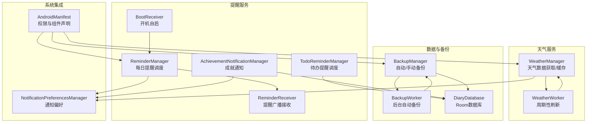
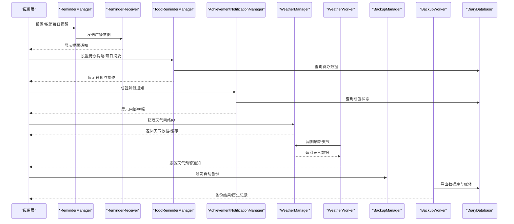
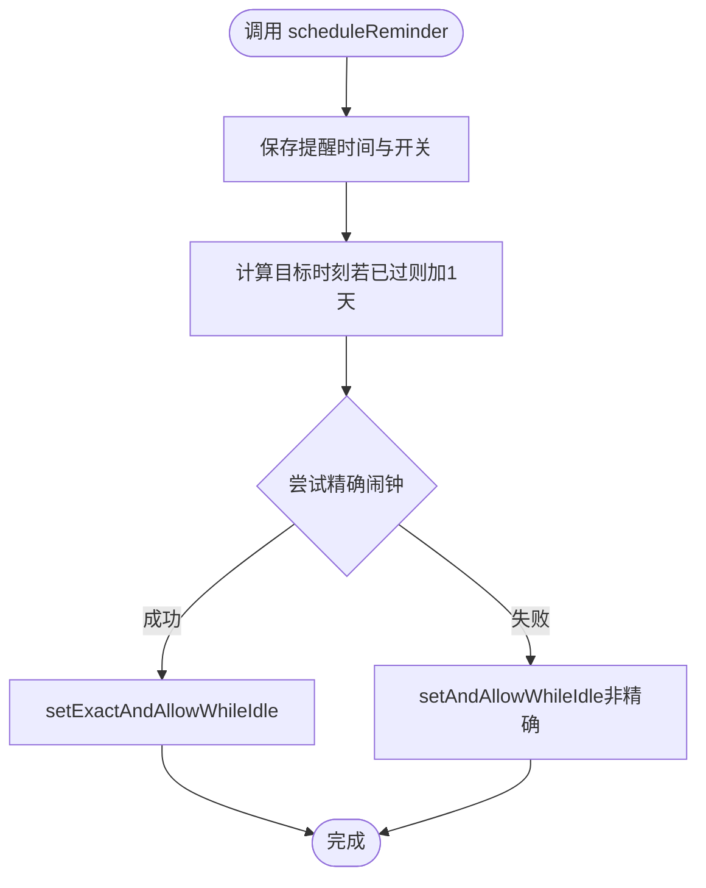
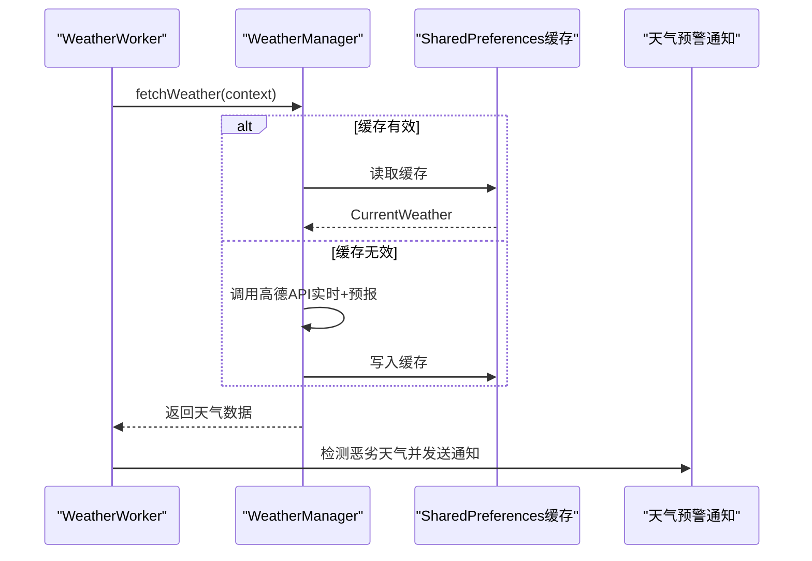
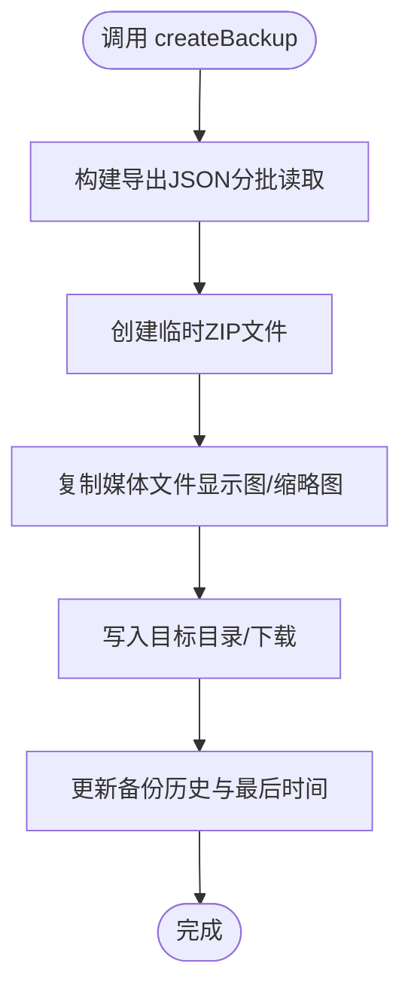
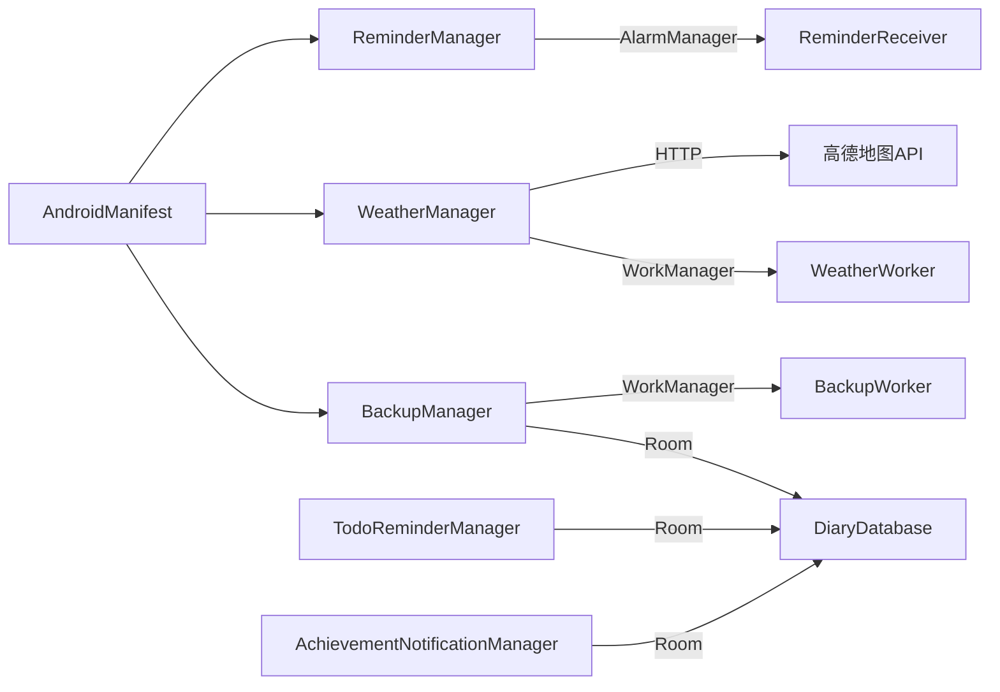

# 服务接口API

<cite>
**本文档引用的文件**
- [ReminderManager.kt](file://app/src/main/java/com/diary/app/reminder/ReminderManager.kt)
- [WeatherManager.kt](file://app/src/main/java/com/diary/app/weather/WeatherManager.kt)
- [BackupManager.kt](file://app/src/main/java/com/diary/app/data/BackupManager.kt)
- [TodoReminderManager.kt](file://app/src/main/java/com/diary/app/reminder/TodoReminderManager.kt)
- [AchievementNotificationManager.kt](file://app/src/main/java/com/diary/app/reminder/AchievementNotificationManager.kt)
- [BootReceiver.kt](file://app/src/main/java/com/diary/app/reminder/BootReceiver.kt)
- [ReminderReceiver.kt](file://app/src/main/java/com/diary/app/reminder/ReminderReceiver.kt)
- [WeatherWorker.kt](file://app/src/main/java/com/diary/app/weather/WeatherWorker.kt)
- [BackupWorker.kt](file://app/src/main/java/com/diary/app/data/BackupWorker.kt)
- [NotificationPreferencesManager.kt](file://app/src/main/java/com/diary/app/reminder/NotificationPreferencesManager.kt)
- [DiaryDatabase.kt](file://app/src/main/java/com/diary/app/data/DiaryDatabase.kt)
- [AndroidManifest.xml](file://app/src/main/AndroidManifest.xml)
- [build.gradle.kts](file://app/build.gradle.kts)
</cite>

## 目录
1. [简介](#简介)
2. [项目结构](#项目结构)
3. [核心组件](#核心组件)
4. [架构概览](#架构概览)
5. [详细组件分析](#详细组件分析)
6. [依赖分析](#依赖分析)
7. [性能考虑](#性能考虑)
8. [故障排除指南](#故障排除指南)
9. [结论](#结论)
10. [附录](#附录)

## 简介
本文件为 DiaryApp 日记应用的核心服务接口API完整文档，重点覆盖以下服务：
- ReminderManager 提醒管理器：负责每日日记提醒的调度、通知与生命周期管理
- WeatherManager 天气管理器：负责天气数据获取、缓存与预警通知
- BackupManager 备份管理器：负责自动备份、手动备份、导入导出与存储权限管理

文档将详细说明各服务的初始化方法、配置参数、生命周期管理、服务间依赖关系与通信机制，并提供最佳实践、常见问题解决方案以及启动、停止、重启和状态监控方法。

## 项目结构
本项目采用模块化设计，核心服务位于以下包路径：
- 提醒服务：app/src/main/java/com/diary/app/reminder
- 天气服务：app/src/main/java/com/diary/app/weather
- 数据与备份：app/src/main/java/com/diary/app/data
- 应用入口与清单：app/src/main/java/com/diary/app/DiaryApplication.kt 与 AndroidManifest.xml

**图表来源**
- [ReminderManager.kt:11-119](file://app/src/main/java/com/diary/app/reminder/ReminderManager.kt#L11-L119)
- [TodoReminderManager.kt:27-248](file://app/src/main/java/com/diary/app/reminder/TodoReminderManager.kt#L27-L248)
- [AchievementNotificationManager.kt:23-87](file://app/src/main/java/com/diary/app/reminder/AchievementNotificationManager.kt#L23-L87)
- [BootReceiver.kt:7-17](file://app/src/main/java/com/diary/app/reminder/BootReceiver.kt#L7-L17)
- [ReminderReceiver.kt:11-70](file://app/src/main/java/com/diary/app/reminder/ReminderReceiver.kt#L11-L70)
- [WeatherManager.kt:49-433](file://app/src/main/java/com/diary/app/weather/WeatherManager.kt#L49-L433)
- [WeatherWorker.kt:17-102](file://app/src/main/java/com/diary/app/weather/WeatherWorker.kt#L17-L102)
- [BackupManager.kt:63-800](file://app/src/main/java/com/diary/app/data/BackupManager.kt#L63-L800)
- [BackupWorker.kt:8-27](file://app/src/main/java/com/diary/app/data/BackupWorker.kt#L8-L27)
- [DiaryDatabase.kt:10-800](file://app/src/main/java/com/diary/app/data/DiaryDatabase.kt#L10-L800)
- [AndroidManifest.xml:1-158](file://app/src/main/AndroidManifest.xml#L1-L158)

**章节来源**
- [AndroidManifest.xml:1-158](file://app/src/main/AndroidManifest.xml#L1-L158)
- [build.gradle.kts:1-145](file://app/build.gradle.kts#L1-L145)

## 核心组件
本节概述三个核心服务的职责与公共接口要点：

- ReminderManager（每日提醒）
  - 职责：设置/取消提醒；生成轮换提醒语；与 AlarmManager 交互；与 ReminderReceiver 广播通信
  - 关键接口：scheduleReminder/cancelReminder/isReminderEnabled/getReminderTime/getReminderMessage/setCustomMessage
  - 生命周期：随应用启动或系统开机自启；支持精确/非精确闹钟；跨进程持久化偏好

- WeatherManager（天气）
  - 职责：定位获取（高德地理编码）→实时天气与预报 → 缓存 → 预警通知
  - 关键接口：fetchWeather/getCachedWeather/isCacheStale/hasLocationPermission/mapAmapWeatherToType
  - 生命周期：协程IO调度；缓存1小时；WorkManager周期刷新；异常重试

- BackupManager（备份）
  - 职责：自动备份调度（WorkManager）；手动备份打包（ZIP）；导入导出扫描；历史记录管理
  - 关键接口：performAutoBackup/createBackup/scheduleAutoBackup/cancelAutoBackup/scanImportableBackupFiles/readBackupForImport
  - 生命周期：按频率策略触发；跨版本兼容；权限适配（Android 10/R）

**章节来源**
- [ReminderManager.kt:11-119](file://app/src/main/java/com/diary/app/reminder/ReminderManager.kt#L11-L119)
- [WeatherManager.kt:49-433](file://app/src/main/java/com/diary/app/weather/WeatherManager.kt#L49-L433)
- [BackupManager.kt:63-800](file://app/src/main/java/com/diary/app/data/BackupManager.kt#L63-L800)

## 架构概览
服务间依赖与通信机制如下：

**图表来源**
- [ReminderManager.kt:62-107](file://app/src/main/java/com/diary/app/reminder/ReminderManager.kt#L62-L107)
- [ReminderReceiver.kt:13-25](file://app/src/main/java/com/diary/app/reminder/ReminderReceiver.kt#L13-L25)
- [TodoReminderManager.kt:59-177](file://app/src/main/java/com/diary/app/reminder/TodoReminderManager.kt#L59-L177)
- [AchievementNotificationManager.kt:34-61](file://app/src/main/java/com/diary/app/reminder/AchievementNotificationManager.kt#L34-L61)
- [WeatherManager.kt:54-67](file://app/src/main/java/com/diary/app/weather/WeatherManager.kt#L54-L67)
- [WeatherWorker.kt:22-33](file://app/src/main/java/com/diary/app/weather/WeatherWorker.kt#L22-L33)
- [BackupManager.kt:414-417](file://app/src/main/java/com/diary/app/data/BackupManager.kt#L414-L417)
- [BackupWorker.kt:13-25](file://app/src/main/java/com/diary/app/data/BackupWorker.kt#L13-L25)
- [DiaryDatabase.kt:16-18](file://app/src/main/java/com/diary/app/data/DiaryDatabase.kt#L16-L18)

## 详细组件分析

### ReminderManager（每日提醒管理器）
- 初始化与配置
  - 通过 SharedPreferences 存储提醒开关、时间、自定义提醒语
  - 使用 AlarmManager 设置精确/允许在节电模式唤醒的闹钟
  - 支持开机自启恢复提醒（BootReceiver）
- 生命周期管理
  - 启动：scheduleReminder(hour, minute)
  - 停止：cancelReminder()
  - 状态查询：isReminderEnabled()/getReminderTime()/getReminderMessage()
- 依赖与通信
  - 依赖 AlarmManager 与 ReminderReceiver 广播
  - 受 NotificationPreferencesManager 控制是否展示
- 最佳实践
  - 在 Android 12+ 上注意精确闹钟权限；降级为非精确闹钟时仍可工作
  - 自定义提醒语为空时使用按“年内第几天”轮换的温和语句
- 常见问题
  - 无精确闹钟权限：自动回退到 setAndAllowWhileIdle
  - 已取消但未清理：确保 cancelReminder 后不再重复调度

**图表来源**
- [ReminderManager.kt:62-98](file://app/src/main/java/com/diary/app/reminder/ReminderManager.kt#L62-L98)

**章节来源**
- [ReminderManager.kt:11-119](file://app/src/main/java/com/diary/app/reminder/ReminderManager.kt#L11-L119)
- [BootReceiver.kt:7-17](file://app/src/main/java/com/diary/app/reminder/BootReceiver.kt#L7-L17)
- [ReminderReceiver.kt:11-70](file://app/src/main/java/com/diary/app/reminder/ReminderReceiver.kt#L11-L70)
- [NotificationPreferencesManager.kt:12-140](file://app/src/main/java/com/diary/app/reminder/NotificationPreferencesManager.kt#L12-L140)

### WeatherManager（天气管理器）
- 初始化与配置
  - 通过高德地图 API 获取实时天气与预报，扩展缓存1小时
  - 定位能力依赖 ACCESS_FINE_LOCATION/ACCESS_COARSE_LOCATION
  - 将中文天气描述映射为图标码
- 生命周期管理
  - fetchWeather：协程IO执行，返回 CurrentWeather 或空
  - getCachedWeather：从 SharedPreferences 读取缓存
  - isCacheStale：判断缓存是否过期
- 依赖与通信
  - 依赖 AlarmManager/WorkManager 周期刷新
  - 通过 WeatherWorker 发送恶劣天气预警通知
- 最佳实践
  - 网络请求设置超时；API Key 通过 BuildConfig 注入
  - 无定位权限时回退至默认城市（北京）
- 常见问题
  - API Key 为空：直接返回空并记录错误
  - 网络异常：返回空并记录警告，由 WeatherWorker 重试

**图表来源**
- [WeatherManager.kt:54-132](file://app/src/main/java/com/diary/app/weather/WeatherManager.kt#L54-L132)
- [WeatherWorker.kt:22-66](file://app/src/main/java/com/diary/app/weather/WeatherWorker.kt#L22-L66)

**章节来源**
- [WeatherManager.kt:49-433](file://app/src/main/java/com/diary/app/weather/WeatherManager.kt#L49-L433)
- [WeatherWorker.kt:17-102](file://app/src/main/java/com/diary/app/weather/WeatherWorker.kt#L17-L102)
- [NotificationPreferencesManager.kt:60-69](file://app/src/main/java/com/diary/app/reminder/NotificationPreferencesManager.kt#L60-L69)

### BackupManager（备份管理器）
- 初始化与配置
  - 自动备份频率枚举：每日/每3/5/7天/每周/每两周/每月/关闭
  - 历史记录管理：JSON序列化存储于 SharedPreferences
  - 备份目录：Documents/DiaryApp 或 Downloads（Android 10以下）
- 生命周期管理
  - scheduleAutoBackup/cancelAutoBackup：基于 WorkManager 的唯一周期任务
  - performAutoBackup：安全捕获异常并返回结果
  - createBackup：构建 ZIP 包含 JSON 与媒体文件，避免 OOM
- 依赖与通信
  - 依赖 DiaryDatabase 与 DiaryDao 进行数据导出
  - 依赖 WorkManager 执行后台任务
- 最佳实践
  - 大量媒体场景使用流式写入临时文件，完成后移动到目标位置
  - 兼容 Android 10+ 存储权限与 MediaStore
- 常见问题
  - 无存储权限：优先写入 Downloads（Android 10+ 使用 MediaStore）
  - 文件名规范化：去除非法字符并确保以特定前缀开头便于扫描

**图表来源**
- [BackupManager.kt:279-328](file://app/src/main/java/com/diary/app/data/BackupManager.kt#L279-L328)
- [BackupManager.kt:365-396](file://app/src/main/java/com/diary/app/data/BackupManager.kt#L365-L396)

**章节来源**
- [BackupManager.kt:63-800](file://app/src/main/java/com/diary/app/data/BackupManager.kt#L63-L800)
- [BackupWorker.kt:8-27](file://app/src/main/java/com/diary/app/data/BackupWorker.kt#L8-L27)
- [DiaryDatabase.kt:10-800](file://app/src/main/java/com/diary/app/data/DiaryDatabase.kt#L10-L800)

### TodoReminderManager（待办提醒管理器）
- 功能特性
  - 为单个待办项设置精确闹钟；支持延迟15分钟与标记完成
  - 每日摘要通知：统计当日与总计待办数量，支持展开列表
  - 重启后重排挂起提醒
- 通知通道
  - 个人提醒通道与每日摘要通道
- 最佳实践
  - Android 12+ 检查 canScheduleExactAlarms 权限
  - 使用 InboxStyle 展示摘要列表

**章节来源**
- [TodoReminderManager.kt:27-248](file://app/src/main/java/com/diary/app/reminder/TodoReminderManager.kt#L27-L248)

### AchievementNotificationManager（成就通知管理器）
- 功能特性
  - 基于 InAppNotificationState 的内嵌横幅通知
  - 定期检查新解锁成就并去重提示
  - 结合 NotificationPreferencesManager 与静默时段控制
- 最佳实践
  - 仅对新解锁成就触发一次通知
  - 静默时段跳过通知

**章节来源**
- [AchievementNotificationManager.kt:23-87](file://app/src/main/java/com/diary/app/reminder/AchievementNotificationManager.kt#L23-L87)

## 依赖分析
- 外部依赖
  - WorkManager：用于 WeatherWorker 与 BackupWorker 的周期任务
  - Room：DiaryDatabase 提供数据访问层
  - Gson：备份导出/导入的 JSON 序列化
  - 高德地图：WeatherManager 的天气与地理编码服务
- 权限与清单
  - INTERNET、ACCESS_FINE_LOCATION、ACCESS_COARSE_LOCATION、RECEIVE_BOOT_COMPLETED、SCHEDULE_EXACT_ALARM、POST_NOTIFICATIONS
  - BootReceiver、ReminderReceiver、TodoReminderReceiver 等广播组件注册

**图表来源**
- [build.gradle.kts:119-139](file://app/build.gradle.kts#L119-L139)
- [AndroidManifest.xml:1-158](file://app/src/main/AndroidManifest.xml#L1-L158)
- [DiaryDatabase.kt:10-800](file://app/src/main/java/com/diary/app/data/DiaryDatabase.kt#L10-L800)

**章节来源**
- [build.gradle.kts:89-145](file://app/build.gradle.kts#L89-L145)
- [AndroidManifest.xml:1-158](file://app/src/main/AndroidManifest.xml#L1-L158)

## 性能考虑
- IO 与内存
  - WeatherManager 使用 Dispatchers.IO 与连接超时，避免主线程阻塞
  - BackupManager 使用临时文件与流式写入 ZIP，避免大量媒体导致 OOM
- 电池与节电
  - ReminderManager 在 Android 12+ 降级为非精确闹钟时仍保持可用
  - WeatherWorker 与 BackupWorker 使用 WorkManager 的指数退避与重试策略
- 网络与缓存
  - WeatherManager 缓存1小时，减少频繁网络请求
  - BackupManager 历史记录与最后备份时间用于智能判断是否需要备份

## 故障排除指南
- 提醒未触发
  - 检查 NotificationPreferencesManager 是否启用每日提醒与静默时段
  - Android 12+ 确认精确闹钟权限；否则将使用非精确闹钟
  - 开机自启：确认 BootReceiver 已正确注册且系统允许开机启动
- 天气数据异常
  - 检查 AMAP_API_KEY 是否注入；无 Key 将直接返回空
  - 定位权限缺失时回退至默认城市（北京），可手动修改定位逻辑
  - 网络异常：查看日志并等待 WeatherWorker 重试
- 备份失败
  - Android 10+ 无存储管理权限：优先写入 Downloads 并使用 MediaStore
  - 文件名不规范：使用 normalizeBackupFileName 规范化
  - 媒体文件缺失：确认媒体目录存在且可读

**章节来源**
- [NotificationPreferencesManager.kt:114-140](file://app/src/main/java/com/diary/app/reminder/NotificationPreferencesManager.kt#L114-L140)
- [ReminderManager.kt:83-98](file://app/src/main/java/com/diary/app/reminder/ReminderManager.kt#L83-L98)
- [WeatherManager.kt:230-236](file://app/src/main/java/com/diary/app/weather/WeatherManager.kt#L230-L236)
- [WeatherWorker.kt:29-32](file://app/src/main/java/com/diary/app/weather/WeatherWorker.kt#L29-L32)
- [BackupManager.kt:109-115](file://app/src/main/java/com/diary/app/data/BackupManager.kt#L109-L115)
- [AndroidManifest.xml:16-18](file://app/src/main/AndroidManifest.xml#L16-L18)

## 结论
本文档系统梳理了 DiaryApp 的三大核心服务：ReminderManager、WeatherManager、BackupManager。它们分别负责用户提醒、环境感知与数据安全，彼此通过系统组件（AlarmManager、WorkManager、BroadcastReceiver）与应用层（SharedPreferences、Room）协同工作。遵循本文的最佳实践与故障排除建议，可显著提升服务稳定性与用户体验。

## 附录
- 服务启动/停止/重启/状态监控
  - ReminderManager：scheduleReminder/cancelReminder/isReminderEnabled
  - WeatherManager：WeatherWorker.schedule（周期调度）、WeatherWorker.ensureChannel（通知通道）
  - BackupManager：scheduleAutoBackup/cancelAutoBackup/performAutoBackup/shouldAutoBackup
- 回调与异步处理
  - WeatherManager：suspend 函数 fetchWeather/getCachedWeather
  - BackupManager：suspend 函数 createBackup/performAutoBackup
  - TodoReminderManager：CoroutineScope 协程调度与通知展示
- 配置参数参考
  - 通知偏好：NotificationPreferencesManager（每日提醒、成就、天气预警、静默时段）
  - 备份频率：BackupFrequency（每日/每3/5/7天/每周/每两周/每月/关闭）