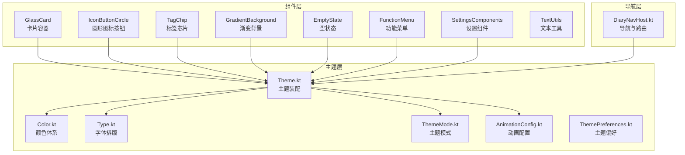
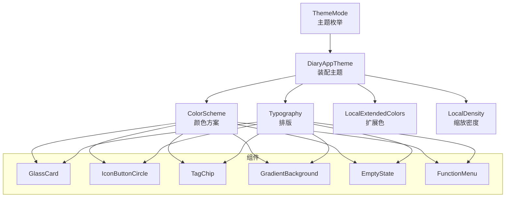
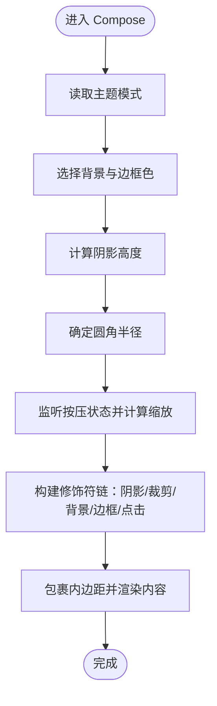
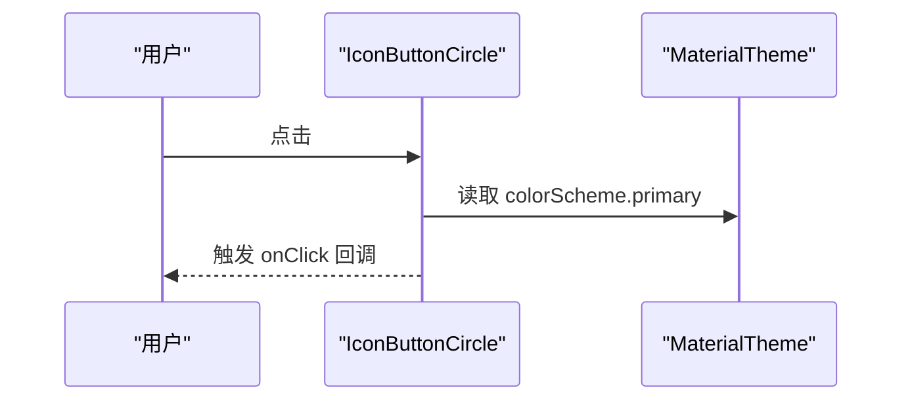
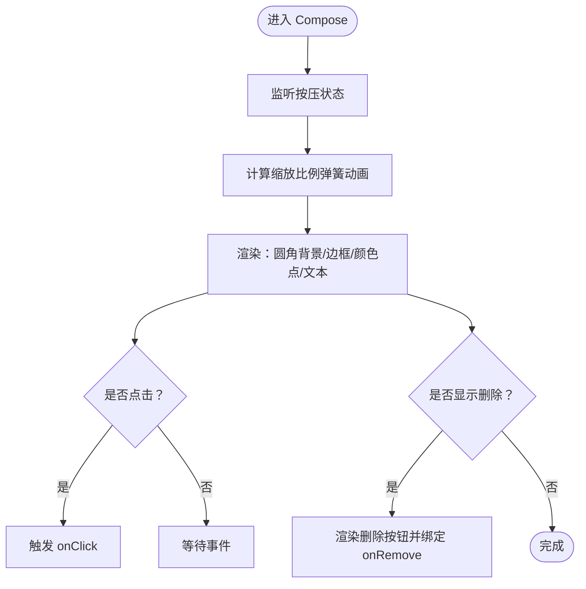
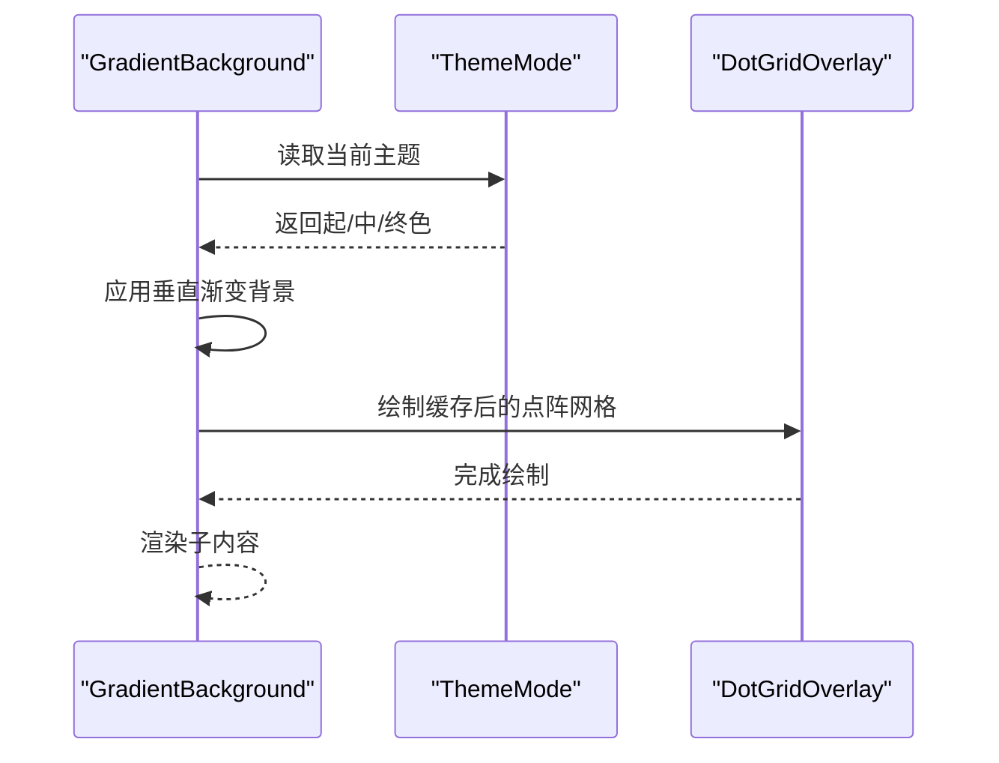
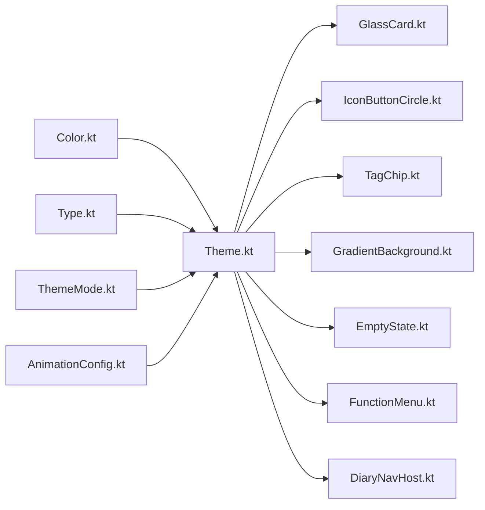

# UI组件库

<cite>
**本文引用的文件**
- [GlassCard.kt](file://app/src/main/java/com/diary/app/ui/components/GlassCard.kt)
- [IconButtonCircle.kt](file://app/src/main/java/com/diary/app/ui/components/IconButtonCircle.kt)
- [TagChip.kt](file://app/src/main/java/com/diary/app/ui/components/TagChip.kt)
- [GradientBackground.kt](file://app/src/main/java/com/diary/app/ui/components/GradientBackground.kt)
- [EmptyState.kt](file://app/src/main/java/com/diary/app/ui/components/EmptyState.kt)
- [FunctionMenu.kt](file://app/src/main/java/com/diary/app/ui/components/FunctionMenu.kt)
- [SettingsComponents.kt](file://app/src/main/java/com/diary/app/ui/components/SettingsComponents.kt)
- [TextUtils.kt](file://app/src/main/java/com/diary/app/ui/components/TextUtils.kt)
- [Color.kt](file://app/src/main/java/com/diary/app/ui/theme/Color.kt)
- [Type.kt](file://app/src/main/java/com/diary/app/ui/theme/Type.kt)
- [Theme.kt](file://app/src/main/java/com/diary/app/ui/theme/Theme.kt)
- [ThemeMode.kt](file://app/src/main/java/com/diary/app/ui/theme/ThemeMode.kt)
- [AnimationConfig.kt](file://app/src/main/java/com/diary/app/ui/theme/AnimationConfig.kt)
- [ThemePreferences.kt](file://app/src/main/java/com/diary/app/ui/theme/ThemePreferences.kt)
- [DiaryNavHost.kt](file://app/src/main/java/com/diary/app/ui/navigation/DiaryNavHost.kt)
</cite>

## 目录
1. [简介](#简介)
2. [项目结构](#项目结构)
3. [核心组件](#核心组件)
4. [架构总览](#架构总览)
5. [详细组件分析](#详细组件分析)
6. [依赖关系分析](#依赖关系分析)
7. [性能考量](#性能考量)
8. [故障排查指南](#故障排查指南)
9. [结论](#结论)
10. [附录](#附录)

## 简介
本文件为 DiaryApp 的 UI 组件库完整文档，聚焦于自定义 UI 组件的设计理念与实现方式，涵盖 GlassCard、IconButtonCircle、TagChip 等卡片与交互组件；系统性阐述主题体系（颜色、字体、动画）；解析导航实现（底部导航、侧边菜单、深度链接）；提供使用示例、配置项与自定义路径；并说明响应式与无障碍支持现状。

## 项目结构
UI 组件与主题系统主要位于 app/src/main/java/com/diary/app/ui 下，按功能域分层组织：
- components：通用 UI 组件（卡片、按钮、标签、背景、空状态、菜单、设置辅助）
- theme：主题系统（颜色、字体、动画配置、主题模式、偏好）
- navigation：导航与路由（底部导航、页面切换、深度链接）

图表来源
- [GlassCard.kt:56-137](file://app/src/main/java/com/diary/app/ui/components/GlassCard.kt#L56-L137)
- [IconButtonCircle.kt:18-43](file://app/src/main/java/com/diary/app/ui/components/IconButtonCircle.kt#L18-L43)
- [TagChip.kt:35-103](file://app/src/main/java/com/diary/app/ui/components/TagChip.kt#L35-L103)
- [GradientBackground.kt:106-141](file://app/src/main/java/com/diary/app/ui/components/GradientBackground.kt#L106-L141)
- [EmptyState.kt:36-116](file://app/src/main/java/com/diary/app/ui/components/EmptyState.kt#L36-L116)
- [FunctionMenu.kt:43-131](file://app/src/main/java/com/diary/app/ui/components/FunctionMenu.kt#L43-L131)
- [SettingsComponents.kt:28-141](file://app/src/main/java/com/diary/app/ui/components/SettingsComponents.kt#L28-L141)
- [TextUtils.kt:1-65](file://app/src/main/java/com/diary/app/ui/components/TextUtils.kt#L1-L65)
- [Color.kt:1-394](file://app/src/main/java/com/diary/app/ui/theme/Color.kt#L1-L394)
- [Type.kt:1-74](file://app/src/main/java/com/diary/app/ui/theme/Type.kt#L1-L74)
- [Theme.kt:500-576](file://app/src/main/java/com/diary/app/ui/theme/Theme.kt#L500-L576)
- [ThemeMode.kt:1-99](file://app/src/main/java/com/diary/app/ui/theme/ThemeMode.kt#L1-L99)
- [AnimationConfig.kt:1-40](file://app/src/main/java/com/diary/app/ui/theme/AnimationConfig.kt#L1-L40)
- [ThemePreferences.kt:1-26](file://app/src/main/java/com/diary/app/ui/theme/ThemePreferences.kt#L1-L26)
- [DiaryNavHost.kt:1-900](file://app/src/main/java/com/diary/app/ui/navigation/DiaryNavHost.kt#L1-L900)

章节来源
- [DiaryNavHost.kt:1-900](file://app/src/main/java/com/diary/app/ui/navigation/DiaryNavHost.kt#L1-L900)

## 核心组件
- GlassCard：带圆角、边框、阴影与点击缩放反馈的卡片容器，支持主题色与可选渐变背景，适配深浅色模式与多种主题风格。
- IconButtonCircle：轻量圆形图标按钮，基于 Material 主题色与透明度，统一尺寸与点击反馈。
- TagChip：带颜色点、可选删除按钮的标签组件，支持点击与按压缩放反馈，用于标签选择/展示。
- GradientBackground：根据当前主题生成垂直渐变背景，并叠加点阵纹理网格，提升纸感与层次。
- EmptyState：空状态占位，提供呼吸动画与渐变背景，配合标题/副标题与可选操作区。
- FunctionMenu：右上角弹出式功能菜单，支持遮罩层与滑入/淡出动画。
- SettingsComponents：设置页常用组件（分割线、分组标题、彩色图标圆块）。
- TextUtils：时间格式化、预览文本清理、字数格式化等工具函数。

章节来源
- [GlassCard.kt:56-137](file://app/src/main/java/com/diary/app/ui/components/GlassCard.kt#L56-L137)
- [IconButtonCircle.kt:18-43](file://app/src/main/java/com/diary/app/ui/components/IconButtonCircle.kt#L18-L43)
- [TagChip.kt:35-103](file://app/src/main/java/com/diary/app/ui/components/TagChip.kt#L35-L103)
- [GradientBackground.kt:106-141](file://app/src/main/java/com/diary/app/ui/components/GradientBackground.kt#L106-L141)
- [EmptyState.kt:36-116](file://app/src/main/java/com/diary/app/ui/components/EmptyState.kt#L36-L116)
- [FunctionMenu.kt:43-131](file://app/src/main/java/com/diary/app/ui/components/FunctionMenu.kt#L43-L131)
- [SettingsComponents.kt:28-141](file://app/src/main/java/com/diary/app/ui/components/SettingsComponents.kt#L28-L141)
- [TextUtils.kt:1-65](file://app/src/main/java/com/diary/app/ui/components/TextUtils.kt#L1-L65)

## 架构总览
主题系统通过 CompositionLocal 提供主题模式、扩展颜色与缩放密度，组件在运行时读取当前主题并渲染对应外观。导航层以 NavHost 承载多屏页面，结合底部导航与转场动画实现流畅切换。

图表来源
- [ThemeMode.kt:16-77](file://app/src/main/java/com/diary/app/ui/theme/ThemeMode.kt#L16-L77)
- [Theme.kt:500-576](file://app/src/main/java/com/diary/app/ui/theme/Theme.kt#L500-L576)
- [Color.kt:1-394](file://app/src/main/java/com/diary/app/ui/theme/Color.kt#L1-L394)
- [Type.kt:9-74](file://app/src/main/java/com/diary/app/ui/theme/Type.kt#L9-L74)

## 详细组件分析

### GlassCard 组件
- 设计目标：在不同主题下提供一致的卡片质感，支持圆角、边框、阴影与点击缩放反馈。
- 关键能力
  - 主题感知：根据当前主题模式选择背景与边框色，深色模式边框更细，浅色模式边框稍粗。
  - 渐变支持：可传入渐变色列表覆盖默认背景色。
  - 点击反馈：按压时轻微缩放（100ms tween），增强触控反馈。
  - 内边距：内部内容区域统一内边距，便于嵌套布局。
- 使用建议
  - 适合放置卡片式内容（统计卡片、功能入口、信息面板）。
  - 若需要投影，启用阴影参数以匹配深色模式视觉层级。
- 自定义路径
  - 背景色/边框色：通过主题模式映射或直接传入渐变色。
  - 圆角与阴影：通过参数调整，注意与 Material 3 卡片规范保持一致。

图表来源
- [GlassCard.kt:56-137](file://app/src/main/java/com/diary/app/ui/components/GlassCard.kt#L56-L137)

章节来源
- [GlassCard.kt:56-137](file://app/src/main/java/com/diary/app/ui/components/GlassCard.kt#L56-L137)

### IconButtonCircle 组件
- 设计目标：统一的圆形图标按钮，强调可点击性与一致性。
- 关键能力
  - 尺寸与图标大小可配置。
  - 背景采用主色 10% 透明度，图标采用主色。
  - 支持点击回调与无障碍描述。
- 使用建议
  - 适合悬浮操作、功能入口、工具栏按钮。
  - 注意 contentDescription 的本地化与可访问性。

图表来源
- [IconButtonCircle.kt:18-43](file://app/src/main/java/com/diary/app/ui/components/IconButtonCircle.kt#L18-L43)

章节来源
- [IconButtonCircle.kt:18-43](file://app/src/main/java/com/diary/app/ui/components/IconButtonCircle.kt#L18-L43)

### TagChip 组件
- 设计目标：轻量标签展示与交互，支持可选删除。
- 关键能力
  - 颜色点与名称文本，文字采用主题色。
  - 可选删除按钮，点击后触发 onRemove。
  - 按压缩放反馈，使用弹簧动画提升触控体验。
- 使用建议
  - 适合标签选择、筛选条件、分类标识。
  - 删除按钮仅在需要时显示（showRemove）。

图表来源
- [TagChip.kt:35-103](file://app/src/main/java/com/diary/app/ui/components/TagChip.kt#L35-L103)

章节来源
- [TagChip.kt:35-103](file://app/src/main/java/com/diary/app/ui/components/TagChip.kt#L35-L103)

### GradientBackground 组件
- 设计目标：为页面提供柔和渐变背景与点阵纹理，营造纸感与层次。
- 关键能力
  - 根据主题模式选择起/中/终三色渐变。
  - 点阵网格使用 drawWithCache 缓存路径，避免重复计算。
  - 内容层叠加在渐变之上，保证可读性。
- 使用建议
  - 作为页面根背景使用，确保内容不被遮挡。
  - 在深色模式下降低点阵透明度以提升对比。

图表来源
- [GradientBackground.kt:106-141](file://app/src/main/java/com/diary/app/ui/components/GradientBackground.kt#L106-L141)

章节来源
- [GradientBackground.kt:106-141](file://app/src/main/java/com/diary/app/ui/components/GradientBackground.kt#L106-L141)

### EmptyState 组件
- 设计目标：在无数据/无结果场景提供温和的视觉反馈与引导。
- 关键能力
  - 呼吸动画（3 秒往返），使用缓动曲线。
  - 渐变背景与主次色搭配，提升柔和度。
  - 支持标题、副标题与可选操作区。
- 使用建议
  - 与 FunctionMenu 或引导按钮组合使用，提升转化。

章节来源
- [EmptyState.kt:36-116](file://app/src/main/java/com/diary/app/ui/components/EmptyState.kt#L36-L116)

### FunctionMenu 组件
- 设计目标：右上角弹出式菜单，承载功能入口。
- 关键能力
  - 全屏遮罩层，点击空白区域关闭。
  - 滑入/淡入与滑出/淡出动画。
  - 列表项点击后自动收起。
- 使用建议
  - 适合设置、更多操作、快捷功能入口。

章节来源
- [FunctionMenu.kt:43-131](file://app/src/main/java/com/diary/app/ui/components/FunctionMenu.kt#L43-L131)

### SettingsComponents 组件
- 设计目标：统一设置页的视觉与交互元素。
- 关键能力
  - 分割线：渐变横向分割，弱化边界。
  - 分组标题：彩色图标圆块 + 标题 + 渐变分隔线。
  - 图标圆块：彩色背景与图标，统一尺寸与圆角。

章节来源
- [SettingsComponents.kt:28-141](file://app/src/main/java/com/diary/app/ui/components/SettingsComponents.kt#L28-L141)

### TextUtils 工具
- 时间格式化：小时分钟、日期+时间。
- 文本清理：去除复选框符号、列表符号、多余换行。
- 字数格式化：中文单位（万/千/字）与数值格式。

章节来源
- [TextUtils.kt:1-65](file://app/src/main/java/com/diary/app/ui/components/TextUtils.kt#L1-L65)

## 依赖关系分析
- 组件对主题系统的依赖
  - 颜色：通过 Color.kt 中的颜色常量与 Theme.kt 的 ColorScheme 映射。
  - 字体：通过 Type.kt 的 Typography。
  - 动画：通过 AnimationConfig.kt 的统一配置。
  - 主题模式：通过 ThemeMode.kt 的枚举与 isDark 判定。
- 导航与主题
  - DiaryNavHost.kt 在 Scaffold 容器中使用 MaterialTheme 的背景色，底部导航与转场动画均基于 Material 3。

图表来源
- [Color.kt:1-394](file://app/src/main/java/com/diary/app/ui/theme/Color.kt#L1-L394)
- [Type.kt:1-74](file://app/src/main/java/com/diary/app/ui/theme/Type.kt#L1-L74)
- [Theme.kt:500-576](file://app/src/main/java/com/diary/app/ui/theme/Theme.kt#L500-L576)
- [ThemeMode.kt:1-99](file://app/src/main/java/com/diary/app/ui/theme/ThemeMode.kt#L1-L99)
- [AnimationConfig.kt:1-40](file://app/src/main/java/com/diary/app/ui/theme/AnimationConfig.kt#L1-L40)
- [GlassCard.kt:56-137](file://app/src/main/java/com/diary/app/ui/components/GlassCard.kt#L56-L137)
- [IconButtonCircle.kt:18-43](file://app/src/main/java/com/diary/app/ui/components/IconButtonCircle.kt#L18-L43)
- [TagChip.kt:35-103](file://app/src/main/java/com/diary/app/ui/components/TagChip.kt#L35-L103)
- [GradientBackground.kt:106-141](file://app/src/main/java/com/diary/app/ui/components/GradientBackground.kt#L106-L141)
- [EmptyState.kt:36-116](file://app/src/main/java/com/diary/app/ui/components/EmptyState.kt#L36-L116)
- [FunctionMenu.kt:43-131](file://app/src/main/java/com/diary/app/ui/components/FunctionMenu.kt#L43-L131)
- [DiaryNavHost.kt:1-900](file://app/src/main/java/com/diary/app/ui/navigation/DiaryNavHost.kt#L1-L900)

章节来源
- [Theme.kt:500-576](file://app/src/main/java/com/diary/app/ui/theme/Theme.kt#L500-L576)
- [DiaryNavHost.kt:1-900](file://app/src/main/java/com/diary/app/ui/navigation/DiaryNavHost.kt#L1-L900)

## 性能考量
- GradientBackground 使用 drawWithCache 缓存点阵路径，避免每帧重算，适合大面积背景。
- GlassCard 的按压缩放使用动画状态机，短时 tween，保证流畅性。
- FunctionMenu 的遮罩层与动画采用组合动画，注意在低端设备上的帧率表现。
- TextUtils 的正则清理在长文本场景需关注执行成本，必要时进行分段处理或缓存中间结果。

## 故障排查指南
- 主题未生效
  - 检查是否在应用根部包裹 DiaryAppTheme，并正确传递 ThemeMode。
  - 确认 ThemePreferences 保存的主题名与 resolveThemeModeName 的映射一致。
- 颜色异常
  - 确认 Color.kt 中的颜色值与主题模式映射关系正确。
  - 检查 LocalExtendedColors 是否在需要时被正确读取。
- 动画卡顿
  - 减少复杂层级与过度绘制，优先使用硬件加速的修饰符。
  - 对高频动画（如 EmptyState 呼吸）控制动画时长与缓动。
- 导航跳转失败
  - 检查 Screen 路由定义与 DiayNavHost 中的 composable 注册是否一致。
  - 深度链接参数类型与默认值需与 navArgument 一致。

章节来源
- [Theme.kt:500-576](file://app/src/main/java/com/diary/app/ui/theme/Theme.kt#L500-L576)
- [ThemePreferences.kt:1-26](file://app/src/main/java/com/diary/app/ui/theme/ThemePreferences.kt#L1-L26)
- [DiaryNavHost.kt:135-183](file://app/src/main/java/com/diary/app/ui/navigation/DiaryNavHost.kt#L135-L183)

## 结论
该 UI 组件库围绕 Material 3 主题体系，提供高内聚、低耦合的组件集合。主题系统通过 CompositionLocal 实现全局感知，组件在运行时动态适配颜色、字体与动画。导航层以 NavHost 为核心，结合底部导航与页面转场，形成一致的用户体验。建议在实际使用中遵循组件职责边界，合理利用主题与动画配置，确保在多主题与多设备上的一致性与性能表现。

## 附录

### 主题系统与颜色体系
- 颜色体系：包含纯白/雾蓝灰、苔藓绿、海潮蓝、陶粉玫瑰、沙金琥珀、陶土纸、墨石等主题族，每族提供亮/暗两套配色与卡片背景/边框色。
- 字体排版：Serif 家族标题、Default 家族标签，提供多级字号与行高、字距。
- 动画配置：统一的弹簧与 tween 参数，适用于按钮、卡片、面板展开与列表项入场等场景。
- 主题模式：枚举包含 12 种模式，支持静态判定深浅色与家族映射。
- 主题偏好：SharedPreferences 存储与读取主题模式，自动修复历史命名。

章节来源
- [Color.kt:1-394](file://app/src/main/java/com/diary/app/ui/theme/Color.kt#L1-L394)
- [Type.kt:1-74](file://app/src/main/java/com/diary/app/ui/theme/Type.kt#L1-L74)
- [AnimationConfig.kt:1-40](file://app/src/main/java/com/diary/app/ui/theme/AnimationConfig.kt#L1-L40)
- [ThemeMode.kt:1-99](file://app/src/main/java/com/diary/app/ui/theme/ThemeMode.kt#L1-L99)
- [Theme.kt:500-576](file://app/src/main/java/com/diary/app/ui/theme/Theme.kt#L500-L576)
- [ThemePreferences.kt:1-26](file://app/src/main/java/com/diary/app/ui/theme/ThemePreferences.kt#L1-L26)

### 导航与深度链接
- 底部导航：Home、Timeline、Tools、Todo、Profile 五项，支持手势切换与徽章。
- 页面转场：基于 NavHost 的滑入/滑出与淡入/淡出，跨底部项时带有方向性动画。
- 深度链接：Editor 与 Detail 支持参数化路由，MonthlyReport 支持年/月参数。
- 侧边菜单：DiaryBottomNavigationBar 与 FunctionMenu 提供二级入口与设置项。

章节来源
- [DiaryNavHost.kt:135-183](file://app/src/main/java/com/diary/app/ui/navigation/DiaryNavHost.kt#L135-L183)
- [DiaryNavHost.kt:199-246](file://app/src/main/java/com/diary/app/ui/navigation/DiaryNavHost.kt#L199-L246)
- [DiaryNavHost.kt:247-776](file://app/src/main/java/com/diary/app/ui/navigation/DiaryNavHost.kt#L247-L776)
- [DiaryNavHost.kt:778-800](file://app/src/main/java/com/diary/app/ui/navigation/DiaryNavHost.kt#L778-L800)