# 主题系统

<cite>
**本文档引用的文件**
- [Theme.kt](file://app/src/main/java/com/diary/app/ui/theme/Theme.kt)
- [Color.kt](file://app/src/main/java/com/diary/app/ui/theme/Color.kt)
- [Type.kt](file://app/src/main/java/com/diary/app/ui/theme/Type.kt)
- [DesignTokens.kt](file://app/src/main/java/com/diary/app/ui/theme/DesignTokens.kt)
- [ThemeMode.kt](file://app/src/main/java/com/diary/app/ui/theme/ThemeMode.kt)
- [ThemePreferences.kt](file://app/src/main/java/com/diary/app/ui/theme/ThemePreferences.kt)
- [AnimationConfig.kt](file://app/src/main/java/com/diary/app/ui/theme/AnimationConfig.kt)
- [MainActivity.kt](file://app/src/main/java/com/diary/app/MainActivity.kt)
- [DiaryApplication.kt](file://app/src/main/java/com/diary/app/DiaryApplication.kt)
- [GlassCard.kt](file://app/src/main/java/com/diary/app/ui/components/GlassCard.kt)
- [GradientBackground.kt](file://app/src/main/java/com/diary/app/ui/components/GradientBackground.kt)
</cite>

## 目录
1. [简介](#简介)
2. [项目结构](#项目结构)
3. [核心组件](#核心组件)
4. [架构概览](#架构概览)
5. [详细组件分析](#详细组件分析)
6. [依赖关系分析](#依赖关系分析)
7. [性能考虑](#性能考虑)
8. [故障排除指南](#故障排除指南)
9. [结论](#结论)
10. [附录：主题定制与扩展指南](#附录主题定制与扩展指南)

## 简介

DiaryApp 的主题系统是一个基于 Jetpack Compose 的现代化设计系统，提供了完整的颜色体系、字体系统和动画配置。该系统支持多种主题变体（浅色/深色），具有良好的可扩展性和一致性。

系统的核心设计理念是通过统一的设计令牌（Design Tokens）来确保跨平台的一致性，同时提供灵活的主题定制能力。主题系统不仅处理视觉外观，还包括动画效果、字体缩放和状态栏适配等用户体验要素。

## 项目结构

主题系统位于 `app/src/main/java/com/diary/app/ui/theme/` 目录下，采用模块化设计：

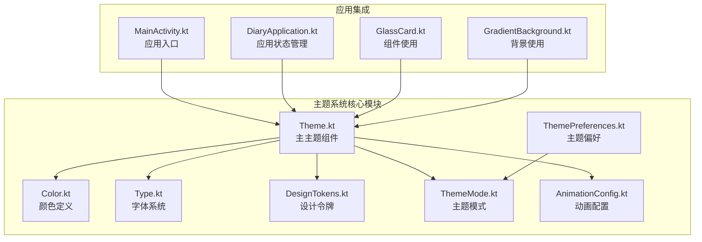

**图表来源**
- [Theme.kt:1-576](file://app/src/main/java/com/diary/app/ui/theme/Theme.kt#L1-L576)
- [Color.kt:1-394](file://app/src/main/java/com/diary/app/ui/theme/Color.kt#L1-L394)
- [ThemeMode.kt:1-99](file://app/src/main/java/com/diary/app/ui/theme/ThemeMode.kt#L1-L99)

**章节来源**
- [Theme.kt:1-50](file://app/src/main/java/com/diary/app/ui/theme/Theme.kt#L1-L50)
- [Color.kt:1-50](file://app/src/main/java/com/diary/app/ui/theme/Color.kt#L1-L50)

## 核心组件

### 颜色体系 Color

DiaryApp 实现了多套主题色彩方案，每套主题都包含完整的颜色层次：

#### 主题家族结构
系统支持7个主要主题家族，每个家族包含浅色和深色两种变体：

| 主题家族 | 关键色 | 背景色 | 表面色 |
|---------|--------|--------|--------|
| 雾蓝灰 (Pure Blue-Gray) | 福蓝 | 浅蓝灰 | 白色/深灰 |
| 苔藓绿 (Moss Green) | 薄荷绿 | 米白绿 | 浅绿灰 |
| 海潮蓝 (Ocean Tide) | 青绿 | 天蓝 | 白色/深蓝 |
| 陶粉玫瑰 (Petal Rose) | 玫瑰粉 | 珊瑚粉 | 白色/深粉 |
| 沙金琥珀 (Sand Amber) | 橘黄 | 浅黄 | 白色/深黄 |
| 鈞瓦纸 (Clay Paper) | 砖红 | 砂岩粉 | 白色/深红 |
| 涧石墨 (Ink Slate) | 薰衣草 | 深蓝 | 深灰 |

#### 颜色层次设计
每个主题都遵循 Material Design 的颜色层次规范：

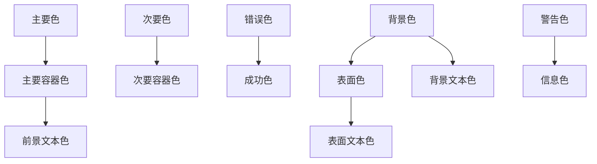

**图表来源**
- [Color.kt:128-164](file://app/src/main/java/com/diary/app/ui/theme/Color.kt#L128-L164)
- [Color.kt:274-394](file://app/src/main/java/com/diary/app/ui/theme/Color.kt#L274-L394)

#### 扩展颜色系统
系统还定义了 `ExtendedColors` 数据类，提供额外的颜色语义：

- success: 成功状态颜色
- warning: 警告状态颜色  
- info: 信息提示颜色
- gradientStart/gradientEnd: 渐变起止色

**章节来源**
- [Color.kt:107-124](file://app/src/main/java/com/diary/app/ui/theme/Color.kt#L107-L124)
- [Color.kt:128-498](file://app/src/main/java/com/diary/app/ui/theme/Color.kt#L128-L498)

### 字体系统 Type

字体系统采用统一的排版层次结构，支持动态字体缩放：

#### 字体层次结构
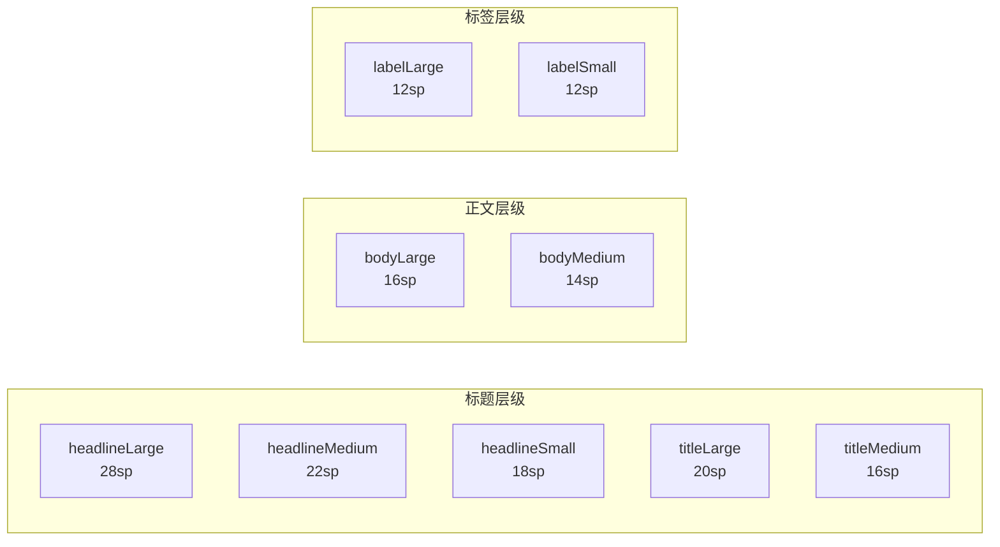

**图表来源**
- [Type.kt:9-73](file://app/src/main/java/com/diary/app/ui/theme/Type.kt#L9-L73)
- [Theme.kt:26-90](file://app/src/main/java/com/diary/app/ui/theme/Theme.kt#L26-L90)

#### 动态字体缩放
系统支持6个预设字体大小级别：
- tiny (0.85x)
- smaller (0.92x) 
- small (1.0x) 默认
- medium_small (1.07x)
- medium (1.15x)
- large (1.3x)
- extra_large (1.5x)

**章节来源**
- [Type.kt:1-74](file://app/src/main/java/com/diary/app/ui/theme/Type.kt#L1-L74)
- [Theme.kt:92-105](file://app/src/main/java/com/diary/app/ui/theme/Theme.kt#L92-L105)

### 设计令牌 DesignTokens

设计令牌系统基于4dp网格系统，提供统一的间距、圆角和尺寸标准：

#### 尺寸标准
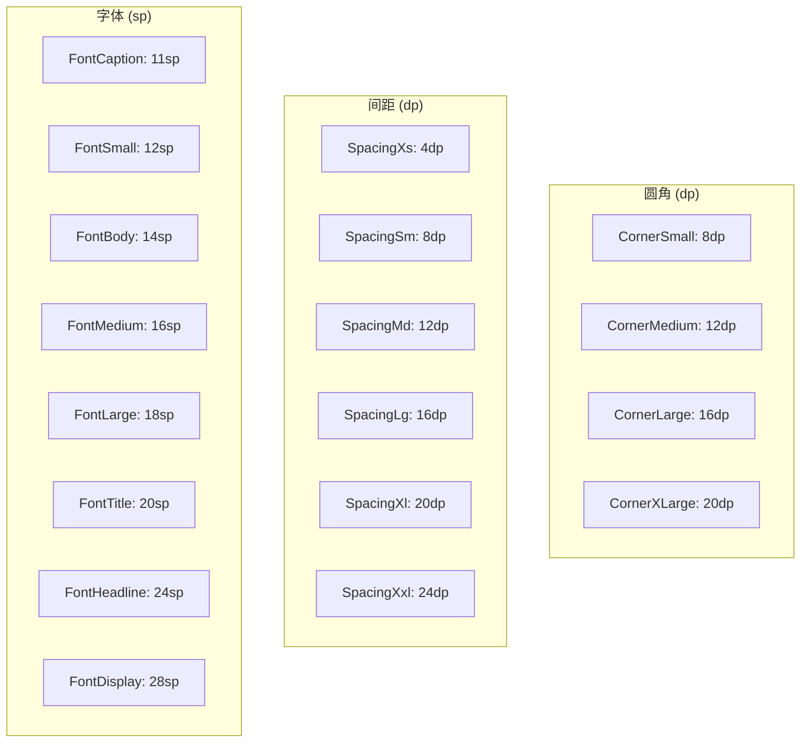

**图表来源**
- [DesignTokens.kt:10-49](file://app/src/main/java/com/diary/app/ui/theme/DesignTokens.kt#L10-L49)

**章节来源**
- [DesignTokens.kt:1-50](file://app/src/main/java/com/diary/app/ui/theme/DesignTokens.kt#L1-L50)

### 主题模式 ThemeMode

主题模式系统采用枚举类型定义，支持12种不同的主题组合：

#### 主题分类
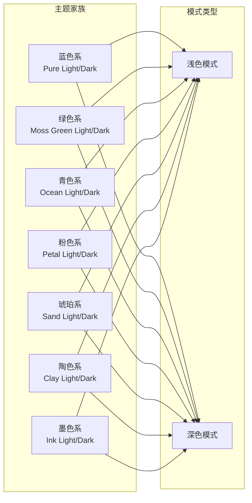

**图表来源**
- [ThemeMode.kt:6-37](file://app/src/main/java/com/diary/app/ui/theme/ThemeMode.kt#L6-L37)

#### 主题解析机制
系统提供了灵活的主题名称解析功能，支持多种命名格式：
- 完整枚举名
- 系统默认值
- 别名映射
- 回退机制

**章节来源**
- [ThemeMode.kt:16-99](file://app/src/main/java/com/diary/app/ui/theme/ThemeMode.kt#L16-L99)

### 主题偏好 ThemePreferences

主题偏好系统负责持久化用户的选择，并提供便捷的访问接口：

#### 存储机制
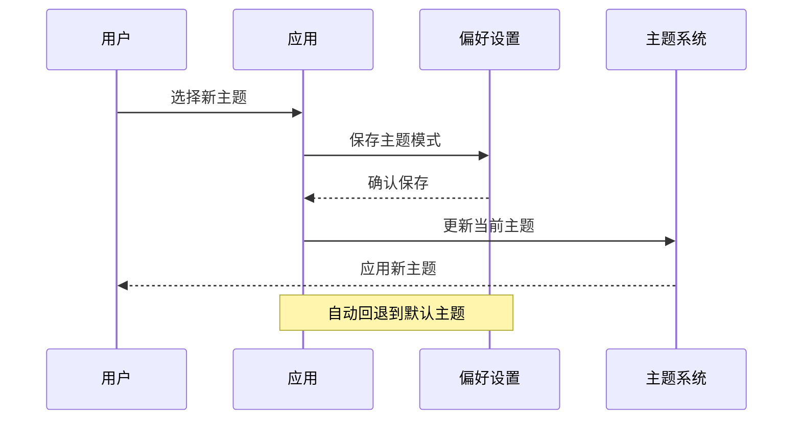

**图表来源**
- [ThemePreferences.kt:5-25](file://app/src/main/java/com/diary/app/ui/theme/ThemePreferences.kt#L5-L25)

**章节来源**
- [ThemePreferences.kt:1-26](file://app/src/main/java/com/diary/app/ui/theme/ThemePreferences.kt#L1-L26)

### 动画配置 AnimationConfig

动画系统提供柔和且一致的交互体验：

#### 动画类型
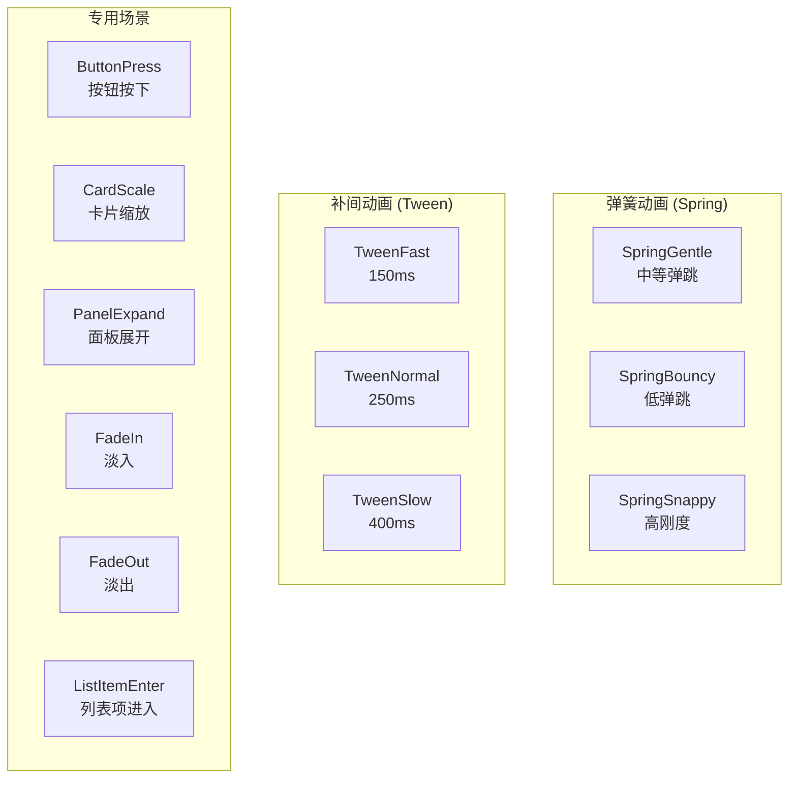

**图表来源**
- [AnimationConfig.kt:10-39](file://app/src/main/java/com/diary/app/ui/theme/AnimationConfig.kt#L10-L39)

**章节来源**
- [AnimationConfig.kt:1-40](file://app/src/main/java/com/diary/app/ui/theme/AnimationConfig.kt#L1-L40)

## 架构概览

DiaryApp 的主题系统采用分层架构设计，确保了高度的模块化和可维护性：

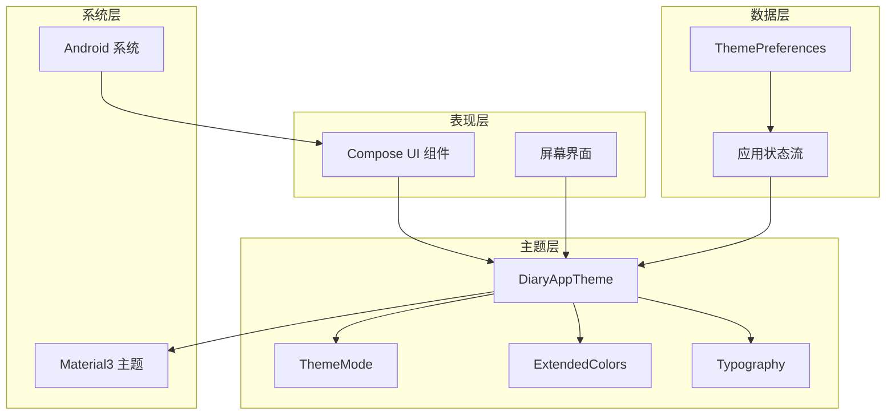

**图表来源**
- [Theme.kt:500-576](file://app/src/main/java/com/diary/app/ui/theme/Theme.kt#L500-L576)
- [DiaryApplication.kt:40-41](file://app/src/main/java/com/diary/app/DiaryApplication.kt#L40-L41)

系统的关键特性包括：

1. **响应式设计**: 支持动态主题切换和字体缩放
2. **状态管理**: 使用 Kotlin Flow 管理主题状态
3. **持久化存储**: 自动保存用户偏好的主题设置
4. **系统集成**: 自动适配状态栏和导航栏外观
5. **扩展性**: 易于添加新的主题变体和颜色方案

**章节来源**
- [Theme.kt:500-576](file://app/src/main/java/com/diary/app/ui/theme/Theme.kt#L500-L576)
- [MainActivity.kt:88-125](file://app/src/main/java/com/diary/app/MainActivity.kt#L88-L125)

## 详细组件分析

### 主题应用组件 DiaryAppTheme

DiaryAppTheme 是整个主题系统的核心组件，负责协调各个子系统的协同工作：

#### 组件架构
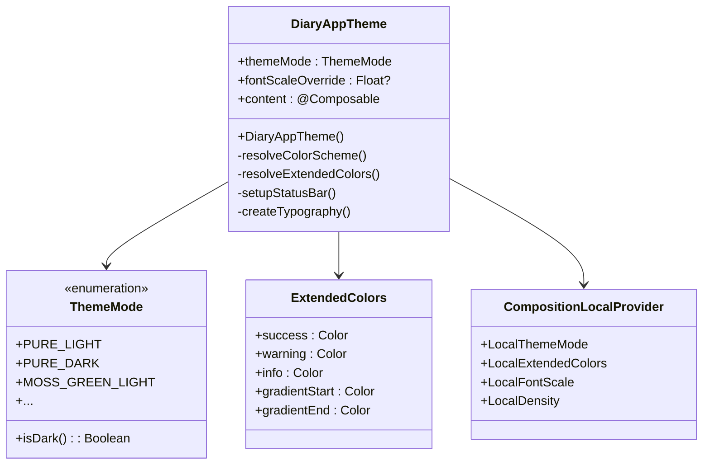

**图表来源**
- [Theme.kt:500-576](file://app/src/main/java/com/diary/app/ui/theme/Theme.kt#L500-L576)
- [ThemeMode.kt:16-60](file://app/src/main/java/com/diary/app/ui/theme/ThemeMode.kt#L16-L60)

#### 状态栏适配机制
系统实现了智能的状态栏适配，根据主题明暗自动调整状态栏图标颜色：

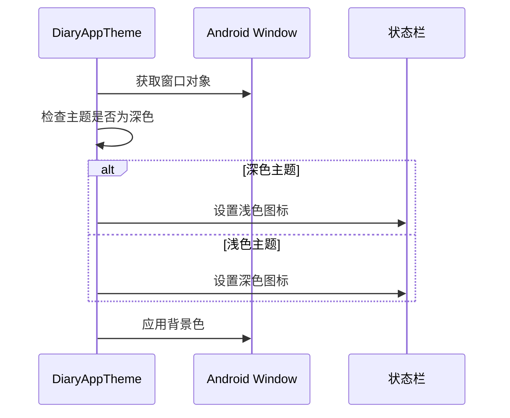

**图表来源**
- [Theme.kt:545-553](file://app/src/main/java/com/diary/app/ui/theme/Theme.kt#L545-L553)

**章节来源**
- [Theme.kt:500-576](file://app/src/main/java/com/diary/app/ui/theme/Theme.kt#L500-L576)

### 颜色定义系统

颜色系统采用了模块化的组织方式，每个主题都有完整的颜色定义：

#### 颜色层次结构
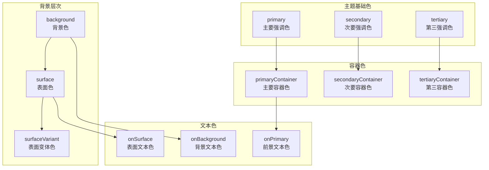

**图表来源**
- [Color.kt:128-164](file://app/src/main/java/com/diary/app/ui/theme/Color.kt#L128-L164)
- [Color.kt:274-394](file://app/src/main/java/com/diary/app/ui/theme/Color.kt#L274-L394)

**章节来源**
- [Color.kt:128-498](file://app/src/main/java/com/diary/app/ui/theme/Color.kt#L128-L498)

### 组件集成示例

#### 玻璃卡片组件
GlassCard 组件展示了如何在实际 UI 中使用主题系统：

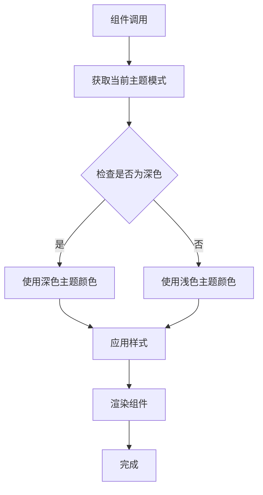

**图表来源**
- [GlassCard.kt:66-84](file://app/src/main/java/com/diary/app/ui/components/GlassCard.kt#L66-L84)

**章节来源**
- [GlassCard.kt:56-137](file://app/src/main/java/com/diary/app/ui/components/GlassCard.kt#L56-L137)

## 依赖关系分析

主题系统的依赖关系清晰且层次分明：

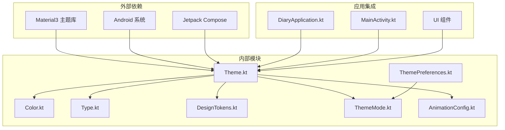

**图表来源**
- [Theme.kt:1-22](file://app/src/main/java/com/diary/app/ui/theme/Theme.kt#L1-L22)
- [MainActivity.kt:63-70](file://app/src/main/java/com/diary/app/MainActivity.kt#L63-L70)

**章节来源**
- [DiaryApplication.kt:19-21](file://app/src/main/java/com/diary/app/DiaryApplication.kt#L19-L21)

## 性能考虑

主题系统在设计时充分考虑了性能优化：

### 内存管理
- 使用 `remember` 缓存计算结果
- 避免不必要的重组
- 合理使用 `staticCompositionLocalOf` 减少内存分配

### 渲染优化
- 颜色方案按需计算，避免重复创建
- 字体缩放通过局部变量缓存
- 动画配置使用常量定义

### 状态管理
- 使用 Kotlin Flow 进行响应式状态管理
- 避免全局状态污染
- 合理的生命周期管理

## 故障排除指南

### 常见问题及解决方案

#### 主题切换不生效
1. **检查主题状态流**: 确保 `DiaryApplication.themeMode` 正确更新
2. **验证偏好存储**: 检查 `ThemePreferences` 是否正确保存
3. **确认重组**: 确保使用 `collectAsState()` 订阅状态变化

#### 字体缩放异常
1. **检查偏好设置**: 验证字体大小偏好值的有效性
2. **确认缓存更新**: 确保 `getFontScale()` 返回正确的缩放值
3. **测试不同设备**: 在不同 DPI 设备上验证显示效果

#### 状态栏颜色错误
1. **检查主题模式**: 确认 `ThemeMode.isDark()` 返回正确结果
2. **验证窗口权限**: 确保应用有修改系统 UI 的权限
3. **测试不同主题**: 验证各主题的状态栏适配效果

**章节来源**
- [Theme.kt:545-553](file://app/src/main/java/com/diary/app/ui/theme/Theme.kt#L545-L553)
- [MainActivity.kt:93-102](file://app/src/main/java/com/diary/app/MainActivity.kt#L93-L102)

## 结论

DiaryApp 的主题系统展现了现代移动应用设计系统的最佳实践。通过模块化的设计、清晰的层次结构和完善的扩展机制，系统不仅提供了丰富的视觉体验，还确保了良好的可维护性和可扩展性。

系统的核心优势在于：
- **一致性**: 通过设计令牌确保跨组件的一致性
- **灵活性**: 支持多种主题变体和动态配置
- **可扩展性**: 易于添加新的主题和颜色方案
- **性能优化**: 采用多种优化策略确保流畅体验

未来可以进一步增强的方向包括：
- 添加更多主题变体支持
- 实现动态颜色生成算法
- 增强无障碍访问功能
- 优化动画性能

## 附录：主题定制与扩展指南

### 添加新主题变体

#### 步骤1：定义颜色方案
在 `Color.kt` 中添加新的颜色定义：

```kotlin
// 新主题的浅色方案
val NewLightBg1 = Color(0xFFFFFFFF)
val NewLightSurface = Color(0xFFFAFAFA)
val NewLightAccent = Color(0xFF6200EE)

// 新主题的深色方案  
val NewDarkBg1 = Color(0xFF121212)
val NewDarkSurface = Color(0xFF1E1E1E)
val NewDarkAccent = Color(0xFFBB86FC)
```

#### 步骤2：创建颜色方案
在 `Theme.kt` 中添加新的颜色方案：

```kotlin
private val NewLightColorScheme = lightColorScheme(
    primary = NewLightAccent,
    surface = NewLightSurface,
    // ... 其他颜色属性
)

private val NewDarkColorScheme = darkColorScheme(
    primary = NewDarkAccent,
    surface = NewDarkSurface,
    // ... 其他颜色属性
)
```

#### 步骤3：注册主题模式
在 `ThemeMode.kt` 中添加新主题：

```kotlin
enum class ThemeMode {
    // ... 现有主题
    NEW_LIGHT("新主题浅色", ThemeFamily.NEW),
    NEW_DARK("新主题深色", ThemeFamily.NEW)
}
```

#### 步骤4：应用颜色方案
在 `DiaryAppTheme` 中注册新主题：

```kotlin
val colorScheme = when (themeMode) {
    // ... 现有主题
    ThemeMode.NEW_LIGHT -> NewLightColorScheme
    ThemeMode.NEW_DARK -> NewDarkColorScheme
}
```

### 扩展字体系统

#### 添加新字体大小
在 `DesignTokens.kt` 中添加：

```kotlin
val FontExtraLarge = 24.sp
val FontExtraExtraLarge = 32.sp
```

#### 创建自定义字体样式
在 `Type.kt` 中添加：

```kotlin
val CustomTypography = Typography(
    headlineLarge = TextStyle(
        fontFamily = FontFamily.SansSerif,
        fontWeight = FontWeight.Bold,
        fontSize = 32.sp
    )
    // ... 其他样式
)
```

### 自定义动画效果

#### 添加新动画配置
在 `AnimationConfig.kt` 中添加：

```kotlin
val CustomAnimation = spring<Float>(
    dampingRatio = Spring.DampingRatioMediumDamped,
    stiffness = Spring.StiffnessLow
)

val ModalEnter = tween<Float>(durationMillis = 350)
val ModalExit = tween<Float>(durationMillis = 200)
```

### 最佳实践建议

1. **保持一致性**: 新增颜色必须符合整体设计语言
2. **测试对比度**: 确保文本与背景有足够的对比度
3. **性能优先**: 避免复杂的实时计算
4. **向后兼容**: 新版本应保持旧主题的可用性
5. **文档同步**: 更新相关文档和注释

**章节来源**
- [Color.kt:1-394](file://app/src/main/java/com/diary/app/ui/theme/Color.kt#L1-L394)
- [ThemeMode.kt:16-37](file://app/src/main/java/com/diary/app/ui/theme/ThemeMode.kt#L16-L37)
- [Theme.kt:507-539](file://app/src/main/java/com/diary/app/ui/theme/Theme.kt#L507-L539)