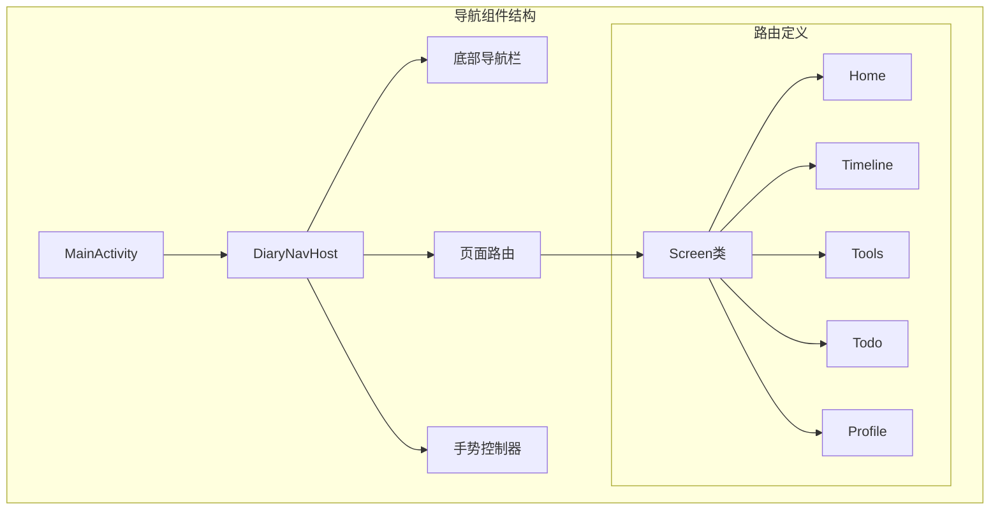
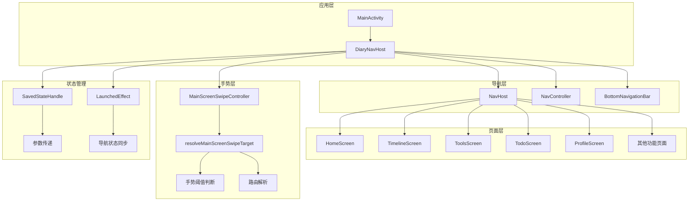
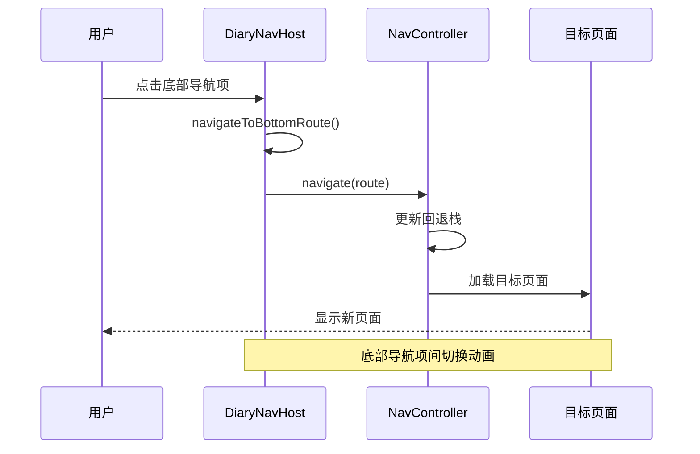
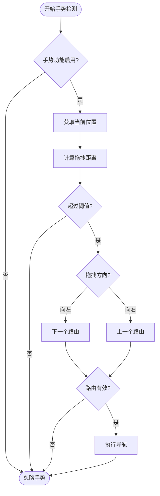
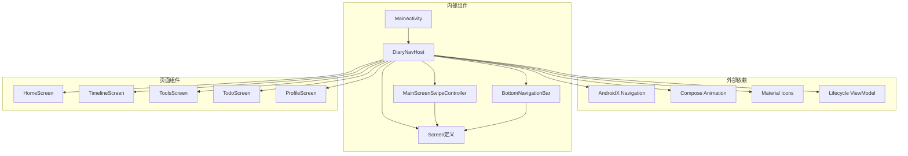

# 导航组件

<cite>
**本文档引用的文件**
- [DiaryNavHost.kt](file://app/src/main/java/com/diary/app/ui/navigation/DiaryNavHost.kt)
- [MainScreenSwipeController.kt](file://app/src/main/java/com/diary/app/ui/navigation/MainScreenSwipeController.kt)
- [MainActivity.kt](file://app/src/main/java/com/diary/app/MainActivity.kt)
- [MainScreenSwipeControllerTest.kt](file://app/src/test/java/com/diary/app/ui/navigation/MainScreenSwipeControllerTest.kt)
- [HomeScreen.kt](file://app/src/main/java/com/diary/app/ui/home/HomeScreen.kt)
</cite>

## 目录
1. [简介](#简介)
2. [项目结构](#项目结构)
3. [核心组件](#核心组件)
4. [架构概览](#架构概览)
5. [详细组件分析](#详细组件分析)
6. [依赖关系分析](#依赖关系分析)
7. [性能考虑](#性能考虑)
8. [故障排除指南](#故障排除指南)
9. [结论](#结论)

## 简介

DiaryApp的导航组件是应用的核心基础设施，负责管理用户在各个功能模块之间的导航体验。该系统采用现代Android Jetpack Compose导航架构，实现了类型安全的导航、流畅的动画过渡和灵活的手势控制功能。

本导航系统主要包含两个关键组件：
- **DiaryNavHost**: 主导航宿主，负责管理底部导航栏和页面路由
- **MainScreenSwipeController**: 手势控制器，实现滑动切换屏幕的功能

系统支持多种导航模式，包括传统的底部导航、深度链接、返回操作和实验性手势导航功能。

## 项目结构

导航组件位于应用的UI层中，采用清晰的模块化组织：



**图表来源**
- [DiaryNavHost.kt:135-183](file://app/src/main/java/com/diary/app/ui/navigation/DiaryNavHost.kt#L135-L183)
- [MainActivity.kt:402-405](file://app/src/main/java/com/diary/app/MainActivity.kt#L402-L405)

**章节来源**
- [DiaryNavHost.kt:1-100](file://app/src/main/java/com/diary/app/ui/navigation/DiaryNavHost.kt#L1-100)
- [MainActivity.kt:1-50](file://app/src/main/java/com/diary/app/MainActivity.kt#L1-L50)

## 核心组件

### 类型安全的导航系统

DiaryNavHost实现了完整的类型安全导航系统，通过密封类定义所有可用的路由：

```mermaid
classDiagram
class Screen {
<<sealed>>
+String route
+String title
+ImageVector icon
}
class Home {
+String route = "home"
+String title = "首页"
+ImageVector icon = Icons.Default.Home
}
class Timeline {
+String route = "timeline"
+String title = "时间轴"
+ImageVector icon = Icons.Default.CalendarMonth
}
class Editor {
+String route = "editor?diaryId={diaryId}&draftId={draftId}"
+String title = "编辑日记"
+ImageVector icon = Icons.Default.Edit
+createRoute(diaryId, draftId) String
}
class Detail {
+String route = "detail/{diaryId}"
+String title = "详情"
+ImageVector icon = Icons.Default.Article
+createRoute(diaryId) String
}
Screen <|-- Home
Screen <|-- Timeline
Screen <|-- Editor
Screen <|-- Detail
```

**图表来源**
- [DiaryNavHost.kt:135-183](file://app/src/main/java/com/diary/app/ui/navigation/DiaryNavHost.kt#L135-L183)

系统中的路由定义具有以下特点：
- **静态路由**: 如"home"、"timeline"等基础路由
- **动态路由**: 带参数的路由，如"detail/{diaryId}"和"read_capsule/{capsuleId}"
- **查询参数路由**: 支持查询字符串参数，如"editor?diaryId={diaryId}&draftId={draftId}"

**章节来源**
- [DiaryNavHost.kt:135-183](file://app/src/main/java/com/diary/app/ui/navigation/DiaryNavHost.kt#L135-L183)

### 底部导航栏实现

底部导航栏通过`DiaryBottomNavigationBar`组件实现，支持5个主要导航项：

| 导航项 | 路由 | 图标 | 功能 |
|--------|------|------|------|
| 首页 | home | Home | 日记列表和快捷入口 |
| 时间轴 | timeline | CalendarMonth | 按时间排序的日记列表 |
| 工具 | tools | Widgets | 各种实用工具集合 |
| 待办 | todo | CheckBox | 任务管理功能 |
| 我的 | profile | Person | 用户个人中心 |

每个导航项都支持徽章显示和选中状态的视觉反馈。

**章节来源**
- [DiaryNavHost.kt:191-197](file://app/src/main/java/com/diary/app/ui/navigation/DiaryNavHost.kt#L191-L197)
- [DiaryNavHost.kt:778-899](file://app/src/main/java/com/diary/app/ui/navigation/DiaryNavHost.kt#L778-L899)

## 架构概览

DiaryApp的导航架构采用分层设计，确保了良好的可维护性和扩展性：



**图表来源**
- [DiaryNavHost.kt:200-240](file://app/src/main/java/com/diary/app/ui/navigation/DiaryNavHost.kt#L200-L240)
- [MainActivity.kt:402-405](file://app/src/main/java/com/diary/app/MainActivity.kt#L402-L405)

## 详细组件分析

### DiaryNavHost 组件

DiaryNavHost是整个导航系统的核心，负责协调所有导航逻辑：

#### 主要功能特性

1. **类型安全的路由管理**
   - 使用密封类定义所有路由
   - 编译时检查路由有效性
   - 自动处理路由参数

2. **智能底部导航显示**
   - 根据当前路由自动显示或隐藏底部导航栏
   - 支持不同页面的独立导航配置

3. **自定义动画过渡**
   - 底部导航项间的水平滑动动画
   - 子页面间的垂直滑动动画
   - 进入和退出的淡入淡出效果

#### 导航状态管理



**图表来源**
- [DiaryNavHost.kt:210-217](file://app/src/main/java/com/diary/app/ui/navigation/DiaryNavHost.kt#L210-L217)
- [DiaryNavHost.kt:247-278](file://app/src/main/java/com/diary/app/ui/navigation/DiaryNavHost.kt#L247-L278)

**章节来源**
- [DiaryNavHost.kt:200-240](file://app/src/main/java/com/diary/app/ui/navigation/DiaryNavHost.kt#L200-L240)
- [DiaryNavHost.kt:247-278](file://app/src/main/java/com/diary/app/ui/navigation/DiaryNavHost.kt#L247-L278)

### MainScreenSwipeController 手势控制

MainScreenSwipeController实现了实验性的滑动导航功能，为用户提供更直观的导航方式：

#### 手势识别算法



**图表来源**
- [MainScreenSwipeController.kt:7-28](file://app/src/main/java/com/diary/app/ui/navigation/MainScreenSwipeController.kt#L7-L28)

#### 关键参数配置

| 参数 | 默认值 | 说明 |
|------|--------|------|
| MAIN_SCREEN_SWIPE_THRESHOLD | 48f | 手势触发阈值（像素） |
| mainScreenRoutes | ["home","timeline","tools","todo","profile"] | 可滑动的主路由列表 |

**章节来源**
- [MainScreenSwipeController.kt:1-29](file://app/src/main/java/com/diary/app/ui/navigation/MainScreenSwipeController.kt#L1-L29)

### 页面路由定义

系统支持多种类型的页面路由，每种都有特定的用途和参数要求：

#### 基础路由
- **Home**: 主界面，包含各种快捷入口
- **Timeline**: 按时间排序的日记列表
- **Tools**: 工具集合页面
- **Todo**: 任务管理页面
- **Profile**: 用户个人中心

#### 动态路由
- **Detail**: 日记详情页面，需要日记ID参数
- **ReadCapsule**: 时间胶囊阅读页面，需要胶囊ID参数
- **AchievementDetail**: 成就详情页面，需要成就键值

#### 查询参数路由
- **Editor**: 日记编辑器，支持日记ID和草稿ID参数
- **MonthlyReport**: 月度报告，需要年份和月份参数

**章节来源**
- [DiaryNavHost.kt:143-183](file://app/src/main/java/com/diary/app/ui/navigation/DiaryNavHost.kt#L143-L183)

## 依赖关系分析

导航组件之间的依赖关系体现了清晰的分层架构：



**图表来源**
- [DiaryNavHost.kt:1-112](file://app/src/main/java/com/diary/app/ui/navigation/DiaryNavHost.kt#L1-L112)
- [MainActivity.kt:60-61](file://app/src/main/java/com/diary/app/MainActivity.kt#L60-L61)

### 组件耦合度分析

- **低耦合**: 各页面组件与导航系统的耦合度较低，通过接口参数传递导航回调
- **高内聚**: 导航逻辑集中在DiaryNavHost中，便于维护和测试
- **可扩展性**: 新增页面只需在Screen密封类中添加新类型即可

**章节来源**
- [DiaryNavHost.kt:1-112](file://app/src/main/java/com/diary/app/ui/navigation/DiaryNavHost.kt#L1-L112)

## 性能考虑

### 导航性能优化

1. **内存管理**
   - 使用`restoreState`和`saveState`机制保存页面状态
   - 避免不必要的重组和重新创建

2. **动画性能**
   - 使用硬件加速的Compose动画
   - 合理设置动画时长和缓动函数

3. **手势响应**
   - 手势阈值经过性能优化，平衡响应速度和准确性
   - 异步处理手势事件，避免阻塞主线程

### 最佳实践建议

- **路由复用**: 对于频繁访问的页面，利用`launchSingleTop`避免重复创建
- **状态持久化**: 使用`SavedStateHandle`在页面间传递临时数据
- **懒加载**: 对于大型页面，实现懒加载以减少初始启动时间

## 故障排除指南

### 常见问题及解决方案

#### 导航异常
**问题**: 页面无法正确导航到目标路由
**解决方案**:
1. 检查路由名称是否与Screen定义一致
2. 验证参数传递是否正确
3. 确认目标页面是否已正确定义

#### 手势不响应
**问题**: 滑动手势无法触发页面切换
**解决方案**:
1. 确认实验功能开关已启用
2. 检查手势阈值设置是否合理
3. 验证当前路由是否在可滑动列表中

#### 动画卡顿
**问题**: 导航动画出现卡顿现象
**解决方案**:
1. 减少页面复杂度和重绘次数
2. 优化图片资源和布局层次
3. 调整动画时长和缓动参数

**章节来源**
- [MainScreenSwipeControllerTest.kt:1-51](file://app/src/test/java/com/diary/app/ui/navigation/MainScreenSwipeControllerTest.kt#L1-L51)

## 结论

DiaryApp的导航组件展现了现代Android应用导航系统的设计理念，通过类型安全的路由定义、流畅的动画过渡和灵活的手势控制，为用户提供了优秀的导航体验。

### 主要优势

1. **类型安全**: 密封类路由定义确保编译时错误检查
2. **用户体验**: 流畅的动画和直观的手势操作
3. **可维护性**: 清晰的分层架构和模块化设计
4. **扩展性**: 易于添加新页面和功能模块

### 技术亮点

- 完整的MVVM架构集成
- 实验性功能的渐进式引入
- 全面的单元测试覆盖
- 优雅的错误处理机制

该导航系统为DiaryApp提供了坚实的技术基础，支持应用的持续发展和功能扩展。