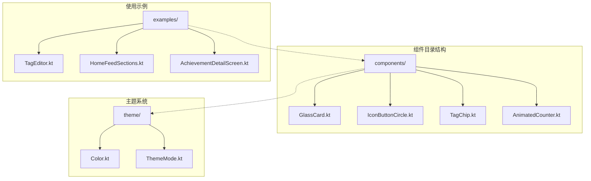
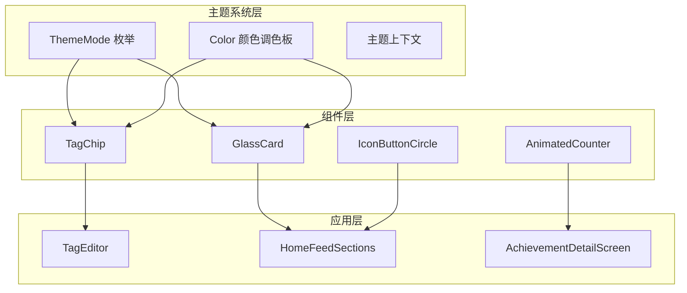
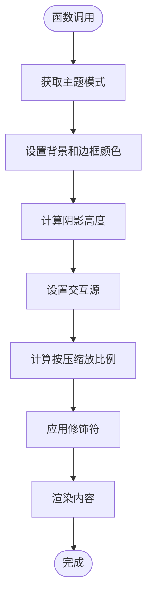
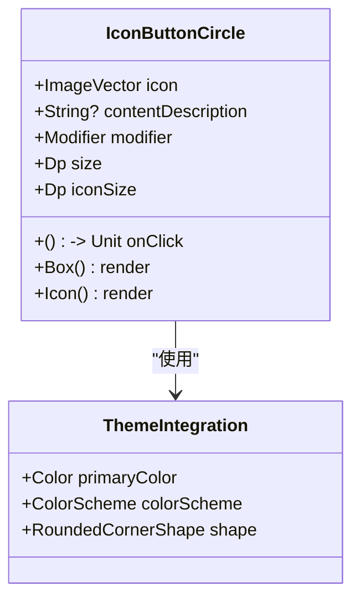
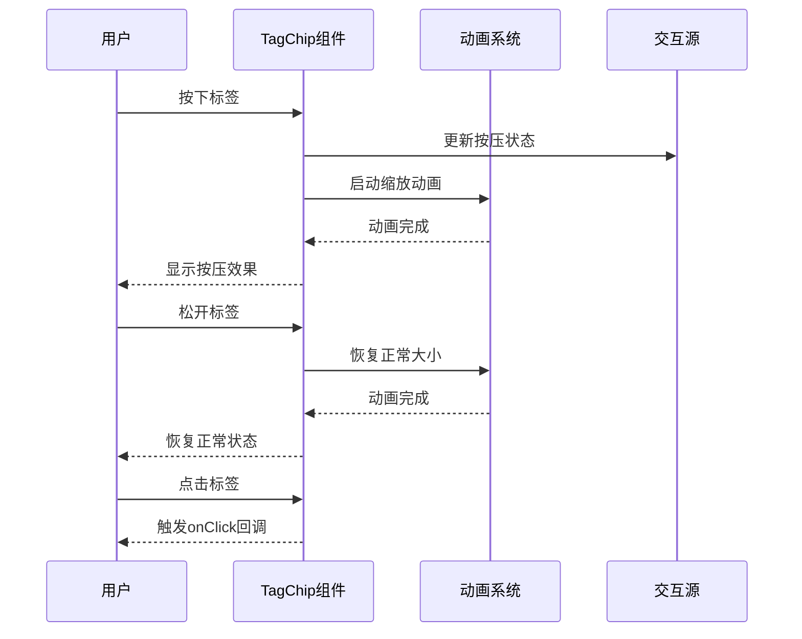
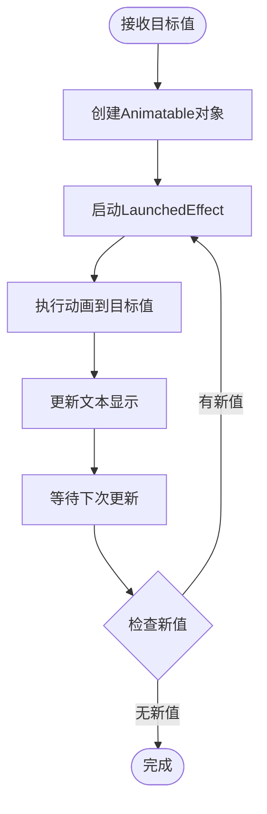
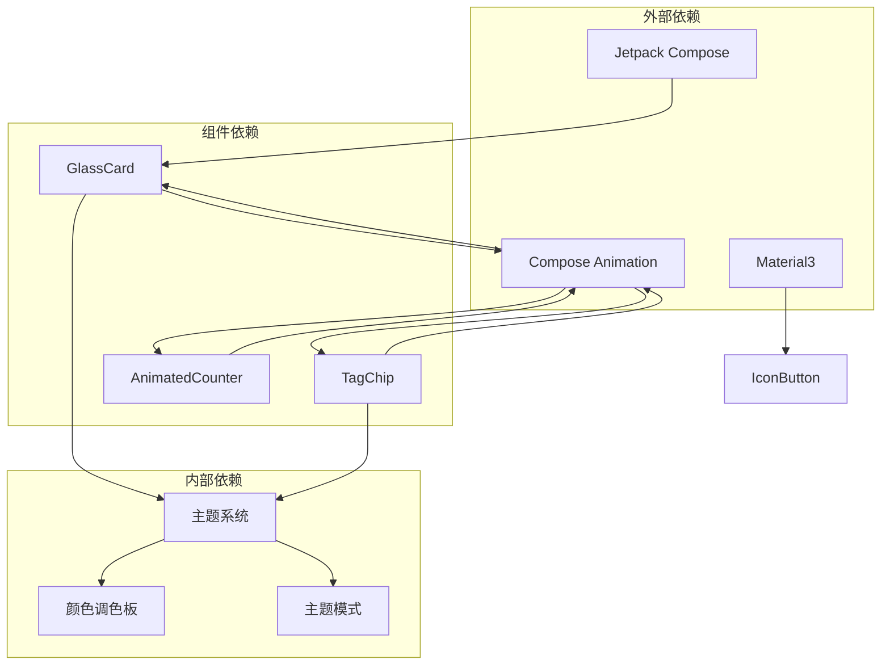

# 自定义UI组件

<cite>
**本文档引用的文件**
- [GlassCard.kt](file://app/src/main/java/com/diary/app/ui/components/GlassCard.kt)
- [IconButtonCircle.kt](file://app/src/main/java/com/diary/app/ui/components/IconButtonCircle.kt)
- [TagChip.kt](file://app/src/main/java/com/diary/app/ui/components/TagChip.kt)
- [AnimatedCounter.kt](file://app/src/main/java/com/diary/app/ui/components/AnimatedCounter.kt)
- [Color.kt](file://app/src/main/java/com/diary/app/ui/theme/Color.kt)
- [ThemeMode.kt](file://app/src/main/java/com/diary/app/ui/theme/ThemeMode.kt)
- [TagEditor.kt](file://app/src/main/java/com/diary/app/ui/editor/TagEditor.kt)
- [HomeFeedSections.kt](file://app/src/main/java/com/diary/app/ui/home/HomeFeedSections.kt)
- [AchievementDetailScreen.kt](file://app/src/main/java/com/diary/app/ui/achievement/AchievementDetailScreen.kt)
</cite>

## 目录
1. [简介](#简介)
2. [项目结构](#项目结构)
3. [核心组件](#核心组件)
4. [架构概览](#架构概览)
5. [详细组件分析](#详细组件分析)
6. [依赖分析](#依赖分析)
7. [性能考虑](#性能考虑)
8. [故障排除指南](#故障排除指南)
9. [结论](#结论)

## 简介

DiaryApp 的自定义UI组件系统为应用程序提供了丰富的视觉体验和交互功能。本文档深入介绍了四个核心自定义组件：GlassCard（毛玻璃卡片）、IconButtonCircle（圆形按钮）、TagChip（标签芯片）和AnimatedCounter（动画计数器）。这些组件不仅实现了美观的视觉效果，还提供了流畅的用户交互体验。

每个组件都经过精心设计，支持多种主题模式、响应式交互和可定制的样式选项。通过组合使用这些组件，开发者可以构建出既美观又实用的用户界面。

## 项目结构

自定义UI组件主要位于 `app/src/main/java/com/diary/app/ui/components/` 目录下，与主题系统紧密集成：

**图表来源**
- [GlassCard.kt:1-137](file://app/src/main/java/com/diary/app/ui/components/GlassCard.kt#L1-L137)
- [Color.kt:1-394](file://app/src/main/java/com/diary/app/ui/theme/Color.kt#L1-L394)
- [ThemeMode.kt:1-99](file://app/src/main/java/com/diary/app/ui/theme/ThemeMode.kt#L1-L99)

**章节来源**
- [GlassCard.kt:1-137](file://app/src/main/java/com/diary/app/ui/components/GlassCard.kt#L1-L137)
- [Color.kt:1-394](file://app/src/main/java/com/diary/app/ui/theme/Color.kt#L1-L394)
- [ThemeMode.kt:1-99](file://app/src/main/java/com/diary/app/ui/theme/ThemeMode.kt#L1-L99)

## 核心组件

DiaryApp的自定义UI组件系统包含以下四个核心组件：

### GlassCard（毛玻璃卡片）
- **设计理念**：模拟真实世界中的毛玻璃效果，提供半透明的视觉体验
- **核心特性**：多主题支持、阴影效果、点击反馈、渐变背景
- **适用场景**：信息展示卡片、设置面板、对话框容器

### IconButtonCircle（圆形按钮）
- **设计理念**：简洁优雅的圆形图标按钮，强调视觉层次
- **核心特性**：圆角矩形裁剪、半透明背景、点击区域优化
- **适用场景**：工具栏按钮、导航按钮、功能快捷入口

### TagChip（标签芯片）
- **设计理念**：轻量级标签显示组件，支持颜色标识和交互反馈
- **核心特性**：颜色点标记、可选删除按钮、按压缩放动画
- **适用场景**：标签管理、筛选条件、状态标识

### AnimatedCounter（动画计数器）
- **设计理念**：平滑的数值变化动画，提升用户体验
- **核心特性**：可配置动画时长、前后缀支持、字体样式定制
- **适用场景**：统计数字显示、倒计时、动态计数

**章节来源**
- [GlassCard.kt:56-137](file://app/src/main/java/com/diary/app/ui/components/GlassCard.kt#L56-L137)
- [IconButtonCircle.kt:18-43](file://app/src/main/java/com/diary/app/ui/components/IconButtonCircle.kt#L18-L43)
- [TagChip.kt:35-103](file://app/src/main/java/com/diary/app/ui/components/TagChip.kt#L35-L103)
- [AnimatedCounter.kt:17-50](file://app/src/main/java/com/diary/app/ui/components/AnimatedCounter.kt#L17-L50)

## 架构概览

自定义组件系统采用模块化设计，与主题系统深度集成：

**图表来源**
- [ThemeMode.kt:16-37](file://app/src/main/java/com/diary/app/ui/theme/ThemeMode.kt#L16-L37)
- [Color.kt:274-394](file://app/src/main/java/com/diary/app/ui/theme/Color.kt#L274-L394)
- [GlassCard.kt:66-84](file://app/src/main/java/com/diary/app/ui/components/GlassCard.kt#L66-L84)
- [TagChip.kt:38-42](file://app/src/main/java/com/diary/app/ui/components/TagChip.kt#L38-L42)

## 详细组件分析

### GlassCard 组件分析

GlassCard 是一个高度可定制的卡片组件，实现了毛玻璃效果和多主题支持。

#### 设计理念
- **毛玻璃效果**：通过半透明背景和边框实现
- **主题适配**：支持12种不同的主题模式
- **交互反馈**：提供按压缩放动画
- **阴影系统**：根据明暗模式调整阴影强度

#### 核心属性配置

| 属性名 | 类型 | 默认值 | 描述 |
|--------|------|--------|------|
| modifier | Modifier | Modifier | 组件修饰符 |
| cornerRadius | Dp | 16.dp | 圆角半径 |
| enableShadow | Boolean | false | 是否启用阴影 |
| gradientColors | List<Color>? | null | 渐变颜色列表 |
| innerPadding | Dp | 16.dp | 内边距 |
| onClick | (() -> Unit)? | null | 点击回调 |

#### 实现细节

**图表来源**
- [GlassCard.kt:66-135](file://app/src/main/java/com/diary/app/ui/components/GlassCard.kt#L66-L135)

#### 使用场景和最佳实践

- **信息展示**：在详情页面中展示重要信息
- **设置面板**：作为设置项的容器
- **对话框**：作为模态对话框的基础组件
- **卡片布局**：在网格布局中作为子项

**章节来源**
- [GlassCard.kt:56-137](file://app/src/main/java/com/diary/app/ui/components/GlassCard.kt#L56-L137)
- [AchievementDetailScreen.kt:206-283](file://app/src/main/java/com/diary/app/ui/achievement/AchievementDetailScreen.kt#L206-L283)
- [HomeFeedSections.kt:693-744](file://app/src/main/java/com/diary/app/ui/home/HomeFeedSections.kt#L693-L744)

### IconButtonCircle 组件分析

IconButtonCircle 提供了简洁优雅的圆形图标按钮设计。

#### 设计理念
- **圆形美学**：完全圆润的视觉设计
- **半透明背景**：提供微妙的视觉层次
- **点击区域优化**：确保良好的触摸体验
- **Material Design 集成**：使用 Material 主题色彩

#### 核心属性配置

| 属性名 | 类型 | 默认值 | 描述 |
|--------|------|--------|------|
| icon | ImageVector | 必需 | 图标矢量 |
| contentDescription | String? | null | 无障碍描述 |
| onClick | () -> Unit | 必需 | 点击回调 |
| modifier | Modifier | Modifier | 组件修饰符 |
| size | Dp | 40.dp | 按钮尺寸 |
| iconSize | Dp | 22.dp | 图标尺寸 |

#### 实现细节

**图表来源**
- [IconButtonCircle.kt:18-42](file://app/src/main/java/com/diary/app/ui/components/IconButtonCircle.kt#L18-L42)

#### 使用场景和最佳实践

- **工具栏操作**：编辑器工具栏的功能按钮
- **导航入口**：快速跳转到特定功能
- **辅助操作**：复制、分享、删除等常用操作
- **状态切换**：开关类功能的可视化表示

**章节来源**
- [IconButtonCircle.kt:18-43](file://app/src/main/java/com/diary/app/ui/components/IconButtonCircle.kt#L18-L43)

### TagChip 组件分析

TagChip 是一个功能丰富的标签显示组件，支持颜色标识和交互反馈。

#### 设计理念
- **颜色编码**：通过颜色直观表示标签含义
- **交互反馈**：按压缩放提供触觉反馈
- **可选删除**：支持标签的增删管理
- **紧凑布局**：节省空间的同时保持可读性

#### 核心属性配置

| 属性名 | 类型 | 默认值 | 描述 |
|--------|------|--------|------|
| name | String | 必需 | 标签名称 |
| color | Color | 必需 | 标签颜色 |
| modifier | Modifier | Modifier | 组件修饰符 |
| showRemove | Boolean | false | 是否显示删除按钮 |
| onRemove | () -> Unit | {} | 删除回调 |
| onClick | () -> Unit | {} | 点击回调 |

#### 实现细节

**图表来源**
- [TagChip.kt:44-51](file://app/src/main/java/com/diary/app/ui/components/TagChip.kt#L44-L51)

#### 使用场景和最佳实践

- **标签选择**：文章标签的多选和单选
- **筛选条件**：按标签过滤内容
- **状态标识**：显示项目的重要程度或状态
- **颜色分类**：通过颜色区分不同类型的标签

**章节来源**
- [TagChip.kt:35-103](file://app/src/main/java/com/diary/app/ui/components/TagChip.kt#L35-L103)
- [TagEditor.kt:74-85](file://app/src/main/java/com/diary/app/ui/editor/TagEditor.kt#L74-L85)

### AnimatedCounter 组件分析

AnimatedCounter 提供了平滑的数值变化动画效果。

#### 设计理念
- **流畅过渡**：数值变化时的自然动画
- **可配置性**：支持多种动画参数定制
- **文本格式化**：前后缀和字体样式的灵活配置
- **性能优化**：高效的动画渲染机制

#### 核心属性配置

| 属性名 | 类型 | 默认值 | 描述 |
|--------|------|--------|------|
| targetValue | Int | 必需 | 目标数值 |
| modifier | Modifier | Modifier | 组件修饰符 |
| prefix | String | "" | 前缀文本 |
| suffix | String | "" | 后缀文本 |
| duration | Int | 1000 | 动画持续时间(ms) |
| fontSize | TextUnit | 24.sp | 字体大小 |
| fontWeight | FontWeight | FontWeight.Bold | 字体粗细 |
| color | Color | Color.Unspecified | 文本颜色 |
| style | TextStyle | TextStyle.Default | 文本样式 |

#### 实现细节

**图表来源**
- [AnimatedCounter.kt:29-48](file://app/src/main/java/com/diary/app/ui/components/AnimatedCounter.kt#L29-L48)

#### 使用场景和最佳实践

- **统计数字**：文章阅读量、点赞数等动态显示
- **倒计时功能**：活动开始倒计时、任务截止提醒
- **动态计数**：购物车数量、消息未读数
- **进度指示**：百分比显示、完成度更新

**章节来源**
- [AnimatedCounter.kt:17-50](file://app/src/main/java/com/diary/app/ui/components/AnimatedCounter.kt#L17-L50)

## 依赖分析

自定义组件系统具有清晰的依赖关系和模块化设计：

**图表来源**
- [GlassCard.kt:3-27](file://app/src/main/java/com/diary/app/ui/components/GlassCard.kt#L3-L27)
- [TagChip.kt:3-33](file://app/src/main/java/com/diary/app/ui/components/TagChip.kt#L3-L33)
- [AnimatedCounter.kt:3-15](file://app/src/main/java/com/diary/app/ui/components/AnimatedCounter.kt#L3-L15)

### 组件间协作关系

组件之间通过主题系统和通用接口进行协作：

- **主题一致性**：所有组件共享相同的主题系统
- **样式统一**：通过 Material Design 规范保持视觉一致性
- **交互协调**：组件间的交互效果相互配合
- **性能优化**：避免重复的主题计算和样式应用

**章节来源**
- [ThemeMode.kt:39-42](file://app/src/main/java/com/diary/app/ui/theme/ThemeMode.kt#L39-L42)
- [Color.kt:274-394](file://app/src/main/java/com/diary/app/ui/theme/Color.kt#L274-L394)

## 性能考虑

### 动画性能优化

1. **动画时长控制**：合理设置动画持续时间，避免过长影响用户体验
2. **内存管理**：使用 `remember` 缓存昂贵的对象，减少重复创建
3. **状态更新**：通过 `LaunchedEffect` 控制动画触发时机
4. **绘制优化**：避免不必要的重组和重绘

### 主题切换优化

1. **主题缓存**：使用 `staticCompositionLocalOf` 缓存主题状态
2. **条件渲染**：仅在主题变化时重新计算样式
3. **渐进式更新**：支持主题切换时的平滑过渡效果

### 最佳实践建议

- **避免过度动画**：在移动设备上谨慎使用复杂的动画效果
- **性能监控**：定期检查组件的重组频率和渲染性能
- **内存泄漏防护**：正确管理生命周期和资源释放
- **可访问性支持**：确保组件符合无障碍设计标准

## 故障排除指南

### 常见问题及解决方案

#### GlassCard 边框显示异常
**问题描述**：卡片边框在某些主题下不显示或显示异常
**解决方案**：
1. 检查主题模式是否正确传递
2. 验证颜色值的有效性
3. 确认 `isDark()` 方法的返回值

#### TagChip 点击无响应
**问题描述**：标签芯片无法响应点击事件
**解决方案**：
1. 检查 `onClick` 回调是否正确设置
2. 验证 `interactionSource` 的配置
3. 确认 `indication` 参数设置为 `null`

#### AnimatedCounter 动画不触发
**问题描述**：数值变化时没有动画效果
**解决方案**：
1. 检查 `targetValue` 参数的变化检测
2. 验证 `LaunchedEffect` 的依赖数组配置
3. 确认 `Animatable` 对象的初始化

#### IconButtonCircle 样式不生效
**问题描述**：圆形按钮的颜色或尺寸不符合预期
**解决方案**：
1. 检查 `MaterialTheme.colorScheme` 的使用
2. 验证 `size` 和 `iconSize` 参数的设置
3. 确认 `RoundedCornerShape` 的圆角值

**章节来源**
- [GlassCard.kt:95-102](file://app/src/main/java/com/diary/app/ui/components/GlassCard.kt#L95-L102)
- [TagChip.kt:60-64](file://app/src/main/java/com/diary/app/ui/components/TagChip.kt#L60-L64)
- [AnimatedCounter.kt:31-39](file://app/src/main/java/com/diary/app/ui/components/AnimatedCounter.kt#L31-L39)

## 结论

DiaryApp 的自定义UI组件系统展现了现代Android应用开发的最佳实践。通过精心设计的组件架构、完善的主题系统集成和优化的性能考虑，这些组件为用户提供了丰富而流畅的交互体验。

### 主要优势

1. **设计理念先进**：每个组件都体现了现代UI设计的核心原则
2. **主题系统完善**：支持多种主题模式，适应不同用户偏好
3. **交互体验优秀**：流畅的动画效果和响应式设计
4. **代码质量高**：清晰的架构设计和良好的可维护性

### 应用前景

这些自定义组件不仅满足了当前的应用需求，还为未来的功能扩展奠定了坚实基础。通过模块化的组件设计，开发者可以轻松地创建新的UI组件，同时保持整体设计的一致性和用户体验的连贯性。

建议在后续开发中继续遵循现有的设计模式和最佳实践，确保组件系统的持续演进和优化。