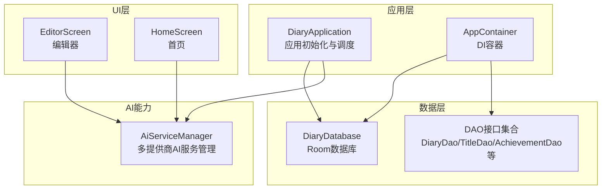
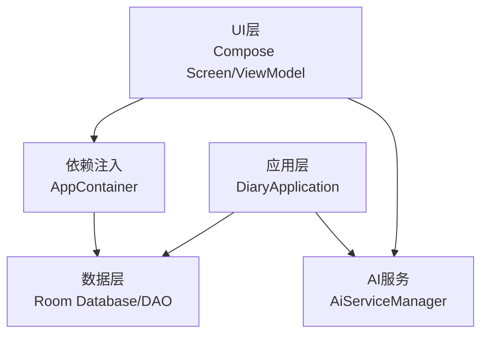
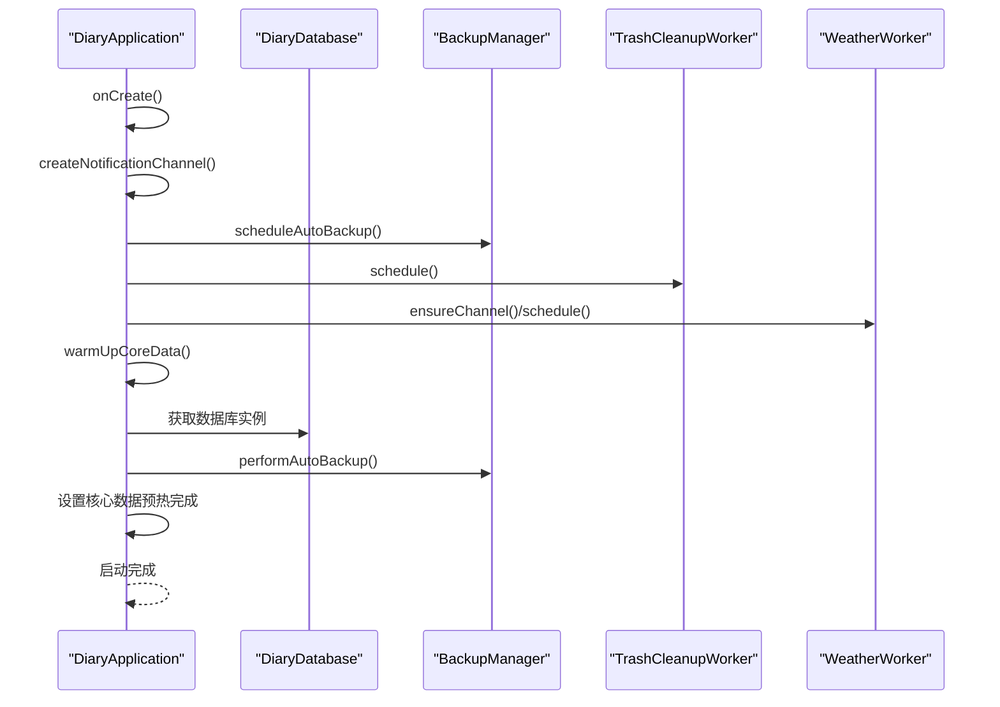
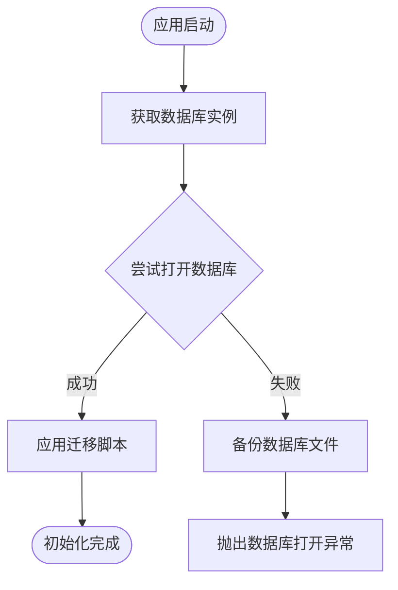
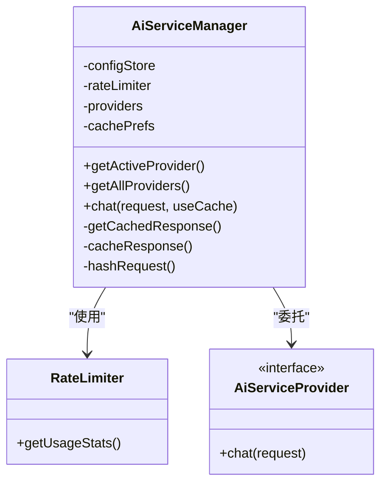
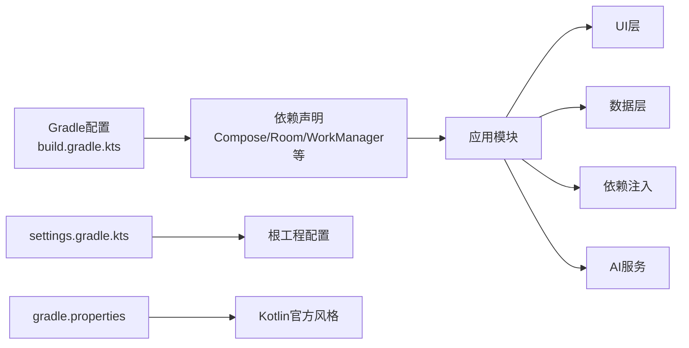

# 开发指南

<cite>
**本文档引用的文件**
- [DiaryApplication.kt](file://app/src/main/java/com/diary/app/DiaryApplication.kt)
- [AiServiceManager.kt](file://app/src/main/java/com/diary/app/ai/AiServiceManager.kt)
- [DiaryDatabase.kt](file://app/src/main/java/com/diary/app/data/DiaryDatabase.kt)
- [AppContainer.kt](file://app/src/main/java/com/diary/app/di/AppContainer.kt)
- [EditorScreen.kt](file://app/src/main/java/com/diary/app/ui/editor/EditorScreen.kt)
- [HomeScreen.kt](file://app/src/main/java/com/diary/app/ui/home/HomeScreen.kt)
- [build.gradle.kts](file://app/build.gradle.kts)
- [settings.gradle.kts](file://settings.gradle.kts)
- [gradle.properties](file://gradle.properties)
- [AI-Integration-Plan.md](file://docs/AI-Integration-Plan.md)
- [build-notes.md](file://docs/build-notes.md)
- [content-rendering-research.md](file://docs/research/content-rendering-research.md)
- [timeline-review-redesign.md](file://docs/research/timeline-review-redesign.md)
- [InsightGeneratorTest.kt](file://app/src/test/java/com/diary/app/ai/InsightGeneratorTest.kt)
- [HomeScreenLogicTest.kt](file://app/src/test/java/com/diary/app/ui/home/HomeScreenLogicTest.kt)
</cite>

## 目录
1. [简介](#简介)
2. [项目结构](#项目结构)
3. [核心组件](#核心组件)
4. [架构总览](#架构总览)
5. [详细组件分析](#详细组件分析)
6. [依赖关系分析](#依赖关系分析)
7. [性能考量](#性能考量)
8. [故障排查指南](#故障排查指南)
9. [结论](#结论)
10. [附录](#附录)

## 简介
本开发指南面向DiaryApp的开发者，目标是帮助团队统一代码规范与最佳实践，沉淀研究文档与设计决策，规范功能开发流程与贡献评审标准，并提供开发工具配置与调试技巧。内容涵盖Kotlin编码标准、命名约定、注释规范、模块架构、数据流与处理逻辑、依赖关系、性能优化与常见问题排查。

## 项目结构
DiaryApp采用模块化与分层架构：
- 应用入口与全局初始化：DiaryApplication负责数据库、通知通道、实验特性、天气与备份调度等。
- 数据层：Room数据库与DAO，包含日记、标签、成就、时间胶囊、通知、聊天记录等实体及迁移脚本。
- 依赖注入：AppContainer集中提供数据库与DAO实例。
- UI层：Jetpack Compose实现，EditorScreen与HomeScreen等核心界面。
- AI能力：AiServiceManager抽象多提供商AI服务，封装速率限制、缓存与用量统计。
- 构建与配置：Gradle多Flavor（stable/experimental），Compose与Room等依赖声明。

图表来源
- [DiaryApplication.kt:30-105](file://app/src/main/java/com/diary/app/DiaryApplication.kt#L30-L105)
- [AppContainer.kt:11-14](file://app/src/main/java/com/diary/app/di/AppContainer.kt#L11-L14)
- [DiaryDatabase.kt:10-20](file://app/src/main/java/com/diary/app/data/DiaryDatabase.kt#L10-L20)
- [AiServiceManager.kt:10-41](file://app/src/main/java/com/diary/app/ai/AiServiceManager.kt#L10-L41)
- [EditorScreen.kt:122-163](file://app/src/main/java/com/diary/app/ui/editor/EditorScreen.kt#L122-L163)
- [HomeScreen.kt:161-200](file://app/src/main/java/com/diary/app/ui/home/HomeScreen.kt#L161-L200)

章节来源
- [DiaryApplication.kt:30-105](file://app/src/main/java/com/diary/app/DiaryApplication.kt#L30-L105)
- [AppContainer.kt:11-14](file://app/src/main/java/com/diary/app/di/AppContainer.kt#L11-L14)
- [DiaryDatabase.kt:10-20](file://app/src/main/java/com/diary/app/data/DiaryDatabase.kt#L10-L20)
- [AiServiceManager.kt:10-41](file://app/src/main/java/com/diary/app/ai/AiServiceManager.kt#L10-L41)
- [EditorScreen.kt:122-163](file://app/src/main/java/com/diary/app/ui/editor/EditorScreen.kt#L122-L163)
- [HomeScreen.kt:161-200](file://app/src/main/java/com/diary/app/ui/home/HomeScreen.kt#L161-L200)

## 核心组件
- 应用初始化与全局状态
  - DiaryApplication负责主题模式、实验特性开关、通知通道、天气与备份调度、核心数据预热与错误上报。
- 数据层与迁移
  - DiaryDatabase集中声明实体与版本，提供大量迁移脚本，确保Schema演进与数据安全。
- 依赖注入
  - AppContainer提供数据库与DAO实例，便于在各层解耦使用。
- AI服务管理
  - AiServiceManager统一管理多个AI提供商、速率限制、缓存与用量统计，提供聊天请求与缓存命中逻辑。
- UI层
  - EditorScreen与HomeScreen分别承载编辑与首页功能，均采用Compose声明式UI与ViewModel协作。

章节来源
- [DiaryApplication.kt:30-105](file://app/src/main/java/com/diary/app/DiaryApplication.kt#L30-L105)
- [DiaryDatabase.kt:10-20](file://app/src/main/java/com/diary/app/data/DiaryDatabase.kt#L10-L20)
- [AppContainer.kt:11-14](file://app/src/main/java/com/diary/app/di/AppContainer.kt#L11-L14)
- [AiServiceManager.kt:10-61](file://app/src/main/java/com/diary/app/ai/AiServiceManager.kt#L10-L61)
- [EditorScreen.kt:122-163](file://app/src/main/java/com/diary/app/ui/editor/EditorScreen.kt#L122-L163)
- [HomeScreen.kt:161-200](file://app/src/main/java/com/diary/app/ui/home/HomeScreen.kt#L161-L200)

## 架构总览
DiaryApp采用“应用层-数据层-依赖注入-UI层”的分层架构，结合Room进行本地持久化，Compose进行UI构建，AI能力通过AiServiceManager抽象对外提供服务。整体强调：
- 单一职责：应用初始化、数据访问、UI渲染、AI服务相互隔离。
- 可测试性：ViewModel与数据层解耦，便于单元测试。
- 可扩展性：Room迁移与AI提供商扩展点清晰。

图表来源
- [EditorScreen.kt:141-142](file://app/src/main/java/com/diary/app/ui/editor/EditorScreen.kt#L141-L142)
- [HomeScreen.kt:182-183](file://app/src/main/java/com/diary/app/ui/home/HomeScreen.kt#L182-L183)
- [AppContainer.kt:11-14](file://app/src/main/java/com/diary/app/di/AppContainer.kt#L11-L14)
- [DiaryApplication.kt:30-105](file://app/src/main/java/com/diary/app/DiaryApplication.kt#L30-L105)
- [AiServiceManager.kt:10-41](file://app/src/main/java/com/diary/app/ai/AiServiceManager.kt#L10-L41)

## 详细组件分析

### 应用初始化与全局状态（DiaryApplication）
- 职责
  - 初始化主题模式与实验特性偏好。
  - 创建通知通道与定时任务（备份、垃圾清理、天气刷新）。
  - 核心数据预热与异常捕获，保障启动稳定性。
- 关键点
  - 使用协程作用域进行后台初始化，失败时设置启动错误状态。
  - 通过状态流暴露主题与实验特性，供UI订阅。

图表来源
- [DiaryApplication.kt:46-105](file://app/src/main/java/com/diary/app/DiaryApplication.kt#L46-L105)

章节来源
- [DiaryApplication.kt:30-105](file://app/src/main/java/com/diary/app/DiaryApplication.kt#L30-L105)

### 数据层与迁移（DiaryDatabase）
- 职责
  - 声明实体与版本，提供DAO接口。
  - 提供大量迁移脚本，覆盖索引、新增表、字段变更、种子数据等。
- 关键点
  - 迁移链完整，包含跨版本升级与回滚保护。
  - 数据库打开失败时自动备份文件并抛出异常，避免数据损坏。

图表来源
- [DiaryDatabase.kt:712-771](file://app/src/main/java/com/diary/app/data/DiaryDatabase.kt#L712-L771)

章节来源
- [DiaryDatabase.kt:10-20](file://app/src/main/java/com/diary/app/data/DiaryDatabase.kt#L10-L20)
- [DiaryDatabase.kt:712-771](file://app/src/main/java/com/diary/app/data/DiaryDatabase.kt#L712-L771)

### 依赖注入（AppContainer）
- 职责
  - 提供数据库与DAO实例，简化UI与业务层对依赖的获取。
- 关键点
  - 与DiaryApplication配合，保证单例与生命周期可控。

章节来源
- [AppContainer.kt:11-14](file://app/src/main/java/com/diary/app/di/AppContainer.kt#L11-L14)

### AI服务管理（AiServiceManager）
- 职责
  - 管理多个AI提供商，封装速率限制、缓存与用量统计。
  - 提供聊天请求与缓存命中逻辑，支持禁用与配置检查。
- 关键点
  - 使用SharedPreferences缓存响应，SHA-256哈希请求键，TTL 24小时。
  - 记录Token用量并统计今日用量。

图表来源
- [AiServiceManager.kt:10-61](file://app/src/main/java/com/diary/app/ai/AiServiceManager.kt#L10-L61)

章节来源
- [AiServiceManager.kt:10-61](file://app/src/main/java/com/diary/app/ai/AiServiceManager.kt#L10-L61)

### 编辑器（EditorScreen）
- 职责
  - 承载日记编辑功能，集成AI助理面板、标签、天气、位置、模板等。
- 关键点
  - 通过ViewModel与状态流驱动UI，支持实验特性开关。
  - 与WebView桥接实现富文本编辑与渲染。

章节来源
- [EditorScreen.kt:122-163](file://app/src/main/java/com/diary/app/ui/editor/EditorScreen.kt#L122-L163)

### 首页（HomeScreen）
- 职责
  - 展示日记列表、快捷入口、搜索、通知与AI洞察等。
- 关键点
  - 通过ViewModel与状态流管理数据与交互，支持快捷导航与高亮展示。

章节来源
- [HomeScreen.kt:161-200](file://app/src/main/java/com/diary/app/ui/home/HomeScreen.kt#L161-L200)

## 依赖关系分析
- 构建与运行环境
  - Gradle多Flavor（stable/experimental），Compose与Room等依赖声明明确。
  - Kotlin官方代码风格启用，AndroidX与打包配置合理。
- 依赖注入与模块划分
  - AppContainer集中提供数据库与DAO，减少跨层耦合。
- 测试策略
  - 单元测试覆盖AI洞察生成与首页逻辑，验证行为与边界条件。

图表来源
- [build.gradle.kts:14-87](file://app/build.gradle.kts#L14-L87)
- [settings.gradle.kts:1-18](file://settings.gradle.kts#L1-L18)
- [gradle.properties:1-6](file://gradle.properties#L1-L6)

章节来源
- [build.gradle.kts:14-87](file://app/build.gradle.kts#L14-L87)
- [settings.gradle.kts:1-18](file://settings.gradle.kts#L1-L18)
- [gradle.properties:1-6](file://gradle.properties#L1-L6)

## 性能考量
- 渲染引擎与内存占用
  - 当前查看器采用WebView渲染Quill Delta，内存占用较高；建议引入Room缓存HTML列，避免重复解析Delta。
- 分页与滚动
  - 时间线建议采用PagingSource分页加载，减少一次性加载带来的卡顿与内存压力。
- 图像处理
  - 建议在插入时压缩图片、生成缩略图，减少存储与传输开销。

章节来源
- [content-rendering-research.md:307-407](file://docs/research/content-rendering-research.md#L307-L407)
- [timeline-review-redesign.md:19-34](file://docs/research/timeline-review-redesign.md#L19-L34)

## 故障排查指南
- 构建与测试
  - 建议使用JDK 17运行Gradle，避免测试Worker不稳定导致的失败。
  - 更新检测需依赖GitHub Release与分支/标签匹配，发布流程需严格遵循。
- 数据库
  - 数据库打开失败会自动备份并抛出异常，检查备份目录与日志定位问题。
- AI服务
  - 检查AI提供商配置、速率限制与缓存命中情况，必要时清空缓存或调整TTL。

章节来源
- [build-notes.md:3-27](file://docs/build-notes.md#L3-L27)
- [DiaryDatabase.kt:744-767](file://app/src/main/java/com/diary/app/data/DiaryDatabase.kt#L744-L767)
- [AiServiceManager.kt:43-61](file://app/src/main/java/com/diary/app/ai/AiServiceManager.kt#L43-L61)

## 结论
DiaryApp在架构上具备良好的分层与模块化特征，数据层通过Room与完备的迁移脚本保障稳定演进，UI层采用Compose实现现代化交互，AI能力通过统一管理器抽象提供可扩展的服务。建议在现有基础上进一步完善测试覆盖、渲染性能与图像处理策略，并持续沉淀研究文档与设计决策，以支撑长期演进。

## 附录

### 代码规范与最佳实践
- Kotlin编码标准
  - 使用Kotlin官方代码风格，保持一致性。
  - 类型推断与显式声明平衡，函数与变量命名清晰。
  - 使用协程与状态流进行异步与状态管理，避免阻塞主线程。
- 命名约定
  - 包名采用反向域名，类名使用帕斯卡命名法，函数与变量使用驼峰命名法。
  - ViewModel与Screen以“Screen/ViewModel”后缀区分职责。
- 注释规范
  - 公共API与复杂逻辑需提供清晰注释，说明意图、参数与返回值。
  - 迁移脚本与设计决策需在注释中体现背景与权衡。

章节来源
- [gradle.properties:3-3](file://gradle.properties#L3-L3)
- [EditorScreen.kt:122-163](file://app/src/main/java/com/diary/app/ui/editor/EditorScreen.kt#L122-L163)
- [HomeScreen.kt:161-200](file://app/src/main/java/com/diary/app/ui/home/HomeScreen.kt#L161-L200)

### 研究文档与设计决策
- AI集成方案
  - 明确AI功能规划、技术架构与隐私保护策略，提供多提供商抽象与用量统计。
- 内容渲染引擎调研
  - 对比多种渲染方案，提出保留Delta并缓存HTML的折中方案。
- 时间线与回顾改进建议
  - 提出分页加载、快速跳转、月度摘要与“On This Day”增强方案。

章节来源
- [AI-Integration-Plan.md:1-561](file://docs/AI-Integration-Plan.md#L1-L561)
- [content-rendering-research.md:1-412](file://docs/research/content-rendering-research.md#L1-L412)
- [timeline-review-redesign.md:1-384](file://docs/research/timeline-review-redesign.md#L1-L384)

### 功能开发流程
- 需求分析
  - 基于研究文档与竞品分析，明确功能范围与优先级。
- 设计讨论
  - 形成技术方案与UI草图，评估迁移成本与风险。
- 实现验证
  - 编写单元测试覆盖关键逻辑，确保行为正确。
- 贡献与评审
  - 提交PR时附带变更说明与测试结果，评审关注可维护性与性能。

章节来源
- [InsightGeneratorTest.kt:1-229](file://app/src/test/java/com/diary/app/ai/InsightGeneratorTest.kt#L1-L229)
- [HomeScreenLogicTest.kt:1-74](file://app/src/test/java/com/diary/app/ui/home/HomeScreenLogicTest.kt#L1-L74)

### 开发工具配置与调试技巧
- 构建环境
  - 使用JDK 17运行Gradle，避免测试Worker不稳定。
  - 稳定版与实验版Flavor分开发布，确保渠道一致性。
- 调试技巧
  - 应用启动失败时检查启动错误状态与日志。
  - 数据库异常时查看备份文件与迁移日志。
  - AI服务异常时检查提供商配置与缓存状态。

章节来源
- [build-notes.md:3-27](file://docs/build-notes.md#L3-L27)
- [DiaryApplication.kt:96-104](file://app/src/main/java/com/diary/app/DiaryApplication.kt#L96-L104)
- [DiaryDatabase.kt:744-767](file://app/src/main/java/com/diary/app/data/DiaryDatabase.kt#L744-L767)
- [AiServiceManager.kt:43-61](file://app/src/main/java/com/diary/app/ai/AiServiceManager.kt#L43-L61)