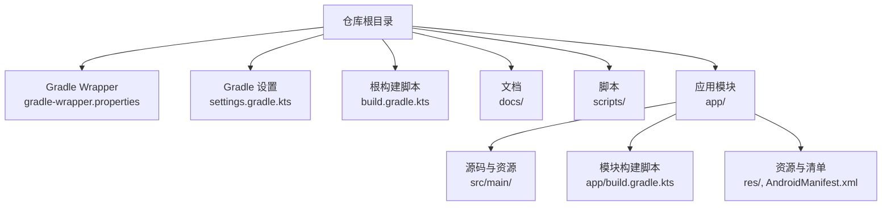
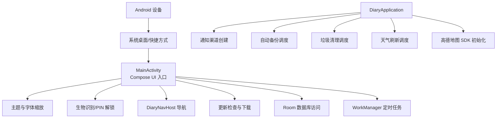
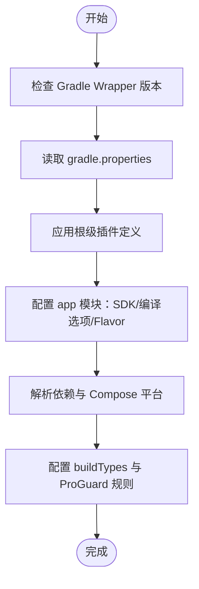
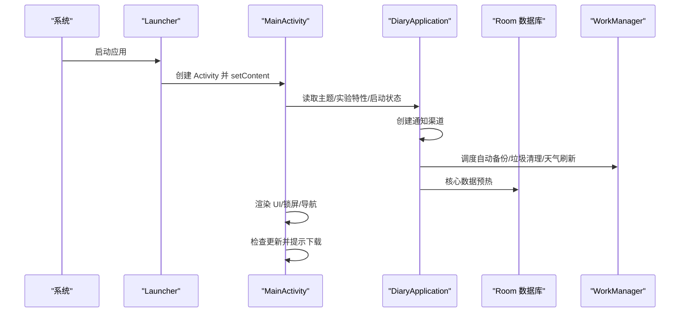
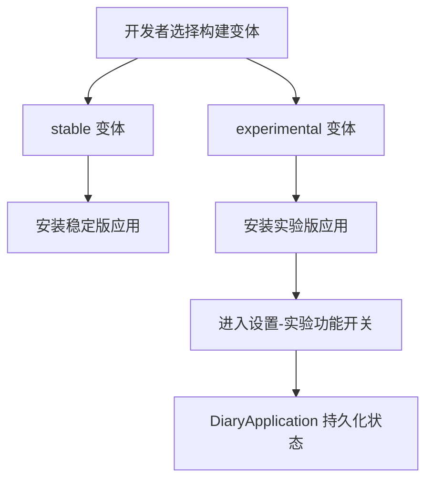
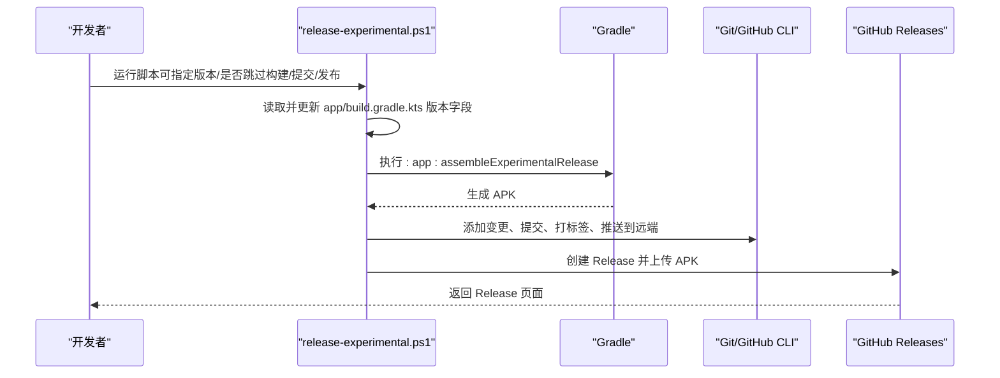
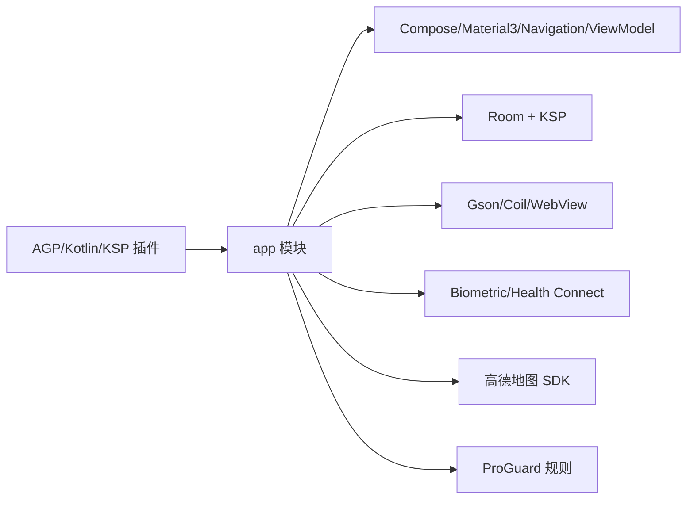

# 快速开始

<cite>
**本文引用的文件**   
- [build.gradle.kts](file://build.gradle.kts)
- [app/build.gradle.kts](file://app/build.gradle.kts)
- [settings.gradle.kts](file://settings.gradle.kts)
- [gradle.properties](file://gradle.properties)
- [gradle-wrapper.properties](file://gradle/wrapper/gradle-wrapper.properties)
- [AndroidManifest.xml](file://app/src/main/AndroidManifest.xml)
- [DiaryApplication.kt](file://app/src/main/java/com/diary/app/DiaryApplication.kt)
- [MainActivity.kt](file://app/src/main/java/com/diary/app/MainActivity.kt)
- [ExperimentalFeaturesScreen.kt](file://app/src/main/java/com/diary/app/ui/experimental/ExperimentalFeaturesScreen.kt)
- [build-notes.md](file://docs/build-notes.md)
- [README.md](file://docs/README.md)
- [release-experimental.ps1](file://scripts/release-experimental.ps1)
- [proguard-rules.pro](file://app/proguard-rules.pro)
- [gradlew.bat](file://gradlew.bat)
</cite>

## 目录
1. [简介](#简介)
2. [项目结构](#项目结构)
3. [核心组件](#核心组件)
4. [架构总览](#架构总览)
5. [详细组件分析](#详细组件分析)
6. [依赖关系分析](#依赖关系分析)
7. [性能与构建建议](#性能与构建建议)
8. [故障排除指南](#故障排除指南)
9. [结论](#结论)
10. [附录](#附录)

## 简介
本指南面向首次接触 DiaryApp 的开发者，帮助你在 Windows 环境下完成开发环境搭建、项目克隆与导入、依赖配置、构建与运行，以及首次验证应用功能。同时涵盖构建变体（稳定版 vs 实验版）的选择与使用，并提供常见问题的排查建议。

## 项目结构
DiaryApp 采用标准 Android Gradle 项目布局，根目录包含 Gradle Wrapper、全局 Gradle 配置与脚本；app 模块包含源码、资源与构建脚本；docs 提供研究与构建说明文档；scripts 提供发布与实验版打包脚本。

图表来源
- [settings.gradle.kts:1-18](file://settings.gradle.kts#L1-L18)
- [build.gradle.kts:1-6](file://build.gradle.kts#L1-L6)
- [app/build.gradle.kts:1-145](file://app/build.gradle.kts#L1-L145)

章节来源
- [settings.gradle.kts:1-18](file://settings.gradle.kts#L1-L18)
- [build.gradle.kts:1-6](file://build.gradle.kts#L1-L6)
- [app/build.gradle.kts:1-145](file://app/build.gradle.kts#L1-L145)

## 核心组件
- 构建系统与工具链
  - Gradle Wrapper：版本由 gradle-wrapper.properties 指定，用于统一构建环境。
  - Gradle 属性：gradle.properties 控制 JVM 参数、AndroidX 开关等。
  - 根级与模块级构建脚本：根 build.gradle.kts 声明插件版本，app/build.gradle.kts 配置 Android、依赖、签名与构建变体。
- 应用入口与生命周期
  - AndroidManifest.xml：声明权限、四大组件、元数据与快捷方式。
  - DiaryApplication：应用初始化、通知通道、定时任务调度、Amap SDK 初始化、核心数据预热。
  - MainActivity：Compose UI 入口，启动态加载、锁屏解锁、更新检查、导航宿主。
- 实验性功能与构建变体
  - ExperimentalFeaturesScreen：实验功能开关界面，对应 DiaryApplication 中的状态持久化。
  - productFlavors：stable 与 experimental 两套变体，区分应用 ID、版本号与包名。

章节来源
- [gradle-wrapper.properties:1-6](file://gradle/wrapper/gradle-wrapper.properties#L1-L6)
- [gradle.properties:1-6](file://gradle.properties#L1-L6)
- [build.gradle.kts:1-6](file://build.gradle.kts#L1-L6)
- [app/build.gradle.kts:14-87](file://app/build.gradle.kts#L14-L87)
- [AndroidManifest.xml:1-158](file://app/src/main/AndroidManifest.xml#L1-L158)
- [DiaryApplication.kt:1-157](file://app/src/main/java/com/diary/app/DiaryApplication.kt#L1-L157)
- [MainActivity.kt:1-472](file://app/src/main/java/com/diary/app/MainActivity.kt#L1-L472)
- [ExperimentalFeaturesScreen.kt:1-360](file://app/src/main/java/com/diary/app/ui/experimental/ExperimentalFeaturesScreen.kt#L1-L360)

## 架构总览
下面以实际代码文件为依据，展示从设备到应用、再到核心服务的关键交互路径。

图表来源
- [MainActivity.kt:79-435](file://app/src/main/java/com/diary/app/MainActivity.kt#L79-L435)
- [DiaryApplication.kt:30-105](file://app/src/main/java/com/diary/app/DiaryApplication.kt#L30-L105)
- [AndroidManifest.xml:28-155](file://app/src/main/AndroidManifest.xml#L28-L155)

## 详细组件分析

### 组件一：构建系统与工具链
- Gradle Wrapper
  - 通过 gradle-wrapper.properties 指定分发地址与版本，确保团队使用一致的 Gradle 版本。
- Gradle 属性
  - gradle.properties 启用 AndroidX、限制 R 类非传递性、调整 JVM 内存参数等。
- 根构建脚本
  - 声明 Android Gradle 插件、Kotlin 插件与 KSP 插件版本，避免在模块重复声明。
- 模块构建脚本（app）
  - compileSdk/targetSdk/minSdk、命名空间、默认配置、签名配置、构建类型（release 启用混淆与资源收缩）、Compose 支持、Kotlin 编译选项、产品风味（stable/experimental）等。

图表来源
- [gradle-wrapper.properties:1-6](file://gradle/wrapper/gradle-wrapper.properties#L1-L6)
- [gradle.properties:1-6](file://gradle.properties#L1-L6)
- [build.gradle.kts:1-6](file://build.gradle.kts#L1-L6)
- [app/build.gradle.kts:14-87](file://app/build.gradle.kts#L14-L87)

章节来源
- [gradle-wrapper.properties:1-6](file://gradle/wrapper/gradle-wrapper.properties#L1-L6)
- [gradle.properties:1-6](file://gradle.properties#L1-L6)
- [build.gradle.kts:1-6](file://build.gradle.kts#L1-L6)
- [app/build.gradle.kts:14-87](file://app/build.gradle.kts#L14-L87)

### 组件二：应用入口与启动流程
- MainActivity
  - 负责 UI 初始化、主题与字体缩放监听、启动态处理、锁屏解锁（生物识别/PIN）、更新检查与下载、导航宿主渲染与通知横幅。
- DiaryApplication
  - 在 onCreate 中创建通知渠道、调度自动备份、垃圾清理、天气刷新；初始化 Amap SDK；进行核心数据库预热并处理启动错误。

图表来源
- [MainActivity.kt:83-422](file://app/src/main/java/com/diary/app/MainActivity.kt#L83-L422)
- [DiaryApplication.kt:46-105](file://app/src/main/java/com/diary/app/DiaryApplication.kt#L46-L105)

章节来源
- [MainActivity.kt:1-472](file://app/src/main/java/com/diary/app/MainActivity.kt#L1-L472)
- [DiaryApplication.kt:1-157](file://app/src/main/java/com/diary/app/DiaryApplication.kt#L1-L157)

### 组件三：实验性功能与构建变体
- 产品风味（Flavors）
  - stable：应用 ID 与版本名固定，适合发布。
  - experimental：独立应用 ID 与版本号，便于测试与快速迭代。
- 实验功能开关
  - ExperimentalFeaturesScreen 提供多个实验功能的开关，DiaryApplication 中保存状态并持久化。

图表来源
- [app/build.gradle.kts:60-73](file://app/build.gradle.kts#L60-L73)
- [ExperimentalFeaturesScreen.kt:58-189](file://app/src/main/java/com/diary/app/ui/experimental/ExperimentalFeaturesScreen.kt#L58-L189)
- [DiaryApplication.kt:107-156](file://app/src/main/java/com/diary/app/DiaryApplication.kt#L107-L156)

章节来源
- [app/build.gradle.kts:60-73](file://app/build.gradle.kts#L60-L73)
- [ExperimentalFeaturesScreen.kt:1-360](file://app/src/main/java/com/diary/app/ui/experimental/ExperimentalFeaturesScreen.kt#L1-L360)
- [DiaryApplication.kt:1-157](file://app/src/main/java/com/diary/app/DiaryApplication.kt#L1-L157)

### 组件四：构建与发布流程（含实验版）
- 常用构建命令
  - 清理、编译 Kotlin、打包实验版 Release。
- PowerShell 发布脚本
  - 自动读取当前版本、递增版本号与版本码、更新构建文件、执行打包、提交与打标签、推送至远程并创建 GitHub Release。

图表来源
- [release-experimental.ps1:1-129](file://scripts/release-experimental.ps1#L1-L129)
- [app/build.gradle.kts:23](file://app/build.gradle.kts#L23)

章节来源
- [release-experimental.ps1:1-129](file://scripts/release-experimental.ps1#L1-L129)
- [app/build.gradle.kts:19-35](file://app/build.gradle.kts#L19-L35)

## 依赖关系分析
- 插件与工具链
  - Android Gradle Plugin、Kotlin Android 插件、KSP（Kotlin Symbol Processing）。
- 运行时与 UI
  - Jetpack Compose（BOM）、Material3、Navigation、ViewModel、Runtime Compose。
- 数据与网络
  - Room（含 KSP 编译器）、WorkManager、Gson、Coil 图像加载、WebView（WebKit）。
- 生物识别与健康
  - Biometric、Health Connect 客户端。
- 地图与定位
  - 高德地图 SDK。
- 混淆与资源
  - ProGuard 规则对 Gson、更新模型、备份实体与 Amap SDK 进行保护与告警抑制。

图表来源
- [build.gradle.kts:1-6](file://build.gradle.kts#L1-L6)
- [app/build.gradle.kts:89-144](file://app/build.gradle.kts#L89-L144)
- [proguard-rules.pro:1-31](file://app/proguard-rules.pro#L1-L31)

章节来源
- [build.gradle.kts:1-6](file://build.gradle.kts#L1-L6)
- [app/build.gradle.kts:89-144](file://app/build.gradle.kts#L89-L144)
- [proguard-rules.pro:1-31](file://app/proguard-rules.pro#L1-L31)

## 性能与构建建议
- 推荐 JDK
  - 文档明确推荐使用 JDK 17 运行 Gradle；在 JDK 21 下本地单元测试可能不稳定。
- 构建稳定性
  - 避免对同一工作区并行执行 clean、compile、test、assemble 等任务。
- 依赖与资源
  - release 构建启用代码压缩与资源收缩，有助于减小体积与提升启动性能。
- 字体与主题
  - 通过 SharedPreferences 监听字体大小变化，动态调整 UI 字体缩放，改善可访问性。

章节来源
- [build-notes.md:3-27](file://docs/build-notes.md#L3-L27)
- [gradle.properties:1-6](file://gradle.properties#L1-L6)
- [app/build.gradle.kts:43-51](file://app/build.gradle.kts#L43-L51)
- [MainActivity.kt:93-102](file://app/src/main/java/com/diary/app/MainActivity.kt#L93-L102)

## 故障排除指南
- 环境变量与工具链
  - 若 gradlew.bat 报错找不到 Java，请设置 JAVA_HOME 或在 PATH 中包含 java.exe。
- 测试失败（Windows + JDK 21）
  - 某些单元测试在 JDK 21 下可能出现 Worker 启动类缺失导致的 ClassNotFoundException，建议切换到 JDK 17。
- 构建冲突
  - 不要在同一工作区并行执行多类构建任务，先执行 clean，再按顺序执行编译与打包。
- 实验版构建
  - 使用 release-experimental.ps1 更新版本号与版本码后，确保已提交并打标签，再创建 Release。

章节来源
- [gradlew.bat:35-92](file://gradlew.bat#L35-L92)
- [build-notes.md:11-16](file://docs/build-notes.md#L11-L16)
- [build-notes.md:25-26](file://docs/build-notes.md#L25-L26)
- [release-experimental.ps1:87-129](file://scripts/release-experimental.ps1#L87-L129)

## 结论
通过本指南，你可以在 Windows 上完成 DiaryApp 的环境搭建、项目导入与构建，并根据需要选择稳定版或实验版进行开发与测试。遇到问题时，优先检查 JDK 版本、Gradle Wrapper 与并行构建冲突，并参考文档中的验证路径与脚本使用方式。

## 附录

### A. 开发环境设置步骤（Windows）
- 安装与配置
  - 安装 Android Studio（包含 Gradle 与 SDK）。
  - 安装 JDK 17（推荐），并配置 JAVA_HOME。
  - 下载并安装 Android SDK（含平台工具、构建工具、系统镜像）。
- 克隆与导入
  - 使用 Android Studio 的 VCS → Git → Clone，或在终端执行 git clone。
  - 打开项目根目录，Android Studio 自动导入 Gradle 项目。
- 配置本地属性
  - 在仓库根目录创建 local.properties，填入必要的密钥（如 GITHUB_TOKEN、AMAP_API_KEY），以便注入到构建配置与清单占位符。
- 验证 Gradle Wrapper
  - 确认 gradle-wrapper.properties 指向的 Gradle 版本可用，必要时通过 Android Studio 的 Gradle 窗口刷新。

章节来源
- [gradle-wrapper.properties:1-6](file://gradle/wrapper/gradle-wrapper.properties#L1-L6)
- [app/build.gradle.kts:9-35](file://app/build.gradle.kts#L9-L35)
- [AndroidManifest.xml:38-41](file://app/src/main/AndroidManifest.xml#L38-L41)

### B. 编译与构建流程（命令行与 IDE）
- 命令行
  - 清理：.\gradlew.bat clean
  - 编译实验版 Kotlin：.\gradlew.bat :app:compileExperimentalDebugKotlin
  - 打包实验版 Release：.\gradlew.bat :app:assembleExperimentalRelease
- IDE（Android Studio）
  - 使用 Gradle 工具窗口选择任务并执行。
  - 在 Build Variants 中切换 stable 或 experimental。

章节来源
- [build-notes.md:17-21](file://docs/build-notes.md#L17-L21)
- [app/build.gradle.kts:60-73](file://app/build.gradle.kts#L60-L73)

### C. 首次运行与基础功能验证
- 安装与启动
  - 选择 experimental 变体安装到真机或模拟器，首次启动进入启动态加载。
- 锁屏解锁
  - 若开启生物识别或 PIN，需完成解锁后方可进入主界面。
- 主界面与导航
  - 进入 DiaryNavHost，验证首页、时间线、待办、我的等页面可正常切换。
- 实验功能
  - 进入设置 → 实验功能，逐项开启/关闭，观察行为差异。
- 更新检查
  - 首次进入会触发更新检查，若存在更新可下载安装。
- 权限与组件
  - 确认必要权限（网络、存储、位置、通知等）已授予，快捷方式与文件提供者配置正确。

章节来源
- [MainActivity.kt:108-120](file://app/src/main/java/com/diary/app/MainActivity.kt#L108-L120)
- [MainActivity.kt:313-420](file://app/src/main/java/com/diary/app/MainActivity.kt#L313-L420)
- [ExperimentalFeaturesScreen.kt:58-189](file://app/src/main/java/com/diary/app/ui/experimental/ExperimentalFeaturesScreen.kt#L58-L189)
- [AndroidManifest.xml:5-18](file://app/src/main/AndroidManifest.xml#L5-L18)
- [AndroidManifest.xml:45-61](file://app/src/main/AndroidManifest.xml#L45-L61)

### D. 构建变体选择与使用
- stable
  - 适用于正式发布，应用 ID 固定，版本名稳定。
- experimental
  - 适用于快速迭代与测试，应用 ID 与版本号独立管理，便于频繁发布与回滚。

章节来源
- [app/build.gradle.kts:60-73](file://app/build.gradle.kts#L60-L73)
- [README.md:61-68](file://docs/README.md#L61-L68)