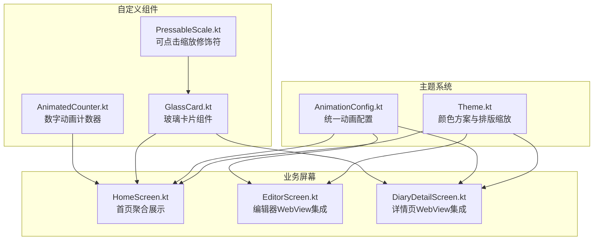
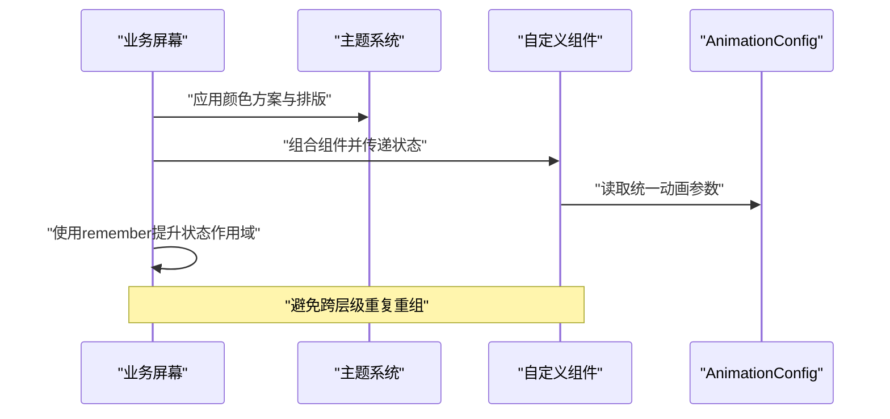
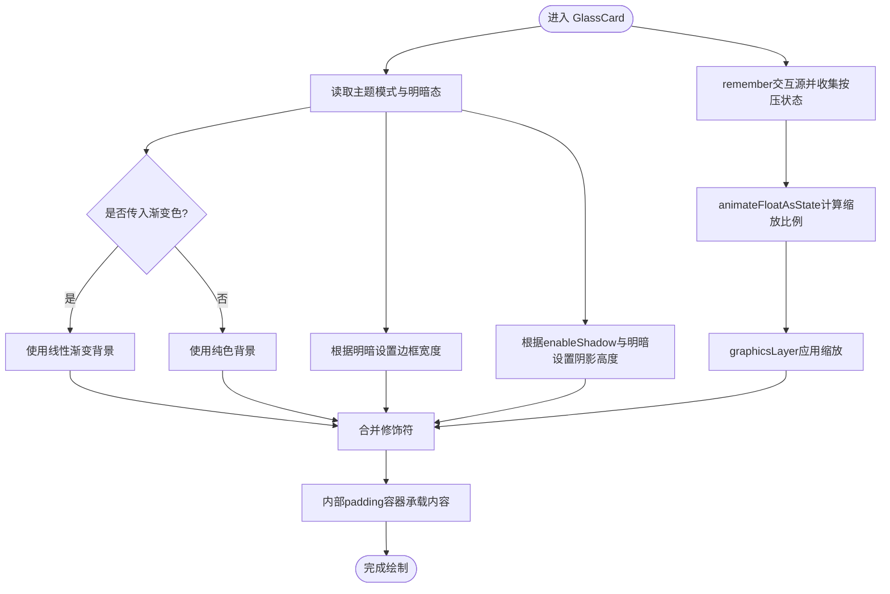
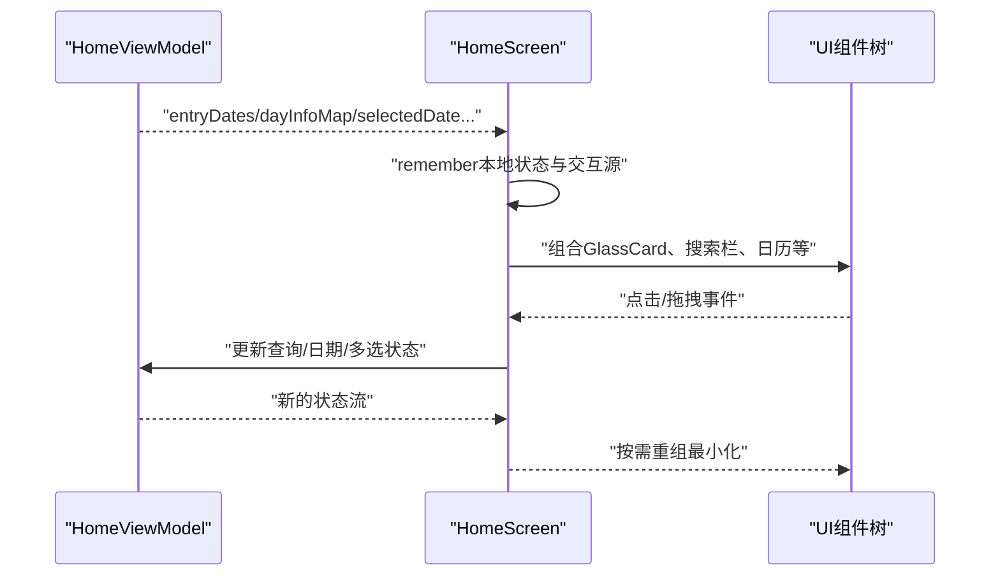
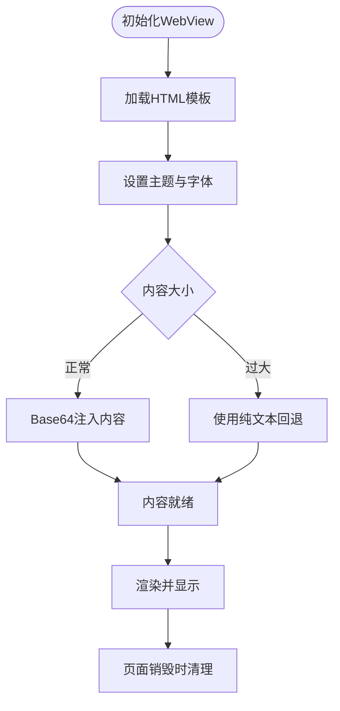
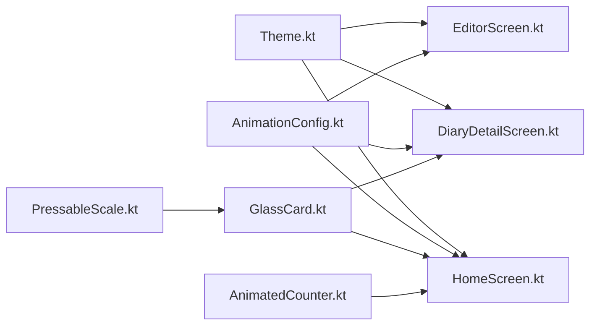

# UI渲染优化

<cite>
**本文档引用的文件**
- [AnimationConfig.kt](file://app/src/main/java/com/diary/app/ui/theme/AnimationConfig.kt)
- [GlassCard.kt](file://app/src/main/java/com/diary/app/ui/components/GlassCard.kt)
- [HomeScreen.kt](file://app/src/main/java/com/diary/app/ui/home/HomeScreen.kt)
- [EditorScreen.kt](file://app/src/main/java/com/diary/app/ui/editor/EditorScreen.kt)
- [DiaryDetailScreen.kt](file://app/src/main/java/com/diary/app/ui/detail/DiaryDetailScreen.kt)
- [Theme.kt](file://app/src/main/java/com/diary/app/ui/theme/Theme.kt)
- [AnimatedCounter.kt](file://app/src/main/java/com/diary/app/ui/components/AnimatedCounter.kt)
- [PressableScale.kt](file://app/src/main/java/com/diary/app/ui/components/PressableScale.kt)
</cite>

## 目录
1. [简介](#简介)
2. [项目结构](#项目结构)
3. [核心组件](#核心组件)
4. [架构概览](#架构概览)
5. [详细组件分析](#详细组件分析)
6. [依赖关系分析](#依赖关系分析)
7. [性能考量](#性能考量)
8. [故障排查指南](#故障排查指南)
9. [结论](#结论)

## 简介
本文件聚焦DiaryApp中Jetpack Compose UI渲染性能优化实践，围绕以下目标展开：
- 重组优化策略：状态提升、remember的正确使用与不可变数据设计
- 自定义组件渲染优化：GlassCard等组件的绘制与过度绘制规避
- 动画性能优化：AnimationConfig中的参数调优与流畅度保障
- 性能监控与问题定位：Layout Inspector与Frame Debugger的使用要点及常见卡顿解决方案

## 项目结构
DiaryApp采用按功能域分层的模块化组织方式，UI层位于app/src/main/java/com/diary/app/ui下，包含screen、components、theme等子包。主题系统通过Theme.kt集中管理颜色与排版；自定义组件如GlassCard、AnimatedCounter等位于components目录；各业务屏幕（如HomeScreen、EditorScreen、DiaryDetailScreen）负责组合组件与状态管理。

**图表来源**
- [Theme.kt:500-576](file://app/src/main/java/com/diary/app/ui/theme/Theme.kt#L500-L576)
- [AnimationConfig.kt:10-39](file://app/src/main/java/com/diary/app/ui/theme/AnimationConfig.kt#L10-L39)
- [GlassCard.kt:56-137](file://app/src/main/java/com/diary/app/ui/components/GlassCard.kt#L56-L137)
- [HomeScreen.kt:159-554](file://app/src/main/java/com/diary/app/ui/home/HomeScreen.kt#L159-L554)
- [EditorScreen.kt:119-800](file://app/src/main/java/com/diary/app/ui/editor/EditorScreen.kt#L119-L800)
- [DiaryDetailScreen.kt:96-575](file://app/src/main/java/com/diary/app/ui/detail/DiaryDetailScreen.kt#L96-L575)

**章节来源**
- [Theme.kt:500-576](file://app/src/main/java/com/diary/app/ui/theme/Theme.kt#L500-L576)
- [AnimationConfig.kt:10-39](file://app/src/main/java/com/diary/app/ui/theme/AnimationConfig.kt#L10-L39)

## 核心组件
本节梳理与性能优化直接相关的核心组件及其职责：
- 主题与排版：通过DiaryAppTheme集中提供颜色方案、排版缩放与密度适配，确保全局一致的视觉与性能基线
- 统一动画配置：AnimationConfig提供Spring与Tween两类动画参数，覆盖按钮、卡片、面板等常用交互
- 自定义容器：GlassCard封装背景、边框、阴影、圆角与点击反馈，支持渐变色与阴影开关
- 可点击缩放：PressableScale修饰符以spring动画提供自然的按压反馈
- 数字动画：AnimatedCounter基于Animatable实现平滑数值过渡

**章节来源**
- [Theme.kt:500-576](file://app/src/main/java/com/diary/app/ui/theme/Theme.kt#L500-L576)
- [AnimationConfig.kt:10-39](file://app/src/main/java/com/diary/app/ui/theme/AnimationConfig.kt#L10-L39)
- [GlassCard.kt:56-137](file://app/src/main/java/com/diary/app/ui/components/GlassCard.kt#L56-L137)
- [PressableScale.kt:16-63](file://app/src/main/java/com/diary/app/ui/components/PressableScale.kt#L16-L63)
- [AnimatedCounter.kt:17-49](file://app/src/main/java/com/diary/app/ui/components/AnimatedCounter.kt#L17-L49)

## 架构概览
下图展示了从主题到屏幕再到自定义组件的调用链路，强调状态提升与remember的使用点位，以及动画配置的统一入口。

**图表来源**
- [HomeScreen.kt:182-250](file://app/src/main/java/com/diary/app/ui/home/HomeScreen.kt#L182-L250)
- [Theme.kt:500-576](file://app/src/main/java/com/diary/app/ui/theme/Theme.kt#L500-L576)
- [AnimationConfig.kt:10-39](file://app/src/main/java/com/diary/app/ui/theme/AnimationConfig.kt#L10-L39)
- [GlassCard.kt:56-137](file://app/src/main/java/com/diary/app/ui/components/GlassCard.kt#L56-L137)

## 详细组件分析

### GlassCard 渲染优化
GlassCard是典型的复合UI容器，涉及背景、边框、阴影、圆角与点击反馈。其优化要点包括：
- 状态提升与remember：将交互源与按压状态在调用方或上层进行提升，减少不必要的重组
- 绘制顺序与过度绘制规避：通过graphicsLayer与shadow的合理组合，避免重复绘制；仅在需要时启用阴影
- 动画参数：使用统一的AnimationConfig中的SpringGentle或TweenFast控制按压缩放动画
- 渐变背景：当传入渐变色列表时优先使用Brush.linearGradient，否则使用纯色背景

**图表来源**
- [GlassCard.kt:56-137](file://app/src/main/java/com/diary/app/ui/components/GlassCard.kt#L56-L137)

**章节来源**
- [GlassCard.kt:56-137](file://app/src/main/java/com/diary/app/ui/components/GlassCard.kt#L56-L137)

### 动画配置与流畅度保障
AnimationConfig集中定义了三类动画参数：
- Spring系列：SpringGentle（中弹跳阻尼+中低刚度）、SpringBouncy（低弹跳阻尼+中刚度）、SpringSnappy（无弹跳阻尼+高刚度）
- Tween系列：TweenFast（150ms）、TweenNormal（250ms）、TweenSlow（400ms）
- 场景化映射：ButtonPress、CardScale、PanelExpand、FadeIn/FadeOut、ListItemEnter等

建议：
- 按交互类型选择合适参数：轻量反馈用SpringGentle，面板展开用TweenNormal，淡入淡出用TweenNormal/TweenFast
- 避免过长动画：默认值已针对移动端体验优化，除非特殊场景不建议延长
- 保持一致性：通过统一对象引用，避免分散配置导致的不一致

**章节来源**
- [AnimationConfig.kt:10-39](file://app/src/main/java/com/diary/app/ui/theme/AnimationConfig.kt#L10-L39)

### 主题系统与字体缩放
Theme.kt通过DiaryAppTheme提供：
- 多套颜色方案（纯色、苔藓绿、海洋、花瓣、沙岩、陶土、墨 ink等），按主题模式动态切换
- 字体缩放机制：LocalFontScale与scaledTypography，结合SharedPreferences读取用户偏好
- 密度适配：在SideEffect中设置状态栏外观，并通过CompositionLocal提供缩放后的Density

优化建议：
- 将字体缩放逻辑集中在Theme层，避免在各屏幕重复计算
- 使用remember缓存缩放后的Typography与Density，降低重组成本

**章节来源**
- [Theme.kt:500-576](file://app/src/main/java/com/diary/app/ui/theme/Theme.kt#L500-L576)

### 可点击缩放修饰符
PressableScale通过composed封装交互源与动画，提供两种重载：
- 仅缩放：适用于非点击区域的视觉反馈
- 带点击回调：同时提供按压缩放与点击事件

实现要点：
- 使用animateFloatAsState与spring动画，确保自然的按压/释放过程
- 将interactionSource与clickable组合，避免额外的indication绘制开销

**章节来源**
- [PressableScale.kt:16-63](file://app/src/main/java/com/diary/app/ui/components/PressableScale.kt#L16-L63)

### 数字动画计数器
AnimatedCounter基于Animatable实现平滑数值过渡，适合统计类UI的增量/更新动画：
- 接收targetValue作为触发条件，LaunchedEffect监听变化后执行动画
- 支持前缀/后缀、字号、字重与颜色定制
- 使用FastOutSlowInEasing保证自然的缓动曲线

**章节来源**
- [AnimatedCounter.kt:17-49](file://app/src/main/java/com/diary/app/ui/components/AnimatedCounter.kt#L17-L49)

### HomeScreen 状态提升与重组优化
HomeScreen展示了大量状态与交互，是重组优化的典型场景：
- 状态提升：将多处collectAsState的状态提升至单个作用域，减少下游重组范围
- remember使用：对本地状态（如多选状态、搜索查询、日期选择）使用remember，避免每次重组重新创建
- 交互源分离：为不同交互（如日历、搜索、快捷入口）分别管理状态，避免相互影响
- 列表与懒加载：LazyColumn配合items与key，确保列表项稳定重组

**图表来源**
- [HomeScreen.kt:182-250](file://app/src/main/java/com/diary/app/ui/home/HomeScreen.kt#L182-L250)

**章节来源**
- [HomeScreen.kt:182-250](file://app/src/main/java/com/diary/app/ui/home/HomeScreen.kt#L182-L250)

### 编辑器与详情页的WebView集成优化
EditorScreen与DiaryDetailScreen均集成了WebView用于富文本渲染，涉及性能的关键点：
- WebView生命周期管理：在DisposableEffect中stopLoading与destroy，防止内存泄漏与后台占用
- 内容注入策略：使用Base64编码或安全替换data URI，避免大体积内容直接注入导致的内存压力
- 主题与字体：通过JS桥设置主题与字体大小，减少重绘
- 滚动与键盘：监听键盘可见性与滚动行为，避免频繁布局与重绘

**图表来源**
- [EditorScreen.kt:340-400](file://app/src/main/java/com/diary/app/ui/editor/EditorScreen.kt#L340-L400)
- [DiaryDetailScreen.kt:360-490](file://app/src/main/java/com/diary/app/ui/detail/DiaryDetailScreen.kt#L360-L490)

**章节来源**
- [EditorScreen.kt:340-400](file://app/src/main/java/com/diary/app/ui/editor/EditorScreen.kt#L340-L400)
- [DiaryDetailScreen.kt:360-490](file://app/src/main/java/com/diary/app/ui/detail/DiaryDetailScreen.kt#L360-L490)

## 依赖关系分析
- 主题系统依赖：所有屏幕通过DiaryAppTheme统一应用颜色与排版
- 动画配置依赖：各屏幕与组件通过AnimationConfig共享动画参数
- 自定义组件依赖：GlassCard、PressableScale、AnimatedCounter被多个屏幕复用
- 状态依赖：HomeScreen集中管理多源状态流，减少跨组件状态传播

**图表来源**
- [Theme.kt:500-576](file://app/src/main/java/com/diary/app/ui/theme/Theme.kt#L500-L576)
- [AnimationConfig.kt:10-39](file://app/src/main/java/com/diary/app/ui/theme/AnimationConfig.kt#L10-L39)
- [GlassCard.kt:56-137](file://app/src/main/java/com/diary/app/ui/components/GlassCard.kt#L56-L137)
- [PressableScale.kt:16-63](file://app/src/main/java/com/diary/app/ui/components/PressableScale.kt#L16-L63)
- [AnimatedCounter.kt:17-49](file://app/src/main/java/com/diary/app/ui/components/AnimatedCounter.kt#L17-L49)
- [HomeScreen.kt:159-554](file://app/src/main/java/com/diary/app/ui/home/HomeScreen.kt#L159-L554)
- [EditorScreen.kt:119-800](file://app/src/main/java/com/diary/app/ui/editor/EditorScreen.kt#L119-L800)
- [DiaryDetailScreen.kt:96-575](file://app/src/main/java/com/diary/app/ui/detail/DiaryDetailScreen.kt#L96-L575)

**章节来源**
- [HomeScreen.kt:159-554](file://app/src/main/java/com/diary/app/ui/home/HomeScreen.kt#L159-L554)
- [EditorScreen.kt:119-800](file://app/src/main/java/com/diary/app/ui/editor/EditorScreen.kt#L119-L800)
- [DiaryDetailScreen.kt:96-575](file://app/src/main/java/com/diary/app/ui/detail/DiaryDetailScreen.kt#L96-L575)

## 性能考量
- 重组优化
  - 将状态提升至最近公共祖先，减少下游重组范围
  - 对本地状态使用remember，避免每次重组创建新实例
  - 合理拆分组件，确保状态变更只影响必要子树
- 绘制与过度绘制
  - 控制阴影与圆角的使用频率，避免叠加过多投影
  - 在不需要时禁用阴影，减少离屏渲染
  - 使用graphicsLayer替代多层Modifier链，降低绘制复杂度
- 动画参数
  - 采用AnimationConfig统一参数，避免散落配置
  - 根据交互类型选择合适的动画时长与缓动函数
- WebView集成
  - 大内容采用Base64或回退策略，避免直接注入超大字符串
  - 在页面销毁时及时清理WebView资源，防止内存泄漏
- 字体与密度
  - 通过Theme.kt集中处理字体缩放与密度适配，避免重复计算

[本节为通用指导，无需特定文件引用]

## 故障排查指南
- Layout Inspector 使用
  - 打开：Android Studio → Layout Inspector → 选择目标进程
  - 关注点：重组边界、过度绘制区域、阴影与圆角的叠加
  - 建议：将阴影与圆角限制在必要区域，减少不必要的绘制
- Frame Debugger 使用
  - 打开：Android Studio → Device Manager → Open View → Graphics / Frame Debugger
  - 关注点：帧耗时、重绘区域、GPU时间占比
  - 建议：减少重组、避免过度绘制、优化动画时长
- 常见卡顿问题
  - 过度重组：检查状态提升与remember使用，避免在组合函数中创建新对象
  - 过度绘制：减少阴影与圆角叠加，优先使用graphicsLayer
  - 动画过长：调整AnimationConfig参数，确保符合移动端体验
  - WebView内容过大：采用Base64或回退策略，避免一次性注入超大内容

[本节为通用指导，无需特定文件引用]

## 结论
DiaryApp在UI渲染优化方面形成了以“主题统一、状态提升、组件复用、动画规范”为核心的体系。通过AnimationConfig统一动画参数、GlassCard等组件的绘制优化、以及HomeScreen等屏幕的状态提升实践，整体UI具备良好的流畅度与可维护性。结合Layout Inspector与Frame Debugger，可进一步定位并解决潜在的卡顿问题，持续提升用户体验。