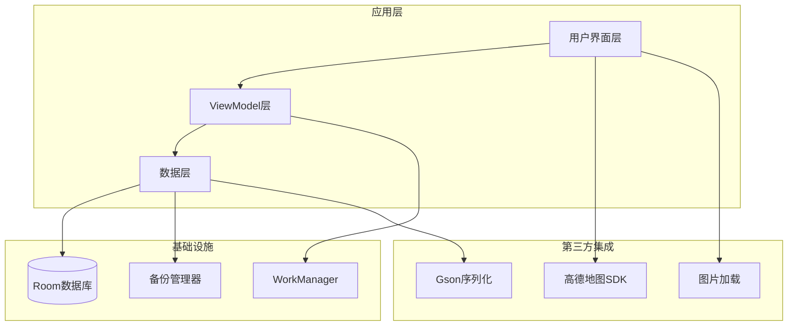
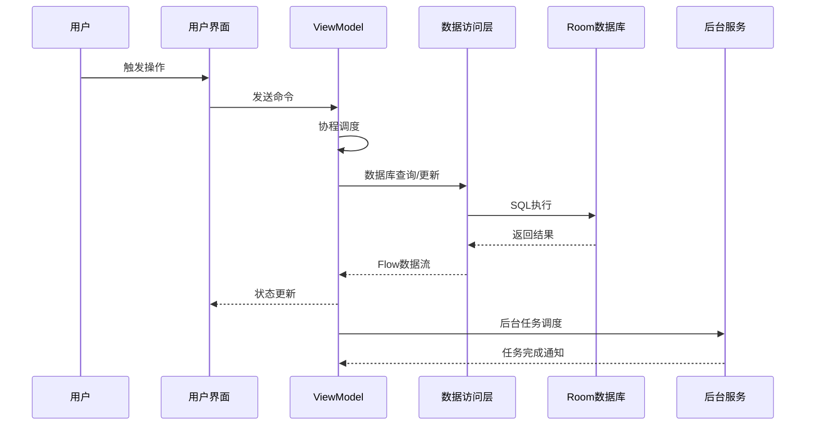
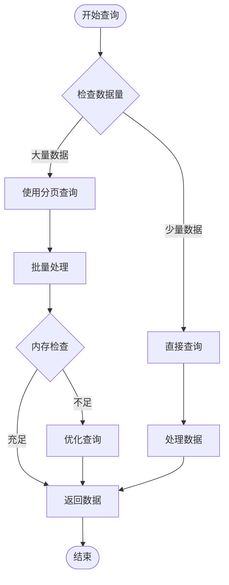
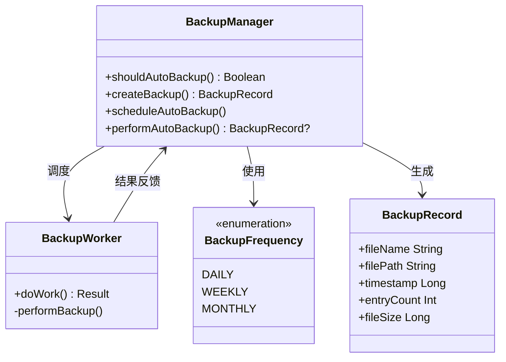
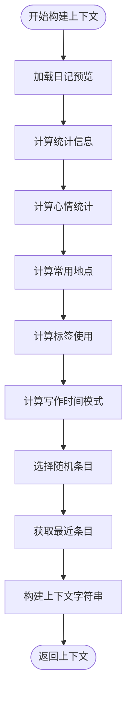
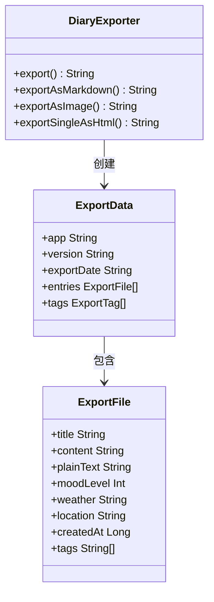
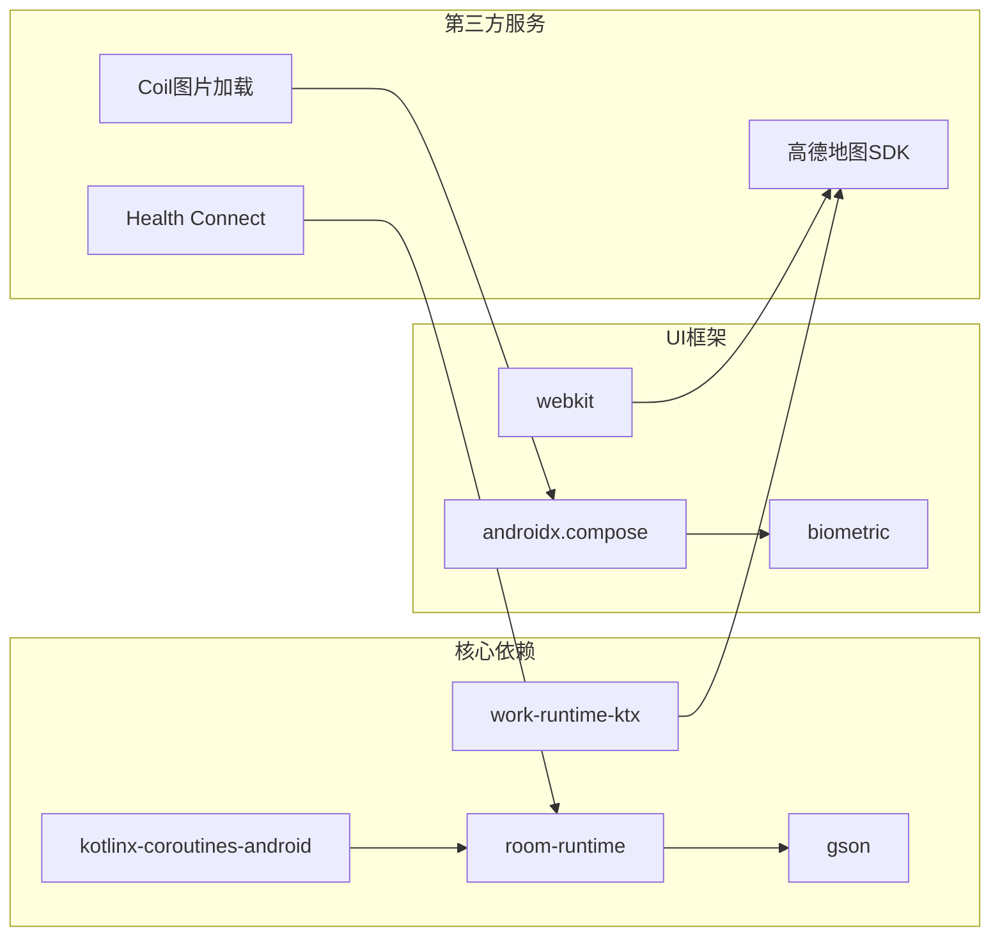

# 代码优化

<cite>
**本文档引用的文件**
- [proguard-rules.pro](file://app/proguard-rules.pro)
- [build.gradle.kts](file://app/build.gradle.kts)
- [HomeViewModel.kt](file://app/src/main/java/com/diary/app/ui/home/HomeViewModel.kt)
- [DiaryDao.kt](file://app/src/main/java/com/diary/app/data/DiaryDao.kt)
- [AiAssistantViewModel.kt](file://app/src/main/java/com/diary/app/ai/AiAssistantViewModel.kt)
- [DiaryExporter.kt](file://app/src/main/java/com/diary/app/data/DiaryExporter.kt)
- [BackupManager.kt](file://app/src/main/java/com/diary/app/data/BackupManager.kt)
- [BackupWorker.kt](file://app/src/main/java/com/diary/app/data/BackupWorker.kt)
- [performance-optimization-guide.html](file://docs/analysis/performance-optimization-guide.html)
</cite>

## 目录
1. [简介](#简介)
2. [项目结构](#项目结构)
3. [核心组件](#核心组件)
4. [架构概览](#架构概览)
5. [详细组件分析](#详细组件分析)
6. [依赖分析](#依赖分析)
7. [性能考虑](#性能考虑)
8. [故障排除指南](#故障排除指南)
9. [结论](#结论)

## 简介

本文档深入分析DiaryApp项目的代码优化实践，重点关注ProGuard代码混淆和压缩配置、Kotlin协程最佳实践、内存泄漏预防以及性能瓶颈优化。项目采用现代化的Android开发技术栈，包括Jetpack Compose、Room数据库、WorkManager后台任务调度等。

## 项目结构

DiaryApp采用模块化的项目结构，主要包含以下核心模块：

**图表来源**
- [build.gradle.kts:89-144](file://app/build.gradle.kts#L89-L144)

**章节来源**
- [build.gradle.kts:14-87](file://app/build.gradle.kts#L14-L87)

## 核心组件

### ProGuard代码混淆配置

项目实现了全面的代码混淆和压缩配置，确保应用的安全性和体积优化：

#### Gson序列化类保护
- 保护更新相关类：ChangelogRelease、GitHubRelease、GitHubAsset
- 保护备份相关类：DiaryBackup、BackupEntry、BackupTag等10个备份实体类
- 保持运行时注解信息：@Annotation、@Signature、@EnclosingMethod、@InnerClasses

#### 高德地图SDK保留规则
- 完整保留amap.api.*包下的所有类和成员
- 保留autonavi.*和loc.*相关包
- 配置警告忽略：-dontwarn com.amap.api.**、-dontwarn com.autonavi.**、-dontwarn com.loc.**

**章节来源**
- [proguard-rules.pro:1-31](file://app/proguard-rules.pro#L1-L31)

### Kotlin协程最佳实践

项目在多个层面展示了协程的正确使用模式：

#### ViewModel中的协程使用
- 使用viewModelScope管理生命周期
- IO线程执行数据库操作
- 正确的异常处理和日志记录

#### 后台任务调度
- WorkManager实现周期性自动备份
- CoroutineWorker支持异步备份操作
- 优雅的错误重试机制

**章节来源**
- [HomeViewModel.kt:60-81](file://app/src/main/java/com/diary/app/ui/home/HomeViewModel.kt#L60-L81)
- [AiAssistantViewModel.kt:60-81](file://app/src/main/java/com/diary/app/ai/AiAssistantViewModel.kt#L60-L81)
- [BackupWorker.kt:13-25](file://app/src/main/java/com/diary/app/data/BackupWorker.kt#L13-L25)

## 架构概览

**图表来源**
- [HomeViewModel.kt:156-158](file://app/src/main/java/com/diary/app/ui/home/HomeViewModel.kt#L156-L158)
- [DiaryDao.kt:14-19](file://app/src/main/java/com/diary/app/data/DiaryDao.kt#L14-L19)

## 详细组件分析

### 数据库查询优化

#### 分页查询实现
项目实现了分页查询以避免全量加载导致的内存问题：

**图表来源**
- [DiaryDao.kt:222-231](file://app/src/main/java/com/diary/app/data/DiaryDao.kt#L222-L231)

#### 查询性能优化策略
- 使用投影查询避免加载大字段内容
- 实现批量查询避免CursorWindow溢出
- 采用分批处理大数据集

**章节来源**
- [DiaryDao.kt:14-19](file://app/src/main/java/com/diary/app/data/DiaryDao.kt#L14-L19)
- [DiaryDao.kt:458-477](file://app/src/main/java/com/diary/app/data/DiaryDao.kt#L458-L477)

### 备份系统设计

#### 自动备份架构

**图表来源**
- [BackupManager.kt:63-140](file://app/src/main/java/com/diary/app/data/BackupManager.kt#L63-L140)
- [BackupWorker.kt:8-25](file://app/src/main/java/com/diary/app/data/BackupWorker.kt#L8-L25)

#### 备份数据结构
项目实现了完整的备份数据模型，包括：
- 日记条目备份：BackupEntry
- 标签备份：BackupTag  
- 待办事项备份：BackupTodo
- 倒计时备份：BackupCountDown
- 时间胶囊备份：BackupCapsule
- 回收站备份：BackupTrashEntry
- 习惯记录备份：BackupHabitRecord
- 通知备份：BackupNotification
- 聊天备份：BackupChatConversation、BackupChatMessage

**章节来源**
- [BackupManager.kt:483-616](file://app/src/main/java/com/diary/app/data/BackupManager.kt#L483-L616)

### AI助手优化

#### 上下文构建优化
AI助手实现了高效的上下文构建算法：

**图表来源**
- [AiAssistantViewModel.kt:228-330](file://app/src/main/java/com/diary/app/ai/AiAssistantViewModel.kt#L228-L330)

**章节来源**
- [AiAssistantViewModel.kt:228-330](file://app/src/main/java/com/diary/app/ai/AiAssistantViewModel.kt#L228-L330)

### 导出功能优化

#### 多格式导出实现
项目提供了多种导出格式，每种格式都有针对性的优化：

**图表来源**
- [DiaryExporter.kt:23-51](file://app/src/main/java/com/diary/app/data/DiaryExporter.kt#L23-L51)

**章节来源**
- [DiaryExporter.kt:53-110](file://app/src/main/java/com/diary/app/data/DiaryExporter.kt#L53-L110)

## 依赖分析

**图表来源**
- [build.gradle.kts:89-144](file://app/build.gradle.kts#L89-L144)

**章节来源**
- [build.gradle.kts:89-144](file://app/build.gradle.kts#L89-L144)

## 性能考虑

### 内存优化策略

#### 对象池和缓存机制
- 使用Flow的stateIn和shareIn避免重复计算
- 实现Repository层数据缓存
- 合并多个数据流减少遍历次数

#### 图片内存管理
- Coil采样率调整避免内存溢出
- 大图回收策略及时释放资源
- 图片缩略图缓存机制

### 网络请求优化

#### 请求去重和缓存
- 实现请求去重避免重复网络请求
- 缓存策略减少服务器压力
- 错误重试机制提升成功率

### 数据库查询优化

#### 索引和查询优化
- 实现FTS5全文搜索替代LIKE查询
- 预计算列避免strftime函数调用
- 复合索引优化复杂查询

**章节来源**
- [performance-optimization-guide.html:254-285](file://docs/analysis/performance-optimization-guide.html#L254-L285)

## 故障排除指南

### 常见问题诊断

#### 协程相关问题
- **协程泄漏**：确保使用适当的作用域管理
- **主线程阻塞**：将耗时操作移动到IO线程
- **异常处理**：实现全局异常捕获和日志记录

#### 数据库性能问题
- **查询超时**：检查索引使用情况
- **内存溢出**：实现分页查询和批量处理
- **锁竞争**：优化事务使用和并发访问

#### 备份失败排查
- **存储权限**：检查外部存储访问权限
- **磁盘空间**：监控可用存储空间
- **网络连接**：验证备份目标可达性

**章节来源**
- [BackupWorker.kt:21-24](file://app/src/main/java/com/diary/app/data/BackupWorker.kt#L21-L24)

## 结论

DiaryApp项目展现了现代Android应用的优秀代码优化实践。通过合理的ProGuard配置、协程最佳实践、内存管理和性能优化策略，项目在保证功能完整性的同时实现了良好的性能表现。

关键优化成果包括：
- 全面的代码混淆保护，确保应用安全
- 高效的协程使用模式，避免内存泄漏
- 智能的数据查询优化，提升响应速度
- 完善的备份系统，保障数据安全
- 友好的用户体验，流畅的应用性能

这些优化实践为类似项目的开发提供了宝贵的参考和借鉴价值。