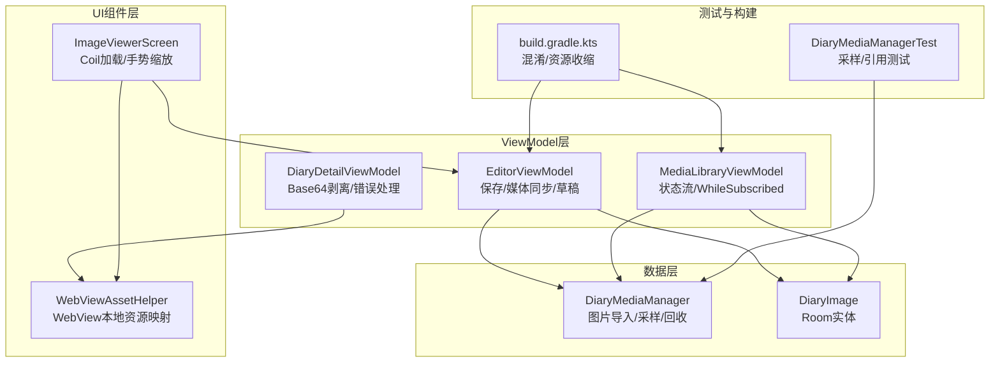
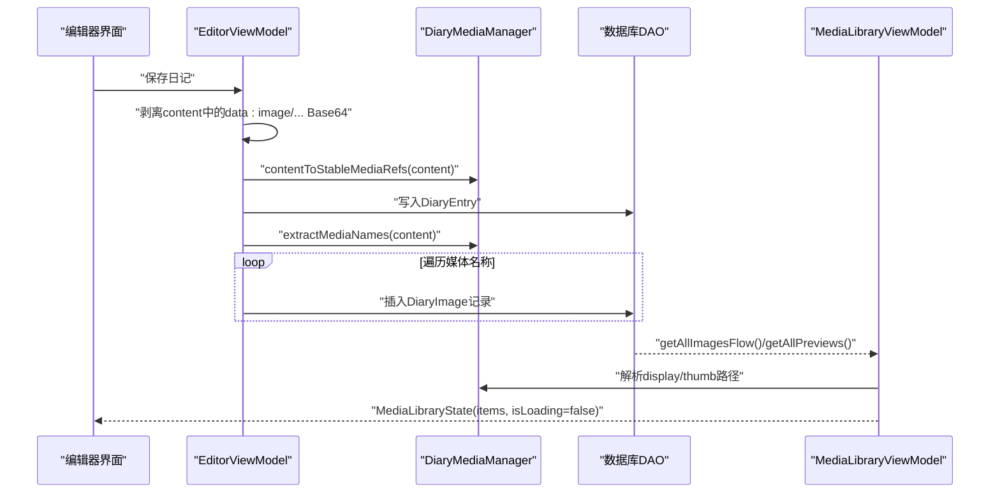
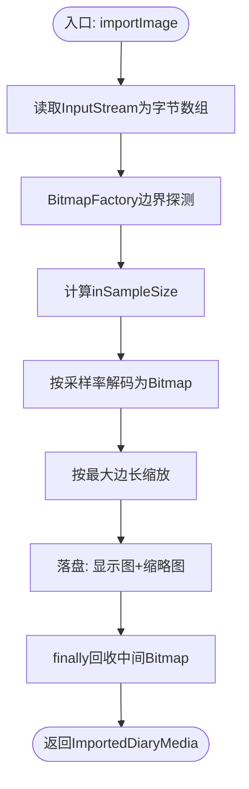
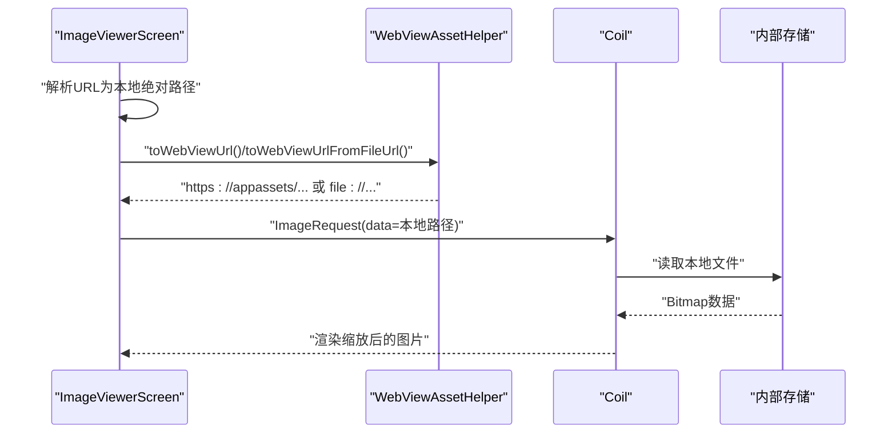
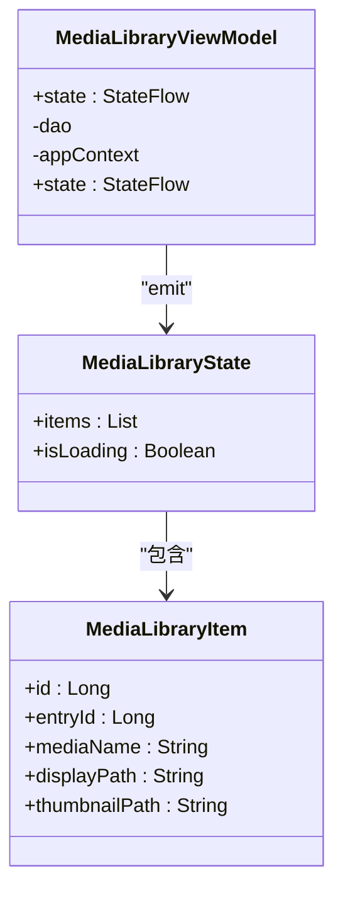
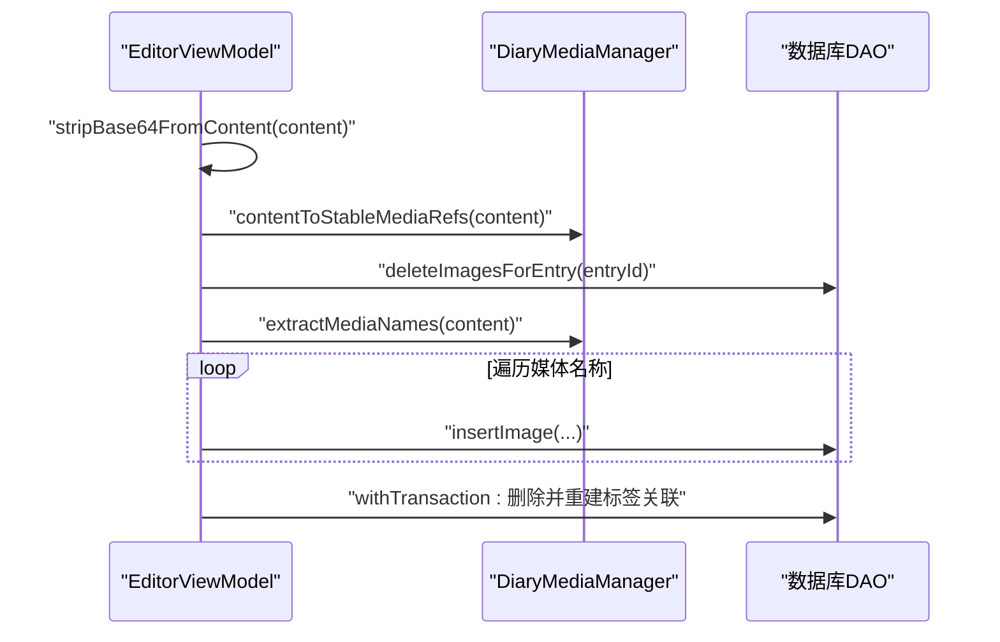
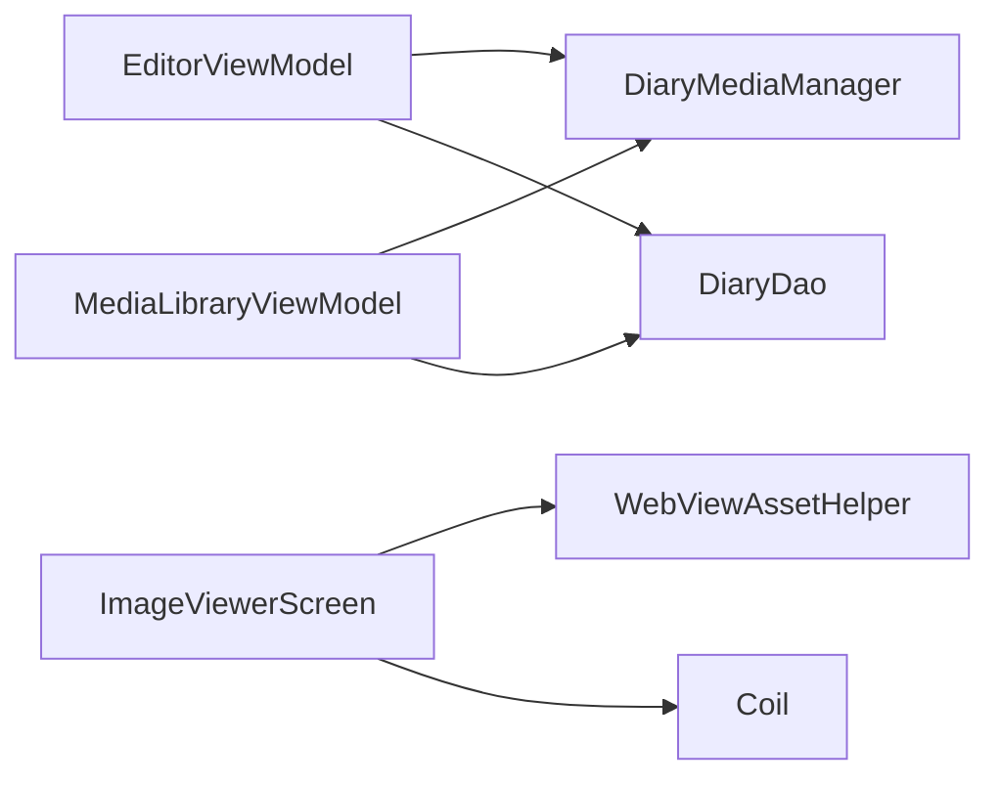

# 内存管理

<cite>
**本文引用的文件**
- [DiaryMediaManager.kt](file://app/src/main/java/com/diary/app/data/DiaryMediaManager.kt)
- [WebViewAssetHelper.kt](file://app/src/main/java/com/diary/app/ui/components/WebViewAssetHelper.kt)
- [MediaLibraryViewModel.kt](file://app/src/main/java/com/diary/app/ui/media/MediaLibraryViewModel.kt)
- [MediaLibraryModels.kt](file://app/src/main/java/com/diary/app/ui/media/MediaLibraryModels.kt)
- [DiaryDetailViewModel.kt](file://app/src/main/java/com/diary/app/ui/detail/DiaryDetailViewModel.kt)
- [EditorViewModel.kt](file://app/src/main/java/com/diary/app/ui/editor/EditorViewModel.kt)
- [ImageViewerScreen.kt](file://app/src/main/java/com/diary/app/ui/detail/ImageViewerScreen.kt)
- [DiaryImage.kt](file://app/src/main/java/com/diary/app/data/DiaryImage.kt)
- [DiaryMediaManagerTest.kt](file://app/src/test/java/com/diary/app/data/DiaryMediaManagerTest.kt)
- [build.gradle.kts](file://app/build.gradle.kts)
</cite>

## 目录
1. [简介](#简介)
2. [项目结构](#项目结构)
3. [核心组件](#核心组件)
4. [架构总览](#架构总览)
5. [详细组件分析](#详细组件分析)
6. [依赖关系分析](#依赖关系分析)
7. [性能考量](#性能考量)
8. [故障排查指南](#故障排查指南)
9. [结论](#结论)
10. [附录](#附录)

## 简介
本文件聚焦于DiaryApp的内存管理优化，围绕Android内存管理与Kotlin内存模型在应用中的落地实践展开，重点覆盖图片加载与缓存的内存优化策略（含MediaLibrary中的图片处理与回收）、ViewModel生命周期管理与内存泄漏预防、以及内存使用监控与泄漏检测方法。文档同时提供可直接定位到源码位置的参考路径与最佳实践建议。

## 项目结构
与内存管理密切相关的模块主要分布在以下包与文件：
- 数据层：DiaryMediaManager（图片导入、采样、缩放、磁盘落盘与回收）、DiaryImage（数据库实体）
- UI组件层：WebViewAssetHelper（WebView本地资源映射）、ImageViewerScreen（图片查看与Coil加载）
- ViewModel层：MediaLibraryViewModel（媒体库状态流）、DiaryDetailViewModel（详情页加载与Base64剥离）、EditorViewModel（编辑保存与媒体同步）
- 测试与构建：DiaryMediaManagerTest（图片采样与引用归一化测试）、build.gradle.kts（启用混淆与资源收缩）

图表来源
- [DiaryMediaManager.kt:110-158](file://app/src/main/java/com/diary/app/data/DiaryMediaManager.kt#L110-L158)
- [WebViewAssetHelper.kt:20-35](file://app/src/main/java/com/diary/app/ui/components/WebViewAssetHelper.kt#L20-L35)
- [MediaLibraryViewModel.kt:19-44](file://app/src/main/java/com/diary/app/ui/media/MediaLibraryViewModel.kt#L19-L44)
- [DiaryDetailViewModel.kt:35-96](file://app/src/main/java/com/diary/app/ui/detail/DiaryDetailViewModel.kt#L35-L96)
- [EditorViewModel.kt:297-399](file://app/src/main/java/com/diary/app/ui/editor/EditorViewModel.kt#L297-L399)
- [ImageViewerScreen.kt:178-232](file://app/src/main/java/com/diary/app/ui/detail/ImageViewerScreen.kt#L178-L232)
- [DiaryImage.kt:8-31](file://app/src/main/java/com/diary/app/data/DiaryImage.kt#L8-L31)
- [DiaryMediaManagerTest.kt:30-34](file://app/src/test/java/com/diary/app/data/DiaryMediaManagerTest.kt#L30-L34)
- [build.gradle.kts:44-50](file://app/build.gradle.kts#L44-L50)

章节来源
- [build.gradle.kts:14-87](file://app/build.gradle.kts#L14-L87)

## 核心组件
- 图片导入与内存优化：DiaryMediaManager负责读取输入流、计算采样率、解码、按需缩放、落盘存储，并在finally块中显式回收中间Bitmap，避免OOM。
- WebView资源映射：WebViewAssetHelper将内部存储的diary_media目录映射为https://appassets/diary_media/，解决跨目录file://访问限制，配合ImageViewerScreen通过Coil加载本地路径。
- 媒体库状态流：MediaLibraryViewModel使用combine与stateIn(viewModelScope, WhileSubscribed)管理订阅生命周期，避免无界持有导致的泄漏。
- 编辑器保存与媒体同步：EditorViewModel在保存前剥离content中的data:image/... Base64片段，调用DiaryMediaManager进行引用归一化，并同步数据库中的媒体条目。
- 详情页加载与安全：DiaryDetailViewModel在加载时剥离Base64以防止OOM，捕获异常并设置错误状态，保障UI稳定性。

章节来源
- [DiaryMediaManager.kt:93-158](file://app/src/main/java/com/diary/app/data/DiaryMediaManager.kt#L93-L158)
- [WebViewAssetHelper.kt:15-35](file://app/src/main/java/com/diary/app/ui/components/WebViewAssetHelper.kt#L15-L35)
- [MediaLibraryViewModel.kt:19-44](file://app/src/main/java/com/diary/app/ui/media/MediaLibraryViewModel.kt#L19-L44)
- [EditorViewModel.kt:297-399](file://app/src/main/java/com/diary/app/ui/editor/EditorViewModel.kt#L297-L399)
- [DiaryDetailViewModel.kt:35-96](file://app/src/main/java/com/diary/app/ui/detail/DiaryDetailViewModel.kt#L35-L96)

## 架构总览
下图展示从编辑器保存到媒体库展示的关键流程，强调内存优化节点（采样、回收、引用归一化、状态流生命周期）：

图表来源
- [EditorViewModel.kt:297-399](file://app/src/main/java/com/diary/app/ui/editor/EditorViewModel.kt#L297-L399)
- [DiaryMediaManager.kt:67-91](file://app/src/main/java/com/diary/app/data/DiaryMediaManager.kt#L67-L91)
- [MediaLibraryViewModel.kt:23-43](file://app/src/main/java/com/diary/app/ui/media/MediaLibraryViewModel.kt#L23-L43)

## 详细组件分析

### 组件A：DiaryMediaManager（图片导入与内存回收）
- 关键点
  - 输入流一次性读取，避免某些content:// URI重复打开失败
  - 两次BitmapFactory解码：先边界探测，再按采样率解码，控制内存峰值
  - 按需缩放至最大边长，减少像素量
  - 落盘后在finally中显式recycle中间Bitmap，释放原生内存
  - 引用归一化：将https://appassets/diary_media/等URL转换为稳定媒体引用diary-media://...
- 复杂度与性能
  - 采样率计算采用指数增长策略，时间复杂度O(log N)，空间复杂度受Bitmap尺寸影响
  - 回收策略确保中间大对象及时释放，避免长时间驻留堆内存

图表来源
- [DiaryMediaManager.kt:110-158](file://app/src/main/java/com/diary/app/data/DiaryMediaManager.kt#L110-L158)

章节来源
- [DiaryMediaManager.kt:93-158](file://app/src/main/java/com/diary/app/data/DiaryMediaManager.kt#L93-L158)

### 组件B：WebViewAssetHelper与ImageViewerScreen（图片加载与展示）
- 关键点
  - WebViewAssetHelper创建WebViewAssetLoader，将diary_media目录映射为https://appassets/diary_media/
  - ImageViewerScreen将https://appassets/ URL还原为本地绝对路径，交由Coil加载，支持手势缩放
  - 通过Coil的采样与缓存策略，结合本地路径直连，降低内存压力
- 与内存的关系
  - 通过本地文件路径加载而非Base64内联，避免UI层额外复制与解码开销
  - WebView资源拦截与映射减少跨域与权限问题带来的异常与重试

图表来源
- [WebViewAssetHelper.kt:37-54](file://app/src/main/java/com/diary/app/ui/components/WebViewAssetHelper.kt#L37-L54)
- [ImageViewerScreen.kt:188-230](file://app/src/main/java/com/diary/app/ui/detail/ImageViewerScreen.kt#L188-L230)

章节来源
- [WebViewAssetHelper.kt:15-68](file://app/src/main/java/com/diary/app/ui/components/WebViewAssetHelper.kt#L15-L68)
- [ImageViewerScreen.kt:178-232](file://app/src/main/java/com/diary/app/ui/detail/ImageViewerScreen.kt#L178-L232)

### 组件C：MediaLibraryViewModel（状态流与生命周期）
- 关键点
  - 使用combine合并图片与预览数据，构建MediaLibraryItem列表
  - stateIn(viewModelScope, WhileSubscribed(5000), ...)确保订阅在5秒无观察者时自动停止，避免泄漏
  - 通过resolveDisplayPath/resolveThumbPath延迟解析路径，减少不必要的IO
- 内存与生命周期
  - WhileSubscribed策略在UI不可见时停止上游流，降低持续IO与内存占用
  - 列表排序与去重在主线程执行，注意避免在高频更新场景下造成卡顿

图表来源
- [MediaLibraryViewModel.kt:14-44](file://app/src/main/java/com/diary/app/ui/media/MediaLibraryViewModel.kt#L14-L44)
- [MediaLibraryModels.kt:6-49](file://app/src/main/java/com/diary/app/ui/media/MediaLibraryModels.kt#L6-L49)

章节来源
- [MediaLibraryViewModel.kt:19-44](file://app/src/main/java/com/diary/app/ui/media/MediaLibraryViewModel.kt#L19-L44)
- [MediaLibraryModels.kt:20-49](file://app/src/main/java/com/diary/app/ui/media/MediaLibraryModels.kt#L20-L49)

### 组件D：EditorViewModel（保存流程与媒体同步）
- 关键点
  - 在保存前剥离content中的data:image/... Base64，调用contentToStableMediaRefs归一化为diary-media://引用
  - 通过syncEntryImages删除旧媒体关联并重建，保证数据库一致性
  - 使用withTransaction原子性写入标签关联，避免部分写入导致的数据不一致
- 内存与性能
  - 剥离Base64避免加载时的内存峰值
  - 仅持久化媒体名称与引用，不存储大对象，降低数据库与UI层内存压力

图表来源
- [EditorViewModel.kt:297-399](file://app/src/main/java/com/diary/app/ui/editor/EditorViewModel.kt#L297-L399)
- [DiaryMediaManager.kt:67-91](file://app/src/main/java/com/diary/app/data/DiaryMediaManager.kt#L67-L91)

章节来源
- [EditorViewModel.kt:297-399](file://app/src/main/java/com/diary/app/ui/editor/EditorViewModel.kt#L297-L399)

### 组件E：DiaryDetailViewModel（加载与Base64剥离）
- 关键点
  - loadEntry中对content进行安全处理，剥离data:image/... Base64片段，替换为空占位，避免加载时OOM
  - 捕获异常并设置loadError，保障UI稳定
- 内存与健壮性
  - 基于字符串扫描的剥离策略保守且可控，避免复杂JSON解析带来的风险

章节来源
- [DiaryDetailViewModel.kt:35-96](file://app/src/main/java/com/diary/app/ui/detail/DiaryDetailViewModel.kt#L35-L96)
- [DiaryDetailViewModel.kt:103-131](file://app/src/main/java/com/diary/app/ui/detail/DiaryDetailViewModel.kt#L103-L131)

## 依赖关系分析
- 组件耦合
  - EditorViewModel强依赖DiaryMediaManager进行媒体引用归一化与提取；MediaLibraryViewModel依赖DiaryMediaManager解析display/thumb路径
  - WebViewAssetHelper与ImageViewerScreen共同支撑图片展示链路，减少跨域与权限问题
- 外部依赖
  - Coil用于图片加载与缓存
  - Room用于媒体元数据持久化
  - WebViewAssetLoader用于WebView本地资源映射

图表来源
- [EditorViewModel.kt:297-399](file://app/src/main/java/com/diary/app/ui/editor/EditorViewModel.kt#L297-L399)
- [MediaLibraryViewModel.kt:23-43](file://app/src/main/java/com/diary/app/ui/media/MediaLibraryViewModel.kt#L23-L43)
- [WebViewAssetHelper.kt:20-35](file://app/src/main/java/com/diary/app/ui/components/WebViewAssetHelper.kt#L20-L35)
- [ImageViewerScreen.kt:178-232](file://app/src/main/java/com/diary/app/ui/detail/ImageViewerScreen.kt#L178-L232)

## 性能考量
- 图片内存优化
  - 采样率与缩放：通过calculateImageSampleSize与scaleBitmapIfNeeded控制解码后像素规模，显著降低Bitmap内存占用
  - 回收策略：在finally中显式recycle中间Bitmap，避免原生内存泄漏
  - 引用归一化：将URL转换为稳定引用，减少冗余存储与解析成本
- ViewModel生命周期
  - 使用viewModelScope与WhileSubscribed策略，确保在UI不可见时停止上游流，降低后台内存占用
- 构建期优化
  - 开启混淆与资源收缩（release），减少APK体积与运行时开销

章节来源
- [DiaryMediaManager.kt:160-182](file://app/src/main/java/com/diary/app/data/DiaryMediaManager.kt#L160-L182)
- [MediaLibraryViewModel.kt:43-43](file://app/src/main/java/com/diary/app/ui/media/MediaLibraryViewModel.kt#L43-L43)
- [build.gradle.kts:44-50](file://app/build.gradle.kts#L44-L50)

## 故障排查指南
- 常见问题与定位
  - 图片OOM：检查是否在加载前剥离了data:image/... Base64；确认采样率与缩放逻辑是否生效
  - WebView无法加载：确认WebViewAssetHelper映射是否正确，URL是否被转换为https://appassets/格式
  - 媒体库空白或错乱：检查MediaLibraryViewModel的路径解析与数据库媒体记录是否一致
- 单元测试辅助
  - 使用DiaryMediaManagerTest验证URL归一化与媒体名称提取的正确性，确保采样逻辑符合预期

章节来源
- [DiaryMediaManagerTest.kt:8-34](file://app/src/test/java/com/diary/app/data/DiaryMediaManagerTest.kt#L8-L34)
- [DiaryDetailViewModel.kt:103-131](file://app/src/main/java/com/diary/app/ui/detail/DiaryDetailViewModel.kt#L103-L131)
- [WebViewAssetHelper.kt:37-54](file://app/src/main/java/com/diary/app/ui/components/WebViewAssetHelper.kt#L37-L54)

## 结论
DiaryApp在图片导入与展示链路上实现了从解码采样、缩放到落盘回收的全链路内存优化；通过ViewModel的状态流生命周期管理与引用归一化策略，有效降低了内存峰值与泄漏风险。建议在后续迭代中进一步完善图片懒加载与缓存淘汰策略，并结合构建期混淆与资源收缩，持续降低内存占用与提升启动性能。

## 附录
- 最佳实践清单
  - 导入图片时使用采样率与缩放，避免超大Bitmap常驻内存
  - 在finally中显式回收Bitmap，释放原生内存
  - 对content中的data:image/... Base64进行剥离与归一化，避免加载时OOM
  - 使用viewModelScope与WhileSubscribed管理订阅生命周期
  - 通过WebViewAssetHelper统一映射本地资源，减少跨域与权限问题
  - 开启混淆与资源收缩，降低APK体积与运行时开销