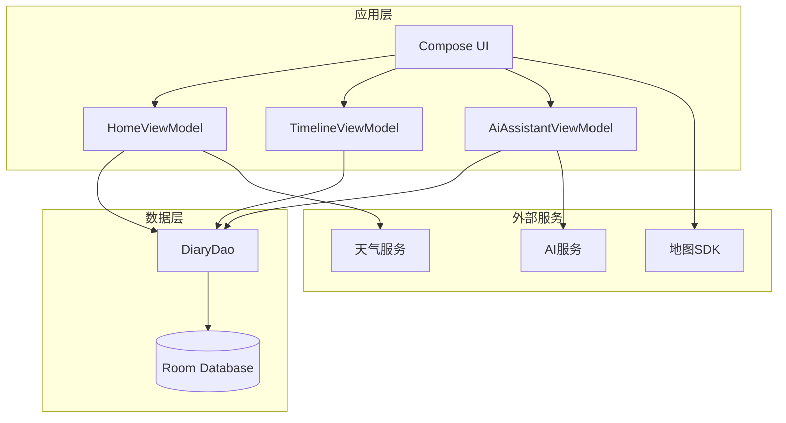
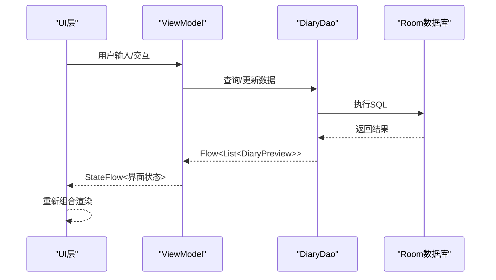
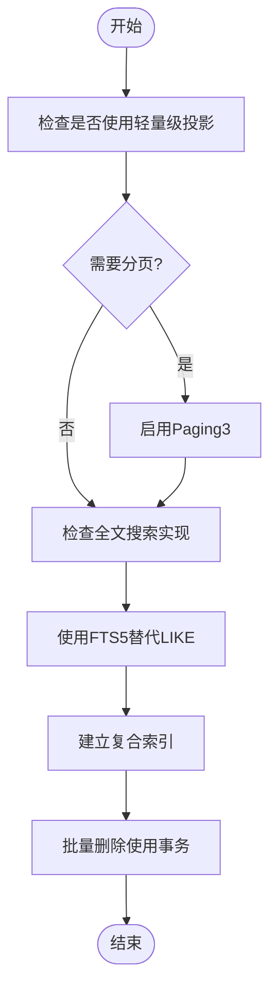
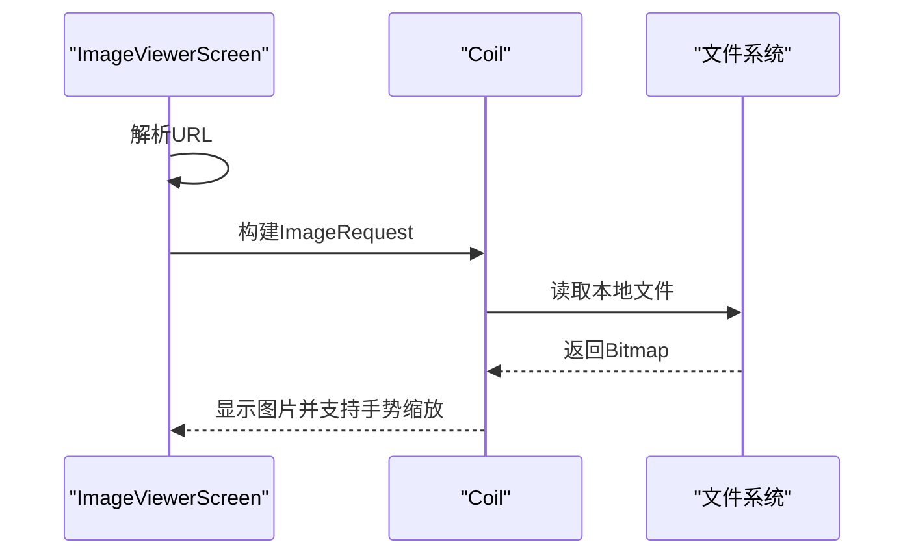
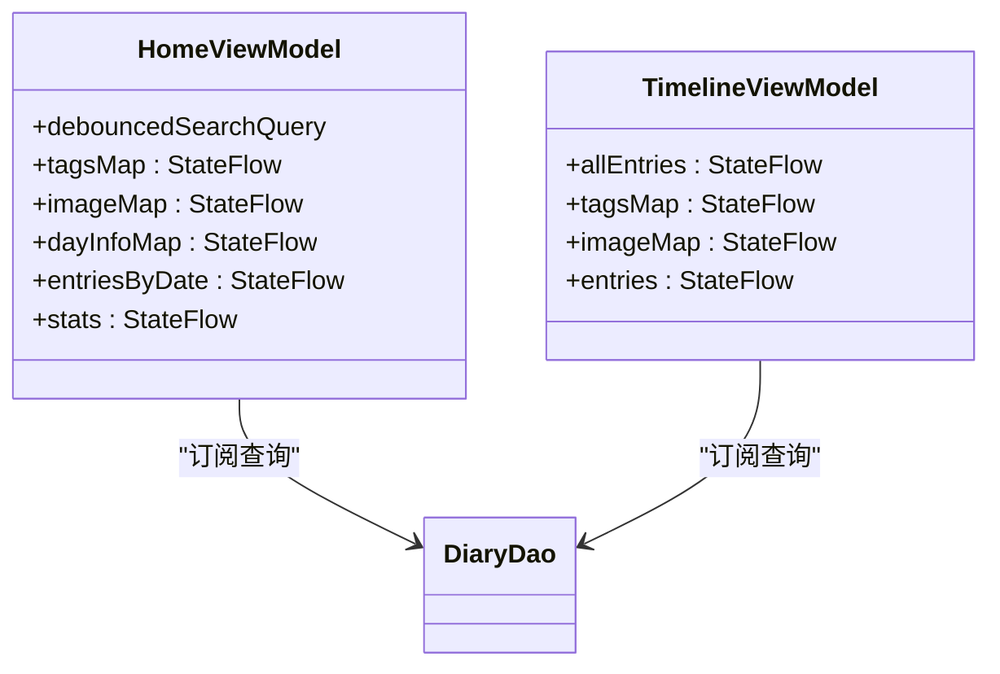
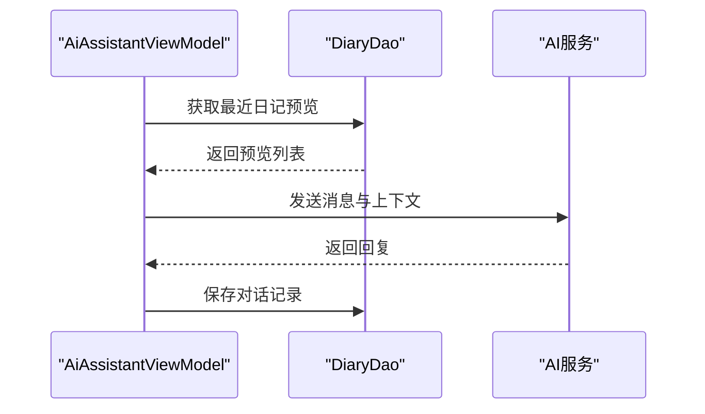
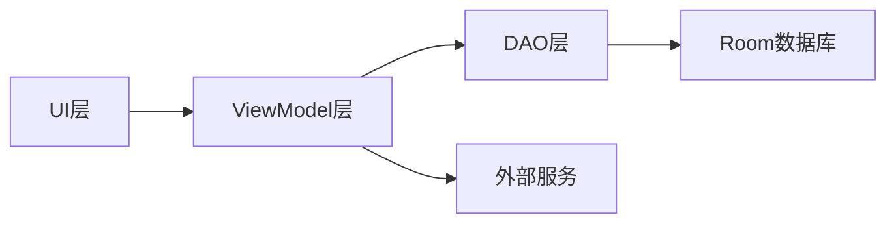

# 性能优化

<cite>
**本文档引用的文件**
- [app/proguard-rules.pro](file://app/proguard-rules.pro)
- [app/build.gradle.kts](file://app/build.gradle.kts)
- [docs/analysis/performance-optimization-guide.html](file://docs/analysis/performance-optimization-guide.html)
- [app/src/main/java/com/diary/app/data/DiaryDao.kt](file://app/src/main/java/com/diary/app/data/DiaryDao.kt)
- [app/src/main/java/com/diary/app/data/DiaryDatabase.kt](file://app/src/main/java/com/diary/app/data/DiaryDatabase.kt)
- [app/src/main/java/com/diary/app/ui/home/HomeViewModel.kt](file://app/src/main/java/com/diary/app/ui/home/HomeViewModel.kt)
- [app/src/main/java/com/diary/app/ui/timeline/TimelineViewModel.kt](file://app/src/main/java/com/diary/app/ui/timeline/TimelineViewModel.kt)
- [app/src/main/java/com/diary/app/ui/detail/ImageViewerScreen.kt](file://app/src/main/java/com/diary/app/ui/detail/ImageViewerScreen.kt)
- [app/src/main/java/com/diary/app/ai/AiAssistantViewModel.kt](file://app/src/main/java/com/diary/app/ai/AiAssistantViewModel.kt)
- [app/src/test/java/com/diary/app/startup/StartupPerformanceSourceTest.kt](file://app/src/test/java/com/diary/app/startup/StartupPerformanceSourceTest.kt)
</cite>

## 目录
1. [简介](#简介)
2. [项目结构](#项目结构)
3. [核心组件](#核心组件)
4. [架构概览](#架构概览)
5. [详细组件分析](#详细组件分析)
6. [依赖分析](#依赖分析)
7. [性能考虑](#性能考虑)
8. [故障排除指南](#故障排除指南)
9. [结论](#结论)
10. [附录](#附录)

## 简介
本文件面向DiaryApp的性能优化，系统性阐述应用的性能监控与分析方法，涵盖内存使用、CPU消耗与网络请求的优化策略。文档同时解析代码混淆与优化配置（ProGuard规则）的作用与效果，介绍数据库查询优化、图片加载优化与UI渲染优化的具体实现，并提供性能基准测试方法、工具与诊断流程，以及用户体验优化最佳实践。

## 项目结构
DiaryApp采用模块化架构，核心模块包括：
- 数据层：Room数据库与DAO接口，负责持久化与查询优化
- 视图模型层：HomeViewModel、TimelineViewModel等，负责状态管理与数据聚合
- UI层：Jetpack Compose界面，支持图片查看器与交互控件
- AI服务层：AI助手功能，涉及网络请求与上下文构建
- 构建与混淆：Gradle配置与ProGuard规则，保障发布包体积与运行效率

**图表来源**
- [app/src/main/java/com/diary/app/ui/home/HomeViewModel.kt:81-399](file://app/src/main/java/com/diary/app/ui/home/HomeViewModel.kt#L81-L399)
- [app/src/main/java/com/diary/app/ui/timeline/TimelineViewModel.kt:32-190](file://app/src/main/java/com/diary/app/ui/timeline/TimelineViewModel.kt#L32-L190)
- [app/src/main/java/com/diary/app/ai/AiAssistantViewModel.kt:33-364](file://app/src/main/java/com/diary/app/ai/AiAssistantViewModel.kt#L33-L364)
- [app/src/main/java/com/diary/app/data/DiaryDao.kt:12-628](file://app/src/main/java/com/diary/app/data/DiaryDao.kt#L12-L628)
- [app/src/main/java/com/diary/app/data/DiaryDatabase.kt:10-829](file://app/src/main/java/com/diary/app/data/DiaryDatabase.kt#L10-L829)

**章节来源**
- [app/build.gradle.kts:14-87](file://app/build.gradle.kts#L14-L87)
- [app/src/main/java/com/diary/app/data/DiaryDatabase.kt:10-829](file://app/src/main/java/com/diary/app/data/DiaryDatabase.kt#L10-L829)

## 核心组件
- 数据访问层（DAO）：提供轻量级投影（不包含大字段content）以避免OOM，支持分页与全文检索（FTS5）优化
- 视图模型层（ViewModel）：通过Flow组合与debounce降低CPU占用，使用stateIn进行生命周期感知的状态管理
- 图片加载层（Coil）：异步加载与跨fade过渡，支持手势缩放与本地文件路径转换
- AI服务层：网络请求与上下文构建，包含超时处理与令牌统计
- 构建与混淆：启用代码压缩与资源收缩，保留必要类与注解信息

**章节来源**
- [app/src/main/java/com/diary/app/data/DiaryDao.kt:17-135](file://app/src/main/java/com/diary/app/data/DiaryDao.kt#L17-L135)
- [app/src/main/java/com/diary/app/ui/home/HomeViewModel.kt:87-245](file://app/src/main/java/com/diary/app/ui/home/HomeViewModel.kt#L87-L245)
- [app/src/main/java/com/diary/app/ui/detail/ImageViewerScreen.kt:178-232](file://app/src/main/java/com/diary/app/ui/detail/ImageViewerScreen.kt#L178-L232)
- [app/src/main/java/com/diary/app/ai/AiAssistantViewModel.kt:128-226](file://app/src/main/java/com/diary/app/ai/AiAssistantViewModel.kt#L128-L226)
- [app/proguard-rules.pro:1-31](file://app/proguard-rules.pro#L1-L31)

## 架构概览
应用采用MVVM架构，数据流自下而上：DAO → ViewModel → UI。UI层通过Compose声明式渲染，ViewModel使用Kotlin Flow进行响应式数据更新，DAO提供高效查询接口与索引支持。

**图表来源**
- [app/src/main/java/com/diary/app/ui/home/HomeViewModel.kt:156-180](file://app/src/main/java/com/diary/app/ui/home/HomeViewModel.kt#L156-L180)
- [app/src/main/java/com/diary/app/data/DiaryDao.kt:17-196](file://app/src/main/java/com/diary/app/data/DiaryDao.kt#L17-L196)

## 详细组件分析

### 数据库查询优化
- 轻量级投影：使用不包含大字段content的投影（DiaryPreview），避免全量加载导致的内存压力
- 分页与并发：建议引入Paging3进行分页加载，减少一次性全量数据带来的内存峰值
- 全文检索：将LIKE全表扫描替换为FTS5虚拟表，提升搜索性能
- 索引优化：针对常用查询条件建立复合索引，避免函数包裹导致索引失效
- 批量事务：批量删除操作使用@Transaction包装，减少事务开销

**图表来源**
- [app/src/main/java/com/diary/app/data/DiaryDao.kt:17-135](file://app/src/main/java/com/diary/app/data/DiaryDao.kt#L17-L135)
- [docs/analysis/performance-optimization-guide.html:103-210](file://docs/analysis/performance-optimization-guide.html#L103-L210)

**章节来源**
- [app/src/main/java/com/diary/app/data/DiaryDao.kt:17-135](file://app/src/main/java/com/diary/app/data/DiaryDao.kt#L17-L135)
- [docs/analysis/performance-optimization-guide.html:103-210](file://docs/analysis/performance-optimization-guide.html#L103-L210)

### 图片加载优化
- 异步加载：使用Coil进行异步图片加载，支持跨fade过渡，避免主线程阻塞
- 本地路径转换：将https://appassets/ URL转换为本地文件路径，提高加载速度
- 手势缩放：支持双指缩放与拖动，提升用户体验
- 缓存策略：利用Coil内置缓存机制，减少重复加载

**图表来源**
- [app/src/main/java/com/diary/app/ui/detail/ImageViewerScreen.kt:178-232](file://app/src/main/java/com/diary/app/ui/detail/ImageViewerScreen.kt#L178-L232)

**章节来源**
- [app/src/main/java/com/diary/app/ui/detail/ImageViewerScreen.kt:178-232](file://app/src/main/java/com/diary/app/ui/detail/ImageViewerScreen.kt#L178-L232)

### UI渲染优化
- 声明式渲染：使用Jetpack Compose进行声明式UI渲染，减少手动视图更新
- 状态管理：通过stateIn与SharingStarted控制状态生命周期，避免重复计算
- debounce搜索：对搜索输入添加debounce，降低频繁过滤带来的CPU消耗
- 组合优化：合并多个Flow的计算，避免多次全量遍历

**图表来源**
- [app/src/main/java/com/diary/app/ui/home/HomeViewModel.kt:87-245](file://app/src/main/java/com/diary/app/ui/home/HomeViewModel.kt#L87-L245)
- [app/src/main/java/com/diary/app/ui/timeline/TimelineViewModel.kt:38-108](file://app/src/main/java/com/diary/app/ui/timeline/TimelineViewModel.kt#L38-L108)

**章节来源**
- [app/src/main/java/com/diary/app/ui/home/HomeViewModel.kt:87-245](file://app/src/main/java/com/diary/app/ui/home/HomeViewModel.kt#L87-L245)
- [app/src/main/java/com/diary/app/ui/timeline/TimelineViewModel.kt:38-108](file://app/src/main/java/com/diary/app/ui/timeline/TimelineViewModel.kt#L38-L108)

### 网络请求优化
- 超时处理：对AI服务请求设置合理的超时时间，避免长时间等待
- 上下文构建：从最近日记中提取上下文，减少无关信息传输
- 令牌统计：记录每次请求的token使用量，便于成本控制与性能评估
- 缓存策略：合理使用缓存，减少重复请求

**图表来源**
- [app/src/main/java/com/diary/app/ai/AiAssistantViewModel.kt:128-226](file://app/src/main/java/com/diary/app/ai/AiAssistantViewModel.kt#L128-L226)

**章节来源**
- [app/src/main/java/com/diary/app/ai/AiAssistantViewModel.kt:128-226](file://app/src/main/java/com/diary/app/ai/AiAssistantViewModel.kt#L128-L226)

### 代码混淆与优化配置
- ProGuard规则：保留必要的类与注解，确保Room、Gson与第三方SDK正常工作
- 构建配置：启用代码压缩与资源收缩，减小APK体积
- 版本维度：通过productFlavors区分稳定版与实验版，便于A/B测试与性能对比

**章节来源**
- [app/proguard-rules.pro:1-31](file://app/proguard-rules.pro#L1-L31)
- [app/build.gradle.kts:42-52](file://app/build.gradle.kts#L42-L52)

## 依赖分析
应用依赖关系清晰，各层职责明确：
- UI层依赖ViewModel层，ViewModel层依赖DAO层
- DAO层依赖Room数据库，提供高效查询接口
- ViewModel层可选依赖外部服务（天气、AI、地图）

**图表来源**
- [app/src/main/java/com/diary/app/ui/home/HomeViewModel.kt:81-399](file://app/src/main/java/com/diary/app/ui/home/HomeViewModel.kt#L81-L399)
- [app/src/main/java/com/diary/app/data/DiaryDao.kt:12-628](file://app/src/main/java/com/diary/app/data/DiaryDao.kt#L12-L628)

**章节来源**
- [app/src/main/java/com/diary/app/ui/home/HomeViewModel.kt:81-399](file://app/src/main/java/com/diary/app/ui/home/HomeViewModel.kt#L81-L399)
- [app/src/main/java/com/diary/app/data/DiaryDao.kt:12-628](file://app/src/main/java/com/diary/app/data/DiaryDao.kt#L12-L628)

## 性能考虑
- 内存使用：优先使用轻量级投影，避免一次性加载全量数据；对图片使用合适的尺寸与缓存策略
- CPU消耗：对高频操作（如搜索）添加debounce；合并多个Flow的计算，减少重复遍历
- 网络请求：设置合理的超时与重试策略；最小化请求负载，避免不必要的数据传输
- 启动性能：避免在主线程初始化数据库与其他重任务；使用启动门控与加载界面

**章节来源**
- [docs/analysis/performance-optimization-guide.html:214-307](file://docs/analysis/performance-optimization-guide.html#L214-L307)
- [app/src/test/java/com/diary/app/startup/StartupPerformanceSourceTest.kt:10-27](file://app/src/test/java/com/diary/app/startup/StartupPerformanceSourceTest.kt#L10-L27)

## 故障排除指南
- 数据库启动异常：检查迁移脚本与索引创建逻辑，确保在onOpen回调中不进行破坏性操作
- 搜索性能问题：确认是否使用FTS5替代LIKE；检查是否有未使用的索引
- 图片加载失败：验证URL转换逻辑与文件路径权限
- AI请求超时：检查网络配置与超时参数，增加重试与降级策略

**章节来源**
- [app/src/main/java/com/diary/app/data/DiaryDatabase.kt:724-734](file://app/src/main/java/com/diary/app/data/DiaryDatabase.kt#L724-L734)
- [app/src/main/java/com/diary/app/ai/AiAssistantViewModel.kt:201-213](file://app/src/main/java/com/diary/app/ai/AiAssistantViewModel.kt#L201-L213)

## 结论
DiaryApp在性能方面已具备良好的基础：轻量级投影、Flow状态管理、Coil图片加载与合理的构建配置。为进一步提升性能，建议引入Paging3分页、FTS5全文检索与复合索引，优化debounce与并发查询，并完善启动阶段的性能监控与诊断流程。

## 附录
- 性能基准测试方法：使用Android Studio Profiler监控CPU、内存与网络；结合单元测试验证关键路径性能
- 诊断流程：通过日志与异常捕获定位问题，结合覆盖率报告与性能测试结果持续改进