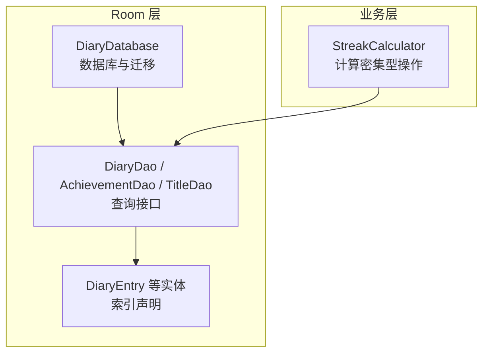
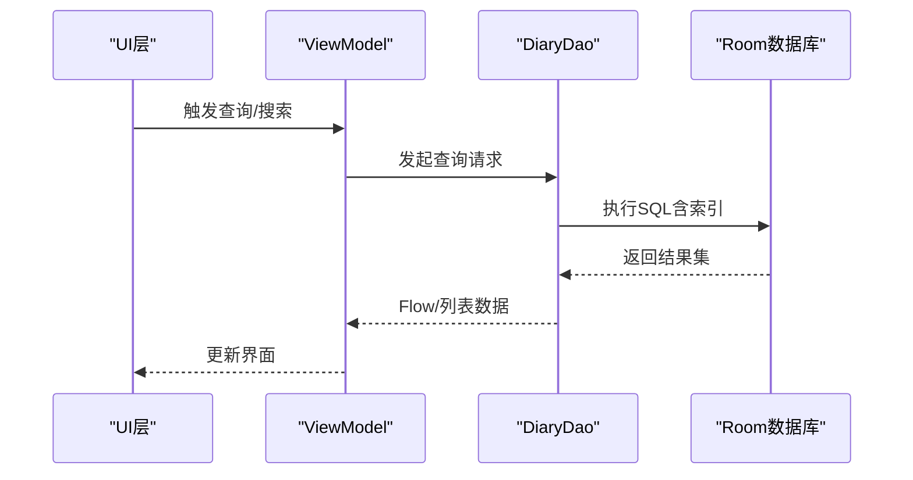
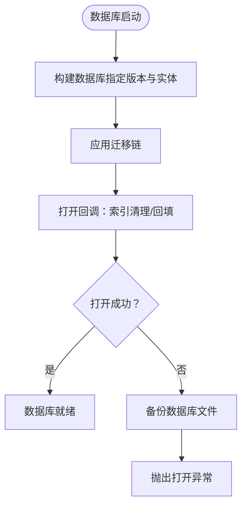
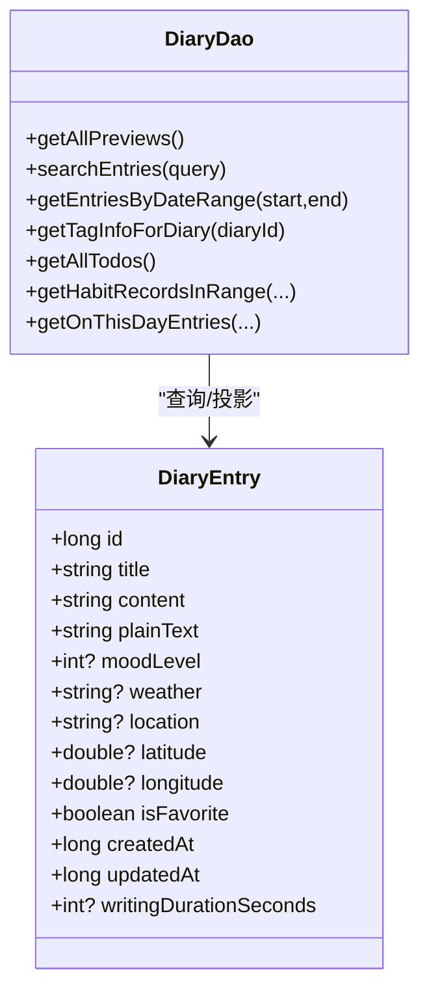
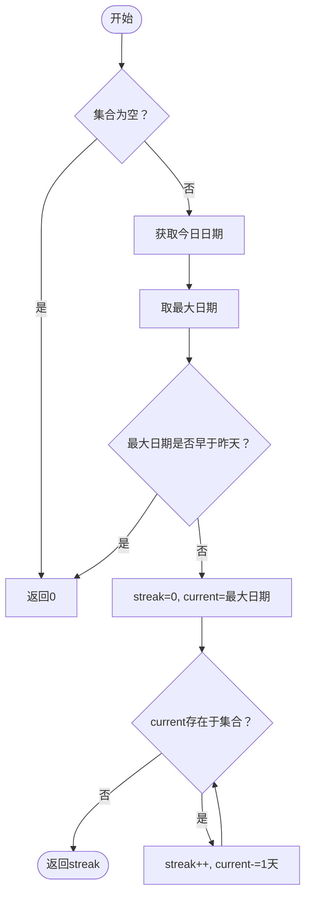
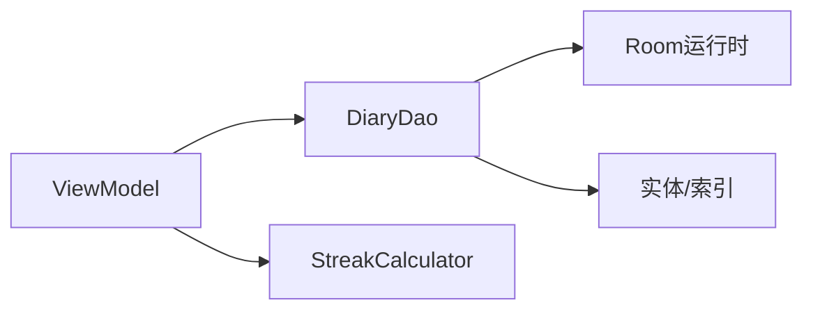

# 数据库优化

<cite>
**本文引用的文件**
- [DiaryDatabase.kt](file://app/src/main/java/com/diary/app/data/DiaryDatabase.kt)
- [DiaryDao.kt](file://app/src/main/java/com/diary/app/data/DiaryDao.kt)
- [DiaryEntry.kt](file://app/src/main/java/com/diary/app/data/DiaryEntry.kt)
- [AchievementDao.kt](file://app/src/main/java/com/diary/app/data/AchievementDao.kt)
- [TitleDao.kt](file://app/src/main/java/com/diary/app/data/TitleDao.kt)
- [StreakCalculator.kt](file://app/src/main/java/com/diary/app/util/StreakCalculator.kt)
- [performance-optimization-guide.html](file://docs/analysis/performance-optimization-guide.html)
- [performance-optimization-preview.html](file://docs/previews/performance-optimization-preview.html)
</cite>

## 目录
1. [简介](#简介)
2. [项目结构](#项目结构)
3. [核心组件](#核心组件)
4. [架构概览](#架构概览)
5. [详细组件分析](#详细组件分析)
6. [依赖分析](#依赖分析)
7. [性能考量](#性能考量)
8. [故障排查指南](#故障排查指南)
9. [结论](#结论)
10. [附录](#附录)

## 简介
本文件聚焦于DiaryApp的数据库性能优化，围绕Room数据库的查询优化策略、索引设计、查询语句优化、批量操作实现展开；同时涵盖StreakCalculator等计算密集型操作的优化方法（缓存与延迟计算）、数据库连接池与事务优化、数据迁移性能提升，以及数据库性能监控与常见问题诊断。

## 项目结构
DiaryApp采用Room作为本地持久化层，核心文件组织如下：
- 数据库与迁移：DiaryDatabase.kt集中定义数据库版本、实体集合、迁移链与数据库构建逻辑
- DAO接口：DiaryDao.kt、AchievementDao.kt、TitleDao.kt定义各类查询与事务操作
- 实体模型：DiaryEntry.kt等实体声明索引以支撑查询性能
- 计算工具：StreakCalculator.kt提供连续写作天数计算的高效实现
- 文档参考：performance-optimization-guide.html与performance-optimization-preview.html提供了优化建议与现状对比

图表来源
- [DiaryDatabase.kt:10-14](file://app/src/main/java/com/diary/app/data/DiaryDatabase.kt#L10-L14)
- [DiaryDao.kt:12-665](file://app/src/main/java/com/diary/app/data/DiaryDao.kt#L12-L665)
- [DiaryEntry.kt:8-15](file://app/src/main/java/com/diary/app/data/DiaryEntry.kt#L8-L15)
- [StreakCalculator.kt:13-26](file://app/src/main/java/com/diary/app/util/StreakCalculator.kt#L13-L26)

章节来源
- [DiaryDatabase.kt:10-14](file://app/src/main/java/com/diary/app/data/DiaryDatabase.kt#L10-L14)
- [DiaryDao.kt:12-665](file://app/src/main/java/com/diary/app/data/DiaryDao.kt#L12-L665)
- [DiaryEntry.kt:8-15](file://app/src/main/java/com/diary/app/data/DiaryEntry.kt#L8-L15)
- [StreakCalculator.kt:13-26](file://app/src/main/java/com/diary/app/util/StreakCalculator.kt#L13-L26)

## 核心组件
- 数据库与迁移：集中管理数据库版本、实体集合、迁移链与数据库构建逻辑，包含大量迁移脚本与回调处理
- DAO接口：提供全文检索、日期范围查询、标签关联查询、待办与习惯记录查询、通知与聊天消息查询等
- 实体模型：DiaryEntry等实体通过索引声明支持高频查询场景
- 计算工具：StreakCalculator提供O(n)连续天数计算，避免重复扫描数据库

章节来源
- [DiaryDatabase.kt:712-771](file://app/src/main/java/com/diary/app/data/DiaryDatabase.kt#L712-L771)
- [DiaryDao.kt:12-665](file://app/src/main/java/com/diary/app/data/DiaryDao.kt#L12-L665)
- [DiaryEntry.kt:8-15](file://app/src/main/java/com/diary/app/data/DiaryEntry.kt#L8-L15)
- [StreakCalculator.kt:13-26](file://app/src/main/java/com/diary/app/util/StreakCalculator.kt#L13-L26)

## 架构概览
Room数据库通过DAO接口向UI层提供数据流，结合索引与查询优化降低数据库压力；迁移链确保schema演进与数据完整性；计算密集型操作通过StreakCalculator在内存中高效完成，减少数据库访问。

图表来源
- [DiaryDao.kt:14-19](file://app/src/main/java/com/diary/app/data/DiaryDao.kt#L14-L19)
- [DiaryDao.kt:116-126](file://app/src/main/java/com/diary/app/data/DiaryDao.kt#L116-L126)

## 详细组件分析

### Room数据库与迁移优化
- 版本与实体：数据库版本为32，实体集合覆盖日记、标签、待办、习惯、回收站、倒数日、时光胶囊、通知、聊天消息、成就、称号等
- 迁移链：包含多个版本迁移脚本，涵盖索引创建、列添加、表重建与数据填充等
- 回调处理：数据库打开回调中包含索引清理与回填逻辑，增强启动阶段的兼容性
- 错误处理：数据库打开失败时自动备份文件并抛出异常，保障数据安全

图表来源
- [DiaryDatabase.kt:712-771](file://app/src/main/java/com/diary/app/data/DiaryDatabase.kt#L712-L771)
- [DiaryDatabase.kt:724-734](file://app/src/main/java/com/diary/app/data/DiaryDatabase.kt#L724-L734)
- [DiaryDatabase.kt:744-767](file://app/src/main/java/com/diary/app/data/DiaryDatabase.kt#L744-L767)

章节来源
- [DiaryDatabase.kt:10-14](file://app/src/main/java/com/diary/app/data/DiaryDatabase.kt#L10-L14)
- [DiaryDatabase.kt:712-771](file://app/src/main/java/com/diary/app/data/DiaryDatabase.kt#L712-L771)
- [DiaryDatabase.kt:724-734](file://app/src/main/java/com/diary/app/data/DiaryDatabase.kt#L724-L734)
- [DiaryDatabase.kt:744-767](file://app/src/main/java/com/diary/app/data/DiaryDatabase.kt#L744-L767)

### 索引设计与查询优化
- 实体索引：DiaryEntry声明createdAt、isFavorite、moodLevel索引，支撑常用排序与过滤
- DAO查询：提供全文搜索、日期范围查询、标签关联查询、待办与习惯记录查询等
- 性能建议：文档指出LIKE全表扫描、strftime阻止索引使用、缺少复合索引等问题，并给出FTS5、预计算列与Paging3等优化方案

图表来源
- [DiaryEntry.kt:8-15](file://app/src/main/java/com/diary/app/data/DiaryEntry.kt#L8-L15)
- [DiaryDao.kt:14-19](file://app/src/main/java/com/diary/app/data/DiaryDao.kt#L14-L19)
- [DiaryDao.kt:116-126](file://app/src/main/java/com/diary/app/data/DiaryDao.kt#L116-L126)
- [DiaryDao.kt:396-403](file://app/src/main/java/com/diary/app/data/DiaryDao.kt#L396-L403)
- [DiaryDao.kt:162-171](file://app/src/main/java/com/diary/app/data/DiaryDao.kt#L162-L171)
- [DiaryDao.kt:265-287](file://app/src/main/java/com/diary/app/data/DiaryDao.kt#L265-L287)
- [DiaryDao.kt:342-352](file://app/src/main/java/com/diary/app/data/DiaryDao.kt#L342-L352)
- [DiaryDao.kt:375-393](file://app/src/main/java/com/diary/app/data/DiaryDao.kt#L375-L393)

章节来源
- [DiaryEntry.kt:8-15](file://app/src/main/java/com/diary/app/data/DiaryEntry.kt#L8-L15)
- [DiaryDao.kt:14-19](file://app/src/main/java/com/diary/app/data/DiaryDao.kt#L14-L19)
- [DiaryDao.kt:116-126](file://app/src/main/java/com/diary/app/data/DiaryDao.kt#L116-L126)
- [DiaryDao.kt:396-403](file://app/src/main/java/com/diary/app/data/DiaryDao.kt#L396-L403)
- [DiaryDao.kt:162-171](file://app/src/main/java/com/diary/app/data/DiaryDao.kt#L162-L171)
- [DiaryDao.kt:265-287](file://app/src/main/java/com/diary/app/data/DiaryDao.kt#L265-L287)
- [DiaryDao.kt:342-352](file://app/src/main/java/com/diary/app/data/DiaryDao.kt#L342-L352)
- [DiaryDao.kt:375-393](file://app/src/main/java/com/diary/app/data/DiaryDao.kt#L375-L393)

### 查询语句优化策略
- 避免全表扫描：全文搜索使用FTS5替代LIKE模糊匹配，显著降低查询复杂度
- 预计算列：对日期字段进行预计算（如createdMonthDay），避免在WHERE中使用函数导致索引失效
- 复合索引：针对高频查询组合（如日期+状态+主键）建立复合索引，提升排序与过滤效率
- 分页加载：引入Paging3实现流式加载，降低内存占用与首屏延迟

章节来源
- [performance-optimization-guide.html:140-170](file://docs/analysis/performance-optimization-guide.html#L140-L170)
- [performance-optimization-guide.html:172-200](file://docs/analysis/performance-optimization-guide.html#L172-L200)
- [performance-optimization-preview.html:519-538](file://docs/previews/performance-optimization-preview.html#L519-L538)

### 批量操作与事务优化
- 批量删除：多选删除多条日记时，应使用@Transaction将多个操作合并为单个事务，减少事务开销
- 批量插入：DAO提供批量插入接口，配合事务可进一步提升吞吐
- 事务边界：在ViewModel或Repository层合理划分事务边界，避免长事务阻塞

章节来源
- [performance-optimization-guide.html:372-400](file://docs/analysis/performance-optimization-guide.html#L372-L400)
- [DiaryDao.kt:83-97](file://app/src/main/java/com/diary/app/data/DiaryDao.kt#L83-L97)
- [DiaryDao.kt:99-101](file://app/src/main/java/com/diary/app/data/DiaryDao.kt#L99-L101)

### 计算密集型操作优化：StreakCalculator
- 输入：一组LocalDate集合（代表写作日期）
- 算法：找到最大日期，若大于等于昨天则向前逐日回溯统计连续天数，否则返回0
- 时间复杂度：O(n)，n为输入集合大小；空间复杂度：O(1)
- 优化要点：该计算在内存中完成，避免频繁访问数据库；可结合缓存策略在短期内复用结果

图表来源
- [StreakCalculator.kt:13-26](file://app/src/main/java/com/diary/app/util/StreakCalculator.kt#L13-L26)

章节来源
- [StreakCalculator.kt:13-26](file://app/src/main/java/com/diary/app/util/StreakCalculator.kt#L13-L26)

### 数据迁移性能提升
- 迁移链：版本间迁移脚本覆盖索引创建、列添加、表重建与数据填充
- 回调处理：数据库打开回调中执行索引清理与回填，确保启动阶段的兼容性
- 错误处理：打开失败时自动备份文件并抛出异常，保障数据安全

章节来源
- [DiaryDatabase.kt:712-771](file://app/src/main/java/com/diary/app/data/DiaryDatabase.kt#L712-L771)
- [DiaryDatabase.kt:724-734](file://app/src/main/java/com/diary/app/data/DiaryDatabase.kt#L724-L734)
- [DiaryDatabase.kt:744-767](file://app/src/main/java/com/diary/app/data/DiaryDatabase.kt#L744-L767)

## 依赖分析
- 组件耦合：DAO依赖Room生成的实现，实体与索引声明影响查询计划；ViewModel通过Flow消费DAO结果
- 外部依赖：文档建议引入Paging3、FTS5等能力，需在构建脚本中添加相应依赖
- 潜在风险：strftime函数使用导致索引失效；LIKE全表扫描；缺少复合索引；批量操作未使用事务

图表来源
- [DiaryDao.kt:14-19](file://app/src/main/java/com/diary/app/data/DiaryDao.kt#L14-L19)
- [StreakCalculator.kt:13-26](file://app/src/main/java/com/diary/app/util/StreakCalculator.kt#L13-L26)

章节来源
- [DiaryDao.kt:14-19](file://app/src/main/java/com/diary/app/data/DiaryDao.kt#L14-L19)
- [StreakCalculator.kt:13-26](file://app/src/main/java/com/diary/app/util/StreakCalculator.kt#L13-L26)

## 性能考量
- 内存占用：全量加载会导致多份副本，建议采用Paging3分页加载
- I/O开销：LIKE全表扫描与strftime函数使用会增加I/O与CPU消耗
- 索引命中：避免在WHERE中对列使用函数，必要时预计算列并建立索引
- 事务吞吐：批量操作应使用@Transaction合并为单事务，减少事务开销

章节来源
- [performance-optimization-guide.html:103-135](file://docs/analysis/performance-optimization-guide.html#L103-L135)
- [performance-optimization-guide.html:140-170](file://docs/analysis/performance-optimization-guide.html#L140-L170)
- [performance-optimization-guide.html:172-200](file://docs/analysis/performance-optimization-guide.html#L172-L200)
- [performance-optimization-guide.html:372-400](file://docs/analysis/performance-optimization-guide.html#L372-L400)

## 故障排查指南
- 数据库打开失败：检查迁移链与回调逻辑，确认备份目录权限与磁盘空间
- 查询缓慢：确认WHERE条件是否使用函数包裹列值，是否存在LIKE全表扫描
- 内存溢出：避免一次性加载全量数据，采用分页或投影查询
- 批量操作卡顿：检查是否使用@Transaction，避免在循环中逐条执行

章节来源
- [DiaryDatabase.kt:744-767](file://app/src/main/java/com/diary/app/data/DiaryDatabase.kt#L744-L767)
- [DiaryDao.kt:116-126](file://app/src/main/java/com/diary/app/data/DiaryDao.kt#L116-L126)
- [DiaryDao.kt:83-97](file://app/src/main/java/com/diary/app/data/DiaryDao.kt#L83-L97)

## 结论
通过索引设计、查询语句优化、批量事务处理与计算型操作的内存化处理，DiaryApp可在保证功能完整性的同时显著提升数据库性能。建议优先实施FTS5全文搜索、预计算列与Paging3分页加载，后续再完善复合索引与事务合并策略。

## 附录
- 优化建议参考：performance-optimization-guide.html与performance-optimization-preview.html
- DAO查询示例：全文搜索、日期范围查询、标签关联查询、待办与习惯记录查询等

章节来源
- [performance-optimization-guide.html:1-200](file://docs/analysis/performance-optimization-guide.html#L1-L200)
- [performance-optimization-preview.html:519-599](file://docs/previews/performance-optimization-preview.html#L519-L599)
- [DiaryDao.kt:116-126](file://app/src/main/java/com/diary/app/data/DiaryDao.kt#L116-L126)
- [DiaryDao.kt:396-403](file://app/src/main/java/com/diary/app/data/DiaryDao.kt#L396-L403)
- [DiaryDao.kt:162-171](file://app/src/main/java/com/diary/app/data/DiaryDao.kt#L162-L171)
- [DiaryDao.kt:265-287](file://app/src/main/java/com/diary/app/data/DiaryDao.kt#L265-L287)
- [DiaryDao.kt:342-352](file://app/src/main/java/com/diary/app/data/DiaryDao.kt#L342-L352)
- [DiaryDao.kt:375-393](file://app/src/main/java/com/diary/app/data/DiaryDao.kt#L375-L393)