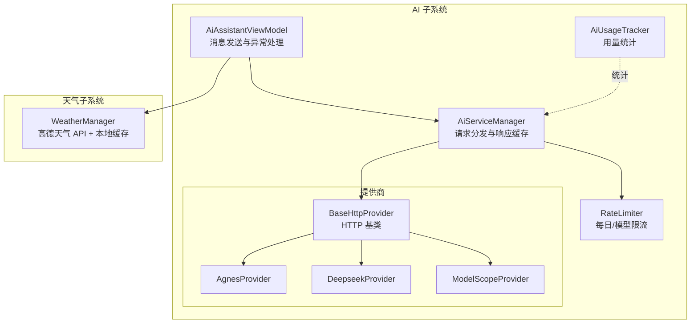
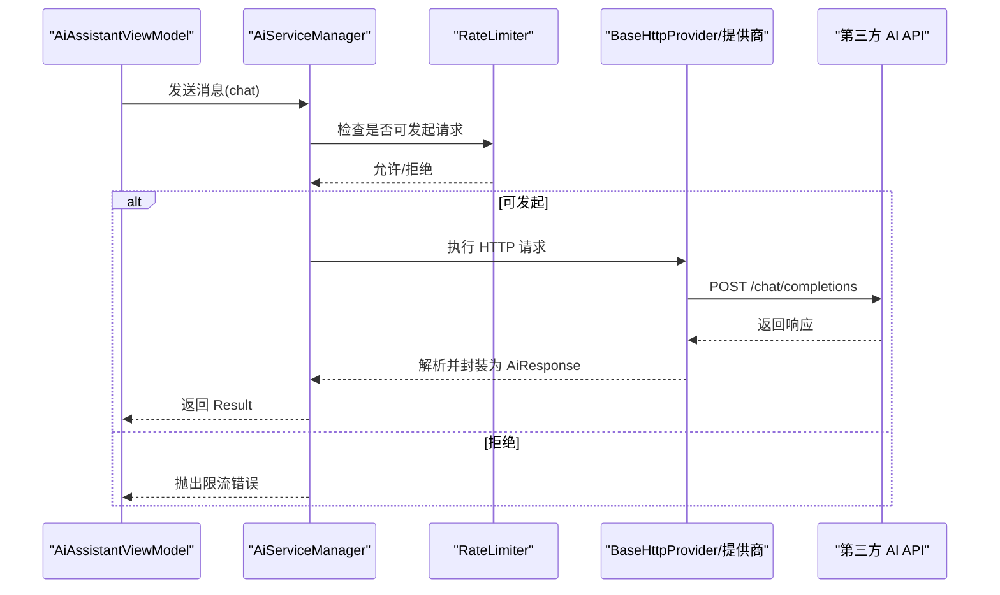
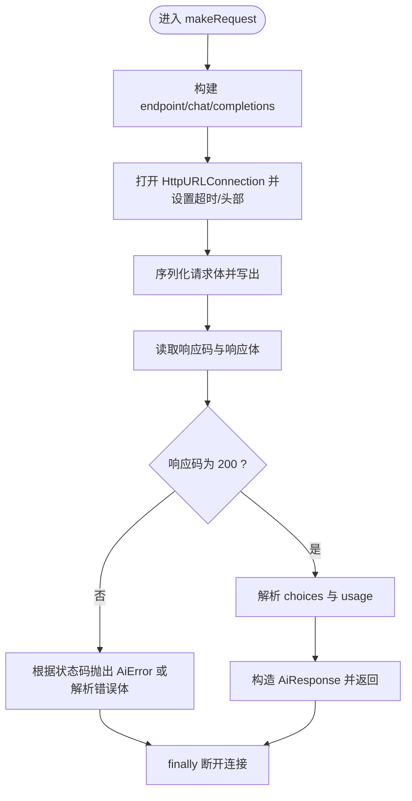
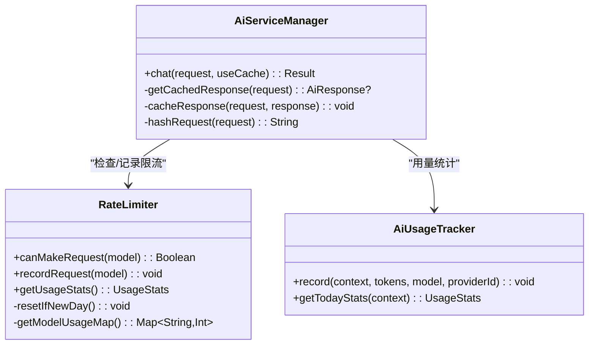
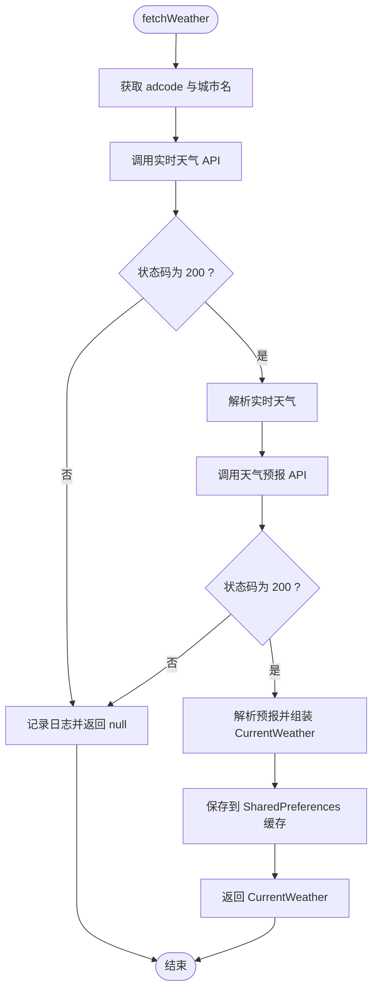
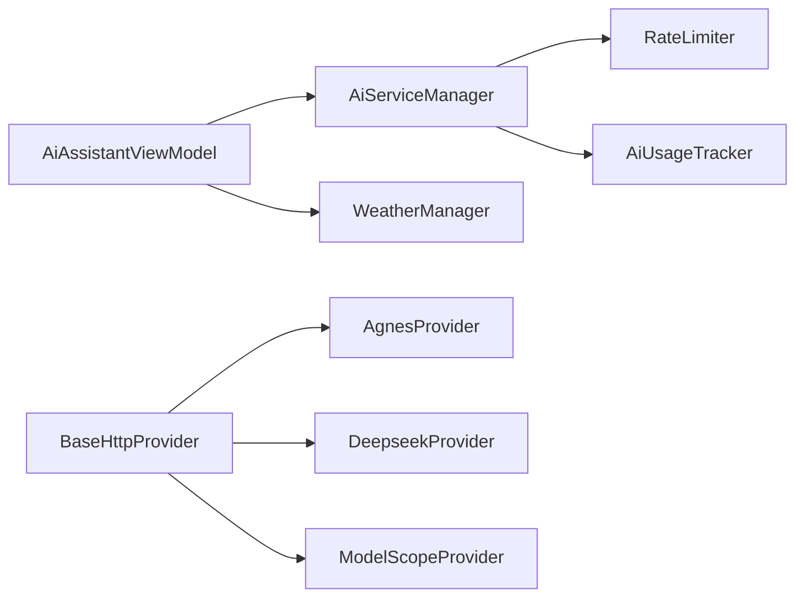

# 网络性能优化

<cite>
**本文引用的文件**
- [BaseHttpProvider.kt](file://app/src/main/java/com/diary/app/ai/BaseHttpProvider.kt)
- [RateLimiter.kt](file://app/src/main/java/com/diary/app/ai/RateLimiter.kt)
- [AiServiceManager.kt](file://app/src/main/java/com/diary/app/ai/AiServiceManager.kt)
- [AiAssistantViewModel.kt](file://app/src/main/java/com/diary/app/ai/AiAssistantViewModel.kt)
- [AgnesProvider.kt](file://app/src/main/java/com/diary/app/ai/AgnesProvider.kt)
- [DeepseekProvider.kt](file://app/src/main/java/com/diary/app/ai/DeepseekProvider.kt)
- [ModelScopeProvider.kt](file://app/src/main/java/com/diary/app/ai/ModelScopeProvider.kt)
- [WeatherManager.kt](file://app/src/main/java/com/diary/app/weather/WeatherManager.kt)
- [AiUsageTracker.kt](file://app/src/main/java/com/diary/app/ai/AiUsageTracker.kt)
- [RateLimiterTest.kt](file://app/src/test/java/com/diary/app/ai/RateLimiterTest.kt)
- [app/build.gradle.kts](file://app/build.gradle.kts)
</cite>

## 目录
1. [简介](#简介)
2. [项目结构](#项目结构)
3. [核心组件](#核心组件)
4. [架构总览](#架构总览)
5. [详细组件分析](#详细组件分析)
6. [依赖分析](#依赖分析)
7. [性能考量](#性能考量)
8. [故障排查指南](#故障排查指南)
9. [结论](#结论)
10. [附录](#附录)

## 简介
本文件聚焦 DiaryApp 的网络性能优化，围绕以下主题展开：
- HTTP 请求优化：连接复用、超时配置与错误处理
- AI 服务调用优化：限流策略与响应缓存
- 外部 API 缓存与离线策略：以天气数据为例
- 网络监控与慢请求识别：结合现有错误处理与统计埋点
- 实战建议与最佳实践：可直接落地的优化清单

## 项目结构
与网络性能相关的核心模块分布如下：
- AI 子系统：AI 提供商抽象与实现、限流器、服务编排与缓存、用量统计
- 天气子系统：高德天气 API 调用、本地缓存与离线回退
- UI 层：AI 助手交互层对网络异常的反馈与重试提示

图示来源
- [AiAssistantViewModel.kt:128-226](file://app/src/main/java/com/diary/app/ai/AiAssistantViewModel.kt#L128-L226)
- [AiServiceManager.kt:43-61](file://app/src/main/java/com/diary/app/ai/AiServiceManager.kt#L43-L61)
- [RateLimiter.kt:6-44](file://app/src/main/java/com/diary/app/ai/RateLimiter.kt#L6-L44)
- [BaseHttpProvider.kt:10-51](file://app/src/main/java/com/diary/app/ai/BaseHttpProvider.kt#L10-L51)
- [AgnesProvider.kt:5-15](file://app/src/main/java/com/diary/app/ai/AgnesProvider.kt#L5-L15)
- [DeepseekProvider.kt:5-18](file://app/src/main/java/com/diary/app/ai/DeepseekProvider.kt#L5-L18)
- [ModelScopeProvider.kt:5-23](file://app/src/main/java/com/diary/app/ai/ModelScopeProvider.kt#L5-L23)
- [WeatherManager.kt:54-67](file://app/src/main/java/com/diary/app/weather/WeatherManager.kt#L54-L67)

章节来源
- [AiAssistantViewModel.kt:128-226](file://app/src/main/java/com/diary/app/ai/AiAssistantViewModel.kt#L128-L226)
- [AiServiceManager.kt:43-61](file://app/src/main/java/com/diary/app/ai/AiServiceManager.kt#L43-L61)
- [WeatherManager.kt:54-67](file://app/src/main/java/com/diary/app/weather/WeatherManager.kt#L54-L67)

## 核心组件
- BaseHttpProvider：统一的 HTTP 调用基类，负责超时设置、鉴权头、错误码映射与响应解析
- RateLimiter：基于 SharedPreferences 的每日总量与模型维度限额，避免触发第三方配额限制
- AiServiceManager：聚合多个提供商，提供请求分发、请求哈希缓存与用量统计
- WeatherManager：高德天气 API 调用与本地缓存，支持离线读取与过期判断
- AiAssistantViewModel：UI 层对网络异常的反馈与重试提示
- AiUsageTracker：按日期统计请求次数与 Token 消耗，辅助性能分析

章节来源
- [BaseHttpProvider.kt:10-51](file://app/src/main/java/com/diary/app/ai/BaseHttpProvider.kt#L10-L51)
- [RateLimiter.kt:6-44](file://app/src/main/java/com/diary/app/ai/RateLimiter.kt#L6-L44)
- [AiServiceManager.kt:10-61](file://app/src/main/java/com/diary/app/ai/AiServiceManager.kt#L10-L61)
- [WeatherManager.kt:49-67](file://app/src/main/java/com/diary/app/weather/WeatherManager.kt#L49-L67)
- [AiAssistantViewModel.kt:201-213](file://app/src/main/java/com/diary/app/ai/AiAssistantViewModel.kt#L201-L213)
- [AiUsageTracker.kt:10-60](file://app/src/main/java/com/diary/app/ai/AiUsageTracker.kt#L10-L60)

## 架构总览
下图展示一次典型 AI 对话请求在各组件间的流转与优化点。

图示来源
- [AiAssistantViewModel.kt:176-183](file://app/src/main/java/com/diary/app/ai/AiAssistantViewModel.kt#L176-L183)
- [AiServiceManager.kt:43-61](file://app/src/main/java/com/diary/app/ai/AiServiceManager.kt#L43-L61)
- [RateLimiter.kt:26-32](file://app/src/main/java/com/diary/app/ai/RateLimiter.kt#L26-L32)
- [BaseHttpProvider.kt:21-39](file://app/src/main/java/com/diary/app/ai/BaseHttpProvider.kt#L21-L39)

## 详细组件分析

### HTTP 请求优化：BaseHttpProvider
- 连接与读取超时：通过受保护属性定义，默认连接超时与读取超时，可在具体提供商覆盖
- 鉴权与头部：自动注入 Authorization 与 Content-Type
- 错误处理：针对 429、401、402 等状态码进行语义化抛错；非 200 统一解析错误体
- 响应解析：提取 choices[0].message.content 与 usage.total_tokens
- 生命周期管理：确保 finally 中断开连接，避免资源泄漏

图示来源
- [BaseHttpProvider.kt:57-117](file://app/src/main/java/com/diary/app/ai/BaseHttpProvider.kt#L57-L117)

章节来源
- [BaseHttpProvider.kt:18-19](file://app/src/main/java/com/diary/app/ai/BaseHttpProvider.kt#L18-L19)
- [BaseHttpProvider.kt:64-71](file://app/src/main/java/com/diary/app/ai/BaseHttpProvider.kt#L64-L71)
- [BaseHttpProvider.kt:86-93](file://app/src/main/java/com/diary/app/ai/BaseHttpProvider.kt#L86-L93)
- [BaseHttpProvider.kt:108-113](file://app/src/main/java/com/diary/app/ai/BaseHttpProvider.kt#L108-L113)
- [BaseHttpProvider.kt:114-116](file://app/src/main/java/com/diary/app/ai/BaseHttpProvider.kt#L114-L116)

### AI 服务调用优化：限流与缓存
- 限流策略（RateLimiter）
  - 每日总量限制与模型维度限制，均通过 SharedPreferences 记录
  - 新一天自动重置，避免跨日累计
  - 提供 UsageStats 查询接口，便于 UI 展示
- 响应缓存（AiServiceManager）
  - 基于请求消息拼接的 SHA-256 哈希作为键，24 小时 TTL
  - 缓存命中则直接返回，减少重复请求
  - 记录 Token 消耗到 AiUsageTracker，用于成本控制与趋势分析

图示来源
- [RateLimiter.kt:26-52](file://app/src/main/java/com/diary/app/ai/RateLimiter.kt#L26-L52)
- [AiServiceManager.kt:43-95](file://app/src/main/java/com/diary/app/ai/AiServiceManager.kt#L43-L95)
- [AiUsageTracker.kt:27-73](file://app/src/main/java/com/diary/app/ai/AiUsageTracker.kt#L27-L73)

章节来源
- [RateLimiter.kt:6-44](file://app/src/main/java/com/diary/app/ai/RateLimiter.kt#L6-L44)
- [AiServiceManager.kt:17-95](file://app/src/main/java/com/diary/app/ai/AiServiceManager.kt#L17-L95)
- [AiUsageTracker.kt:10-60](file://app/src/main/java/com/diary/app/ai/AiUsageTracker.kt#L10-L60)

### 外部 API 缓存与离线处理：天气数据
- 数据来源：高德天气实时与预报接口
- 缓存策略：SharedPreferences 存储 JSON 数组与基础字段，缓存有效期 1 小时
- 离线回退：缓存未命中或过期时尝试在线拉取，失败则返回 null 由上层决定降级策略
- 地理定位：优先使用 GPS/网络定位，若不可用则回退至默认城市

图示来源
- [WeatherManager.kt:54-67](file://app/src/main/java/com/diary/app/weather/WeatherManager.kt#L54-L67)
- [WeatherManager.kt:230-368](file://app/src/main/java/com/diary/app/weather/WeatherManager.kt#L230-L368)
- [WeatherManager.kt:393-431](file://app/src/main/java/com/diary/app/weather/WeatherManager.kt#L393-L431)

章节来源
- [WeatherManager.kt:49-67](file://app/src/main/java/com/diary/app/weather/WeatherManager.kt#L49-L67)
- [WeatherManager.kt:128-132](file://app/src/main/java/com/diary/app/weather/WeatherManager.kt#L128-L132)
- [WeatherManager.kt:230-368](file://app/src/main/java/com/diary/app/weather/WeatherManager.kt#L230-L368)

### 网络监控与慢请求识别
- 现有机制
  - UI 层对 SocketTimeoutException 与包含“timeout”的异常进行友好提示
  - AiUsageTracker 记录请求次数与 Token 消耗，可用于识别异常增长
  - RateLimiter 的 UsageStats 可用于观察配额压力
- 建议增强
  - 在 BaseHttpProvider 中增加请求耗时埋点与错误类型统计
  - 在 AiServiceManager 中记录缓存命中率与 TTL 过期事件
  - 在 WeatherManager 中记录缓存命中/过期/回退事件
  - 结合 Android Studio Profiler 与 Network Inspector 定位慢请求与异常重试

章节来源
- [AiAssistantViewModel.kt:201-213](file://app/src/main/java/com/diary/app/ai/AiAssistantViewModel.kt#L201-L213)
- [AiUsageTracker.kt:27-73](file://app/src/main/java/com/diary/app/ai/AiUsageTracker.kt#L27-L73)
- [RateLimiter.kt:46-52](file://app/src/main/java/com/diary/app/ai/RateLimiter.kt#L46-L52)

## 依赖分析
- 组件耦合
  - AiAssistantViewModel 依赖 AiServiceManager 与 WeatherManager
  - AiServiceManager 依赖 RateLimiter 与 AiUsageTracker
  - BaseHttpProvider 被多个提供商继承，统一 HTTP 行为
- 外部依赖
  - 高德天气 API（通过 BuildConfig 字段注入密钥）
  - Gson 用于 JSON 序列化与反序列化
  - SharedPreferences 用于限流与缓存持久化

图示来源
- [AiAssistantViewModel.kt:176-183](file://app/src/main/java/com/diary/app/ai/AiAssistantViewModel.kt#L176-L183)
- [AiServiceManager.kt:20-24](file://app/src/main/java/com/diary/app/ai/AiServiceManager.kt#L20-L24)
- [BaseHttpProvider.kt:10-14](file://app/src/main/java/com/diary/app/ai/BaseHttpProvider.kt#L10-L14)
- [AgnesProvider.kt:5-15](file://app/src/main/java/com/diary/app/ai/AgnesProvider.kt#L5-L15)
- [DeepseekProvider.kt:5-18](file://app/src/main/java/com/diary/app/ai/DeepseekProvider.kt#L5-L18)
- [ModelScopeProvider.kt:5-23](file://app/src/main/java/com/diary/app/ai/ModelScopeProvider.kt#L5-L23)

章节来源
- [app/build.gradle.kts:32-34](file://app/build.gradle.kts#L32-L34)
- [app/build.gradle.kts:122-123](file://app/build.gradle.kts#L122-L123)

## 性能考量
- 连接与超时
  - BaseHttpProvider 默认连接超时 10s、读取超时 20s；部分提供商覆盖更长超时（如 Deepseek 的读取超时 60s）
  - 建议：根据模型参数与网络环境调整超时，避免过短导致误判超时
- 限流与配额
  - 每日总量 2000、模型维度 200；建议在 UI 显示剩余配额，引导用户错峰使用
- 缓存策略
  - AI 响应缓存 24h；天气缓存 1h；建议对热点请求增加 LRU 缓存或更细粒度的失效策略
- 错误处理与重试
  - 当前未实现指数退避重试；建议对瞬时性错误（如 5xx/超时）引入有限重试
- 监控与可观测性
  - 建议补充请求耗时、错误类型、缓存命中率等指标，结合日志平台进行慢请求追踪

## 故障排查指南
- 常见问题与定位
  - API Key 无效/配额不足：BaseHttpProvider 对 401/402 进行语义化抛错
  - 网络超时：AiAssistantViewModel 捕获 SocketTimeoutException 并提示“网络不太好”
  - 限流触发：RateLimiter 拒绝请求，可通过 UsageStats 查看剩余配额
  - 天气接口失败：WeatherManager 记录日志并返回 null，UI 可降级显示默认信息
- 测试验证
  - RateLimiterTest 覆盖了 canMakeRequestInternal 的边界条件，可作为回归测试参考

章节来源
- [BaseHttpProvider.kt:86-93](file://app/src/main/java/com/diary/app/ai/BaseHttpProvider.kt#L86-L93)
- [AiAssistantViewModel.kt:201-213](file://app/src/main/java/com/diary/app/ai/AiAssistantViewModel.kt#L201-L213)
- [RateLimiterTest.kt:12-67](file://app/src/test/java/com/diary/app/ai/RateLimiterTest.kt#L12-L67)
- [WeatherManager.kt:364-367](file://app/src/main/java/com/diary/app/weather/WeatherManager.kt#L364-L367)

## 结论
DiaryApp 的网络层通过“统一 HTTP 基类 + 限流 + 响应缓存 + 天气本地缓存”的组合，实现了较为稳健的性能与可靠性保障。建议后续在“可观测性埋点、重试策略、缓存淘汰与热点保护”方面进一步完善，以应对复杂场景下的稳定性挑战。

## 附录
- 最佳实践清单
  - 为不同提供商设置合理的连接/读取超时
  - 引入指数退避重试与抖动，避免雪崩效应
  - 增加请求耗时与错误类型统计，建立慢请求告警
  - 对热点请求增加 LRU 缓存与预热策略
  - 在 UI 层提供“重试”按钮与配额/缓存状态提示
  - 使用 Network Inspector 与日志平台进行端到端追踪