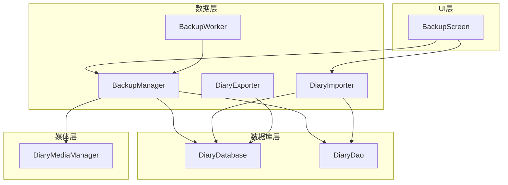
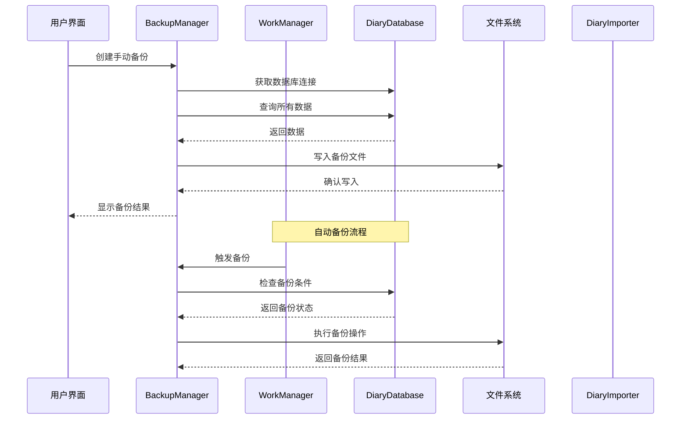
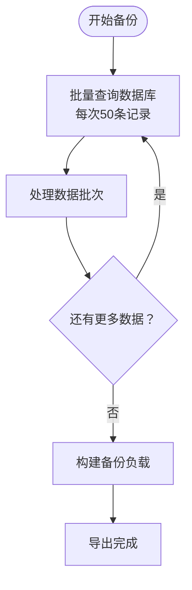
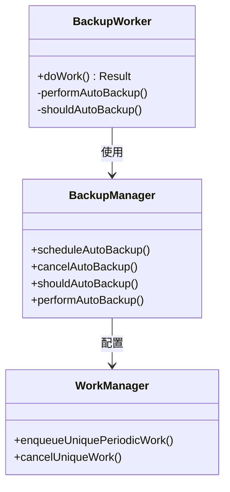
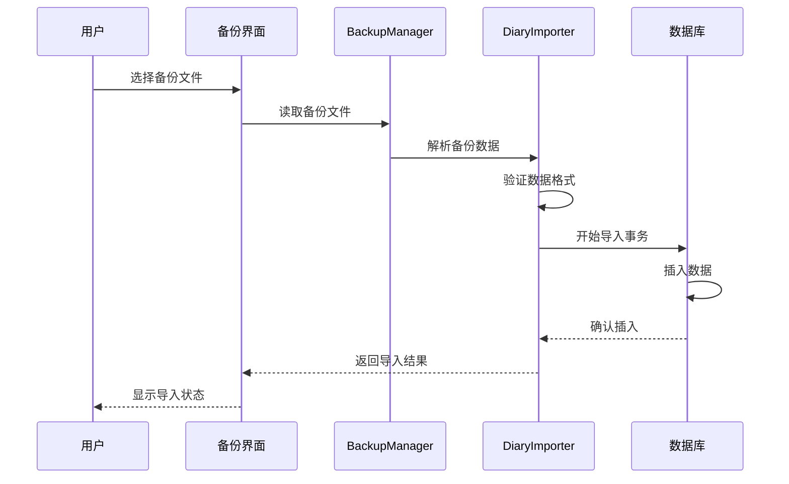
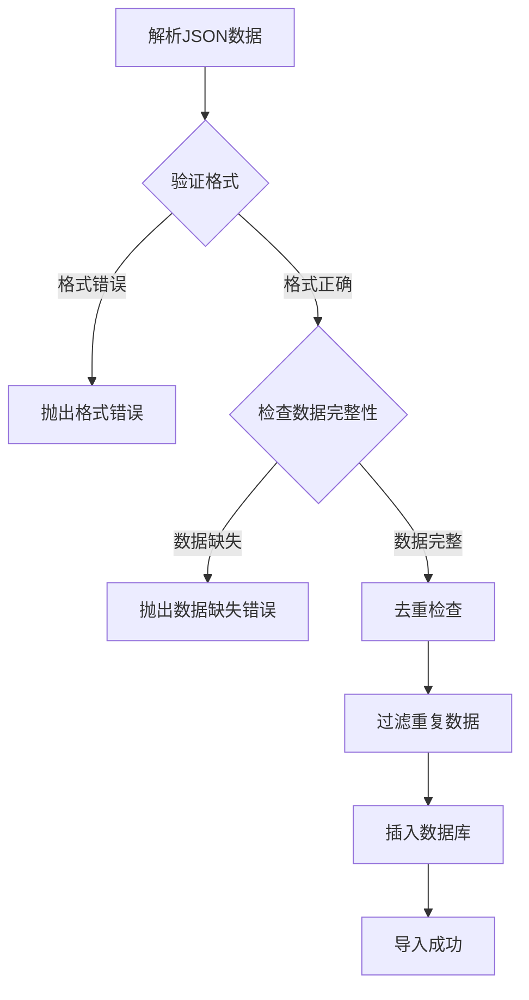
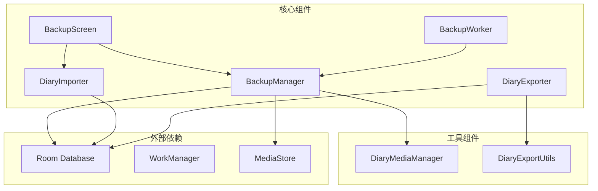
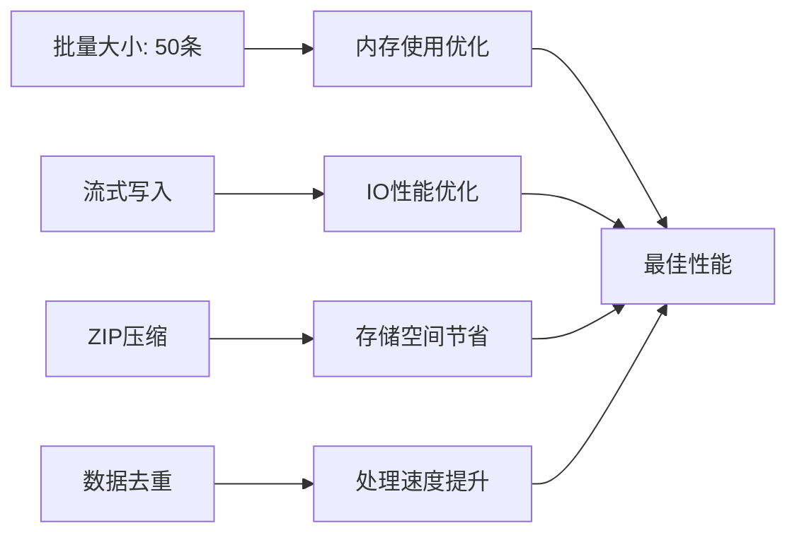

# 备份与恢复机制

<cite>
**本文档引用的文件**
- [BackupManager.kt](file://app/src/main/java/com/diary/app/data/BackupManager.kt)
- [BackupWorker.kt](file://app/src/main/java/com/diary/app/data/BackupWorker.kt)
- [DiaryExporter.kt](file://app/src/main/java/com/diary/app/data/DiaryExporter.kt)
- [DiaryImporter.kt](file://app/src/main/java/com/diary/app/data/DiaryImporter.kt)
- [DiaryExportUtils.kt](file://app/src/main/java/com/diary/app/data/DiaryExportUtils.kt)
- [BackupScreen.kt](file://app/src/main/java/com/diary/app/ui/backup/BackupScreen.kt)
- [DiaryDatabase.kt](file://app/src/main/java/com/diary/app/data/DiaryDatabase.kt)
- [DiaryDao.kt](file://app/src/main/java/com/diary/app/data/DiaryDao.kt)
- [DiaryMediaManager.kt](file://app/src/main/java/com/diary/app/data/DiaryMediaManager.kt)
- [BackupManagerUtilsTest.kt](file://app/src/test/java/com/diary/app/data/BackupManagerUtilsTest.kt)
- [BackupCoverageSourceTest.kt](file://app/src/test/java/com/diary/app/data/BackupCoverageSourceTest.kt)
</cite>

## 目录
1. [简介](#简介)
2. [项目结构](#项目结构)
3. [核心组件](#核心组件)
4. [架构概览](#架构概览)
5. [详细组件分析](#详细组件分析)
6. [依赖关系分析](#依赖关系分析)
7. [性能考虑](#性能考虑)
8. [故障排除指南](#故障排除指南)
9. [结论](#结论)

## 简介

DiaryApp 的备份与恢复机制是一个完整的数据保护解决方案，提供了多种备份格式、智能调度系统和安全的数据处理能力。该系统支持 JSON 格式的轻量备份和 ZIP 压缩的完整备份，具备自动备份调度、增量备份检测、数据验证和冲突解决等功能。

## 项目结构

备份与恢复功能主要分布在以下模块中：

**图表来源**
- [BackupScreen.kt:1-1032](file://app/src/main/java/com/diary/app/ui/backup/BackupScreen.kt#L1-L1032)
- [BackupManager.kt:1-1094](file://app/src/main/java/com/diary/app/data/BackupManager.kt#L1-L1094)
- [DiaryDatabase.kt:1-829](file://app/src/main/java/com/diary/app/data/DiaryDatabase.kt#L1-L829)

**章节来源**
- [BackupScreen.kt:1-1032](file://app/src/main/java/com/diary/app/ui/backup/BackupScreen.kt#L1-L1032)
- [BackupManager.kt:1-1094](file://app/src/main/java/com/diary/app/data/BackupManager.kt#L1-L1094)

## 核心组件

### BackupManager - 备份管理器

BackupManager 是整个备份系统的核心，负责协调所有备份操作。它提供了以下关键功能：

- **备份策略管理**：支持多种备份频率（每日、每3天、每周等）
- **文件管理**：处理备份文件的创建、读取、重命名和删除
- **存储管理**：支持外部存储和内部存储两种备份位置
- **历史记录**：维护备份历史和元数据信息

### BackupWorker - 自动备份工作器

BackupWorker 使用 WorkManager 实现后台自动备份，具有以下特性：

- **周期性执行**：根据用户设置的频率定期执行备份
- **错误处理**：具备重试机制和异常处理
- **系统集成**：与 Android 系统电源管理良好集成

### DiaryImporter - 数据导入器

DiaryImporter 负责从备份文件中恢复数据，提供：

- **数据验证**：确保备份文件格式正确且包含可导入的数据
- **冲突解决**：处理重复数据和冲突情况
- **事务管理**：使用数据库事务确保数据一致性

### DiaryExporter - 数据导出器

DiaryExporter 提供多种导出格式：

- **JSON 导出**：标准格式，便于分享和传输
- **Markdown 导出**：纯文本格式，便于阅读
- **HTML 导出**：富文本格式，保持原始样式
- **图片导出**：将单篇日记导出为图片

**章节来源**
- [BackupManager.kt:63-1094](file://app/src/main/java/com/diary/app/data/BackupManager.kt#L63-L1094)
- [BackupWorker.kt:1-27](file://app/src/main/java/com/diary/app/data/BackupWorker.kt#L1-L27)
- [DiaryImporter.kt:159-679](file://app/src/main/java/com/diary/app/data/DiaryImporter.kt#L159-L679)
- [DiaryExporter.kt:23-724](file://app/src/main/java/com/diary/app/data/DiaryExporter.kt#L23-L724)

## 架构概览

备份系统的整体架构采用分层设计，确保了功能的模块化和可维护性：

**图表来源**
- [BackupManager.kt:279-328](file://app/src/main/java/com/diary/app/data/BackupManager.kt#L279-L328)
- [BackupWorker.kt:13-25](file://app/src/main/java/com/diary/app/data/BackupWorker.kt#L13-L25)

## 详细组件分析

### 备份策略与实现原理

#### 数据导出机制

BackupManager 使用分批查询策略避免内存溢出：

**图表来源**
- [BackupManager.kt:458-619](file://app/src/main/java/com/diary/app/data/BackupManager.kt#L458-L619)

#### 压缩与加密

系统支持两种备份格式：

1. **完整备份 (.diarybackup)**：ZIP 压缩格式，包含所有数据和媒体文件
2. **JSON 备份 (.json)**：纯文本格式，便于人类阅读

**章节来源**
- [BackupManager.kt:330-396](file://app/src/main/java/com/diary/app/data/BackupManager.kt#L330-L396)
- [BackupManager.kt:458-619](file://app/src/main/java/com/diary/app/data/BackupManager.kt#L458-L619)

### 自动备份系统

#### WorkManager 集成

自动备份系统基于 WorkManager 实现：

**图表来源**
- [BackupWorker.kt:8-27](file://app/src/main/java/com/diary/app/data/BackupWorker.kt#L8-L27)
- [BackupManager.kt:418-439](file://app/src/main/java/com/diary/app/data/BackupManager.kt#L418-L439)

#### 定时任务调度

备份频率支持多种选项：

| 频率 | 标签 | 天数 |
|------|------|------|
| DAILY | 每日 | 1 |
| EVERY_3_DAYS | 每3天 | 3 |
| EVERY_5_DAYS | 每5天 | 5 |
| WEEKLY | 每周 | 7 |
| BIWEEKLY | 每两周 | 14 |
| MONTHLY | 每月 | 30 |
| DISABLED | 关闭 | 0 |

**章节来源**
- [BackupManager.kt:25-33](file://app/src/main/java/com/diary/app/data/BackupManager.kt#L25-L33)
- [BackupManager.kt:418-439](file://app/src/main/java/com/diary/app/data/BackupManager.kt#L418-L439)

### 数据导入导出流程

#### 导入流程

**图表来源**
- [BackupScreen.kt:666-680](file://app/src/main/java/com/diary/app/ui/backup/BackupScreen.kt#L666-L680)
- [DiaryImporter.kt:169-231](file://app/src/main/java/com/diary/app/data/DiaryImporter.kt#L169-L231)

#### 导出流程

系统提供多种导出格式：

1. **JSON 格式**：包含所有数据的完整备份
2. **Markdown 格式**：纯文本日记导出
3. **HTML 格式**：保持原始样式的网页导出
4. **图片格式**：单篇日记导出为 PNG 图片

**章节来源**
- [DiaryExporter.kt:53-110](file://app/src/main/java/com/diary/app/data/DiaryExporter.kt#L53-L110)
- [DiaryExporter.kt:112-174](file://app/src/main/java/com/diary/app/data/DiaryExporter.kt#L112-L174)

### 数据验证与冲突解决

#### 数据验证机制

系统实现了多层次的数据验证：

**图表来源**
- [DiaryImporter.kt:234-261](file://app/src/main/java/com/diary/app/data/DiaryImporter.kt#L234-L261)
- [DiaryImporter.kt:280-294](file://app/src/main/java/com/diary/app/data/DiaryImporter.kt#L280-L294)

#### 冲突解决策略

系统采用智能冲突检测和解决机制：

1. **重复数据检测**：基于创建时间、更新时间和内容特征
2. **标签冲突处理**：保留现有标签，避免重复创建
3. **媒体文件处理**：智能识别和处理媒体文件引用

**章节来源**
- [DiaryImporter.kt:263-334](file://app/src/main/java/com/diary/app/data/DiaryImporter.kt#L263-L334)
- [DiaryImporter.kt:336-367](file://app/src/main/java/com/diary/app/data/DiaryImporter.kt#L336-L367)

## 依赖关系分析

备份系统各组件之间的依赖关系如下：

**图表来源**
- [BackupManager.kt:1-24](file://app/src/main/java/com/diary/app/data/BackupManager.kt#L1-L24)
- [DiaryExporter.kt:1-22](file://app/src/main/java/com/diary/app/data/DiaryExporter.kt#L1-L22)

**章节来源**
- [DiaryDatabase.kt:10-19](file://app/src/main/java/com/diary/app/data/DiaryDatabase.kt#L10-L19)
- [DiaryDao.kt:12-13](file://app/src/main/java/com/diary/app/data/DiaryDao.kt#L12-L13)

## 性能考虑

### 内存优化

系统采用了多项内存优化策略：

1. **分批查询**：数据库查询采用分批方式，避免一次性加载大量数据
2. **流式处理**：备份文件使用流式写入，减少内存占用
3. **媒体文件优化**：媒体文件采用延迟加载和缓存机制

### 备份性能优化

**图表来源**
- [BackupManager.kt:458-467](file://app/src/main/java/com/diary/app/data/BackupManager.kt#L458-L467)
- [BackupManager.kt:365-396](file://app/src/main/java/com/diary/app/data/BackupManager.kt#L365-L396)

## 故障排除指南

### 常见问题及解决方案

#### 权限问题

**问题**：无法创建备份文件
**原因**：缺少存储权限
**解决方案**：
1. 检查应用是否具有存储权限
2. 在设置中授予"所有文件访问"权限
3. 确认外部存储可用性

#### 备份失败

**问题**：备份过程中出现异常
**原因**：数据库锁定或磁盘空间不足
**解决方案**：
1. 确保数据库连接正常
2. 检查可用存储空间
3. 重启应用后重试

#### 导入失败

**问题**：无法导入备份文件
**原因**：文件格式不兼容或数据损坏
**解决方案**：
1. 验证备份文件格式
2. 检查文件完整性
3. 使用系统自带的备份文件

**章节来源**
- [BackupScreen.kt:419-448](file://app/src/main/java/com/diary/app/ui/backup/BackupScreen.kt#L419-L448)
- [BackupManager.kt:109-115](file://app/src/main/java/com/diary/app/data/BackupManager.kt#L109-L115)

### 调试和监控

系统提供了完善的调试和监控功能：

1. **日志记录**：详细的错误日志和操作记录
2. **状态监控**：实时监控备份进度和状态
3. **错误报告**：友好的错误提示和解决方案建议

**章节来源**
- [BackupWorker.kt:21-24](file://app/src/main/java/com/diary/app/data/BackupWorker.kt#L21-L24)
- [BackupManager.kt:101-107](file://app/src/main/java/com/diary/app/data/BackupManager.kt#L101-L107)

## 结论

DiaryApp 的备份与恢复机制是一个设计精良、功能完备的数据保护系统。它通过合理的架构设计、完善的错误处理机制和优秀的用户体验，为用户提供了可靠的数据安全保障。

系统的主要优势包括：

1. **多格式支持**：支持 JSON 和 ZIP 两种备份格式
2. **智能调度**：基于 WorkManager 的可靠自动备份
3. **数据安全**：完整的数据验证和冲突解决机制
4. **性能优化**：内存和存储空间的双重优化
5. **用户友好**：直观的操作界面和详细的反馈信息

通过持续的测试和优化，该系统能够满足用户的各种备份需求，确保日记数据的安全性和可恢复性。