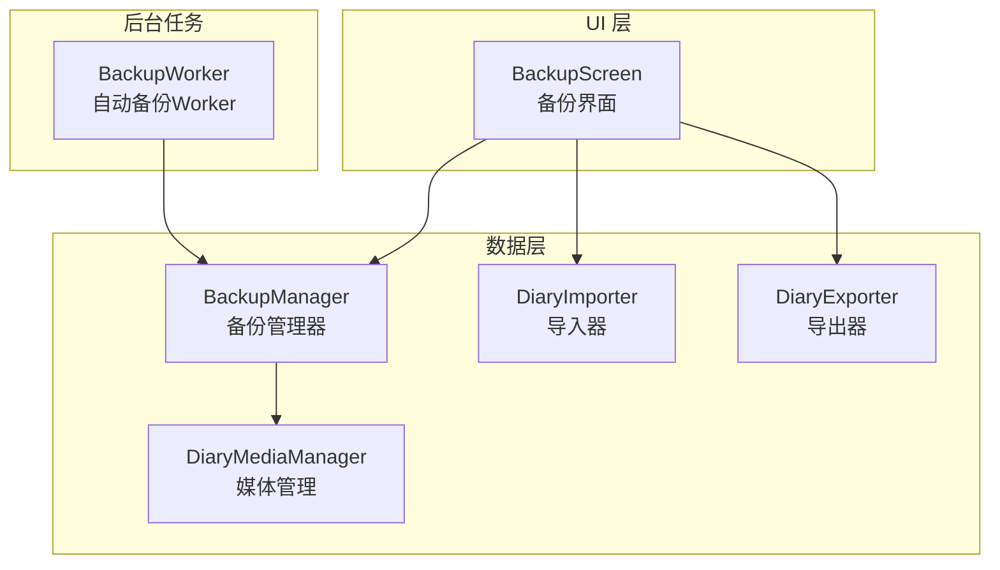
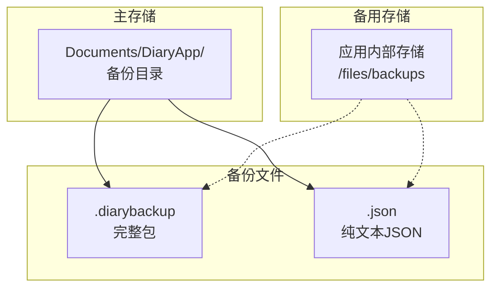
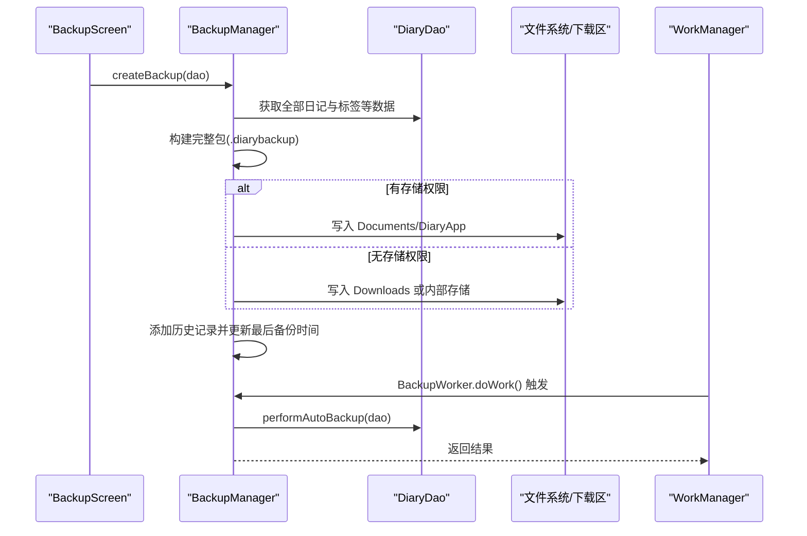
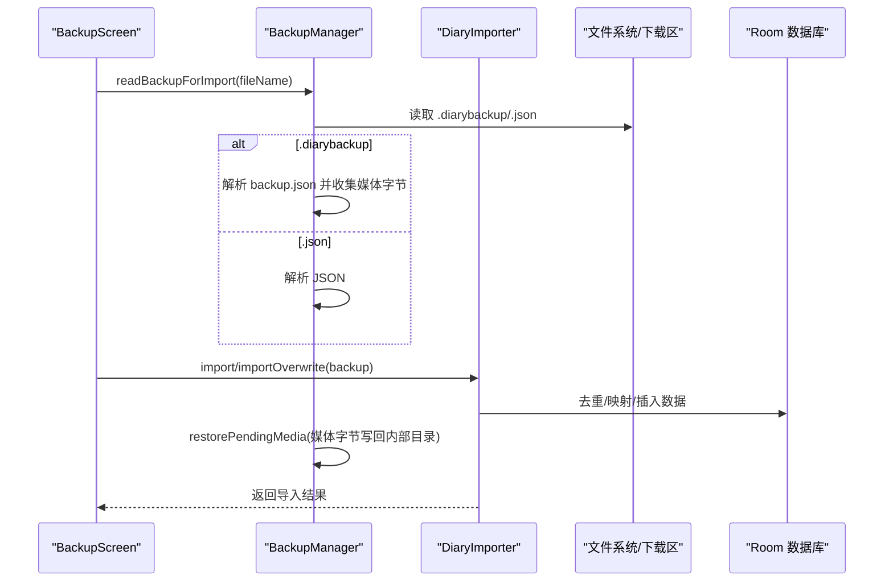
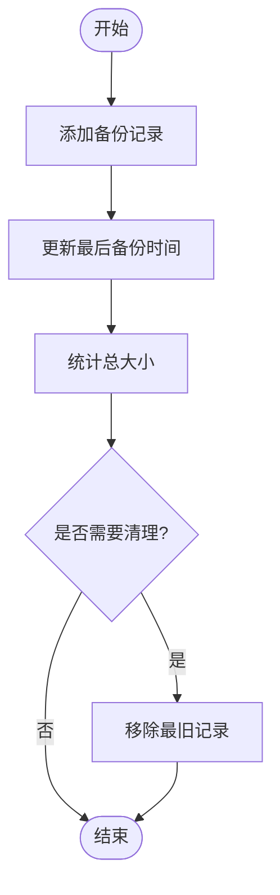
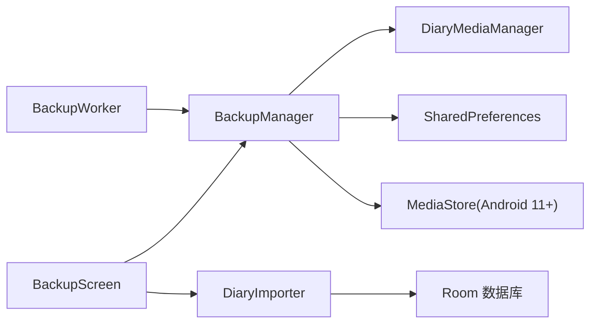

# 备份存储与管理

<cite>
**本文引用的文件列表**
- [BackupManager.kt](file://app/src/main/java/com/diary/app/data/BackupManager.kt)
- [BackupWorker.kt](file://app/src/main/java/com/diary/app/data/BackupWorker.kt)
- [BackupScreen.kt](file://app/src/main/java/com/diary/app/ui/backup/BackupScreen.kt)
- [DiaryImporter.kt](file://app/src/main/java/com/diary/app/data/DiaryImporter.kt)
- [DiaryExporter.kt](file://app/src/main/java/com/diary/app/data/DiaryExporter.kt)
- [DiaryMediaManager.kt](file://app/src/main/java/com/diary/app/data/DiaryMediaManager.kt)
- [BackupManagerUtilsTest.kt](file://app/src/test/java/com/diary/app/data/BackupManagerUtilsTest.kt)
- [BackupDetectionDiagnosticTest.kt](file://app/src/test/java/com/diary/app/data/BackupDetectionDiagnosticTest.kt)
</cite>

## 目录
1. [简介](#简介)
2. [项目结构](#项目结构)
3. [核心组件](#核心组件)
4. [架构总览](#架构总览)
5. [详细组件分析](#详细组件分析)
6. [依赖关系分析](#依赖关系分析)
7. [性能考量](#性能考量)
8. [故障排查指南](#故障排查指南)
9. [结论](#结论)
10. [附录](#附录)

## 简介
本文件系统化梳理 DiaryApp 的备份存储与管理能力，重点覆盖以下方面：
- 备份文件的存储位置与组织结构（Documents/DiaryApp 目录与内部存储的双重策略）
- 备份文件命名规范与文件格式（.diarybackup 与 .json 的区别）
- 备份历史记录的管理机制（最大备份数量限制、文件大小统计、删除策略）
- 跨版本兼容性与备份文件的版本管理
- 备份存储空间优化与清理策略的最佳实践

## 项目结构
围绕备份功能的关键模块如下：
- 数据层：BackupManager（备份创建、扫描、导入导出、历史记录管理）、DiaryImporter（导入逻辑）、DiaryExporter（导出逻辑）、DiaryMediaManager（媒体资源管理）
- UI 层：BackupScreen（备份界面与交互）
- 后台任务：BackupWorker（周期性自动备份）

图表来源
- [BackupScreen.kt](file://app/src/main/java/com/diary/app/ui/backup/BackupScreen.kt)
- [BackupManager.kt](file://app/src/main/java/com/diary/app/data/BackupManager.kt)
- [DiaryImporter.kt](file://app/src/main/java/com/diary/app/data/DiaryImporter.kt)
- [DiaryExporter.kt](file://app/src/main/java/com/diary/app/data/DiaryExporter.kt)
- [DiaryMediaManager.kt](file://app/src/main/java/com/diary/app/data/DiaryMediaManager.kt)
- [BackupWorker.kt](file://app/src/main/java/com/diary/app/data/BackupWorker.kt)

章节来源
- [BackupScreen.kt:1-120](file://app/src/main/java/com/diary/app/ui/backup/BackupScreen.kt#L1-L120)
- [BackupManager.kt:63-120](file://app/src/main/java/com/diary/app/data/BackupManager.kt#L63-L120)
- [DiaryImporter.kt:159-232](file://app/src/main/java/com/diary/app/data/DiaryImporter.kt#L159-L232)
- [DiaryExporter.kt:23-110](file://app/src/main/java/com/diary/app/data/DiaryExporter.kt#L23-L110)
- [DiaryMediaManager.kt:27-55](file://app/src/main/java/com/diary/app/data/DiaryMediaManager.kt#L27-L55)
- [BackupWorker.kt:8-27](file://app/src/main/java/com/diary/app/data/BackupWorker.kt#L8-L27)

## 核心组件
- 备份管理器（BackupManager）：负责备份创建、扫描、导入导出、历史记录维护、权限处理、目录迁移与文件读写
- 自动备份工作（BackupWorker）：基于 WorkManager 的周期性任务，按频率触发备份
- 导入器（DiaryImporter）：解析备份 JSON，去重与映射，执行导入或覆盖导入
- 导出器（DiaryExporter）：生成标准 JSON 导出文件（.json），用于兼容旧版
- 媒体管理（DiaryMediaManager）：管理日记媒体资源（显示图与缩略图）的存储与引用
- 备份界面（BackupScreen）：用户交互入口，展示历史、发起备份、导入导出、重命名与删除

章节来源
- [BackupManager.kt:63-120](file://app/src/main/java/com/diary/app/data/BackupManager.kt#L63-L120)
- [BackupWorker.kt:8-27](file://app/src/main/java/com/diary/app/data/BackupWorker.kt#L8-L27)
- [DiaryImporter.kt:159-232](file://app/src/main/java/com/diary/app/data/DiaryImporter.kt#L159-L232)
- [DiaryExporter.kt:23-110](file://app/src/main/java/com/diary/app/data/DiaryExporter.kt#L23-L110)
- [DiaryMediaManager.kt:27-55](file://app/src/main/java/com/diary/app/data/DiaryMediaManager.kt#L27-L55)
- [BackupScreen.kt:94-120](file://app/src/main/java/com/diary/app/ui/backup/BackupScreen.kt#L94-L120)

## 架构总览
备份系统采用“双存储策略”：
- 主存储：Documents/DiaryApp 目录（Android 11+ 需要 MANAGE_EXTERNAL_STORAGE 或 MediaStore 访问）
- 备用存储：内部存储（应用私有目录）用于历史记录与部分场景

备份文件类型：
- .diarybackup：完整包（包含 JSON 与媒体资源），默认新建备份采用此格式
- .json：纯文本 JSON，兼容旧版导入

图表来源
- [BackupManager.kt:117-125](file://app/src/main/java/com/diary/app/data/BackupManager.kt#L117-L125)
- [BackupManager.kt:43-45](file://app/src/main/java/com/diary/app/data/BackupManager.kt#L43-L45)
- [BackupManager.kt:71-73](file://app/src/main/java/com/diary/app/data/BackupManager.kt#L71-L73)

## 详细组件分析

### 备份文件命名规范与格式
- 命名规范
  - 默认前缀：diary_backup_
  - 支持中文前缀：日记备份_
  - 文件名规范化：去除非法字符、空白折叠、确保以备份前缀开头；若原始扩展名为 .json，则自动替换为 .diarybackup
- 文件格式
  - .diarybackup：完整包，包含 backup.json 与媒体资源条目
  - .json：纯文本 JSON，便于旧版导入与通用工具处理

章节来源
- [BackupManager.kt:47-61](file://app/src/main/java/com/diary/app/data/BackupManager.kt#L47-L61)
- [BackupManager.kt:43-45](file://app/src/main/java/com/diary/app/data/BackupManager.kt#L43-L45)
- [BackupManagerUtilsTest.kt:9-51](file://app/src/test/java/com/diary/app/data/BackupManagerUtilsTest.kt#L9-L51)
- [BackupDetectionDiagnosticTest.kt:17-51](file://app/src/test/java/com/diary/app/data/BackupDetectionDiagnosticTest.kt#L17-L51)

### 存储位置与组织结构
- 主目录
  - Documents/DiaryApp：默认主存储位置，用于存放 .diarybackup 与 .json 备份文件
  - 目录创建与权限：若具备存储权限则优先写入该目录；否则根据平台差异写入 Downloads 或内部存储
- 备用目录
  - 应用内部存储 /files/backups：用于历史记录与兼容性场景
- 目录扫描
  - 支持 MediaStore 查询与文件系统遍历，确保在不同 Android 版本下均能发现备份文件

章节来源
- [BackupManager.kt:117-125](file://app/src/main/java/com/diary/app/data/BackupManager.kt#L117-L125)
- [BackupManager.kt:873-947](file://app/src/main/java/com/diary/app/data/BackupManager.kt#L873-L947)
- [BackupDetectionDiagnosticTest.kt:106-120](file://app/src/test/java/com/diary/app/data/BackupDetectionDiagnosticTest.kt#L106-L120)

### 备份创建流程
- 自动备份
  - 由 BackupWorker 周期性触发，按频率判断是否需要备份
  - 若具备存储权限，优先写入 Documents/DiaryApp；否则写入 Downloads 或内部存储
- 手动备份
  - UI 触发 BackupScreen.createBackup，构建完整包（JSON + 媒体资源），并记录历史

图表来源
- [BackupScreen.kt:574-614](file://app/src/main/java/com/diary/app/ui/backup/BackupScreen.kt#L574-L614)
- [BackupManager.kt:279-328](file://app/src/main/java/com/diary/app/data/BackupManager.kt#L279-L328)
- [BackupWorker.kt:13-25](file://app/src/main/java/com/diary/app/data/BackupWorker.kt#L13-L25)

章节来源
- [BackupScreen.kt:574-614](file://app/src/main/java/com/diary/app/ui/backup/BackupScreen.kt#L574-L614)
- [BackupManager.kt:279-328](file://app/src/main/java/com/diary/app/data/BackupManager.kt#L279-L328)
- [BackupWorker.kt:13-25](file://app/src/main/java/com/diary/app/data/BackupWorker.kt#L13-L25)

### 备份导入流程
- 导入准备
  - 从 Documents/DiaryApp 或 Downloads 读取备份文件，支持 .diarybackup 与 .json
  - 对于 .diarybackup，先解析 JSON，再提取媒体资源字节
- 导入策略
  - 普通导入：去重过滤，保留数据库中不存在的条目
  - 覆盖导入：清空数据库后再导入，适合完全恢复
- 媒体恢复
  - 将 .diarybackup 中的媒体资源写回应用内部媒体目录

图表来源
- [BackupScreen.kt:666-680](file://app/src/main/java/com/diary/app/ui/backup/BackupScreen.kt#L666-L680)
- [BackupManager.kt:772-800](file://app/src/main/java/com/diary/app/data/BackupManager.kt#L772-L800)
- [DiaryImporter.kt:169-231](file://app/src/main/java/com/diary/app/data/DiaryImporter.kt#L169-L231)
- [BackupManager.kt:803-823](file://app/src/main/java/com/diary/app/data/BackupManager.kt#L803-L823)

章节来源
- [BackupScreen.kt:666-680](file://app/src/main/java/com/diary/app/ui/backup/BackupScreen.kt#L666-L680)
- [BackupManager.kt:772-800](file://app/src/main/java/com/diary/app/data/BackupManager.kt#L772-L800)
- [DiaryImporter.kt:169-231](file://app/src/main/java/com/diary/app/data/DiaryImporter.kt#L169-L231)
- [BackupManager.kt:803-823](file://app/src/main/java/com/diary/app/data/BackupManager.kt#L803-L823)

### 备份历史记录管理
- 历史记录结构
  - BackupRecord：包含文件名、文件路径、时间戳、条目数、文件大小
- 历史维护
  - 新建备份后添加记录并更新最后备份时间
  - 删除备份时同步删除文件并更新历史
  - 重命名备份时更新文件与历史记录
- 统计与清理
  - 提供总大小统计方法
  - 历史记录上限：默认最多保留 10 份备份（可通过偏好设置调整）

图表来源
- [BackupManager.kt:153-158](file://app/src/main/java/com/diary/app/data/BackupManager.kt#L153-L158)
- [BackupManager.kt:626-634](file://app/src/main/java/com/diary/app/data/BackupManager.kt#L626-L634)
- [BackupManager.kt:127-129](file://app/src/main/java/com/diary/app/data/BackupManager.kt#L127-L129)

章节来源
- [BackupManager.kt:142-158](file://app/src/main/java/com/diary/app/data/BackupManager.kt#L142-L158)
- [BackupManager.kt:626-634](file://app/src/main/java/com/diary/app/data/BackupManager.kt#L626-L634)
- [BackupManager.kt:127-129](file://app/src/main/java/com/diary/app/data/BackupManager.kt#L127-L129)

### 跨版本兼容性与版本管理
- 文件格式兼容
  - 支持 .json 旧版格式导入
  - 新建备份默认采用 .diarybackup 完整包
- 目录迁移
  - 自动迁移旧版 Downloads 中的备份到 Documents/DiaryApp
  - 保持历史记录与文件大小、条目数等元数据
- 媒体资源处理
  - .diarybackup 包含媒体资源，导入时写回应用内部媒体目录
  - 媒体引用统一为 diary-media:// 方案，便于跨版本稳定引用

章节来源
- [BackupManager.kt:1019-1091](file://app/src/main/java/com/diary/app/data/BackupManager.kt#L1019-L1091)
- [DiaryMediaManager.kt:27-55](file://app/src/main/java/com/diary/app/data/DiaryMediaManager.kt#L27-L55)

### 自动备份与调度
- 频率选项
  - 每日、每3天、每5天、每周、每两周、每月、关闭
- 调度策略
  - 使用 WorkManager 的周期性任务，按频率计算下次执行时间
  - 当启用自动备份且满足间隔条件时触发 BackupWorker

章节来源
- [BackupManager.kt:25-33](file://app/src/main/java/com/diary/app/data/BackupManager.kt#L25-L33)
- [BackupManager.kt:420-439](file://app/src/main/java/com/diary/app/data/BackupManager.kt#L420-L439)
- [BackupWorker.kt:13-25](file://app/src/main/java/com/diary/app/data/BackupWorker.kt#L13-L25)

## 依赖关系分析
- 组件耦合
  - BackupScreen 依赖 BackupManager 与 DiaryImporter
  - BackupManager 依赖 DiaryMediaManager（媒体写回）、SharedPreferences（历史记录）
  - BackupWorker 依赖 BackupManager
- 外部依赖
  - WorkManager：周期性任务调度
  - MediaStore：Android 11+ 下的文件访问与查询
  - Room：数据库访问与事务

图表来源
- [BackupScreen.kt:94-120](file://app/src/main/java/com/diary/app/ui/backup/BackupScreen.kt#L94-L120)
- [BackupManager.kt:63-120](file://app/src/main/java/com/diary/app/data/BackupManager.kt#L63-L120)
- [DiaryImporter.kt:159-232](file://app/src/main/java/com/diary/app/data/DiaryImporter.kt#L159-L232)
- [BackupWorker.kt:8-27](file://app/src/main/java/com/diary/app/data/BackupWorker.kt#L8-L27)

章节来源
- [BackupScreen.kt:94-120](file://app/src/main/java/com/diary/app/ui/backup/BackupScreen.kt#L94-L120)
- [BackupManager.kt:63-120](file://app/src/main/java/com/diary/app/data/BackupManager.kt#L63-L120)
- [DiaryImporter.kt:159-232](file://app/src/main/java/com/diary/app/data/DiaryImporter.kt#L159-L232)
- [BackupWorker.kt:8-27](file://app/src/main/java/com/diary/app/data/BackupWorker.kt#L8-L27)

## 性能考量
- 大文件处理
  - 备份采用流式写入与 ZIP 压缩，避免一次性加载大量媒体导致内存溢出
- 批量读取
  - 导出与备份构建时分批查询数据库，降低 CursorWindow 溢出风险
- 目录扫描
  - Android 11+ 使用 MediaStore 查询，必要时回退到文件系统遍历，保证稳定性

章节来源
- [BackupManager.kt:365-396](file://app/src/main/java/com/diary/app/data/BackupManager.kt#L365-L396)
- [DiaryExporter.kt:53-63](file://app/src/main/java/com/diary/app/data/DiaryExporter.kt#L53-L63)

## 故障排查指南
- 备份文件无法被扫描到
  - 检查文件名前缀与扩展名是否符合规范（diary_backup_ 或 日记备份_，.json 或 .diarybackup）
  - Android 11+ 需要 MANAGE_EXTERNAL_STORAGE 权限或使用 MediaStore 查询
- 备份文件损坏或格式错误
  - 导入时会校验 JSON 格式与可导入数据，出现异常时提示具体错误信息
- 媒体资源缺失
  - 确认 .diarybackup 包含媒体资源，导入时会写回应用内部媒体目录
- 自动备份未执行
  - 检查频率设置与上次备份时间，确认 WorkManager 任务已正确调度

章节来源
- [BackupDetectionDiagnosticTest.kt:17-51](file://app/src/test/java/com/diary/app/data/BackupDetectionDiagnosticTest.kt#L17-L51)
- [DiaryImporter.kt:234-248](file://app/src/main/java/com/diary/app/data/DiaryImporter.kt#L234-L248)
- [BackupWorker.kt:13-25](file://app/src/main/java/com/diary/app/data/BackupWorker.kt#L13-L25)

## 结论
DiaryApp 的备份系统通过“双存储策略”与“完整包格式”，在保证兼容性的同时提升了可靠性与可移植性。历史记录管理、自动备份调度与媒体资源处理形成完整的闭环，配合严格的命名规范与扫描规则，能够有效支撑用户日常的备份与恢复需求。

## 附录

### 最佳实践：备份存储空间优化与清理策略
- 控制备份数量
  - 使用默认上限（10 份）或自定义上限，定期清理过旧备份
- 清理策略
  - 优先删除体积较小或日期较早的备份
  - 导入覆盖模式可用于一次性清理旧数据后重建
- 文件格式选择
  - 新建备份建议使用 .diarybackup，便于后续导入与媒体资源恢复
  - 旧版 .json 仍可导入，但不包含媒体资源，体积更小
- 目录迁移
  - 启动时自动迁移旧版备份，减少重复占用空间

章节来源
- [BackupManager.kt:127-129](file://app/src/main/java/com/diary/app/data/BackupManager.kt#L127-L129)
- [BackupManager.kt:1019-1091](file://app/src/main/java/com/diary/app/data/BackupManager.kt#L1019-L1091)
- [BackupManager.kt:626-634](file://app/src/main/java/com/diary/app/data/BackupManager.kt#L626-L634)