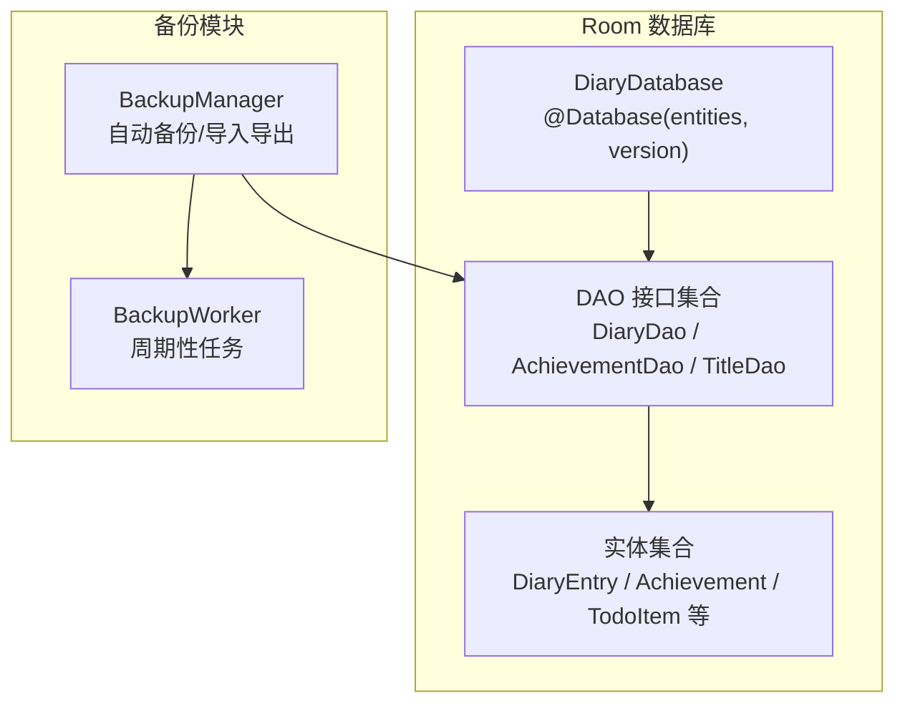
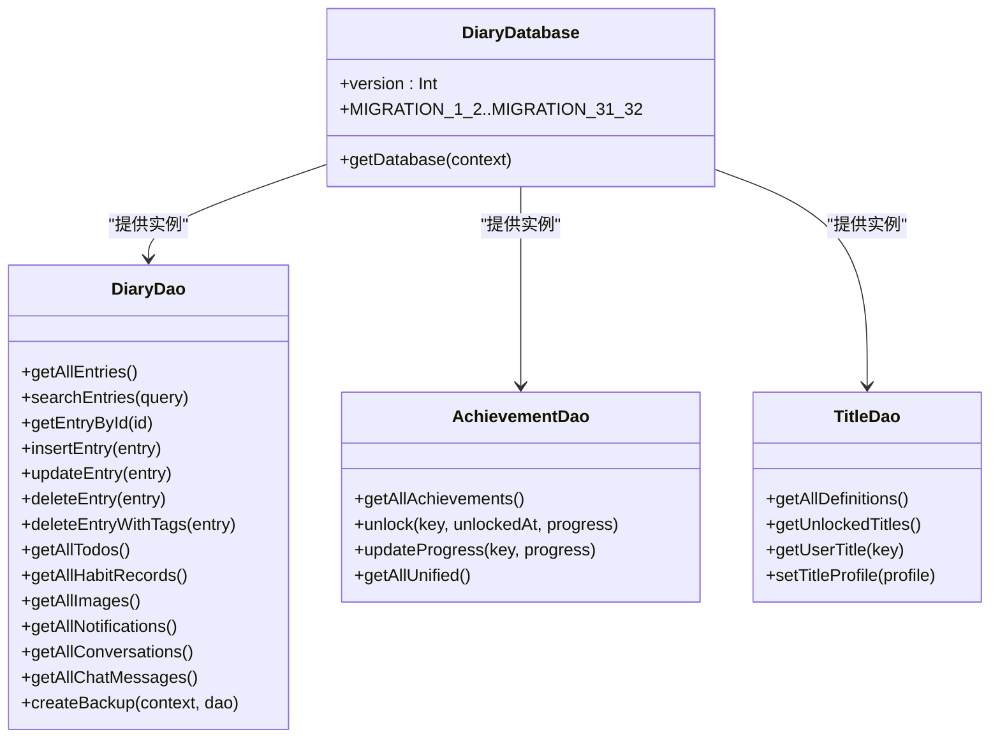
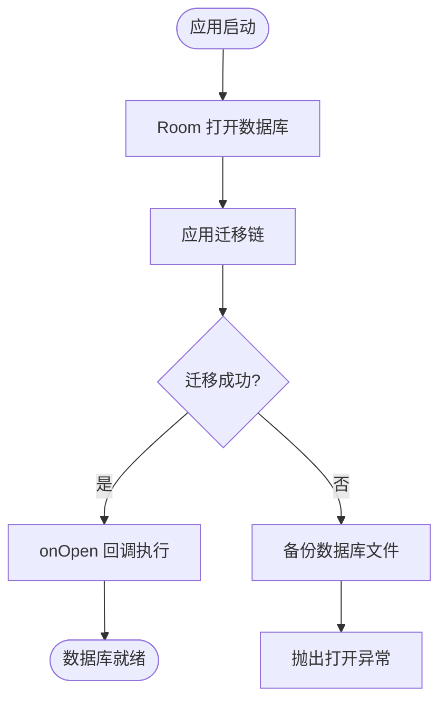
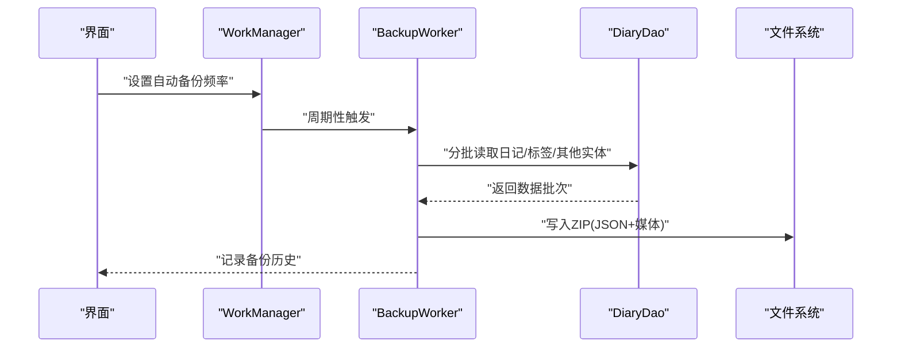
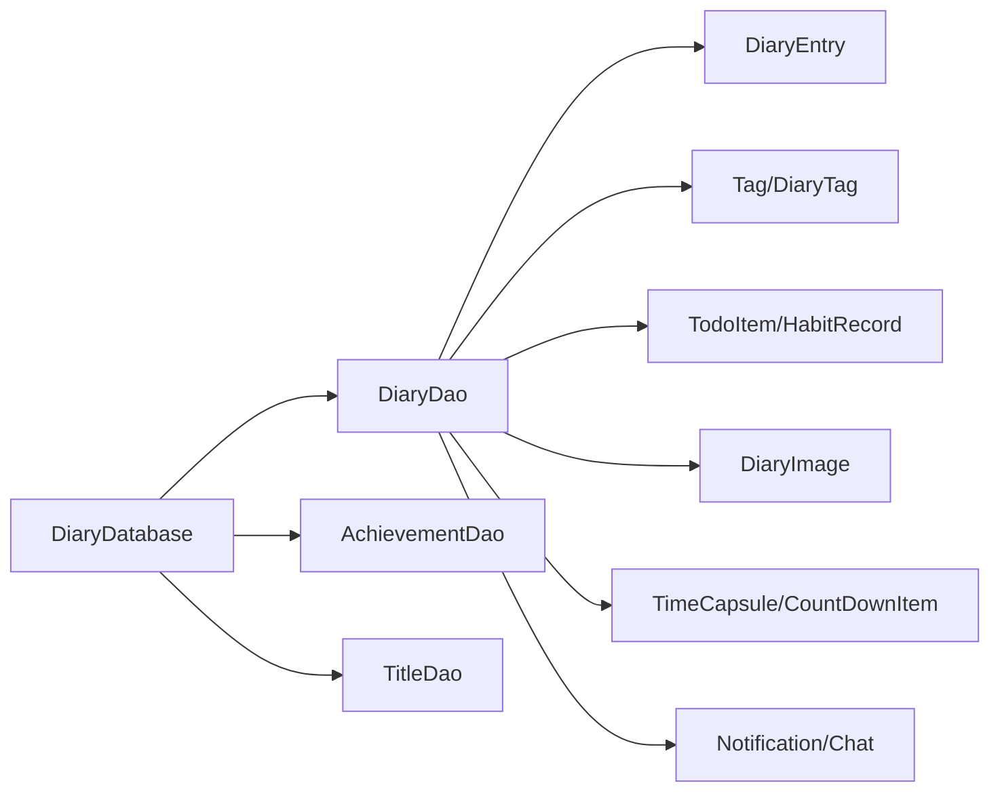

# 数据层设计

<cite>
**本文档引用的文件**
- [DiaryDatabase.kt](file://app/src/main/java/com/diary/app/data/DiaryDatabase.kt)
- [DiaryEntry.kt](file://app/src/main/java/com/diary/app/data/DiaryEntry.kt)
- [Achievement.kt](file://app/src/main/java/com/diary/app/data/Achievement.kt)
- [TodoItem.kt](file://app/src/main/java/com/diary/app/data/TodoItem.kt)
- [DiaryDao.kt](file://app/src/main/java/com/diary/app/data/DiaryDao.kt)
- [AchievementDao.kt](file://app/src/main/java/com/diary/app/data/AchievementDao.kt)
- [TitleDao.kt](file://app/src/main/java/com/diary/app/data/TitleDao.kt)
- [Tag.kt](file://app/src/main/java/com/diary/app/data/Tag.kt)
- [DiaryTag.kt](file://app/src/main/java/com/diary/app/data/DiaryTag.kt)
- [TrashEntry.kt](file://app/src/main/java/com/diary/app/data/TrashEntry.kt)
- [DiaryImage.kt](file://app/src/main/java/com/diary/app/data/DiaryImage.kt)
- [CountDownItem.kt](file://app/src/main/java/com/diary/app/data/CountDownItem.kt)
- [HabitRecord.kt](file://app/src/main/java/com/diary/app/data/HabitRecord.kt)
- [TimeCapsule.kt](file://app/src/main/java/com/diary/app/data/TimeCapsule.kt)
- [BackupManager.kt](file://app/src/main/java/com/diary/app/data/BackupManager.kt)
</cite>

## 目录
1. [简介](#简介)
2. [项目结构](#项目结构)
3. [核心组件](#核心组件)
4. [架构概览](#架构概览)
5. [详细组件分析](#详细组件分析)
6. [依赖分析](#依赖分析)
7. [性能考虑](#性能考虑)
8. [故障排除指南](#故障排除指南)
9. [结论](#结论)

## 简介
本文件系统性梳理 DiaryApp 的数据层设计，重点覆盖 Room 数据库架构、实体关系、DAO 接口定义与迁移策略；深入解析数据模型（如 DiaryEntry、Achievement、TodoItem 等）的设计意图与业务含义；阐述数据访问层的 Repository 模式实现要点（缓存、同步与一致性保障）；说明备份恢复机制的数据处理流程；并提供数据库性能优化建议与最佳实践。

## 项目结构
数据层采用典型的 Android Room 架构：以 @Database 聚合多个 @Entity，通过 DAO 提供类型安全的查询接口，并配合迁移策略与回调确保版本演进的安全性。同时，备份模块独立于数据库层，负责全量导出与增量导入。

图表来源
- [DiaryDatabase.kt:10-14](file://app/src/main/java/com/diary/app/data/DiaryDatabase.kt#L10-L14)
- [DiaryDao.kt:12-628](file://app/src/main/java/com/diary/app/data/DiaryDao.kt#L12-L628)
- [AchievementDao.kt:10-64](file://app/src/main/java/com/diary/app/data/AchievementDao.kt#L10-L64)
- [TitleDao.kt:10-75](file://app/src/main/java/com/diary/app/data/TitleDao.kt#L10-L75)
- [BackupManager.kt:418-439](file://app/src/main/java/com/diary/app/data/BackupManager.kt#L418-L439)

章节来源
- [DiaryDatabase.kt:10-14](file://app/src/main/java/com/diary/app/data/DiaryDatabase.kt#L10-L14)
- [DiaryDao.kt:12-628](file://app/src/main/java/com/diary/app/data/DiaryDao.kt#L12-L628)
- [AchievementDao.kt:10-64](file://app/src/main/java/com/diary/app/data/AchievementDao.kt#L10-L64)
- [TitleDao.kt:10-75](file://app/src/main/java/com/diary/app/data/TitleDao.kt#L10-L75)
- [BackupManager.kt:418-439](file://app/src/main/java/com/diary/app/data/BackupManager.kt#L418-L439)

## 核心组件
- 数据库与实体
  - DiaryDatabase：声明实体清单、版本号与迁移链，提供单例构建器与启动回调。
  - 实体：DiaryEntry、Achievement、TodoItem、Tag、DiaryTag、TrashEntry、DiaryImage、CountDownItem、HabitRecord、TimeCapsule 等。
- DAO 接口
  - DiaryDao：涵盖日记、标签、图片、待办、习惯、倒计时、胶囊、通知、聊天等全量查询与事务操作。
  - AchievementDao：成就系统统一查询与更新。
  - TitleDao：称号定义与用户获得状态管理。
- 备份模块
  - BackupManager：自动备份调度、全量导出、媒体打包、扫描导入源、历史记录管理。

章节来源
- [DiaryDatabase.kt:10-14](file://app/src/main/java/com/diary/app/data/DiaryDatabase.kt#L10-L14)
- [DiaryEntry.kt:8-32](file://app/src/main/java/com/diary/app/data/DiaryEntry.kt#L8-L32)
- [Achievement.kt:7-26](file://app/src/main/java/com/diary/app/data/Achievement.kt#L7-L26)
- [TodoItem.kt:7-89](file://app/src/main/java/com/diary/app/data/TodoItem.kt#L7-L89)
- [DiaryDao.kt:12-628](file://app/src/main/java/com/diary/app/data/DiaryDao.kt#L12-L628)
- [AchievementDao.kt:10-64](file://app/src/main/java/com/diary/app/data/AchievementDao.kt#L10-L64)
- [TitleDao.kt:10-75](file://app/src/main/java/com/diary/app/data/TitleDao.kt#L10-L75)
- [BackupManager.kt:25-46](file://app/src/main/java/com/diary/app/data/BackupManager.kt#L25-L46)

## 架构概览
Room 数据库通过 @Database 聚合实体，DAO 作为数据访问入口，支持 Flow 响应式流与事务批量操作。数据库版本 32，包含大量迁移脚本，覆盖索引、新增列、新增表、字段重命名与数据回填等场景。备份模块独立运行，按频率调度生成压缩包，内含 JSON 结构化数据与媒体资源。

图表来源
- [DiaryDatabase.kt:10-14](file://app/src/main/java/com/diary/app/data/DiaryDatabase.kt#L10-L14)
- [DiaryDao.kt:12-628](file://app/src/main/java/com/diary/app/data/DiaryDao.kt#L12-L628)
- [AchievementDao.kt:10-64](file://app/src/main/java/com/diary/app/data/AchievementDao.kt#L10-L64)
- [TitleDao.kt:10-75](file://app/src/main/java/com/diary/app/data/TitleDao.kt#L10-L75)

## 详细组件分析

### 实体关系与数据模型设计
- DiaryEntry（日记条目）
  - 设计要点：主键自增、标题/内容/纯文本、情绪等级、天气、位置坐标、收藏标记、创建/更新时间、写作时长秒数。
  - 业务含义：承载用户日记的核心内容与元数据，支持全文检索与预览列表。
- Achievement（成就）
  - 设计要点：统一成就系统字段（category、tier、iconEmoji、flavorText、isHidden、target），兼容旧系统数据迁移。
  - 业务含义：记录成就解锁状态与进度，支持按类别/层级聚合统计。
- TodoItem（待办事项）
  - 设计要点：父子关系、优先级、到期时间、提醒时间、标签、重复类型、进度、置顶、关联标签 ID 列表。
  - 业务含义：支撑任务/提醒/目标三类场景，支持树形子任务与提醒推送。
- Tag 与 DiaryTag（标签与交叉引用）
  - 设计要点：Tag 定义标签名、颜色、是否预设；DiaryTag 为日记-标签多对多交叉表，复合主键与索引。
  - 业务含义：实现灵活的日记分类与检索。
- TrashEntry（回收站条目）
  - 设计要点：保留原始条目关键字段与删除时间戳，便于恢复。
  - 业务含义：软删除与恢复流程的基础。
- DiaryImage（日记图片）
  - 设计要点：外键约束级联删除、本地路径、缩略图路径、媒体名称/引用、MIME 类型、文件大小、排序与创建时间。
  - 业务含义：与 DiaryEntry 一对多关联，支持媒体资源管理。
- CountDownItem（倒计时）
  - 设计要点：标题、目标时间、是否正向计时、颜色、是否年度重复、置顶、创建时间。
  - 业务含义：个人里程碑与纪念日提醒。
- HabitRecord（习惯记录）
  - 设计要点：唯一索引（todoId, recordDate）、来源（日记/手动/详情页）、摘要、关联日记条目。
  - 业务含义：追踪任务完成情况与统计。
- TimeCapsule（时光胶囊）
  - 设计要点：主题枚举、解锁时间、是否已读/已打开、解锁小时/分钟、附件图片。
  - 业务含义：未来某时刻阅读的历史内容。

章节来源
- [DiaryEntry.kt:8-32](file://app/src/main/java/com/diary/app/data/DiaryEntry.kt#L8-L32)
- [Achievement.kt:7-26](file://app/src/main/java/com/diary/app/data/Achievement.kt#L7-L26)
- [TodoItem.kt:7-89](file://app/src/main/java/com/diary/app/data/TodoItem.kt#L7-L89)
- [Tag.kt:6-13](file://app/src/main/java/com/diary/app/data/Tag.kt#L6-L13)
- [DiaryTag.kt:6-17](file://app/src/main/java/com/diary/app/data/DiaryTag.kt#L6-L17)
- [TrashEntry.kt:7-29](file://app/src/main/java/com/diary/app/data/TrashEntry.kt#L7-L29)
- [DiaryImage.kt:8-31](file://app/src/main/java/com/diary/app/data/DiaryImage.kt#L8-L31)
- [CountDownItem.kt:6-16](file://app/src/main/java/com/diary/app/data/CountDownItem.kt#L6-L16)
- [HabitRecord.kt:7-37](file://app/src/main/java/com/diary/app/data/HabitRecord.kt#L7-L37)
- [TimeCapsule.kt:6-29](file://app/src/main/java/com/diary/app/data/TimeCapsule.kt#L6-L29)

### DAO 接口与查询策略
- DiaryDao
  - 列表与预览：提供轻量投影（不包含富文本内容）避免内存溢出，支持 Flow 响应式刷新。
  - 搜索：基于标题/正文/标签的联合查询，支持实时搜索。
  - 事务：删除日记时级联删除标签与图片，保证数据一致性。
  - 统计与范围查询：按日期范围、月份+日等维度查询，支持“同日回忆”功能。
  - 媒体与存储：统计媒体文件大小与数量，支持清理过期数据。
- AchievementDao
  - 支持按 key 查询、解锁更新、进度更新、按类别/层级聚合查询。
- TitleDao
  - 称号定义与用户获得状态关联查询，支持当前展示配置与最近解锁查询。

章节来源
- [DiaryDao.kt:12-628](file://app/src/main/java/com/diary/app/data/DiaryDao.kt#L12-L628)
- [AchievementDao.kt:10-64](file://app/src/main/java/com/diary/app/data/AchievementDao.kt#L10-L64)
- [TitleDao.kt:10-75](file://app/src/main/java/com/diary/app/data/TitleDao.kt#L10-L75)

### 数据库迁移策略
- 版本演进
  - 从 v1→v32 的完整迁移链，覆盖新增列（如 isFavorite、writing_duration_seconds）、新增表（如 todo_items、diary_images、time_capsules、notifications、chat_messages/conversations、achievements、title_definitions/user_titles/title_profile 等）、索引优化、字段重命名（iconEmoji→iconName）与数据回填。
- 启动回调
  - onOpen 回调中执行索引清理与媒体回填逻辑，确保数据库状态一致。
- 失败保护
  - 数据库打开异常时自动备份文件（含 WAL/SHM/Journal），防止数据损坏导致应用崩溃。

图表来源
- [DiaryDatabase.kt:724-771](file://app/src/main/java/com/diary/app/data/DiaryDatabase.kt#L724-L771)
- [DiaryDatabase.kt:744-767](file://app/src/main/java/com/diary/app/data/DiaryDatabase.kt#L744-L767)

章节来源
- [DiaryDatabase.kt:29-710](file://app/src/main/java/com/diary/app/data/DiaryDatabase.kt#L29-L710)
- [DiaryDatabase.kt:724-771](file://app/src/main/java/com/diary/app/data/DiaryDatabase.kt#L724-L771)

### 备份恢复机制
- 自动备份
  - 支持多种频率（每日/每周/每月等），通过 WorkManager 定时触发 BackupWorker。
  - 生成压缩包（.diarybackup），内含 JSON 导出与媒体资源。
- 导出流程
  - 分批读取日记条目（避免 OOM），合并标签映射，导出待办、倒计时、胶囊、回收站、习惯记录、通知、聊天会话与消息等。
  - 媒体打包：扫描引用的媒体名称并逐项写入 ZIP。
- 导入流程
  - 扫描可导入备份文件（支持 Documents/DiaryApp 与 Downloads），读取 ZIP 内 JSON 或直接 JSON 文件，解析为导入对象。
- 历史管理
  - 记录备份文件名、路径、时间戳、条目数与大小，支持重命名、删除与上限控制。

图表来源
- [BackupManager.kt:418-439](file://app/src/main/java/com/diary/app/data/BackupManager.kt#L418-L439)
- [BackupManager.kt:458-619](file://app/src/main/java/com/diary/app/data/BackupManager.kt#L458-L619)
- [BackupManager.kt:365-396](file://app/src/main/java/com/diary/app/data/BackupManager.kt#L365-L396)

章节来源
- [BackupManager.kt:25-46](file://app/src/main/java/com/diary/app/data/BackupManager.kt#L25-L46)
- [BackupManager.kt:131-140](file://app/src/main/java/com/diary/app/data/BackupManager.kt#L131-L140)
- [BackupManager.kt:418-439](file://app/src/main/java/com/diary/app/data/BackupManager.kt#L418-L439)
- [BackupManager.kt:458-619](file://app/src/main/java/com/diary/app/data/BackupManager.kt#L458-L619)
- [BackupManager.kt:365-396](file://app/src/main/java/com/diary/app/data/BackupManager.kt#L365-L396)

## 依赖分析
- 组件耦合
  - DiaryDatabase 作为工厂与版本管理中心，集中提供 DAO 实例。
  - DAO 对实体存在强依赖，且跨表查询频繁（标签、图片、习惯、通知、聊天）。
- 外部依赖
  - WorkManager 用于定时备份。
  - Gson 用于 JSON 序列化/反序列化。
  - Android 存储 API（MediaStore/Q）用于跨版本文件读写。
- 潜在循环依赖
  - 当前结构为单向依赖（Database→DAO→Entities），未见循环。

图表来源
- [DiaryDatabase.kt:10-14](file://app/src/main/java/com/diary/app/data/DiaryDatabase.kt#L10-L14)
- [DiaryDao.kt:12-628](file://app/src/main/java/com/diary/app/data/DiaryDao.kt#L12-L628)

章节来源
- [DiaryDatabase.kt:10-14](file://app/src/main/java/com/diary/app/data/DiaryDatabase.kt#L10-L14)
- [DiaryDao.kt:12-628](file://app/src/main/java/com/diary/app/data/DiaryDao.kt#L12-L628)

## 性能考虑
- 查询优化
  - 使用索引覆盖常见过滤条件（createdAt、isFavorite、moodLevel、dueDate、isCompleted、category、reminderTime、parentId、tags、deletedAt 等）。
  - 列表视图使用轻量投影（DiaryPreview）避免加载富文本内容。
  - 分页/批处理读取（getEntriesBatch/getEntriesBatchForExport）降低内存占用。
- 写入与事务
  - 批量删除/插入使用事务或批量接口，减少 IO 次数。
  - 级联删除（外键）确保一致性，避免悬挂数据。
- 备份性能
  - 备份采用流式写入 ZIP，避免一次性加载全部媒体到内存。
  - 参考媒体名称扫描采用分批策略，避免长时间阻塞。
- 索引维护
  - 迁移中新增索引需评估写入成本与查询收益，避免过度索引。
- 错误恢复
  - 数据库打开失败自动备份，保障数据安全与应用可用性。

[本节为通用性能指导，无需特定文件引用]

## 故障排除指南
- 数据库打开失败
  - 现象：应用启动时报错，无法打开数据库。
  - 处理：系统会自动备份数据库文件（含 WAL/SHM/Journal），并在日志中记录备份路径，随后抛出异常。
  - 建议：检查迁移脚本与回调逻辑，确认索引与回填步骤正确。
- 备份失败
  - 现象：自动备份未生成或历史记录为空。
  - 处理：检查存储权限（Android 11+ 需要存储管理器授权），确认备份目录可写。
  - 建议：查看 WorkManager 调度状态与日志输出。
- 导入异常
  - 现象：扫描不到备份文件或导入解析失败。
  - 处理：确认文件名前缀与扩展名符合规范，检查 ZIP 内 JSON 结构完整性。
  - 建议：优先使用外部备份目录（Documents/DiaryApp），回退到 Downloads。

章节来源
- [DiaryDatabase.kt:744-767](file://app/src/main/java/com/diary/app/data/DiaryDatabase.kt#L744-L767)
- [BackupManager.kt:109-115](file://app/src/main/java/com/diary/app/data/BackupManager.kt#L109-L115)
- [BackupManager.kt:772-800](file://app/src/main/java/com/diary/app/data/BackupManager.kt#L772-L800)

## 结论
DiaryApp 的数据层以 Room 为核心，通过完善的实体/DAO 设计与版本迁移策略，实现了日记、标签、待办、习惯、媒体、通知、聊天、成就与称号等多维业务的统一管理。备份模块独立可靠，支持自动调度与全量导出，兼顾性能与安全性。建议在后续迭代中持续关注索引策略与批处理性能，确保大规模数据场景下的稳定性与响应速度。