# 数据库架构设计

<cite>
**本文档引用的文件**
- [DiaryDatabase.kt](file://app/src/main/java/com/diary/app/data/DiaryDatabase.kt)
- [DiaryEntry.kt](file://app/src/main/java/com/diary/app/data/DiaryEntry.kt)
- [DiaryDao.kt](file://app/src/main/java/com/diary/app/data/DiaryDao.kt)
- [DiaryTag.kt](file://app/src/main/java/com/diary/app/data/DiaryTag.kt)
- [Tag.kt](file://app/src/main/java/com/diary/app/data/Tag.kt)
- [Achievement.kt](file://app/src/main/java/com/diary/app/data/Achievement.kt)
- [AchievementDao.kt](file://app/src/main/java/com/diary/app/data/AchievementDao.kt)
- [TitleDao.kt](file://app/src/main/java/com/diary/app/data/TitleDao.kt)
- [TitleSeedData.kt](file://app/src/main/java/com/diary/app/data/TitleSeedData.kt)
- [ChatMessageEntity.kt](file://app/src/main/java/com/diary/app/data/ChatMessageEntity.kt)
- [ChatConversationEntity.kt](file://app/src/main/java/com/diary/app/data/ChatConversationEntity.kt)
</cite>

## 目录
1. [简介](#简介)
2. [项目结构](#项目结构)
3. [核心组件](#核心组件)
4. [架构概览](#架构概览)
5. [详细组件分析](#详细组件分析)
6. [依赖关系分析](#依赖关系分析)
7. [性能考虑](#性能考虑)
8. [故障排除指南](#故障排除指南)
9. [结论](#结论)

## 简介

DiaryApp采用Room数据库作为本地数据存储解决方案，支持复杂的日记管理、标签系统、成就系统和聊天功能。该数据库架构设计体现了现代Android应用的最佳实践，包括完整的数据库版本管理、实体关系设计和索引策略。

## 项目结构

DiaryApp的数据库层采用基于实体的分层架构，主要包含以下核心组件：

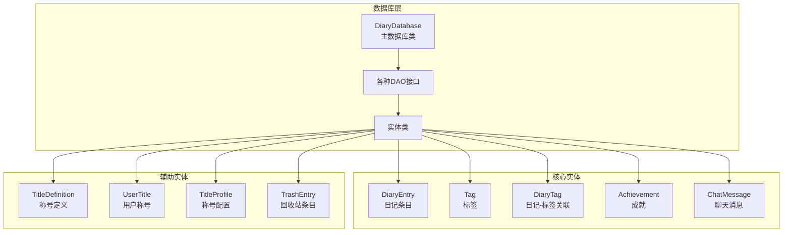

**图表来源**
- [DiaryDatabase.kt:10-14](file://app/src/main/java/com/diary/app/data/DiaryDatabase.kt#L10-L14)
- [DiaryEntry.kt:8-15](file://app/src/main/java/com/diary/app/data/DiaryEntry.kt#L8-L15)

**章节来源**
- [DiaryDatabase.kt:10-14](file://app/src/main/java/com/diary/app/data/DiaryDatabase.kt#L10-L14)
- [DiaryEntry.kt:8-15](file://app/src/main/java/com/diary/app/data/DiaryEntry.kt#L8-L15)

## 核心组件

### 主数据库类配置

DiaryDatabase是Room数据库的核心入口点，采用单例模式确保线程安全和资源效率：

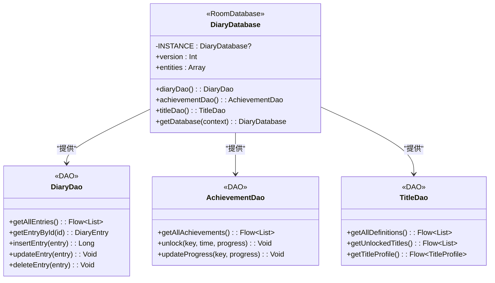

**图表来源**
- [DiaryDatabase.kt:15-18](file://app/src/main/java/com/diary/app/data/DiaryDatabase.kt#L15-L18)
- [DiaryDao.kt:12-13](file://app/src/main/java/com/diary/app/data/DiaryDao.kt#L12-L13)
- [AchievementDao.kt:10-11](file://app/src/main/java/com/diary/app/data/AchievementDao.kt#L10-L11)
- [TitleDao.kt:10-11](file://app/src/main/java/com/diary/app/data/TitleDao.kt#L10-L11)

### 实体关系设计

数据库采用规范化设计，通过外键和索引确保数据完整性和查询性能：

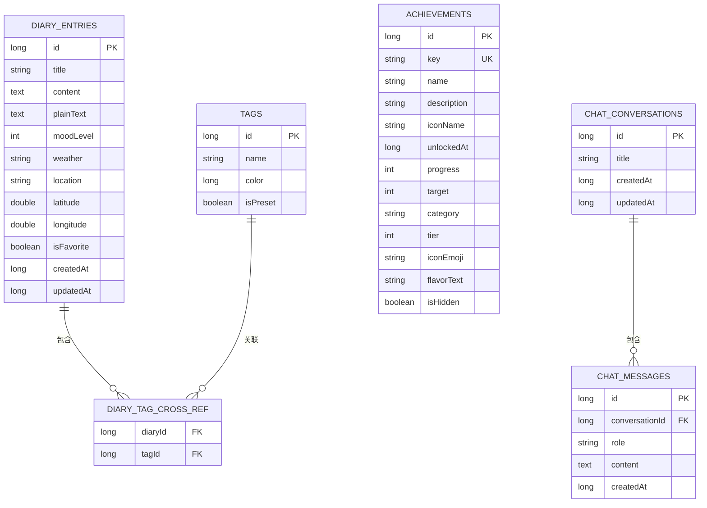

**图表来源**
- [DiaryEntry.kt:16-32](file://app/src/main/java/com/diary/app/data/DiaryEntry.kt#L16-L32)
- [Tag.kt:7-13](file://app/src/main/java/com/diary/app/data/Tag.kt#L7-L13)
- [DiaryTag.kt:14-17](file://app/src/main/java/com/diary/app/data/DiaryTag.kt#L14-L17)
- [Achievement.kt:11-26](file://app/src/main/java/com/diary/app/data/Achievement.kt#L11-L26)
- [ChatMessageEntity.kt:20-26](file://app/src/main/java/com/diary/app/data/ChatMessageEntity.kt#L20-L26)

**章节来源**
- [DiaryDatabase.kt:10-14](file://app/src/main/java/com/diary/app/data/DiaryDatabase.kt#L10-L14)
- [DiaryEntry.kt:8-15](file://app/src/main/java/com/diary/app/data/DiaryEntry.kt#L8-L15)
- [Tag.kt:6-13](file://app/src/main/java/com/diary/app/data/Tag.kt#L6-L13)
- [DiaryTag.kt:6-17](file://app/src/main/java/com/diary/app/data/DiaryTag.kt#L6-L17)

## 架构概览

DiaryApp的数据库架构采用了现代化的设计模式，确保了可扩展性和维护性：

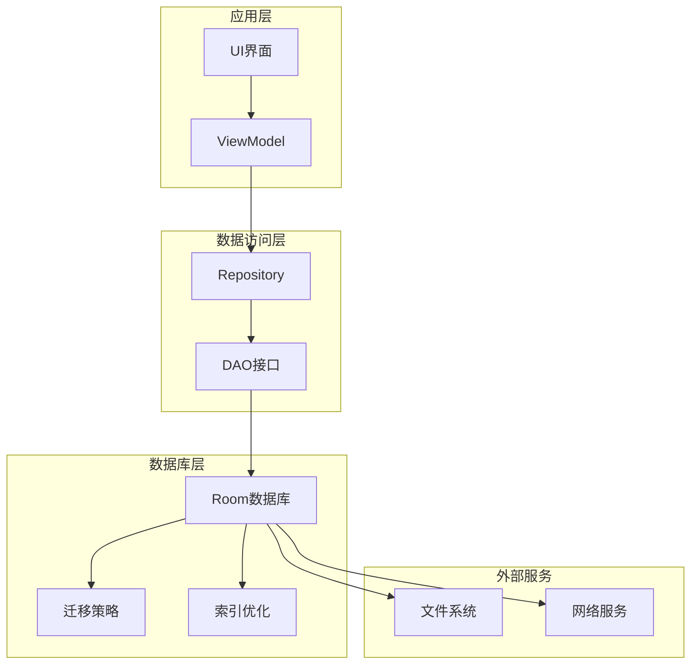

**图表来源**
- [DiaryDatabase.kt:712-771](file://app/src/main/java/com/diary/app/data/DiaryDatabase.kt#L712-L771)
- [DiaryDao.kt:12-13](file://app/src/main/java/com/diary/app/data/DiaryDao.kt#L12-L13)

## 详细组件分析

### 数据库版本管理

DiaryDatabase当前版本为32，包含了从版本1到32的完整迁移链路：

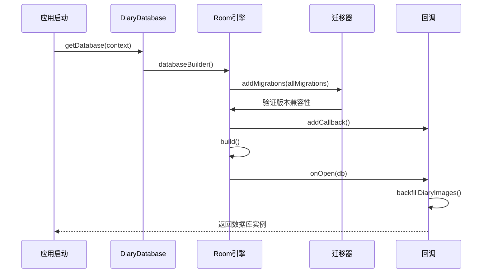

**图表来源**
- [DiaryDatabase.kt:712-771](file://app/src/main/java/com/diary/app/data/DiaryDatabase.kt#L712-L771)
- [DiaryDatabase.kt:724-734](file://app/src/main/java/com/diary/app/data/DiaryDatabase.kt#L724-L734)

### 索引策略分析

数据库采用了多层次的索引策略来优化查询性能：

#### 核心实体索引

| 实体 | 索引列 | 用途 | 性能影响 |
|------|--------|------|----------|
| diary_entries | createdAt | 时间排序查询 | O(log n) |
| diary_entries | isFavorite | 收藏筛选 | O(log n) |
| diary_entries | moodLevel | 情绪筛选 | O(log n) |
| diary_tag_cross_ref | tagId | 标签查询 | O(log n) |
| diary_tag_cross_ref | diaryId | 日记查询 | O(log n) |
| todo_items | dueDate | 待办事项筛选 | O(log n) |
| todo_items | isCompleted | 完成状态筛选 | O(log n) |
| achievements | key | 唯一标识查询 | O(1) |

#### 复合索引设计

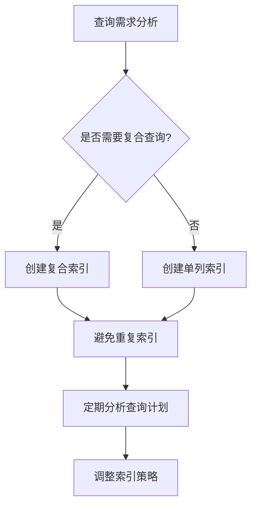

**图表来源**
- [DiaryEntry.kt:10-14](file://app/src/main/java/com/diary/app/data/DiaryEntry.kt#L10-L14)
- [DiaryTag.kt:9-12](file://app/src/main/java/com/diary/app/data/DiaryTag.kt#L9-L12)
- [Achievement.kt:9](file://app/src/main/java/com/diary/app/data/Achievement.kt#L9)

**章节来源**
- [DiaryDatabase.kt:29-82](file://app/src/main/java/com/diary/app/data/DiaryDatabase.kt#L29-L82)
- [DiaryEntry.kt:10-14](file://app/src/main/java/com/diary/app/data/DiaryEntry.kt#L10-L14)
- [DiaryTag.kt:9-12](file://app/src/main/java/com/diary/app/data/DiaryTag.kt#L9-L12)

### 数据库初始化流程

数据库初始化过程包含了完整的错误处理和备份机制：

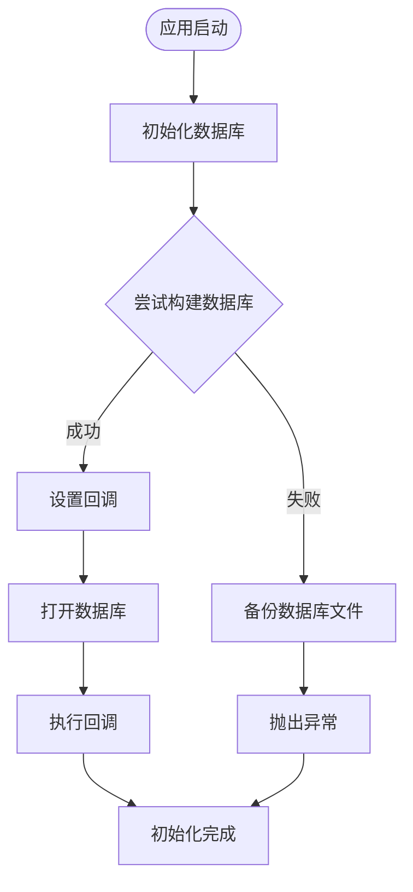

**图表来源**
- [DiaryDatabase.kt:736-771](file://app/src/main/java/com/diary/app/data/DiaryDatabase.kt#L736-L771)
- [DiaryDatabase.kt:724-734](file://app/src/main/java/com/diary/app/data/DiaryDatabase.kt#L724-L734)

### 单例模式实现

DiaryDatabase采用双重检查锁定的单例模式：

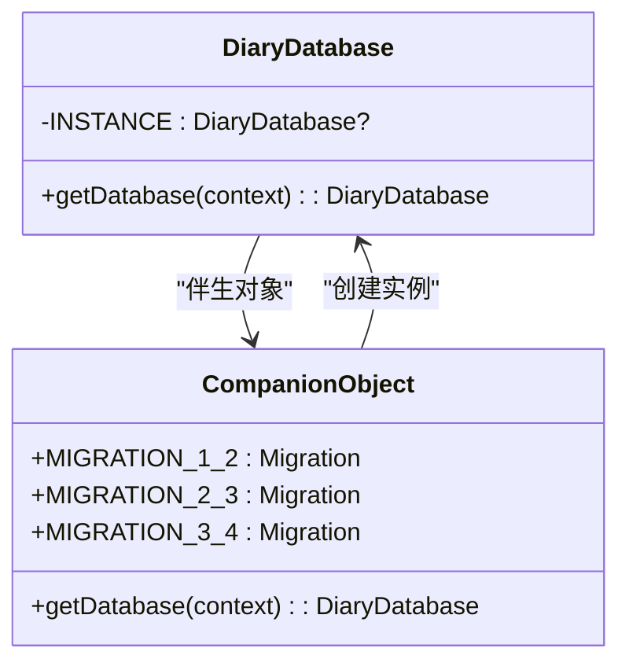

**图表来源**
- [DiaryDatabase.kt:26-27](file://app/src/main/java/com/diary/app/data/DiaryDatabase.kt#L26-L27)
- [DiaryDatabase.kt:712-771](file://app/src/main/java/com/diary/app/data/DiaryDatabase.kt#L712-L771)

**章节来源**
- [DiaryDatabase.kt:26-27](file://app/src/main/java/com/diary/app/data/DiaryDatabase.kt#L26-L27)
- [DiaryDatabase.kt:712-771](file://app/src/main/java/com/diary/app/data/DiaryDatabase.kt#L712-L771)

### 异常处理机制

数据库提供了完善的异常处理和数据恢复机制：

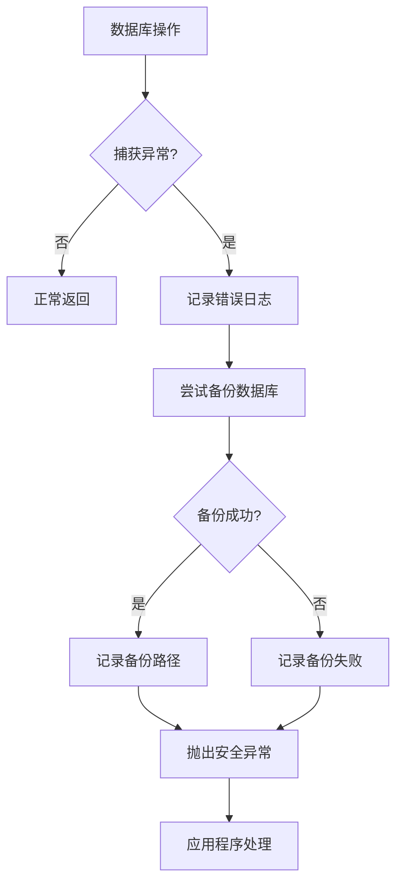

**图表来源**
- [DiaryDatabase.kt:744-767](file://app/src/main/java/com/diary/app/data/DiaryDatabase.kt#L744-L767)

**章节来源**
- [DiaryDatabase.kt:744-767](file://app/src/main/java/com/diary/app/data/DiaryDatabase.kt#L744-L767)

### 数据完整性检查

数据库启动时执行多项完整性检查：

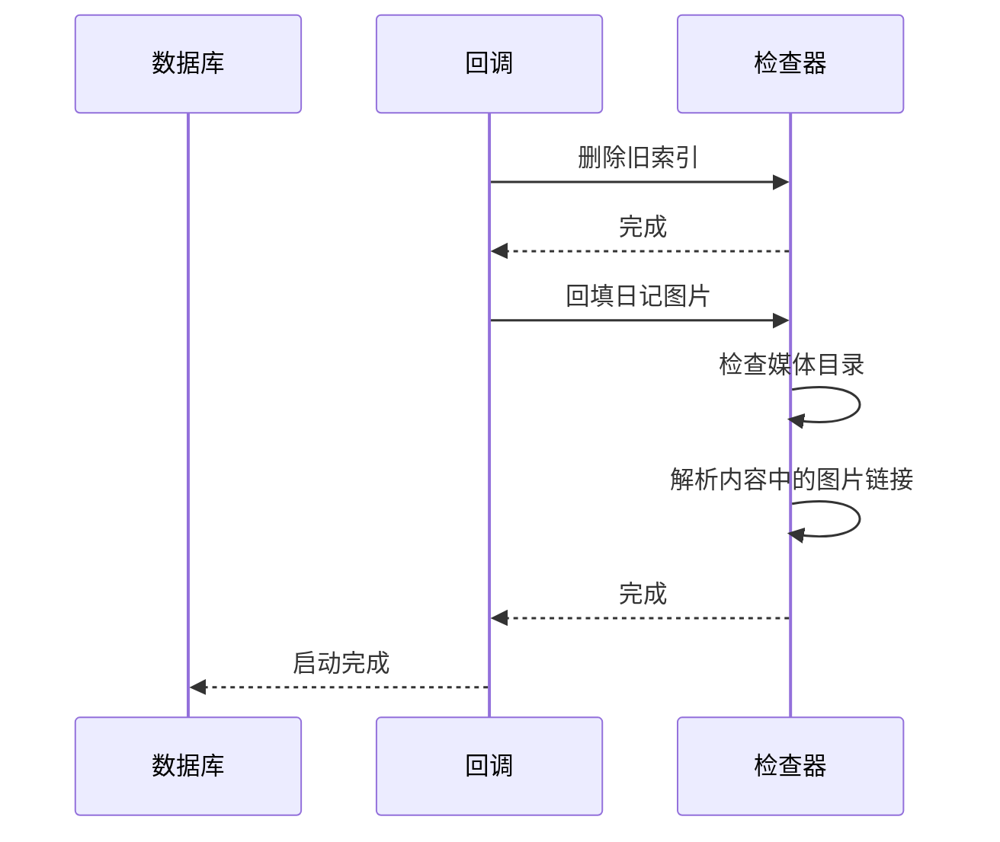

**图表来源**
- [DiaryDatabase.kt:724-734](file://app/src/main/java/com/diary/app/data/DiaryDatabase.kt#L724-L734)
- [DiaryDatabase.kt:773-800](file://app/src/main/java/com/diary/app/data/DiaryDatabase.kt#L773-L800)

**章节来源**
- [DiaryDatabase.kt:724-734](file://app/src/main/java/com/diary/app/data/DiaryDatabase.kt#L724-L734)
- [DiaryDatabase.kt:773-800](file://app/src/main/java/com/diary/app/data/DiaryDatabase.kt#L773-L800)

## 依赖关系分析

### 数据库实体依赖图

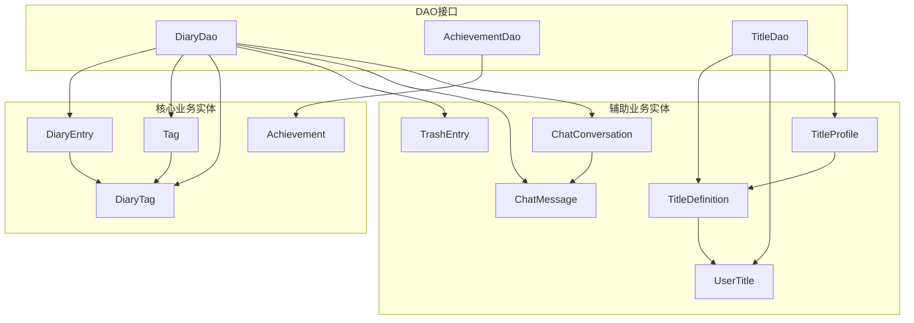

**图表来源**
- [DiaryDao.kt:12-13](file://app/src/main/java/com/diary/app/data/DiaryDao.kt#L12-L13)
- [AchievementDao.kt:10-11](file://app/src/main/java/com/diary/app/data/AchievementDao.kt#L10-L11)
- [TitleDao.kt:10-11](file://app/src/main/java/com/diary/app/data/TitleDao.kt#L10-L11)

### 查询复杂度分析

| 查询类型 | 复杂度 | 优化策略 |
|----------|--------|----------|
| 单表查询 | O(log n) | 使用适当索引 |
| 多表连接 | O(n log n) | 优化JOIN条件 |
| 全文搜索 | O(n) | 使用LIKE优化 |
| 聚合查询 | O(n) | 使用索引覆盖 |
| 分页查询 | O(k log n) | 使用LIMIT/OFFSET |

**章节来源**
- [DiaryDao.kt:14-15](file://app/src/main/java/com/diary/app/data/DiaryDao.kt#L14-L15)
- [DiaryDao.kt:116-117](file://app/src/main/java/com/diary/app/data/DiaryDao.kt#L116-L117)

## 性能考虑

### 查询优化策略

1. **索引优化**
   - 为高频查询字段建立适当索引
   - 避免过度索引导致写入性能下降
   - 定期分析查询计划和索引使用情况

2. **批量操作**
   - 使用事务批量插入和更新
   - 避免频繁的小事务操作
   - 合理控制批量大小

3. **内存管理**
   - 使用流式查询避免大对象加载
   - 实现轻量级投影减少内存占用
   - 及时释放游标和连接

### 存储优化

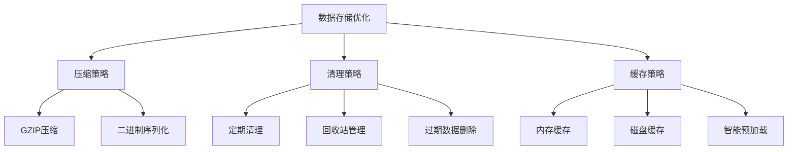

**章节来源**
- [DiaryDao.kt:18-19](file://app/src/main/java/com/diary/app/data/DiaryDao.kt#L18-L19)
- [DiaryDao.kt:631-643](file://app/src/main/java/com/diary/app/data/DiaryDao.kt#L631-L643)

## 故障排除指南

### 常见问题诊断

1. **数据库迁移失败**
   - 检查迁移SQL语法
   - 验证数据类型兼容性
   - 确认索引创建顺序

2. **查询性能问题**
   - 分析SQLite查询计划
   - 检查索引使用情况
   - 优化WHERE和JOIN条件

3. **内存泄漏**
   - 检查Flow订阅生命周期
   - 确认游标正确关闭
   - 验证DAO接口实现

### 调试工具

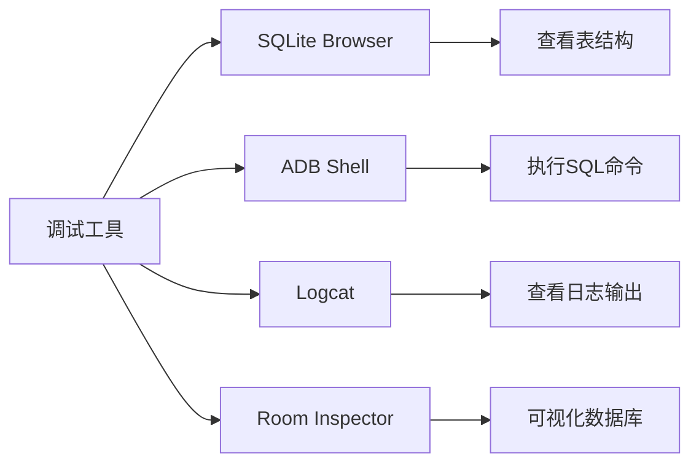

**章节来源**
- [DiaryDatabase.kt:744-767](file://app/src/main/java/com/diary/app/data/DiaryDatabase.kt#L744-L767)

## 结论

DiaryApp的数据库架构设计体现了现代Android应用开发的最佳实践。通过合理的实体关系设计、完善的索引策略和健壮的迁移机制，该架构能够有效支持复杂的功能需求同时保持良好的性能表现。

关键优势包括：
- 完整的版本管理支持
- 优化的查询性能设计  
- 健壮的异常处理机制
- 可扩展的架构设计
- 良好的数据完整性保证

未来可以考虑的改进方向：
- 实现更细粒度的缓存策略
- 优化大数据量场景下的查询性能
- 增强数据同步和备份机制
- 实现更智能的索引维护策略