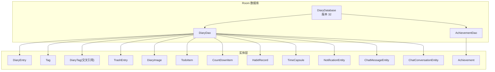
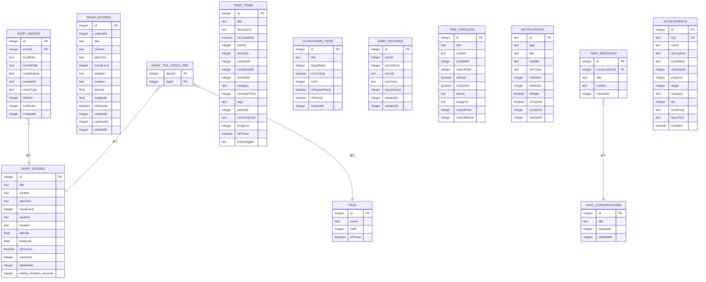
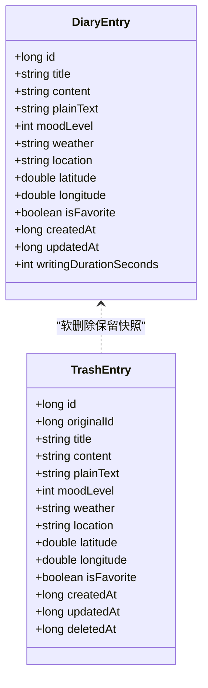
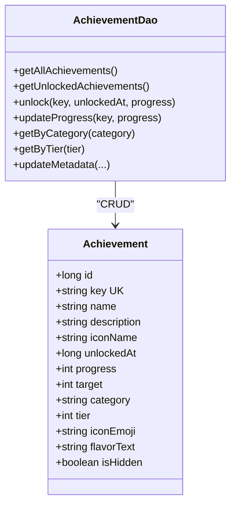
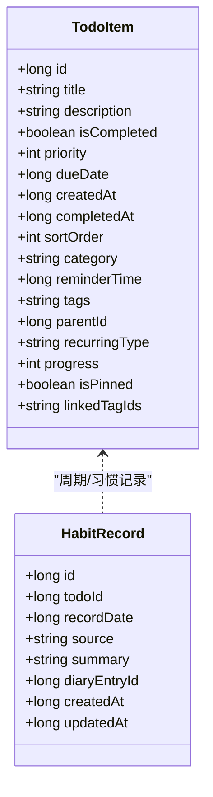
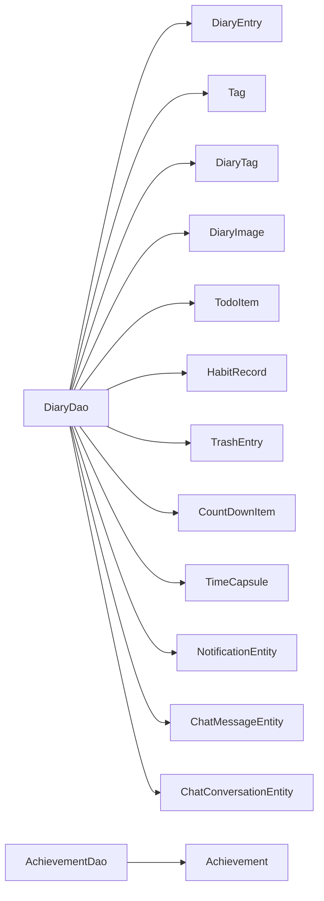

# 数据模型设计

<cite>
**本文引用的文件**   
- [DiaryEntry.kt](file://app/src/main/java/com/diary/app/data/DiaryEntry.kt)
- [Achievement.kt](file://app/src/main/java/com/diary/app/data/Achievement.kt)
- [TodoItem.kt](file://app/src/main/java/com/diary/app/data/TodoItem.kt)
- [DiaryDao.kt](file://app/src/main/java/com/diary/app/data/DiaryDao.kt)
- [AchievementDao.kt](file://app/src/main/java/com/diary/app/data/AchievementDao.kt)
- [DiaryDatabase.kt](file://app/src/main/java/com/diary/app/data/DiaryDatabase.kt)
- [Tag.kt](file://app/src/main/java/com/diary/app/data/Tag.kt)
- [DiaryTag.kt](file://app/src/main/java/com/diary/app/data/DiaryTag.kt)
- [TrashEntry.kt](file://app/src/main/java/com/diary/app/data/TrashEntry.kt)
- [DiaryImage.kt](file://app/src/main/java/com/diary/app/data/DiaryImage.kt)
- [CountDownItem.kt](file://app/src/main/java/com/diary/app/data/CountDownItem.kt)
- [HabitRecord.kt](file://app/src/main/java/com/diary/app/data/HabitRecord.kt)
- [TimeCapsule.kt](file://app/src/main/java/com/diary/app/data/TimeCapsule.kt)
- [NotificationEntity.kt](file://app/src/main/java/com/diary/app/data/NotificationEntity.kt)
- [ChatMessageEntity.kt](file://app/src/main/java/com/diary/app/data/ChatMessageEntity.kt)
- [ChatConversationEntity.kt](file://app/src/main/java/com/diary/app/data/ChatConversationEntity.kt)
</cite>

## 目录
1. [简介](#简介)
2. [项目结构](#项目结构)
3. [核心组件](#核心组件)
4. [架构概览](#架构概览)
5. [详细组件分析](#详细组件分析)
6. [依赖分析](#依赖分析)
7. [性能考虑](#性能考虑)
8. [故障排除指南](#故障排除指南)
9. [结论](#结论)
10. [附录](#附录)

## 简介
本文件系统性梳理 DiaryApp 的数据模型设计，聚焦以下核心实体：日记实体 DiaryEntry、成就实体 Achievement、待办事项实体 TodoItem，并阐明它们之间的关系映射、索引与约束、验证规则、默认值、生命周期管理与软删除策略、数据完整性保障以及最佳实践与扩展建议。文档同时结合 DAO 层接口与数据库版本迁移脚本，帮助读者理解端到端的数据流与演进路径。

## 项目结构
数据模型位于应用模块的 data 包内，采用 Room 实体与 DAO 接口分离的设计，配合数据库版本迁移脚本确保跨版本兼容与数据安全。

图表来源
- [DiaryDatabase.kt:10-18](file://app/src/main/java/com/diary/app/data/DiaryDatabase.kt#L10-L18)
- [DiaryDao.kt:12-628](file://app/src/main/java/com/diary/app/data/DiaryDao.kt#L12-L628)
- [AchievementDao.kt:10-64](file://app/src/main/java/com/diary/app/data/AchievementDao.kt#L10-L64)

章节来源
- [DiaryDatabase.kt:10-18](file://app/src/main/java/com/diary/app/data/DiaryDatabase.kt#L10-L18)
- [DiaryDao.kt:12-628](file://app/src/main/java/com/diary/app/data/DiaryDao.kt#L12-L628)
- [AchievementDao.kt:10-64](file://app/src/main/java/com/diary/app/data/AchievementDao.kt#L10-L64)

## 核心组件
本节概述三个关键实体的设计要点、字段语义与约束，以及与 DAO 的交互方式。

- 日记实体 DiaryEntry
  - 表名与索引：表名为 diary_entries；索引覆盖 createdAt、isFavorite、moodLevel，便于排序与筛选。
  - 关键字段与约束：
    - 主键自增 id。
    - 标题与内容字段，内容为富文本 JSON 结构，提供纯文本摘要用于预览与搜索。
    - 心情等级与天气、位置经纬度等元数据。
    - 收藏标记、创建/更新时间戳、写作时长秒数可空。
  - 默认值：未显式标注非空的字段均允许为空；时间戳默认使用当前毫秒值。
  - 验证规则：字段层面未见显式校验注解，业务侧通过 DAO 查询与 UI 输入控制保证有效性。
  - 生命周期：支持软删除（进入回收站），DAO 提供批量清理与按时间清理能力。
  - 参考路径：[DiaryEntry.kt:8-32](file://app/src/main/java/com/diary/app/data/DiaryEntry.kt#L8-L32)

- 成就实体 Achievement
  - 表名与索引：表名为 achievements；key 建唯一索引，确保成就键唯一。
  - 关键字段与约束：
    - 主键自增 id。
    - key 作为统一标识，name、description、iconName 等用于展示。
    - 解锁时间戳、进度与目标值，统一成就体系新增 category、tier、iconEmoji、flavorText、isHidden 等字段。
  - 默认值：progress 默认 0，target 默认 1；统一体系字段提供合理默认。
  - 验证规则：key 唯一性由数据库约束与 DAO 更新策略保障。
  - 生命周期：DAO 提供按 key 解锁、更新进度、分类/层级查询等操作。
  - 参考路径：[Achievement.kt:7-26](file://app/src/main/java/com/diary/app/data/Achievement.kt#L7-L26)

- 待办事项实体 TodoItem
  - 表名与索引：表名为 todo_items；索引覆盖 dueDate、isCompleted、category、reminderTime、parentId、tags，支撑高效查询与排序。
  - 关键字段与约束：
    - 主键自增 id。
    - 标题、描述、完成状态、优先级、到期时间、创建时间、完成时间、排序、分类、提醒时间、标签、父任务、周期类型、进度百分比、置顶标记、关联日记标签 ID 列表。
  - 默认值：分类默认“task”，周期类型默认“none”，置顶默认 false，进度 0。
  - 验证规则：DAO 提供按分类、标签、日期范围、完成状态等查询，UI 层负责输入校验。
  - 生命周期：支持子任务（parentId）、周期任务（recurringType）、置顶（isPinned）、进度跟踪（progress）。
  - 参考路径：[TodoItem.kt:7-89](file://app/src/main/java/com/diary/app/data/TodoItem.kt#L7-L89)

章节来源
- [DiaryEntry.kt:8-32](file://app/src/main/java/com/diary/app/data/DiaryEntry.kt#L8-L32)
- [Achievement.kt:7-26](file://app/src/main/java/com/diary/app/data/Achievement.kt#L7-L26)
- [TodoItem.kt:7-89](file://app/src/main/java/com/diary/app/data/TodoItem.kt#L7-L89)

## 架构概览
下图展示数据库版本 32 的实体关系与外键约束，体现软删除、媒体关联、聊天与成就等扩展模块：

图表来源
- [DiaryDatabase.kt:10-18](file://app/src/main/java/com/diary/app/data/DiaryDatabase.kt#L10-L18)
- [DiaryImage.kt:8-31](file://app/src/main/java/com/diary/app/data/DiaryImage.kt#L8-L31)
- [ChatMessageEntity.kt:8-26](file://app/src/main/java/com/diary/app/data/ChatMessageEntity.kt#L8-L26)
- [DiaryTag.kt:6-17](file://app/src/main/java/com/diary/app/data/DiaryTag.kt#L6-L17)
- [Tag.kt:6-13](file://app/src/main/java/com/diary/app/data/Tag.kt#L6-L13)
- [TrashEntry.kt:7-29](file://app/src/main/java/com/diary/app/data/TrashEntry.kt#L7-L29)
- [CountDownItem.kt:6-16](file://app/src/main/java/com/diary/app/data/CountDownItem.kt#L6-L16)
- [HabitRecord.kt:7-37](file://app/src/main/java/com/diary/app/data/HabitRecord.kt#L7-L37)
- [TimeCapsule.kt:16-29](file://app/src/main/java/com/diary/app/data/TimeCapsule.kt#L16-L29)
- [NotificationEntity.kt:6-19](file://app/src/main/java/com/diary/app/data/NotificationEntity.kt#L6-L19)
- [ChatConversationEntity.kt:6-12](file://app/src/main/java/com/diary/app/data/ChatConversationEntity.kt#L6-L12)
- [Achievement.kt:7-26](file://app/src/main/java/com/diary/app/data/Achievement.kt#L7-L26)

## 详细组件分析

### 日记实体 DiaryEntry
- 设计思路
  - 将富文本内容与纯文本摘要分离，既满足编辑器渲染，又利于列表预览与全文检索。
  - 元数据字段（心情、天气、位置）支持情感分析与可视化。
  - 写作时长字段用于统计与洞察。
- 约束与索引
  - createdAt、isFavorite、moodLevel 建立索引，提升排序与筛选效率。
- 业务含义
  - 收藏标记用于用户偏好管理。
  - 软删除通过 TrashEntry 保留原始记录快照。
- 生命周期与软删除
  - DAO 提供删除事务，先清理标签与图片关联，再删除日记主记录。
  - 回收站实体包含删除时间戳，支持定时清理。
- 参考路径
  - [DiaryEntry.kt:8-32](file://app/src/main/java/com/diary/app/data/DiaryEntry.kt#L8-L32)
  - [DiaryDao.kt:83-97](file://app/src/main/java/com/diary/app/data/DiaryDao.kt#L83-L97)
  - [TrashEntry.kt:7-29](file://app/src/main/java/com/diary/app/data/TrashEntry.kt#L7-L29)

图表来源
- [DiaryEntry.kt:8-32](file://app/src/main/java/com/diary/app/data/DiaryEntry.kt#L8-L32)
- [TrashEntry.kt:7-29](file://app/src/main/java/com/diary/app/data/TrashEntry.kt#L7-L29)

章节来源
- [DiaryEntry.kt:8-32](file://app/src/main/java/com/diary/app/data/DiaryEntry.kt#L8-L32)
- [DiaryDao.kt:83-97](file://app/src/main/java/com/diary/app/data/DiaryDao.kt#L83-L97)
- [TrashEntry.kt:7-29](file://app/src/main/java/com/diary/app/data/TrashEntry.kt#L7-L29)

### 成就实体 Achievement
- 设计思路
  - 统一成就系统引入 category、tier、iconEmoji、flavorText、isHidden、target 等字段，增强可配置性与扩展性。
  - key 唯一索引确保全局唯一标识。
- 约束与索引
  - key 建唯一索引，避免重复定义。
- 业务含义
  - progress/target 用于进度型成就；unlockedAt 记录解锁时刻。
  - 分类与层级用于 UI 分组与难度区分。
- 生命周期与软删除
  - 成就为只读或增量更新型数据，不涉及软删除。
- 参考路径
  - [Achievement.kt:7-26](file://app/src/main/java/com/diary/app/data/Achievement.kt#L7-L26)
  - [AchievementDao.kt:12-64](file://app/src/main/java/com/diary/app/data/AchievementDao.kt#L12-L64)

图表来源
- [Achievement.kt:7-26](file://app/src/main/java/com/diary/app/data/Achievement.kt#L7-L26)
- [AchievementDao.kt:12-64](file://app/src/main/java/com/diary/app/data/AchievementDao.kt#L12-L64)

章节来源
- [Achievement.kt:7-26](file://app/src/main/java/com/diary/app/data/Achievement.kt#L7-L26)
- [AchievementDao.kt:12-64](file://app/src/main/java/com/diary/app/data/AchievementDao.kt#L12-L64)

### 待办事项实体 TodoItem
- 设计思路
  - 支持任务、提醒、目标三类分类，周期性任务（每日/每周/每月/每年）与子任务（父子关系）。
  - 提醒时间、置顶、进度百分比、标签与关联日记标签 ID 列表增强组织与提醒能力。
- 约束与索引
  - 多字段建立索引，支撑按分类、标签、日期范围、完成状态等高效查询。
- 业务含义
  - 优先级与到期时间决定排序权重；置顶用于重要事项突出显示。
  - 进度百分比用于目标追踪；完成时间用于统计分析。
- 生命周期与软删除
  - 待办项本身不直接软删除，但可通过 DAO 提供的批量清理（按完成时间）与子任务删除能力管理生命周期。
- 参考路径
  - [TodoItem.kt:7-89](file://app/src/main/java/com/diary/app/data/TodoItem.kt#L7-L89)
  - [DiaryDao.kt:264-367](file://app/src/main/java/com/diary/app/data/DiaryDao.kt#L264-L367)

图表来源
- [TodoItem.kt:7-89](file://app/src/main/java/com/diary/app/data/TodoItem.kt#L7-L89)
- [HabitRecord.kt:7-37](file://app/src/main/java/com/diary/app/data/HabitRecord.kt#L7-L37)

章节来源
- [TodoItem.kt:7-89](file://app/src/main/java/com/diary/app/data/TodoItem.kt#L7-L89)
- [DiaryDao.kt:264-367](file://app/src/main/java/com/diary/app/data/DiaryDao.kt#L264-L367)
- [HabitRecord.kt:7-37](file://app/src/main/java/com/diary/app/data/HabitRecord.kt#L7-L37)

### 标签与交叉引用
- 设计思路
  - 标签与日记之间为多对多关系，通过交叉表 DiaryTag 维护。
  - Tag 定义基础属性（名称、颜色、是否预设）。
- 约束与索引
  - 交叉表主键为 (diaryId, tagId)，并为 tagId 与 diaryId 建索引。
- 业务含义
  - 支持按标签筛选日记、统计标签使用频率、提供预设标签库。
- 参考路径
  - [Tag.kt:6-13](file://app/src/main/java/com/diary/app/data/Tag.kt#L6-L13)
  - [DiaryTag.kt:6-17](file://app/src/main/java/com/diary/app/data/DiaryTag.kt#L6-L17)
  - [DiaryDao.kt:152-203](file://app/src/main/java/com/diary/app/data/DiaryDao.kt#L152-L203)

章节来源
- [Tag.kt:6-13](file://app/src/main/java/com/diary/app/data/Tag.kt#L6-L13)
- [DiaryTag.kt:6-17](file://app/src/main/java/com/diary/app/data/DiaryTag.kt#L6-L17)
- [DiaryDao.kt:152-203](file://app/src/main/java/com/diary/app/data/DiaryDao.kt#L152-L203)

### 媒体与回收站
- 设计思路
  - DiaryImage 与 DiaryEntry 为一对多关系，采用外键级联删除，确保日记删除时自动清理媒体。
  - TrashEntry 保存删除时的日记快照，包含删除时间戳。
- 约束与索引
  - DiaryImage.entryId 建索引；TrashEntry.deletedAt 建索引。
- 业务含义
  - 支持媒体文件统计与清理；回收站提供恢复入口。
- 参考路径
  - [DiaryImage.kt:8-31](file://app/src/main/java/com/diary/app/data/DiaryImage.kt#L8-L31)
  - [TrashEntry.kt:7-29](file://app/src/main/java/com/diary/app/data/TrashEntry.kt#L7-L29)
  - [DiaryDao.kt:422-477](file://app/src/main/java/com/diary/app/data/DiaryDao.kt#L422-L477)

章节来源
- [DiaryImage.kt:8-31](file://app/src/main/java/com/diary/app/data/DiaryImage.kt#L8-L31)
- [TrashEntry.kt:7-29](file://app/src/main/java/com/diary/app/data/TrashEntry.kt#L7-L29)
- [DiaryDao.kt:422-477](file://app/src/main/java/com/diary/app/data/DiaryDao.kt#L422-L477)

### 其他扩展实体
- 倒计时、习惯记录、时光胶囊、通知、聊天消息与会话等实体丰富了应用生态，DAO 提供相应查询与管理接口，支持统计、提醒与社交功能。

章节来源
- [CountDownItem.kt:6-16](file://app/src/main/java/com/diary/app/data/CountDownItem.kt#L6-L16)
- [HabitRecord.kt:7-37](file://app/src/main/java/com/diary/app/data/HabitRecord.kt#L7-L37)
- [TimeCapsule.kt:16-29](file://app/src/main/java/com/diary/app/data/TimeCapsule.kt#L16-L29)
- [NotificationEntity.kt:6-19](file://app/src/main/java/com/diary/app/data/NotificationEntity.kt#L6-L19)
- [ChatMessageEntity.kt:8-26](file://app/src/main/java/com/diary/app/data/ChatMessageEntity.kt#L8-L26)
- [ChatConversationEntity.kt:6-12](file://app/src/main/java/com/diary/app/data/ChatConversationEntity.kt#L6-L12)

## 依赖分析
- 组件耦合
  - DiaryDao 是核心入口，聚合日记、标签、媒体、待办、习惯、回收站、倒计时、胶囊、通知、聊天等查询。
  - AchievementDao 独立维护成就体系，与 DiaryDao 无直接外键依赖。
- 外部依赖
  - Room 提供实体映射与 SQL 执行；SQLite 提供索引与约束。
- 潜在循环依赖
  - 未发现实体间循环依赖；DAO 仅面向实体进行 CRUD 与组合查询。
- 外部集成点
  - 数据库版本迁移脚本贯穿多个版本，确保 schema 与数据一致性。

图表来源
- [DiaryDao.kt:12-628](file://app/src/main/java/com/diary/app/data/DiaryDao.kt#L12-L628)
- [AchievementDao.kt:10-64](file://app/src/main/java/com/diary/app/data/AchievementDao.kt#L10-L64)

章节来源
- [DiaryDao.kt:12-628](file://app/src/main/java/com/diary/app/data/DiaryDao.kt#L12-L628)
- [AchievementDao.kt:10-64](file://app/src/main/java/com/diary/app/data/AchievementDao.kt#L10-L64)

## 性能考虑
- 索引策略
  - 日记：createdAt、isFavorite、moodLevel；标签交叉表：tagId、diaryId；待办：dueDate、isCompleted、category、reminderTime、parentId、tags；习惯记录：todoId+recordDate 唯一索引与 recordDate、diaryEntryId 索引；通知：type、isTrashed、createdAt；聊天：conversationId。
- 查询优化
  - 列表视图使用轻量投影（不含 content 字段）避免内存溢出。
  - 批量导出与分页查询减少一次性加载压力。
- 存储与清理
  - 媒体文件大小统计与计数；回收站按时间清理；完成的待办与通知定期清理。
- 参考路径
  - [DiaryDao.kt:17-19](file://app/src/main/java/com/diary/app/data/DiaryDao.kt#L17-L19)
  - [DiaryDao.kt:216-231](file://app/src/main/java/com/diary/app/data/DiaryDao.kt#L216-L231)
  - [DiaryDao.kt:615-627](file://app/src/main/java/com/diary/app/data/DiaryDao.kt#L615-L627)

## 故障排除指南
- 数据库打开失败
  - 数据库启动回调尝试回滚旧索引并回填媒体数据；若迁移失败，自动备份数据库文件并抛出异常。
  - 建议：检查迁移脚本与设备存储权限，确认备份文件存在后再重试。
- 删除异常
  - 使用事务删除日记及其标签与图片关联，确保原子性。
  - 建议：捕获 DAO 抛出的异常并提示用户重试。
- 查询结果异常
  - 列表视图避免加载大字段；搜索包含标题、正文与标签三路联合查询。
  - 建议：确认索引是否存在，必要时重建数据库或执行迁移。

章节来源
- [DiaryDatabase.kt:724-771](file://app/src/main/java/com/diary/app/data/DiaryDatabase.kt#L724-L771)
- [DiaryDao.kt:83-97](file://app/src/main/java/com/diary/app/data/DiaryDao.kt#L83-L97)
- [DiaryDao.kt:116-135](file://app/src/main/java/com/diary/app/data/DiaryDao.kt#L116-L135)

## 结论
DiaryApp 的数据模型围绕日记为核心，通过标签、媒体、待办、习惯、通知、聊天等扩展实体形成完整的生活记录生态。实体设计强调索引优化、默认值与可选字段、软删除与回收站、统一成就体系与迁移兼容性。DAO 层提供丰富的查询与统计能力，支撑高性能的列表、搜索与导出场景。遵循本文的最佳实践与扩展建议，可在保持数据一致性的前提下持续演进功能边界。

## 附录
- 最佳实践
  - 为高频查询字段建立索引；使用投影对象避免加载大字段。
  - 通过事务保证删除与关联清理的一致性。
  - 利用迁移脚本逐步演进 schema，避免破坏性变更。
- 扩展指南
  - 新增实体时同步添加 DAO 查询与索引；遵循统一命名与默认值约定。
  - 对于统计类需求，优先使用 DAO 聚合查询而非应用侧计算。
- 参考路径
  - [DiaryDatabase.kt:10-18](file://app/src/main/java/com/diary/app/data/DiaryDatabase.kt#L10-L18)
  - [DiaryDao.kt:12-628](file://app/src/main/java/com/diary/app/data/DiaryDao.kt#L12-L628)