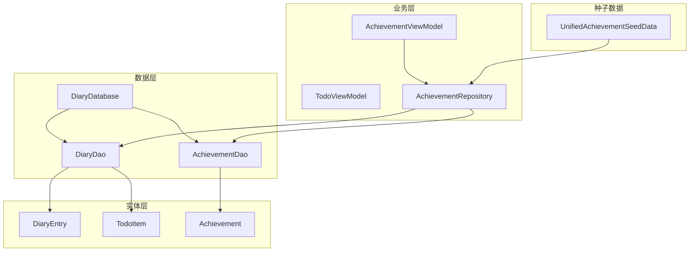
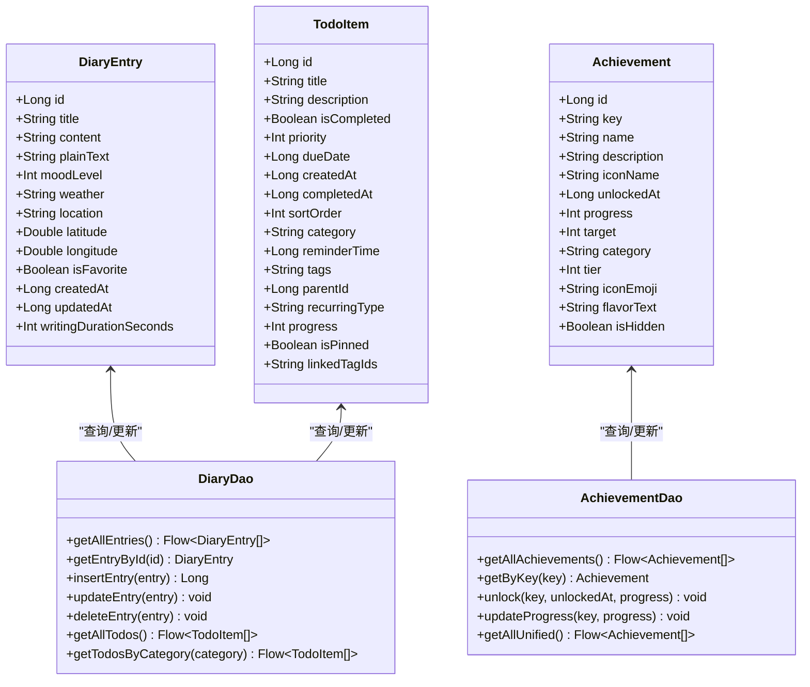
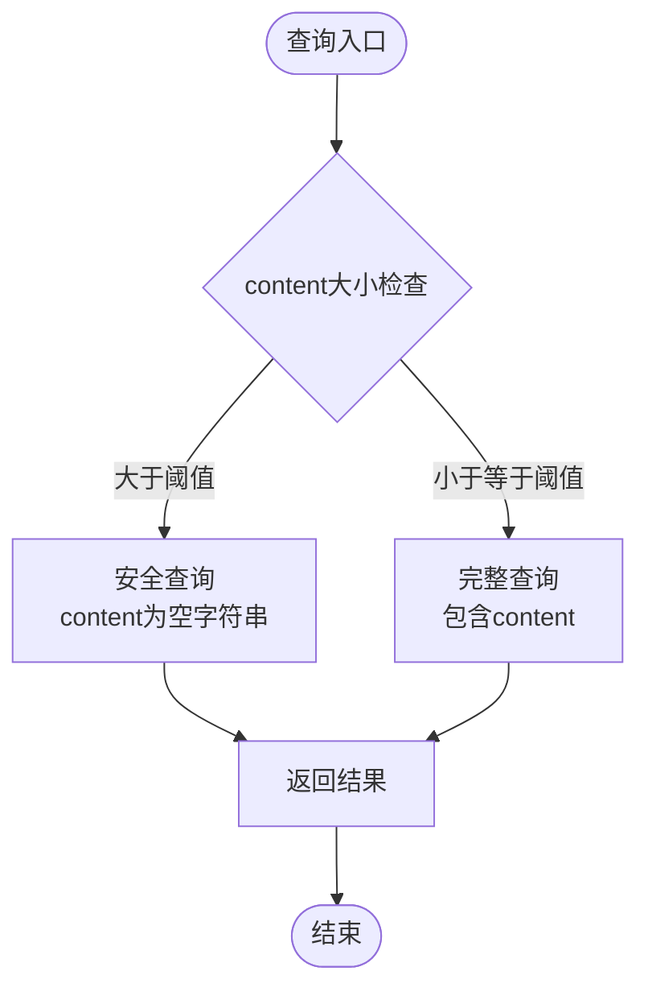
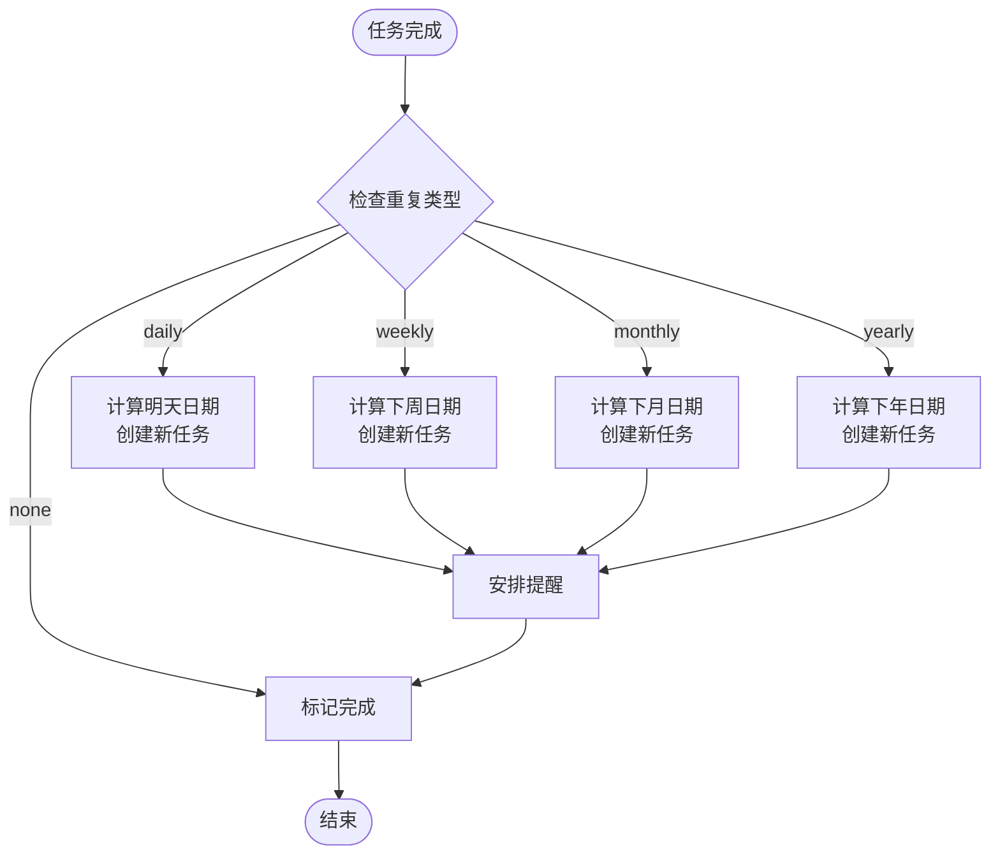
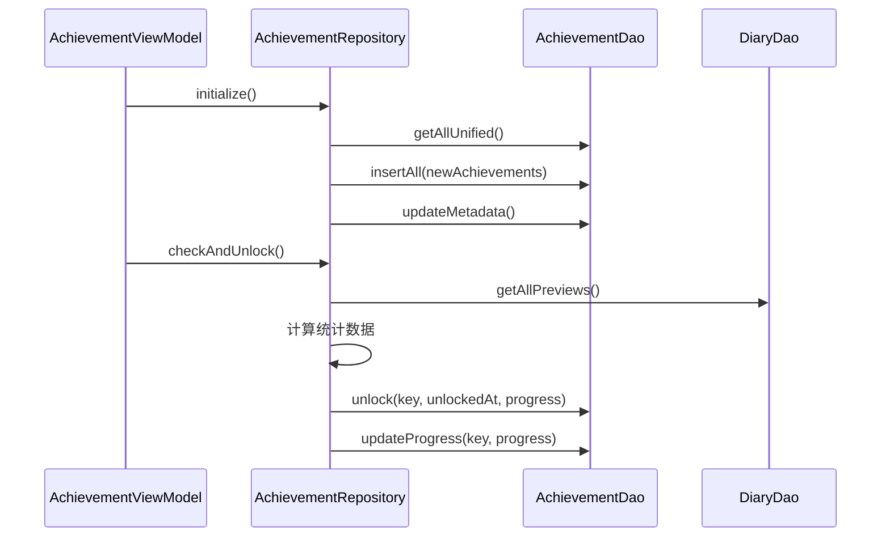
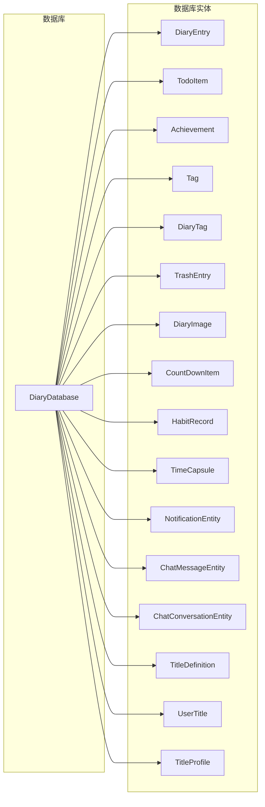
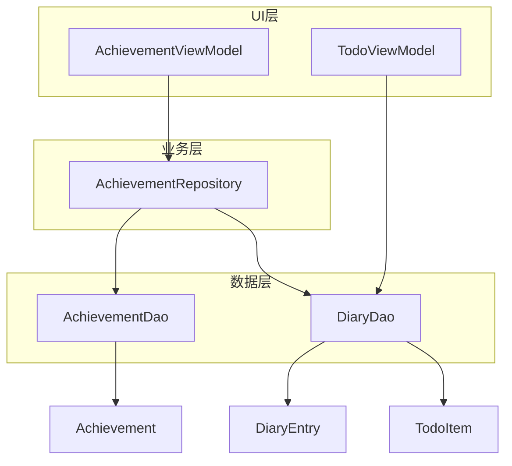

# 核心实体

<cite>
**本文引用的文件**
- [DiaryEntry.kt](file://app/src/main/java/com/diary/app/data/DiaryEntry.kt)
- [TodoItem.kt](file://app/src/main/java/com/diary/app/data/TodoItem.kt)
- [Achievement.kt](file://app/src/main/java/com/diary/app/data/Achievement.kt)
- [AchievementModels.kt](file://app/src/main/java/com/diary/app/data/AchievementModels.kt)
- [DiaryDao.kt](file://app/src/main/java/com/diary/app/data/DiaryDao.kt)
- [AchievementDao.kt](file://app/src/main/java/com/diary/app/data/AchievementDao.kt)
- [DiaryDatabase.kt](file://app/src/main/java/com/diary/app/data/DiaryDatabase.kt)
- [AchievementRepository.kt](file://app/src/main/java/com/diary/app/data/AchievementRepository.kt)
- [UnifiedAchievementSeedData.kt](file://app/src/main/java/com/diary/app/data/UnifiedAchievementSeedData.kt)
- [AchievementViewModel.kt](file://app/src/main/java/com/diary/app/ui/achievement/AchievementViewModel.kt)
- [TodoViewModel.kt](file://app/src/main/java/com/diary/app/ui/todo/TodoViewModel.kt)
</cite>

## 目录
1. [简介](#简介)
2. [项目结构](#项目结构)
3. [核心组件](#核心组件)
4. [架构概览](#架构概览)
5. [详细组件分析](#详细组件分析)
6. [依赖分析](#依赖分析)
7. [性能考虑](#性能考虑)
8. [故障排除指南](#故障排除指南)
9. [结论](#结论)

## 简介
本文件深入解析DiaryApp的核心实体设计，重点涵盖三类关键数据模型：日记实体DiaryEntry、成就实体Achievement以及待办事项实体TodoItem。我们将详细阐述各实体的业务含义、约束条件、数据结构设计，并说明它们之间的关联关系和在应用中的关键作用。通过代码级别的分析和可视化图表，帮助开发者和技术读者全面理解这些核心实体的设计理念和实现细节。

## 项目结构
DiaryApp采用基于Room数据库的Android应用架构，核心实体均通过Room实体定义并在DAO层进行数据访问。整体结构遵循MVVM模式，ViewModel负责业务逻辑协调，Repository处理数据聚合，DAO提供底层数据操作。

**图表来源**
- [DiaryDatabase.kt:10-14](file://app/src/main/java/com/diary/app/data/DiaryDatabase.kt#L10-L14)
- [DiaryDao.kt:12-13](file://app/src/main/java/com/diary/app/data/DiaryDao.kt#L12-L13)
- [AchievementDao.kt:10-11](file://app/src/main/java/com/diary/app/data/AchievementDao.kt#L10-L11)

## 核心组件

### DiaryEntry 日记实体
DiaryEntry是应用的核心数据模型，代表用户的日记条目。该实体设计体现了富文本内容存储与性能优化的平衡。

**核心属性设计**：
- **id**: 主键，自增ID，确保每篇日记的唯一性
- **title**: 标题，支持空字符串，默认为空
- **content**: 富文本内容，采用Quill.js Delta JSON格式存储
- **plainText**: 纯文本摘要，用于预览和搜索功能
- **moodLevel**: 情感等级，1-6级数值，支持空值
- **weather**: 天气信息，支持多种天气类型
- **location**: 地理位置名称
- **latitude/longitude**: 精确地理坐标
- **isFavorite**: 收藏标记，布尔值
- **时间戳**: createdAt和updatedAt，毫秒级时间戳
- **writingDurationSeconds**: 写作时长（秒），用于统计分析

**索引策略**：
- createdAt: 支持按时间排序查询
- isFavorite: 支持收藏筛选
- moodLevel: 支持情感分析查询

**业务约束**：
- content字段在大数据情况下自动转换为空字符串以避免内存溢出
- plainText字段用于全文检索和列表预览
- location字段可为空，支持地理位置可选功能

**图表来源**
- [DiaryEntry.kt:8-32](file://app/src/main/java/com/diary/app/data/DiaryEntry.kt#L8-L32)

### TodoItem 待办事项实体
TodoItem实体支持复杂的任务管理功能，包括重复模式、进度跟踪、提醒机制等。

**核心属性设计**：
- **基础信息**: id、title、description、isCompleted
- **优先级系统**: priority (0=normal, 1=important, 2=urgent)
- **时间管理**: dueDate、createdAt、completedAt、reminderTime
- **组织结构**: parentId（父子任务关系）、sortOrder（排序）
- **分类系统**: category (task, reminder, goal)
- **重复机制**: recurringType (none, daily, weekly, monthly, yearly)
- **进度跟踪**: progress (0-100百分比)
- **显示控制**: isPinned（置顶）、linkedTagIds（关联标签）

**索引策略**：
- dueDate: 支持到期任务查询
- isCompleted: 支持完成状态筛选
- category: 支持分类查询
- reminderTime: 支持提醒查询
- parentId: 支持层级查询
- tags: 支持标签查询

**业务逻辑**：
- 自动化重复任务生成
- 提醒系统集成
- 子任务管理
- 进度可视化

**图表来源**
- [TodoItem.kt:7-37](file://app/src/main/java/com/diary/app/data/TodoItem.kt#L7-L37)

### Achievement 成就实体
Achievement实体支持统一的成就系统，包含分类、等级、元数据等完整信息。

**核心属性设计**：
- **标识系统**: id（自增）、key（唯一标识符）
- **展示信息**: name、description、iconName
- **解锁状态**: unlockedAt（解锁时间）、progress（进度）
- **目标系统**: target（目标值）、progress（当前进度）
- **统一系统字段**: category（分类）、tier（等级）、iconEmoji
- **隐藏属性**: flavorText（背景故事）、isHidden（是否隐藏）

**索引策略**：
- key: 唯一键，支持快速查找

**业务意义**：
- 支持8个分类和4个等级的统一成就体系
- 提供丰富的解锁条件和进度跟踪
- 支持隐藏成就的特殊解锁机制

**图表来源**
- [Achievement.kt:7-26](file://app/src/main/java/com/diary/app/data/Achievement.kt#L7-L26)

## 架构概览

**图表来源**
- [DiaryEntry.kt:16-32](file://app/src/main/java/com/diary/app/data/DiaryEntry.kt#L16-L32)
- [TodoItem.kt:18-37](file://app/src/main/java/com/diary/app/data/TodoItem.kt#L18-L37)
- [Achievement.kt:11-26](file://app/src/main/java/com/diary/app/data/Achievement.kt#L11-L26)
- [DiaryDao.kt:12-13](file://app/src/main/java/com/diary/app/data/DiaryDao.kt#L12-L13)
- [AchievementDao.kt:10-11](file://app/src/main/java/com/diary/app/data/AchievementDao.kt#L10-L11)

## 详细组件分析

### DiaryEntry 实体分析

#### 数据结构设计
DiaryEntry采用Room实体注解，定义了完整的数据库映射关系。实体设计充分考虑了移动端应用的特点：

**富文本处理**：
- content字段存储Quill.js Delta JSON格式，支持丰富的文本格式
- plainText字段提取纯文本，用于搜索和预览
- 在大数据情况下自动保护机制，避免内存溢出

**地理位置集成**：
- location字段提供人类可读的位置名称
- latitude和longitude提供精确坐标
- 支持地图功能和位置分析

**时间管理**：
- createdAt和updatedAt提供创建和更新时间戳
- 支持时间范围查询和统计分析
- writingDurationSeconds用于写作时长统计

#### 查询优化策略

**图表来源**
- [DiaryDao.kt:27-33](file://app/src/main/java/com/diary/app/data/DiaryDao.kt#L27-L33)

**章节来源**
- [DiaryEntry.kt:8-32](file://app/src/main/java/com/diary/app/data/DiaryEntry.kt#L8-L32)
- [DiaryDao.kt:14-48](file://app/src/main/java/com/diary/app/data/DiaryDao.kt#L14-L48)

### TodoItem 实体分析

#### 任务管理系统
TodoItem实现了完整的任务管理功能，支持复杂的工作流和用户交互。

**分类系统**：
- task: 普通任务
- reminder: 提醒事项  
- goal: 目标追踪

**优先级系统**：
- 0: 普通 (normal)
- 1: 重要 (important)
- 2: 紧急 (urgent)

**重复机制**：

**图表来源**
- [TodoViewModel.kt:322-349](file://app/src/main/java/com/diary/app/ui/todo/TodoViewModel.kt#L322-L349)

**章节来源**
- [TodoItem.kt:18-37](file://app/src/main/java/com/diary/app/data/TodoItem.kt#L18-L37)
- [TodoViewModel.kt:225-337](file://app/src/main/java/com/diary/app/ui/todo/TodoViewModel.kt#L225-L337)

### Achievement 实体分析

#### 统一成就系统
Achievement实体支持统一的成就系统，包含8个分类和4个等级的完整体系。

**成就分类**：
- WRITING: 文字匠人 (10个成就)
- HABIT: 习惯先锋 (4个成就)  
- TIME: 时间旅人 (10个成就)
- MOOD: 情绪画师 (10个成就)
- WEATHER: 风雨行者 (10个成就)
- EXPLORER: 探险家 (15个成就)
- COLLECTOR: 收藏家 (3个成就)
- LEGENDARY: 传说收藏 (4个成就)

**等级系统**：
- COMMON: 普通 (⭐☆☆☆)
- RARE: 稀有 (⭐⭐☆☆)
- EPIC: 史诗 (⭐⭐⭐☆)
- LEGENDARY: 传说 (⭐⭐⭐⭐)

**解锁机制**：

**图表来源**
- [AchievementViewModel.kt:79-98](file://app/src/main/java/com/diary/app/ui/achievement/AchievementViewModel.kt#L79-L98)
- [AchievementRepository.kt:46-119](file://app/src/main/java/com/diary/app/data/AchievementRepository.kt#L46-L119)

**章节来源**
- [Achievement.kt:11-26](file://app/src/main/java/com/diary/app/data/Achievement.kt#L11-L26)
- [AchievementModels.kt:11-47](file://app/src/main/java/com/diary/app/data/AchievementModels.kt#L11-L47)
- [AchievementRepository.kt:12-127](file://app/src/main/java/com/diary/app/data/AchievementRepository.kt#L12-L127)

## 依赖分析

### 数据库依赖关系
DiaryDatabase集中管理所有实体的数据库连接，确保数据一致性和完整性。

**图表来源**
- [DiaryDatabase.kt:10-19](file://app/src/main/java/com/diary/app/data/DiaryDatabase.kt#L10-L19)

### ViewModel依赖关系
各ViewModel通过Repository层协调数据访问，实现业务逻辑与数据访问的分离。

**图表来源**
- [AchievementViewModel.kt:21-23](file://app/src/main/java/com/diary/app/ui/achievement/AchievementViewModel.kt#L21-L23)
- [TodoViewModel.kt:108-110](file://app/src/main/java/com/diary/app/ui/todo/TodoViewModel.kt#L108-L110)

**章节来源**
- [DiaryDatabase.kt:10-19](file://app/src/main/java/com/diary/app/data/DiaryDatabase.kt#L10-L19)
- [AchievementViewModel.kt:21-23](file://app/src/main/java/com/diary/app/ui/achievement/AchievementViewModel.kt#L21-L23)
- [TodoViewModel.kt:108-110](file://app/src/main/java/com/diary/app/ui/todo/TodoViewModel.kt#L108-L110)

## 性能考虑

### 查询优化策略
1. **预览投影**: DiaryDao提供轻量级查询，避免加载富文本内容
2. **索引优化**: 关键字段建立索引支持高效查询
3. **批量操作**: 支持批量插入和删除操作
4. **流式查询**: 使用Flow实现响应式数据更新

### 内存管理
1. **内容保护**: 大尺寸content自动转换为空字符串
2. **懒加载**: 列表视图使用预览数据，详情页再加载完整内容
3. **缓存策略**: ViewModel层维护状态缓存

### 数据一致性
1. **事务操作**: 支持事务性的数据操作
2. **外键约束**: 完整的外键关系定义
3. **迁移策略**: 全面的数据库版本迁移

## 故障排除指南

### 常见问题诊断
1. **数据库打开失败**: 检查迁移脚本和版本兼容性
2. **查询性能问题**: 验证索引使用情况
3. **内存溢出**: 检查content字段大小限制
4. **成就解锁异常**: 验证统计数据计算逻辑

### 调试建议
1. 启用Room日志输出
2. 使用数据库查看工具检查数据状态
3. 监控内存使用情况
4. 验证索引创建状态

**章节来源**
- [DiaryDatabase.kt:712-771](file://app/src/main/java/com/diary/app/data/DiaryDatabase.kt#L712-L771)

## 结论

DiaryApp的核心实体设计体现了现代移动应用的数据建模最佳实践。DiaryEntry、TodoItem和Achievement三个实体相互配合，构建了完整的日记记录、任务管理和成就激励系统。

**设计亮点**：
1. **模块化设计**: 每个实体职责明确，耦合度低
2. **性能优化**: 充分考虑移动端性能限制
3. **扩展性强**: 支持未来功能扩展和数据迁移
4. **用户体验**: 通过索引和查询优化提升响应速度

**技术价值**：
- 统一的成就系统为用户提供了持续的动力
- 完善的任务管理功能满足日常记录需求  
- 精心设计的日记实体支持丰富的富文本内容
- 全面的数据库设计确保数据一致性和完整性

这些核心实体为DiaryApp奠定了坚实的技术基础，为用户提供了一个功能完整、性能优异的日记应用体验。