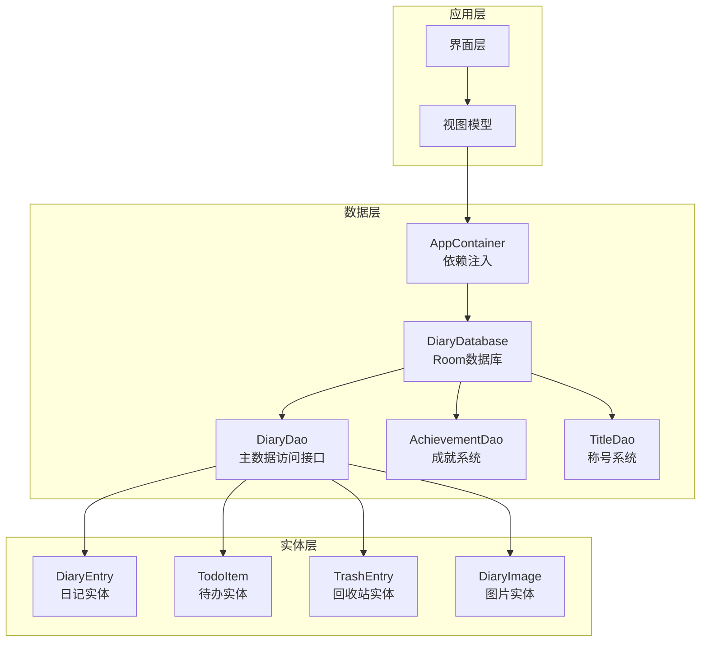
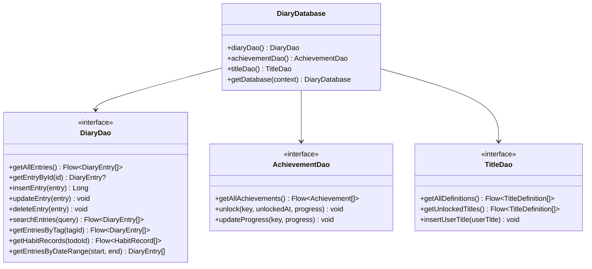
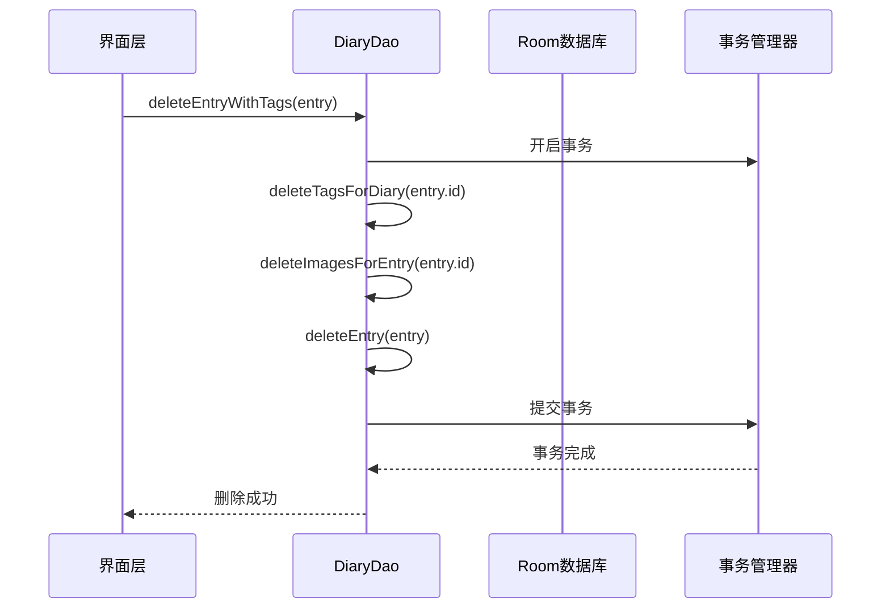
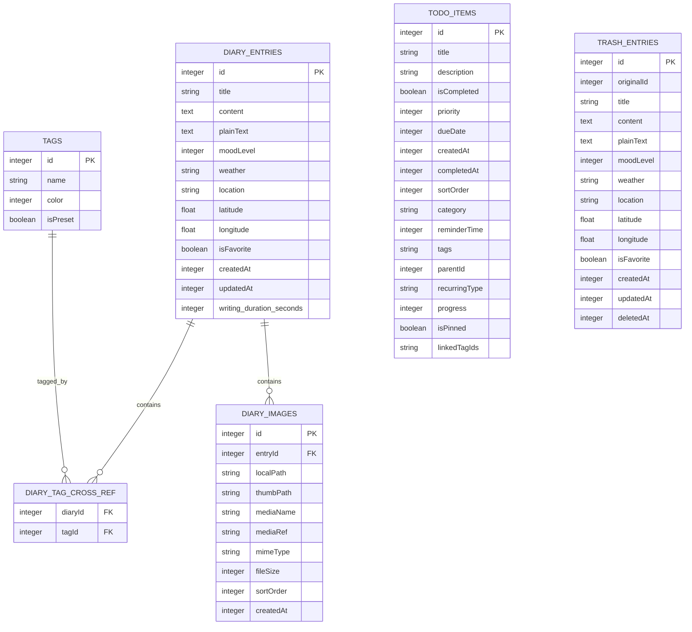
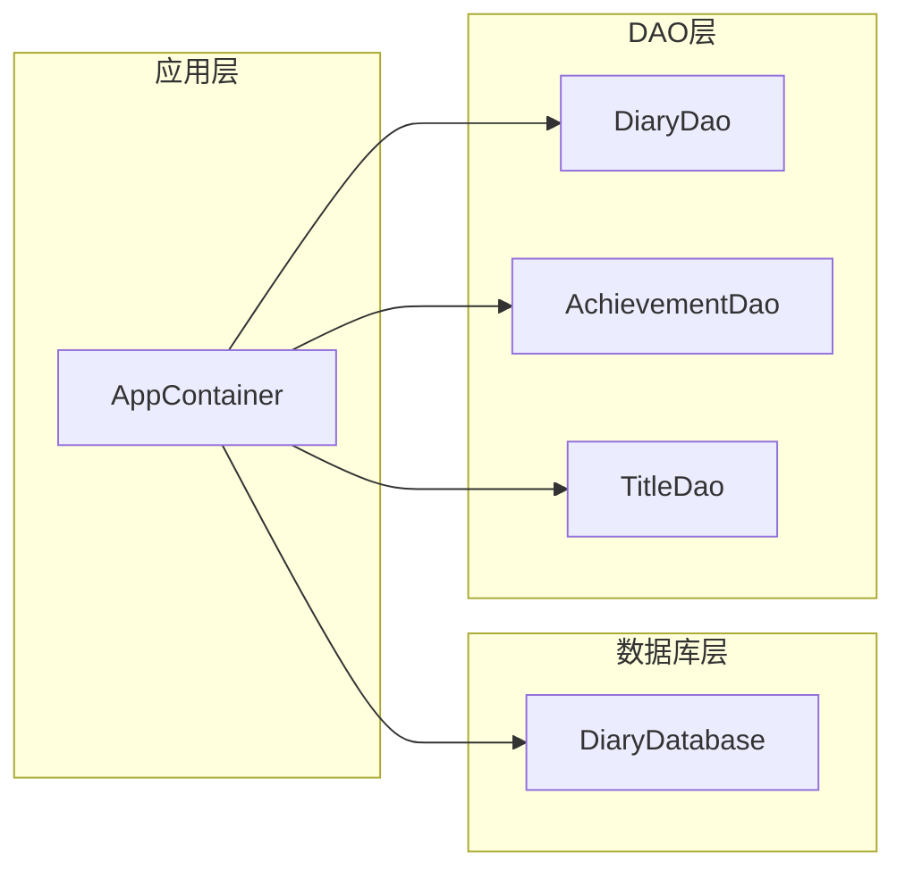

# DAO接口设计

<cite>
**本文档引用的文件**
- [DiaryDao.kt](file://app/src/main/java/com/diary/app/data/DiaryDao.kt)
- [AchievementDao.kt](file://app/src/main/java/com/diary/app/data/AchievementDao.kt)
- [TitleDao.kt](file://app/src/main/java/com/diary/app/data/TitleDao.kt)
- [DiaryDatabase.kt](file://app/src/main/java/com/diary/app/data/DiaryDatabase.kt)
- [DiaryEntry.kt](file://app/src/main/java/com/diary/app/data/DiaryEntry.kt)
- [TodoItem.kt](file://app/src/main/java/com/diary/app/data/TodoItem.kt)
- [TrashEntry.kt](file://app/src/main/java/com/diary/app/data/TrashEntry.kt)
- [DiaryImage.kt](file://app/src/main/java/com/diary/app/data/DiaryImage.kt)
- [DiaryDaoProjectionTest.kt](file://app/src/test/java/com/diary/app/data/DiaryDaoProjectionTest.kt)
- [DiaryDaoSourceTest.kt](file://app/src/test/java/com/diary/app/data/DiaryDaoSourceTest.kt)
- [AppContainer.kt](file://app/src/main/java/com/diary/app/di/AppContainer.kt)
</cite>

## 目录
1. [简介](#简介)
2. [项目结构](#项目结构)
3. [核心组件](#核心组件)
4. [架构概览](#架构概览)
5. [详细组件分析](#详细组件分析)
6. [依赖关系分析](#依赖关系分析)
7. [性能考虑](#性能考虑)
8. [故障排除指南](#故障排除指南)
9. [结论](#结论)
10. [附录](#附录)

## 简介
本文件为DiaryApp的DAO接口设计提供全面的技术文档。重点涵盖：
- 各DAO接口的方法定义与SQL查询实现
- 复杂查询语句、参数绑定、结果映射
- 查询优化策略（索引使用、查询计划分析、批量操作）
- 事务管理机制（读写分离、并发控制、回滚策略）
- DAO接口的扩展性与可测试性设计
- 开发最佳实践与性能优化建议

## 项目结构
DiaryApp采用Room持久化库作为数据访问层，DAO接口集中定义在data包下，配合实体类与数据库类共同构成完整的数据层架构。

**图表来源**
- [AppContainer.kt:11-14](file://app/src/main/java/com/diary/app/di/AppContainer.kt#L11-L14)
- [DiaryDatabase.kt:10-18](file://app/src/main/java/com/diary/app/data/DiaryDatabase.kt#L10-L18)
- [DiaryDao.kt:12-13](file://app/src/main/java/com/diary/app/data/DiaryDao.kt#L12-L13)

**章节来源**
- [AppContainer.kt:1-15](file://app/src/main/java/com/diary/app/di/AppContainer.kt#L1-L15)
- [DiaryDatabase.kt:10-18](file://app/src/main/java/com/diary/app/data/DiaryDatabase.kt#L10-L18)

## 核心组件
本项目的核心DAO组件包括：
- DiaryDao：主数据访问接口，负责日记、标签、图片、待办、回收站等核心功能
- AchievementDao：成就系统的数据访问
- TitleDao：称号系统的数据访问

每个DAO均通过Room注解定义，支持协程Flow响应式编程模式。

**章节来源**
- [DiaryDao.kt:12-13](file://app/src/main/java/com/diary/app/data/DiaryDao.kt#L12-L13)
- [AchievementDao.kt:10-11](file://app/src/main/java/com/diary/app/data/AchievementDao.kt#L10-L11)
- [TitleDao.kt:10-11](file://app/src/main/java/com/diary/app/data/TitleDao.kt#L10-L11)

## 架构概览
DAO层采用分层架构设计，通过Room数据库提供类型安全的SQL访问，并结合索引优化和批量操作提升性能。

**图表来源**
- [DiaryDatabase.kt:15-18](file://app/src/main/java/com/diary/app/data/DiaryDatabase.kt#L15-L18)
- [DiaryDao.kt:12-628](file://app/src/main/java/com/diary/app/data/DiaryDao.kt#L12-L628)
- [AchievementDao.kt:10-64](file://app/src/main/java/com/diary/app/data/AchievementDao.kt#L10-L64)
- [TitleDao.kt:10-75](file://app/src/main/java/com/diary/app/data/TitleDao.kt#L10-L75)

## 详细组件分析

### DiaryDao组件分析
DiaryDao是整个应用的核心数据访问接口，包含600+行的查询方法，涵盖以下主要功能域：

#### 基础CRUD操作
- 单条记录操作：insertEntry、updateEntry、deleteEntry
- 批量删除操作：deleteAllEntries、deleteAllTags、deleteAllImages等
- 条件删除：deleteEntryById、deleteTagsForDiary、deleteImagesForEntry

#### 预览投影设计
为避免内存溢出，实现了轻量级投影：
- DiaryPreview数据类仅包含非内容字段
- getAllPreviews()返回列表预览
- getEntryByIdSafe()安全获取完整条目

#### 复杂查询功能
- 全文搜索：searchEntries()支持标题、内容、标签的模糊匹配
- 标签关联查询：getTagInfoForDiary()、getEntriesByTag()
- 时间范围查询：getEntriesByDateRange()、getOnThisDayEntries()
- 统计查询：getTagUsage()、getAverageWritingDurationSeconds()

#### 事务管理
- deleteEntryWithTags()：原子性删除日记及其关联数据
- deleteEntriesWithTags()：批量事务处理

**图表来源**
- [DiaryDao.kt:83-97](file://app/src/main/java/com/diary/app/data/DiaryDao.kt#L83-L97)

**章节来源**
- [DiaryDao.kt:14-628](file://app/src/main/java/com/diary/app/data/DiaryDao.kt#L14-L628)

### AchievementDao组件分析
成就系统DAO提供统一的成就管理接口：
- 基础查询：按解锁状态、分类、等级查询
- 进度管理：updateProgress()、unlock()更新成就进度
- 批量操作：insertAll()支持批量初始化

**章节来源**
- [AchievementDao.kt:10-64](file://app/src/main/java/com/diary/app/data/AchievementDao.kt#L10-L64)

### TitleDao组件分析
称号系统DAO支持称号的定义、解锁和展示：
- 定义管理：getAllDefinitions()、getDefinitionsByCategory()
- 解锁跟踪：getUnlockedTitles()、getUserTitle()
- 展示配置：getTitleProfile()、setTitleProfile()

**章节来源**
- [TitleDao.kt:10-75](file://app/src/main/java/com/diary/app/data/TitleDao.kt#L10-L75)

### 数据库索引与优化
DiaryDatabase定义了完善的索引策略：

#### 实体索引
- diary_entries：createdAt、isFavorite、moodLevel
- todo_items：dueDate、isCompleted、category、reminderTime、parentId、tags
- diary_images：entryId
- 其他表的关键字段索引

#### 迁移索引
通过版本迁移自动创建必要的索引，确保查询性能。

**章节来源**
- [DiaryDatabase.kt:58-68](file://app/src/main/java/com/diary/app/data/DiaryDatabase.kt#L58-L68)
- [DiaryEntry.kt:10-14](file://app/src/main/java/com/diary/app/data/DiaryEntry.kt#L10-L14)
- [TodoItem.kt:7-16](file://app/src/main/java/com/diary/app/data/TodoItem.kt#L7-L16)

## 依赖关系分析

### 实体关系图

**图表来源**
- [DiaryEntry.kt:8-32](file://app/src/main/java/com/diary/app/data/DiaryEntry.kt#L8-L32)
- [Tag.kt:6-13](file://app/src/main/java/com/diary/app/data/Tag.kt#L6-L13)
- [DiaryImage.kt:8-31](file://app/src/main/java/com/diary/app/data/DiaryImage.kt#L8-L31)
- [TrashEntry.kt:7-29](file://app/src/main/java/com/diary/app/data/TrashEntry.kt#L7-L29)

### 依赖注入架构

**图表来源**
- [AppContainer.kt:11-14](file://app/src/main/java/com/diary/app/di/AppContainer.kt#L11-L14)

**章节来源**
- [AppContainer.kt:1-15](file://app/src/main/java/com/diary/app/di/AppContainer.kt#L1-L15)

## 性能考虑

### 查询优化策略

#### 索引使用策略
- 时间序列查询：利用createdAt索引优化排序和范围查询
- 条件过滤：isFavorite、isCompleted等布尔字段索引
- 关联查询：外键字段建立索引减少JOIN成本

#### 批量操作优化
- 分页查询：getEntriesBatch()、getEntriesBatchForExport()支持大数据集分页
- 批量删除：deleteAllXxx()方法减少单条删除的开销
- 预览投影：避免加载大字段内容，降低内存占用

#### 缓存与响应式设计
- Flow响应式流：自动数据变更通知
- 轻量级投影：列表视图使用DiaryPreview避免OOM

### 存储管理优化
- 图片存储：diary_images表支持文件大小统计和清理
- 内容压缩：超大内联图片内容在安全查询中自动降级

**章节来源**
- [DiaryDao.kt:17-19](file://app/src/main/java/com/diary/app/data/DiaryDao.kt#L17-L19)
- [DiaryDao.kt:225-231](file://app/src/main/java/com/diary/app/data/DiaryDao.kt#L225-L231)
- [DiaryDao.kt:615-620](file://app/src/main/java/com/diary/app/data/DiaryDao.kt#L615-L620)

## 故障排除指南

### 常见问题与解决方案

#### 数据库迁移失败
- 现象：应用启动时报数据库打开错误
- 处理：系统会自动备份数据库文件并抛出异常
- 预防：确保迁移脚本的向后兼容性

#### 内存溢出问题
- 现象：列表页面加载缓慢或崩溃
- 处理：使用DiaryPreview投影替代完整内容
- 验证：通过单元测试确保内容字段被正确排除

#### 查询性能问题
- 检查点：确认相关字段是否建立索引
- 优化：使用适当的WHERE条件和LIMIT子句
- 监控：关注查询执行计划和索引使用情况

**章节来源**
- [DiaryDatabase.kt:724-771](file://app/src/main/java/com/diary/app/data/DiaryDatabase.kt#L724-L771)
- [DiaryDaoProjectionTest.kt:22-33](file://app/src/test/java/com/diary/app/data/DiaryDaoProjectionTest.kt#L22-L33)
- [DiaryDaoSourceTest.kt:10-18](file://app/src/test/java/com/diary/app/data/DiaryDaoSourceTest.kt#L10-L18)

## 结论
DiaryApp的DAO接口设计体现了现代Android应用的数据层最佳实践：
- 采用Room提供类型安全的数据库访问
- 通过投影设计和索引优化保证性能
- 使用事务管理确保数据一致性
- 通过依赖注入实现模块化架构
- 完善的测试覆盖确保代码质量

该设计为后续功能扩展提供了良好的基础，建议在新增功能时遵循相同的架构模式和性能优化原则。

## 附录

### 开发最佳实践

#### SQL查询编写规范
- 使用参数绑定避免SQL注入
- 合理使用LIKE操作符，必要时添加通配符优化
- 对复杂查询添加适当的索引支持

#### 事务管理最佳实践
- 将相关联的数据操作放入单个事务
- 控制事务范围，避免长时间持有数据库锁
- 正确处理事务异常和回滚

#### 性能优化建议
- 优先使用索引字段进行查询
- 避免SELECT *，只选择需要的字段
- 使用分页处理大数据集
- 合理使用缓存和响应式流

#### 可测试性设计
- DAO方法保持纯函数特性
- 通过接口隔离实现便于Mock
- 编写单元测试验证查询逻辑
- 使用Room的测试支持工具