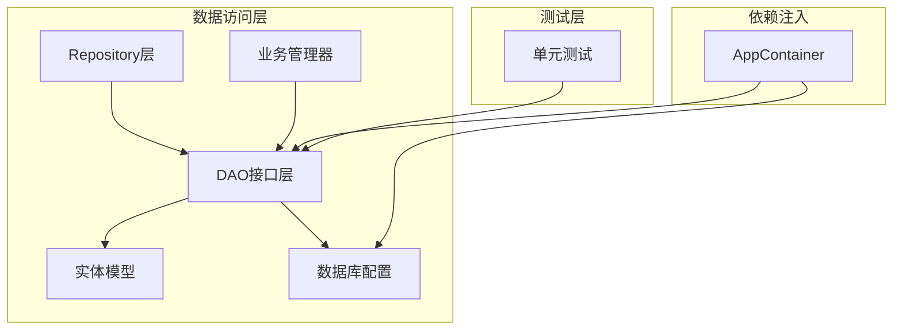
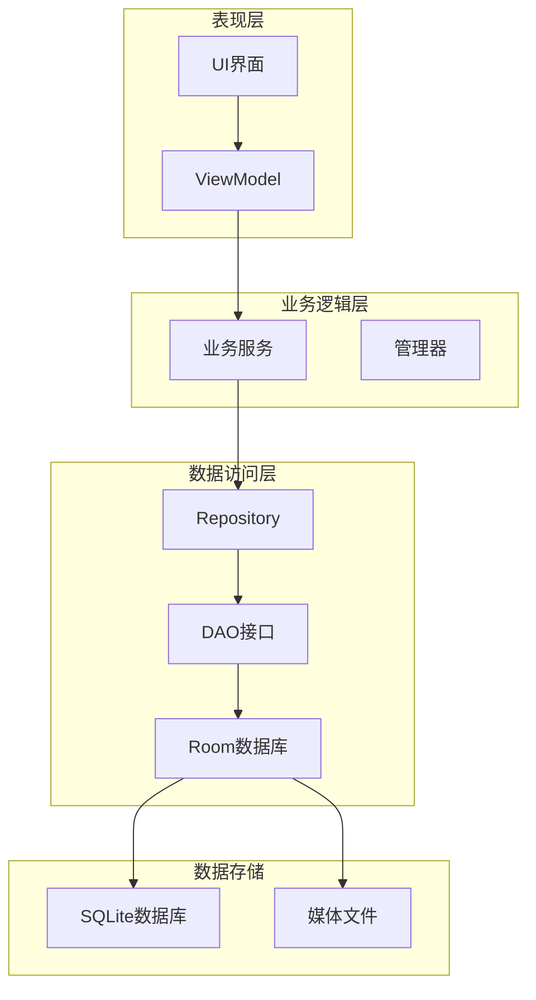
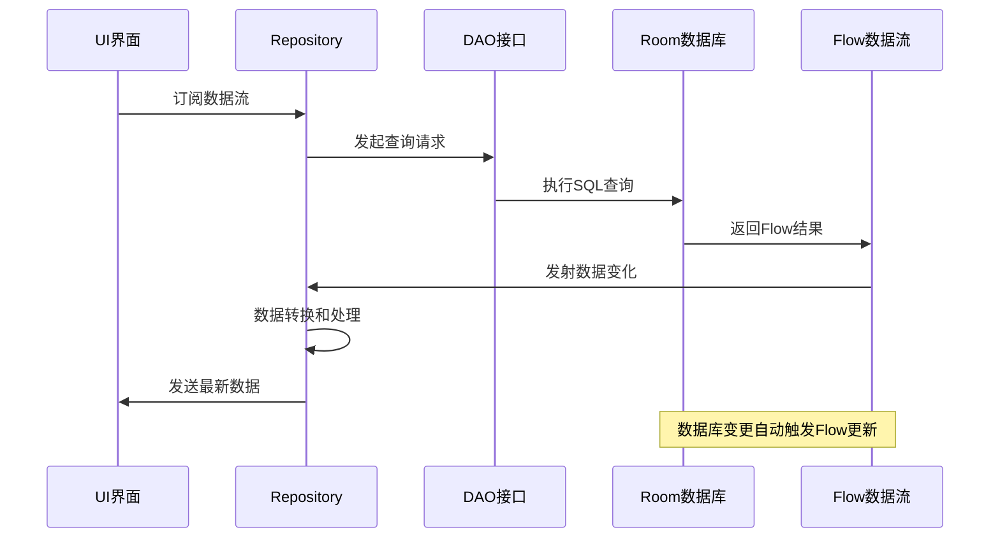
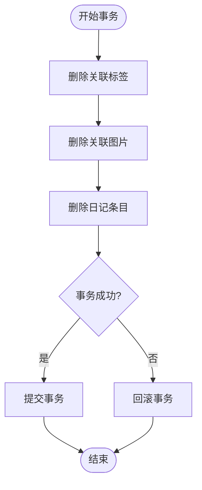
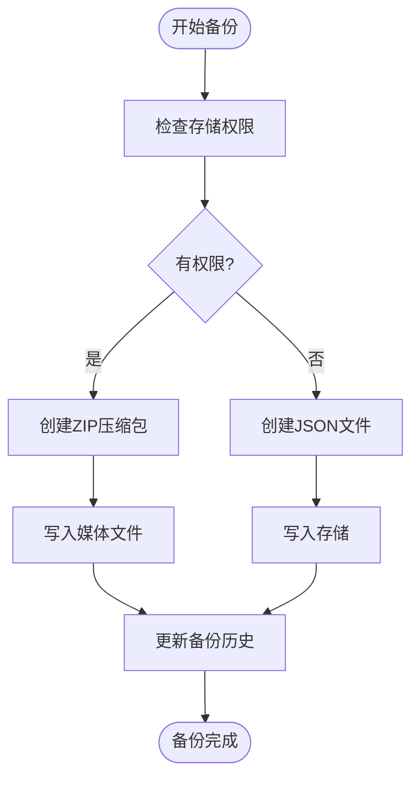
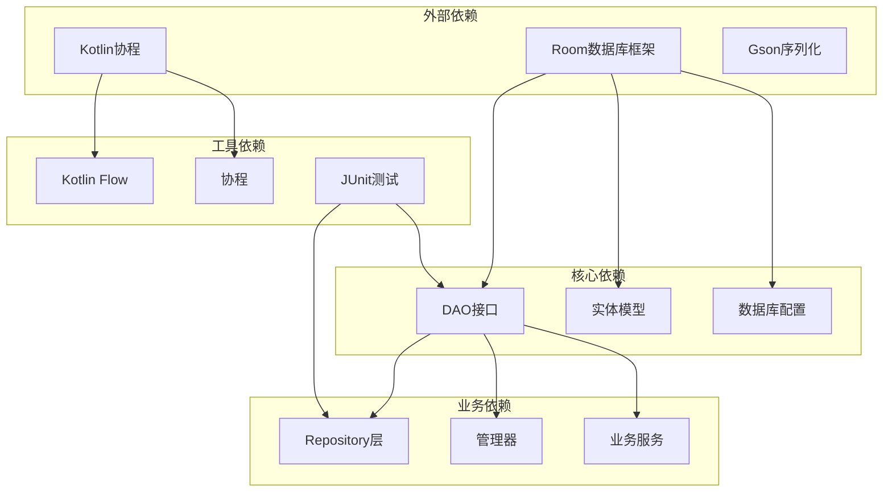
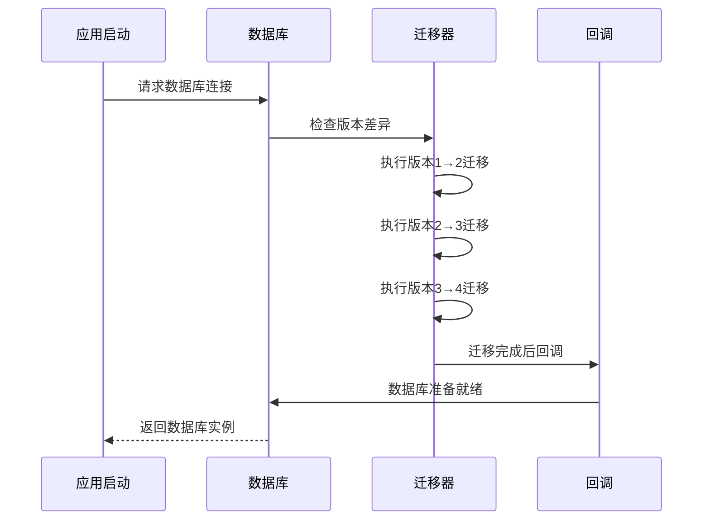
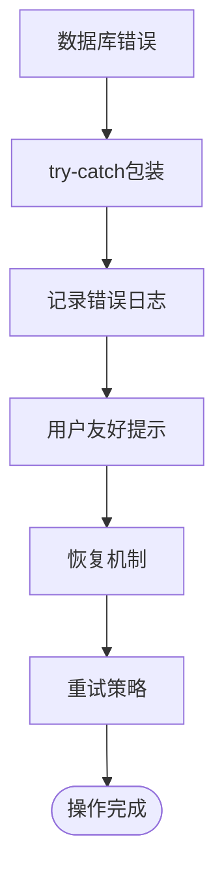

# 数据访问层

<cite>
**本文档引用的文件**
- [DiaryDao.kt](file://app/src/main/java/com/diary/app/data/DiaryDao.kt)
- [DiaryDatabase.kt](file://app/src/main/java/com/diary/app/data/DiaryDatabase.kt)
- [AchievementDao.kt](file://app/src/main/java/com/diary/app/data/AchievementDao.kt)
- [TitleDao.kt](file://app/src/main/java/com/diary/app/data/TitleDao.kt)
- [AchievementRepository.kt](file://app/src/main/java/com/diary/app/data/AchievementRepository.kt)
- [TitleManager.kt](file://app/src/main/java/com/diary/app/data/TitleManager.kt)
- [BackupManager.kt](file://app/src/main/java/com/diary/app/data/BackupManager.kt)
- [DiaryExporter.kt](file://app/src/main/java/com/diary/app/data/DiaryExporter.kt)
- [DiaryEntry.kt](file://app/src/main/java/com/diary/app/data/DiaryEntry.kt)
- [Tag.kt](file://app/src/main/java/com/diary/app/data/Tag.kt)
- [TodoItem.kt](file://app/src/main/java/com/diary/app/data/TodoItem.kt)
- [AppContainer.kt](file://app/src/main/java/com/diary/app/di/AppContainer.kt)
- [DiaryDaoSourceTest.kt](file://app/src/test/java/com/diary/app/data/DiaryDaoSourceTest.kt)
- [DiaryDatabaseSourceTest.kt](file://app/src/test/java/com/diary/app/data/DiaryDatabaseSourceTest.kt)
- [DiaryDaoProjectionTest.kt](file://app/src/test/java/com/diary/app/data/DiaryDaoProjectionTest.kt)
</cite>

## 目录
1. [简介](#简介)
2. [项目结构](#项目结构)
3. [核心组件](#核心组件)
4. [架构概览](#架构概览)
5. [详细组件分析](#详细组件分析)
6. [依赖关系分析](#依赖关系分析)
7. [性能考虑](#性能考虑)
8. [故障排除指南](#故障排除指南)
9. [结论](#结论)
10. [附录](#附录)

## 简介

DiaryApp的数据访问层采用现代Android架构设计，基于Room数据库框架构建，实现了完整的数据持久化解决方案。该层采用DAO（数据访问对象）模式和Repository模式，提供了类型安全的数据库操作、响应式数据流、事务处理和数据缓存机制。

数据访问层主要包含以下核心功能：
- **类型安全的数据访问**：通过Room注解生成类型安全的DAO接口
- **响应式数据流**：使用Kotlin Flow提供实时数据更新
- **复杂查询支持**：包括全文搜索、聚合统计、跨表关联查询
- **事务处理**：确保数据一致性和完整性
- **批量操作**：支持大数据量的高效处理
- **数据迁移**：完整的数据库版本迁移策略
- **备份恢复**：完整的数据备份和恢复机制

## 项目结构

数据访问层位于`app/src/main/java/com/diary/app/data/`目录下，采用模块化设计：

**图表来源**
- [DiaryDao.kt:12-628](file://app/src/main/java/com/diary/app/data/DiaryDao.kt#L12-L628)
- [DiaryDatabase.kt:10-14](file://app/src/main/java/com/diary/app/data/DiaryDatabase.kt#L10-L14)
- [AppContainer.kt:11-14](file://app/src/main/java/com/diary/app/di/AppContainer.kt#L11-L14)

**章节来源**
- [DiaryDao.kt:1-665](file://app/src/main/java/com/diary/app/data/DiaryDao.kt#L1-L665)
- [DiaryDatabase.kt:1-829](file://app/src/main/java/com/diary/app/data/DiaryDatabase.kt#L1-L829)
- [AppContainer.kt:1-15](file://app/src/main/java/com/diary/app/di/AppContainer.kt#L1-L15)

## 核心组件

### DAO接口层

DAO（Data Access Object）模式是数据访问层的核心，提供了类型安全的数据库操作接口。每个实体都有对应的DAO接口，使用Room注解声明数据库操作。

主要DAO接口包括：
- **DiaryDao**：日记条目的核心数据访问
- **AchievementDao**：成就系统的数据访问
- **TitleDao**：称号系统的数据访问

每个DAO接口都定义了标准的CRUD操作和复杂的查询方法，支持响应式数据流和事务处理。

### 实体模型层

实体模型使用Room注解定义数据库表结构，包括索引、约束和字段映射。

关键实体包括：
- **DiaryEntry**：日记条目实体，包含标题、内容、元数据等
- **Tag**：标签实体，支持自定义标签和预设标签
- **TodoItem**：待办事项实体，支持层级结构和重复任务
- **Achievement**：成就实体，支持统一成就系统
- **TitleDefinition**：称号定义实体，支持称号组合系统

### 数据库配置

DiaryDatabase类负责数据库的初始化、版本管理和迁移策略。采用单例模式确保数据库实例的唯一性，并提供了完整的迁移链支持。

**章节来源**
- [DiaryDao.kt:12-628](file://app/src/main/java/com/diary/app/data/DiaryDao.kt#L12-L628)
- [DiaryEntry.kt:8-32](file://app/src/main/java/com/diary/app/data/DiaryEntry.kt#L8-L32)
- [Tag.kt:6-13](file://app/src/main/java/com/diary/app/data/Tag.kt#L6-L13)
- [TodoItem.kt:7-37](file://app/src/main/java/com/diary/app/data/TodoItem.kt#L7-L37)
- [DiaryDatabase.kt:10-14](file://app/src/main/java/com/diary/app/data/DiaryDatabase.kt#L10-L14)

## 架构概览

数据访问层采用分层架构设计，实现了关注点分离和职责明确：

**图表来源**
- [AchievementRepository.kt:12-15](file://app/src/main/java/com/diary/app/data/AchievementRepository.kt#L12-L15)
- [TitleManager.kt:11-11](file://app/src/main/java/com/diary/app/data/TitleManager.kt#L11-L11)
- [AppContainer.kt:11-14](file://app/src/main/java/com/diary/app/di/AppContainer.kt#L11-L14)

### 数据流模式

数据访问层广泛使用Kotlin Flow实现响应式数据流，提供实时数据更新和状态管理：

**图表来源**
- [DiaryDao.kt:14-18](file://app/src/main/java/com/diary/app/data/DiaryDao.kt#L14-L18)
- [AchievementRepository.kt:16-32](file://app/src/main/java/com/diary/app/data/AchievementRepository.kt#L16-L32)

## 详细组件分析

### DiaryDao组件分析

DiaryDao是数据访问层的核心组件，提供了完整的日记数据管理功能。

#### 查询方法设计

DiaryDao实现了多种查询模式：

**轻量级投影查询**：
- `getAllPreviews()`: 返回预览数据，避免加载大量内容字段
- `getPreviewsByIds()`: 批量获取预览数据
- `getPreviewsByDateRange()`: 按日期范围获取预览数据

**完整实体查询**：
- `getAllEntries()`: 获取所有日记条目
- `getEntryById()`: 根据ID获取完整日记条目
- `getEntryByIdSafe()`: 安全获取，处理大图片内容

**复杂搜索查询**：
- `searchEntries()`: 支持标题、内容、标签的全文搜索
- `searchPreviews()`: 搜索预览数据
- `searchPreviewsOnce()`: 一次性搜索查询

#### 事务处理机制

DiaryDao使用`@Transaction`注解确保数据一致性：

**图表来源**
- [DiaryDao.kt:83-97](file://app/src/main/java/com/diary/app/data/DiaryDao.kt#L83-L97)

#### 批量操作支持

DiaryDao提供了高效的批量操作能力：

- `deleteEntriesWithTags()`: 批量删除日记条目及其关联数据
- `insertTrashEntries()`: 批量插入回收站条目
- `getEntriesBatch()`: 分页批量获取数据
- `getEntriesBatchForExport()`: 导出专用的批量查询

**章节来源**
- [DiaryDao.kt:14-628](file://app/src/main/java/com/diary/app/data/DiaryDao.kt#L14-L628)

### Repository模式实现

虽然项目中没有独立的DiaryRepository类，但AchievementRepository展示了Repository模式的最佳实践：

#### 数据缓存策略

Repository层实现了智能的数据缓存机制：
- 使用Flow实现响应式缓存
- 支持内存缓存和数据库双重缓存
- 自动处理数据更新和失效

#### 同步机制

Repository提供了数据同步的完整解决方案：
- `initialize()`: 初始化数据，处理种子数据
- `checkAndUnlock()`: 实时检查成就解锁条件
- 协程调度确保异步操作的正确性

#### 一致性保证

通过Repository层确保业务逻辑的一致性：
- 统一的数据验证和转换
- 事务边界管理
- 错误处理和回滚机制

**章节来源**
- [AchievementRepository.kt:12-127](file://app/src/main/java/com/diary/app/data/AchievementRepository.kt#L12-L127)

### BackupManager组件分析

BackupManager提供了完整的数据备份和恢复功能：

#### 备份策略

**图表来源**
- [BackupManager.kt:279-328](file://app/src/main/java/com/diary/app/data/BackupManager.kt#L279-L328)

#### 自动备份机制

BackupManager实现了智能的自动备份功能：
- 支持多种备份频率（每日、每周、每月等）
- 周期性任务调度
- 存储空间管理和清理

#### 导入导出功能

提供了灵活的数据导入导出机制：
- 支持完整的ZIP打包备份
- JSON格式的轻量级备份
- 多平台兼容的数据格式

**章节来源**
- [BackupManager.kt:63-800](file://app/src/main/java/com/diary/app/data/BackupManager.kt#L63-L800)

### TitleManager组件分析

TitleManager实现了复杂的称号系统管理：

#### 成就检查器模式

TitleManager使用检查器模式实现称号的动态检查：
- 注册各种类型的检查器
- 实时检查新日记条目
- 支持全量扫描和增量检查

#### 称号组合系统

实现了称号组合的检测和管理：
- 定义称号组合规则
- 检测激活的组合
- 动态计算组合效果

#### 进度跟踪

提供了详细的称号进度跟踪：
- 实时计算称号进度
- 支持多种进度指标
- 用户友好的进度展示

**章节来源**
- [TitleManager.kt:11-287](file://app/src/main/java/com/diary/app/data/TitleManager.kt#L11-L287)

## 依赖关系分析

数据访问层的依赖关系体现了清晰的架构层次：

**图表来源**
- [DiaryDatabase.kt:1-14](file://app/src/main/java/com/diary/app/data/DiaryDatabase.kt#L1-L14)
- [AppContainer.kt:1-15](file://app/src/main/java/com/diary/app/di/AppContainer.kt#L1-L15)

### 数据库迁移策略

DiaryDatabase实现了完整的数据库迁移策略：

#### 版本迁移链

**图表来源**
- [DiaryDatabase.kt:714-723](file://app/src/main/java/com/diary/app/data/DiaryDatabase.kt#L714-L723)

#### 安全迁移机制

数据库提供了多重安全保护：
- **破坏性迁移禁用**：防止意外数据丢失
- **异常捕获和处理**：确保迁移失败时的安全回退
- **数据库备份**：迁移前自动备份数据库文件

**章节来源**
- [DiaryDatabase.kt:712-771](file://app/src/main/java/com/diary/app/data/DiaryDatabase.kt#L712-L771)

## 性能考虑

数据访问层在性能优化方面采用了多项策略：

### 查询优化

**索引策略**：
- 在高频查询字段上建立索引
- 支持复合索引提高查询效率
- 动态索引管理适应查询模式变化

**查询优化技术**：
- 使用投影查询避免加载不必要的数据
- 实现分页查询处理大数据集
- 缓存常用查询结果

### 内存管理

**大对象处理**：
- 图片内容的延迟加载和大小限制
- 流式处理避免内存溢出
- 智能的内容裁剪和降级

**批量操作优化**：
- 批量插入和更新减少数据库往返
- 事务批处理提高写入性能
- 分块处理大数据集

### 并发控制

**线程安全**：
- Room数据库的线程安全保证
- 协程的并发安全处理
- Flow的背压处理机制

**锁机制**：
- 适当的数据库锁策略
- 避免死锁的事务管理
- 读写分离优化

## 故障排除指南

### 常见问题诊断

**数据库连接问题**：
- 检查数据库文件权限
- 验证数据库文件完整性
- 查看迁移错误日志

**查询性能问题**：
- 分析SQL执行计划
- 检查索引使用情况
- 优化查询语句和参数

**内存泄漏问题**：
- 检查Flow订阅生命周期
- 验证协程作用域管理
- 监控内存使用情况

### 错误处理机制

数据访问层实现了多层次的错误处理：

**图表来源**
- [DiaryDatabase.kt:744-767](file://app/src/main/java/com/diary/app/data/DiaryDatabase.kt#L744-L767)

### 调试工具

**测试驱动开发**：
- 单元测试验证DAO功能
- 集成测试验证完整流程
- 性能测试评估查询效率

**监控和日志**：
- 数据库操作日志
- 查询性能监控
- 错误追踪和报告

**章节来源**
- [DiaryDaoSourceTest.kt:10-18](file://app/src/test/java/com/diary/app/data/DiaryDaoSourceTest.kt#L10-L18)
- [DiaryDatabaseSourceTest.kt:11-17](file://app/src/test/java/com/diary/app/data/DiaryDatabaseSourceTest.kt#L11-L17)
- [DiaryDaoProjectionTest.kt:11-42](file://app/src/test/java/com/diary/app/data/DiaryDaoProjectionTest.kt#L11-L42)

## 结论

DiaryApp的数据访问层展现了现代Android应用数据持久化的最佳实践。通过精心设计的架构，该层实现了：

**架构优势**：
- 清晰的关注点分离和职责划分
- 类型安全的数据库操作和响应式数据流
- 完整的事务处理和数据一致性保证
- 灵活的查询能力和高性能的批量操作

**技术特色**：
- 基于Room的现代化数据库框架
- Repository模式确保业务逻辑的纯净性
- Flow实现的响应式数据流
- 完整的备份恢复机制

**扩展性**：
- 模块化设计便于功能扩展
- 灵活的依赖注入机制
- 标准化的接口设计支持接口替换

该数据访问层为整个应用提供了坚实的数据基础，支持复杂的功能需求和良好的用户体验。

## 附录

### 最佳实践指南

**DAO设计原则**：
- 保持DAO接口的单一职责
- 使用适当的注解优化查询性能
- 实现必要的事务边界

**Repository设计原则**：
- 封装复杂的业务逻辑
- 提供简洁的对外接口
- 实现数据缓存和同步

**性能优化建议**：
- 合理使用索引和查询投影
- 实现分页和批量处理
- 优化数据库连接池配置

**安全性考虑**：
- 实施适当的访问控制
- 验证和清理用户输入
- 保护敏感数据的传输和存储

### 扩展指南

**新增实体**：
1. 定义实体类和Room注解
2. 创建对应的DAO接口
3. 更新数据库版本和迁移
4. 实现Repository层逻辑

**复杂查询**：
1. 使用@RawQuery处理复杂SQL
2. 实现适当的索引策略
3. 考虑查询性能和缓存

**数据迁移**：
1. 设计向后兼容的迁移方案
2. 实现渐进式迁移策略
3. 测试迁移过程的可靠性