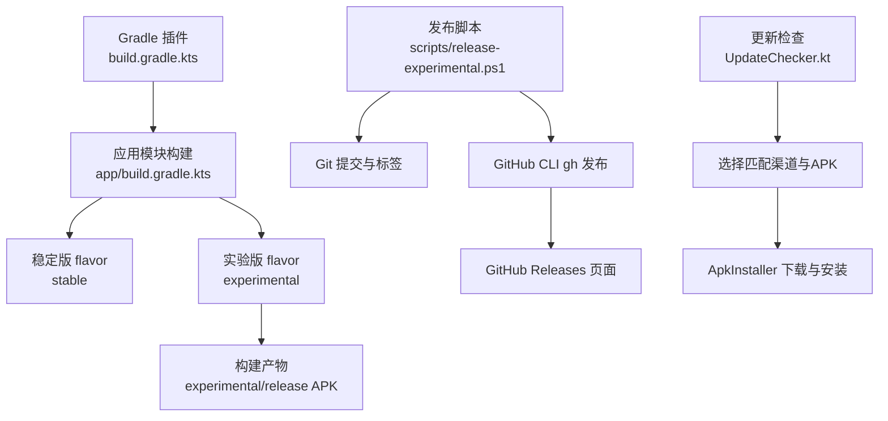
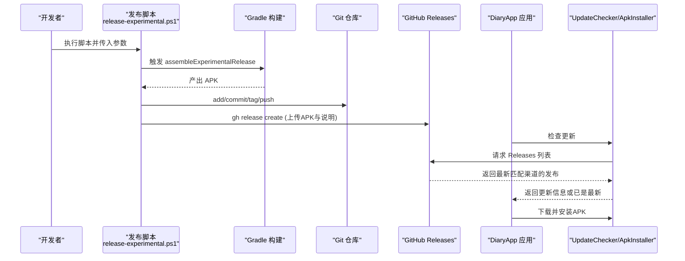
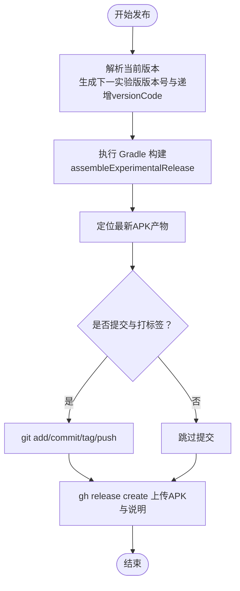
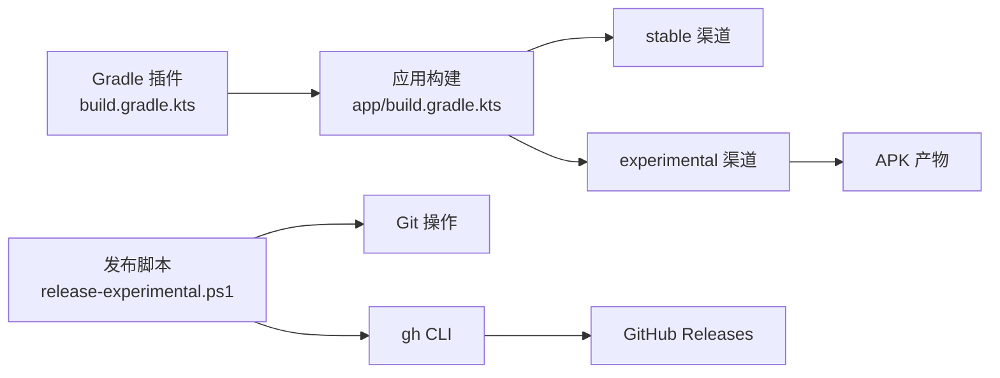

# 发布流程

<cite>
**本文引用的文件**
- [app/build.gradle.kts](file://app/build.gradle.kts)
- [build.gradle.kts](file://build.gradle.kts)
- [gradle.properties](file://gradle.properties)
- [scripts/release-experimental.ps1](file://scripts/release-experimental.ps1)
- [release-notes-v2.64.52-experimental.md](file://release-notes-v2.64.52-experimental.md)
- [docs/build-notes.md](file://docs/build-notes.md)
- [app/src/main/java/com/diary/app/update/UpdateChecker.kt](file://app/src/main/java/com/diary/app/update/UpdateChecker.kt)
- [app/src/main/java/com/diary/app/update/ApkInstaller.kt](file://app/src/main/java/com/diary/app/update/ApkInstaller.kt)
- [app/proguard-rules.pro](file://app/proguard-rules.pro)
- [local.properties](file://local.properties)
- [app/src/test/java/com/diary/app/update/ReleaseVersionUtilsTest.kt](file://app/src/test/java/com/diary/app/update/ReleaseVersionUtilsTest.kt)
</cite>

## 目录
1. [简介](#简介)
2. [项目结构](#项目结构)
3. [核心组件](#核心组件)
4. [架构总览](#架构总览)
5. [详细组件分析](#详细组件分析)
6. [依赖关系分析](#依赖关系分析)
7. [性能考量](#性能考量)
8. [故障排查指南](#故障排查指南)
9. [结论](#结论)
10. [附录](#附录)

## 简介
本指南面向DiaryApp的发布流程，覆盖稳定版（stable）与实验版（experimental）的发布策略差异、发布前准备、发布步骤、发布后监控与回滚机制，并提供发布检查清单与常见问题排查方法。DiaryApp采用Gradle多渠道构建（flavor），通过脚本自动化生成实验版发布包并推送至GitHub Releases。

## 项目结构
与发布相关的关键位置与职责：
- 构建与版本配置：app/build.gradle.kts（定义flavor、版本号、签名、混淆规则）
- Gradle插件与全局配置：build.gradle.kts、gradle.properties
- 实验版发布脚本：scripts/release-experimental.ps1（自动更新版本号、构建、提交、打标签、创建GitHub Release）
- 更新检查与安装：UpdateChecker.kt、ApkInstaller.kt（从GitHub Releases拉取最新版本并安装）
- 混淆与资源排除：app/proguard-rules.pro
- 本地密钥与环境变量：local.properties
- 测试与验证：docs/build-notes.md、ReleaseVersionUtilsTest.kt

图表来源
- [app/build.gradle.kts:60-73](file://app/build.gradle.kts#L60-L73)
- [scripts/release-experimental.ps1:87-125](file://scripts/release-experimental.ps1#L87-L125)
- [app/src/main/java/com/diary/app/update/UpdateChecker.kt:100-155](file://app/src/main/java/com/diary/app/update/UpdateChecker.kt#L100-L155)
- [app/src/main/java/com/diary/app/update/ApkInstaller.kt:20-76](file://app/src/main/java/com/diary/app/update/ApkInstaller.kt#L20-L76)

章节来源
- [app/build.gradle.kts:14-87](file://app/build.gradle.kts#L14-L87)
- [build.gradle.kts:1-6](file://build.gradle.kts#L1-L6)
- [gradle.properties:1-6](file://gradle.properties#L1-L6)

## 核心组件
- 版本与渠道配置
  - stable与experimental双flavor，分别设置独立的applicationId与versionName；experimental同时维护versionCode以支持并行发布。
  - 默认使用debug签名进行release构建，便于快速打包与测试。
- 发布脚本
  - 自动解析当前版本，生成下一个实验版版本号与递增的versionCode，写回构建文件。
  - 可选执行构建、提交代码与标签、推送至远程仓库、通过gh CLI创建GitHub Release。
- 更新检查与安装
  - 依据当前flavor过滤GitHub Releases，选择带APK资产且版本号更高的发布，支持强制更新标记。
  - 下载完成后复制到应用缓存并触发系统安装流程。
- 混淆与资源
  - 启用代码压缩与资源收缩，保留必要的类与SDK警告豁免，保证第三方库可用性。

章节来源
- [app/build.gradle.kts:18-52](file://app/build.gradle.kts#L18-L52)
- [app/build.gradle.kts:60-73](file://app/build.gradle.kts#L60-L73)
- [scripts/release-experimental.ps1:31-75](file://scripts/release-experimental.ps1#L31-L75)
- [app/src/main/java/com/diary/app/update/UpdateChecker.kt:49-81](file://app/src/main/java/com/diary/app/update/UpdateChecker.kt#L49-L81)
- [app/src/main/java/com/diary/app/update/ApkInstaller.kt:20-76](file://app/src/main/java/com/diary/app/update/ApkInstaller.kt#L20-L76)
- [app/proguard-rules.pro:1-31](file://app/proguard-rules.pro#L1-L31)

## 架构总览
下图展示了从发布脚本到用户端更新的整体流程：

图表来源
- [scripts/release-experimental.ps1:87-125](file://scripts/release-experimental.ps1#L87-L125)
- [app/src/main/java/com/diary/app/update/UpdateChecker.kt:49-81](file://app/src/main/java/com/diary/app/update/UpdateChecker.kt#L49-L81)
- [app/src/main/java/com/diary/app/update/ApkInstaller.kt:20-76](file://app/src/main/java/com/diary/app/update/ApkInstaller.kt#L20-L76)

## 详细组件分析

### 稳定版与实验版发布策略差异
- 版本号管理
  - stable：独立的versionName，用于正式发布与用户广泛使用。
  - experimental：在主版本号基础上追加“-experimental”后缀，versionCode与stable并行增长，便于快速迭代与测试。
- 发布时机
  - stable：经过充分测试与评审，面向普通用户的稳定版本。
  - experimental：高频小步迭代，面向内测用户或早期体验者，快速收集反馈。
- 目标用户群体
  - stable：追求稳定性的普通用户。
  - experimental：愿意承担一定不稳定风险、希望提前体验新功能的高级用户或内测群。

章节来源
- [app/build.gradle.kts:62-72](file://app/build.gradle.kts#L62-L72)

### 发布前准备
- 代码审查与测试
  - 在本地执行构建与单元测试，遵循推荐的JDK与构建路径，避免并行任务冲突。
  - 关注特定测试在不同JDK下的稳定性问题。
- 文档更新
  - 准备中文更新说明文件，命名规范与内容格式需保持一致。
- 环境准备
  - 配置local.properties中的GITHUB_TOKEN与第三方API密钥，确保构建与发布脚本可用。

章节来源
- [docs/build-notes.md:17-27](file://docs/build-notes.md#L17-L27)
- [local.properties:1-5](file://local.properties#L1-L5)

### 发布过程关键步骤
- 构建与打包
  - 通过脚本自动更新versionName与versionCode，随后执行assembleExperimentalRelease生成APK。
- 签名配置
  - release类型使用debug签名，便于快速发布与测试。
- 版本标注与发布
  - 可选提交代码与打标签，推送分支与标签；使用gh CLI创建GitHub Release并附带更新说明。

图表来源
- [scripts/release-experimental.ps1:31-75](file://scripts/release-experimental.ps1#L31-L75)
- [scripts/release-experimental.ps1:87-125](file://scripts/release-experimental.ps1#L87-L125)

章节来源
- [scripts/release-experimental.ps1:87-125](file://scripts/release-experimental.ps1#L87-L125)
- [app/build.gradle.kts:42-52](file://app/build.gradle.kts#L42-L52)

### 发布后监控与回滚
- 监控
  - 通过应用内的更新检查逻辑，确认用户端能正确识别最新版本与强制更新标记。
- 回滚
  - 若发现问题，可在GitHub Releases中删除或替换有问题的APK，或创建更低版本号的发布以引导用户回退。
  - 用户可通过下载管理器或文件管理器手动安装历史APK（安装流程由ApkInstaller负责）。

章节来源
- [app/src/main/java/com/diary/app/update/UpdateChecker.kt:100-155](file://app/src/main/java/com/diary/app/update/UpdateChecker.kt#L100-L155)
- [app/src/main/java/com/diary/app/update/ApkInstaller.kt:97-114](file://app/src/main/java/com/diary/app/update/ApkInstaller.kt#L97-L114)

### 版本比较与排序逻辑
- 版本号比较
  - 支持主版本号逐段数值比较，兼容“-experimental”后缀的通道区分。
- 排序显示
  - 对渠道内发布按版本降序排列，确保最新版本优先展示。

章节来源
- [app/src/test/java/com/diary/app/update/ReleaseVersionUtilsTest.kt:9-29](file://app/src/test/java/com/diary/app/update/ReleaseVersionUtilsTest.kt#L9-L29)
- [app/src/main/java/com/diary/app/update/UpdateChecker.kt:157-177](file://app/src/main/java/com/diary/app/update/UpdateChecker.kt#L157-L177)

## 依赖关系分析
- 构建与插件
  - 全局插件声明与应用模块插件组合，确保编译与KSP配置一致。
- 渠道与版本
  - flavor维度将stable与experimental隔离，各自拥有独立的版本元数据。
- 发布脚本与外部工具
  - 依赖Git与gh CLI完成发布流程；本地属性文件提供必要令牌与密钥。

图表来源
- [build.gradle.kts:1-6](file://build.gradle.kts#L1-L6)
- [app/build.gradle.kts:60-73](file://app/build.gradle.kts#L60-L73)
- [scripts/release-experimental.ps1:99-125](file://scripts/release-experimental.ps1#L99-L125)

章节来源
- [build.gradle.kts:1-6](file://build.gradle.kts#L1-L6)
- [app/build.gradle.kts:60-73](file://app/build.gradle.kts#L60-L73)
- [scripts/release-experimental.ps1:99-125](file://scripts/release-experimental.ps1#L99-L125)

## 性能考量
- 构建性能
  - 使用单工作线程与禁用守护进程的构建参数，减少资源竞争，提升稳定性。
- 代码与资源
  - 启用代码压缩与资源收缩，降低包体；保留必要第三方类与SDK，避免运行期异常。
- 网络与更新
  - 更新检查设置合理的超时与错误处理，避免阻塞主线程；下载进度反馈提升用户体验。

章节来源
- [docs/build-notes.md:19-21](file://docs/build-notes.md#L19-L21)
- [app/build.gradle.kts:44-50](file://app/build.gradle.kts#L44-L50)
- [app/proguard-rules.pro:1-31](file://app/proguard-rules.pro#L1-L31)
- [app/src/main/java/com/diary/app/update/UpdateChecker.kt:60-61](file://app/src/main/java/com/diary/app/update/UpdateChecker.kt#L60-L61)

## 故障排查指南
- 构建失败
  - 检查JDK版本与构建路径，避免并行任务冲突；关注特定测试在高版本JDK下的异常。
- 发布脚本错误
  - 确认版本号格式与正则匹配；确保Notes文件存在；检查Git与gh CLI权限。
- 更新检查异常
  - 核对GITHUB_TOKEN与仓库信息；确认网络连通性与响应码；检查Release说明中是否包含强制更新标记。
- 安装失败
  - 检查APK下载与缓存复制是否成功；确认FileProvider配置与URI权限；若自动安装失败，允许用户手动安装。

章节来源
- [docs/build-notes.md:13-16](file://docs/build-notes.md#L13-L16)
- [scripts/release-experimental.ps1:55-57](file://scripts/release-experimental.ps1#L55-L57)
- [scripts/release-experimental.ps1:83-85](file://scripts/release-experimental.ps1#L83-L85)
- [app/src/main/java/com/diary/app/update/UpdateChecker.kt:53-79](file://app/src/main/java/com/diary/app/update/UpdateChecker.kt#L53-L79)
- [app/src/main/java/com/diary/app/update/ApkInstaller.kt:97-114](file://app/src/main/java/com/diary/app/update/ApkInstaller.kt#L97-L114)

## 结论
DiaryApp的发布体系以Gradle多渠道与PowerShell脚本为核心，结合GitHub Releases实现实验版的快速迭代与用户更新。通过严格的版本号管理、明确的发布前准备与完善的监控回滚机制，能够有效保障发布质量与用户体验。建议持续完善测试与文档，确保每次发布可追溯、可回滚、可观察。

## 附录

### 发布检查清单
- 代码与测试
  - 本地构建与单元测试通过；遵循推荐JDK与构建路径。
- 版本与说明
  - 版本号格式正确；更新说明文件已准备并符合规范。
- 环境与密钥
  - local.properties中GITHUB_TOKEN与API密钥配置正确。
- 发布脚本
  - 正确执行脚本参数；构建产物存在；Git与gh CLI可用。
- 发布后验证
  - GitHub Releases页面可访问；应用内更新检查正常；安装流程可用。

章节来源
- [docs/build-notes.md:17-27](file://docs/build-notes.md#L17-L27)
- [release-notes-v2.64.52-experimental.md:1-9](file://release-notes-v2.64.52-experimental.md#L1-L9)
- [local.properties:1-5](file://local.properties#L1-L5)
- [scripts/release-experimental.ps1:87-125](file://scripts/release-experimental.ps1#L87-L125)