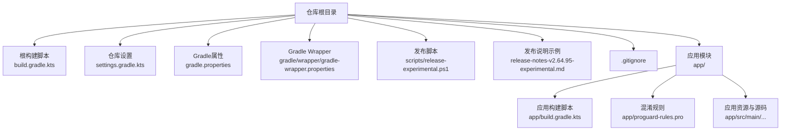
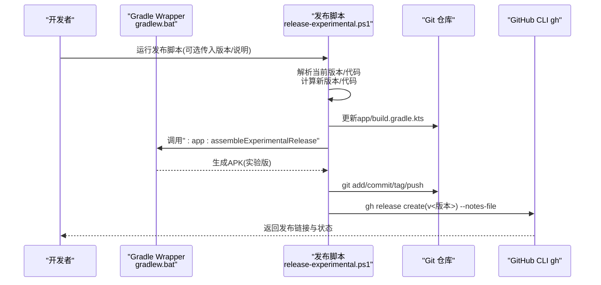
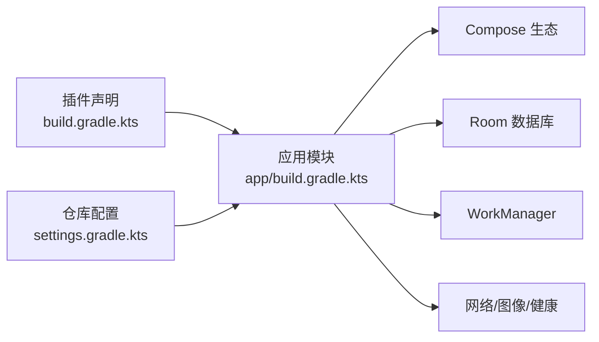

# 构建与部署

<cite>
**本文引用的文件**
- [build.gradle.kts](file://build.gradle.kts)
- [app/build.gradle.kts](file://app/build.gradle.kts)
- [settings.gradle.kts](file://settings.gradle.kts)
- [gradle.properties](file://gradle.properties)
- [gradle-wrapper.properties](file://gradle/wrapper/gradle-wrapper.properties)
- [proguard-rules.pro](file://app/proguard-rules.pro)
- [release-experimental.ps1](file://scripts/release-experimental.ps1)
- [release-notes-v2.64.95-experimental.md](file://release-notes-v2.64.95-experimental.md)
- [.gitignore](file://.gitignore)
</cite>

## 目录
1. [简介](#简介)
2. [项目结构](#项目结构)
3. [核心组件](#核心组件)
4. [架构总览](#架构总览)
5. [详细组件分析](#详细组件分析)
6. [依赖关系分析](#依赖关系分析)
7. [性能考量](#性能考量)
8. [故障排查指南](#故障排查指南)
9. [结论](#结论)
10. [附录](#附录)

## 简介
本指南面向DiaryApp项目的构建与部署，涵盖Gradle构建配置（构建变体、签名配置、混淆与资源压缩）、多渠道发布（稳定版与实验版）策略、自动化发布脚本与流程、版本管理与发布说明规范，以及生产环境部署最佳实践与安全注意事项。内容基于仓库中的实际构建脚本与配置文件整理而成，确保读者能够快速理解并复用现有流水线。

## 项目结构
DiaryApp采用标准的Android应用模块化布局，根目录包含全局Gradle插件与仓库设置，app模块包含应用级构建脚本、资源与源码，scripts目录提供发布自动化脚本，docs与release-notes提供发布说明模板与历史记录。

图表来源
- [build.gradle.kts:1-6](file://build.gradle.kts#L1-L6)
- [settings.gradle.kts:1-18](file://settings.gradle.kts#L1-L18)
- [gradle.properties:1-6](file://gradle.properties#L1-L6)
- [gradle-wrapper.properties:1-6](file://gradle/wrapper/gradle-wrapper.properties#L1-L6)
- [release-experimental.ps1:1-129](file://scripts/release-experimental.ps1#L1-L129)
- [release-notes-v2.64.95-experimental.md:1-7](file://release-notes-v2.64.95-experimental.md#L1-L7)
- [app/build.gradle.kts:1-145](file://app/build.gradle.kts#L1-L145)
- [app/proguard-rules.pro:1-31](file://app/proguard-rules.pro#L1-L31)

章节来源
- [build.gradle.kts:1-6](file://build.gradle.kts#L1-L6)
- [settings.gradle.kts:1-18](file://settings.gradle.kts#L1-L18)
- [gradle.properties:1-6](file://gradle.properties#L1-L6)
- [gradle-wrapper.properties:1-6](file://gradle/wrapper/gradle-wrapper.properties#L1-L6)

## 核心组件
- Gradle根脚本：集中声明插件版本，避免在子模块重复定义。
- 应用模块构建脚本：定义编译参数、构建类型、产品风味、依赖与打包配置。
- Gradle属性与Wrapper：统一JVM参数、AndroidX开关、仓库镜像等。
- 混淆与资源压缩：通过ProGuard/R8规则保留必要类与注解，排除第三方SDK警告。
- 发布脚本：自动化实验版构建、版本号与代码递增、Git提交与打标签、GitHub CLI发布。

章节来源
- [app/build.gradle.kts:14-87](file://app/build.gradle.kts#L14-L87)
- [proguard-rules.pro:1-31](file://app/proguard-rules.pro#L1-L31)
- [release-experimental.ps1:1-129](file://scripts/release-experimental.ps1#L1-L129)

## 架构总览
下图展示DiaryApp构建与发布的关键路径：开发者通过Gradle命令触发构建，脚本根据当前版本自动生成新版本号并更新构建脚本；产物生成后进行Git提交与标签推送，并使用GitHub CLI创建发布，附带发布说明文件。

图表来源
- [release-experimental.ps1:31-125](file://scripts/release-experimental.ps1#L31-L125)
- [app/build.gradle.kts:60-73](file://app/build.gradle.kts#L60-L73)

## 详细组件分析

### Gradle构建配置
- 插件与版本
  - 根脚本集中声明Android应用、Kotlin与KSP插件版本，避免重复。
  - 应用模块启用KSP以支持Room编译期处理。
- 编译与语言级别
  - compileSdk/targetSdk/minSdk设定明确；Java/Kotlin目标兼容1.8。
- 构建类型
  - release开启代码压缩与资源收缩，使用调试签名配置用于release签名（便于本地调试与发布流程一致）。
- 产品风味（Flavor）
  - 维度version包含stable与experimental两个风味：
    - stable：applicationId与versionName固定，适合正式发布渠道。
    - experimental：独立applicationId与versionCode/versionName，便于灰度与内测。
- Compose与打包
  - 启用Compose与BuildConfig；Compose编译器扩展版本固定。
  - 排除特定META-INF许可证文件，减少打包冲突。
- 构建字段与清单占位符
  - BuildConfig字段注入GitHub与高德地图API密钥（从local.properties读取），并在清单中注入高德API Key。

章节来源
- [build.gradle.kts:1-6](file://build.gradle.kts#L1-L6)
- [app/build.gradle.kts:3-87](file://app/build.gradle.kts#L3-L87)

### 多渠道发布策略（稳定版 vs 实验版）
- 稳定版（stable）
  - 固定版本号与名称，适合正式商店分发与用户长期使用。
- 实验版（experimental）
  - 独立包名，版本号与代码可随迭代快速变更，便于内测与灰度验证。
- 构建差异
  - experimental使用调试签名配置，简化本地与CI签名一致性。
  - experimental产物位于独立输出目录，便于区分与归档。

章节来源
- [app/build.gradle.kts:60-73](file://app/build.gradle.kts#L60-L73)

### 签名配置与发布流程
- 签名策略
  - release构建类型使用调试签名配置，保证本地与CI环境一致。
- 发布脚本能力
  - 自动解析当前版本，按主.次.补丁格式递增补丁版本并追加“-experimental”后缀。
  - 自动生成或使用指定发布说明文件，构建完成后执行git提交、打标签与推送。
  - 使用GitHub CLI创建发布，附带产物与说明文件。

章节来源
- [app/build.gradle.kts:37-52](file://app/build.gradle.kts#L37-L52)
- [release-experimental.ps1:31-125](file://scripts/release-experimental.ps1#L31-L125)

### 混淆与资源压缩
- 规则要点
  - 保留Gson相关类与DiaryApp数据备份相关类，确保序列化与导入导出功能正常。
  - 保留高德地图SDK相关类，屏蔽其内部警告，避免混淆破坏SDK行为。
- 影响范围
  - 仅影响release构建，debug构建不启用压缩与资源收缩。

章节来源
- [proguard-rules.pro:1-31](file://app/proguard-rules.pro#L1-L31)
- [app/build.gradle.kts:44-50](file://app/build.gradle.kts#L44-L50)

### 版本管理与发布说明规范
- 版本命名
  - 实验版遵循“主.次.补丁-experimental”格式，脚本自动递增补丁版本。
- 版本号与代码
  - versionCode按当前值+1递增；versionName由主.次.补丁组成并追加后缀。
- 发布说明
  - 脚本支持传入现有说明文件或生成临时说明文件；建议遵循“标题+变更点列表”的Markdown格式，便于自动化发布。

章节来源
- [release-experimental.ps1:44-61](file://scripts/release-experimental.ps1#L44-L61)
- [release-notes-v2.64.95-experimental.md:1-7](file://release-notes-v2.64.95-experimental.md#L1-L7)

### 自动化部署流程（CI/CD）
- 本地与CI一致性
  - 使用Gradle Wrapper确保不同环境版本一致。
  - 发布脚本通过Gradle命令调用具体变体构建任务。
- 流水线建议步骤
  - 拉取代码 → 设置环境变量（如GitHub Token、高德Key）→ 执行发布脚本 → 上传产物至制品库 → 创建发布。
- 安全注意
  - 敏感信息通过local.properties与环境变量注入，避免硬编码到仓库。

章节来源
- [gradle-wrapper.properties:1-6](file://gradle/wrapper/gradle-wrapper.properties#L1-L6)
- [release-experimental.ps1:87-125](file://scripts/release-experimental.ps1#L87-L125)
- [app/build.gradle.kts:29-34](file://app/build.gradle.kts#L29-L34)

## 依赖关系分析
- 插件与仓库
  - 根脚本声明插件版本；settings脚本统一仓库源（Google、Maven Central、Gradle Portal）。
- 模块与外部库
  - 应用模块依赖Compose、Navigation、Lifecycle、Room、WorkManager、Gson、Coil、WebKit、Biometric、Health Connect、高德地图等。
- KSP与Room
  - 使用KSP处理Room注解，提升编译性能与类型安全。

图表来源
- [build.gradle.kts:1-6](file://build.gradle.kts#L1-L6)
- [settings.gradle.kts:1-18](file://settings.gradle.kts#L1-L18)
- [app/build.gradle.kts:89-144](file://app/build.gradle.kts#L89-L144)

章节来源
- [build.gradle.kts:1-6](file://build.gradle.kts#L1-L6)
- [settings.gradle.kts:1-18](file://settings.gradle.kts#L1-L18)
- [app/build.gradle.kts:89-144](file://app/build.gradle.kts#L89-L144)

## 性能考量
- 代码压缩与资源收缩
  - release构建启用R8压缩与资源收缩，显著减小APK体积，但需配合ProGuard规则确保关键类不被误删。
- JVM与编译参数
  - Gradle属性设置合理JVM内存与编码，有助于长时间构建稳定性。
- 并行与缓存
  - 建议在CI中启用Gradle构建缓存与并行任务，缩短构建时间。

章节来源
- [app/build.gradle.kts:44-50](file://app/build.gradle.kts#L44-L50)
- [gradle.properties:1-6](file://gradle.properties#L1-L6)

## 故障排查指南
- 找不到实验版APK
  - 现象：脚本无法定位APK。
  - 排查：确认已执行实验版release构建任务，检查输出目录是否存在APK。
  - 参考：[release-experimental.ps1:91-97](file://scripts/release-experimental.ps1#L91-L97)
- 当前版本解析失败
  - 现象：脚本无法匹配versionName或versionCode。
  - 排查：检查构建脚本中版本命名是否符合“主.次.补丁-experimental”格式。
  - 参考：[release-experimental.ps1:31-39](file://scripts/release-experimental.ps1#L31-L39)
- Git操作失败
  - 现象：提交、打标签或推送失败。
  - 排查：确认当前分支、远程仓库可达性与凭据配置。
  - 参考：[release-experimental.ps1:99-109](file://scripts/release-experimental.ps1#L99-L109)
- GitHub CLI发布失败
  - 现象：gh release create返回错误。
  - 排查：确认令牌权限、说明文件路径与标签存在性。
  - 参考：[release-experimental.ps1:111-125](file://scripts/release-experimental.ps1#L111-L125)
- 忽略文件与本地配置
  - 现象：本地密钥泄露或构建差异。
  - 排查：确保local.properties与IDE相关文件被.gitignore忽略。
  - 参考：[.gitignore:1-11](file://.gitignore#L1-L11)

章节来源
- [release-experimental.ps1:31-39](file://scripts/release-experimental.ps1#L31-L39)
- [release-experimental.ps1:91-97](file://scripts/release-experimental.ps1#L91-L97)
- [release-experimental.ps1:99-109](file://scripts/release-experimental.ps1#L99-L109)
- [release-experimental.ps1:111-125](file://scripts/release-experimental.ps1#L111-L125)
- [.gitignore:1-11](file://.gitignore#L1-L11)

## 结论
DiaryApp的构建与发布体系以Gradle为核心，结合产品风味实现稳定版与实验版的差异化发布；通过PowerShell脚本自动化版本号递增、构建、提交与GitHub发布，形成可复用的CI/CD基础。建议在CI中完善密钥注入与产物归档，并持续维护发布说明模板，确保发布过程透明、可追溯且安全可控。

## 附录
- 关键文件速览
  - 根构建脚本：[build.gradle.kts](file://build.gradle.kts)
  - 应用构建脚本：[app/build.gradle.kts](file://app/build.gradle.kts)
  - 仓库设置：[settings.gradle.kts](file://settings.gradle.kts)
  - Gradle属性：[gradle.properties](file://gradle.properties)
  - Gradle Wrapper：[gradle-wrapper.properties](file://gradle/wrapper/gradle-wrapper.properties)
  - 混淆规则：[proguard-rules.pro](file://app/proguard-rules.pro)
  - 发布脚本：[release-experimental.ps1](file://scripts/release-experimental.ps1)
  - 发布说明示例：[release-notes-v2.64.95-experimental.md](file://release-notes-v2.64.95-experimental.md)
  - 忽略文件：[.gitignore](file://.gitignore)