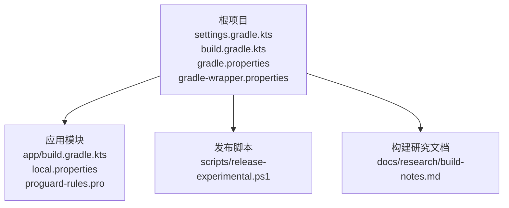
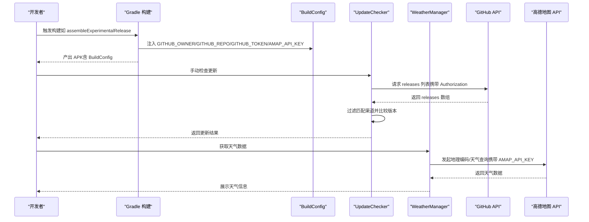
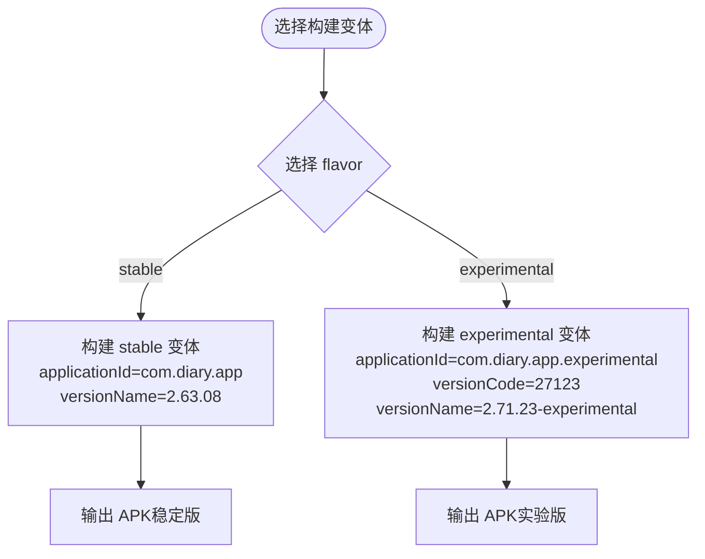
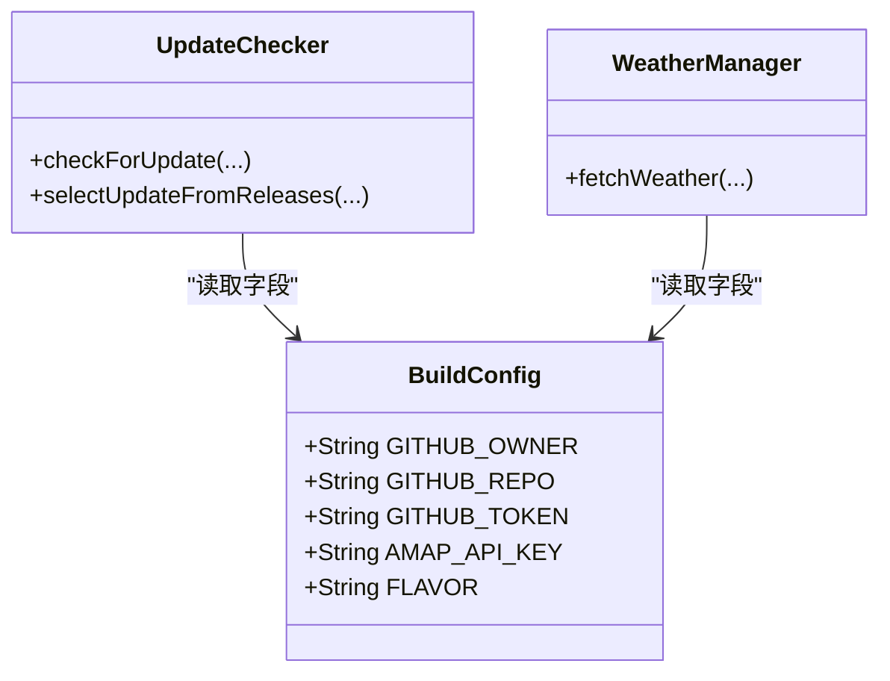
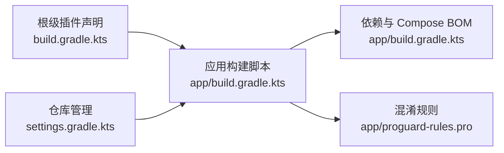

# 构建配置

<cite>
**本文引用的文件**
- [build.gradle.kts](file://build.gradle.kts)
- [app/build.gradle.kts](file://app/build.gradle.kts)
- [gradle.properties](file://gradle.properties)
- [settings.gradle.kts](file://settings.gradle.kts)
- [gradle/wrapper/gradle-wrapper.properties](file://gradle/wrapper/gradle-wrapper.properties)
- [local.properties](file://local.properties)
- [app/proguard-rules.pro](file://app/proguard-rules.pro)
- [scripts/release-experimental.ps1](file://scripts/release-experimental.ps1)
- [docs/research/build-notes.md](file://docs/research/build-notes.md)
- [app/src/main/java/com/diary/app/update/UpdateChecker.kt](file://app/src/main/java/com/diary/app/update/UpdateChecker.kt)
- [app/src/main/java/com/diary/app/weather/WeatherManager.kt](file://app/src/main/java/com/diary/app/weather/WeatherManager.kt)
</cite>

## 目录
1. [简介](#简介)
2. [项目结构](#项目结构)
3. [核心组件](#核心组件)
4. [架构概览](#架构概览)
5. [详细组件分析](#详细组件分析)
6. [依赖关系分析](#依赖关系分析)
7. [性能考量](#性能考量)
8. [故障排查指南](#故障排查指南)
9. [结论](#结论)
10. [附录](#附录)

## 简介
本文件系统性梳理 DiaryApp 的构建配置，重点覆盖：
- Android 编译与打包设置
- 依赖管理策略与 Compose 配置
- 构建变体与 flavor（稳定版与实验版）差异
- 版本号与签名策略
- BuildConfig 字段注入（GitHub API 与高德地图 API）
- 最佳实践与常见问题处理

## 项目结构
DiaryApp 采用多模块工程布局，根目录包含 Gradle 插件与仓库管理配置，主应用模块位于 app 子目录，包含应用级的构建脚本与资源。

图表来源
- [settings.gradle.kts:1-18](file://settings.gradle.kts#L1-L18)
- [build.gradle.kts:1-6](file://build.gradle.kts#L1-L6)
- [gradle.properties:1-6](file://gradle.properties#L1-L6)
- [gradle/wrapper/gradle-wrapper.properties:1-6](file://gradle/wrapper/gradle-wrapper.properties#L1-L6)
- [app/build.gradle.kts:1-145](file://app/build.gradle.kts#L1-L145)
- [scripts/release-experimental.ps1:1-89](file://scripts/release-experimental.ps1#L1-L89)
- [docs/research/build-notes.md:36-92](file://docs/research/build-notes.md#L36-L92)

章节来源
- [settings.gradle.kts:1-18](file://settings.gradle.kts#L1-L18)
- [build.gradle.kts:1-6](file://build.gradle.kts#L1-L6)
- [gradle.properties:1-6](file://gradle.properties#L1-L6)
- [gradle/wrapper/gradle-wrapper.properties:1-6](file://gradle/wrapper/gradle-wrapper.properties#L1-L6)

## 核心组件
- Gradle 插件与版本：根级插件统一声明 Android 应用、Kotlin Android 与 KSP 插件版本，避免子模块重复声明。
- 仓库与解析：通过 pluginManagement 与 dependencyResolutionManagement 统一管理仓库源。
- 应用级构建：在 app 模块集中定义 compileSdk、minSdk、targetSdk、版本号、签名、构建类型、flavor、Compose 与打包规则等。
- 本地配置：通过 local.properties 注入 GitHub Token 与高德地图 API Key，并在 BuildConfig 中暴露给应用代码。

章节来源
- [build.gradle.kts:1-6](file://build.gradle.kts#L1-L6)
- [settings.gradle.kts:1-18](file://settings.gradle.kts#L1-L18)
- [app/build.gradle.kts:14-87](file://app/build.gradle.kts#L14-L87)
- [local.properties:1-5](file://local.properties#L1-L5)

## 架构概览
下图展示构建配置与运行时的关键交互：构建阶段生成 BuildConfig 字段，运行时 UpdateChecker 与 WeatherManager 读取这些字段进行网络请求。

图表来源
- [app/build.gradle.kts:29-34](file://app/build.gradle.kts#L29-L34)
- [app/src/main/java/com/diary/app/update/UpdateChecker.kt:49-81](file://app/src/main/java/com/diary/app/update/UpdateChecker.kt#L49-L81)
- [app/src/main/java/com/diary/app/weather/WeatherManager.kt:169-322](file://app/src/main/java/com/diary/app/weather/WeatherManager.kt#L169-L322)

## 详细组件分析

### Android 编译与打包设置
- 命名空间与 SDK：命名空间固定；compileSdk/targetSdk/minSdk 明确，确保兼容性与稳定性。
- 默认配置：applicationId、versionCode、versionName、测试 Runner、向量库支持。
- 构建类型：release 启用混淆与资源压缩，使用 debug 签名配置，指定 ProGuard 规则文件。
- 编译选项：Java 8 兼容（source/targetCompatibility），Kotlin JVM 目标为 1.8。
- Compose：开启 compose 与 buildConfig，指定扩展版本以适配 Kotlin 版本。
- 打包排除：排除特定元数据，减少冲突与体积。

章节来源
- [app/build.gradle.kts:14-87](file://app/build.gradle.kts#L14-L87)
- [gradle.properties:1-6](file://gradle.properties#L1-L6)

### 依赖管理与 Compose 配置
- 依赖平台：使用 Compose BOM 管理版本，保证 Compose 生态一致性。
- 关键依赖：Compose UI/Material3、Navigation、Lifecycle、Room、WorkManager、Gson、Coil、WebView、Biometric、Health Connect、高德地图 SDK。
- KSP：Room 使用 KSP 编译器，提升编译性能与类型安全。
- 调试依赖：仅在 debug 可见的工具与测试清单。

章节来源
- [app/build.gradle.kts:89-144](file://app/build.gradle.kts#L89-L144)

### 构建变体与 productFlavors
- 维度：定义 flavorDimension 为 "version"。
- 稳定版（stable）：applicationId 与 versionName 固定，适合正式发布渠道。
- 实验版（experimental）：applicationId 与 versionCode/ versionName 不同，便于并行安装与独立更新通道。
- 渠道规则：应用通过 BuildConfig.FLAVOR 进行更新检测过滤，确保只接受对应渠道的发布标签。

图表来源
- [app/build.gradle.kts:60-73](file://app/build.gradle.kts#L60-L73)
- [docs/research/build-notes.md:36-47](file://docs/research/build-notes.md#L36-L47)

章节来源
- [app/build.gradle.kts:60-73](file://app/build.gradle.kts#L60-L73)
- [docs/research/build-notes.md:36-47](file://docs/research/build-notes.md#L36-L47)

### 版本号与签名策略
- 版本号：experimental 使用递增的 versionCode 与带 -experimental 后缀的 versionName；stable 使用稳定的主版本号。
- 签名：release 使用 debug 签名配置，便于开发调试；生产发布建议替换为正式签名。
- 发布脚本：PowerShell 脚本自动读取当前 experimental 版本，按规则递增并写回构建文件，随后执行构建命令。

章节来源
- [app/build.gradle.kts:22-23](file://app/build.gradle.kts#L22-L23)
- [app/build.gradle.kts:42-51](file://app/build.gradle.kts#L42-L51)
- [scripts/release-experimental.ps1:31-75](file://scripts/release-experimental.ps1#L31-L75)

### BuildConfig 字段与 API 注入
- 字段注入：通过 buildConfigField 注入 GitHub 仓库所有者、仓库名、GitHub Token 与高德地图 API Key；同时通过 manifestPlaceholders 注入高德 Key。
- 运行时使用：
  - UpdateChecker：读取 BuildConfig.GITHUB_OWNER、GITHUB_REPO、GITHUB_TOKEN，发起 GitHub Releases API 请求并根据 FLAVOR 过滤渠道。
  - WeatherManager：读取 BuildConfig.AMAP_API_KEY，调用高德地图服务获取地理编码与天气数据。
- 安全性：Token 与 API Key 来自 local.properties，避免硬编码到仓库。

图表来源
- [app/build.gradle.kts:29-34](file://app/build.gradle.kts#L29-L34)
- [app/src/main/java/com/diary/app/update/UpdateChecker.kt:49-81](file://app/src/main/java/com/diary/app/update/UpdateChecker.kt#L49-L81)
- [app/src/main/java/com/diary/app/weather/WeatherManager.kt:169-170](file://app/src/main/java/com/diary/app/weather/WeatherManager.kt#L169-L170)

章节来源
- [app/build.gradle.kts:29-34](file://app/build.gradle.kts#L29-L34)
- [app/src/main/java/com/diary/app/update/UpdateChecker.kt:49-81](file://app/src/main/java/com/diary/app/update/UpdateChecker.kt#L49-L81)
- [app/src/main/java/com/diary/app/weather/WeatherManager.kt:169-170](file://app/src/main/java/com/diary/app/weather/WeatherManager.kt#L169-L170)

### ProGuard 与资源打包
- ProGuard：保留 Gson、备份相关类、高德 SDK 类，屏蔽警告，确保混淆不影响核心功能。
- 打包排除：排除特定元数据，降低冲突风险。

章节来源
- [app/proguard-rules.pro:1-31](file://app/proguard-rules.pro#L1-L31)
- [app/build.gradle.kts:82-86](file://app/build.gradle.kts#L82-L86)

## 依赖关系分析
- Gradle 插件层：根级统一声明插件版本，避免子模块重复或版本不一致。
- 依赖解析层：统一仓库源，优先 Google 与 Maven Central。
- 应用层：Compose BOM 管理 UI 相关依赖；Room/KSP 支持数据库；WorkManager 支持后台任务；高德地图 SDK 提供地图能力。

图表来源
- [build.gradle.kts:1-6](file://build.gradle.kts#L1-L6)
- [settings.gradle.kts:9-14](file://settings.gradle.kts#L9-L14)
- [app/build.gradle.kts:89-144](file://app/build.gradle.kts#L89-L144)
- [app/proguard-rules.pro:1-31](file://app/proguard-rules.pro#L1-L31)

章节来源
- [build.gradle.kts:1-6](file://build.gradle.kts#L1-L6)
- [settings.gradle.kts:9-14](file://settings.gradle.kts#L9-L14)
- [app/build.gradle.kts:89-144](file://app/build.gradle.kts#L89-L144)

## 性能考量
- 混淆与资源收缩：release 开启混淆与资源压缩，显著减小包体并提升安全性。
- Compose 编译器：使用指定扩展版本，配合 Kotlin 版本，确保编译效率与稳定性。
- 依赖平台化：Compose BOM 统一版本，减少版本冲突带来的额外开销。
- 打包排除：排除特定元数据，避免重复与冲突，提高打包速度。

章节来源
- [app/build.gradle.kts:42-51](file://app/build.gradle.kts#L42-L51)
- [app/build.gradle.kts:79-81](file://app/build.gradle.kts#L79-L81)
- [app/build.gradle.kts:89-144](file://app/build.gradle.kts#L89-L144)
- [app/build.gradle.kts:82-86](file://app/build.gradle.kts#L82-L86)

## 故障排查指南
- 更新检测无效
  - 确认当前构建 flavor 与 GitHub Release 标签是否匹配（stable 不含 experimental，experimental 仅接受含 experimental 的标签）。
  - 确认已创建对应 Release 并上传 APK 资产。
  - 确认本地已正确配置 GITHUB_TOKEN，否则可能触发速率限制或认证失败。
- 高德地图 API 失败
  - 检查 AMAP_API_KEY 是否在 local.properties 中正确配置。
  - 确认 BuildConfig.AMAP_API_KEY 已注入并在运行时可用。
- 构建失败或混淆异常
  - 检查 ProGuard 规则是否遗漏关键类（如 Gson、备份类、高德 SDK）。
  - 确认 Java/Kotlin 兼容性设置与 Compose 扩展版本匹配。
- 实验版版本号不更新
  - 使用发布脚本自动递增 versionCode 与 versionName，并确保构建命令执行成功。

章节来源
- [docs/research/build-notes.md:36-92](file://docs/research/build-notes.md#L36-L92)
- [app/build.gradle.kts:29-34](file://app/build.gradle.kts#L29-L34)
- [app/src/main/java/com/diary/app/update/UpdateChecker.kt:49-81](file://app/src/main/java/com/diary/app/update/UpdateChecker.kt#L49-L81)
- [app/src/main/java/com/diary/app/weather/WeatherManager.kt:169-170](file://app/src/main/java/com/diary/app/weather/WeatherManager.kt#L169-L170)
- [scripts/release-experimental.ps1:31-75](file://scripts/release-experimental.ps1#L31-L75)

## 结论
DiaryApp 的构建配置围绕“清晰的变体区分、安全的 API 注入、稳定的依赖管理与合理的混淆策略”展开。通过 BuildConfig 将敏感配置注入到应用运行时，结合 UpdateChecker 与 WeatherManager 的实际使用，形成从构建到运行的完整闭环。遵循本文最佳实践与故障排查建议，可有效提升构建稳定性与发布效率。

## 附录
- 本地配置示例：local.properties 中包含 SDK 路径、GitHub Token 与高德地图 API Key。
- 发布流程参考：PowerShell 脚本自动化处理版本号递增与构建命令执行。

章节来源
- [local.properties:1-5](file://local.properties#L1-L5)
- [scripts/release-experimental.ps1:1-89](file://scripts/release-experimental.ps1#L1-L89)