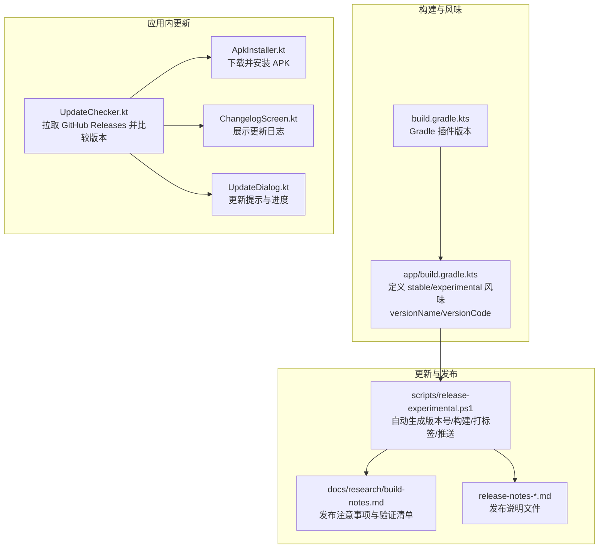
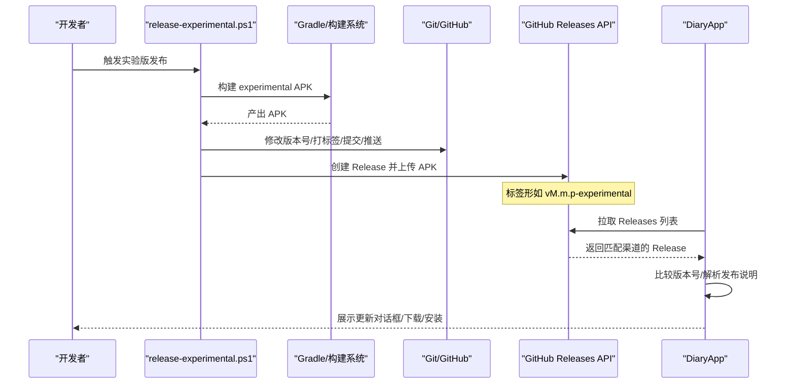
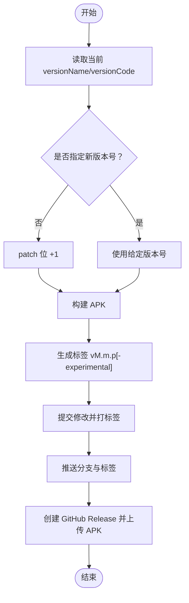
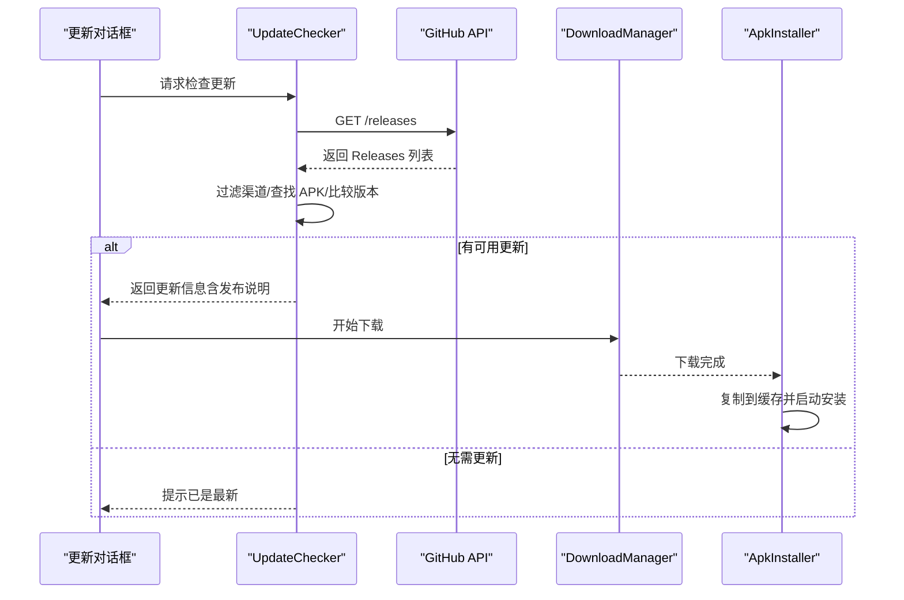
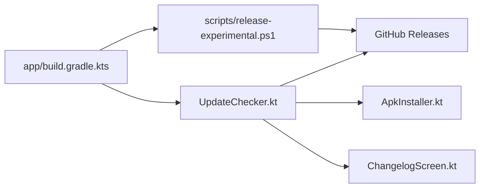

# 版本管理

<cite>
**本文引用的文件**
- [app/build.gradle.kts](file://app/build.gradle.kts)
- [build.gradle.kts](file://build.gradle.kts)
- [scripts/release-experimental.ps1](file://scripts/release-experimental.ps1)
- [docs/research/build-notes.md](file://docs/research/build-notes.md)
- [app/src/main/java/com/diary/app/update/UpdateChecker.kt](file://app/src/main/java/com/diary/app/update/UpdateChecker.kt)
- [app/src/main/java/com/diary/app/update/ApkInstaller.kt](file://app/src/main/java/com/diary/app/update/ApkInstaller.kt)
- [app/src/main/java/com/diary/app/update/ChangelogScreen.kt](file://app/src/main/java/com/diary/app/update/ChangelogScreen.kt)
- [app/src/main/java/com/diary/app/update/UpdateDialog.kt](file://app/src/main/java/com/diary/app/update/UpdateDialog.kt)
- [app/src/test/java/com/diary/app/update/ReleaseVersionUtilsTest.kt](file://app/src/test/java/com/diary/app/update/ReleaseVersionUtilsTest.kt)
- [release-notes-v2.64.52-experimental.md](file://release-notes-v2.64.52-experimental.md)
- [release-notes-v2.64.54-experimental.md](file://release-notes-v2.64.54-experimental.md)
- [release-notes-v2.64.93-experimental.md](file://release-notes-v2.64.93-experimental.md)
- [release-notes-v2.64.94-experimental.md](file://release-notes-v2.64.94-experimental.md)
- [release-notes-v2.64.95-experimental.md](file://release-notes-v2.64.95-experimental.md)
- [release-notes-v2.67.03-experimental.md](file://release-notes-v2.67.03-experimental.md)
</cite>

## 目录
1. [简介](#简介)
2. [项目结构](#项目结构)
3. [核心组件](#核心组件)
4. [架构总览](#架构总览)
5. [详细组件分析](#详细组件分析)
6. [依赖关系分析](#依赖关系分析)
7. [性能考量](#性能考量)
8. [故障排查指南](#故障排查指南)
9. [结论](#结论)
10. [附录](#附录)

## 简介
本规范面向 DiaryApp 的版本管理流程，覆盖版本命名与递增策略、实验版标识、发布说明编写、渠道差异（实验版 vs 稳定版）、发布与回退最佳实践，以及与应用内更新检查、下载安装、变更日志展示的集成方式。目标是确保版本号、构建产物、发布渠道与用户感知一致，提升发布效率与可追溯性。

## 项目结构
DiaryApp 采用 Gradle 多风味（flavor）区分稳定版与实验版，版本号在构建脚本中集中管理；更新检查与安装由应用内模块负责；发布说明以 Markdown 文件形式维护并与自动化脚本配合。

图示来源
- [app/build.gradle.kts:14-87](file://app/build.gradle.kts#L14-L87)
- [build.gradle.kts:1-6](file://build.gradle.kts#L1-L6)
- [scripts/release-experimental.ps1:1-128](file://scripts/release-experimental.ps1#L1-L128)
- [docs/research/build-notes.md:36-96](file://docs/research/build-notes.md#L36-L96)
- [app/src/main/java/com/diary/app/update/UpdateChecker.kt:39-178](file://app/src/main/java/com/diary/app/update/UpdateChecker.kt#L39-L178)
- [app/src/main/java/com/diary/app/update/ApkInstaller.kt:18-122](file://app/src/main/java/com/diary/app/update/ApkInstaller.kt#L18-L122)
- [app/src/main/java/com/diary/app/update/ChangelogScreen.kt:136-500](file://app/src/main/java/com/diary/app/update/ChangelogScreen.kt#L136-L500)
- [app/src/main/java/com/diary/app/update/UpdateDialog.kt:51-279](file://app/src/main/java/com/diary/app/update/UpdateDialog.kt#L51-L279)

章节来源
- [app/build.gradle.kts:14-87](file://app/build.gradle.kts#L14-L87)
- [build.gradle.kts:1-6](file://build.gradle.kts#L1-L6)
- [scripts/release-experimental.ps1:1-128](file://scripts/release-experimental.ps1#L1-L128)
- [docs/research/build-notes.md:36-96](file://docs/research/build-notes.md#L36-L96)

## 核心组件
- 版本命名与风味
  - 稳定版与实验版通过 productFlavors 区分，分别维护独立的 versionName 与 versionCode。
  - 实验版 versionName 以 -experimental 结尾，用于区分渠道与更新检测行为。
- 更新检查与安装
  - 应用通过 GitHub Releases API 拉取发布信息，按渠道过滤并比较版本号，支持强制更新标记。
  - 下载完成后复制到应用缓存并使用 FileProvider 启动安装流程。
- 发布说明与变更日志
  - 发布说明以 Markdown 文件维护，脚本自动注入到发布流程；应用内变更日志页解析并展示。
- 自动化发布脚本
  - PowerShell 脚本负责版本号推导、构建、打标签、提交与推送、创建 GitHub Release 并上传 APK。

章节来源
- [app/build.gradle.kts:60-73](file://app/build.gradle.kts#L60-L73)
- [app/src/main/java/com/diary/app/update/UpdateChecker.kt:100-178](file://app/src/main/java/com/diary/app/update/UpdateChecker.kt#L100-L178)
- [app/src/main/java/com/diary/app/update/ApkInstaller.kt:18-122](file://app/src/main/java/com/diary/app/update/ApkInstaller.kt#L18-L122)
- [scripts/release-experimental.ps1:1-128](file://scripts/release-experimental.ps1#L1-L128)

## 架构总览
下图展示了版本管理从构建到发布的端到端流程，以及应用内更新检查与安装的交互。

图示来源
- [scripts/release-experimental.ps1:87-125](file://scripts/release-experimental.ps1#L87-L125)
- [app/src/main/java/com/diary/app/update/UpdateChecker.kt:48-82](file://app/src/main/java/com/diary/app/update/UpdateChecker.kt#L48-L82)
- [app/src/main/java/com/diary/app/update/ApkInstaller.kt:20-76](file://app/src/main/java/com/diary/app/update/ApkInstaller.kt#L20-L76)

## 详细组件分析

### 版本命名与递增策略
- 命名规则
  - 实验版：M.m.p-experimental（语义化版本 + -experimental）
  - 稳定版：M.m.p（仅语义化版本）
- 递增策略
  - 未指定版本号时，脚本基于当前版本的 patch 位 +1 生成新版本名。
  - versionCode 按当前值 +1 递增。
  - 标签名固定为 vM.m.p[-experimental]，与 versionName 保持一致。
- 渠道隔离
  - 应用根据 BuildConfig.FLAVOR 过滤 Releases：实验版仅接受包含 experimental 的标签，稳定版排除 experimental 标签。
- 版本比较
  - 比较函数先比较主版本部分，再比较后缀（如 -experimental），保证实验版与稳定版互不干扰。

图示来源
- [scripts/release-experimental.ps1:44-61](file://scripts/release-experimental.ps1#L44-L61)
- [scripts/release-experimental.ps1:63-75](file://scripts/release-experimental.ps1#L63-L75)
- [scripts/release-experimental.ps1:99-109](file://scripts/release-experimental.ps1#L99-L109)
- [scripts/release-experimental.ps1:111-125](file://scripts/release-experimental.ps1#L111-L125)

章节来源
- [app/build.gradle.kts:22-23](file://app/build.gradle.kts#L22-L23)
- [app/build.gradle.kts:65-72](file://app/build.gradle.kts#L65-L72)
- [scripts/release-experimental.ps1:31-57](file://scripts/release-experimental.ps1#L31-L57)
- [app/src/main/java/com/diary/app/update/UpdateChecker.kt:157-178](file://app/src/main/java/com/diary/app/update/UpdateChecker.kt#L157-L178)

### 发布说明编写规范
- 文件命名与位置
  - 采用 release-notes-vM.m.p[-experimental].md 的命名，位于仓库根目录。
- 内容结构建议
  - 新增功能（Feature）
  - 修复问题（Fix/Bug）
  - 性能/体验优化（Improve/Update）
  - 重要变更（Breaking/重大）
  - 升级注意事项与已知问题（Upgrade Notes/Known Issues）
- 强制更新标记
  - 在发布说明正文中包含 [force] 或 [强制更新] 可触发强制更新行为。
- 解析与展示
  - 应用内变更日志页会解析 Markdown 标题并分类展示，同时移除 Markdown 语法，保留纯文本要点。

章节来源
- [release-notes-v2.64.52-experimental.md:1-9](file://release-notes-v2.64.52-experimental.md#L1-L9)
- [release-notes-v2.64.54-experimental.md:1-11](file://release-notes-v2.64.54-experimental.md#L1-L11)
- [release-notes-v2.64.93-experimental.md:1-6](file://release-notes-v2.64.93-experimental.md#L1-L6)
- [release-notes-v2.64.94-experimental.md:1-6](file://release-notes-v2.64.94-experimental.md#L1-L6)
- [release-notes-v2.64.95-experimental.md:1-7](file://release-notes-v2.64.95-experimental.md#L1-L7)
- [release-notes-v2.67.03-experimental.md:1-14](file://release-notes-v2.67.03-experimental.md#L1-L14)
- [app/src/main/java/com/diary/app/update/ChangelogScreen.kt:66-92](file://app/src/main/java/com/diary/app/update/ChangelogScreen.kt#L66-L92)
- [app/src/main/java/com/diary/app/update/UpdateChecker.kt:140-154](file://app/src/main/java/com/diary/app/update/UpdateChecker.kt#L140-L154)

### 不同版本渠道的版本管理差异
- 实验版渠道（experimental）
  - 仅识别包含 experimental 的标签；适合快速迭代与早期用户验证。
  - 版本号与稳定版可并行演进，互不影响。
- 稳定版渠道（stable）
  - 仅识别不含 experimental 的标签；适合正式发布与广泛用户。
- 发布注意事项
  - 必须发布 GitHub Release 并上传 APK，否则应用内无法检测到更新。
  - 标签、APK 名称与版本号需严格一致，避免更新检测异常。

章节来源
- [docs/research/build-notes.md:36-47](file://docs/research/build-notes.md#L36-L47)
- [docs/research/build-notes.md:57-72](file://docs/research/build-notes.md#L57-L72)
- [app/src/main/java/com/diary/app/update/UpdateChecker.kt:105-112](file://app/src/main/java/com/diary/app/update/UpdateChecker.kt#L105-L112)

### 应用内更新检查与安装流程
- 更新检查
  - 通过 GitHub Releases API 获取最新发布，按渠道过滤并查找带 .apk 的资产。
  - 比较版本号，若新版本更高则返回更新信息；否则提示已是最新或无匹配发布。
- 下载与安装
  - 使用系统 DownloadManager 下载 APK 至公共下载目录，再复制到应用缓存目录。
  - 通过 FileProvider 启动安装意图，若失败则提示用户手动安装。
- 用户交互
  - 支持强制更新与普通更新两种按钮样式；下载过程中展示进度动画。

图示来源
- [app/src/main/java/com/diary/app/update/UpdateChecker.kt:48-82](file://app/src/main/java/com/diary/app/update/UpdateChecker.kt#L48-L82)
- [app/src/main/java/com/diary/app/update/UpdateChecker.kt:100-155](file://app/src/main/java/com/diary/app/update/UpdateChecker.kt#L100-L155)
- [app/src/main/java/com/diary/app/update/ApkInstaller.kt:20-76](file://app/src/main/java/com/diary/app/update/ApkInstaller.kt#L20-L76)
- [app/src/main/java/com/diary/app/update/UpdateDialog.kt:51-233](file://app/src/main/java/com/diary/app/update/UpdateDialog.kt#L51-L233)

章节来源
- [app/src/main/java/com/diary/app/update/UpdateChecker.kt:39-98](file://app/src/main/java/com/diary/app/update/UpdateChecker.kt#L39-L98)
- [app/src/main/java/com/diary/app/update/ApkInstaller.kt:18-122](file://app/src/main/java/com/diary/app/update/ApkInstaller.kt#L18-L122)
- [app/src/main/java/com/diary/app/update/UpdateDialog.kt:51-279](file://app/src/main/java/com/diary/app/update/UpdateDialog.kt#L51-L279)

### 版本历史维护与回退策略
- 历史维护
  - 通过 Git 标签与 GitHub Release 维护版本历史；每个版本对应一个 release-notes 文件。
  - 变更日志页支持缓存与排序，便于用户查阅历史版本。
- 回退与兼容
  - 若新版本存在严重问题，可通过发布更低版本号的 Release 进行回退；用户可选择手动安装旧版 APK。
  - 对于破坏性变更，应在发布说明中标注“重要变更”，并在应用内以高亮方式提示。

章节来源
- [docs/research/build-notes.md:73-96](file://docs/research/build-notes.md#L73-L96)
- [app/src/main/java/com/diary/app/update/ChangelogScreen.kt:116-134](file://app/src/main/java/com/diary/app/update/ChangelogScreen.kt#L116-L134)

## 依赖关系分析
- 构建系统
  - app/build.gradle.kts 定义 flavors、versionName/versionCode、编译与打包参数。
  - build.gradle.kts 统一管理插件版本。
- 发布脚本
  - release-experimental.ps1 读取构建文件中的当前版本，生成新版本号并更新构建文件，随后构建、打标签、推送并创建 Release。
- 应用内模块
  - UpdateChecker 依赖 BuildConfig 中的 FLAVOR 与仓库信息；ApkInstaller 依赖系统 DownloadManager 与 FileProvider；ChangelogScreen 依赖网络访问与缓存。

图示来源
- [app/build.gradle.kts:14-87](file://app/build.gradle.kts#L14-L87)
- [build.gradle.kts:1-6](file://build.gradle.kts#L1-L6)
- [scripts/release-experimental.ps1:25-75](file://scripts/release-experimental.ps1#L25-L75)
- [app/src/main/java/com/diary/app/update/UpdateChecker.kt:48-82](file://app/src/main/java/com/diary/app/update/UpdateChecker.kt#L48-L82)
- [app/src/main/java/com/diary/app/update/ApkInstaller.kt:18-122](file://app/src/main/java/com/diary/app/update/ApkInstaller.kt#L18-L122)
- [app/src/main/java/com/diary/app/update/ChangelogScreen.kt:136-178](file://app/src/main/java/com/diary/app/update/ChangelogScreen.kt#L136-L178)

章节来源
- [app/build.gradle.kts:14-87](file://app/build.gradle.kts#L14-L87)
- [build.gradle.kts:1-6](file://build.gradle.kts#L1-L6)
- [scripts/release-experimental.ps1:1-128](file://scripts/release-experimental.ps1#L1-L128)
- [app/src/main/java/com/diary/app/update/UpdateChecker.kt:39-178](file://app/src/main/java/com/diary/app/update/UpdateChecker.kt#L39-L178)

## 性能考量
- 更新检查
  - 限制超时时间与并发，避免阻塞主线程；对网络错误进行降级提示。
- 下载与安装
  - 使用 DownloadManager 异步下载，完成后复制至应用缓存并使用 FileProvider 安全安装。
- 变更日志
  - 缓存最近拉取的 Releases 数据，设定 TTL，减少重复网络请求。

章节来源
- [app/src/main/java/com/diary/app/update/UpdateChecker.kt:50-81](file://app/src/main/java/com/diary/app/update/UpdateChecker.kt#L50-L81)
- [app/src/main/java/com/diary/app/update/ApkInstaller.kt:20-76](file://app/src/main/java/com/diary/app/update/ApkInstaller.kt#L20-L76)
- [app/src/main/java/com/diary/app/update/ChangelogScreen.kt:116-126](file://app/src/main/java/com/diary/app/update/ChangelogScreen.kt#L116-L126)

## 故障排查指南
- 常见问题
  - “未检测到更新”：确认是否创建了 GitHub Release 并上传了 APK；确认标签与版本号一致；确认渠道过滤逻辑（实验版/稳定版）。
  - “点击版本标签无反应”：确认 UI 绑定与更新检测逻辑是否正确连接。
  - “下载失败/无法安装”：检查 DownloadManager 权限与 FileProvider 配置；若自动安装失败，提示用户手动安装。
- 验证清单
  - app/flavor 版本配置正确
  - 构建产物与版本号一致
  - Git 推送与标签创建成功
  - GitHub Release 创建成功且包含 APK
  - 应用内更新检测正常

章节来源
- [docs/research/build-notes.md:73-96](file://docs/research/build-notes.md#L73-L96)
- [app/src/main/java/com/diary/app/update/UpdateChecker.kt:84-98](file://app/src/main/java/com/diary/app/update/UpdateChecker.kt#L84-L98)
- [app/src/main/java/com/diary/app/update/ApkInstaller.kt:97-114](file://app/src/main/java/com/diary/app/update/ApkInstaller.kt#L97-L114)

## 结论
DiaryApp 的版本管理以 Gradle 多风味为核心，结合自动化脚本与应用内更新机制，实现了实验版与稳定版的清晰分离与高效发布。遵循本文规范可显著降低发布成本、提升一致性与可追溯性，并为后续扩展（如应用商店渠道）提供良好基础。

## 附录
- 测试用例参考
  - 版本比较与渠道过滤逻辑的单元测试，可用于回归验证。

章节来源
- [app/src/test/java/com/diary/app/update/ReleaseVersionUtilsTest.kt:31-96](file://app/src/test/java/com/diary/app/update/ReleaseVersionUtilsTest.kt#L31-L96)