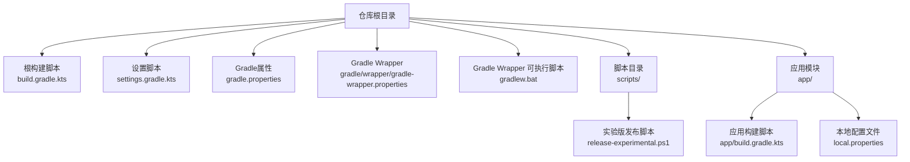
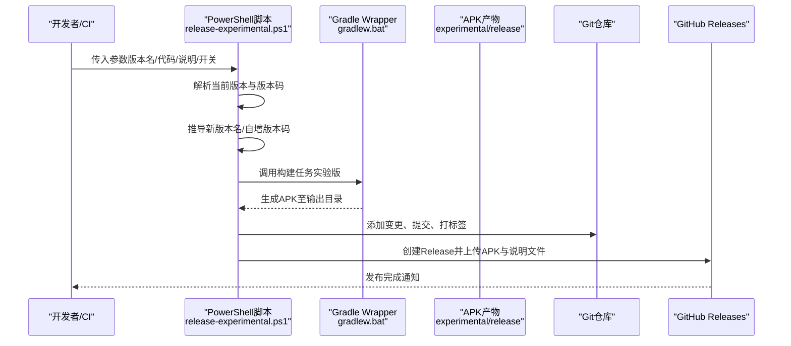
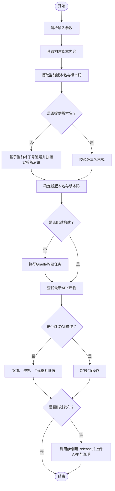
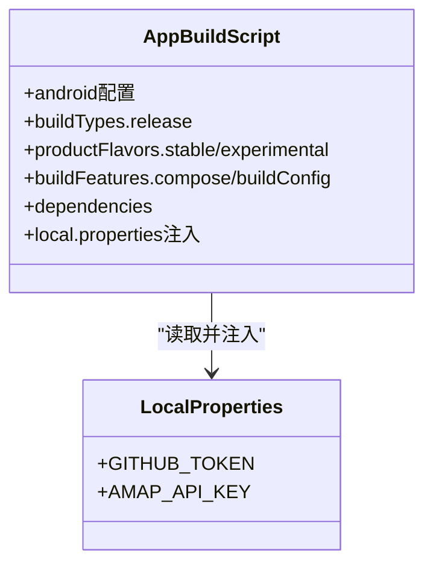
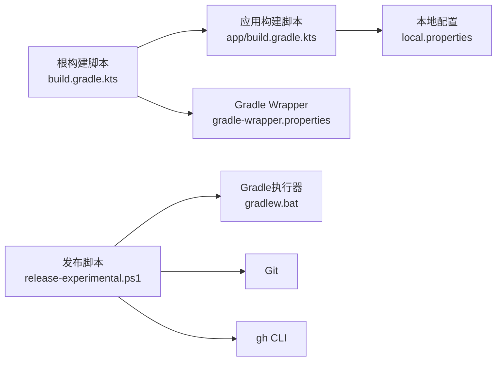

# 自动化部署

<cite>
**本文引用的文件**
- [build.gradle.kts](file://build.gradle.kts)
- [settings.gradle.kts](file://settings.gradle.kts)
- [gradle.properties](file://gradle.properties)
- [gradle-wrapper.properties](file://gradle/wrapper/gradle-wrapper.properties)
- [gradlew.bat](file://gradlew.bat)
- [release-experimental.ps1](file://scripts/release-experimental.ps1)
- [app/build.gradle.kts](file://app/build.gradle.kts)
- [local.properties](file://local.properties)
</cite>

## 目录
1. [简介](#简介)
2. [项目结构](#项目结构)
3. [核心组件](#核心组件)
4. [架构总览](#架构总览)
5. [详细组件分析](#详细组件分析)
6. [依赖关系分析](#依赖关系分析)
7. [性能考虑](#性能考虑)
8. [故障排查指南](#故障排查指南)
9. [结论](#结论)
10. [附录](#附录)

## 简介
本文件面向DiaryApp项目的自动化部署与发布流程，围绕CI/CD管道设计与实现展开，重点覆盖以下方面：
- 自动化构建、测试与发布的流程配置
- PowerShell脚本在实验版发布中的作用与参数说明
- 本地配置文件与敏感信息（如API密钥）的安全管理策略
- 部署环境与环境变量的配置方法
- 部署监控、日志记录与故障恢复的实施建议

## 项目结构
DiaryApp采用Gradle多模块结构，根工程包含一个应用模块app；构建系统通过Gradle Wrapper进行版本化分发与执行；实验版发布通过PowerShell脚本完成版本号更新、打包、提交与GitHub Release发布。

图表来源
- [build.gradle.kts:1-6](file://build.gradle.kts#L1-L6)
- [settings.gradle.kts:1-18](file://settings.gradle.kts#L1-L18)
- [gradle.properties:1-6](file://gradle.properties#L1-L6)
- [gradle-wrapper.properties:1-6](file://gradle/wrapper/gradle-wrapper.properties#L1-L6)
- [gradlew.bat](file://gradlew.bat)
- [release-experimental.ps1:1-129](file://scripts/release-experimental.ps1#L1-L129)
- [app/build.gradle.kts:1-145](file://app/build.gradle.kts#L1-L145)
- [local.properties](file://local.properties)

章节来源
- [build.gradle.kts:1-6](file://build.gradle.kts#L1-L6)
- [settings.gradle.kts:1-18](file://settings.gradle.kts#L1-L18)
- [gradle.properties:1-6](file://gradle.properties#L1-L6)
- [gradle-wrapper.properties:1-6](file://gradle/wrapper/gradle-wrapper.properties#L1-L6)
- [gradlew.bat](file://gradlew.bat)
- [release-experimental.ps1:1-129](file://scripts/release-experimental.ps1#L1-L129)
- [app/build.gradle.kts:1-145](file://app/build.gradle.kts#L1-L145)
- [local.properties](file://local.properties)

## 核心组件
- Gradle根构建脚本：声明插件版本，统一管理子模块。
- Gradle设置脚本：定义仓库源与依赖解析管理。
- Gradle属性：控制JVM参数、AndroidX启用等全局行为。
- Gradle Wrapper：固定Gradle版本，确保可重复构建。
- 应用构建脚本：定义Android配置、签名、产物类型、风味（flavor）、构建特性与依赖。
- 实验版发布脚本：自动化版本号生成、构建、提交、打标签与GitHub Release发布。
- 本地配置文件：存放敏感信息与占位符，供构建时注入到BuildConfig与清单。

章节来源
- [build.gradle.kts:1-6](file://build.gradle.kts#L1-L6)
- [settings.gradle.kts:1-18](file://settings.gradle.kts#L1-L18)
- [gradle.properties:1-6](file://gradle.properties#L1-L6)
- [gradle-wrapper.properties:1-6](file://gradle/wrapper/gradle-wrapper.properties#L1-L6)
- [app/build.gradle.kts:1-145](file://app/build.gradle.kts#L1-L145)
- [release-experimental.ps1:1-129](file://scripts/release-experimental.ps1#L1-L129)
- [local.properties](file://local.properties)

## 架构总览
下图展示了从触发到产出的端到端自动化发布路径，涵盖版本号推导、构建、提交、打标签与发布。

图表来源
- [release-experimental.ps1:1-129](file://scripts/release-experimental.ps1#L1-L129)
- [gradlew.bat](file://gradlew.bat)
- [app/build.gradle.kts:60-73](file://app/build.gradle.kts#L60-L73)

章节来源
- [release-experimental.ps1:1-129](file://scripts/release-experimental.ps1#L1-L129)
- [gradlew.bat](file://gradlew.bat)
- [app/build.gradle.kts:60-73](file://app/build.gradle.kts#L60-L73)

## 详细组件分析

### 组件A：实验版发布脚本（PowerShell）
该脚本负责实验版发布的全链路自动化，包括版本号推导、构建、提交、打标签与GitHub Release发布。

- 关键能力
  - 版本号推导：若未指定版本名，则基于当前版本的补丁号递增，并强制后缀为实验版标识。
  - 版本码自增：若未指定版本码，则在当前基础上加一。
  - 构建产物定位：自动扫描最新生成的APK文件。
  - Git集成：可选添加、提交、打标签与推送分支与标签。
  - GitHub Release：调用gh命令行工具创建Release并上传APK与说明文件。

- 参数说明
  - VersionName：实验版版本名（必须符合主.次.补-实验版格式）。
  - VersionCode：实验版版本码（默认使用当前版本码+1）。
  - NotesFile：发布说明文件路径（若为空则生成临时文件并写入默认说明）。
  - ReleaseNotes：默认发布说明文本（仅在NotesFile为空时生效）。
  - NoBuild：跳过构建步骤。
  - NoCommit：跳过Git提交与打标签。
  - NoRelease：跳过GitHub Release发布。

- 执行流程（算法）

图表来源
- [release-experimental.ps1:1-129](file://scripts/release-experimental.ps1#L1-L129)

章节来源
- [release-experimental.ps1:1-129](file://scripts/release-experimental.ps1#L1-L129)

### 组件B：Gradle构建与应用配置
应用模块的构建脚本集中体现了构建类型、风味、签名、编译选项、Compose支持与第三方依赖等关键配置。

- 构建类型与签名
  - 采用release构建类型，开启代码压缩与资源收缩，并复用debug签名配置以简化发布流程。
- 产物风味
  - 定义稳定版与实验版两种风味，分别设置不同的applicationId与版本号，便于并行安装与测试。
- 构建特性
  - 启用Compose与BuildConfig，便于在代码中访问构建期常量。
- 依赖管理
  - 通过BOM统一管理Compose版本，引入Room、WorkManager、Biometric、健康连接、高德地图等依赖。
- 敏感信息注入
  - 通过local.properties读取GitHub Token与高德地图API Key，并注入到BuildConfig与清单占位符中。

- 类关系（简化）

图表来源
- [app/build.gradle.kts:1-145](file://app/build.gradle.kts#L1-L145)
- [local.properties](file://local.properties)

章节来源
- [app/build.gradle.kts:1-145](file://app/build.gradle.kts#L1-L145)
- [local.properties](file://local.properties)

### 组件C：Gradle Wrapper与全局属性
- Gradle Wrapper
  - 固定Gradle版本，确保团队与CI环境一致性。
- 全局属性
  - JVM内存、AndroidX启用、Kotlin风格、R类非传递性等，影响构建稳定性与兼容性。

章节来源
- [gradle-wrapper.properties:1-6](file://gradle/wrapper/gradle-wrapper.properties#L1-L6)
- [gradle.properties:1-6](file://gradle.properties#L1-L6)

### 组件D：根工程与模块管理
- 根构建脚本
  - 声明Android应用、Kotlin与KSP插件版本，避免在模块内重复声明。
- 设置脚本
  - 统一仓库源与依赖解析，确保依赖拉取稳定可靠。

章节来源
- [build.gradle.kts:1-6](file://build.gradle.kts#L1-L6)
- [settings.gradle.kts:1-18](file://settings.gradle.kts#L1-L18)

## 依赖关系分析
- 模块耦合
  - 根工程对插件版本进行集中管理，app模块仅需关注业务配置。
- 外部依赖
  - 通过Maven Central与Google仓库获取，确保依赖可追溯。
- 环境依赖
  - PowerShell脚本依赖Git与gh命令行工具；Gradle构建依赖Java环境与Android SDK。

图表来源
- [build.gradle.kts:1-6](file://build.gradle.kts#L1-L6)
- [app/build.gradle.kts:1-145](file://app/build.gradle.kts#L1-L145)
- [local.properties](file://local.properties)
- [gradle-wrapper.properties:1-6](file://gradle/wrapper/gradle-wrapper.properties#L1-L6)
- [release-experimental.ps1:1-129](file://scripts/release-experimental.ps1#L1-L129)
- [gradlew.bat](file://gradlew.bat)

章节来源
- [build.gradle.kts:1-6](file://build.gradle.kts#L1-L6)
- [app/build.gradle.kts:1-145](file://app/build.gradle.kts#L1-L145)
- [local.properties](file://local.properties)
- [gradle-wrapper.properties:1-6](file://gradle/wrapper/gradle-wrapper.properties#L1-L6)
- [release-experimental.ps1:1-129](file://scripts/release-experimental.ps1#L1-L129)
- [gradlew.bat](file://gradlew.bat)

## 性能考虑
- 构建并发与稳定性
  - 在脚本中限制Gradle工作进程数与禁用守护进程，有助于在CI环境中减少资源竞争与提升可重复性。
- 依赖解析与缓存
  - 使用Gradle Wrapper固定版本，结合远程缓存与本地缓存，缩短依赖下载时间。
- 产物体积与混淆
  - release构建已启用代码压缩与资源收缩，建议配合ProGuard规则进一步优化。
- 网络与外部服务
  - API密钥与外部服务调用应尽量异步化与降级，避免阻塞构建流程。

## 故障排查指南
- 版本号格式错误
  - 现象：脚本报错提示版本名不符合规范。
  - 处理：确保VersionName符合“主.次.补-实验版”格式；若未提供，脚本会尝试自动推导。
- 未找到APK产物
  - 现象：脚本无法定位实验版APK。
  - 处理：确认已执行构建任务且输出目录存在；检查构建是否成功。
- Git操作失败
  - 现象：提交、打标签或推送失败。
  - 处理：检查当前分支状态、权限与网络；确保已配置Git凭证。
- GitHub Release失败
  - 现象：gh命令行工具返回错误。
  - 处理：确认已安装gh CLI、登录状态有效以及Release说明文件路径正确。
- 敏感信息缺失
  - 现象：BuildConfig或清单缺少API Key。
  - 处理：在local.properties中正确配置GITHUB_TOKEN与AMAP_API_KEY；注意不要提交到仓库。

章节来源
- [release-experimental.ps1:1-129](file://scripts/release-experimental.ps1#L1-L129)
- [app/build.gradle.kts:1-145](file://app/build.gradle.kts#L1-L145)
- [local.properties](file://local.properties)

## 结论
本方案通过Gradle与PowerShell脚本的组合，实现了从版本号推导、构建、提交、打标签到GitHub Release的完整自动化闭环。结合local.properties的安全配置与Gradle Wrapper的版本化管理，能够在保证一致性的同时提升发布效率与可靠性。建议在CI环境中进一步集成测试与安全扫描，完善发布后的监控与回滚机制。

## 附录
- 最佳实践建议
  - 将敏感信息存储于CI的机密管理器中，避免硬编码在脚本或配置文件中。
  - 在CI中增加单元测试与UI测试阶段，确保质量门禁。
  - 对Release说明文件进行模板化管理，统一格式与语言。
  - 引入发布前预检清单，核对版本号、变更日志与产物完整性。
- 相关文件索引
  - [根构建脚本:1-6](file://build.gradle.kts#L1-L6)
  - [设置脚本:1-18](file://settings.gradle.kts#L1-L18)
  - [Gradle属性:1-6](file://gradle.properties#L1-L6)
  - [Gradle Wrapper配置:1-6](file://gradle/wrapper/gradle-wrapper.properties#L1-L6)
  - [应用构建脚本:1-145](file://app/build.gradle.kts#L1-L145)
  - [实验版发布脚本:1-129](file://scripts/release-experimental.ps1#L1-L129)
  - [本地配置文件](file://local.properties)