# MVVM架构模式

<cite>
**本文档引用的文件**
- [HomeViewModel.kt](file://app/src/main/java/com/diary/app/ui/home/HomeViewModel.kt)
- [EditorViewModel.kt](file://app/src/main/java/com/diary/app/ui/editor/EditorViewModel.kt)
- [AchievementViewModel.kt](file://app/src/main/java/com/diary/app/ui/achievement/AchievementViewModel.kt)
- [TimelineViewModel.kt](file://app/src/main/java/com/diary/app/ui/timeline/TimelineViewModel.kt)
- [StatsViewModel.kt](file://app/src/main/java/com/diary/app/ui/stats/StatsViewModel.kt)
- [DiaryDetailViewModel.kt](file://app/src/main/java/com/diary/app/ui/detail/DiaryDetailViewModel.kt)
- [FavoritesViewModel.kt](file://app/src/main/java/com/diary/app/ui/favorites/FavoritesViewModel.kt)
- [CountDownViewModel.kt](file://app/src/main/java/com/diary/app/ui/countdown/CountDownViewModel.kt)
- [AiAssistantViewModel.kt](file://app/src/main/java/com/diary/app/ai/AiAssistantViewModel.kt)
- [DiaryDatabase.kt](file://app/src/main/java/com/diary/app/data/DiaryDatabase.kt)
- [AppContainer.kt](file://app/src/main/java/com/diary/app/di/AppContainer.kt)
- [HomeScreen.kt](file://app/src/main/java/com/diary/app/ui/home/HomeScreen.kt)
- [EditorScreen.kt](file://app/src/main/java/com/diary/app/ui/editor/EditorScreen.kt)
</cite>

## 目录
1. [简介](#简介)
2. [项目结构](#项目结构)
3. [核心组件](#核心组件)
4. [架构概览](#架构概览)
5. [详细组件分析](#详细组件分析)
6. [依赖分析](#依赖分析)
7. [性能考虑](#性能考虑)
8. [故障排除指南](#故障排除指南)
9. [结论](#结论)

## 简介

DiaryApp采用MVVM（Model-View-ViewModel）架构模式，通过分离关注点实现了清晰的代码组织和可维护性。该架构将应用程序分为三个主要层次：

- **Model（模型）**：负责数据管理和业务逻辑，包括数据库操作、AI服务集成和业务规则
- **View（视图）**：基于Jetpack Compose的声明式UI组件，负责用户界面展示
- **ViewModel（视图模型）**：作为View和Model之间的协调者，管理UI状态和响应式数据流

MVVM模式在DiaryApp中的实现体现了现代Android开发的最佳实践，通过Kotlin协程和Flow实现了高效的异步数据处理和响应式UI更新。

## 项目结构

DiaryApp的MVVM架构遵循模块化设计原则，每个功能模块都包含独立的ViewModel、UI组件和数据层：

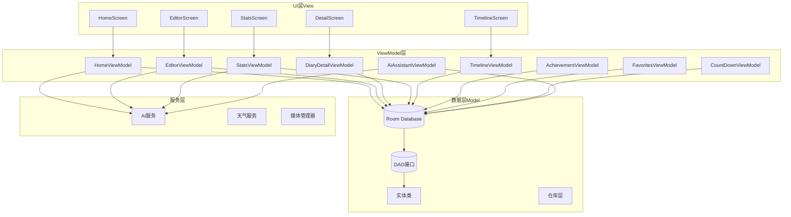

**图表来源**
- [HomeScreen.kt:160-200](file://app/src/main/java/com/diary/app/ui/home/HomeScreen.kt#L160-L200)
- [EditorScreen.kt:120-170](file://app/src/main/java/com/diary/app/ui/editor/EditorScreen.kt#L120-L170)

**章节来源**
- [HomeScreen.kt:160-200](file://app/src/main/java/com/diary/app/ui/home/HomeScreen.kt#L160-L200)
- [EditorScreen.kt:120-170](file://app/src/main/java/com/diary/app/ui/editor/EditorScreen.kt#L120-L170)

## 核心组件

### ViewModel基础架构

所有ViewModel都继承自AndroidViewModel基类，利用Application上下文进行数据访问和生命周期管理：

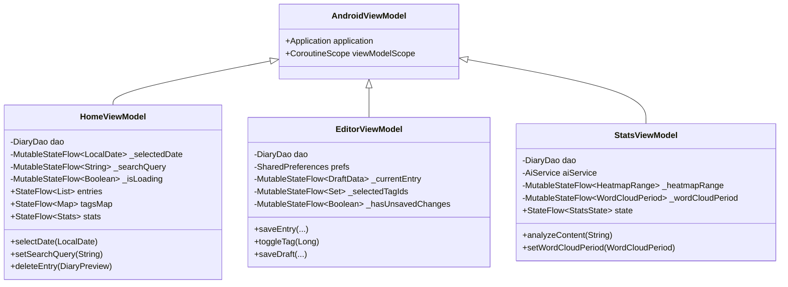

**图表来源**
- [HomeViewModel.kt:80-399](file://app/src/main/java/com/diary/app/ui/home/HomeViewModel.kt#L80-L399)
- [EditorViewModel.kt:41-433](file://app/src/main/java/com/diary/app/ui/editor/EditorViewModel.kt#L41-L433)
- [StatsViewModel.kt:118-499](file://app/src/main/java/com/diary/app/ui/stats/StatsViewModel.kt#L118-L499)

### 数据绑定机制

DiaryApp使用Kotlin Flow和StateFlow实现响应式数据绑定：

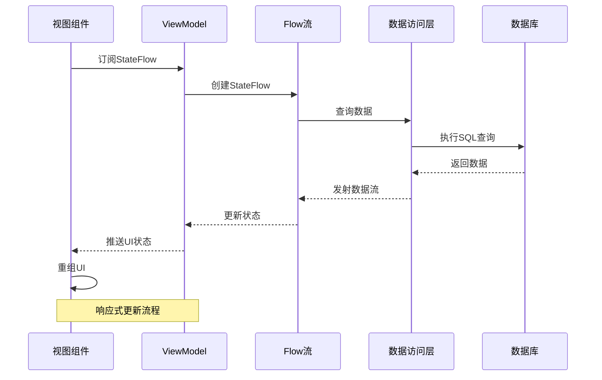

**图表来源**
- [HomeViewModel.kt:156-158](file://app/src/main/java/com/diary/app/ui/home/HomeViewModel.kt#L156-L158)
- [StatsViewModel.kt:216-231](file://app/src/main/java/com/diary/app/ui/stats/StatsViewModel.kt#L216-L231)

### 生命周期管理

ViewModel通过viewModelScope管理协程生命周期，确保在配置变更时保持数据一致性：

**章节来源**
- [HomeViewModel.kt:80-399](file://app/src/main/java/com/diary/app/ui/home/HomeViewModel.kt#L80-L399)
- [EditorViewModel.kt:41-433](file://app/src/main/java/com/diary/app/ui/editor/EditorViewModel.kt#L41-L433)
- [StatsViewModel.kt:118-499](file://app/src/main/java/com/diary/app/ui/stats/StatsViewModel.kt#L118-L499)

## 架构概览

DiaryApp的MVVM架构实现了以下关键特性：

### 数据流管理

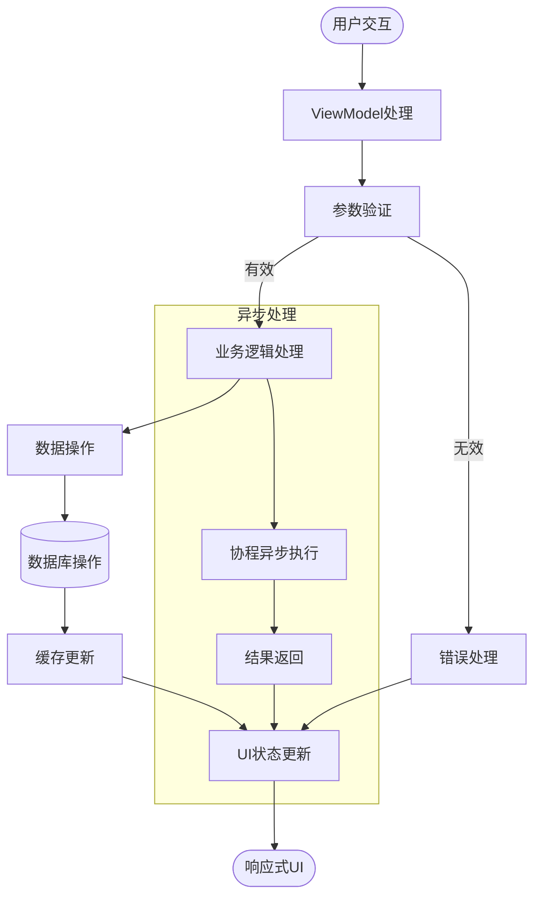

### 状态管理模式

ViewModel使用StateFlow管理UI状态，实现响应式更新：

**章节来源**
- [HomeViewModel.kt:147-148](file://app/src/main/java/com/diary/app/ui/home/HomeViewModel.kt#L147-L148)
- [EditorViewModel.kt:64-65](file://app/src/main/java/com/diary/app/ui/editor/EditorViewModel.kt#L64-L65)
- [StatsViewModel.kt:119-135](file://app/src/main/java/com/diary/app/ui/stats/StatsViewModel.kt#L119-L135)

## 详细组件分析

### 首页ViewModel分析

HomeViewModel是DiaryApp的核心协调者，管理多个复杂的数据流：

#### 关键特性

1. **多数据源聚合**：整合日记、标签、图片、天气等多个数据源
2. **响应式搜索**：实现防抖搜索和实时过滤
3. **状态管理**：管理复杂的UI状态和加载指示器

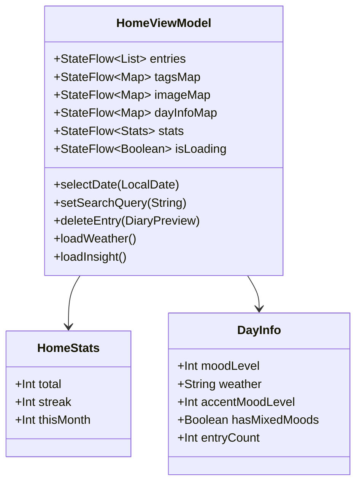

**图表来源**
- [HomeViewModel.kt:54-62](file://app/src/main/java/com/diary/app/ui/home/HomeViewModel.kt#L54-L62)
- [HomeViewModel.kt:139-229](file://app/src/main/java/com/diary/app/ui/home/HomeViewModel.kt#L139-L229)

#### 数据流处理模式

HomeViewModel展示了典型的MVVM数据流处理：

1. **数据获取**：通过DAO层获取原始数据
2. **数据转换**：使用map操作符进行数据转换
3. **状态聚合**：使用combine操作符合并多个数据流
4. **状态暴露**：通过StateFlow对外暴露只读状态

**章节来源**
- [HomeViewModel.kt:156-229](file://app/src/main/java/com/diary/app/ui/home/HomeViewModel.kt#L156-L229)

### 编辑器ViewModel分析

EditorViewModel专注于日记编辑功能，实现了复杂的状态管理和持久化：

#### 核心功能

1. **草稿管理**：使用SharedPreferences实现离线草稿存储
2. **实时预览**：支持富文本编辑和实时预览
3. **AI集成**：提供智能标题生成和内容优化功能

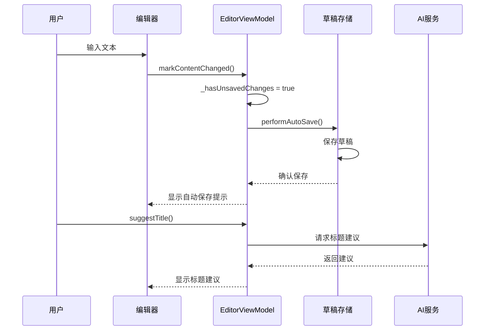

**图表来源**
- [EditorViewModel.kt:105-124](file://app/src/main/java/com/diary/app/ui/editor/EditorViewModel.kt#L105-L124)
- [EditorViewModel.kt:144-149](file://app/src/main/java/com/diary/app/ui/editor/EditorViewModel.kt#L144-L149)

#### 草稿管理系统

EditorViewModel实现了完整的草稿管理机制：

**章节来源**
- [EditorViewModel.kt:167-238](file://app/src/main/java/com/diary/app/ui/editor/EditorViewModel.kt#L167-L238)
- [EditorViewModel.kt:297-373](file://app/src/main/java/com/diary/app/ui/editor/EditorViewModel.kt#L297-L373)

### 统计分析ViewModel分析

StatsViewModel展示了复杂数据分析和可视化的需求：

#### 数据分析流程

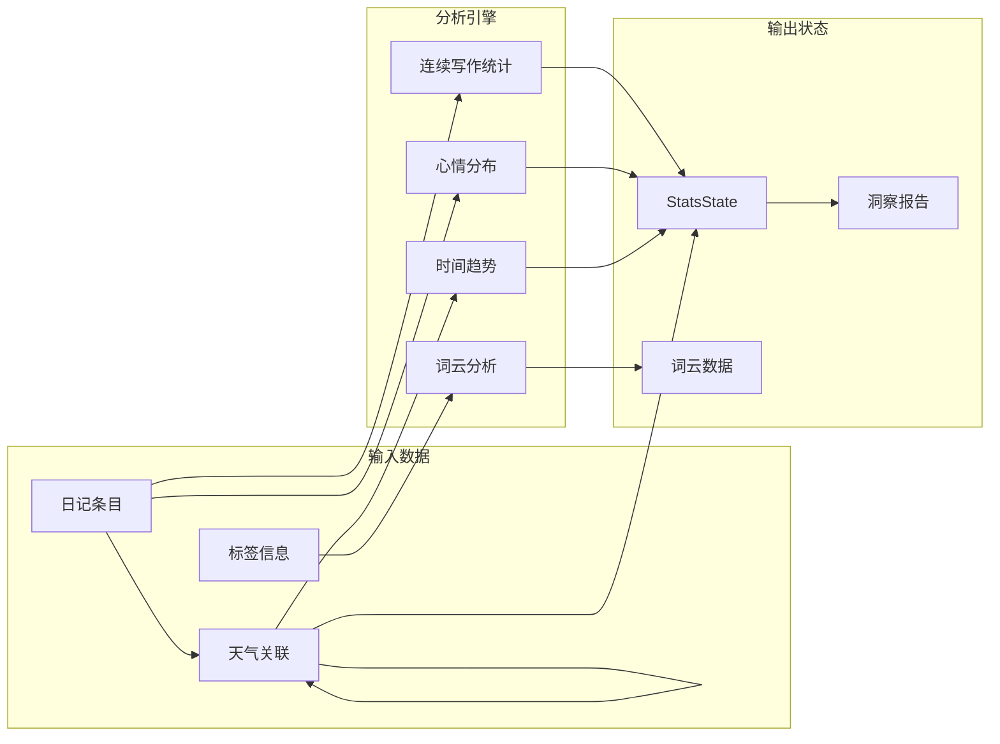

**图表来源**
- [StatsViewModel.kt:149-205](file://app/src/main/java/com/diary/app/ui/stats/StatsViewModel.kt#L149-L205)
- [StatsViewModel.kt:216-231](file://app/src/main/java/com/diary/app/ui/stats/StatsViewModel.kt#L216-L231)

#### AI集成分析

StatsViewModel集成了AI服务进行内容分析：

**章节来源**
- [StatsViewModel.kt:274-311](file://app/src/main/java/com/diary/app/ui/stats/StatsViewModel.kt#L274-L311)
- [StatsViewModel.kt:424-471](file://app/src/main/java/com/diary/app/ui/stats/StatsViewModel.kt#L424-L471)

### 成就系统ViewModel分析

AchievementViewModel展示了复杂业务逻辑的处理模式：

#### 过滤和排序机制

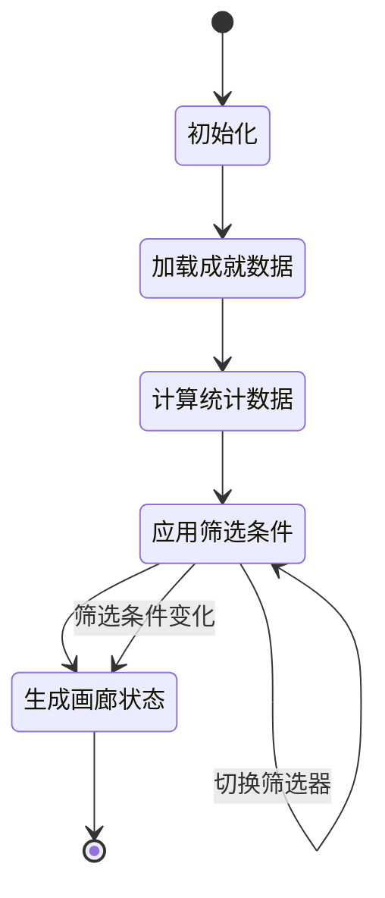

**图表来源**
- [AchievementViewModel.kt:47-73](file://app/src/main/java/com/diary/app/ui/achievement/AchievementViewModel.kt#L47-L73)
- [AchievementViewModel.kt:100-136](file://app/src/main/java/com/diary/app/ui/achievement/AchievementViewModel.kt#L100-L136)

**章节来源**
- [AchievementViewModel.kt:21-160](file://app/src/main/java/com/diary/app/ui/achievement/AchievementViewModel.kt#L21-L160)

## 依赖分析

### 数据层依赖

DiaryApp的依赖注入通过AppContainer实现集中管理：

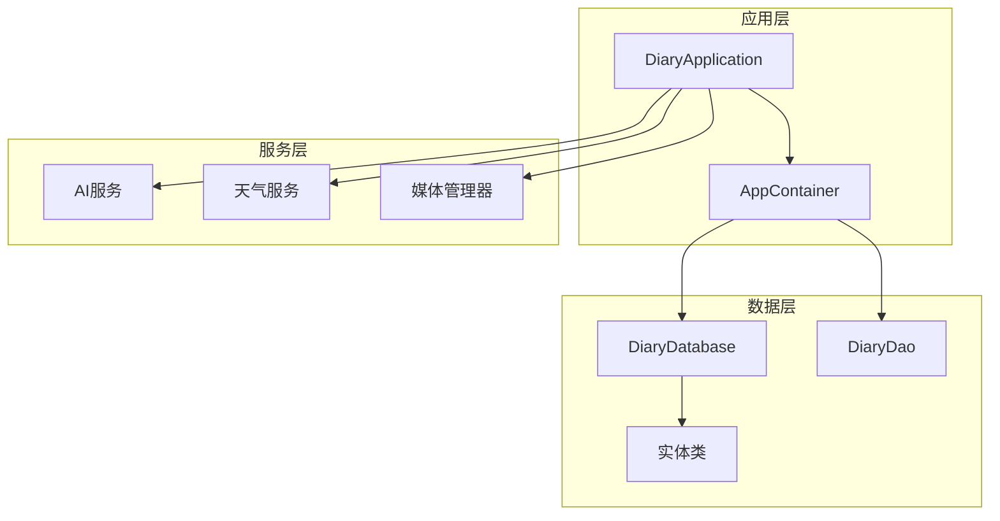

**图表来源**
- [AppContainer.kt:11-14](file://app/src/main/java/com/diary/app/di/AppContainer.kt#L11-L14)
- [DiaryDatabase.kt:10-19](file://app/src/main/java/com/diary/app/data/DiaryDatabase.kt#L10-L19)

### ViewModel间协作

不同ViewModel之间通过共享的数据层进行协作：

**章节来源**
- [AppContainer.kt:11-14](file://app/src/main/java/com/diary/app/di/AppContainer.kt#L11-L14)
- [DiaryDatabase.kt:10-19](file://app/src/main/java/com/diary/app/data/DiaryDatabase.kt#L10-L19)

## 性能考虑

### 协程和内存管理

DiaryApp在性能优化方面采用了多项策略：

1. **协程作用域管理**：使用viewModelScope确保协程生命周期与ViewModel同步
2. **Flow背压处理**：使用stateIn和WhileSubscribed策略控制数据流
3. **内存泄漏防护**：避免在ViewModel中持有Activity引用

### 数据缓存策略

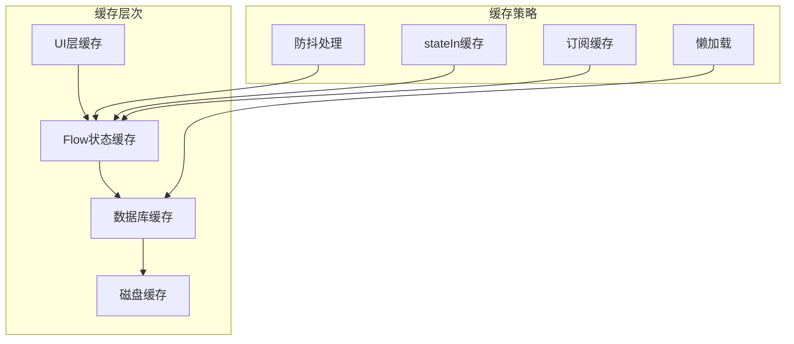

**图表来源**
- [HomeViewModel.kt:89](file://app/src/main/java/com/diary/app/ui/home/HomeViewModel.kt#L89)
- [StatsViewModel.kt:233-235](file://app/src/main/java/com/diary/app/ui/stats/StatsViewModel.kt#L233-L235)

## 故障排除指南

### 常见问题诊断

#### 数据流异常

当遇到数据流异常时，检查以下要点：

1. **Flow构建**：确认使用正确的操作符链
2. **协程作用域**：确保在viewModelScope中运行
3. **状态暴露**：使用asStateFlow()暴露只读状态

#### 内存泄漏检测

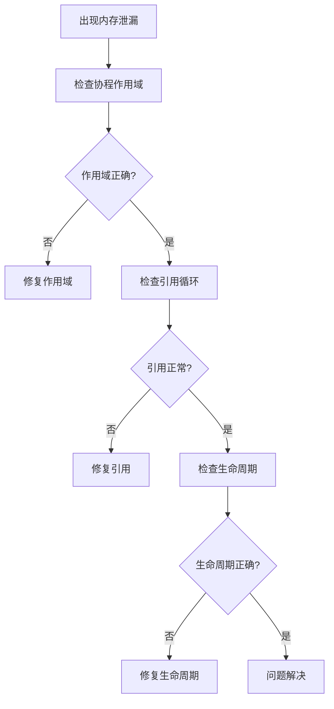

#### 数据一致性问题

**章节来源**
- [HomeViewModel.kt:314-323](file://app/src/main/java/com/diary/app/ui/home/HomeViewModel.kt#L314-L323)
- [EditorViewModel.kt:297-373](file://app/src/main/java/com/diary/app/ui/editor/EditorViewModel.kt#L297-L373)

## 结论

DiaryApp的MVVM架构模式成功实现了以下目标：

### 架构优势

1. **清晰的关注点分离**：Model、View、ViewModel职责明确
2. **可测试性**：ViewModel易于单元测试和集成测试
3. **可维护性**：模块化设计便于功能扩展和bug修复
4. **响应式UI**：Flow和StateFlow提供了流畅的用户体验

### 最佳实践总结

1. **状态管理**：使用StateFlow管理UI状态，避免直接修改
2. **数据流**：通过Flow实现声明式数据处理
3. **协程使用**：合理使用viewModelScope管理协程生命周期
4. **依赖注入**：通过AppContainer实现集中依赖管理

### 适用场景

MVVM架构特别适用于：
- 复杂的UI状态管理需求
- 需要响应式数据绑定的应用
- 需要良好测试性的项目
- 团队协作开发的大型项目

### 改进建议

1. **架构演进**：考虑引入Repository模式进一步抽象数据层
2. **状态管理**：对于复杂状态可以考虑使用StateReducer模式
3. **性能监控**：增加性能指标监控和异常上报机制
4. **文档完善**：补充架构决策文档和设计模式说明

通过MVVM架构的成功实施，DiaryApp建立了坚实的技术基础，为未来的功能扩展和性能优化提供了良好的框架支撑。