# 依赖注入系统

<cite>
**本文档引用的文件**
- [AppContainer.kt](file://app/src/main/java/com/diary/app/di/AppContainer.kt)
- [DiaryApplication.kt](file://app/src/main/java/com/diary/app/DiaryApplication.kt)
- [DiaryDatabase.kt](file://app/src/main/java/com/diary/app/data/DiaryDatabase.kt)
- [DiaryDao.kt](file://app/src/main/java/com/diary/app/data/DiaryDao.kt)
- [HomeViewModel.kt](file://app/src/main/java/com/diary/app/ui/home/HomeViewModel.kt)
- [EditorViewModel.kt](file://app/src/main/java/com/diary/app/ui/editor/EditorViewModel.kt)
- [AiServiceManager.kt](file://app/src/main/java/com/diary/app/ai/AiServiceManager.kt)
- [MainActivity.kt](file://app/src/main/java/com/diary/app/MainActivity.kt)
</cite>

## 目录
1. [简介](#简介)
2. [项目结构](#项目结构)
3. [核心组件](#核心组件)
4. [架构概览](#架构概览)
5. [详细组件分析](#详细组件分析)
6. [依赖关系分析](#依赖关系分析)
7. [性能考量](#性能考量)
8. [测试指南](#测试指南)
9. [最佳实践](#最佳实践)
10. [结论](#结论)

## 简介

DiaryApp采用简洁实用的依赖注入设计，通过AppContainer提供集中化的服务访问点。该系统实现了松耦合的服务依赖关系，支持单例模式和基础的作用域管理，为应用提供了清晰的架构边界。

系统的核心设计理念是"简单即美"：通过AppContainer作为单一事实来源，避免了复杂的DI框架引入，同时保持了足够的灵活性来满足应用需求。

## 项目结构

DiaryApp的依赖注入系统主要分布在以下几个关键位置：

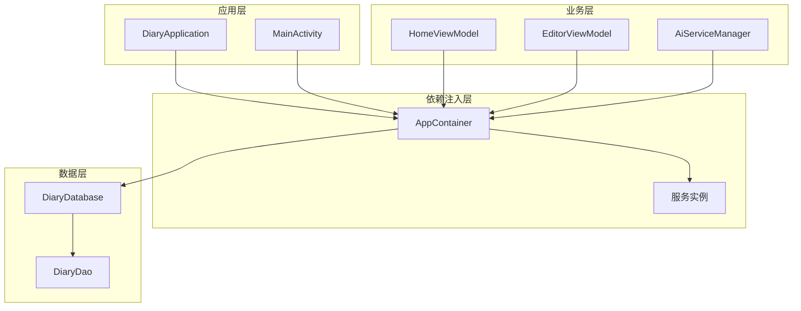

**图表来源**
- [DiaryApplication.kt:30-35](file://app/src/main/java/com/diary/app/DiaryApplication.kt#L30-L35)
- [AppContainer.kt:11-14](file://app/src/main/java/com/diary/app/di/AppContainer.kt#L11-L14)

**章节来源**
- [DiaryApplication.kt:30-35](file://app/src/main/java/com/diary/app/DiaryApplication.kt#L30-L35)
- [AppContainer.kt:11-14](file://app/src/main/java/com/diary/app/di/AppContainer.kt#L11-L14)

## 核心组件

### AppContainer 设计

AppContainer是整个依赖注入系统的核心，采用了极简的设计理念：

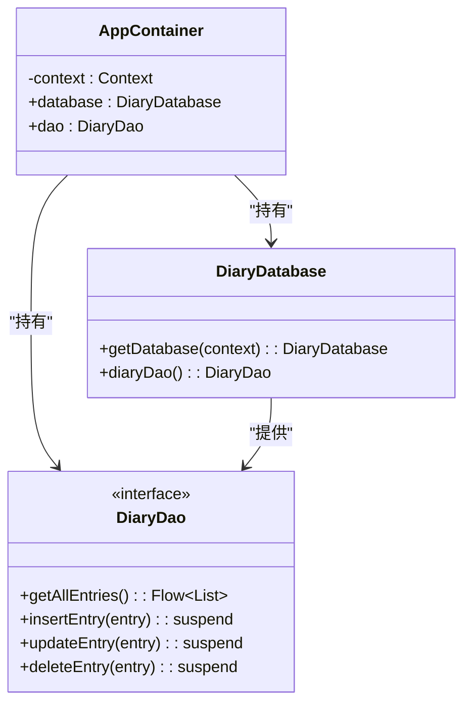

**图表来源**
- [AppContainer.kt:11-14](file://app/src/main/java/com/diary/app/di/AppContainer.kt#L11-L14)
- [DiaryDatabase.kt:15-18](file://app/src/main/java/com/diary/app/data/DiaryDatabase.kt#L15-L18)
- [DiaryDao.kt:12-13](file://app/src/main/java/com/diary/app/data/DiaryDao.kt#L12-L13)

AppContainer的主要特点：
- **单一职责**：只负责数据库和DAO实例的创建与管理
- **延迟初始化**：使用lazy委托确保按需创建
- **简单直接**：提供直接的属性访问，无需复杂的方法调用

**章节来源**
- [AppContainer.kt:11-14](file://app/src/main/java/com/diary/app/di/AppContainer.kt#L11-L14)

### DiaryApplication 集成

DiaryApplication作为应用的根容器，整合了多种服务：

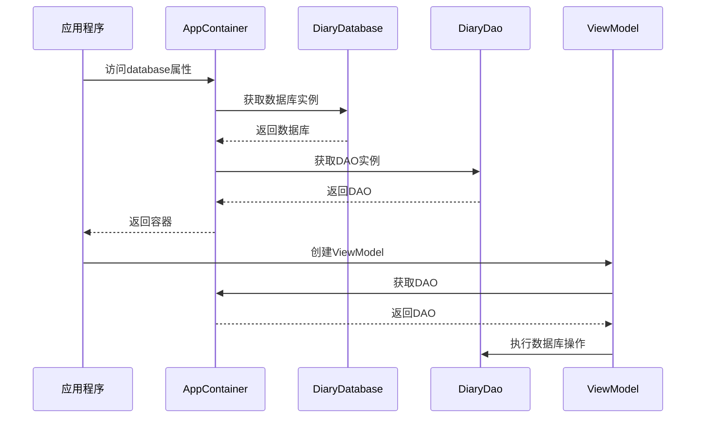

**图表来源**
- [DiaryApplication.kt:30-35](file://app/src/main/java/com/diary/app/DiaryApplication.kt#L30-L35)
- [HomeViewModel.kt:81-83](file://app/src/main/java/com/diary/app/ui/home/HomeViewModel.kt#L81-L83)

**章节来源**
- [DiaryApplication.kt:30-35](file://app/src/main/java/com/diary/app/DiaryApplication.kt#L30-L35)
- [HomeViewModel.kt:81-83](file://app/src/main/java/com/diary/app/ui/home/HomeViewModel.kt#L81-L83)

## 架构概览

DiaryApp的依赖注入架构体现了分层设计原则：

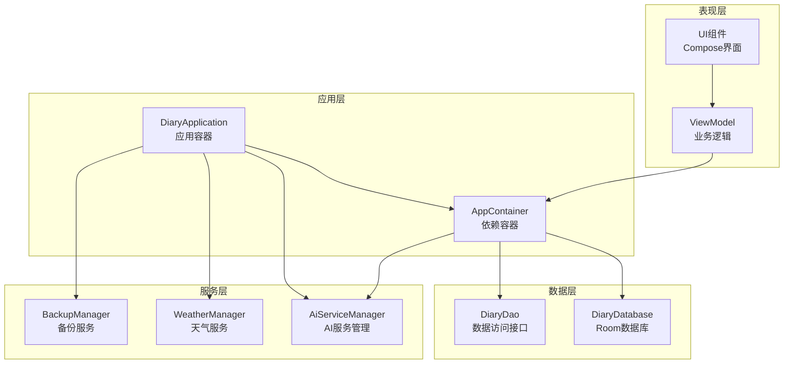

**图表来源**
- [MainActivity.kt:79-420](file://app/src/main/java/com/diary/app/MainActivity.kt#L79-L420)
- [DiaryApplication.kt:30-105](file://app/src/main/java/com/diary/app/DiaryApplication.kt#L30-L105)

## 详细组件分析

### 数据库层依赖

数据库层是依赖注入系统的核心，实现了完整的单例模式：

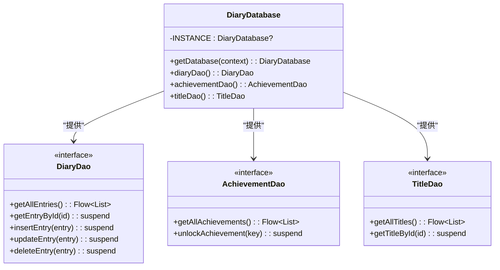

**图表来源**
- [DiaryDatabase.kt:15-18](file://app/src/main/java/com/diary/app/data/DiaryDatabase.kt#L15-L18)
- [DiaryDao.kt:12-13](file://app/src/main/java/com/diary/app/data/DiaryDao.kt#L12-L13)

数据库层的关键特性：
- **线程安全**：使用@Volatile确保多线程环境下的正确性
- **延迟初始化**：首次访问时才创建数据库实例
- **单例保证**：全局只有一个数据库实例
- **自动迁移**：内置完整的数据库版本迁移机制

**章节来源**
- [DiaryDatabase.kt:26-28](file://app/src/main/java/com/diary/app/data/DiaryDatabase.kt#L26-L28)
- [DiaryDatabase.kt:712-771](file://app/src/main/java/com/diary/app/data/DiaryDatabase.kt#L712-L771)

### ViewModel 层集成

ViewModel通过依赖注入获得数据访问能力：

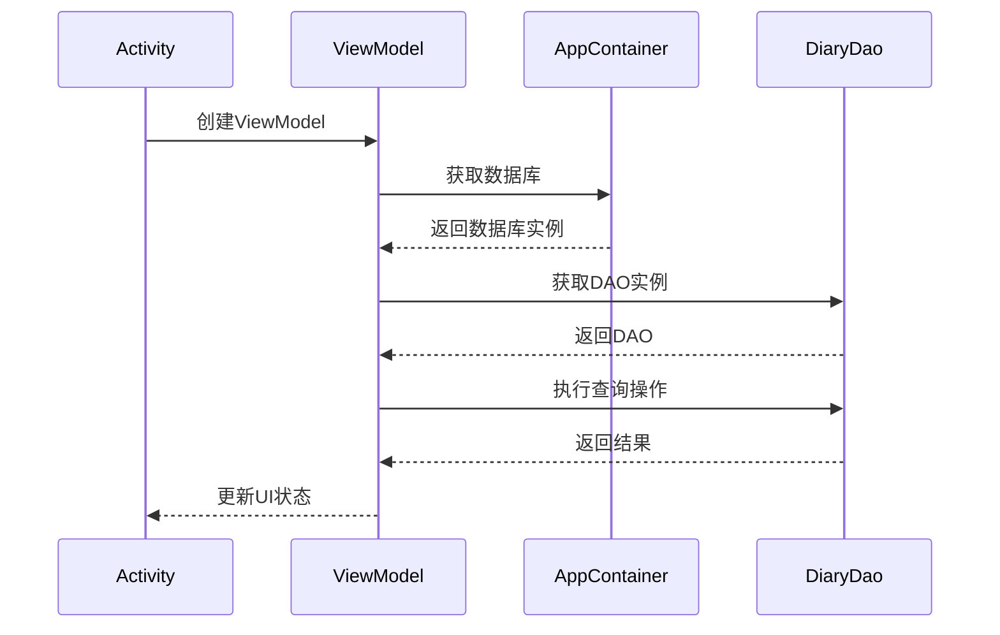

**图表来源**
- [HomeViewModel.kt:81-83](file://app/src/main/java/com/diary/app/ui/home/HomeViewModel.kt#L81-L83)
- [EditorViewModel.kt:41-44](file://app/src/main/java/com/diary/app/ui/editor/EditorViewModel.kt#L41-L44)

**章节来源**
- [HomeViewModel.kt:81-83](file://app/src/main/java/com/diary/app/ui/home/HomeViewModel.kt#L81-L83)
- [EditorViewModel.kt:41-44](file://app/src/main/java/com/diary/app/ui/editor/EditorViewModel.kt#L41-L44)

### AI 服务集成

AI服务管理器展示了可扩展的依赖注入模式：

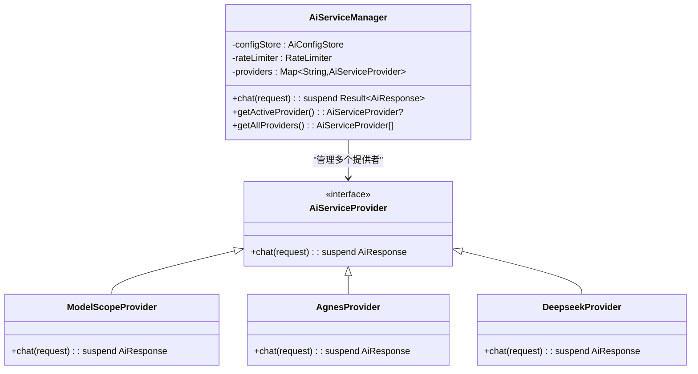

**图表来源**
- [AiServiceManager.kt:10-34](file://app/src/main/java/com/diary/app/ai/AiServiceManager.kt#L10-L34)

**章节来源**
- [AiServiceManager.kt:10-34](file://app/src/main/java/com/diary/app/ai/AiServiceManager.kt#L10-L34)

## 依赖关系分析

### 组件耦合度分析

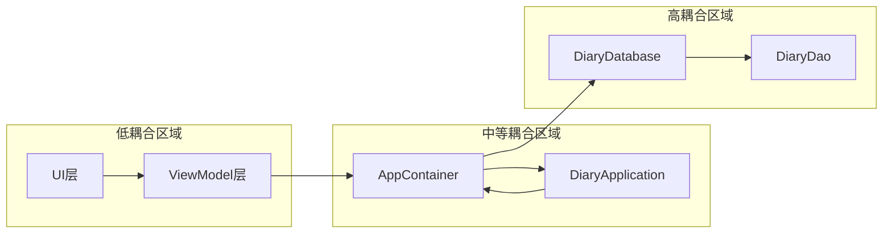

**图表来源**
- [DiaryApplication.kt:30-35](file://app/src/main/java/com/diary/app/DiaryApplication.kt#L30-L35)
- [AppContainer.kt:11-14](file://app/src/main/java/com/diary/app/di/AppContainer.kt#L11-L14)

### 依赖循环检测

当前架构中不存在循环依赖：
- AppContainer → DiaryDatabase → DiaryDao（单向依赖）
- ViewModel → AppContainer → DiaryDatabase（单向依赖）
- AiServiceManager → Providers（聚合关系）

**章节来源**
- [DiaryApplication.kt:30-35](file://app/src/main/java/com/diary/app/DiaryApplication.kt#L30-L35)
- [AppContainer.kt:11-14](file://app/src/main/java/com/diary/app/di/AppContainer.kt#L11-L14)

## 性能考量

### 内存优化策略

1. **延迟初始化**：所有服务都使用lazy委托，只有在首次使用时才创建实例
2. **单例模式**：数据库和DAO实例在整个应用生命周期内复用
3. **流式数据**：大量使用Kotlin Flow进行响应式数据处理，避免不必要的内存占用

### 启动性能优化

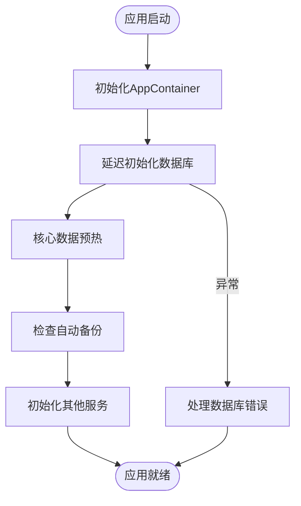

**图表来源**
- [DiaryApplication.kt:86-105](file://app/src/main/java/com/diary/app/DiaryApplication.kt#L86-L105)

**章节来源**
- [DiaryApplication.kt:86-105](file://app/src/main/java/com/diary/app/DiaryApplication.kt#L86-L105)

## 测试指南

### 单元测试中的依赖注入

虽然当前项目主要使用运行时依赖注入，但可以通过以下方式支持测试：

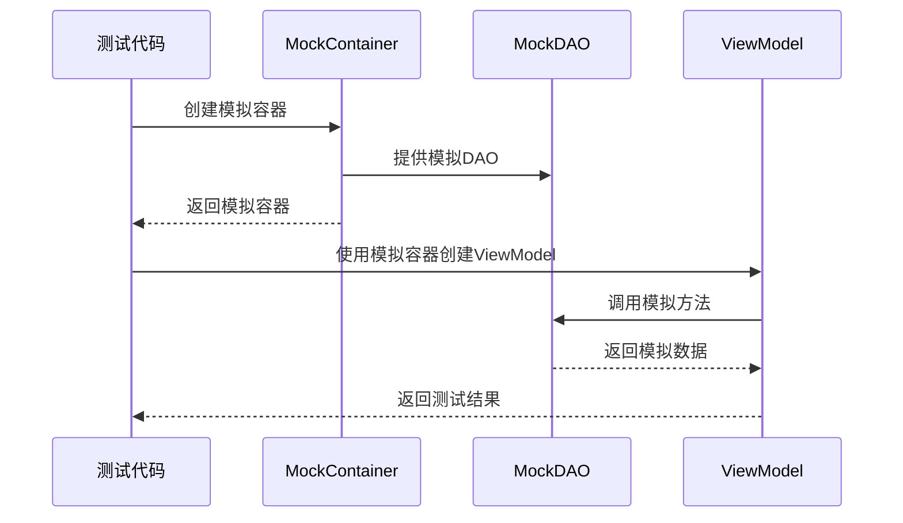

### 测试最佳实践

1. **接口隔离**：确保所有依赖都通过接口定义，便于Mock
2. **构造函数注入**：优先使用构造函数传递依赖，而非属性注入
3. **测试专用容器**：为测试场景创建专门的AppContainer变体

**章节来源**
- [HomeScreenLogicTest.kt:1-74](file://app/src/test/java/com/diary/app/ui/home/HomeScreenLogicTest.kt#L1-L74)
- [EditorUtilsTest.kt:1-417](file://app/src/test/java/com/diary/app/ui/editor/EditorUtilsTest.kt#L1-L417)

## 最佳实践

### 依赖注入配置示例

#### 添加新的服务依赖

要向AppContainer添加新的服务依赖：

1. 在AppContainer中添加属性定义
2. 在DiaryApplication中添加对应的lazy属性
3. 在需要使用的地方通过application.container访问

#### 管理复杂的依赖关系

对于复杂的依赖关系，建议采用以下模式：

```kotlin
// 示例：添加新的数据仓库
class DataRepository(
    private val dao: DiaryDao,
    private val networkService: NetworkService
) {
    // 实现数据访问逻辑
}

// 在AppContainer中注册
val repository = DataRepository(database.diaryDao(), networkService)
```

### 作用域管理

当前系统支持的基础作用域：

1. **应用级单例**：Database、AppContainer等
2. **请求级作用域**：ViewModel实例
3. **临时作用域**：方法调用期间的局部变量

### 错误处理和恢复

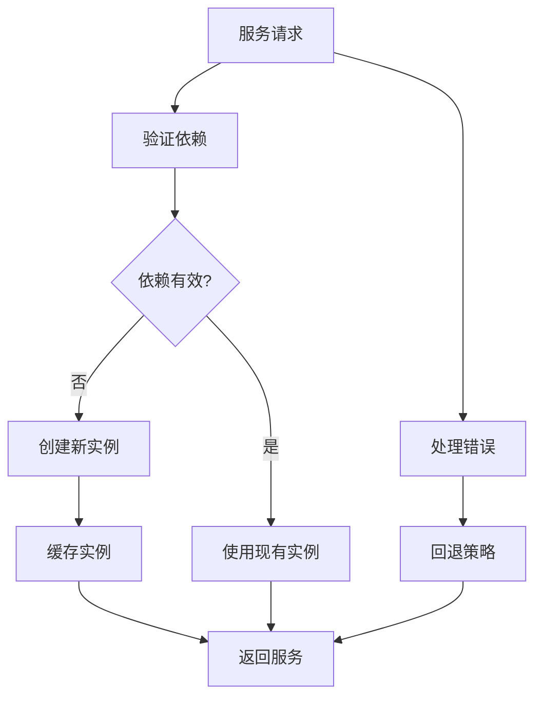

## 结论

DiaryApp的依赖注入系统展现了"简单而优雅"的设计哲学。通过AppContainer这一核心组件，系统实现了：

1. **松耦合架构**：各层之间通过接口通信，降低耦合度
2. **单例管理**：确保关键资源的高效复用
3. **延迟加载**：提升应用启动性能
4. **易于测试**：为单元测试提供清晰的依赖边界

该系统虽然没有采用复杂的DI框架，但通过精心设计的架构模式，达到了类似效果。这种"轻量级DI"方案特别适合中小型应用，在保持代码简洁的同时提供了足够的灵活性。

未来如果需要扩展功能，可以在不破坏现有架构的前提下，逐步引入更高级的DI特性，如模块化配置、条件注入等，以适应应用的发展需求。