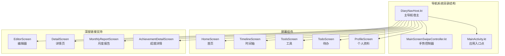
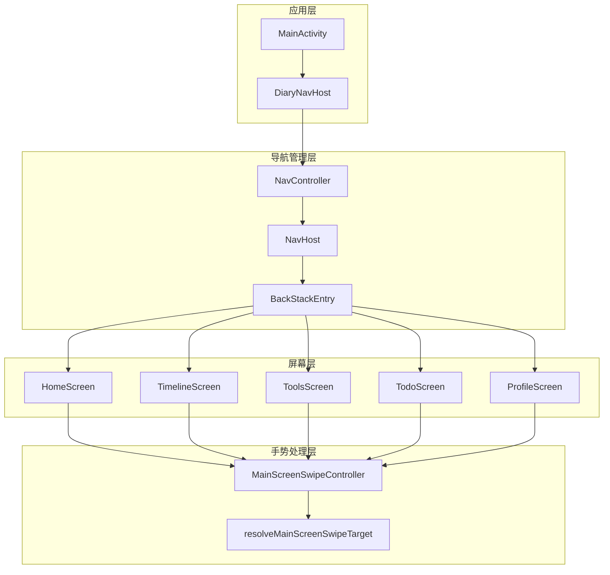
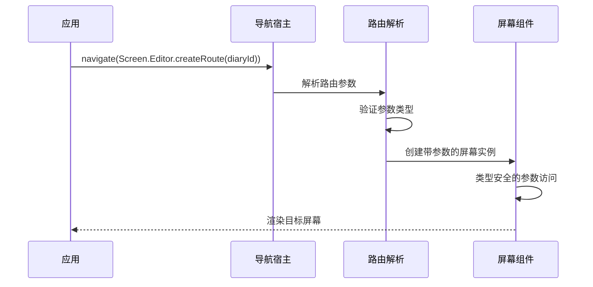
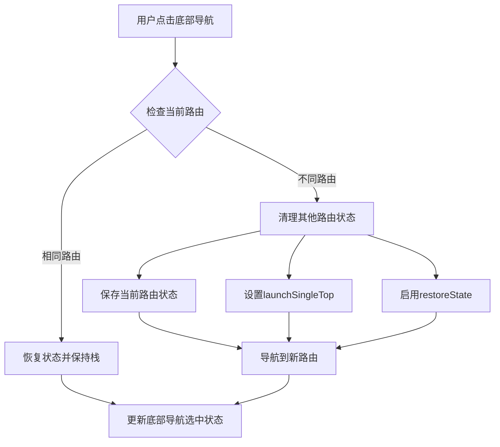
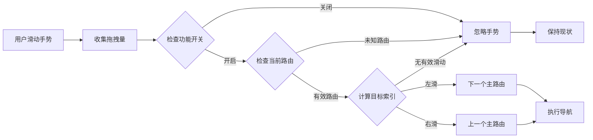
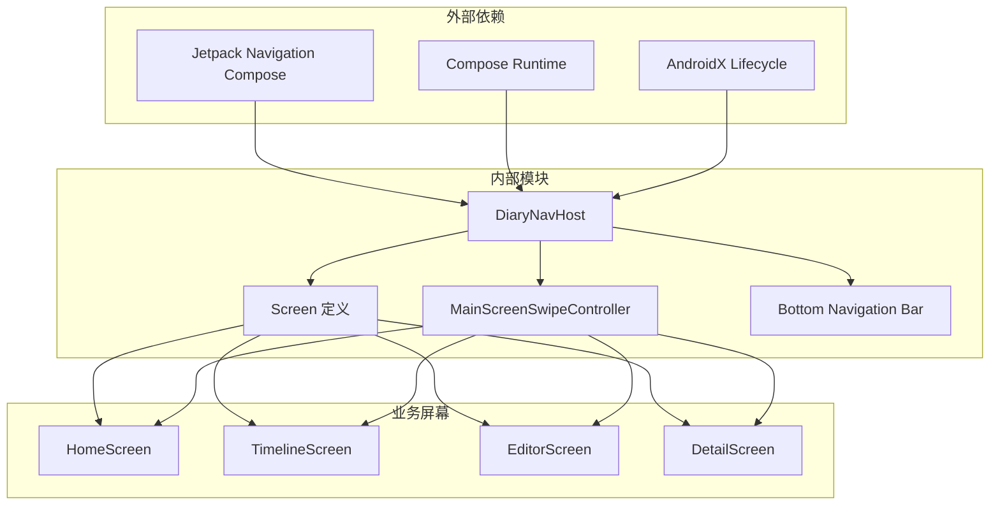
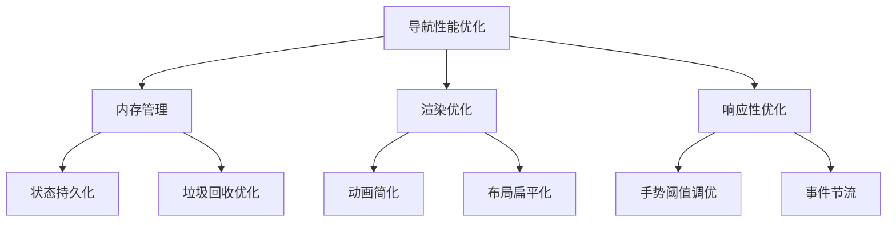

# 导航系统架构

<cite>
**本文档引用的文件**
- [DiaryNavHost.kt](file://app/src/main/java/com/diary/app/ui/navigation/DiaryNavHost.kt)
- [MainScreenSwipeController.kt](file://app/src/main/java/com/diary/app/ui/navigation/MainScreenSwipeController.kt)
- [MainActivity.kt](file://app/src/main/java/com/diary/app/MainActivity.kt)
- [MainScreenSwipeControllerTest.kt](file://app/src/test/java/com/diary/app/ui/navigation/MainScreenSwipeControllerTest.kt)
</cite>

## 目录
1. [简介](#简介)
2. [项目结构](#项目结构)
3. [核心组件](#核心组件)
4. [架构概览](#架构概览)
5. [详细组件分析](#详细组件分析)
6. [依赖关系分析](#依赖关系分析)
7. [性能考虑](#性能考虑)
8. [故障排除指南](#故障排除指南)
9. [结论](#结论)

## 简介

DiaryApp 的导航系统基于 Jetpack Navigation Compose 构建，实现了完全类型安全的导航体验。该系统采用密封类（sealed class）定义路由，通过编译时检查确保路由参数的正确性，同时提供了丰富的导航动画效果和手势支持。

系统的核心特点包括：
- 类型安全的路由定义和参数传递
- 基于底部导航栏的主页面切换
- 深度链接支持和条件导航
- 手势驱动的导航体验
- 完整的状态管理和内存优化

## 项目结构

导航系统主要位于 `app/src/main/java/com/diary/app/ui/navigation/` 目录下，包含以下关键文件：



**图表来源**
- [DiaryNavHost.kt:1-50](file://app/src/main/java/com/diary/app/ui/navigation/DiaryNavHost.kt#L1-L50)
- [MainActivity.kt:60-70](file://app/src/main/java/com/diary/app/MainActivity.kt#L60-L70)

**章节来源**
- [DiaryNavHost.kt:1-100](file://app/src/main/java/com/diary/app/ui/navigation/DiaryNavHost.kt#L1-L100)
- [MainActivity.kt:1-80](file://app/src/main/java/com/diary/app/MainActivity.kt#L1-L80)

## 核心组件

### Route 定义系统

DiaryApp 使用密封类 `Screen` 来定义所有可用的路由，每个路由都包含：
- 路由字符串标识符
- 显示标题
- 对应的图标
- 参数化路由的工厂方法

```mermaid
classDiagram
class Screen {
<<sealed>>
+String route
+String title
+ImageVector icon
}
class Home {
+String route = "home"
+String title = "首页"
+ImageVector icon = Icons.Default.Home
}
class Editor {
+String route = "editor?diaryId={diaryId}&draftId={draftId}"
+createRoute(diaryId, draftId) String
}
class Detail {
+String route = "detail/{diaryId}"
+createRoute(diaryId) String
}
class MonthlyReport {
+String route = "monthly_report/{year}/{month}"
+createRoute(year, month) String
}
Screen <|-- Home
Screen <|-- Editor
Screen <|-- Detail
Screen <|-- MonthlyReport
```

**图表来源**
- [DiaryNavHost.kt:135-183](file://app/src/main/java/com/diary/app/ui/navigation/DiaryNavHost.kt#L135-L183)

### 主导航宿主 (DiaryNavHost)

`DiaryNavHost` 是整个导航系统的核心组件，负责：
- 管理主页面栈和底部导航栏显示
- 处理页面间的过渡动画
- 实现手势导航功能
- 管理导航状态和生命周期

**章节来源**
- [DiaryNavHost.kt:199-240](file://app/src/main/java/com/diary/app/ui/navigation/DiaryNavHost.kt#L199-L240)
- [DiaryNavHost.kt:247-279](file://app/src/main/java/com/diary/app/ui/navigation/DiaryNavHost.kt#L247-L279)

## 架构概览



**图表来源**
- [MainActivity.kt:401-414](file://app/src/main/java/com/diary/app/MainActivity.kt#L401-L414)
- [DiaryNavHost.kt:200-217](file://app/src/main/java/com/diary/app/ui/navigation/DiaryNavHost.kt#L200-L217)
- [MainScreenSwipeController.kt:7-28](file://app/src/main/java/com/diary/app/ui/navigation/MainScreenSwipeController.kt#L7-L28)

## 详细组件分析

### 类型安全导航实现

DiaryApp 的导航系统实现了完全的类型安全，通过以下机制确保编译时的类型检查：

#### 路由参数验证
系统为不同类型的路由参数提供了专门的验证机制：



**图表来源**
- [DiaryNavHost.kt:699-736](file://app/src/main/java/com/diary/app/ui/navigation/DiaryNavHost.kt#L699-L736)
- [DiaryNavHost.kt:738-773](file://app/src/main/java/com/diary/app/ui/navigation/DiaryNavHost.kt#L738-L773)

#### 参数传递机制
系统支持多种参数传递方式：

1. **路径参数**：用于必需的标识符（如 `diaryId`）
2. **查询参数**：用于可选的配置选项（如 `draftId`）
3. **默认值处理**：为可选参数提供合理的默认值

**章节来源**
- [DiaryNavHost.kt:143-150](file://app/src/main/java/com/diary/app/ui/navigation/DiaryNavHost.kt#L143-L150)
- [DiaryNavHost.kt:700-703](file://app/src/main/java/com/diary/app/ui/navigation/DiaryNavHost.kt#L700-L703)

### 页面栈控制机制

DiaryNavHost 实现了智能的页面栈管理：



**图表来源**
- [DiaryNavHost.kt:210-217](file://app/src/main/java/com/diary/app/ui/navigation/DiaryNavHost.kt#L210-L217)

**章节来源**
- [DiaryNavHost.kt:200-217](file://app/src/main/java/com/diary/app/ui/navigation/DiaryNavHost.kt#L200-L217)

### 导航动画效果

系统实现了丰富的过渡动画，包括：

#### 底部导航切换动画
- 水平滑动进入/退出
- 淡入淡出效果
- 基于方向的动画差异

#### 子页面导航动画
- 从右侧滑入的编辑器界面
- 从左侧滑出的返回效果
- 统一的 280ms 过渡时长

**章节来源**
- [DiaryNavHost.kt:115-133](file://app/src/main/java/com/diary/app/ui/navigation/DiaryNavHost.kt#L115-L133)
- [DiaryNavHost.kt:251-278](file://app/src/main/java/com/diary/app/ui/navigation/DiaryNavHost.kt#L251-L278)

### 手势导航系统

MainScreenSwipeController 实现了手势驱动的导航体验：



**图表来源**
- [MainScreenSwipeController.kt:7-28](file://app/src/main/java/com/diary/app/ui/navigation/MainScreenSwipeController.kt#L7-L28)

**章节来源**
- [MainScreenSwipeController.kt:1-29](file://app/src/main/java/com/diary/app/ui/navigation/MainScreenSwipeController.kt#L1-L29)
- [DiaryNavHost.kt:306-315](file://app/src/main/java/com/diary/app/ui/navigation/DiaryNavHost.kt#L306-L315)

### 深度链接支持

系统支持多种深度链接场景：

#### 应用内深度链接
- 编辑器深度链接：`editor?diaryId={id}&draftId={draft}`
- 详情页深度链接：`detail/{diaryId}`
- 成就详情深度链接：`achievement_detail/{key}`

#### 系统级深度链接
- 新日记创建：`com.diary.app.NEW_DIARY`
- 快速待办：`com.diary.app.QUICK_TODO`

**章节来源**
- [DiaryNavHost.kt:143-150](file://app/src/main/java/com/diary/app/ui/navigation/DiaryNavHost.kt#L143-L150)
- [MainActivity.kt:430-434](file://app/src/main/java/com/diary/app/MainActivity.kt#L430-L434)

## 依赖关系分析



**图表来源**
- [DiaryNavHost.kt:76-112](file://app/src/main/java/com/diary/app/ui/navigation/DiaryNavHost.kt#L76-L112)
- [MainActivity.kt:60-70](file://app/src/main/java/com/diary/app/MainActivity.kt#L60-L70)

**章节来源**
- [DiaryNavHost.kt:1-112](file://app/src/main/java/com/diary/app/ui/navigation/DiaryNavHost.kt#L1-L112)
- [MainActivity.kt:1-72](file://app/src/main/java/com/diary/app/MainActivity.kt#L1-L72)

## 性能考虑

### 内存优化策略

1. **状态保存与恢复**
   - 使用 `saveState` 和 `restoreState` 优化内存使用
   - 智能清理不需要的路由状态

2. **动画性能**
   - 合理的动画时长和缓动函数
   - 避免复杂的重绘操作

3. **手势响应优化**
   - 阈值常量优化滑动检测
   - 减少不必要的重新计算

### 导航性能最佳实践



**章节来源**
- [DiaryNavHost.kt:213-216](file://app/src/main/java/com/diary/app/ui/navigation/DiaryNavHost.kt#L213-L216)
- [MainScreenSwipeController.kt:3](file://app/src/main/java/com/diary/app/ui/navigation/MainScreenSwipeController.kt#L3)

## 故障排除指南

### 常见问题及解决方案

#### 路由参数错误
**问题**：导航时出现参数类型不匹配
**解决方案**：
- 检查 `Screen` 类中的参数定义
- 确保在调用 `createRoute()` 时提供正确的参数类型

#### 手势导航失效
**问题**：滑动手势无法触发导航
**解决方案**：
- 验证 `experimentalFeatures.mainScreenSwipeEnabled` 状态
- 检查 `currentRoute` 是否在 `mainScreenRoutes` 列表中

#### 页面栈异常
**问题**：返回按钮行为不符合预期
**解决方案**：
- 检查 `popUpTo` 配置是否正确
- 验证 `launchSingleTop` 设置

**章节来源**
- [MainScreenSwipeControllerTest.kt:9-49](file://app/src/test/java/com/diary/app/ui/navigation/MainScreenSwipeControllerTest.kt#L9-L49)

### 调试技巧

1. **启用导航日志**：使用 Navigation Compose 的调试模式
2. **监控内存使用**：定期检查路由状态的内存占用
3. **测试边界条件**：验证极端滑动距离和快速手势

## 结论

DiaryApp 的导航系统展现了现代 Android 应用导航的最佳实践。通过类型安全的路由定义、智能的手势支持和优雅的动画效果，系统为用户提供了流畅而直观的导航体验。

关键优势包括：
- **类型安全**：编译时检查确保导航参数的正确性
- **用户体验**：自然的手势导航和丰富的动画效果
- **性能优化**：智能的状态管理和内存优化策略
- **扩展性**：清晰的架构设计便于功能扩展

该导航系统为类似的应用提供了优秀的参考实现，特别是在处理复杂页面关系和手势交互方面。