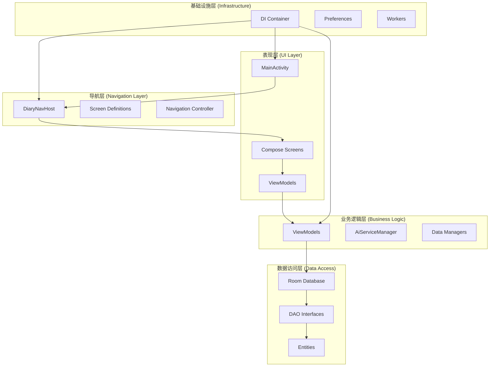
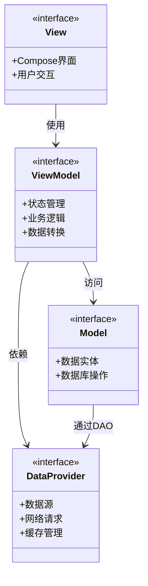
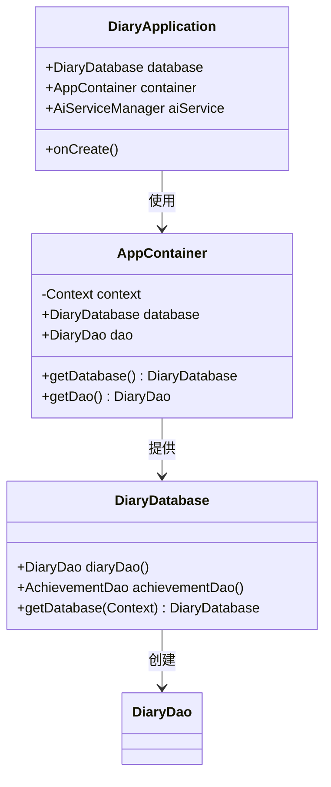
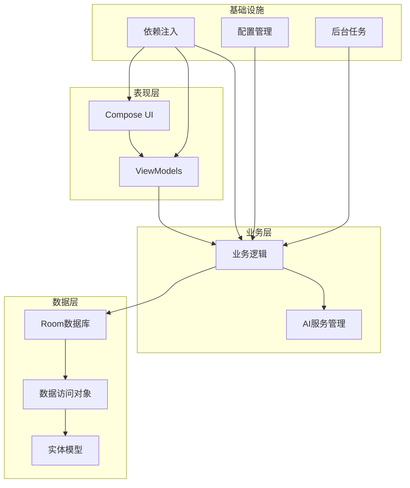
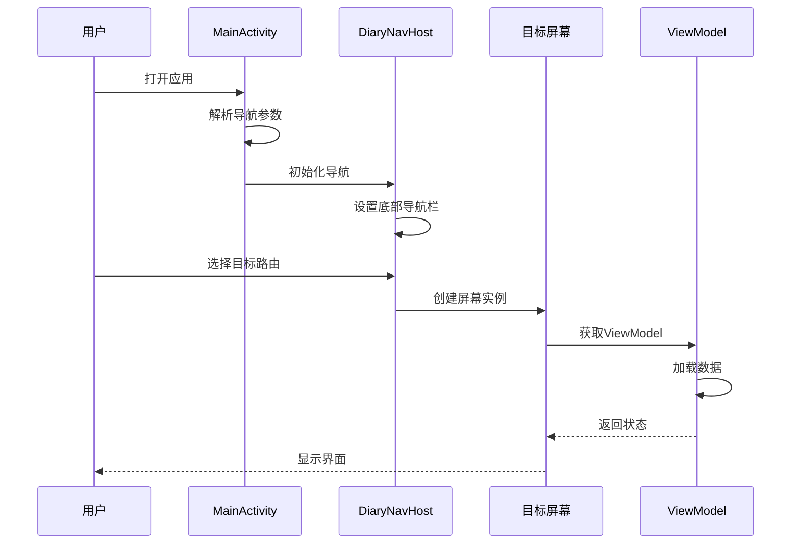
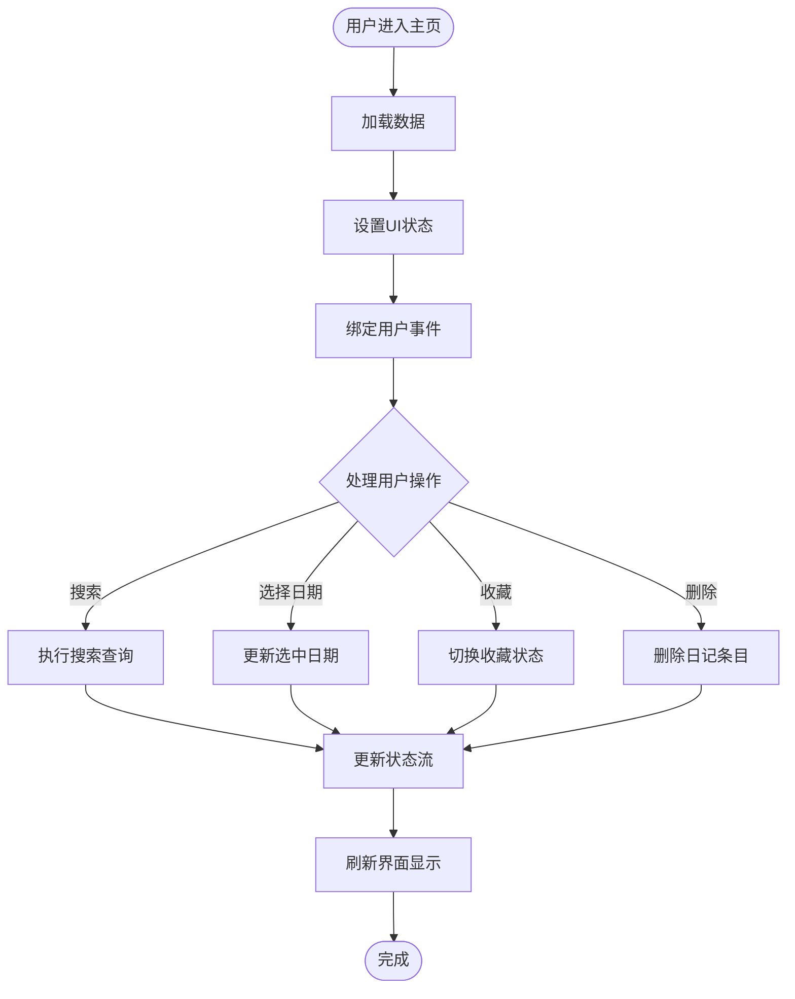
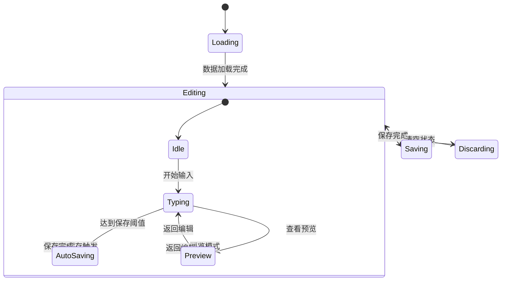
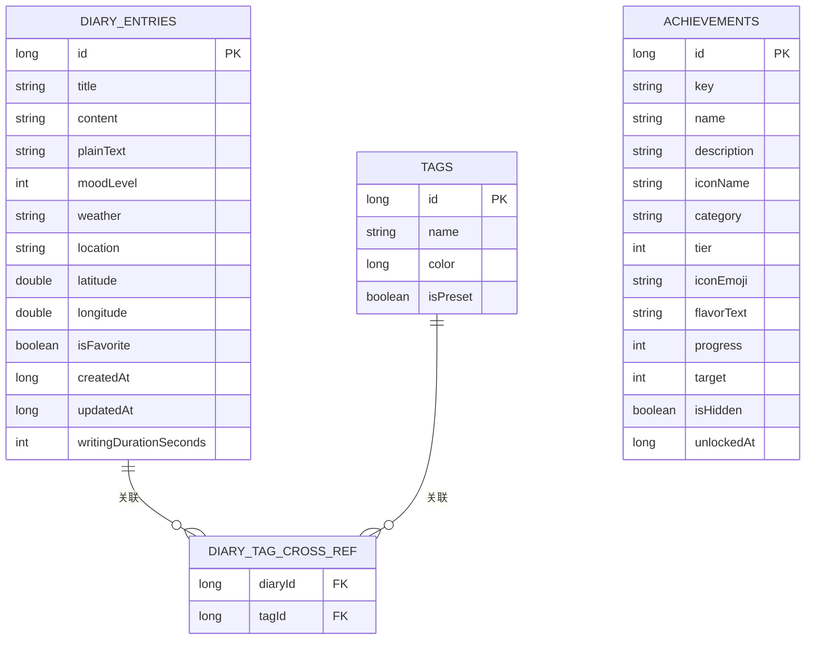
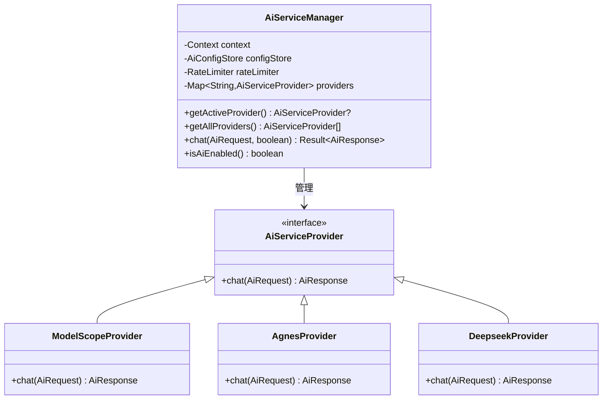
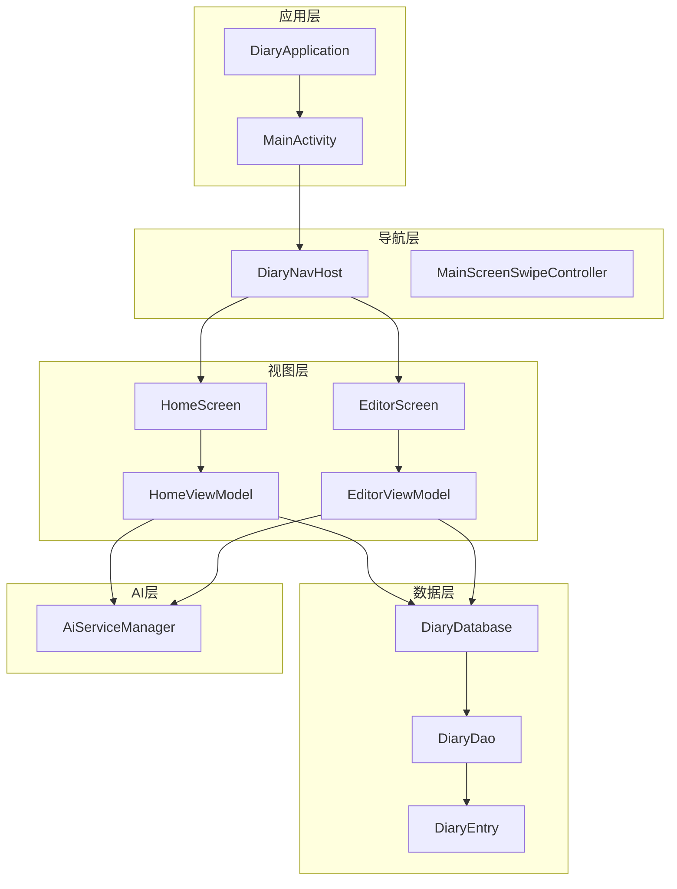

# 架构设计

<cite>
**本文档引用的文件**
- [AppContainer.kt](file://app/src/main/java/com/diary/app/di/AppContainer.kt)
- [DiaryApplication.kt](file://app/src/main/java/com/diary/app/DiaryApplication.kt)
- [MainActivity.kt](file://app/src/main/java/com/diary/app/MainActivity.kt)
- [DiaryNavHost.kt](file://app/src/main/java/com/diary/app/ui/navigation/DiaryNavHost.kt)
- [MainScreenSwipeController.kt](file://app/src/main/java/com/diary/app/ui/navigation/MainScreenSwipeController.kt)
- [HomeViewModel.kt](file://app/src/main/java/com/diary/app/ui/home/HomeViewModel.kt)
- [EditorViewModel.kt](file://app/src/main/java/com/diary/app/ui/editor/EditorViewModel.kt)
- [HomeScreen.kt](file://app/src/main/java/com/diary/app/ui/home/HomeScreen.kt)
- [EditorScreen.kt](file://app/src/main/java/com/diary/app/ui/editor/EditorScreen.kt)
- [DiaryDatabase.kt](file://app/src/main/java/com/diary/app/data/DiaryDatabase.kt)
- [DiaryEntry.kt](file://app/src/main/java/com/diary/app/data/DiaryEntry.kt)
- [AiServiceManager.kt](file://app/src/main/java/com/diary/app/ai/AiServiceManager.kt)
</cite>

## 目录
1. [简介](#简介)
2. [项目结构](#项目结构)
3. [核心组件](#核心组件)
4. [架构概览](#架构概览)
5. [详细组件分析](#详细组件分析)
6. [依赖分析](#依赖分析)
7. [性能考虑](#性能考虑)
8. [故障排除指南](#故障排除指南)
9. [结论](#结论)

## 简介

DiaryApp是一个基于Android平台的日记应用，采用现代MVVM架构模式构建。该应用实现了完整的依赖注入容器、类型安全的导航系统、模块化设计以及高性能的数据处理机制。

本架构文档将深入解析DiaryApp的MVVM实现、依赖注入容器设计、导航系统架构、模块化原则以及相关的技术考量和性能优化策略。

## 项目结构

DiaryApp采用分层模块化架构，主要分为以下几个层次：

**图表来源**
- [MainActivity.kt:1-472](file://app/src/main/java/com/diary/app/MainActivity.kt#L1-L472)
- [DiaryNavHost.kt:1-900](file://app/src/main/java/com/diary/app/ui/navigation/DiaryNavHost.kt#L1-L900)

**章节来源**
- [MainActivity.kt:1-472](file://app/src/main/java/com/diary/app/MainActivity.kt#L1-L472)
- [DiaryNavHost.kt:1-900](file://app/src/main/java/com/diary/app/ui/navigation/DiaryNavHost.kt#L1-L900)

## 核心组件

### MVVM架构实现

DiaryApp严格遵循MVVM模式，实现了清晰的职责分离：

**图表来源**
- [HomeViewModel.kt:1-399](file://app/src/main/java/com/diary/app/ui/home/HomeViewModel.kt#L1-L399)
- [EditorViewModel.kt:1-433](file://app/src/main/java/com/diary/app/ui/editor/EditorViewModel.kt#L1-L433)

### 依赖注入容器设计

AppContainer作为简单的服务定位器，提供了集中化的依赖管理：

**图表来源**
- [AppContainer.kt:1-15](file://app/src/main/java/com/diary/app/di/AppContainer.kt#L1-L15)
- [DiaryApplication.kt:1-157](file://app/src/main/java/com/diary/app/DiaryApplication.kt#L1-L157)
- [DiaryDatabase.kt:1-829](file://app/src/main/java/com/diary/app/data/DiaryDatabase.kt#L1-L829)

**章节来源**
- [AppContainer.kt:1-15](file://app/src/main/java/com/diary/app/di/AppContainer.kt#L1-L15)
- [DiaryApplication.kt:1-157](file://app/src/main/java/com/diary/app/DiaryApplication.kt#L1-L157)

## 架构概览

DiaryApp的整体架构采用分层设计，确保各层之间的松耦合和高内聚：

**图表来源**
- [MainActivity.kt:1-472](file://app/src/main/java/com/diary/app/MainActivity.kt#L1-L472)
- [DiaryNavHost.kt:1-900](file://app/src/main/java/com/diary/app/ui/navigation/DiaryNavHost.kt#L1-L900)
- [AiServiceManager.kt:1-104](file://app/src/main/java/com/diary/app/ai/AiServiceManager.kt#L1-L104)

## 详细组件分析

### 导航系统架构

DiaryApp实现了类型安全的导航系统，通过密封类定义路由：

**图表来源**
- [MainActivity.kt:401-414](file://app/src/main/java/com/diary/app/MainActivity.kt#L401-L414)
- [DiaryNavHost.kt:200-246](file://app/src/main/java/com/diary/app/ui/navigation/DiaryNavHost.kt#L200-L246)

导航系统的关键特性：

1. **类型安全路由**: 使用密封类定义所有可用路由
2. **底部导航栏**: 支持主屏幕的底部导航
3. **参数传递**: 支持路由参数的类型安全传递
4. **动画过渡**: 实现流畅的页面切换动画

**章节来源**
- [DiaryNavHost.kt:135-183](file://app/src/main/java/com/diary/app/ui/navigation/DiaryNavHost.kt#L135-L183)
- [DiaryNavHost.kt:200-246](file://app/src/main/java/com/diary/app/ui/navigation/DiaryNavHost.kt#L200-L246)

### MVVM实现细节

#### HomeScreen - 主页实现

HomeScreen展示了MVVM模式的最佳实践：

**图表来源**
- [HomeScreen.kt:161-200](file://app/src/main/java/com/diary/app/ui/home/HomeScreen.kt#L161-L200)
- [HomeViewModel.kt:231-300](file://app/src/main/java/com/diary/app/ui/home/HomeViewModel.kt#L231-L300)

#### EditorScreen - 编辑器实现

编辑器实现了复杂的状态管理和数据持久化：

**图表来源**
- [EditorScreen.kt:122-200](file://app/src/main/java/com/diary/app/ui/editor/EditorScreen.kt#L122-L200)
- [EditorViewModel.kt:144-158](file://app/src/main/java/com/diary/app/ui/editor/EditorViewModel.kt#L144-L158)

**章节来源**
- [HomeScreen.kt:161-200](file://app/src/main/java/com/diary/app/ui/home/HomeScreen.kt#L161-L200)
- [EditorScreen.kt:122-200](file://app/src/main/java/com/diary/app/ui/editor/EditorScreen.kt#L122-L200)

### 数据层设计

#### Room数据库架构

DiaryApp使用Room进行数据持久化，支持复杂的实体关系：

**图表来源**
- [DiaryEntry.kt:1-33](file://app/src/main/java/com/diary/app/data/DiaryEntry.kt#L1-L33)
- [DiaryDatabase.kt:10-14](file://app/src/main/java/com/diary/app/data/DiaryDatabase.kt#L10-L14)

**章节来源**
- [DiaryDatabase.kt:10-14](file://app/src/main/java/com/diary/app/data/DiaryDatabase.kt#L10-L14)
- [DiaryEntry.kt:1-33](file://app/src/main/java/com/diary/app/data/DiaryEntry.kt#L1-33)

### AI服务集成

#### AI服务管理器

DiaryApp实现了灵活的AI服务管理，支持多个AI提供商：

**图表来源**
- [AiServiceManager.kt:1-104](file://app/src/main/java/com/diary/app/ai/AiServiceManager.kt#L1-L104)

**章节来源**
- [AiServiceManager.kt:1-104](file://app/src/main/java/com/diary/app/ai/AiServiceManager.kt#L1-L104)

## 依赖分析

DiaryApp的依赖关系体现了良好的模块化设计：

**图表来源**
- [DiaryApplication.kt:30-38](file://app/src/main/java/com/diary/app/DiaryApplication.kt#L30-L38)
- [MainActivity.kt:87-91](file://app/src/main/java/com/diary/app/MainActivity.kt#L87-L91)

**章节来源**
- [DiaryApplication.kt:30-38](file://app/src/main/java/com/diary/app/DiaryApplication.kt#L30-L38)
- [MainActivity.kt:87-91](file://app/src/main/java/com/diary/app/MainActivity.kt#L87-L91)

## 性能考虑

### 数据流优化

DiaryApp采用了多种性能优化策略：

1. **响应式数据流**: 使用StateFlow和LiveData实现高效的数据更新
2. **数据库索引优化**: 为常用查询字段建立索引
3. **内存管理**: 合理的生命周期管理和资源释放
4. **异步处理**: 使用协程处理耗时操作

### 导航性能

导航系统的性能优化包括：

- **懒加载屏幕**: 只在需要时创建屏幕实例
- **状态保持**: 使用saveState和restoreState机制
- **动画优化**: 合理的过渡动画配置
- **手势识别**: 高效的手势处理

## 故障排除指南

### 常见问题诊断

1. **数据库初始化失败**: 检查迁移脚本和回调函数
2. **导航异常**: 验证路由定义和参数传递
3. **内存泄漏**: 检查ViewModel生命周期和引用关系
4. **AI服务错误**: 验证配置和网络连接

### 调试技巧

- 使用Logcat监控应用状态
- 检查数据库文件完整性
- 监控内存使用情况
- 验证网络请求响应

**章节来源**
- [DiaryApplication.kt:86-105](file://app/src/main/java/com/diary/app/DiaryApplication.kt#L86-L105)
- [DiaryDatabase.kt:724-771](file://app/src/main/java/com/diary/app/data/DiaryDatabase.kt#L724-L771)

## 结论

DiaryApp展现了现代Android应用开发的最佳实践，通过MVVM架构、依赖注入、类型安全导航和模块化设计，实现了高质量的应用架构。该架构具有以下优势：

1. **清晰的职责分离**: 各层职责明确，便于维护和扩展
2. **类型安全**: 通过密封类和泛型实现编译时类型检查
3. **可测试性**: 依赖注入使单元测试变得简单
4. **性能优化**: 响应式编程和异步处理提升用户体验
5. **可扩展性**: 模块化设计支持功能的独立开发和部署

该架构为类似的应用开发提供了优秀的参考模板，特别是在数据持久化、AI服务集成和用户体验优化方面。