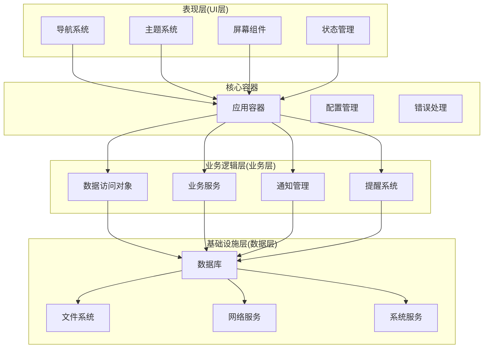
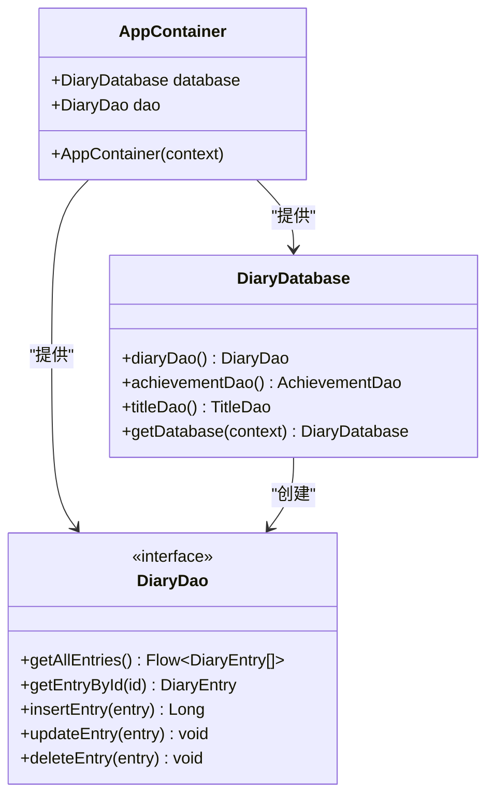
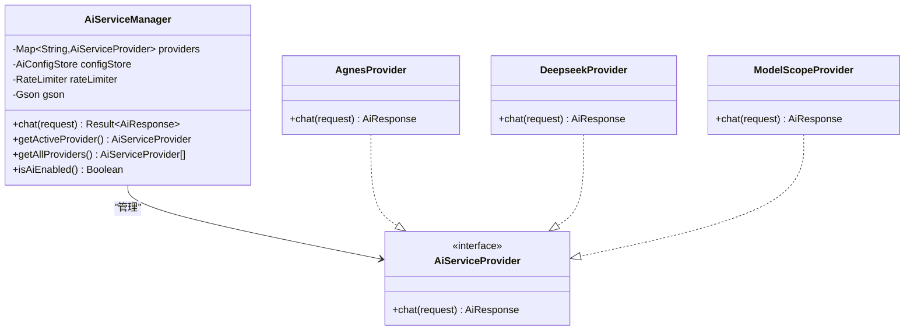
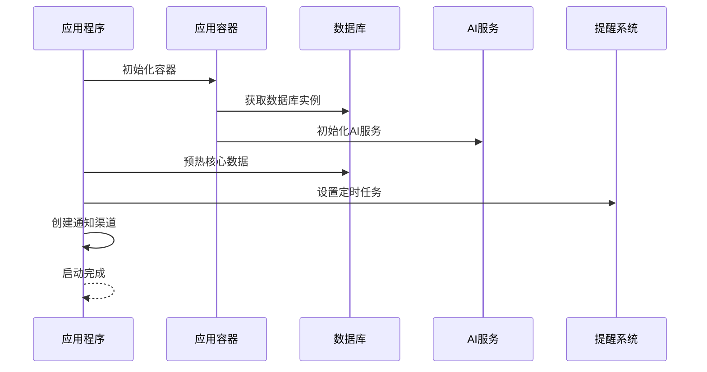
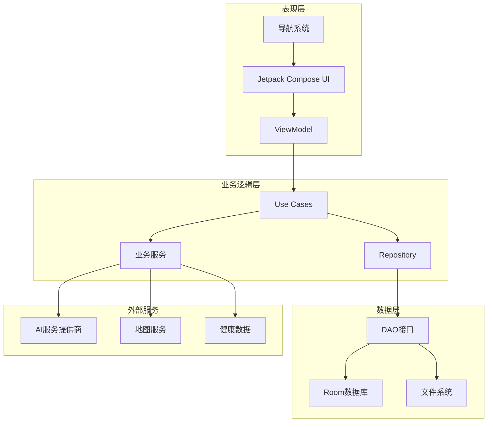
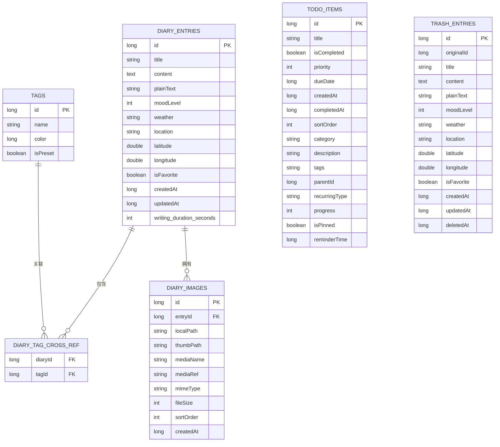
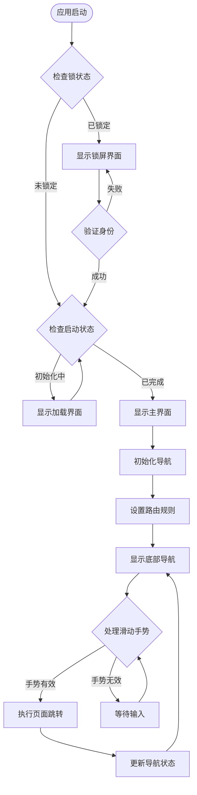
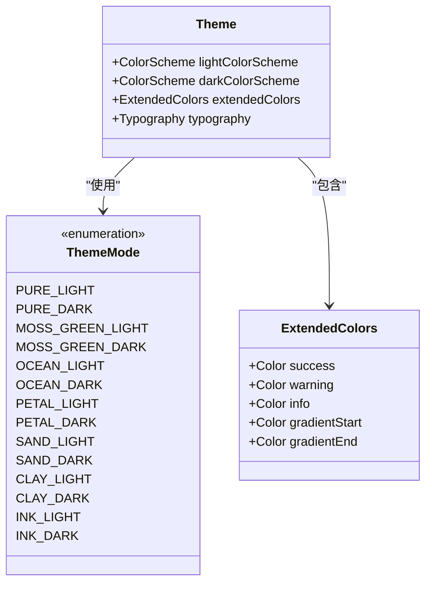
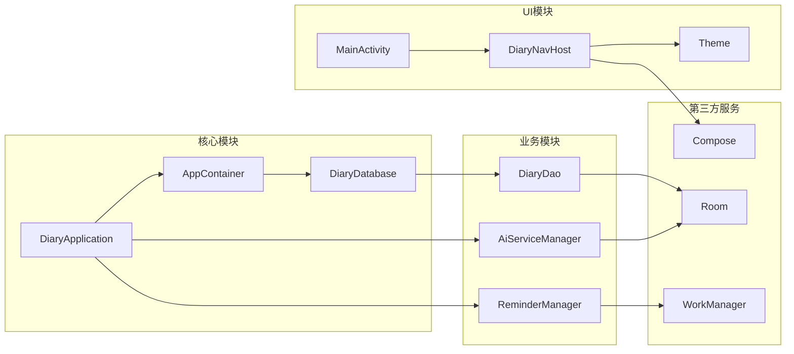

# 模块化设计原则

<cite>
**本文档引用的文件**
- [DiaryApplication.kt](file://app/src/main/java/com/diary/app/DiaryApplication.kt)
- [MainActivity.kt](file://app/src/main/java/com/diary/app/MainActivity.kt)
- [AppContainer.kt](file://app/src/main/java/com/diary/app/di/AppContainer.kt)
- [DiaryDatabase.kt](file://app/src/main/java/com/diary/app/data/DiaryDatabase.kt)
- [DiaryDao.kt](file://app/src/main/java/com/diary/app/data/DiaryDao.kt)
- [AiServiceManager.kt](file://app/src/main/java/com/diary/app/ai/AiServiceManager.kt)
- [DiaryNavHost.kt](file://app/src/main/java/com/diary/app/ui/navigation/DiaryNavHost.kt)
- [Theme.kt](file://app/src/main/java/com/diary/app/ui/theme/Theme.kt)
- [ReminderManager.kt](file://app/src/main/java/com/diary/app/reminder/ReminderManager.kt)
- [app/build.gradle.kts](file://app/build.gradle.kts)
- [settings.gradle.kts](file://settings.gradle.kts)
- [cross-module-dependency-analysis.html](file://docs/analysis/cross-module-dependency-analysis.html)
- [app-architecture-preview.html](file://docs/previews/app-architecture-preview.html)
</cite>

## 目录
1. [引言](#引言)
2. [项目结构](#项目结构)
3. [核心组件](#核心组件)
4. [架构概览](#架构概览)
5. [详细组件分析](#详细组件分析)
6. [依赖分析](#依赖分析)
7. [性能考虑](#性能考虑)
8. [故障排除指南](#故障排除指南)
9. [结论](#结论)
10. [附录](#附录)

## 引言

DiaryApp 采用模块化设计理念，将应用程序划分为功能模块、基础设施模块和技术支撑模块三个层次。这种设计实现了高内聚、低耦合的架构目标，为代码复用、并行开发和测试隔离提供了坚实基础。

模块化设计的核心原则包括：
- **单一职责原则**：每个模块专注于特定的功能领域
- **依赖倒置原则**：高层模块不依赖于低层模块的具体实现
- **接口隔离原则**：通过清晰的接口定义模块边界
- **开闭原则**：对扩展开放，对修改封闭

## 项目结构

DiaryApp 的模块化结构采用分层架构模式，主要分为以下层次：

**图表来源**
- [DiaryApplication.kt:30-157](file://app/src/main/java/com/diary/app/DiaryApplication.kt#L30-L157)
- [AppContainer.kt:11-14](file://app/src/main/java/com/diary/app/di/AppContainer.kt#L11-L14)

### 功能模块划分

**表现层模块**：
- 导航系统：负责页面路由和导航控制
- 主题系统：管理应用的主题切换和样式渲染
- 屏幕组件：具体的界面实现和用户交互
- 状态管理：处理应用的状态变化和数据绑定

**业务逻辑模块**：
- 数据访问对象：封装数据库操作和数据查询
- 业务服务：实现核心业务逻辑和数据处理
- 通知管理：处理应用内通知和消息推送
- 提醒系统：管理定时提醒和闹钟服务

**基础设施模块**：
- 数据库：提供数据持久化和查询服务
- 文件系统：管理媒体文件和备份数据
- 网络服务：处理AI服务和外部API通信
- 系统服务：集成Android系统功能

**章节来源**
- [DiaryNavHost.kt:135-183](file://app/src/main/java/com/diary/app/ui/navigation/DiaryNavHost.kt#L135-L183)
- [Theme.kt:500-576](file://app/src/main/java/com/diary/app/ui/theme/Theme.kt#L500-L576)

## 核心组件

### 应用容器(AppContainer)

应用容器是模块化架构的核心，实现了依赖注入和服务定位器模式：

**图表来源**
- [AppContainer.kt:11-14](file://app/src/main/java/com/diary/app/di/AppContainer.kt#L11-L14)
- [DiaryDatabase.kt:15-18](file://app/src/main/java/com/diary/app/data/DiaryDatabase.kt#L15-L18)
- [DiaryDao.kt:12-42](file://app/src/main/java/com/diary/app/data/DiaryDao.kt#L12-L42)

### AI服务管理器

AI服务管理器实现了多提供商支持和统一接口：

**图表来源**
- [AiServiceManager.kt:10-34](file://app/src/main/java/com/diary/app/ai/AiServiceManager.kt#L10-L34)

### 应用生命周期管理

应用生命周期管理确保了模块间的协调和资源的有效管理：

**图表来源**
- [DiaryApplication.kt:46-105](file://app/src/main/java/com/diary/app/DiaryApplication.kt#L46-L105)

**章节来源**
- [AppContainer.kt:1-15](file://app/src/main/java/com/diary/app/di/AppContainer.kt#L1-L15)
- [AiServiceManager.kt:1-104](file://app/src/main/java/com/diary/app/ai/AiServiceManager.kt#L1-L104)
- [DiaryApplication.kt:1-157](file://app/src/main/java/com/diary/app/DiaryApplication.kt#L1-L157)

## 架构概览

DiaryApp 采用MVVM架构模式，结合Clean Architecture分层设计：

**图表来源**
- [DiaryNavHost.kt:200-250](file://app/src/main/java/com/diary/app/ui/navigation/DiaryNavHost.kt#L200-L250)
- [DiaryDao.kt:12-42](file://app/src/main/java/com/diary/app/data/DiaryDao.kt#L12-L42)

### 模块边界设计

模块边界通过清晰的接口定义实现松耦合：

**数据访问边界**：
- DAO接口定义明确的数据访问契约
- Repository层抽象数据源访问
- 统一的错误处理和异常转换

**业务逻辑边界**：
- Use Cases封装具体业务场景
- Service层提供业务能力
- 防御式编程确保数据完整性

**表现层边界**：
- ViewModel暴露业务状态
- Compose组件专注UI渲染
- 导航参数化路由

**章节来源**
- [DiaryDao.kt:12-665](file://app/src/main/java/com/diary/app/data/DiaryDao.kt#L12-L665)
- [DiaryNavHost.kt:135-776](file://app/src/main/java/com/diary/app/ui/navigation/DiaryNavHost.kt#L135-L776)

## 详细组件分析

### 数据层模块

数据层采用Room数据库框架，实现了完整的数据持久化解决方案：

**图表来源**
- [DiaryDatabase.kt:10-14](file://app/src/main/java/com/diary/app/data/DiaryDatabase.kt#L10-L14)
- [DiaryDao.kt:12-665](file://app/src/main/java/com/diary/app/data/DiaryDao.kt#L12-L665)

### 导航系统模块

导航系统实现了灵活的页面路由和状态管理：

**图表来源**
- [MainActivity.kt:79-435](file://app/src/main/java/com/diary/app/MainActivity.kt#L79-L435)
- [DiaryNavHost.kt:200-250](file://app/src/main/java/com/diary/app/ui/navigation/DiaryNavHost.kt#L200-L250)

### 主题系统模块

主题系统实现了动态主题切换和样式管理：

**图表来源**
- [Theme.kt:108-124](file://app/src/main/java/com/diary/app/ui/theme/Theme.kt#L108-L124)
- [Theme.kt:500-576](file://app/src/main/java/com/diary/app/ui/theme/Theme.kt#L500-L576)

**章节来源**
- [DiaryDatabase.kt:1-829](file://app/src/main/java/com/diary/app/data/DiaryDatabase.kt#L1-L829)
- [DiaryNavHost.kt:1-900](file://app/src/main/java/com/diary/app/ui/navigation/DiaryNavHost.kt#L1-L900)
- [Theme.kt:1-576](file://app/src/main/java/com/diary/app/ui/theme/Theme.kt#L1-L576)

## 依赖分析

### 模块间依赖关系

**图表来源**
- [DiaryApplication.kt:30-36](file://app/src/main/java/com/diary/app/DiaryApplication.kt#L30-L36)
- [AppContainer.kt:11-14](file://app/src/main/java/com/diary/app/di/AppContainer.kt#L11-L14)
- [MainActivity.kt:79-102](file://app/src/main/java/com/diary/app/MainActivity.kt#L79-L102)

### 耦合风险分析

根据架构分析文档，当前存在以下耦合风险：

**风险点1：ViewModel层间耦合**
- 不同ViewModel之间存在直接依赖
- 建议通过Repository层解耦

**风险点2：Repository接口不规范**
- 缺少统一的Repository接口定义
- 建议引入接口抽象层

**风险点3：数据流双向性**
- 部分模块间存在双向数据依赖
- 建议强化单向数据流设计

**章节来源**
- [cross-module-dependency-analysis.html:332-372](file://docs/analysis/cross-module-dependency-analysis.html#L332-L372)
- [app-architecture-preview.html:426-548](file://docs/previews/app-architecture-preview.html#L426-L548)

## 性能考虑

### 数据访问优化

**批量操作优化**：
- 使用事务批量插入减少数据库开销
- 实现分页查询避免内存溢出
- 采用流式查询处理大数据集

**缓存策略**：
- AI响应缓存降低API调用频率
- 图片缩略图缓存提升加载速度
- 内存缓存减少重复计算

### 并发处理

**协程使用**：
- 数据库操作在IO线程执行
- UI更新在主线程进行
- 错误处理使用协程作用域

**内存管理**：
- 及时释放大对象引用
- 使用弱引用避免内存泄漏
- 实现懒加载策略

## 故障排除指南

### 启动阶段问题

**数据库初始化失败**：
- 检查数据库迁移脚本
- 验证数据库文件权限
- 查看迁移异常日志

**AI服务不可用**：
- 确认API密钥配置
- 检查网络连接状态
- 验证提供商可用性

### 运行时问题

**内存不足**：
- 监控内存使用情况
- 实施对象池化策略
- 优化图片加载大小

**UI卡顿**：
- 检查主线程阻塞
- 优化重组频率
- 减少不必要的状态更新

**章节来源**
- [DiaryApplication.kt:86-105](file://app/src/main/java/com/diary/app/DiaryApplication.kt#L86-L105)
- [AiServiceManager.kt:43-61](file://app/src/main/java/com/diary/app/ai/AiServiceManager.kt#L43-L61)

## 结论

DiaryApp的模块化设计实现了良好的架构分离，为应用的长期发展奠定了坚实基础。通过功能模块、基础设施模块和技术支撑模块的合理划分，实现了：

**主要优势**：
- **代码复用**：通过接口抽象实现组件复用
- **并行开发**：模块边界清晰支持团队协作
- **测试隔离**：依赖注入便于单元测试
- **扩展性强**：插件化架构支持功能扩展

**改进建议**：
- 规范Repository接口设计
- 加强ViewModel层解耦
- 优化数据流单向性
- 完善错误处理机制

## 附录

### 模块扩展最佳实践

**添加新功能模块**：
1. 定义清晰的模块边界和接口
2. 实现依赖注入配置
3. 编写单元测试和集成测试
4. 文档化模块使用方法

**维护现有模块**：
1. 保持向后兼容性
2. 渐进式重构避免破坏性变更
3. 定期审查模块依赖关系
4. 监控模块性能指标

**章节来源**
- [app/build.gradle.kts:89-145](file://app/build.gradle.kts#L89-L145)
- [settings.gradle.kts:16-18](file://settings.gradle.kts#L16-L18)