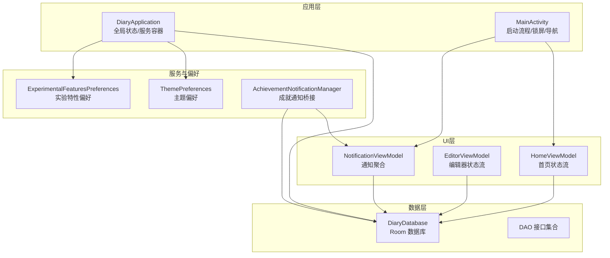
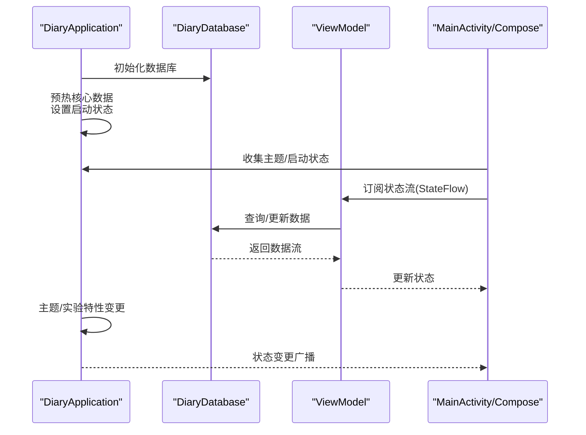
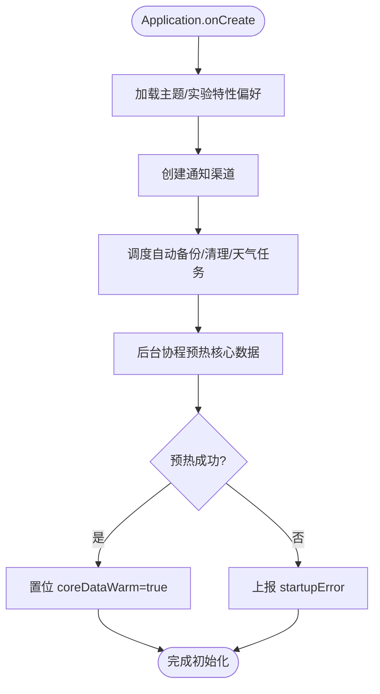
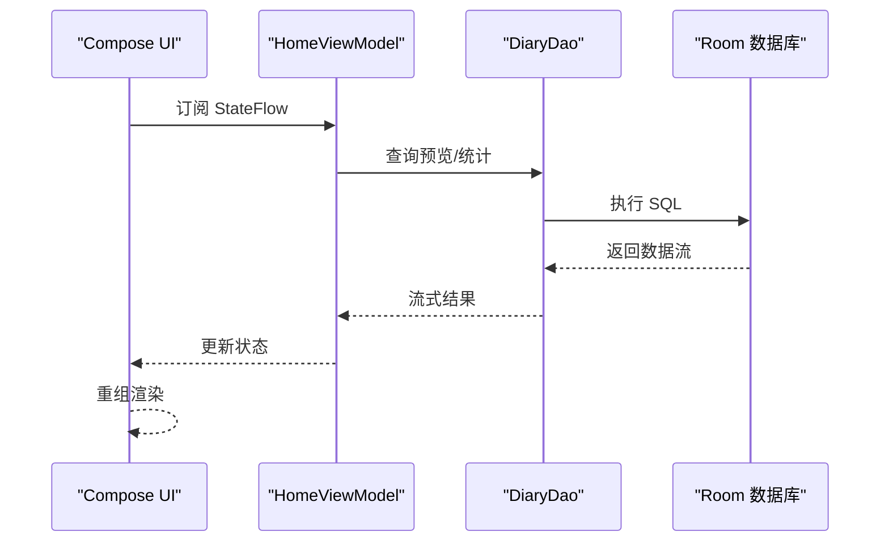
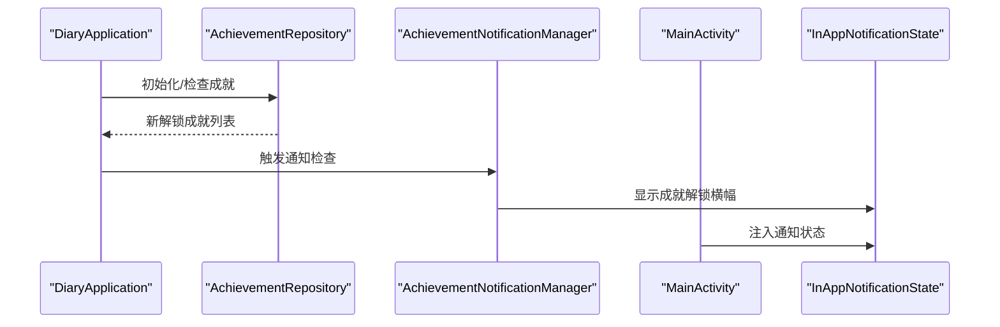
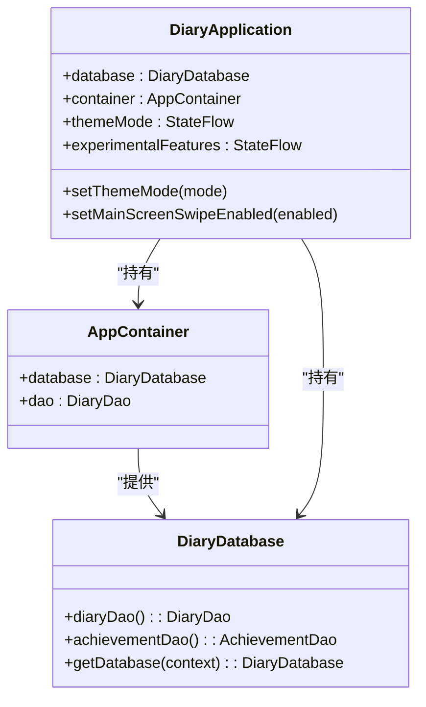
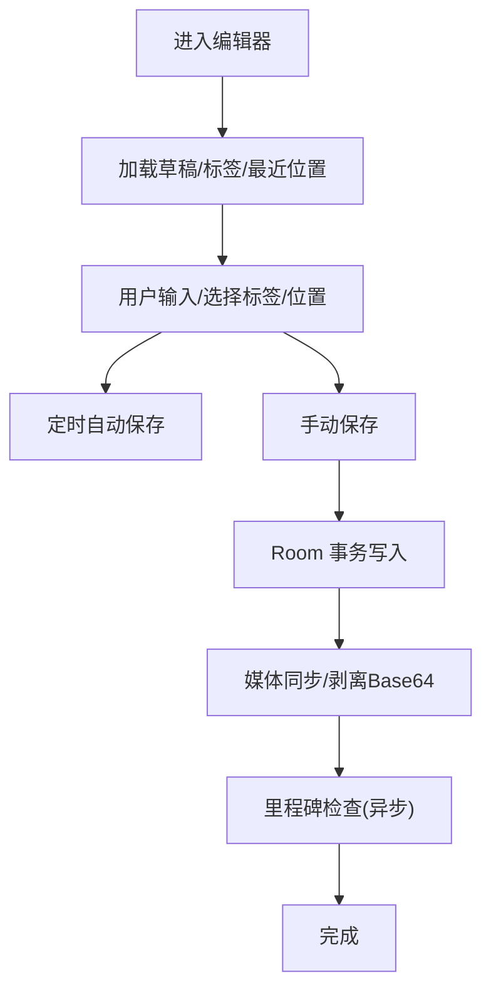
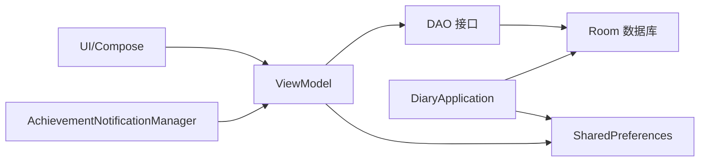

# 组件交互机制

<cite>
**本文档引用的文件**
- [DiaryApplication.kt](file://app/src/main/java/com/diary/app/DiaryApplication.kt)
- [MainActivity.kt](file://app/src/main/java/com/diary/app/MainActivity.kt)
- [AppContainer.kt](file://app/src/main/java/com/diary/app/di/AppContainer.kt)
- [ThemePreferences.kt](file://app/src/main/java/com/diary/app/ui/theme/ThemePreferences.kt)
- [ExperimentalFeaturesPreferences.kt](file://app/src/main/java/com/diary/app/ui/experimental/ExperimentalFeaturesPreferences.kt)
- [HomeViewModel.kt](file://app/src/main/java/com/diary/app/ui/home/HomeViewModel.kt)
- [EditorViewModel.kt](file://app/src/main/java/com/diary/app/ui/editor/EditorViewModel.kt)
- [NotificationViewModel.kt](file://app/src/main/java/com/diary/app/ui/notification/NotificationViewModel.kt)
- [AchievementNotificationManager.kt](file://app/src/main/java/com/diary/app/reminder/AchievementNotificationManager.kt)
- [DiaryDatabase.kt](file://app/src/main/java/com/diary/app/data/DiaryDatabase.kt)
</cite>

## 目录
1. [简介](#简介)
2. [项目结构](#项目结构)
3. [核心组件](#核心组件)
4. [架构总览](#架构总览)
5. [详细组件分析](#详细组件分析)
6. [依赖关系分析](#依赖关系分析)
7. [性能考量](#性能考量)
8. [故障排查指南](#故障排查指南)
9. [结论](#结论)

## 简介
本文件聚焦于 DiaryApp 的组件交互机制，系统阐述应用内各组件之间的通信方式（观察者模式、回调机制、事件总线）、Application 级全局状态管理（主题切换、实验性功能开关、启动状态监控）、组件间数据共享策略（单例模式、静态工厂、依赖注入），以及组件生命周期管理最佳实践与解耦技巧。文档以代码为依据，辅以图示帮助读者快速理解。

## 项目结构
DiaryApp 采用 Android 应用典型分层组织：Application 层负责全局状态与服务初始化；UI 层通过 Compose 使用 ViewModel 提供的状态流进行响应式渲染；ViewModel 作为业务中枢协调数据库访问与外部服务；数据层基于 Room 实现持久化；依赖注入采用轻量 Service Locator 模式；通知与成就解锁通过独立管理器实现跨模块解耦。

图表来源
- [DiaryApplication.kt:30-156](file://app/src/main/java/com/diary/app/DiaryApplication.kt#L30-L156)
- [MainActivity.kt:79-435](file://app/src/main/java/com/diary/app/MainActivity.kt#L79-L435)
- [HomeViewModel.kt:81-398](file://app/src/main/java/com/diary/app/ui/home/HomeViewModel.kt#L81-L398)
- [EditorViewModel.kt:41-432](file://app/src/main/java/com/diary/app/ui/editor/EditorViewModel.kt#L41-L432)
- [NotificationViewModel.kt:139-666](file://app/src/main/java/com/diary/app/ui/notification/NotificationViewModel.kt#L139-L666)
- [DiaryDatabase.kt:10-20](file://app/src/main/java/com/diary/app/data/DiaryDatabase.kt#L10-L20)

章节来源
- [DiaryApplication.kt:30-156](file://app/src/main/java/com/diary/app/DiaryApplication.kt#L30-L156)
- [MainActivity.kt:79-435](file://app/src/main/java/com/diary/app/MainActivity.kt#L79-L435)

## 核心组件
- Application 级全局状态
  - 主题模式：通过 StateFlow 暴露主题状态，并持久化到 SharedPreferences。
  - 实验性功能开关：集中存储在 SharedPreferences，支持动态开关与持久化。
  - 启动状态监控：核心数据预热标志与启动错误状态，供 UI 渲染引导页或错误页。
- 依赖注入与服务定位
  - AppContainer 提供数据库与 DAO 的统一入口，避免分散的单例创建。
- 观察者与状态流
  - ViewModel 使用 StateFlow/SharedFlow 构建响应式 UI 状态，配合协程作用域管理生命周期。
- 事件与通知
  - 成就解锁通过 AchievementNotificationManager 触发 In-App Banner，避免系统通知耦合。

章节来源
- [DiaryApplication.kt:30-156](file://app/src/main/java/com/diary/app/DiaryApplication.kt#L30-L156)
- [AppContainer.kt:11-14](file://app/src/main/java/com/diary/app/di/AppContainer.kt#L11-L14)
- [ThemePreferences.kt:5-25](file://app/src/main/java/com/diary/app/ui/theme/ThemePreferences.kt#L5-L25)
- [ExperimentalFeaturesPreferences.kt:5-76](file://app/src/main/java/com/diary/app/ui/experimental/ExperimentalFeaturesPreferences.kt#L5-L76)
- [AchievementNotificationManager.kt:23-86](file://app/src/main/java/com/diary/app/reminder/AchievementNotificationManager.kt#L23-L86)

## 架构总览
应用采用“Application 全局状态 + ViewModel 响应式状态 + Room 数据持久”的架构。UI 通过 collectAsState 订阅状态流，实现自动刷新；后台任务通过 WorkManager 定时调度；通知与成就解锁通过独立管理器解耦。

图表来源
- [DiaryApplication.kt:46-105](file://app/src/main/java/com/diary/app/DiaryApplication.kt#L46-L105)
- [MainActivity.kt:87-120](file://app/src/main/java/com/diary/app/MainActivity.kt#L87-L120)
- [HomeViewModel.kt:156-180](file://app/src/main/java/com/diary/app/ui/home/HomeViewModel.kt#L156-L180)
- [DiaryDatabase.kt:712-771](file://app/src/main/java/com/diary/app/data/DiaryDatabase.kt#L712-L771)

## 详细组件分析

### Application 全局状态与生命周期
- 主题切换
  - 通过 ThemePreferences 读取/写入主题偏好，DiaryApplication 暴露 StateFlow 主题模式，UI 可实时响应。
- 实验性功能开关
  - 通过 ExperimentalFeaturesPreferences 读取/写入开关，DiaryApplication 提供 setXxxEnabled 方法，内部更新 StateFlow 并持久化。
- 启动状态监控
  - warmUpCoreData 在后台协程中执行数据库预热与自动备份检查，成功后置位 coreDataWarm，失败则上报 startupError。
- 生命周期与初始化顺序
  - Application.onCreate 中按需初始化通知通道、定时任务与核心数据预热；Activity onCreate 中订阅状态流，确保 UI 与状态一致。

图表来源
- [DiaryApplication.kt:46-105](file://app/src/main/java/com/diary/app/DiaryApplication.kt#L46-L105)

章节来源
- [DiaryApplication.kt:30-156](file://app/src/main/java/com/diary/app/DiaryApplication.kt#L30-L156)
- [ThemePreferences.kt:5-25](file://app/src/main/java/com/diary/app/ui/theme/ThemePreferences.kt#L5-L25)
- [ExperimentalFeaturesPreferences.kt:5-76](file://app/src/main/java/com/diary/app/ui/experimental/ExperimentalFeaturesPreferences.kt#L5-L76)

### 观察者模式与状态流
- StateFlow/SharedFlow
  - ViewModel 将查询结果封装为 StateFlow，UI 通过 collectAsState 订阅，实现自动刷新。
  - 示例：HomeViewModel 的 allEntries、dayInfoMap、stats、searchResults 等均来自数据库查询流，经 stateIn 转换为可订阅状态。
- 协程作用域与生命周期
  - AndroidViewModel 在 viewModelScope 中发起查询与更新，避免泄漏；后台任务使用 SupervisorJob + IO 调度器。

图表来源
- [HomeViewModel.kt:156-229](file://app/src/main/java/com/diary/app/ui/home/HomeViewModel.kt#L156-L229)

章节来源
- [HomeViewModel.kt:81-398](file://app/src/main/java/com/diary/app/ui/home/HomeViewModel.kt#L81-L398)

### 回调机制与事件桥接
- 成就解锁通知桥接
  - AchievementNotificationManager 通过 inAppNotificationState 引用触发 In-App Banner，避免系统通知耦合。
  - MainActivity 在 LaunchedEffect 中注入 InAppNotificationState，实现跨组件通信。
- 通知聚合与分类
  - NotificationViewModel 聚合多种通知源（胶囊、里程碑、周报等），转换为统一的 NotificationItem 并持久化到数据库。

图表来源
- [DiaryApplication.kt:96-104](file://app/src/main/java/com/diary/app/DiaryApplication.kt#L96-L104)
- [AchievementNotificationManager.kt:44-75](file://app/src/main/java/com/diary/app/reminder/AchievementNotificationManager.kt#L44-L75)
- [MainActivity.kt:377-379](file://app/src/main/java/com/diary/app/MainActivity.kt#L377-L379)

章节来源
- [AchievementNotificationManager.kt:23-86](file://app/src/main/java/com/diary/app/reminder/AchievementNotificationManager.kt#L23-L86)
- [NotificationViewModel.kt:139-290](file://app/src/main/java/com/diary/app/ui/notification/NotificationViewModel.kt#L139-L290)
- [MainActivity.kt:375-414](file://app/src/main/java/com/diary/app/MainActivity.kt#L375-L414)

### 依赖注入与数据共享策略
- 单例模式
  - DiaryDatabase 采用伴生对象 + 双重检查锁定的懒加载单例，保证全局唯一实例。
- 静态工厂
  - AppContainer 作为轻量服务定位器，提供数据库与 DAO 的集中访问入口。
- 依赖注入
  - ViewModel 通过 AndroidViewModel 构造函数接收 Application，间接获得数据库与全局服务；避免直接 new 导致的紧耦合。

图表来源
- [DiaryApplication.kt:30-34](file://app/src/main/java/com/diary/app/DiaryApplication.kt#L30-L34)
- [AppContainer.kt:11-14](file://app/src/main/java/com/diary/app/di/AppContainer.kt#L11-L14)
- [DiaryDatabase.kt:26-27](file://app/src/main/java/com/diary/app/data/DiaryDatabase.kt#L26-L27)

章节来源
- [AppContainer.kt:11-14](file://app/src/main/java/com/diary/app/di/AppContainer.kt#L11-L14)
- [DiaryDatabase.kt:712-771](file://app/src/main/java/com/diary/app/data/DiaryDatabase.kt#L712-L771)

### 编辑器与主页的交互模式
- 编辑器状态流
  - EditorViewModel 维护草稿、标签、位置、写作时长等状态，支持自动保存与手动保存。
- 主页搜索与筛选
  - HomeViewModel 通过 debounce 与 flatMapLatest 控制搜索频率与查询范围，避免主线程阻塞。
- 数据一致性
  - 保存日记时使用 Room transaction，确保标签关联原子性；媒体同步剥离 Base64，防止内存溢出。

图表来源
- [EditorViewModel.kt:245-373](file://app/src/main/java/com/diary/app/ui/editor/EditorViewModel.kt#L245-L373)

章节来源
- [EditorViewModel.kt:41-432](file://app/src/main/java/com/diary/app/ui/editor/EditorViewModel.kt#L41-L432)
- [HomeViewModel.kt:239-245](file://app/src/main/java/com/diary/app/ui/home/HomeViewModel.kt#L239-L245)

## 依赖关系分析
- 组件耦合与内聚
  - ViewModel 对 DAO 的依赖清晰，通过 Application 获取数据库实例，降低 UI 与数据层耦合。
  - AchievementNotificationManager 仅依赖 InAppNotificationState 与数据库，避免对 UI 的直接依赖。
- 外部依赖与集成点
  - 地图 SDK 初始化在 Application 中进行，避免在 UI 层分散初始化逻辑。
  - WeatherManager 与 BackupManager 通过 WorkManager 调度，减少前台阻塞。
- 循环依赖规避
  - 通过单向依赖（UI->ViewModel->DAO->DB）与事件桥接（AchievementNotificationManager）避免循环。

图表来源
- [MainActivity.kt:87-120](file://app/src/main/java/com/diary/app/MainActivity.kt#L87-L120)
- [HomeViewModel.kt:81-82](file://app/src/main/java/com/diary/app/ui/home/HomeViewModel.kt#L81-L82)
- [DiaryDatabase.kt:10-20](file://app/src/main/java/com/diary/app/data/DiaryDatabase.kt#L10-L20)
- [AchievementNotificationManager.kt:23-29](file://app/src/main/java/com/diary/app/reminder/AchievementNotificationManager.kt#L23-L29)

章节来源
- [DiaryApplication.kt:46-105](file://app/src/main/java/com/diary/app/DiaryApplication.kt#L46-L105)
- [DiaryDatabase.kt:712-771](file://app/src/main/java/com/diary/app/data/DiaryDatabase.kt#L712-L771)

## 性能考量
- 状态流背压与去抖
  - 搜索使用 debounce 控制查询频率；combine/stateIn 限制上游数据流并发，避免 UI 卡顿。
- 数据库预热与迁移
  - Application 启动时预热数据库，Room 迁移链完整，异常时自动备份文件以便恢复。
- 后台任务与协程
  - 使用 SupervisorJob + IO 调度器执行后台任务，避免主线程阻塞；WorkManager 调度周期任务。
- 媒体处理
  - 编辑器剥离 Base64，媒体同步采用事务与索引字段，提升写入与查询效率。

## 故障排查指南
- 启动失败
  - 若 coreDataWarm 为 false 且 startupError 非空，UI 将显示错误页；检查数据库迁移与备份目录权限。
- 主题/实验特性不生效
  - 确认 ThemePreferences/ExperimentalFeaturesPreferences 是否正确写入；重启应用后生效。
- 成就通知未出现
  - 检查 AchievementNotificationManager 的 inAppNotificationState 是否注入；确认 Quiet Hours 与偏好设置。
- 通知聚合异常
  - 查看 NotificationViewModel 的生成逻辑与数据库缓存键，确保同日不重复生成。

章节来源
- [MainActivity.kt:415-419](file://app/src/main/java/com/diary/app/MainActivity.kt#L415-L419)
- [DiaryApplication.kt:86-105](file://app/src/main/java/com/diary/app/DiaryApplication.kt#L86-L105)
- [AchievementNotificationManager.kt:44-61](file://app/src/main/java/com/diary/app/reminder/AchievementNotificationManager.kt#L44-L61)
- [NotificationViewModel.kt:163-206](file://app/src/main/java/com/diary/app/ui/notification/NotificationViewModel.kt#L163-L206)

## 结论
DiaryApp 通过 Application 全局状态、ViewModel 响应式状态流与 Room 数据持久化构建了清晰的组件交互体系。借助轻量依赖注入与事件桥接，实现了主题切换、实验特性开关、启动状态监控与通知系统的解耦与可维护性。遵循本文建议的生命周期管理与性能优化策略，可进一步提升应用稳定性与用户体验。