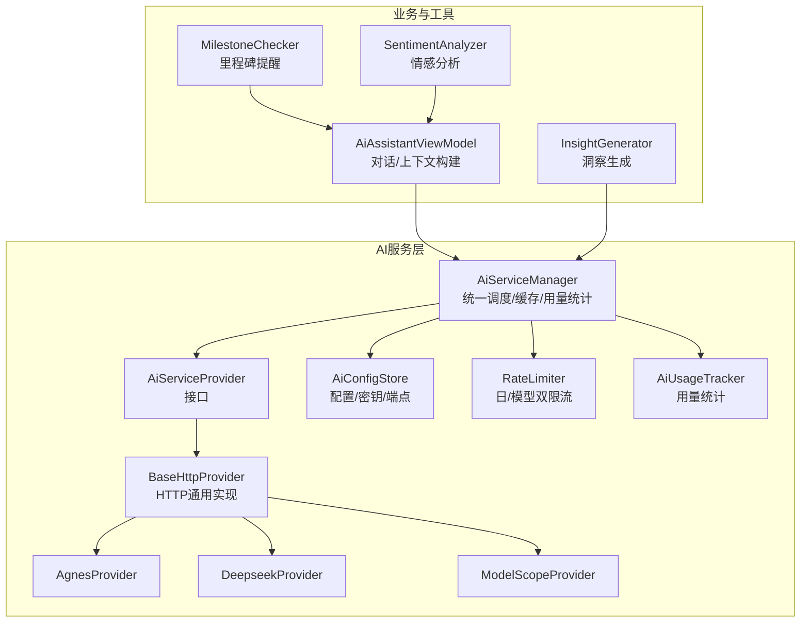
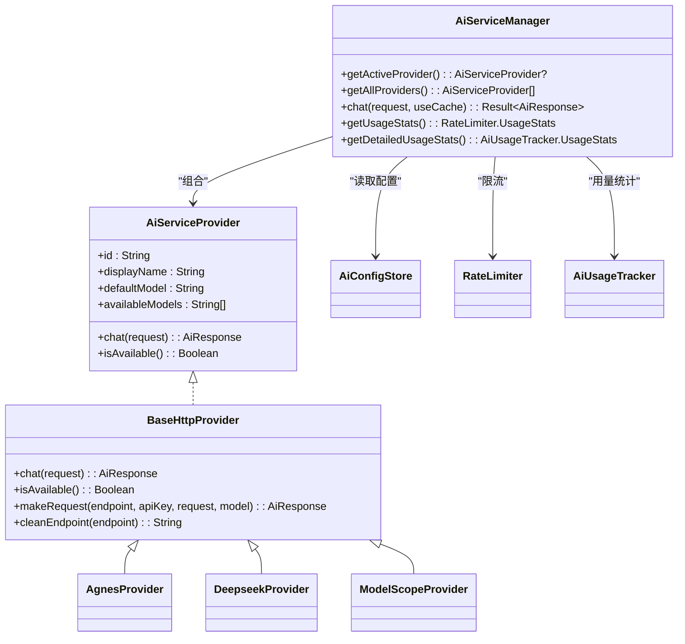
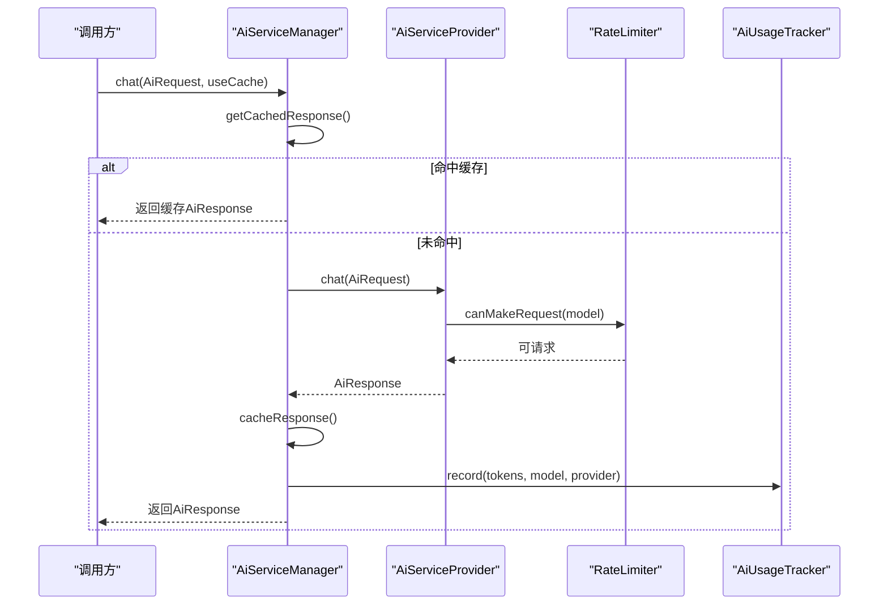
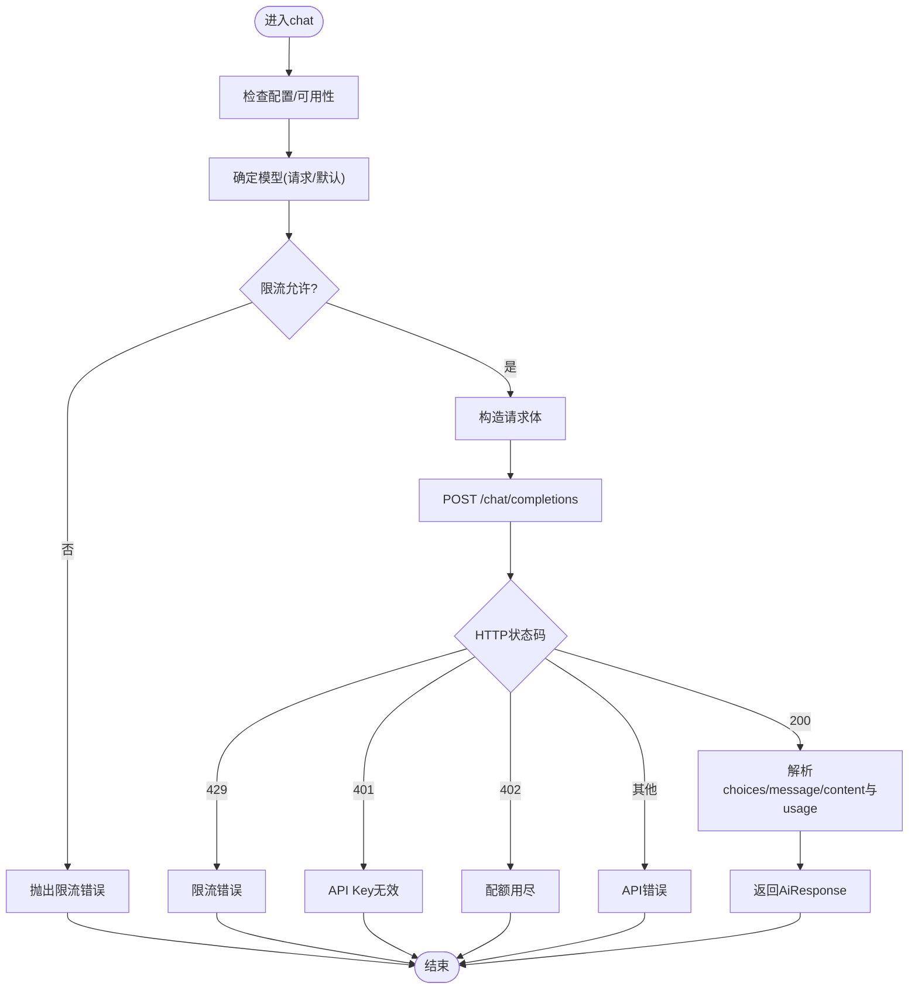
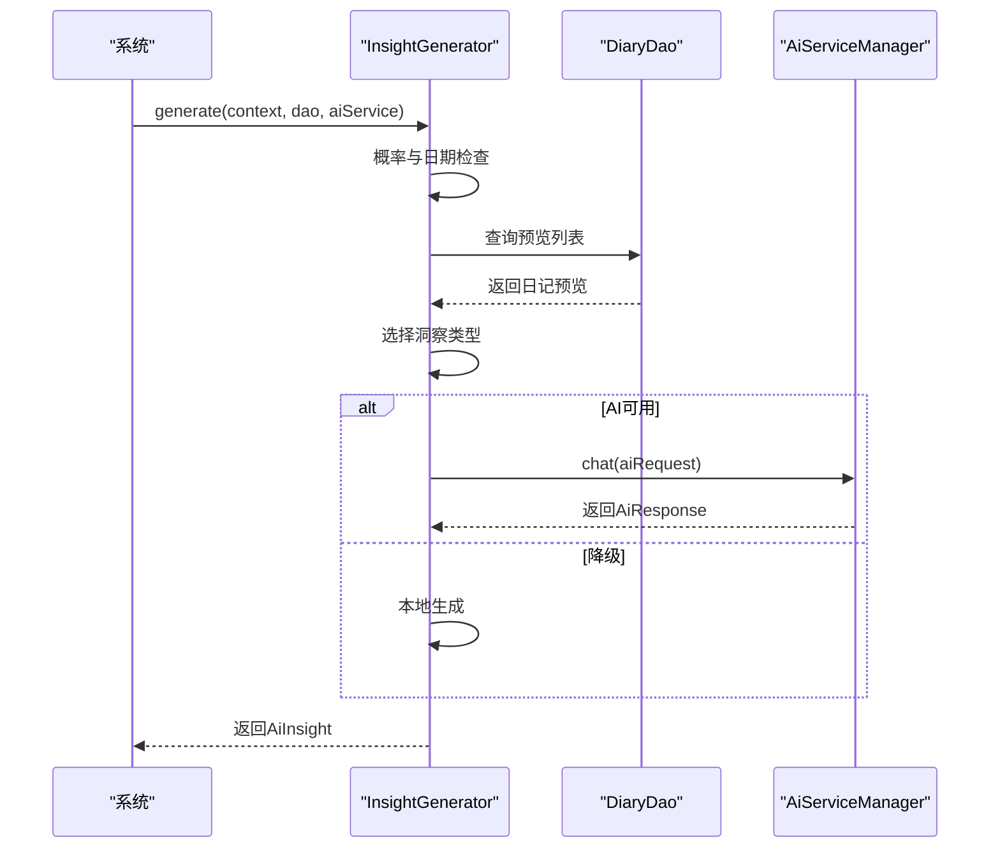
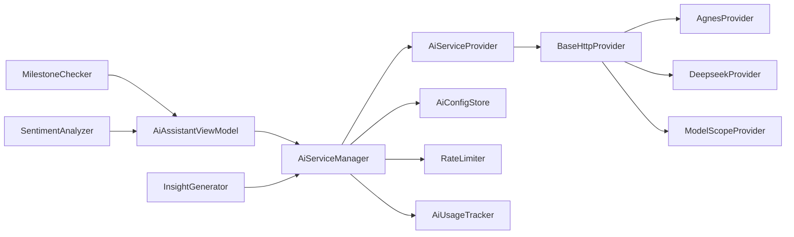

# AI助手

<cite>
**本文引用的文件**
- [AiServiceManager.kt](file://app/src/main/java/com/diary/app/ai/AiServiceManager.kt)
- [AiServiceProvider.kt](file://app/src/main/java/com/diary/app/ai/AiServiceProvider.kt)
- [BaseHttpProvider.kt](file://app/src/main/java/com/diary/app/ai/BaseHttpProvider.kt)
- [AgnesProvider.kt](file://app/src/main/java/com/diary/app/ai/AgnesProvider.kt)
- [DeepseekProvider.kt](file://app/src/main/java/com/diary/app/ai/DeepseekProvider.kt)
- [ModelScopeProvider.kt](file://app/src/main/java/com/diary/app/ai/ModelScopeProvider.kt)
- [AiConfigStore.kt](file://app/src/main/java/com/diary/app/ai/AiConfigStore.kt)
- [AiModels.kt](file://app/src/main/java/com/diary/app/ai/AiModels.kt)
- [RateLimiter.kt](file://app/src/main/java/com/diary/app/ai/RateLimiter.kt)
- [AiUsageTracker.kt](file://app/src/main/java/com/diary/app/ai/AiUsageTracker.kt)
- [InsightGenerator.kt](file://app/src/main/java/com/diary/app/ai/InsightGenerator.kt)
- [MilestoneChecker.kt](file://app/src/main/java/com/diary/app/ai/MilestoneChecker.kt)
- [AiAssistantViewModel.kt](file://app/src/main/java/com/diary/app/ai/AiAssistantViewModel.kt)
- [SentimentAnalyzer.kt](file://app/src/main/java/com/diary/app/data/SentimentAnalyzer.kt)
- [InsightGeneratorTest.kt](file://app/src/test/java/com/diary/app/ai/InsightGeneratorTest.kt)
- [RateLimiterTest.kt](file://app/src/test/java/com/diary/app/ai/RateLimiterTest.kt)
</cite>

## 目录
1. [简介](#简介)
2. [项目结构](#项目结构)
3. [核心组件](#核心组件)
4. [架构总览](#架构总览)
5. [组件详解](#组件详解)
6. [依赖关系分析](#依赖关系分析)
7. [性能与优化](#性能与优化)
8. [故障排查指南](#故障排查指南)
9. [结论](#结论)
10. [附录](#附录)

## 简介
本文件为“AI助手”模块的综合技术文档，面向Android端日记应用中的多提供商AI服务集成场景。内容覆盖：
- 多提供商架构与服务选择策略
- 负载均衡与限流机制
- 各AI提供商接入差异（AgnesProvider、DeepseekProvider、ModelScopeProvider）
- 请求发送与响应解析、错误处理、使用限制
- InsightGenerator洞察生成、内容优化建议、情感分析
- 配置与API密钥管理、成本控制
- 缓存策略、离线模式与性能优化最佳实践

## 项目结构
AI助手相关代码集中在app/src/main/java/com/diary/app/ai目录下，采用“接口+抽象基类+具体提供商”的分层设计，并通过AiServiceManager统一编排。

图表来源
- [AiServiceManager.kt:10-24](file://app/src/main/java/com/diary/app/ai/AiServiceManager.kt#L10-L24)
- [AiServiceProvider.kt:3-11](file://app/src/main/java/com/diary/app/ai/AiServiceProvider.kt#L3-L11)
- [BaseHttpProvider.kt:10-14](file://app/src/main/java/com/diary/app/ai/BaseHttpProvider.kt#L10-L14)
- [AgnesProvider.kt:5-15](file://app/src/main/java/com/diary/app/ai/AgnesProvider.kt#L5-L15)
- [DeepseekProvider.kt:5-18](file://app/src/main/java/com/diary/app/ai/DeepseekProvider.kt#L5-L18)
- [ModelScopeProvider.kt:5-23](file://app/src/main/java/com/diary/app/ai/ModelScopeProvider.kt#L5-L23)
- [AiConfigStore.kt:5-131](file://app/src/main/java/com/diary/app/ai/AiConfigStore.kt#L5-L131)
- [RateLimiter.kt:6-82](file://app/src/main/java/com/diary/app/ai/RateLimiter.kt#L6-L82)
- [AiUsageTracker.kt:10-60](file://app/src/main/java/com/diary/app/ai/AiUsageTracker.kt#L10-L60)
- [AiAssistantViewModel.kt:33-58](file://app/src/main/java/com/diary/app/ai/AiAssistantViewModel.kt#L33-L58)
- [InsightGenerator.kt:16-52](file://app/src/main/java/com/diary/app/ai/InsightGenerator.kt#L16-L52)
- [MilestoneChecker.kt:11-68](file://app/src/main/java/com/diary/app/ai/MilestoneChecker.kt#L11-L68)
- [SentimentAnalyzer.kt:7-101](file://app/src/main/java/com/diary/app/data/SentimentAnalyzer.kt#L7-L101)

章节来源
- [AiServiceManager.kt:10-24](file://app/src/main/java/com/diary/app/ai/AiServiceManager.kt#L10-L24)
- [AiServiceProvider.kt:3-11](file://app/src/main/java/com/diary/app/ai/AiServiceProvider.kt#L3-L11)
- [BaseHttpProvider.kt:10-14](file://app/src/main/java/com/diary/app/ai/BaseHttpProvider.kt#L10-L14)
- [AiConfigStore.kt:5-131](file://app/src/main/java/com/diary/app/ai/AiConfigStore.kt#L5-L131)

## 核心组件
- AiServiceManager：统一入口，负责提供商注册、活跃提供商选择、缓存、用量统计、错误处理。
- AiServiceProvider：提供商接口，定义id/displayName/defaultModel/availableModels及chat/isAvailable。
- BaseHttpProvider：HTTP通用实现，封装endpoint/apiKey构造、超时设置、请求体构建、响应解析、错误映射。
- 具体提供商：AgnesProvider、DeepseekProvider、ModelScopeProvider，分别声明自身id/displayName/defaultModel/availableModels，并可覆写超时等细节。
- AiConfigStore：集中管理全局开关、活跃提供商、各提供商的API Key、Endpoint、Model。
- RateLimiter：日总请求数与按模型维度的双限流，每日重置。
- AiUsageTracker：按日期统计请求次数、token总量、按模型/提供商细分的用量。
- InsightGenerator：基于日记数据生成“心情问候/鼓励/习惯/问候”四类洞察，支持AI生成与本地回退。
- AiAssistantViewModel：对话视图模型，构建系统提示词与历史消息，调用AiServiceManager并持久化消息。
- SentimentAnalyzer：简单情感分析器，用于识别情绪倾向与压力/新话题/深夜等特征。

章节来源
- [AiServiceManager.kt:10-103](file://app/src/main/java/com/diary/app/ai/AiServiceManager.kt#L10-L103)
- [AiServiceProvider.kt:3-11](file://app/src/main/java/com/diary/app/ai/AiServiceProvider.kt#L3-L11)
- [BaseHttpProvider.kt:10-118](file://app/src/main/java/com/diary/app/ai/BaseHttpProvider.kt#L10-L118)
- [AgnesProvider.kt:5-15](file://app/src/main/java/com/diary/app/ai/AgnesProvider.kt#L5-L15)
- [DeepseekProvider.kt:5-18](file://app/src/main/java/com/diary/app/ai/DeepseekProvider.kt#L5-L18)
- [ModelScopeProvider.kt:5-23](file://app/src/main/java/com/diary/app/ai/ModelScopeProvider.kt#L5-L23)
- [AiConfigStore.kt:5-131](file://app/src/main/java/com/diary/app/ai/AiConfigStore.kt#L5-L131)
- [RateLimiter.kt:6-93](file://app/src/main/java/com/diary/app/ai/RateLimiter.kt#L6-L93)
- [AiUsageTracker.kt:10-95](file://app/src/main/java/com/diary/app/ai/AiUsageTracker.kt#L10-L95)
- [InsightGenerator.kt:16-173](file://app/src/main/java/com/diary/app/ai/InsightGenerator.kt#L16-L173)
- [AiAssistantViewModel.kt:33-363](file://app/src/main/java/com/diary/app/ai/AiAssistantViewModel.kt#L33-L363)
- [SentimentAnalyzer.kt:7-101](file://app/src/main/java/com/diary/app/data/SentimentAnalyzer.kt#L7-L101)

## 架构总览
多提供商架构以AiServiceManager为中心，通过AiServiceProvider抽象统一调度，BaseHttpProvider实现HTTP通信细节，各提供商仅需声明差异化元信息。配置由AiConfigStore集中管理，限流与用量统计贯穿请求生命周期。

图表来源
- [AiServiceProvider.kt:3-11](file://app/src/main/java/com/diary/app/ai/AiServiceProvider.kt#L3-L11)
- [BaseHttpProvider.kt:10-118](file://app/src/main/java/com/diary/app/ai/BaseHttpProvider.kt#L10-L118)
- [AgnesProvider.kt:5-15](file://app/src/main/java/com/diary/app/ai/AgnesProvider.kt#L5-L15)
- [DeepseekProvider.kt:5-18](file://app/src/main/java/com/diary/app/ai/DeepseekProvider.kt#L5-L18)
- [ModelScopeProvider.kt:5-23](file://app/src/main/java/com/diary/app/ai/ModelScopeProvider.kt#L5-L23)
- [AiServiceManager.kt:10-41](file://app/src/main/java/com/diary/app/ai/AiServiceManager.kt#L10-L41)
- [AiConfigStore.kt:5-131](file://app/src/main/java/com/diary/app/ai/AiConfigStore.kt#L5-L131)
- [RateLimiter.kt:6-93](file://app/src/main/java/com/diary/app/ai/RateLimiter.kt#L6-L93)
- [AiUsageTracker.kt:10-95](file://app/src/main/java/com/diary/app/ai/AiUsageTracker.kt#L10-L95)

## 组件详解

### AiServiceManager：统一调度与缓存
- 提供商注册：初始化时注入modelscope/agnes/deepseek三种提供商实例。
- 活跃提供商：根据AiConfigStore读取当前活跃提供商id并返回对应实例。
- 请求流程：优先命中缓存；否则在IO线程调用提供商chat；成功后写入缓存；若返回totalTokens>0则记录用量；异常捕获并返回Result.failure。
- 缓存策略：基于请求消息拼接的SHA-256哈希作为键，SharedPreferences存储，TTL 24小时；过期自动清理。
- 用量统计：提供日总用量与按模型/提供商细分的统计查询。

图表来源
- [AiServiceManager.kt:43-61](file://app/src/main/java/com/diary/app/ai/AiServiceManager.kt#L43-L61)
- [AiServiceManager.kt:63-95](file://app/src/main/java/com/diary/app/ai/AiServiceManager.kt#L63-L95)
- [RateLimiter.kt:26-44](file://app/src/main/java/com/diary/app/ai/RateLimiter.kt#L26-L44)
- [AiUsageTracker.kt:28-60](file://app/src/main/java/com/diary/app/ai/AiUsageTracker.kt#L28-L60)

章节来源
- [AiServiceManager.kt:10-103](file://app/src/main/java/com/diary/app/ai/AiServiceManager.kt#L10-L103)

### BaseHttpProvider：HTTP请求与响应解析
- 配置读取：从AiConfigStore读取API Key与Endpoint；若未显式设置Endpoint，则使用默认值。
- 请求体：构造标准OpenAI风格的messages、temperature、max_tokens、stream=false。
- 错误映射：429映射为限流；401映射为API Key无效；402映射为配额用尽；其他非200映射为API错误；解析choices/message/content与usage/total_tokens。
- 超时：connect/read可被子类覆写，默认值见各提供商实现。

图表来源
- [BaseHttpProvider.kt:21-51](file://app/src/main/java/com/diary/app/ai/BaseHttpProvider.kt#L21-L51)
- [BaseHttpProvider.kt:57-117](file://app/src/main/java/com/diary/app/ai/BaseHttpProvider.kt#L57-L117)

章节来源
- [BaseHttpProvider.kt:10-118](file://app/src/main/java/com/diary/app/ai/BaseHttpProvider.kt#L10-L118)

### 具体提供商差异
- AgnesProvider
  - id="agnes"，displayName="Agnes AI"，defaultModel="agnes-2.0-flash"，仅一种可用模型。
- DeepseekProvider
  - id="deepseek"，displayName="Deepseek"，defaultModel="deepseek-v4-flash"，可用模型包括flash/pro。
  - 覆写连接与读取超时，适配其服务特性。
- ModelScopeProvider
  - id="modelscope"，displayName="ModelScope"，defaultModel="Qwen/Qwen2.5-7B-Instruct"，可用模型包括7B/14B/32B/35B-A3B。
  - 覆写连接与读取超时，适配其服务特性。

章节来源
- [AgnesProvider.kt:5-15](file://app/src/main/java/com/diary/app/ai/AgnesProvider.kt#L5-L15)
- [DeepseekProvider.kt:5-18](file://app/src/main/java/com/diary/app/ai/DeepseekProvider.kt#L5-L18)
- [ModelScopeProvider.kt:5-23](file://app/src/main/java/com/diary/app/ai/ModelScopeProvider.kt#L5-L23)

### 配置与API密钥管理
- 全局开关与活跃提供商：AiConfigStore维护ai_enabled与ai_active_provider。
- 密钥/端点/模型：按提供商id存储独立键值，兼容旧版单一键迁移逻辑。
- BaseHttpProvider兼容旧接口：保留getApiKey/getEndpoint/getModel的废弃方法，内部转发至按提供商id的读取。

章节来源
- [AiConfigStore.kt:5-131](file://app/src/main/java/com/diary/app/ai/AiConfigStore.kt#L5-L131)
- [BaseHttpProvider.kt:27-38](file://app/src/main/java/com/diary/app/ai/BaseHttpProvider.kt#L27-L38)

### 限流与用量统计
- RateLimiter
  - 日总请求计数与按模型计数双维度限制，每日零点重置。
  - 提供canMakeRequest/recordRequest/getUsageStats。
- AiUsageTracker
  - 按日期统计请求次数、token总量，以及按模型/提供商细分的用量，便于成本控制与报表。

章节来源
- [RateLimiter.kt:6-93](file://app/src/main/java/com/diary/app/ai/RateLimiter.kt#L6-L93)
- [AiUsageTracker.kt:10-95](file://app/src/main/java/com/diary/app/ai/AiUsageTracker.kt#L10-L95)

### InsightGenerator：洞察生成与内容优化建议
- 生成策略
  - 类型轮换：mood/encourage/pattern/greeting四类，避免连续重复。
  - 触发条件：每日最多一次，且按概率触发；无日记数据则跳过。
  - 数据来源：近7天日记、总篇数、首次写作天数、天气分布、时间分布、标签、地点等。
  - 优先AI生成，失败回退到本地规则生成。
- 内容优化建议
  - prompt约束：简洁、自然、不超过字数上限；避免AI/数据/分析等敏感词。
  - 温度与max_tokens：适度提高温度以增强创造性，同时限制输出长度。
- 情感分析
  - 结合SentimentAnalyzer对日记文本进行情感倾向评估，辅助洞察类型选择与文案风格。

图表来源
- [InsightGenerator.kt:23-52](file://app/src/main/java/com/diary/app/ai/InsightGenerator.kt#L23-L52)
- [InsightGenerator.kt:56-119](file://app/src/main/java/com/diary/app/ai/InsightGenerator.kt#L56-L119)
- [AiServiceManager.kt:43-61](file://app/src/main/java/com/diary/app/ai/AiServiceManager.kt#L43-L61)

章节来源
- [InsightGenerator.kt:16-173](file://app/src/main/java/com/diary/app/ai/InsightGenerator.kt#L16-L173)
- [SentimentAnalyzer.kt:7-101](file://app/src/main/java/com/diary/app/data/SentimentAnalyzer.kt#L7-L101)

### 对话与上下文构建（AiAssistantViewModel）
- 上下文构建：从数据库读取日记预览，计算连续写作天数、心情分布、最近7天趋势、常用标签/地点、写作时段等。
- 系统提示词：强调“朋友式”自然表达，避免格式符号，按需给出建议或总结。
- 对话历史：截取最近若干条，拼接为messages。
- 错误处理：针对Socket超时与通用异常给出友好提示并持久化错误消息。
- 历史修剪：超过阈值时删除最早消息，保持会话窗口稳定。

章节来源
- [AiAssistantViewModel.kt:128-226](file://app/src/main/java/com/diary/app/ai/AiAssistantViewModel.kt#L128-L226)
- [AiAssistantViewModel.kt:228-330](file://app/src/main/java/com/diary/app/ai/AiAssistantViewModel.kt#L228-L330)

### 奖励里程碑（MilestoneChecker）
- 连续写作里程碑：3/7/14/30/50/100/200/365天。
- 字数里程碑：1k/5k/10k/30k/50k/100k/200k/500k字。
- 通知插入：达到新里程碑时插入通知实体，更新偏好记录。

章节来源
- [MilestoneChecker.kt:11-106](file://app/src/main/java/com/diary/app/ai/MilestoneChecker.kt#L11-L106)

## 依赖关系分析
- 组件耦合
  - AiServiceManager聚合AiServiceProvider、AiConfigStore、RateLimiter、AiUsageTracker，形成高内聚低耦合的服务编排。
  - BaseHttpProvider与具体提供商通过继承解耦HTTP细节与提供商差异。
- 外部依赖
  - Android SharedPreferences用于配置与缓存。
  - Gson用于JSON序列化/反序列化。
  - HttpURLConnection用于HTTP请求。
- 循环依赖
  - 未发现循环依赖；AiServiceManager依赖具体提供商接口，提供商不反向依赖管理器。

图表来源
- [AiServiceManager.kt:10-41](file://app/src/main/java/com/diary/app/ai/AiServiceManager.kt#L10-L41)
- [BaseHttpProvider.kt:10-14](file://app/src/main/java/com/diary/app/ai/BaseHttpProvider.kt#L10-L14)
- [AiAssistantViewModel.kt:33-58](file://app/src/main/java/com/diary/app/ai/AiAssistantViewModel.kt#L33-L58)
- [InsightGenerator.kt:16-52](file://app/src/main/java/com/diary/app/ai/InsightGenerator.kt#L16-L52)
- [MilestoneChecker.kt:11-68](file://app/src/main/java/com/diary/app/ai/MilestoneChecker.kt#L11-L68)
- [SentimentAnalyzer.kt:7-101](file://app/src/main/java/com/diary/app/data/SentimentAnalyzer.kt#L7-L101)

## 性能与优化
- 缓存策略
  - 使用SHA-256哈希作为缓存键，24小时TTL，命中后直接返回，显著降低重复请求开销。
  - 建议：对高频、相同输入的对话请求启用useCache=true；对需要实时性的请求可禁用缓存。
- 限流与成本控制
  - 双维度限流：日总请求数与按模型请求数，防止突发流量导致成本飙升。
  - 用量统计：按日期/模型/提供商维度记录token与请求次数，便于预算与成本分析。
- 超时与稳定性
  - 不同提供商可设置不同超时，避免慢提供商拖垮整体体验。
  - 对网络异常进行分类处理，给出用户可理解的提示。
- 会话窗口与上下文
  - 控制历史消息数量与上下文长度，减少token消耗与延迟。
  - 合理裁剪旧消息，维持对话连贯性与性能平衡。

章节来源
- [AiServiceManager.kt:43-95](file://app/src/main/java/com/diary/app/ai/AiServiceManager.kt#L43-L95)
- [RateLimiter.kt:26-52](file://app/src/main/java/com/diary/app/ai/RateLimiter.kt#L26-L52)
- [AiUsageTracker.kt:28-73](file://app/src/main/java/com/diary/app/ai/AiUsageTracker.kt#L28-L73)
- [BaseHttpProvider.kt:18-19](file://app/src/main/java/com/diary/app/ai/BaseHttpProvider.kt#L18-L19)
- [DeepseekProvider.kt:16-18](file://app/src/main/java/com/diary/app/ai/DeepseekProvider.kt#L16-L18)
- [ModelScopeProvider.kt:21-23](file://app/src/main/java/com/diary/app/ai/ModelScopeProvider.kt#L21-L23)

## 故障排查指南
- 常见错误与定位
  - 未配置API Key：检查AiConfigStore中对应提供商的ai_key_*键是否存在。
  - 限流：查看RateLimiter统计，确认是否达到日总或模型维度上限。
  - API错误：关注HTTP状态码映射，401通常为Key无效，402为配额用尽。
  - 解析错误：检查choices数组是否为空或缺失。
- 单元测试参考
  - InsightGeneratorTest：验证洞察类型轮换与本地回退逻辑。
  - RateLimiterTest：验证双限流边界行为与统计字段默认值。
- 日志与可观测性
  - AiServiceManager在失败时记录日志，便于定位异常。
  - AiAssistantViewModel对Socket超时与通用异常给出用户友好提示。

章节来源
- [AiServiceManager.kt:57-60](file://app/src/main/java/com/diary/app/ai/AiServiceManager.kt#L57-L60)
- [BaseHttpProvider.kt:86-93](file://app/src/main/java/com/diary/app/ai/BaseHttpProvider.kt#L86-L93)
- [InsightGeneratorTest.kt:14-228](file://app/src/test/java/com/diary/app/ai/InsightGeneratorTest.kt#L14-L228)
- [RateLimiterTest.kt:8-99](file://app/src/test/java/com/diary/app/ai/RateLimiterTest.kt#L8-L99)

## 结论
本AI助手模块通过清晰的接口分层与统一编排，实现了多提供商的灵活接入与高效运行。结合缓存、限流与用量统计，既能保障用户体验，又能有效控制成本。InsightGenerator与MilestoneChecker进一步增强了应用的人文关怀与激励机制。建议在生产环境中持续监控用量与错误指标，动态调整超时与限额策略，并定期评估提供商切换与模型选择以获得最佳性价比。

## 附录

### API与数据模型
- 请求/响应模型
  - AiMessage：role/content
  - AiRequest：messages/model/temperature/maxTokens
  - AiResponse：content/model/providerId/totalTokens
  - AiStreamChunk：delta/isFinished
- 错误模型
  - NotConfigured、RateLimited、NetworkError、ApiError、ParseError、Unknown

章节来源
- [AiModels.kt:4-59](file://app/src/main/java/com/diary/app/ai/AiModels.kt#L4-L59)

### 配置项一览
- 全局
  - ai_enabled：是否启用AI功能
  - ai_active_provider：当前活跃提供商id
- 按提供商
  - ai_key_{id}：API Key
  - ai_endpoint_{id}：服务端点
  - ai_model_{id}：默认模型

章节来源
- [AiConfigStore.kt:5-131](file://app/src/main/java/com/diary/app/ai/AiConfigStore.kt#L5-L131)