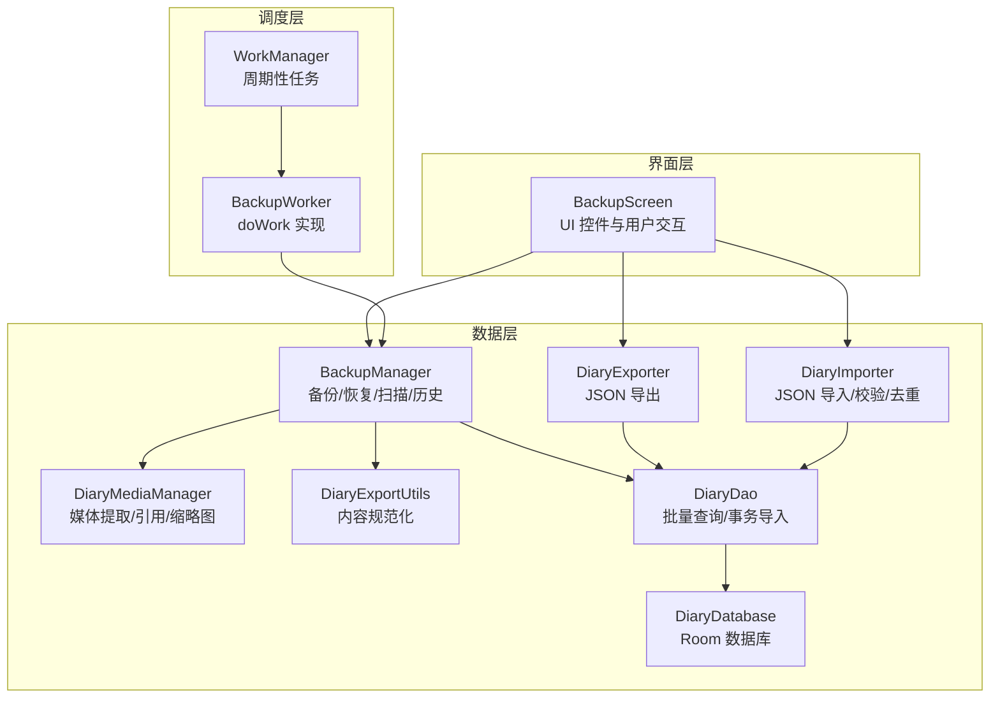
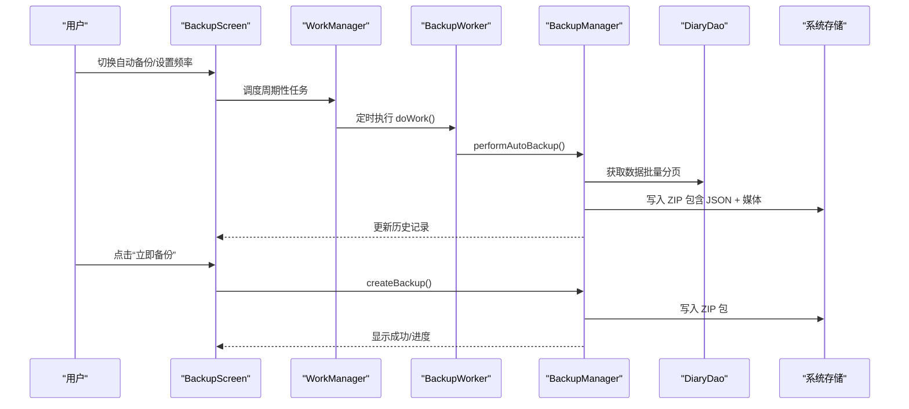
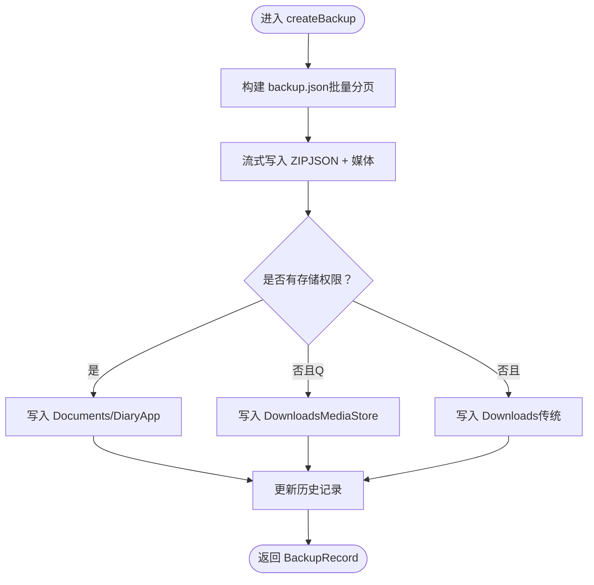
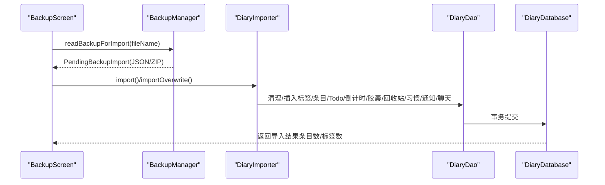
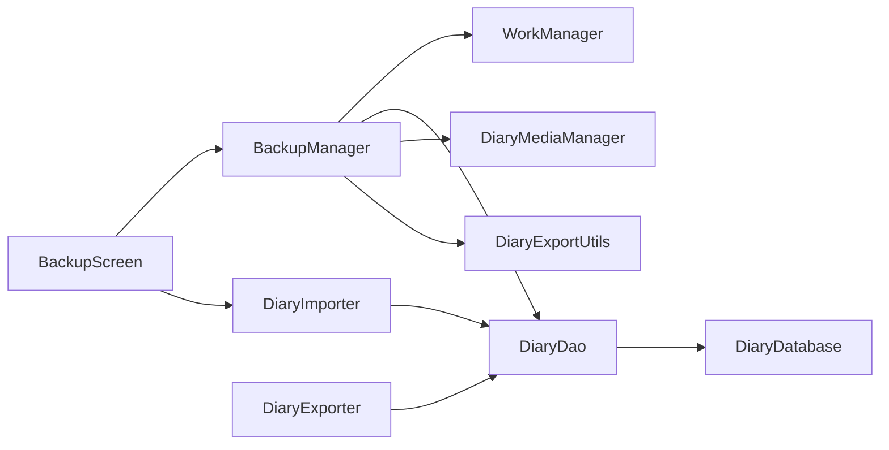

# 备份与恢复

<cite>
**本文引用的文件**
- [BackupManager.kt](file://app/src/main/java/com/diary/app/data/BackupManager.kt)
- [BackupWorker.kt](file://app/src/main/java/com/diary/app/data/BackupWorker.kt)
- [DiaryExporter.kt](file://app/src/main/java/com/diary/app/data/DiaryExporter.kt)
- [DiaryImporter.kt](file://app/src/main/java/com/diary/app/data/DiaryImporter.kt)
- [DiaryExportUtils.kt](file://app/src/main/java/com/diary/app/data/DiaryExportUtils.kt)
- [DiaryMediaManager.kt](file://app/src/main/java/com/diary/app/data/DiaryMediaManager.kt)
- [DiaryDatabase.kt](file://app/src/main/java/com/diary/app/data/DiaryDatabase.kt)
- [DiaryDao.kt](file://app/src/main/java/com/diary/app/data/DiaryDao.kt)
- [BackupScreen.kt](file://app/src/main/java/com/diary/app/ui/backup/BackupScreen.kt)
</cite>

## 目录
1. [简介](#简介)
2. [项目结构](#项目结构)
3. [核心组件](#核心组件)
4. [架构总览](#架构总览)
5. [详细组件分析](#详细组件分析)
6. [依赖关系分析](#依赖关系分析)
7. [性能考量](#性能考量)
8. [故障排查指南](#故障排查指南)
9. [结论](#结论)
10. [附录](#附录)

## 简介
本文件系统化梳理“备份与恢复”模块的设计与实现，覆盖备份策略、数据导出格式、压缩与加密机制、调度逻辑、增量/全量备份、自动与手动触发、备份文件管理、导入流程、格式兼容与冲突处理、存储位置与云同步思路、跨设备恢复方案、完整性校验与安全加固、以及性能优化策略。目标是帮助开发者与产品人员快速理解并高效维护该模块。

## 项目结构
备份与恢复功能由三层协作构成：
- 数据层：负责数据库导出、导入、媒体文件处理与持久化。
- 调度层：基于 WorkManager 的周期性自动备份任务。
- 界面层：提供备份设置、手动备份、导入选择、历史管理等交互。

图表来源
- [BackupScreen.kt](file://app/src/main/java/com/diary/app/ui/backup/BackupScreen.kt)
- [BackupWorker.kt](file://app/src/main/java/com/diary/app/data/BackupWorker.kt)
- [BackupManager.kt](file://app/src/main/java/com/diary/app/data/BackupManager.kt)
- [DiaryExporter.kt](file://app/src/main/java/com/diary/app/data/DiaryExporter.kt)
- [DiaryImporter.kt](file://app/src/main/java/com/diary/app/data/DiaryImporter.kt)
- [DiaryMediaManager.kt](file://app/src/main/java/com/diary/app/data/DiaryMediaManager.kt)
- [DiaryDao.kt](file://app/src/main/java/com/diary/app/data/DiaryDao.kt)
- [DiaryDatabase.kt](file://app/src/main/java/com/diary/app/data/DiaryDatabase.kt)

章节来源
- [BackupScreen.kt](file://app/src/main/java/com/diary/app/ui/backup/BackupScreen.kt)
- [BackupWorker.kt](file://app/src/main/java/com/diary/app/data/BackupWorker.kt)
- [BackupManager.kt](file://app/src/main/java/com/diary/app/data/BackupManager.kt)

## 核心组件
- BackupManager：统一的备份入口，负责自动备份开关、频率、历史记录、备份目录、扫描导入文件、打包/解包、重命名/删除备份、下载/上传（通过系统存储）。
- BackupWorker：周期性工作项，按频率触发自动备份。
- DiaryExporter：独立的 JSON 导出器，支持 Markdown/HTML/图片导出，便于离线分享与审计。
- DiaryImporter：备份导入器，负责 JSON 解析、格式校验、去重、事务导入、外键映射与关联数据恢复。
- DiaryMediaManager：媒体资源管理，生成稳定媒体引用、提取媒体名、生成缩略图、计算采样尺寸。
- DiaryDao：批量查询、一次性导出、事务导入、清理全量数据等。
- DiaryDatabase：Room 数据库定义与迁移链。
- BackupScreen：UI 层控制自动备份开关、频率、手动备份、导入选择、历史管理、重命名/删除。

章节来源
- [BackupManager.kt](file://app/src/main/java/com/diary/app/data/BackupManager.kt)
- [BackupWorker.kt](file://app/src/main/java/com/diary/app/data/BackupWorker.kt)
- [DiaryExporter.kt](file://app/src/main/java/com/diary/app/data/DiaryExporter.kt)
- [DiaryImporter.kt](file://app/src/main/java/com/diary/app/data/DiaryImporter.kt)
- [DiaryMediaManager.kt](file://app/src/main/java/com/diary/app/data/DiaryMediaManager.kt)
- [DiaryDao.kt](file://app/src/main/java/com/diary/app/data/DiaryDao.kt)
- [DiaryDatabase.kt](file://app/src/main/java/com/diary/app/data/DiaryDatabase.kt)
- [BackupScreen.kt](file://app/src/main/java/com/diary/app/ui/backup/BackupScreen.kt)

## 架构总览
备份与恢复采用“分层职责 + 事务一致性”的设计：
- 自动备份：UI 设置频率与开关 → WorkManager 定时触发 → BackupWorker → BackupManager 创建全量备份包 → 写入系统存储或 Documents/DiaryApp。
- 手动备份：UI 触发 → BackupManager 创建全量备份包 → 写入系统存储或 Downloads。
- 导入流程：UI 选择文件 → BackupManager 读取并解析 → DiaryImporter 校验与去重 → Room 事务导入。
- 历史与管理：BackupManager 维护历史记录、扫描可导入文件、重命名/删除备份。

图表来源
- [BackupScreen.kt](file://app/src/main/java/com/diary/app/ui/backup/BackupScreen.kt)
- [BackupWorker.kt](file://app/src/main/java/com/diary/app/data/BackupWorker.kt)
- [BackupManager.kt](file://app/src/main/java/com/diary/app/data/BackupManager.kt)
- [DiaryDao.kt](file://app/src/main/java/com/diary/app/data/DiaryDao.kt)

## 详细组件分析

### BackupManager：备份策略与调度
- 自动备份开关与频率
  - 支持每日/每3/5天/每周/每两周/每月/关闭；根据上次备份时间与频率间隔判断是否触发。
  - 频率变更会替换 WorkManager 的唯一周期任务。
- 备份目录与存储位置
  - 默认 Documents/DiaryApp；Android Q 及以上通过 MediaStore 下载接口写入；否则写入 Downloads。
  - 提供扫描可导入文件（Documents/DiaryApp 与 Downloads），兼容旧版文件名前缀与扩展名。
- 备份包构建
  - 全量备份包为 ZIP，包含 backup.json 与媒体文件（显示图与缩略图）。
  - 使用临时文件流式写入，避免大媒体导致内存溢出。
- 历史记录与管理
  - 记录文件名、路径、时间戳、条目数、大小；支持重命名（规范化文件名）、删除（同时清理历史与文件）。
- 导入读取
  - 优先从外部备份目录读取；回退到内部备份目录或 Downloads；ZIP 包内 JSON 与普通 JSON 均可读取。
- 权限与兼容
  - Android R 检查外部存储管理权限；Q 通过 MediaStore API；低于 Q 使用传统目录。

图表来源
- [BackupManager.kt](file://app/src/main/java/com/diary/app/data/BackupManager.kt)

章节来源
- [BackupManager.kt](file://app/src/main/java/com/diary/app/data/BackupManager.kt)

### BackupWorker：自动备份调度
- doWork 中判断是否应自动备份，获取数据库与 DAO，调用 BackupManager.performAutoBackup。
- 失败时返回 retry，确保网络/存储异常后重试。

章节来源
- [BackupWorker.kt](file://app/src/main/java/com/diary/app/data/BackupWorker.kt)

### DiaryExporter：数据导出格式与兼容
- 导出格式
  - JSON：包含 app、version、exportDate、entries、tags 等字段；支持 PrettyPrint。
  - Markdown/HTML/图片：单条日记导出，便于分享与归档。
- 批量导出
  - 使用固定批次大小分页查询，避免 CursorWindow 溢出。
- 内容规范化
  - DiaryExportUtils 对超长内联媒体进行清洗，防止导出体积过大。

章节来源
- [DiaryExporter.kt](file://app/src/main/java/com/diary/app/data/DiaryExporter.kt)
- [DiaryExportUtils.kt](file://app/src/main/java/com/diary/app/data/DiaryExportUtils.kt)

### DiaryImporter：导入流程与冲突处理
- 格式校验
  - JSON 解析失败抛出“格式无效”错误；空备份抛出“无可导入数据”。
- 冲突与去重
  - 基于 DiaryEntry 关键字段构建去重键集合，过滤重复条目。
  - 标签去重：按标准化名称去重，保留预设优先策略。
- 事务导入
  - 使用 Room 事务一次性导入，保证一致性；支持覆盖导入（清空全量数据后再导入）。
- 外键与映射
  - 待导入数据与现有数据建立 ID 映射（如 Todo、Capsule、通知 relatedId），保持引用稳定。
- 关联数据
  - 同步导入 Todo、倒计时、胶囊、回收站、习惯记录、通知、聊天对话与消息。

图表来源
- [BackupScreen.kt](file://app/src/main/java/com/diary/app/ui/backup/BackupScreen.kt)
- [BackupManager.kt](file://app/src/main/java/com/diary/app/data/BackupManager.kt)
- [DiaryImporter.kt](file://app/src/main/java/com/diary/app/data/DiaryImporter.kt)
- [DiaryDao.kt](file://app/src/main/java/com/diary/app/data/DiaryDao.kt)

章节来源
- [DiaryImporter.kt](file://app/src/main/java/com/diary/app/data/DiaryImporter.kt)
- [DiaryDao.kt](file://app/src/main/java/com/diary/app/data/DiaryDao.kt)

### DiaryMediaManager：媒体引用与压缩
- 媒体引用
  - 生成稳定媒体引用（diary-media://...），支持 WebView 转换与内容替换。
- 媒体提取
  - 从内容中提取媒体名，用于全量备份时打包对应媒体文件。
- 图像处理
  - 按最大边长缩放、生成缩略图、JPEG 压缩质量可控，降低备份体积。

章节来源
- [DiaryMediaManager.kt](file://app/src/main/java/com/diary/app/data/DiaryMediaManager.kt)

### DiaryDao：批量导出与事务导入
- 批量导出
  - 提供分页查询接口，避免一次性加载过多数据导致 OOM。
- 一次性导出
  - 一次性导出接口用于导入器与导出器。
- 事务导入
  - 支持清空全量数据后导入（覆盖模式）与增量导入（去重模式）。

章节来源
- [DiaryDao.kt](file://app/src/main/java/com/diary/app/data/DiaryDao.kt)

### DiaryDatabase：版本与迁移
- 版本号与迁移链
  - 当前版本 32，包含多版本迁移脚本，涵盖新增表、索引、列、种子数据等。
- 开启回调
  - 数据库打开时执行回填与索引修复，失败时自动备份数据库文件以便诊断。

章节来源
- [DiaryDatabase.kt](file://app/src/main/java/com/diary/app/data/DiaryDatabase.kt)

### BackupScreen：用户交互与流程控制
- 自动备份
  - 开关与频率设置，触发 WorkManager 调度；首次开启可立即执行一次备份。
- 手动备份
  - 点击“立即备份”，展示进度条，完成后刷新历史与可导入文件列表。
- 导入
  - 扫描可导入文件，读取备份并弹窗确认导入；支持覆盖导入。
- 历史管理
  - 支持重命名（规范化文件名）、删除（同时清理历史与文件）。

章节来源
- [BackupScreen.kt](file://app/src/main/java/com/diary/app/ui/backup/BackupScreen.kt)

## 依赖关系分析
- 组件耦合
  - BackupManager 依赖 WorkManager、SharedPreferences、系统存储 API、Room DAO。
  - DiaryImporter 依赖 Gson、Room DAO、外键映射工具。
  - BackupScreen 依赖 BackupManager、DiaryImporter、UI 工具。
- 外部依赖
  - WorkManager：周期性任务调度。
  - Room：事务一致性与迁移。
  - MediaStore：Android Q+ 文件写入。
  - Gson：JSON 序列化与反序列化。

图表来源
- [BackupScreen.kt](file://app/src/main/java/com/diary/app/ui/backup/BackupScreen.kt)
- [BackupManager.kt](file://app/src/main/java/com/diary/app/data/BackupManager.kt)
- [DiaryImporter.kt](file://app/src/main/java/com/diary/app/data/DiaryImporter.kt)
- [DiaryMediaManager.kt](file://app/src/main/java/com/diary/app/data/DiaryMediaManager.kt)
- [DiaryExportUtils.kt](file://app/src/main/java/com/diary/app/data/DiaryExportUtils.kt)
- [DiaryDao.kt](file://app/src/main/java/com/diary/app/data/DiaryDao.kt)
- [DiaryDatabase.kt](file://app/src/main/java/com/diary/app/data/DiaryDatabase.kt)

## 性能考量
- 流式写入与分页查询
  - 备份包构建与导出均采用分页与流式写入，避免 OOM。
- 媒体压缩与缩略图
  - 按最大边长缩放与 JPEG 压缩，显著降低备份体积。
- 批量导入事务
  - 单次事务导入，减少磁盘写入次数，提升导入效率。
- 历史记录与扫描
  - 历史记录仅记录元信息，扫描导入文件时去重合并，避免重复展示。

## 故障排查指南
- 自动备份未触发
  - 检查自动备份开关与频率；查看 WorkManager 是否存在唯一周期任务；确认 shouldAutoBackup 判断逻辑。
- 备份文件无法写入
  - Android R 需要外部存储管理权限；Q 使用 MediaStore 写入；低于 Q 使用 Downloads。
- 导入失败
  - 检查 JSON 格式是否有效；确认备份包含可导入数据；覆盖导入会清空现有数据，谨慎使用。
- 媒体缺失
  - 确认备份包包含媒体文件；检查媒体名提取与引用转换逻辑。
- 数据库迁移失败
  - 查看迁移链与回调日志；确认是否触发了数据库备份；定位具体迁移步骤。

章节来源
- [BackupWorker.kt](file://app/src/main/java/com/diary/app/data/BackupWorker.kt)
- [BackupManager.kt](file://app/src/main/java/com/diary/app/data/BackupManager.kt)
- [DiaryImporter.kt](file://app/src/main/java/com/diary/app/data/DiaryImporter.kt)
- [DiaryDatabase.kt](file://app/src/main/java/com/diary/app/data/DiaryDatabase.kt)

## 结论
该备份与恢复模块以“可配置自动备份 + 全量备份包 + 事务导入 + 去重与映射”为核心，结合流式写入、媒体压缩与稳定的媒体引用，兼顾性能与可靠性。UI 层提供直观的开关、频率、手动备份与导入管理。建议后续增强点包括：云同步集成（如 Google Drive/OneDrive SDK）、增量备份（基于时间戳/哈希）与端到端加密（AES + RSA）以进一步提升安全性与跨设备体验。

## 附录

### 备份策略与格式说明
- 备份类型
  - 全量备份：包含 JSON 与媒体文件的 ZIP 包，默认扩展名为 .diarybackup。
  - 导出：独立 JSON/Markdown/HTML/图片导出，便于审计与分享。
- 数据范围
  - 日记条目、标签、待办、倒计时、胶囊、回收站、习惯记录、通知、聊天对话与消息。
- 压缩与加密
  - 默认使用 ZIP 压缩；未内置加密。建议在云同步前增加端到端加密（AES）并在传输层启用 HTTPS。

章节来源
- [BackupManager.kt](file://app/src/main/java/com/diary/app/data/BackupManager.kt)
- [DiaryExporter.kt](file://app/src/main/java/com/diary/app/data/DiaryExporter.kt)

### 自动备份触发条件与手动备份操作
- 自动触发条件
  - 开关开启、频率未禁用、距离上次备份已超过设定间隔。
- 手动触发
  - UI 点击“立即备份”，展示进度，完成后刷新历史与可导入文件列表。

章节来源
- [BackupScreen.kt](file://app/src/main/java/com/diary/app/ui/backup/BackupScreen.kt)
- [BackupWorker.kt](file://app/src/main/java/com/diary/app/data/BackupWorker.kt)
- [BackupManager.kt](file://app/src/main/java/com/diary/app/data/BackupManager.kt)

### 备份文件管理
- 存储位置
  - 优先 Documents/DiaryApp；Android Q+ 通过 MediaStore 写入；低于 Q 写入 Downloads。
- 扫描与导入
  - 支持扫描 Documents/DiaryApp 与 Downloads；兼容多种前缀与扩展名。
- 历史记录
  - 记录文件名、路径、时间戳、条目数、大小；支持重命名与删除。

章节来源
- [BackupManager.kt](file://app/src/main/java/com/diary/app/data/BackupManager.kt)

### 数据导入流程与兼容性
- 兼容性检查
  - JSON 解析与字段存在性校验；空备份抛错。
- 冲突解决
  - 条目去重（关键字段集合）；标签去重（标准化名称）；外键映射（ID 映射）。
- 事务与一致性
  - 导入在单次事务中完成，失败回滚。

章节来源
- [DiaryImporter.kt](file://app/src/main/java/com/diary/app/data/DiaryImporter.kt)

### 云同步与跨设备恢复
- 云同步集成建议
  - 使用 Google Drive/OneDrive SDK 进行文件上传/下载；在上传前对备份包进行 AES 加密；下载后解密再导入。
- 跨设备恢复
  - 通过云端下载 .diarybackup 或 JSON 文件，使用导入流程恢复；注意媒体文件引用需指向云端资源或随包恢复。

[本节为概念性建议，无需图表来源]

### 完整性校验与安全加固
- 完整性
  - ZIP 包内 JSON 与媒体文件一一对应；导入后可通过条目数与标签数核对。
- 安全
  - 建议引入端到端加密（AES 对称加密 + RSA 非对称封装密钥）；对敏感字段（如通知 relatedId）做脱敏处理。
- 性能
  - 压缩比与媒体质量参数可配置；在保证可用性的前提下尽量降低体积。

[本节为通用指导，无需图表来源]