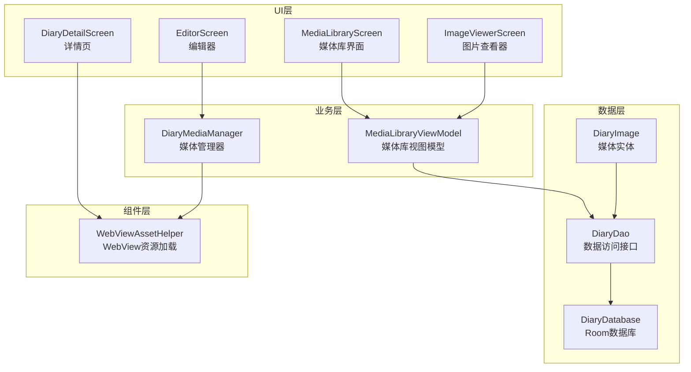
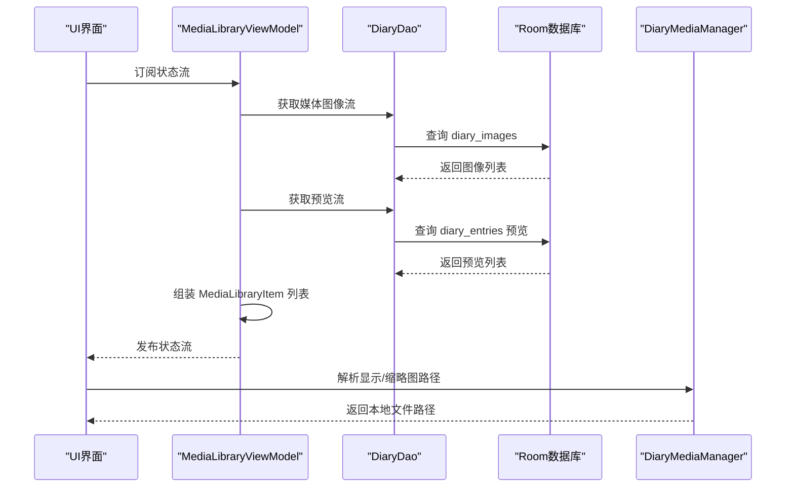
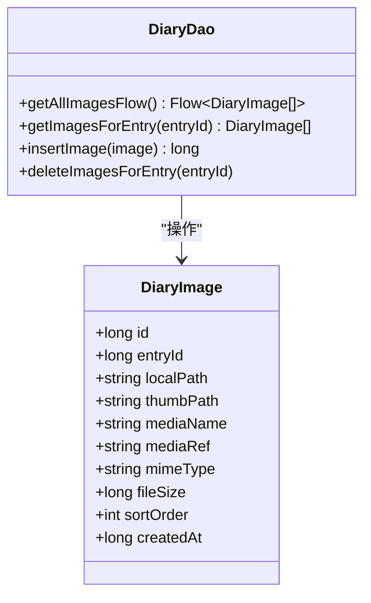
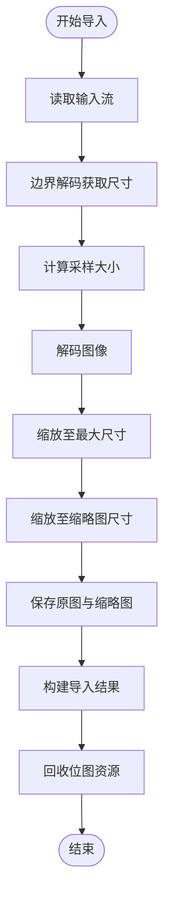
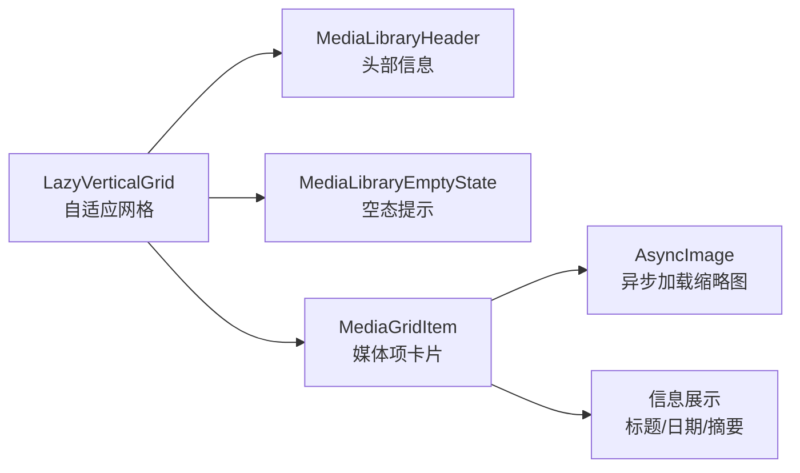
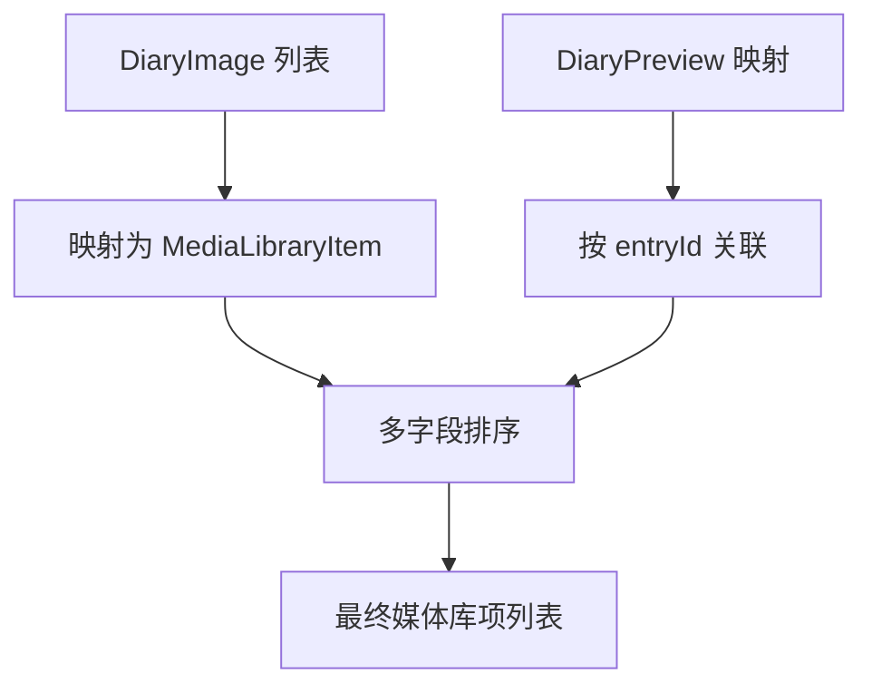
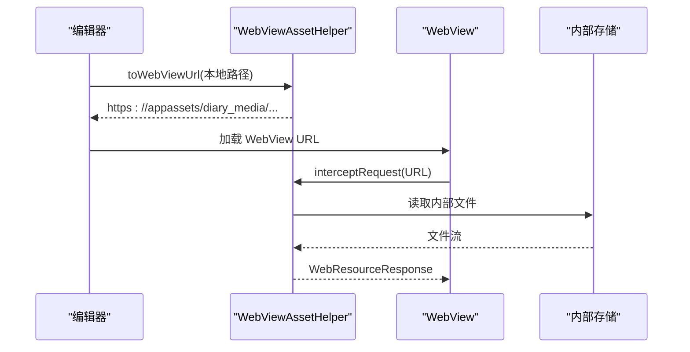
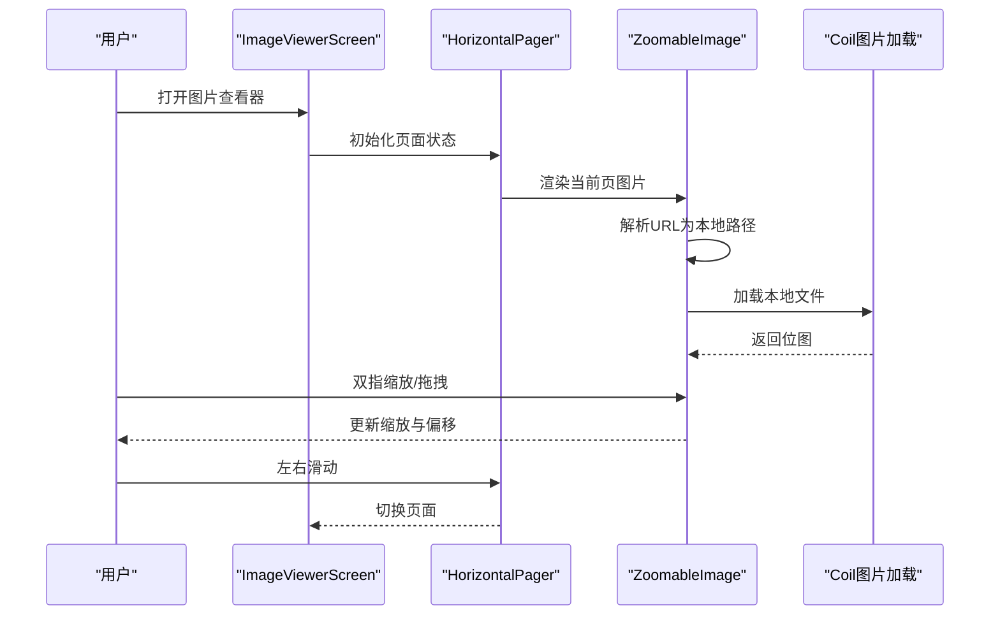
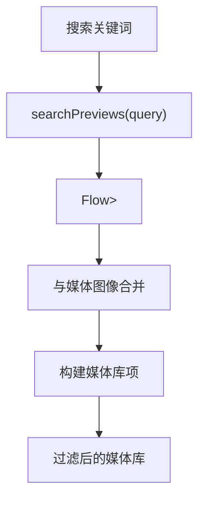
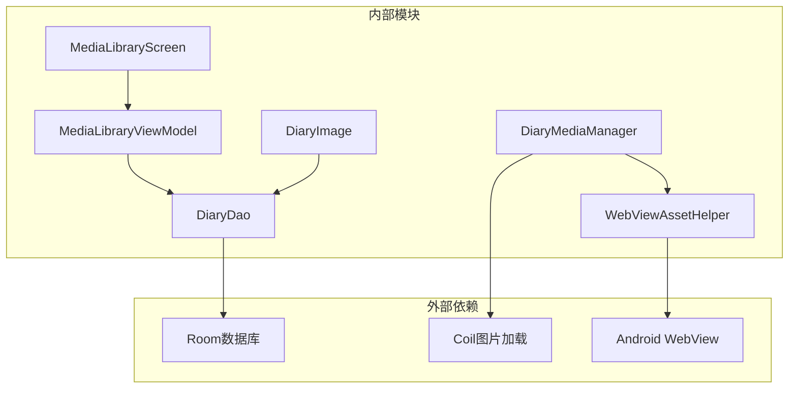

# 媒体库

<cite>
**本文档引用的文件**
- [DiaryImage.kt](file://app/src/main/java/com/diary/app/data/DiaryImage.kt)
- [DiaryMediaManager.kt](file://app/src/main/java/com/diary/app/data/DiaryMediaManager.kt)
- [MediaLibraryScreen.kt](file://app/src/main/java/com/diary/app/ui/media/MediaLibraryScreen.kt)
- [MediaLibraryViewModel.kt](file://app/src/main/java/com/diary/app/ui/media/MediaLibraryViewModel.kt)
- [MediaLibraryModels.kt](file://app/src/main/java/com/diary/app/ui/media/MediaLibraryModels.kt)
- [DiaryDao.kt](file://app/src/main/java/com/diary/app/data/DiaryDao.kt)
- [WebViewAssetHelper.kt](file://app/src/main/java/com/diary/app/ui/components/WebViewAssetHelper.kt)
- [ImageViewerScreen.kt](file://app/src/main/java/com/diary/app/ui/detail/ImageViewerScreen.kt)
- [DiaryDetailScreen.kt](file://app/src/main/java/com/diary/app/ui/detail/DiaryDetailScreen.kt)
- [EditorScreen.kt](file://app/src/main/java/com/diary/app/ui/editor/EditorScreen.kt)
- [tmp_editor_head.kt](file://tmp_editor_head.kt)
- [MediaLibraryMapperTest.kt](file://app/src/test/java/com/diary/app/ui/media/MediaLibraryMapperTest.kt)
- [DiaryDatabase.kt](file://app/src/main/java/com/diary/app/data/DiaryDatabase.kt)
- [StorageViewModel.kt](file://app/src/main/java/com/diary/app/ui/storage/StorageViewModel.kt)
</cite>

## 目录
1. [简介](#简介)
2. [项目结构](#项目结构)
3. [核心组件](#核心组件)
4. [架构概览](#架构概览)
5. [详细组件分析](#详细组件分析)
6. [依赖关系分析](#依赖关系分析)
7. [性能考虑](#性能考虑)
8. [故障排除指南](#故障排除指南)
9. [结论](#结论)
10. [附录](#附录)

## 简介
本文件全面阐述日记应用中的媒体库模块，包括媒体文件的存储管理、元数据提取、缩略图生成机制；深入解析 DiaryImage 的数据模型、文件类型识别与质量控制策略；详细介绍媒体库的浏览模式（网格布局）、搜索过滤功能；以及图片查看器、视频播放、音频播放的集成实现。同时提供媒体文件的上传下载、缓存策略、离线访问方案，并解释大文件处理、内存优化、性能监控的最佳实践。

## 项目结构
媒体库模块位于应用的 UI 层与数据层之间，采用分层架构设计：
- UI 层：媒体库界面、图片查看器、编辑器集成
- 业务层：媒体库视图模型、媒体管理器
- 数据层：Room 数据库、DAO 接口、实体模型
- 组件层：WebView 资源加载辅助工具

**图表来源**
- [MediaLibraryScreen.kt:1-324](file://app/src/main/java/com/diary/app/ui/media/MediaLibraryScreen.kt#L1-L324)
- [MediaLibraryViewModel.kt:1-45](file://app/src/main/java/com/diary/app/ui/media/MediaLibraryViewModel.kt#L1-L45)
- [DiaryMediaManager.kt:1-190](file://app/src/main/java/com/diary/app/data/DiaryMediaManager.kt#L1-L190)
- [DiaryDao.kt:1-665](file://app/src/main/java/com/diary/app/data/DiaryDao.kt#L1-L665)
- [WebViewAssetHelper.kt:1-69](file://app/src/main/java/com/diary/app/ui/components/WebViewAssetHelper.kt#L1-L69)

**章节来源**
- [MediaLibraryScreen.kt:1-324](file://app/src/main/java/com/diary/app/ui/media/MediaLibraryScreen.kt#L1-L324)
- [MediaLibraryViewModel.kt:1-45](file://app/src/main/java/com/diary/app/ui/media/MediaLibraryViewModel.kt#L1-L45)
- [DiaryMediaManager.kt:1-190](file://app/src/main/java/com/diary/app/data/DiaryMediaManager.kt#L1-L190)
- [DiaryDao.kt:1-665](file://app/src/main/java/com/diary/app/data/DiaryDao.kt#L1-L665)
- [WebViewAssetHelper.kt:1-69](file://app/src/main/java/com/diary/app/ui/components/WebViewAssetHelper.kt#L1-L69)

## 核心组件
媒体库模块由以下核心组件构成：

### 数据模型
- **DiaryImage 实体**：定义媒体文件在数据库中的存储结构，包含主键、日记条目关联、本地路径、缩略图路径、媒体名称、引用标识、MIME 类型、文件大小、排序字段等关键属性。
- **ImportedDiaryMedia 结构**：导入媒体时产生的临时结构，用于封装显示文件、缩略图文件、引用标识、WebView URL、MIME 类型、尺寸信息及文件大小。

### 媒体管理器
- **DiaryMediaManager**：负责媒体文件的导入、存储、缩略图生成、URL 转换与内容解析。支持 JPEG 图片压缩、采样缩放、哈希种子生成、媒体引用解析等功能。

### 视图模型与界面
- **MediaLibraryViewModel**：聚合数据库中的媒体图像与预览信息，构建媒体库项列表，提供状态流供界面订阅。
- **MediaLibraryScreen**：基于自适应网格布局展示媒体库，支持空态提示、长按弹出票根卡片、动画过渡等交互。

### WebView 资源加载
- **WebViewAssetHelper**：将内部存储的媒体文件映射为 WebView 可访问的 https://appassets/ URL，解决跨目录 file:// 访问限制问题。

**章节来源**
- [DiaryImage.kt:1-32](file://app/src/main/java/com/diary/app/data/DiaryImage.kt#L1-L32)
- [DiaryMediaManager.kt:15-25](file://app/src/main/java/com/diary/app/data/DiaryMediaManager.kt#L15-L25)
- [MediaLibraryViewModel.kt:14-44](file://app/src/main/java/com/diary/app/ui/media/MediaLibraryViewModel.kt#L14-L44)
- [MediaLibraryScreen.kt:71-146](file://app/src/main/java/com/diary/app/ui/media/MediaLibraryScreen.kt#L71-L146)
- [WebViewAssetHelper.kt:15-68](file://app/src/main/java/com/diary/app/ui/components/WebViewAssetHelper.kt#L15-L68)

## 架构概览
媒体库模块遵循 MVVM 架构，通过 Room 数据库进行持久化，使用协程 Flow 实现响应式数据流，配合 Compose UI 提供流畅的用户体验。

**图表来源**
- [MediaLibraryViewModel.kt:23-43](file://app/src/main/java/com/diary/app/ui/media/MediaLibraryViewModel.kt#L23-L43)
- [DiaryDao.kt:438-439](file://app/src/main/java/com/diary/app/data/DiaryDao.kt#L438-L439)
- [DiaryMediaManager.kt:31-37](file://app/src/main/java/com/diary/app/data/DiaryMediaManager.kt#L31-L37)

**章节来源**
- [MediaLibraryViewModel.kt:19-44](file://app/src/main/java/com/diary/app/ui/media/MediaLibraryViewModel.kt#L19-L44)
- [DiaryDao.kt:422-439](file://app/src/main/java/com/diary/app/data/DiaryDao.kt#L422-L439)
- [DiaryMediaManager.kt:31-37](file://app/src/main/java/com/diary/app/data/DiaryMediaManager.kt#L31-L37)

## 详细组件分析

### DiaryImage 数据模型
DiaryImage 是媒体文件在数据库中的核心实体，具备以下特性：
- 主键自增 ID，确保唯一性
- 外键关联日记条目，删除时级联清理
- 支持本地路径与缩略图路径分离存储
- 包含媒体名称、引用标识、MIME 类型、文件大小、排序字段、创建时间戳

**图表来源**
- [DiaryImage.kt:20-31](file://app/src/main/java/com/diary/app/data/DiaryImage.kt#L20-L31)
- [DiaryDao.kt:422-439](file://app/src/main/java/com/diary/app/data/DiaryDao.kt#L422-L439)

**章节来源**
- [DiaryImage.kt:1-32](file://app/src/main/java/com/diary/app/data/DiaryImage.kt#L1-L32)
- [DiaryDao.kt:422-439](file://app/src/main/java/com/diary/app/data/DiaryDao.kt#L422-L439)

### 媒体导入与缩略图生成
DiaryMediaManager 提供完整的媒体导入流程，包括：
- 输入流读取与缓存，避免多次打开 URI 导致的异常
- 使用 BitmapFactory 边界检测确定原始尺寸
- 采样缩放算法控制最大边长，减少内存占用
- 缩略图与原图分别保存至独立目录
- 生成稳定的媒体名称与哈希种子
- MIME 类型识别与质量控制参数设置

**图表来源**
- [DiaryMediaManager.kt:110-158](file://app/src/main/java/com/diary/app/data/DiaryMediaManager.kt#L110-L158)
- [DiaryMediaManager.kt:160-182](file://app/src/main/java/com/diary/app/data/DiaryMediaManager.kt#L160-L182)

**章节来源**
- [DiaryMediaManager.kt:93-158](file://app/src/main/java/com/diary/app/data/DiaryMediaManager.kt#L93-L158)
- [DiaryMediaManager.kt:160-182](file://app/src/main/java/com/diary/app/data/DiaryMediaManager.kt#L160-L182)

### 媒体库浏览与网格布局
MediaLibraryScreen 实现了响应式的网格布局，支持：
- 自适应列数的网格容器
- 动画入场效果与延迟排列
- 空态提示与占位符
- 长按触发票根卡片展示
- 日期格式化与文本截断

**图表来源**
- [MediaLibraryScreen.kt:81-128](file://app/src/main/java/com/diary/app/ui/media/MediaLibraryScreen.kt#L81-L128)
- [MediaLibraryScreen.kt:200-285](file://app/src/main/java/com/diary/app/ui/media/MediaLibraryScreen.kt#L200-L285)

**章节来源**
- [MediaLibraryScreen.kt:71-146](file://app/src/main/java/com/diary/app/ui/media/MediaLibraryScreen.kt#L71-L146)
- [MediaLibraryScreen.kt:200-285](file://app/src/main/java/com/diary/app/ui/media/MediaLibraryScreen.kt#L200-L285)

### 媒体库数据映射与排序
MediaLibraryModels 定义了媒体库项的数据结构，并提供映射函数：
- 通过预览 ID 关联日记条目信息
- 合并媒体图像与预览数据
- 按日记创建时间降序、排序字段升序、媒体名称升序排序
- 支持动态解析显示路径与缩略图路径

**图表来源**
- [MediaLibraryModels.kt:20-49](file://app/src/main/java/com/diary/app/ui/media/MediaLibraryModels.kt#L20-L49)

**章节来源**
- [MediaLibraryModels.kt:6-49](file://app/src/main/java/com/diary/app/ui/media/MediaLibraryModels.kt#L6-L49)
- [MediaLibraryMapperTest.kt:10-29](file://app/src/test/java/com/diary/app/ui/media/MediaLibraryMapperTest.kt#L10-L29)

### WebView 资源加载与跨域访问
WebViewAssetHelper 提供统一的资源加载策略：
- 将内部存储的 diary_media 目录映射为 https://appassets/diary_media/
- 支持 file:// 与 diary-media:// 引用的转换
- 拦截本地资源请求，解决 WebView 跨目录访问限制
- 在编辑器与详情页中统一处理媒体文件 MIME 类型

**图表来源**
- [WebViewAssetHelper.kt:38-67](file://app/src/main/java/com/diary/app/ui/components/WebViewAssetHelper.kt#L38-L67)
- [EditorScreen.kt:1248-1266](file://app/src/main/java/com/diary/app/ui/editor/EditorScreen.kt#L1248-L1266)
- [DiaryDetailScreen.kt:413-440](file://app/src/main/java/com/diary/app/ui/detail/DiaryDetailScreen.kt#L413-L440)

**章节来源**
- [WebViewAssetHelper.kt:15-68](file://app/src/main/java/com/diary/app/ui/components/WebViewAssetHelper.kt#L15-L68)
- [EditorScreen.kt:1248-1266](file://app/src/main/java/com/diary/app/ui/editor/EditorScreen.kt#L1248-L1266)
- [DiaryDetailScreen.kt:413-440](file://app/src/main/java/com/diary/app/ui/detail/DiaryDetailScreen.kt#L413-L440)

### 图片查看器集成
ImageViewerScreen 提供全屏图片浏览体验：
- 支持左右滑动切换多张图片
- 双指缩放与拖拽手势
- 顶部关闭按钮与页码指示器
- 将 https://appassets/ URL 转换为本地文件路径供 Coil 加载

**图表来源**
- [ImageViewerScreen.kt:46-172](file://app/src/main/java/com/diary/app/ui/detail/ImageViewerScreen.kt#L46-L172)
- [ImageViewerScreen.kt:179-232](file://app/src/main/java/com/diary/app/ui/detail/ImageViewerScreen.kt#L179-L232)

**章节来源**
- [ImageViewerScreen.kt:46-172](file://app/src/main/java/com/diary/app/ui/detail/ImageViewerScreen.kt#L46-L172)
- [ImageViewerScreen.kt:179-232](file://app/src/main/java/com/diary/app/ui/detail/ImageViewerScreen.kt#L179-L232)

### 媒体库搜索与过滤
媒体库当前主要通过预览数据的全文检索实现过滤：
- DiaryDao 提供搜索预览的 Flow 查询接口
- 支持标题、正文、标签名称的模糊匹配
- 搜索结果按创建时间倒序排列

**图表来源**
- [DiaryDao.kt:119-126](file://app/src/main/java/com/diary/app/data/DiaryDao.kt#L119-L126)

**章节来源**
- [DiaryDao.kt:119-126](file://app/src/main/java/com/diary/app/data/DiaryDao.kt#L119-L126)

### 媒体文件上传下载与离线访问
- **上传**：编辑器通过系统选择器获取媒体 URI，复制到内部存储的 diary_media 目录，生成 WebView URL 并注入编辑器内容。
- **下载**：WebViewAssetHelper 将内部文件映射为安全 URL，支持跨域访问。
- **离线访问**：所有媒体文件存储在应用内部存储目录，无需网络即可访问。

**章节来源**
- [tmp_editor_head.kt:469-487](file://tmp_editor_head.kt#L469-L487)
- [WebViewAssetHelper.kt:20-34](file://app/src/main/java/com/diary/app/ui/components/WebViewAssetHelper.kt#L20-L34)

## 依赖关系分析
媒体库模块的依赖关系如下：

**图表来源**
- [MediaLibraryViewModel.kt:21-22](file://app/src/main/java/com/diary/app/ui/media/MediaLibraryViewModel.kt#L21-L22)
- [DiaryMediaManager.kt:7-11](file://app/src/main/java/com/diary/app/data/DiaryMediaManager.kt#L7-L11)
- [WebViewAssetHelper.kt:7-8](file://app/src/main/java/com/diary/app/ui/components/WebViewAssetHelper.kt#L7-L8)

**章节来源**
- [MediaLibraryViewModel.kt:19-22](file://app/src/main/java/com/diary/app/ui/media/MediaLibraryViewModel.kt#L19-L22)
- [DiaryMediaManager.kt:3-11](file://app/src/main/java/com/diary/app/data/DiaryMediaManager.kt#L3-L11)
- [WebViewAssetHelper.kt:1-8](file://app/src/main/java/com/diary/app/ui/components/WebViewAssetHelper.kt#L1-L8)

## 性能考虑
- **内存优化**：采用 BitmapFactory 采样解码与 RGB_565 配置降低内存占用；及时回收位图资源；缩略图与原图分离存储。
- **I/O 优化**：输入流一次性读取，避免重复打开 URI；媒体文件直接写入内部存储，减少磁盘碎片。
- **UI 流畅性**：网格布局使用 LazyVerticalGrid，支持自适应列数；动画采用淡入与滑入组合，延迟逐项出现。
- **数据库查询优化**：预览查询使用轻量投影，避免加载大字段导致 OOM；Flow 响应式更新，减少不必要的重绘。
- **WebView 性能**：通过 WebViewAssetLoader 统一资源访问，避免 file:// 跨域问题；MIME 类型准确识别，提升加载效率。

[本节为通用性能指导，无需特定文件分析]

## 故障排除指南
- **媒体无法显示**：检查 WebView URL 是否正确转换，确认文件路径存在且可读。
- **内存溢出**：确认采样解码参数合理，及时回收位图；避免同时加载过多大图。
- **缩略图缺失**：验证缩略图目录创建与权限，确认缩略图生成逻辑执行成功。
- **搜索结果异常**：检查预览数据完整性与索引建立情况，确认搜索关键词匹配规则。

**章节来源**
- [WebViewAssetHelper.kt:56-67](file://app/src/main/java/com/diary/app/ui/components/WebViewAssetHelper.kt#L56-L67)
- [DiaryMediaManager.kt:118-158](file://app/src/main/java/com/diary/app/data/DiaryMediaManager.kt#L118-L158)

## 结论
媒体库模块通过清晰的分层架构与完善的媒体管理机制，实现了高效、稳定的媒体存储与浏览体验。结合 WebView 资源加载与响应式数据流，提供了良好的性能表现与用户体验。未来可在搜索功能、缓存策略与离线能力方面进一步增强，以满足更复杂的媒体管理需求。

[本节为总结性内容，无需特定文件分析]

## 附录
- **数据库版本与迁移**：DiaryDatabase 当前版本为 32，包含媒体相关迁移脚本与回填逻辑。
- **存储统计**：StorageViewModel 提供媒体目录大小统计，区分媒体文件与缩略图目录。

**章节来源**
- [DiaryDatabase.kt:10-14](file://app/src/main/java/com/diary/app/data/DiaryDatabase.kt#L10-L14)
- [DiaryDatabase.kt:773-800](file://app/src/main/java/com/diary/app/data/DiaryDatabase.kt#L773-L800)
- [StorageViewModel.kt:124-128](file://app/src/main/java/com/diary/app/ui/storage/StorageViewModel.kt#L124-L128)