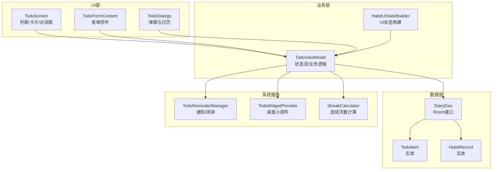
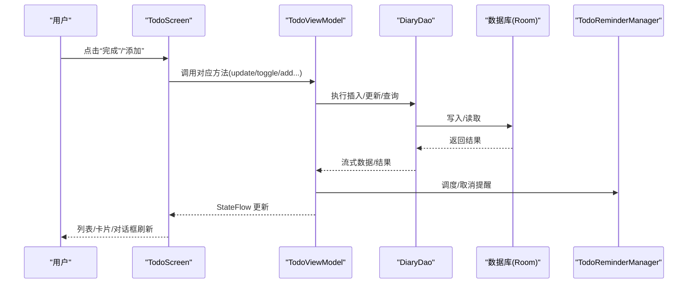
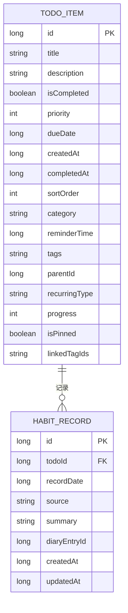
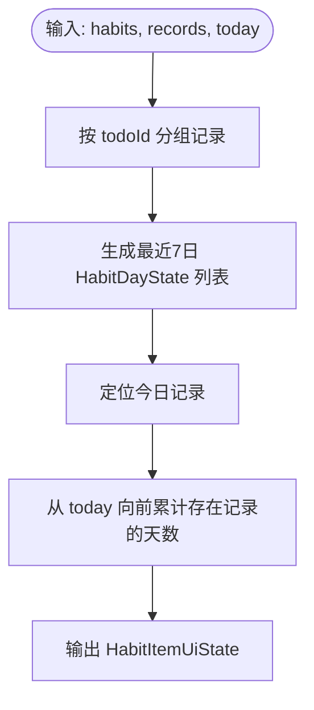
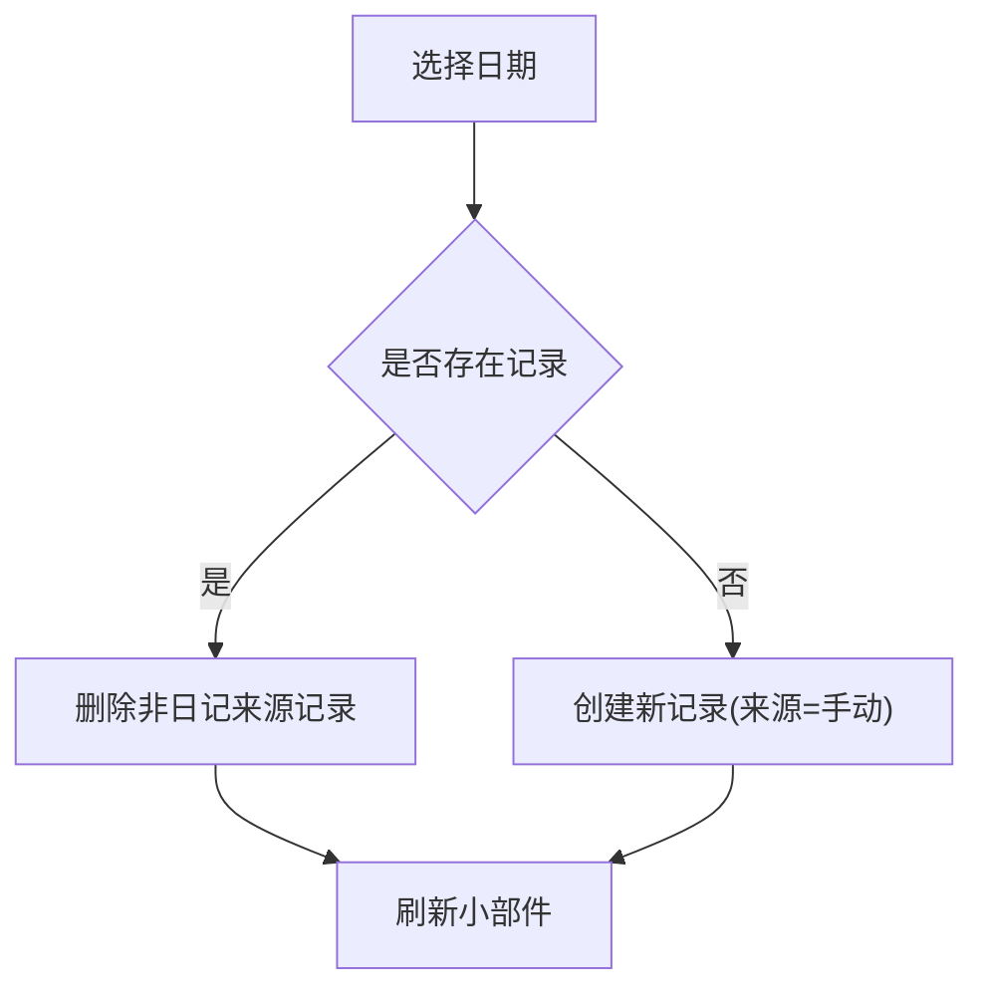
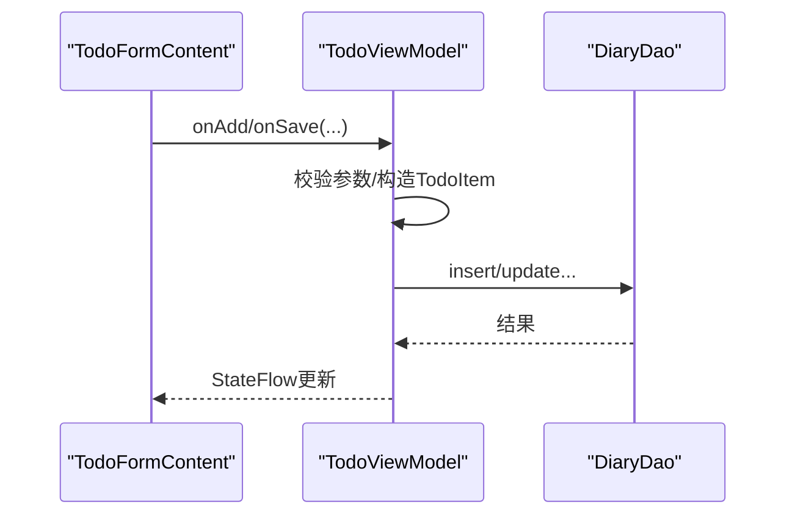
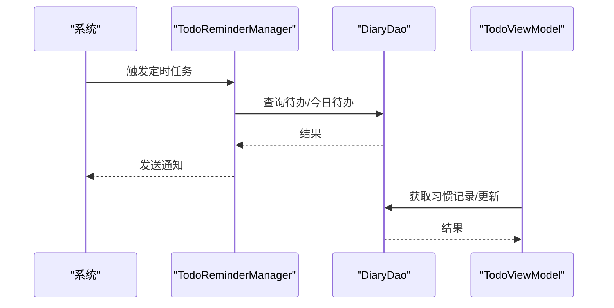
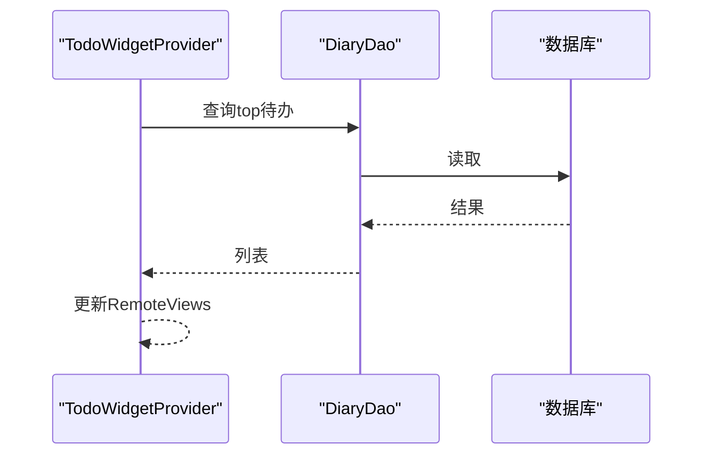
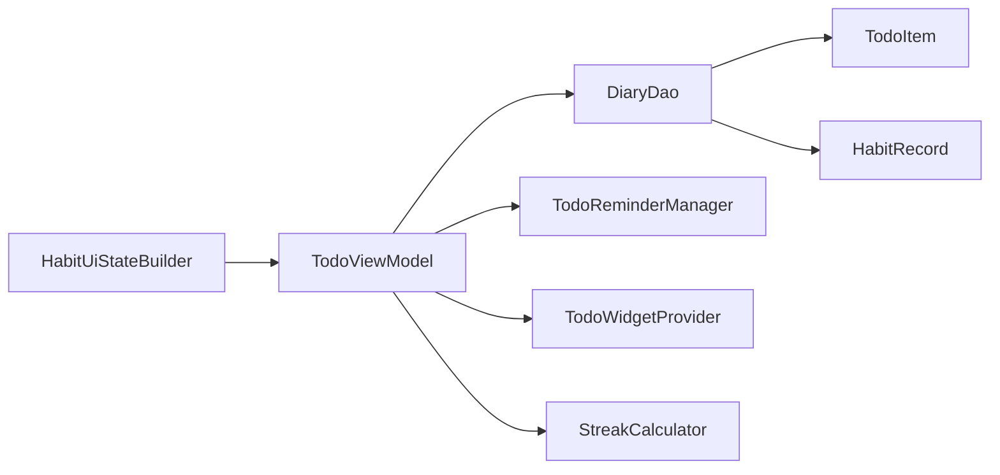

# 待办事项与习惯

<cite>
**本文档引用的文件**
- [TodoItem.kt](file://app/src/main/java/com/diary/app/data/TodoItem.kt)
- [HabitRecord.kt](file://app/src/main/java/com/diary/app/data/HabitRecord.kt)
- [DiaryDao.kt](file://app/src/main/java/com/diary/app/data/DiaryDao.kt)
- [TodoViewModel.kt](file://app/src/main/java/com/diary/app/ui/todo/TodoViewModel.kt)
- [HabitUiStateBuilder.kt](file://app/src/main/java/com/diary/app/ui/todo/HabitUiStateBuilder.kt)
- [TodoScreen.kt](file://app/src/main/java/com/diary/app/ui/todo/TodoScreen.kt)
- [TodoFormContent.kt](file://app/src/main/java/com/diary/app/ui/todo/TodoFormContent.kt)
- [TodoDialogs.kt](file://app/src/main/java/com/diary/app/ui/todo/TodoDialogs.kt)
- [TodoReminderManager.kt](file://app/src/main/java/com/diary/app/reminder/TodoReminderManager.kt)
- [TodoWidgetProvider.kt](file://app/src/main/java/com/diary/app/widget/TodoWidgetProvider.kt)
- [StreakCalculator.kt](file://app/src/main/java/com/diary/app/util/StreakCalculator.kt)
- [HabitUiStateBuilderTest.kt](file://app/src/test/java/com/diary/app/ui/todo/HabitUiStateBuilderTest.kt)
- [TodoScreenStateTest.kt](file://app/src/test/java/com/diary/app/ui/todo/TodoScreenStateTest.kt)
</cite>

## 目录
1. [简介](#简介)
2. [项目结构](#项目结构)
3. [核心组件](#核心组件)
4. [架构总览](#架构总览)
5. [详细组件分析](#详细组件分析)
6. [依赖关系分析](#依赖关系分析)
7. [性能考量](#性能考量)
8. [故障排查指南](#故障排查指南)
9. [结论](#结论)
10. [附录](#附录)

## 简介
本模块聚焦“待办事项与习惯追踪”，覆盖以下能力：
- 待办清单：支持任务、提醒、目标三类；优先级、到期提醒、标签、父子任务、重复周期等。
- 习惯追踪：每日打卡、连续性计算、近7日可视化、自动从日记关联打卡。
- 实时更新：基于 StateFlow 的响应式 UI 状态流。
- 提醒机制：本地通知通道、定时摘要、精确闹钟回退策略。
- 数据绑定：Compose 表单与 ViewModel 双向绑定，对话框驱动交互。
- 批量操作：多选删除、清空完成项。
- 导入导出：备份导入流程中包含习惯记录映射。

## 项目结构
模块位于 app/src/main/java/com/diary/app/ui/todo 与 app/src/main/java/com/diary/app/data 下，配合提醒与桌面小部件：

图表来源
- [TodoScreen.kt](file://app/src/main/java/com/diary/app/ui/todo/TodoScreen.kt)
- [TodoViewModel.kt](file://app/src/main/java/com/diary/app/ui/todo/TodoViewModel.kt)
- [HabitUiStateBuilder.kt](file://app/src/main/java/com/diary/app/ui/todo/HabitUiStateBuilder.kt)
- [DiaryDao.kt](file://app/src/main/java/com/diary/app/data/DiaryDao.kt)
- [TodoItem.kt](file://app/src/main/java/com/diary/app/data/TodoItem.kt)
- [HabitRecord.kt](file://app/src/main/java/com/diary/app/data/HabitRecord.kt)
- [TodoReminderManager.kt](file://app/src/main/java/com/diary/app/reminder/TodoReminderManager.kt)
- [TodoWidgetProvider.kt](file://app/src/main/java/com/diary/app/widget/TodoWidgetProvider.kt)
- [StreakCalculator.kt](file://app/src/main/java/com/diary/app/util/StreakCalculator.kt)

章节来源
- [TodoScreen.kt:101-408](file://app/src/main/java/com/diary/app/ui/todo/TodoScreen.kt#L101-L408)
- [TodoViewModel.kt:108-562](file://app/src/main/java/com/diary/app/ui/todo/TodoViewModel.kt#L108-L562)
- [DiaryDao.kt:12-200](file://app/src/main/java/com/diary/app/data/DiaryDao.kt#L12-L200)

## 核心组件
- 数据模型
  - TodoItem：待办项实体，含标题、描述、优先级、到期时间、是否完成、置顶、父任务、分类、标签、提醒时间、重复类型、进度、关联日记标签等。
  - HabitRecord：习惯记录实体，按日期唯一，记录来源（日记/手动/详情）、摘要、日记条目关联等。
- 视图模型
  - TodoViewModel：聚合查询、过滤、搜索、提醒调度、习惯 UI 状态构建、批量操作、小部件刷新等。
- UI 构建器
  - HabitUiStateBuilder：将原始记录转换为 UI 状态（最近7日、今日记录、连续天数、汇总统计）。
- 提醒与小部件
  - TodoReminderManager：通知通道、精确闹钟、每日摘要、广播接收器。
  - TodoWidgetProvider：桌面小部件更新、点击切换、添加入口、批量刷新。
- 工具
  - StreakCalculator：通用连续天数计算工具。

章节来源
- [TodoItem.kt:18-88](file://app/src/main/java/com/diary/app/data/TodoItem.kt#L18-L88)
- [HabitRecord.kt:15-37](file://app/src/main/java/com/diary/app/data/HabitRecord.kt#L15-L37)
- [TodoViewModel.kt:108-562](file://app/src/main/java/com/diary/app/ui/todo/TodoViewModel.kt#L108-L562)
- [HabitUiStateBuilder.kt:8-59](file://app/src/main/java/com/diary/app/ui/todo/HabitUiStateBuilder.kt#L8-L59)
- [TodoReminderManager.kt:27-365](file://app/src/main/java/com/diary/app/reminder/TodoReminderManager.kt#L27-L365)
- [TodoWidgetProvider.kt:25-175](file://app/src/main/java/com/diary/app/widget/TodoWidgetProvider.kt#L25-L175)
- [StreakCalculator.kt:13-26](file://app/src/main/java/com/diary/app/util/StreakCalculator.kt#L13-L26)

## 架构总览
整体采用 MVVM + Room + Compose：
- UI 使用 Jetpack Compose，通过 ViewModel 暴露的 StateFlow 订阅状态。
- ViewModel 调用 DiaryDao 执行 Room 查询/变更，必要时与 TodoReminderManager、TodoWidgetProvider 协作。
- HabitUiStateBuilder 将原始记录集转换为 UI 友好的结构，便于渲染。

图表来源
- [TodoScreen.kt:146-244](file://app/src/main/java/com/diary/app/ui/todo/TodoScreen.kt#L146-L244)
- [TodoViewModel.kt:225-371](file://app/src/main/java/com/diary/app/ui/todo/TodoViewModel.kt#L225-L371)
- [DiaryDao.kt:12-200](file://app/src/main/java/com/diary/app/data/DiaryDao.kt#L12-L200)
- [TodoReminderManager.kt:59-107](file://app/src/main/java/com/diary/app/reminder/TodoReminderManager.kt#L59-L107)

## 详细组件分析

### 数据模型与索引设计
- TodoItem 字段覆盖任务全生命周期关键信息，索引覆盖 dueDate、isCompleted、category、reminderTime、parentId、tags，有利于高效筛选与排序。
- HabitRecord 以 (todoId, recordDate) 唯一，避免同日重复记录；同时按 recordDate 建索引，支持范围查询。

图表来源
- [TodoItem.kt:18-88](file://app/src/main/java/com/diary/app/data/TodoItem.kt#L18-L88)
- [HabitRecord.kt:15-37](file://app/src/main/java/com/diary/app/data/HabitRecord.kt#L15-L37)

章节来源
- [TodoItem.kt:7-17](file://app/src/main/java/com/diary/app/data/TodoItem.kt#L7-L17)
- [HabitRecord.kt:7-14](file://app/src/main/java/com/diary/app/data/HabitRecord.kt#L7-L14)

### 状态管理与UI状态构建器
- TodoViewModel 维护多个 StateFlow：搜索、分类/标签过滤、今日待办、标签列表、习惯对话框状态、习惯 UI 状态、习惯汇总等。
- HabitUiStateBuilder 将 HabitRecord 集合按日期映射为最近7日 HabitDayState，计算 streak 并生成 HabitItemUiState；同时提供汇总统计 buildHabitSummaryUiState。
- UI 层通过 collectAsState 订阅 ViewModel 的状态流，实现无样板代码的状态驱动渲染。

图表来源
- [HabitUiStateBuilder.kt:8-49](file://app/src/main/java/com/diary/app/ui/todo/HabitUiStateBuilder.kt#L8-L49)

章节来源
- [TodoViewModel.kt:173-181](file://app/src/main/java/com/diary/app/ui/todo/TodoViewModel.kt#L173-L181)
- [HabitUiStateBuilder.kt:31-39](file://app/src/main/java/com/diary/app/ui/todo/HabitUiStateBuilder.kt#L31-L39)
- [TodoScreen.kt:411-466](file://app/src/main/java/com/diary/app/ui/todo/TodoScreen.kt#L411-L466)

### 习惯追踪机制与连续性计算
- 连续性计算：从今天向前遍历，只要某日前一天存在记录则 streak+1，否则中断。
- 近期展示：固定显示最近7天，今日高亮，不同来源用颜色区分。
- 自动打卡：根据日记条目的标签 ID 与习惯的关联标签匹配，自动在当日生成记录（来源为“日记”）。

图表来源
- [TodoViewModel.kt:418-438](file://app/src/main/java/com/diary/app/ui/todo/TodoViewModel.kt#L418-L438)
- [TodoDialogs.kt:590-711](file://app/src/main/java/com/diary/app/ui/todo/TodoDialogs.kt#L590-L711)

章节来源
- [HabitUiStateBuilder.kt:41-49](file://app/src/main/java/com/diary/app/ui/todo/HabitUiStateBuilder.kt#L41-L49)
- [TodoViewModel.kt:513-541](file://app/src/main/java/com/diary/app/ui/todo/TodoViewModel.kt#L513-L541)
- [TodoDialogs.kt:470-588](file://app/src/main/java/com/diary/app/ui/todo/TodoDialogs.kt#L470-L588)

### 表单验证、数据绑定与实时更新
- 表单验证：标题必填、截止日期/提醒时间可选、重复类型枚举、标签逗号分隔。
- 数据绑定：TodoFormContent 通过 onXxxChange 回调与 ViewModel 方法对接；TodoDialogs 中的编辑/新增对话框统一处理保存。
- 实时更新：ViewModel 使用 StateFlow + flatMapLatest 组合，搜索/分类/标签/文本输入变化即时触发查询并返回 UI。

图表来源
- [TodoFormContent.kt:56-318](file://app/src/main/java/com/diary/app/ui/todo/TodoFormContent.kt#L56-L318)
- [TodoDialogs.kt:137-216](file://app/src/main/java/com/diary/app/ui/todo/TodoDialogs.kt#L137-L216)
- [TodoViewModel.kt:225-258](file://app/src/main/java/com/diary/app/ui/todo/TodoViewModel.kt#L225-L258)

章节来源
- [TodoFormContent.kt:145-159](file://app/src/main/java/com/diary/app/ui/todo/TodoFormContent.kt#L145-L159)
- [TodoFormContent.kt:275-306](file://app/src/main/java/com/diary/app/ui/todo/TodoFormContent.kt#L275-L306)
- [TodoDialogs.kt:218-237](file://app/src/main/java/com/diary/app/ui/todo/TodoDialogs.kt#L218-L237)

### 提醒机制与完成统计
- 通知通道：创建“待办提醒”和“每日摘要”两个通道。
- 精确闹钟：优先使用精确闹钟，失败时降级为普通闹钟；开机后重排悬而未发的提醒。
- 每日摘要：在指定时间推送包含今日待办数量与前N条标题的通知。
- 完成统计：通过 HabitSummaryUiState 统计今日打卡总数、日记来源、手动来源、详情来源的数量。

图表来源
- [TodoReminderManager.kt:109-148](file://app/src/main/java/com/diary/app/reminder/TodoReminderManager.kt#L109-L148)
- [TodoReminderManager.kt:179-247](file://app/src/main/java/com/diary/app/reminder/TodoReminderManager.kt#L179-L247)
- [TodoViewModel.kt:179-181](file://app/src/main/java/com/diary/app/ui/todo/TodoViewModel.kt#L179-L181)

章节来源
- [TodoReminderManager.kt:35-57](file://app/src/main/java/com/diary/app/reminder/TodoReminderManager.kt#L35-L57)
- [TodoReminderManager.kt:164-177](file://app/src/main/java/com/diary/app/reminder/TodoReminderManager.kt#L164-L177)

### 成就关联与UI状态构建器最佳实践
- 成就系统与待办/习惯无直接耦合，但可通过统计（如连续天数、完成数量）间接触发成就判定。
- UI 状态构建器遵循“纯函数 + 不可变输入”的原则，便于测试与复用。

章节来源
- [HabitUiStateBuilder.kt:8-59](file://app/src/main/java/com/diary/app/ui/todo/HabitUiStateBuilder.kt#L8-L59)
- [HabitUiStateBuilderTest.kt:12-87](file://app/src/test/java/com/diary/app/ui/todo/HabitUiStateBuilderTest.kt#L12-L87)

### 自定义任务类型、批量操作与导入导出
- 自定义任务类型：通过 category 字段扩展（任务/提醒/目标），并以颜色/图标区分。
- 批量操作：多选删除、清空7天前已完成项。
- 导入导出：备份导入流程中包含 HabitRecord 映射，确保 todoId 重映射后记录仍指向正确习惯。

章节来源
- [TodoItem.kt:38-69](file://app/src/main/java/com/diary/app/data/TodoItem.kt#L38-L69)
- [TodoViewModel.kt:373-379](file://app/src/main/java/com/diary/app/ui/todo/TodoViewModel.kt#L373-L379)
- [DiaryDao.kt:550-562](file://app/src/main/java/com/diary/app/data/DiaryDao.kt#L550-L562)

### 桌面小部件与实时更新
- 小部件列表：展示顶部待办，点击项切换完成状态，添加按钮跳转到应用。
- 实时更新：任何数据变更后调用 updateAllWidgets，确保小部件与应用内状态一致。

图表来源
- [TodoWidgetProvider.kt:100-155](file://app/src/main/java/com/diary/app/widget/TodoWidgetProvider.kt#L100-L155)
- [TodoWidgetProvider.kt:157-173](file://app/src/main/java/com/diary/app/widget/TodoWidgetProvider.kt#L157-L173)

章节来源
- [TodoWidgetProvider.kt:25-175](file://app/src/main/java/com/diary/app/widget/TodoWidgetProvider.kt#L25-L175)

## 依赖关系分析
- 组件内聚与解耦
  - TodoViewModel 聚合了查询、提醒、小部件、习惯 UI 构建，但通过 DAO 与系统服务解耦。
  - HabitUiStateBuilder 仅依赖数据模型，无 UI 依赖，利于单元测试。
- 外部依赖
  - Room：持久化存储与索引优化。
  - AlarmManager/NotificationManager：系统通知与闹钟。
  - AppWidgetProvider：桌面小部件。

图表来源
- [TodoViewModel.kt:108-562](file://app/src/main/java/com/diary/app/ui/todo/TodoViewModel.kt#L108-L562)
- [HabitUiStateBuilder.kt:8-59](file://app/src/main/java/com/diary/app/ui/todo/HabitUiStateBuilder.kt#L8-L59)
- [DiaryDao.kt:12-200](file://app/src/main/java/com/diary/app/data/DiaryDao.kt#L12-L200)
- [TodoItem.kt:18-88](file://app/src/main/java/com/diary/app/data/TodoItem.kt#L18-L88)
- [HabitRecord.kt:15-37](file://app/src/main/java/com/diary/app/data/HabitRecord.kt#L15-L37)
- [TodoReminderManager.kt:27-365](file://app/src/main/java/com/diary/app/reminder/TodoReminderManager.kt#L27-L365)
- [TodoWidgetProvider.kt:25-175](file://app/src/main/java/com/diary/app/widget/TodoWidgetProvider.kt#L25-L175)
- [StreakCalculator.kt:13-26](file://app/src/main/java/com/diary/app/util/StreakCalculator.kt#L13-L26)

章节来源
- [TodoViewModel.kt:108-197](file://app/src/main/java/com/diary/app/ui/todo/TodoViewModel.kt#L108-L197)

## 性能考量
- 查询优化
  - TodoItem/HabitRecord 建立多字段索引，减少过滤与排序成本。
  - 使用 flatMapLatest 组合搜索/过滤，避免无效查询。
- UI 渲染
  - 使用 LazyColumn/AnimatedContent，仅渲染可见项与过渡动画。
- 通知与小部件
  - 仅在状态变更时刷新小部件，避免频繁 IO。
- 闹钟策略
  - 优先精确闹钟，失败降级，减少唤醒失败导致的体验问题。

## 故障排查指南
- 提醒未触发
  - 检查通知通道是否创建、权限是否允许；查看 rescheduleAllPendingReminders 是否执行。
  - 确认 dueDate/reminderTime 设置合理且未过期。
- 小部件不更新
  - 确认 updateAllWidgets 是否被调用；检查 AppWidgetIds 是否有效。
- 习惯记录异常
  - 检查 (todoId, recordDate) 唯一键约束；确认来源字段值合法。
- 连续天数不正确
  - 核对 HabitRecord 日期是否为 LocalDate.toEpochDay；确认计算逻辑从今天向前累加。

章节来源
- [TodoReminderManager.kt:164-177](file://app/src/main/java/com/diary/app/reminder/TodoReminderManager.kt#L164-L177)
- [TodoWidgetProvider.kt:91-98](file://app/src/main/java/com/diary/app/widget/TodoWidgetProvider.kt#L91-L98)
- [HabitUiStateBuilder.kt:41-49](file://app/src/main/java/com/diary/app/ui/todo/HabitUiStateBuilder.kt#L41-L49)

## 结论
该模块以清晰的数据模型、稳定的 ViewModel 状态流与可测试的 UI 状态构建器为核心，结合本地通知与桌面小部件，提供了完整的待办与习惯管理体验。通过索引优化与精确闹钟策略，兼顾性能与可靠性；通过对话框与表单驱动交互，降低 UI 与业务耦合，便于后续扩展（如成就联动、导入导出增强）。

## 附录
- 测试参考
  - HabitUiStateBuilderTest：校验连续天数与汇总统计。
  - TodoScreenStateTest：校验对话框状态流转与占位文案。

章节来源
- [HabitUiStateBuilderTest.kt:12-87](file://app/src/test/java/com/diary/app/ui/todo/HabitUiStateBuilderTest.kt#L12-L87)
- [TodoScreenStateTest.kt:14-82](file://app/src/test/java/com/diary/app/ui/todo/TodoScreenStateTest.kt#L14-L82)