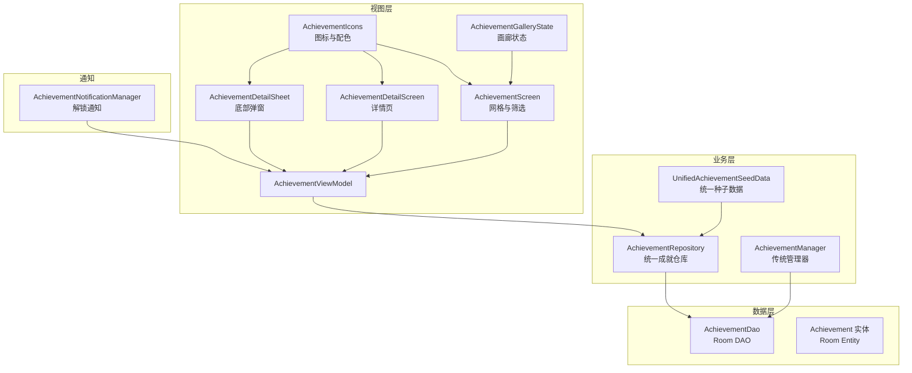
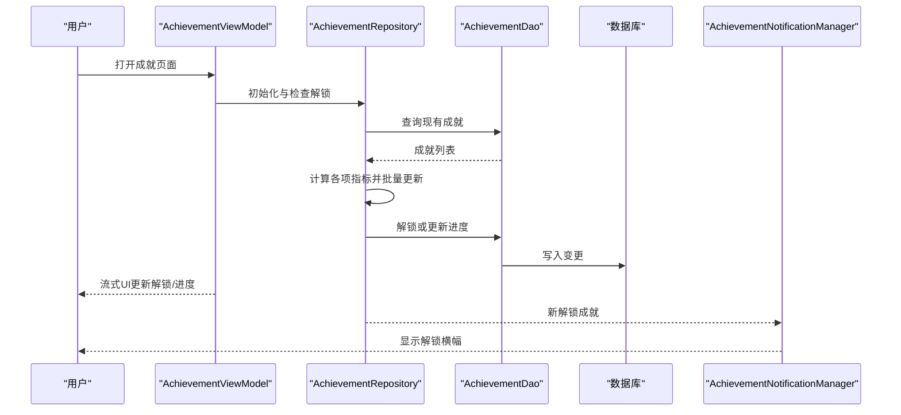
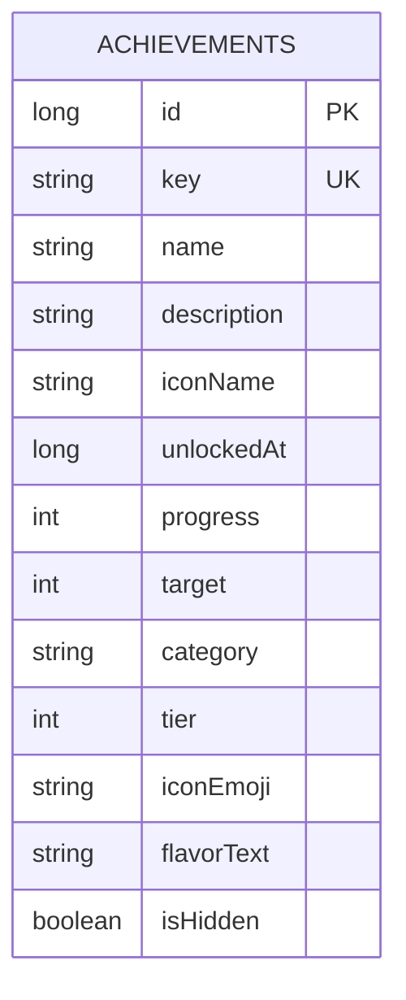
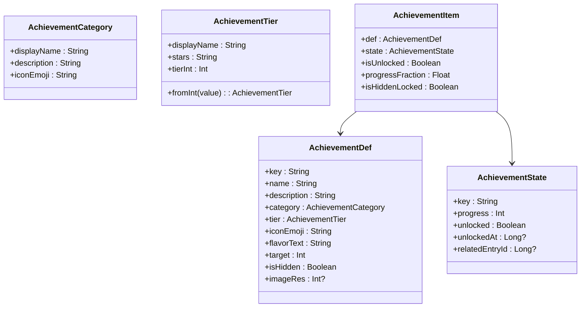
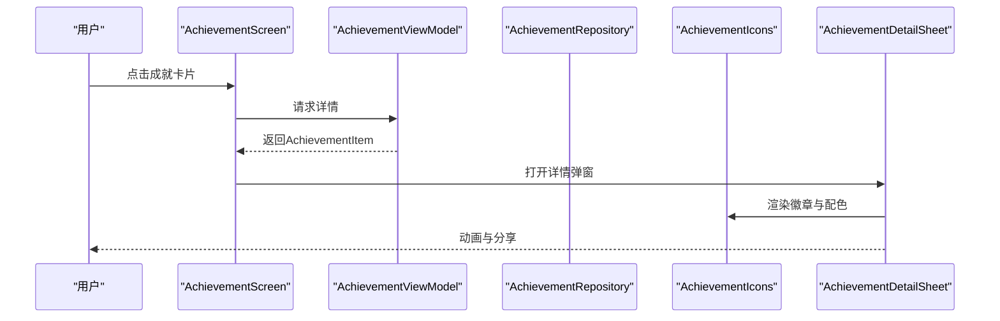
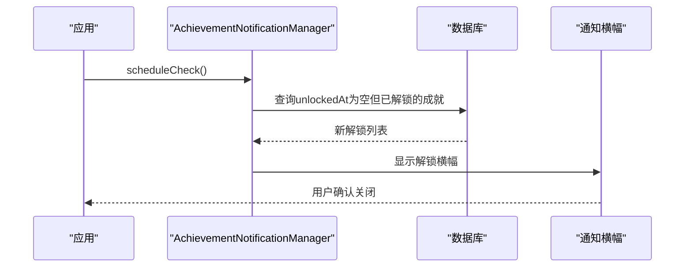
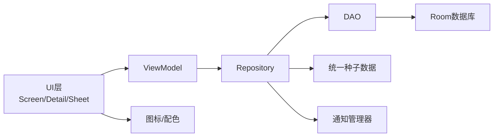

# 成就系统

<cite>
**本文引用的文件**
- [Achievement.kt](file://app/src/main/java/com/diary/app/data/Achievement.kt)
- [AchievementManager.kt](file://app/src/main/java/com/diary/app/data/AchievementManager.kt)
- [AchievementModels.kt](file://app/src/main/java/com/diary/app/data/AchievementModels.kt)
- [AchievementRepository.kt](file://app/src/main/java/com/diary/app/data/AchievementRepository.kt)
- [AchievementDao.kt](file://app/src/main/java/com/diary/app/data/AchievementDao.kt)
- [UnifiedAchievementSeedData.kt](file://app/src/main/java/com/diary/app/data/UnifiedAchievementSeedData.kt)
- [AchievementScreen.kt](file://app/src/main/java/com/diary/app/ui/achievement/AchievementScreen.kt)
- [AchievementViewModel.kt](file://app/src/main/java/com/diary/app/ui/achievement/AchievementViewModel.kt)
- [AchievementGalleryState.kt](file://app/src/main/java/com/diary/app/ui/achievement/AchievementGalleryState.kt)
- [AchievementDetailScreen.kt](file://app/src/main/java/com/diary/app/ui/achievement/AchievementDetailScreen.kt)
- [AchievementDetailSheet.kt](file://app/src/main/java/com/diary/app/ui/achievement/AchievementDetailSheet.kt)
- [AchievementIcons.kt](file://app/src/main/java/com/diary/app/ui/achievement/AchievementIcons.kt)
- [AchievementNotificationManager.kt](file://app/src/main/java/com/diary/app/reminder/AchievementNotificationManager.kt)
</cite>

## 目录
1. [简介](#简介)
2. [项目结构](#项目结构)
3. [核心组件](#核心组件)
4. [架构总览](#架构总览)
5. [详细组件分析](#详细组件分析)
6. [依赖关系分析](#依赖关系分析)
7. [性能考虑](#性能考虑)
8. [故障排查指南](#故障排查指南)
9. [结论](#结论)
10. [附录](#附录)

## 简介
本文件系统性梳理日记应用的成就系统，覆盖成就定义的数据结构、解锁条件判断、进度跟踪机制；深入解析 AchievementManager 的业务逻辑、成就分类体系与奖励发放流程；阐述成就图标管理、解锁动画效果与通知机制；包含成就统计分析、排行榜思路、社交分享；提供成就配置管理、动态解锁条件与扩展新成就类型的实现指南，并解释成就数据的持久化策略与性能优化方案。

## 项目结构
成就系统由“数据层（Room）+ 仓库层（Repository）+ 视图模型（ViewModel）+ UI 层（Compose）”构成，采用统一的成就定义与分类体系，支持多种解锁条件与进度展示，并通过通知管理器提供非侵入式解锁提示。



**图表来源**
- [AchievementDao.kt:10-64](file://app/src/main/java/com/diary/app/data/AchievementDao.kt#L10-L64)
- [AchievementRepository.kt:12-126](file://app/src/main/java/com/diary/app/data/AchievementRepository.kt#L12-L126)
- [AchievementManager.kt:12-125](file://app/src/main/java/com/diary/app/data/AchievementManager.kt#L12-L125)
- [UnifiedAchievementSeedData.kt:7-582](file://app/src/main/java/com/diary/app/data/UnifiedAchievementSeedData.kt#L7-L582)
- [AchievementScreen.kt:64-183](file://app/src/main/java/com/diary/app/ui/achievement/AchievementScreen.kt#L64-L183)
- [AchievementViewModel.kt:21-159](file://app/src/main/java/com/diary/app/ui/achievement/AchievementViewModel.kt#L21-L159)
- [AchievementDetailScreen.kt:46-289](file://app/src/main/java/com/diary/app/ui/achievement/AchievementDetailScreen.kt#L46-L289)
- [AchievementDetailSheet.kt:66-212](file://app/src/main/java/com/diary/app/ui/achievement/AchievementDetailSheet.kt#L66-L212)
- [AchievementIcons.kt:62-205](file://app/src/main/java/com/diary/app/ui/achievement/AchievementIcons.kt#L62-L205)
- [AchievementGalleryState.kt:37-192](file://app/src/main/java/com/diary/app/ui/achievement/AchievementGalleryState.kt#L37-L192)
- [AchievementNotificationManager.kt:23-86](file://app/src/main/java/com/diary/app/reminder/AchievementNotificationManager.kt#L23-L86)

**章节来源**
- [AchievementDao.kt:10-64](file://app/src/main/java/com/diary/app/data/AchievementDao.kt#L10-L64)
- [AchievementRepository.kt:12-126](file://app/src/main/java/com/diary/app/data/AchievementRepository.kt#L12-L126)
- [AchievementManager.kt:12-125](file://app/src/main/java/com/diary/app/data/AchievementManager.kt#L12-L125)
- [UnifiedAchievementSeedData.kt:7-582](file://app/src/main/java/com/diary/app/data/UnifiedAchievementSeedData.kt#L7-L582)
- [AchievementScreen.kt:64-183](file://app/src/main/java/com/diary/app/ui/achievement/AchievementScreen.kt#L64-L183)
- [AchievementViewModel.kt:21-159](file://app/src/main/java/com/diary/app/ui/achievement/AchievementViewModel.kt#L21-L159)
- [AchievementDetailScreen.kt:46-289](file://app/src/main/java/com/diary/app/ui/achievement/AchievementDetailScreen.kt#L46-L289)
- [AchievementDetailSheet.kt:66-212](file://app/src/main/java/com/diary/app/ui/achievement/AchievementDetailSheet.kt#L66-L212)
- [AchievementIcons.kt:62-205](file://app/src/main/java/com/diary/app/ui/achievement/AchievementIcons.kt#L62-L205)
- [AchievementGalleryState.kt:37-192](file://app/src/main/java/com/diary/app/ui/achievement/AchievementGalleryState.kt#L37-L192)
- [AchievementNotificationManager.kt:23-86](file://app/src/main/java/com/diary/app/reminder/AchievementNotificationManager.kt#L23-L86)

## 核心组件
- 数据实体与DAO：Achievement 实体与 AchievementDao 提供统一的持久化接口，支持按分类、稀有度、解锁状态查询与更新。
- 统一成就定义：UnifiedAchievementSeedData 定义所有成就的 key、名称、描述、分类、稀有度、目标值、隐藏标记等元数据。
- 仓库层：AchievementRepository 负责初始化、批量检查与解锁、统计聚合与进度更新。
- 视图模型：AchievementViewModel 将仓库数据转换为 UI 友好的流，处理筛选、排序与最近解锁/里程碑提醒。
- UI 层：AchievementScreen、AchievementDetailScreen、AchievementDetailSheet 提供网格浏览、详情查看与分享；AchievementIcons 提供图标映射与配色；AchievementGalleryState 提供画廊状态与排序规则。
- 通知：AchievementNotificationManager 提供非系统通知的解锁横幅提示。

**章节来源**
- [Achievement.kt:11-26](file://app/src/main/java/com/diary/app/data/Achievement.kt#L11-L26)
- [AchievementDao.kt:12-64](file://app/src/main/java/com/diary/app/data/AchievementDao.kt#L12-L64)
- [UnifiedAchievementSeedData.kt:9-582](file://app/src/main/java/com/diary/app/data/UnifiedAchievementSeedData.kt#L9-L582)
- [AchievementRepository.kt:16-126](file://app/src/main/java/com/diary/app/data/AchievementRepository.kt#L16-L126)
- [AchievementViewModel.kt:25-159](file://app/src/main/java/com/diary/app/ui/achievement/AchievementViewModel.kt#L25-L159)
- [AchievementScreen.kt:113-183](file://app/src/main/java/com/diary/app/ui/achievement/AchievementScreen.kt#L113-L183)
- [AchievementDetailScreen.kt:46-289](file://app/src/main/java/com/diary/app/ui/achievement/AchievementDetailScreen.kt#L46-L289)
- [AchievementDetailSheet.kt:66-212](file://app/src/main/java/com/diary/app/ui/achievement/AchievementDetailSheet.kt#L66-L212)
- [AchievementIcons.kt:84-205](file://app/src/main/java/com/diary/app/ui/achievement/AchievementIcons.kt#L84-L205)
- [AchievementGalleryState.kt:37-192](file://app/src/main/java/com/diary/app/ui/achievement/AchievementGalleryState.kt#L37-L192)
- [AchievementNotificationManager.kt:23-86](file://app/src/main/java/com/diary/app/reminder/AchievementNotificationManager.kt#L23-L86)

## 架构总览
成就系统采用分层架构，数据层基于 Room，业务层统一处理解锁与进度，UI 层以 Compose 呈现，通知层独立解耦。



**图表来源**
- [AchievementViewModel.kt:79-98](file://app/src/main/java/com/diary/app/ui/achievement/AchievementViewModel.kt#L79-L98)
- [AchievementRepository.kt:66-119](file://app/src/main/java/com/diary/app/data/AchievementRepository.kt#L66-L119)
- [AchievementDao.kt:18-64](file://app/src/main/java/com/diary/app/data/AchievementDao.kt#L18-L64)
- [AchievementNotificationManager.kt:44-61](file://app/src/main/java/com/diary/app/reminder/AchievementNotificationManager.kt#L44-L61)

## 详细组件分析

### 数据模型与持久化
- Achievement 实体字段：主键、唯一 key、名称、描述、图标名、解锁时间、进度、目标、分类、稀有度、表情图标、风味文案、是否隐藏。
- AchievementDao 提供：
  - 获取全部、解锁成就、更新进度、按分类/稀有度/状态统计等查询。
  - 统一查询接口支持按分类、稀有度排序，便于 UI 分类展示。
- Room 索引：Achievement 表对 key 建立唯一索引，保证种子数据幂等插入。



**图表来源**
- [Achievement.kt:11-26](file://app/src/main/java/com/diary/app/data/Achievement.kt#L11-L26)
- [AchievementDao.kt:12-64](file://app/src/main/java/com/diary/app/data/AchievementDao.kt#L12-L64)

**章节来源**
- [Achievement.kt:11-26](file://app/src/main/java/com/diary/app/data/Achievement.kt#L11-L26)
- [AchievementDao.kt:12-64](file://app/src/main/java/com/diary/app/data/AchievementDao.kt#L12-L64)

### 统一成就定义与分类体系
- 分类（8类）：时间旅人、情绪画师、风雨行者、文字匠人、习惯先锋、探险家、收藏家、传说藏品。
- 稀有度（4级）：普通、稀有、史诗、传说，带星级标识与数值映射。
- 元数据：每个成就包含 key、名称、描述、分类、稀有度、表情图标、风味文案、目标值、是否隐藏、图像资源等。
- 种子数据：集中定义所有成就，支持按 key 快速查找与按分类分组。



**图表来源**
- [AchievementModels.kt:11-94](file://app/src/main/java/com/diary/app/data/AchievementModels.kt#L11-L94)
- [UnifiedAchievementSeedData.kt:9-582](file://app/src/main/java/com/diary/app/data/UnifiedAchievementSeedData.kt#L9-L582)

**章节来源**
- [AchievementModels.kt:11-94](file://app/src/main/java/com/diary/app/data/AchievementModels.kt#L11-L94)
- [UnifiedAchievementSeedData.kt:9-582](file://app/src/main/java/com/diary/app/data/UnifiedAchievementSeedData.kt#L9-L582)

### 解锁条件判断与进度跟踪
- 传统管理器（AchievementManager）：
  - 初始化：根据内置定义生成缺失成就并插入数据库。
  - 检查解锁：遍历日记条目计算总数、字数、连续天数、独特情绪/天气、收藏数、图片数等，逐项调用 checkUnlock 判断阈值并更新进度或解锁。
- 统一仓库（AchievementRepository）：
  - 初始化：将统一种子数据与数据库现有成就对齐，更新元数据并插入新成就。
  - 批量检查：计算更丰富的指标（如连续高/低情绪天数、天气分布、收藏短日记等），按 key 与目标值批量解锁或更新进度。
  - 进度更新：若当前值大于进度且未解锁，则仅更新进度；达到目标则解锁并记录时间戳。

```mermaid
flowchart TD
Start(["开始检查"]) --> Load["加载日记预览与媒体信息"]
Load --> Compute["计算指标<br/>总数/字数/连续天数/独特元素/收藏/图片/标签"]
Compute --> Loop{"遍历各成就key"}
Loop --> |checkUnlock(key, current)| Compare{"current >= target?"}
Compare --> |是| Unlock["解锁: 更新unlockedAt与progress"]
Compare --> |否| UpdateProg["更新progress(若更大)"]
Unlock --> Next["下一个成就"]
UpdateProg --> Next
Next --> Loop
Loop --> |完成| End(["结束"])
```

**图表来源**
- [AchievementManager.kt:66-123](file://app/src/main/java/com/diary/app/data/AchievementManager.kt#L66-L123)
- [AchievementRepository.kt:66-119](file://app/src/main/java/com/diary/app/data/AchievementRepository.kt#L66-L119)

**章节来源**
- [AchievementManager.kt:41-123](file://app/src/main/java/com/diary/app/data/AchievementManager.kt#L41-L123)
- [AchievementRepository.kt:46-119](file://app/src/main/java/com/diary/app/data/AchievementRepository.kt#L46-L119)

### UI 展示与交互
- 成就网格：AchievementScreen 使用 LazyVerticalGrid 展示缩略卡片，顶部显示总览与稀有度计数，支持状态过滤与筛选抽屉。
- 详情页：AchievementDetailScreen 展示徽章、标签、进度条、解锁时间与风味文案；支持分享。
- 底部弹窗：AchievementDetailSheet 提供解锁时的发光动画、进度动画与分享入口。
- 图标与配色：AchievementIcons 提供图标映射与分类/稀有度配色；AchievementArtwork 统一徽章绘制逻辑。
- 画廊状态：AchievementGalleryState 提供英雄摘要、最近解锁、接近完成、筛选后的卡片状态与默认排序。



**图表来源**
- [AchievementScreen.kt:113-183](file://app/src/main/java/com/diary/app/ui/achievement/AchievementScreen.kt#L113-L183)
- [AchievementViewModel.kt:116-130](file://app/src/main/java/com/diary/app/ui/achievement/AchievementViewModel.kt#L116-L130)
- [AchievementDetailSheet.kt:66-212](file://app/src/main/java/com/diary/app/ui/achievement/AchievementDetailSheet.kt#L66-L212)
- [AchievementIcons.kt:160-205](file://app/src/main/java/com/diary/app/ui/achievement/AchievementIcons.kt#L160-L205)
- [AchievementGalleryState.kt:37-192](file://app/src/main/java/com/diary/app/ui/achievement/AchievementGalleryState.kt#L37-L192)

**章节来源**
- [AchievementScreen.kt:64-183](file://app/src/main/java/com/diary/app/ui/achievement/AchievementScreen.kt#L64-L183)
- [AchievementDetailScreen.kt:46-289](file://app/src/main/java/com/diary/app/ui/achievement/AchievementDetailScreen.kt#L46-L289)
- [AchievementDetailSheet.kt:66-212](file://app/src/main/java/com/diary/app/ui/achievement/AchievementDetailSheet.kt#L66-L212)
- [AchievementIcons.kt:62-205](file://app/src/main/java/com/diary/app/ui/achievement/AchievementIcons.kt#L62-L205)
- [AchievementGalleryState.kt:37-192](file://app/src/main/java/com/diary/app/ui/achievement/AchievementGalleryState.kt#L37-L192)

### 通知机制与社交分享
- 解锁通知：AchievementNotificationManager 在应用启动后扫描新解锁成就，触发非系统通知横幅；支持静默时段与偏好开关。
- 社交分享：AchievementDetailSheet 提供分享按钮，拼接成就名称、描述、风味文案与稀有度/分类标签，唤起系统分享面板。



**图表来源**
- [AchievementNotificationManager.kt:44-86](file://app/src/main/java/com/diary/app/reminder/AchievementNotificationManager.kt#L44-L86)

**章节来源**
- [AchievementNotificationManager.kt:14-86](file://app/src/main/java/com/diary/app/reminder/AchievementNotificationManager.kt#L14-L86)
- [AchievementDetailSheet.kt:187-207](file://app/src/main/java/com/diary/app/ui/achievement/AchievementDetailSheet.kt#L187-L207)

### 统计分析与排行榜思路
- 统计聚合：AchievementRepository 提供按分类统计“已解锁/总数”，AchievementGalleryState 提供英雄摘要与接近完成项。
- 排行榜思路：可在 UI 层基于 progressFraction 或解锁时间进行排序；结合稀有度权重可设计复合评分。

**章节来源**
- [AchievementRepository.kt:34-44](file://app/src/main/java/com/diary/app/data/AchievementRepository.kt#L34-L44)
- [AchievementGalleryState.kt:57-90](file://app/src/main/java/com/diary/app/ui/achievement/AchievementGalleryState.kt#L57-L90)

### 配置管理与扩展新成就类型
- 配置管理：统一在 UnifiedAchievementSeedData 中新增成就定义，设置分类、稀有度、目标值与隐藏标记，仓库初始化时自动对齐数据库。
- 动态解锁条件：在 AchievementRepository.checkAndUnlock 中扩展指标计算与 key->value 映射，即可动态增加新成就类型。
- 图标与样式：在 AchievementIcons 中扩展图标映射与配色；在 AchievementScreen/AchievementDetail* 中调整展示细节。

**章节来源**
- [UnifiedAchievementSeedData.kt:9-582](file://app/src/main/java/com/diary/app/data/UnifiedAchievementSeedData.kt#L9-L582)
- [AchievementRepository.kt:92-119](file://app/src/main/java/com/diary/app/data/AchievementRepository.kt#L92-L119)
- [AchievementIcons.kt:84-156](file://app/src/main/java/com/diary/app/ui/achievement/AchievementIcons.kt#L84-L156)

## 依赖关系分析
- 组件耦合：
  - ViewModel 依赖 Repository；Repository 依赖 DAO；DAO 依赖 Room 数据库。
  - UI 依赖 ViewModel 与图标/配色工具；通知管理器独立于 UI。
- 关键依赖链：
  - UI -> ViewModel -> Repository -> DAO -> Room。
  - 通知 -> Repository 结果 -> NotificationManager -> UI。



**图表来源**
- [AchievementViewModel.kt:21-26](file://app/src/main/java/com/diary/app/ui/achievement/AchievementViewModel.kt#L21-L26)
- [AchievementRepository.kt:12-15](file://app/src/main/java/com/diary/app/data/AchievementRepository.kt#L12-L15)
- [AchievementDao.kt:10-11](file://app/src/main/java/com/diary/app/data/AchievementDao.kt#L10-L11)
- [AchievementIcons.kt:62-82](file://app/src/main/java/com/diary/app/ui/achievement/AchievementIcons.kt#L62-L82)
- [AchievementNotificationManager.kt:23-29](file://app/src/main/java/com/diary/app/reminder/AchievementNotificationManager.kt#L23-L29)

**章节来源**
- [AchievementViewModel.kt:21-26](file://app/src/main/java/com/diary/app/ui/achievement/AchievementViewModel.kt#L21-L26)
- [AchievementRepository.kt:12-15](file://app/src/main/java/com/diary/app/data/AchievementRepository.kt#L12-L15)
- [AchievementDao.kt:10-11](file://app/src/main/java/com/diary/app/data/AchievementDao.kt#L10-L11)
- [AchievementIcons.kt:62-82](file://app/src/main/java/com/diary/app/ui/achievement/AchievementIcons.kt#L62-L82)
- [AchievementNotificationManager.kt:23-29](file://app/src/main/java/com/diary/app/reminder/AchievementNotificationManager.kt#L23-L29)

## 性能考虑
- 查询与流式更新：使用 Flow 与 stateIn，避免不必要的重组；筛选与排序在 ViewModel 中组合计算，减少 UI 重绘。
- 批量更新：Repository 一次性计算多项指标并批量更新，降低数据库写入次数。
- 索引优化：Achievement.key 唯一索引确保初始化与查询高效。
- 动画与渲染：徽章与进度动画在 Compose 层执行，注意在低端设备上适度简化动画参数。
- IO 与协程：解锁检查与通知扫描均在 IO 线程执行，避免阻塞主线程。

[本节为通用指导，无需具体文件分析]

## 故障排查指南
- 成就未解锁：
  - 检查对应 key 的目标值与当前进度；确认是否已达到阈值。
  - 查看数据库中对应记录的 progress/unlockedAt 字段。
- 初始化失败：
  - 确认种子数据 key 是否与数据库冲突；检查唯一索引约束。
- 通知未显示：
  - 检查通知偏好与静默时段设置；确认通知状态引用正确。
- UI 不更新：
  - 检查 ViewModel 的状态流是否订阅；确认 stateIn 的作用域与超时配置。

**章节来源**
- [AchievementRepository.kt:109-119](file://app/src/main/java/com/diary/app/data/AchievementRepository.kt#L109-L119)
- [AchievementDao.kt:30-34](file://app/src/main/java/com/diary/app/data/AchievementDao.kt#L30-L34)
- [AchievementNotificationManager.kt:34-38](file://app/src/main/java/com/diary/app/reminder/AchievementNotificationManager.kt#L34-L38)

## 结论
该成就系统以统一的定义与分类体系为核心，结合仓库层的批量检查与进度跟踪、UI 层的可视化与交互体验，以及通知层的非侵入式反馈，形成了完整的闭环。通过 Room 的索引与流式更新，系统在功能与性能之间取得平衡；通过种子数据与图标工具，易于扩展新成就类型与视觉风格。

[本节为总结，无需具体文件分析]

## 附录
- 常用操作路径参考：
  - 初始化与检查：[AchievementRepository.initialize:46-64](file://app/src/main/java/com/diary/app/data/AchievementRepository.kt#L46-L64)、[AchievementRepository.checkAndUnlock:66-119](file://app/src/main/java/com/diary/app/data/AchievementRepository.kt#L66-L119)
  - 单项解锁判断：[AchievementManager.checkUnlock:114-123](file://app/src/main/java/com/diary/app/data/AchievementManager.kt#L114-L123)
  - 数据查询与更新：[AchievementDao:18-64](file://app/src/main/java/com/diary/app/data/AchievementDao.kt#L18-L64)
  - UI 状态构建：[AchievementGalleryState:37-192](file://app/src/main/java/com/diary/app/ui/achievement/AchievementGalleryState.kt#L37-L192)
  - 图标与配色：[AchievementIcons:84-205](file://app/src/main/java/com/diary/app/ui/achievement/AchievementIcons.kt#L84-L205)
  - 解锁通知：[AchievementNotificationManager:44-86](file://app/src/main/java/com/diary/app/reminder/AchievementNotificationManager.kt#L44-L86)

[本节为补充说明，无需具体文件分析]