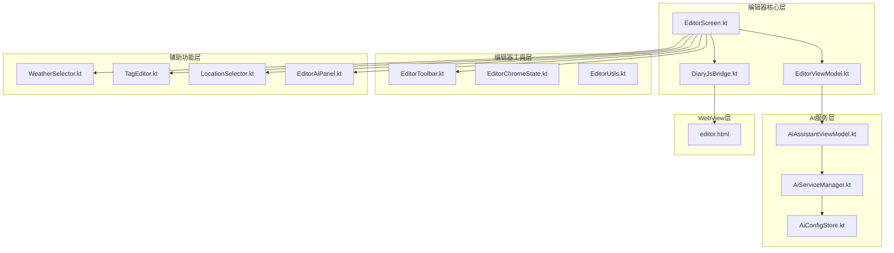
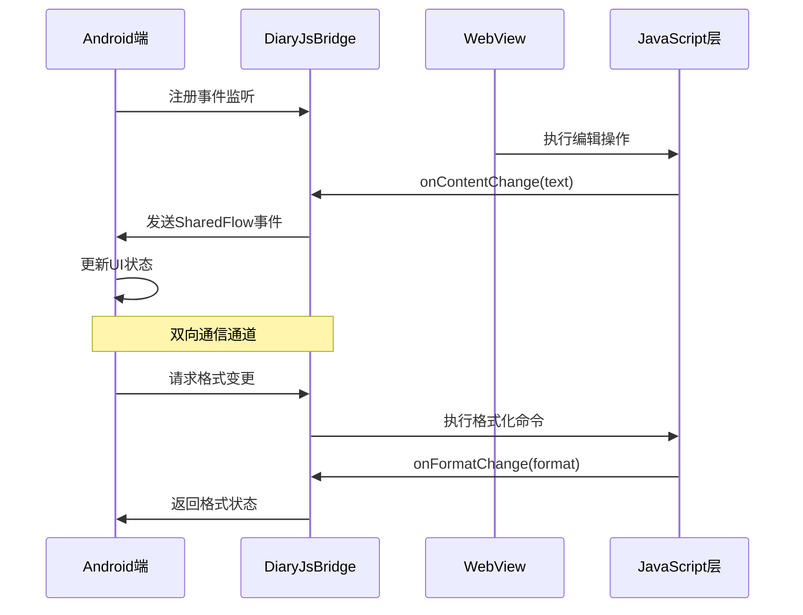
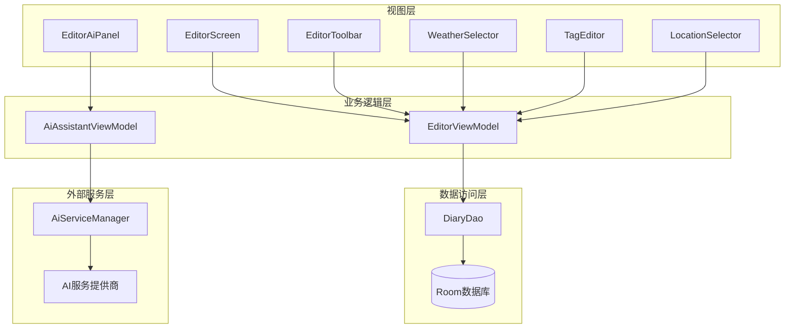
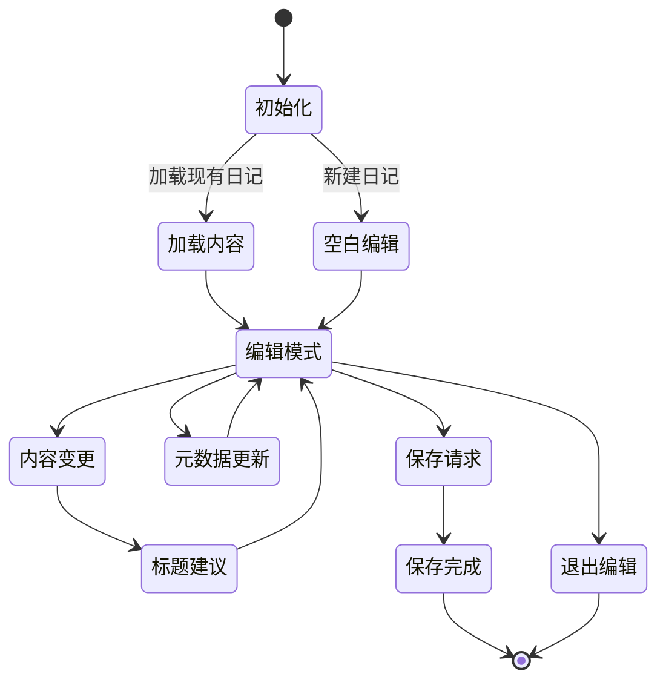
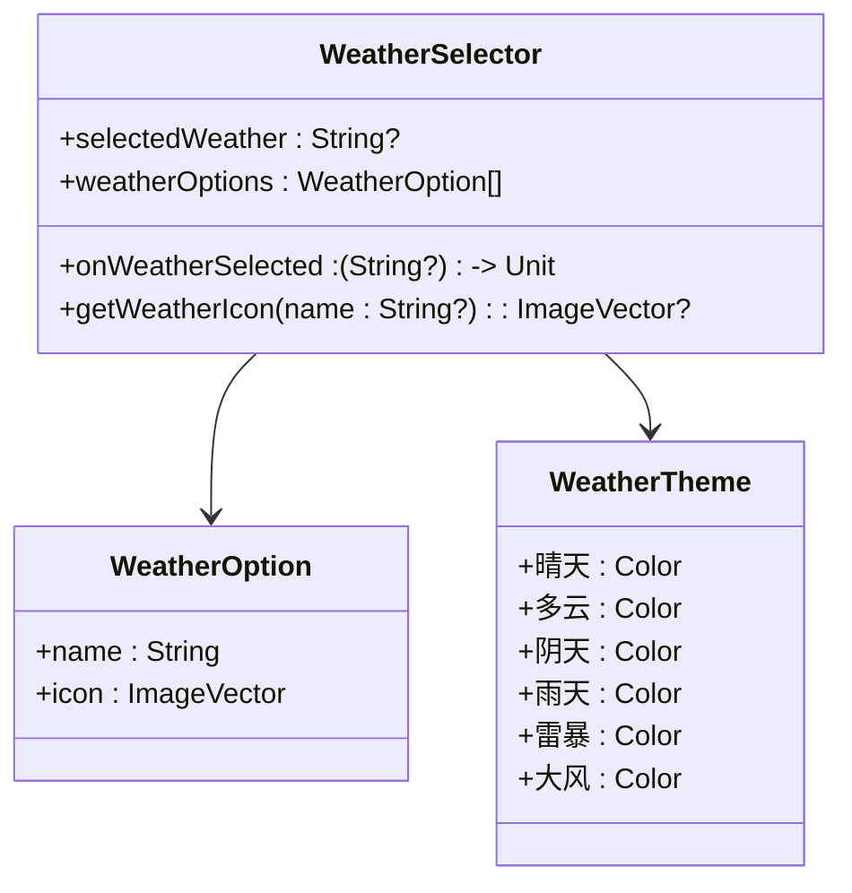
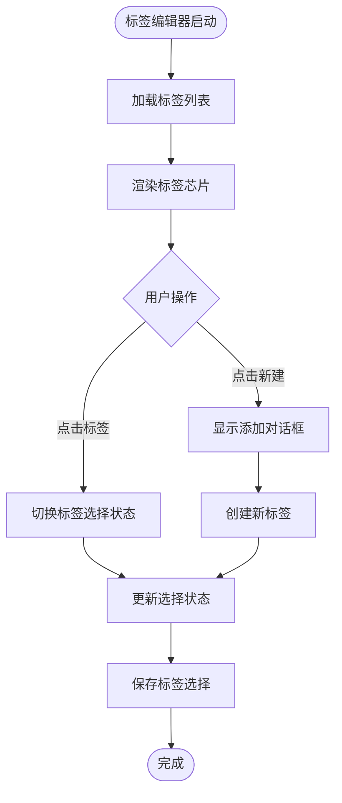
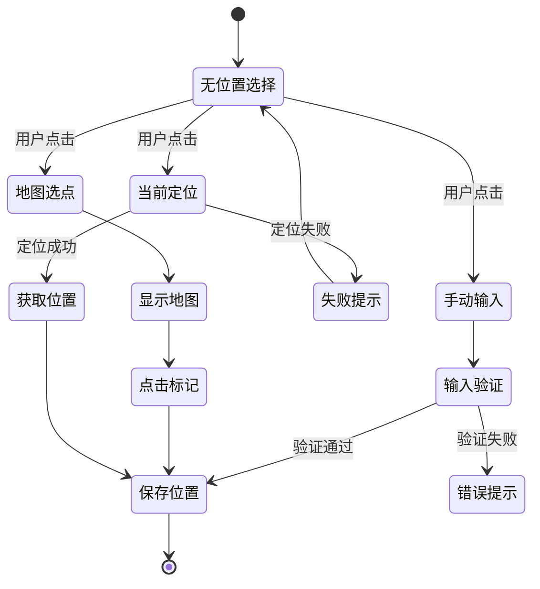
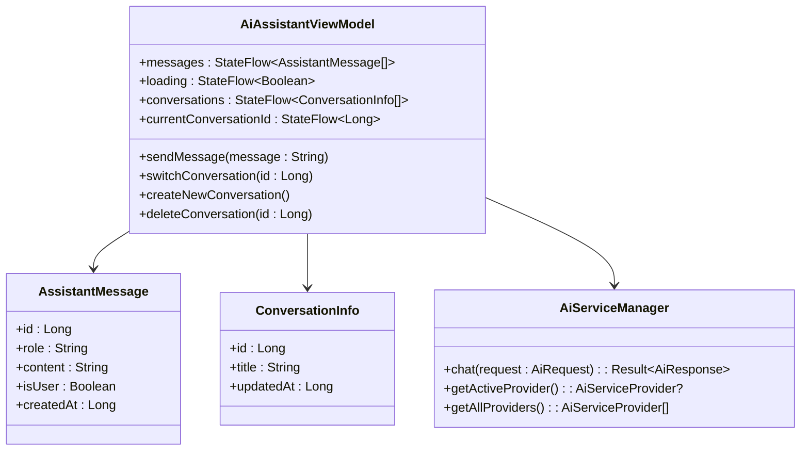
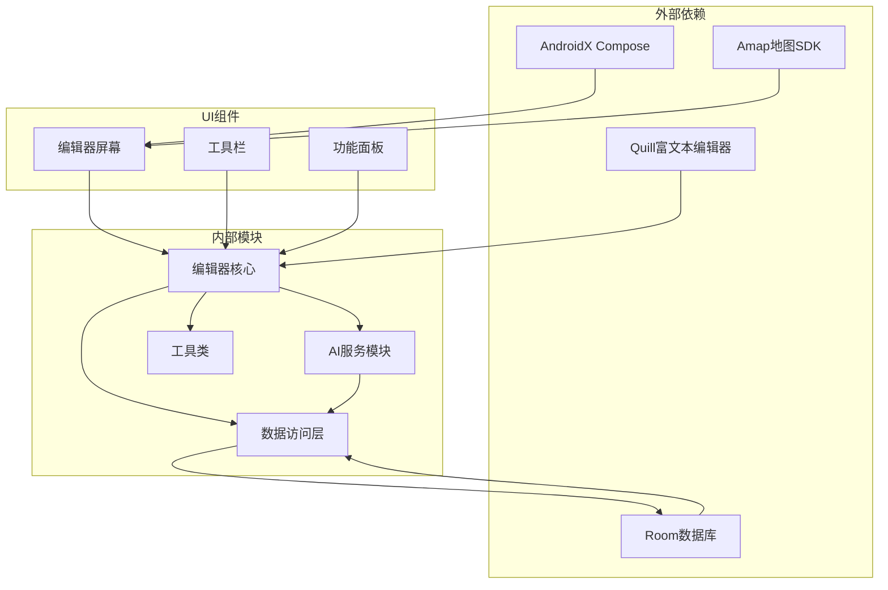

# 日记编辑器

<cite>
**本文档引用的文件**
- [DiaryJsBridge.kt](file://app/src/main/java/com/diary/app/ui/editor/DiaryJsBridge.kt)
- [EditorScreen.kt](file://app/src/main/java/com/diary/app/ui/editor/EditorScreen.kt)
- [EditorViewModel.kt](file://app/src/main/java/com/diary/app/ui/editor/EditorViewModel.kt)
- [EditorToolbar.kt](file://app/src/main/java/com/diary/app/ui/editor/EditorToolbar.kt)
- [WeatherSelector.kt](file://app/src/main/java/com/diary/app/ui/editor/WeatherSelector.kt)
- [TagEditor.kt](file://app/src/main/java/com/diary/app/ui/editor/TagEditor.kt)
- [LocationSelector.kt](file://app/src/main/java/com/diary/app/ui/editor/LocationSelector.kt)
- [EditorChromeState.kt](file://app/src/main/java/com/diary/app/ui/editor/EditorChromeState.kt)
- [EditorUtils.kt](file://app/src/main/java/com/diary/app/ui/editor/EditorUtils.kt)
- [EditorAiPanel.kt](file://app/src/main/java/com/diary/app/ui/editor/EditorAiPanel.kt)
- [AiAssistantViewModel.kt](file://app/src/main/java/com/diary/app/ai/AiAssistantViewModel.kt)
- [AiServiceManager.kt](file://app/src/main/java/com/diary/app/ai/AiServiceManager.kt)
- [AiConfigStore.kt](file://app/src/main/java/com/diary/app/ai/AiConfigStore.kt)
- [editor.html](file://app/src/main/assets/editor.html)
</cite>

## 目录
1. [简介](#简介)
2. [项目结构](#项目结构)
3. [核心组件](#核心组件)
4. [架构概览](#架构概览)
5. [详细组件分析](#详细组件分析)
6. [依赖分析](#依赖分析)
7. [性能考虑](#性能考虑)
8. [故障排除指南](#故障排除指南)
9. [结论](#结论)
10. [附录](#附录)

## 简介

日记编辑器是日记应用的核心创作模块，基于富文本编辑器技术构建，提供完整的日记创作体验。该模块集成了多种辅助功能，包括天气选择器、位置标记、标签编辑器、AI写作助手等，为用户提供全方位的日记创作支持。

本编辑器采用WebView与JavaScript桥接机制，结合Android原生UI组件，实现了高性能的富文本编辑体验。编辑器支持实时保存、撤销重做、多媒体插入、格式化选项等功能，并提供了完善的元数据管理能力。

## 项目结构

日记编辑器模块位于应用的UI层，采用清晰的分层架构设计：

**图表来源**
- [EditorScreen.kt:1-800](file://app/src/main/java/com/diary/app/ui/editor/EditorScreen.kt#L1-L800)
- [EditorViewModel.kt:1-433](file://app/src/main/java/com/diary/app/ui/editor/EditorViewModel.kt#L1-L433)
- [DiaryJsBridge.kt:1-60](file://app/src/main/java/com/diary/app/ui/editor/DiaryJsBridge.kt#L1-L60)

**章节来源**
- [EditorScreen.kt:1-800](file://app/src/main/java/com/diary/app/ui/editor/EditorScreen.kt#L1-L800)
- [EditorViewModel.kt:1-433](file://app/src/main/java/com/diary/app/ui/editor/EditorViewModel.kt#L1-L433)

## 核心组件

### 富文本编辑器引擎

编辑器基于Quill富文本编辑器构建，通过WebView实现跨平台兼容性。核心特性包括：

- **实时内容同步**：通过JavaScript桥接实现编辑器状态与Android端的双向通信
- **格式化支持**：支持标题、列表、引用、代码块等多种格式
- **多媒体集成**：原生支持图片、视频、音频等多媒体内容
- **主题适配**：支持明暗主题切换，动态适配系统外观

### JavaScript桥接机制

DiaryJsBridge类实现了Android与JavaScript之间的安全通信：

**图表来源**
- [DiaryJsBridge.kt:8-60](file://app/src/main/java/com/diary/app/ui/editor/DiaryJsBridge.kt#L8-L60)
- [editor.html:360-730](file://app/src/main/assets/editor.html#L360-L730)

### 编辑器工具栏系统

编辑器工具栏采用模块化设计，支持四种主要功能类别：

1. **格式化面板**：字体大小、标题级别、加粗、斜体等
2. **列表面板**：有序列表、无序列表、任务清单
3. **插入面板**：图片、分割线、链接插入
4. **颜色面板**：文本颜色、背景颜色选择

**章节来源**
- [EditorToolbar.kt:1-800](file://app/src/main/java/com/diary/app/ui/editor/EditorToolbar.kt#L1-L800)
- [EditorChromeState.kt:1-67](file://app/src/main/java/com/diary/app/ui/editor/EditorChromeState.kt#L1-L67)

## 架构概览

编辑器采用MVVM架构模式，结合响应式编程实现高效的状态管理：

**图表来源**
- [EditorScreen.kt:120-800](file://app/src/main/java/com/diary/app/ui/editor/EditorScreen.kt#L120-L800)
- [EditorViewModel.kt:41-433](file://app/src/main/java/com/diary/app/ui/editor/EditorViewModel.kt#L41-L433)
- [AiAssistantViewModel.kt:33-364](file://app/src/main/java/com/diary/app/ai/AiAssistantViewModel.kt#L33-L364)

## 详细组件分析

### 编辑器屏幕组件

EditorScreen是编辑器的主界面组件，负责协调所有子组件的工作：

#### 状态管理机制

**图表来源**
- [EditorScreen.kt:272-598](file://app/src/main/java/com/diary/app/ui/editor/EditorScreen.kt#L272-L598)

#### 实时保存策略

编辑器实现了多层次的自动保存机制：

1. **内容变更保存**：检测到内容变化后延迟5秒保存
2. **元数据变更保存**：位置、天气、标签等元数据变化后2.5秒保存
3. **应用后台保存**：应用进入后台时自动保存
4. **手动保存**：用户主动保存时立即执行

**章节来源**
- [EditorScreen.kt:510-598](file://app/src/main/java/com/diary/app/ui/editor/EditorScreen.kt#L510-L598)
- [EditorViewModel.kt:144-158](file://app/src/main/java/com/diary/app/ui/editor/EditorViewModel.kt#L144-L158)

### 辅助功能组件

#### 天气选择器

天气选择器提供直观的天气图标选择界面：

**图表来源**
- [WeatherSelector.kt:49-95](file://app/src/main/java/com/diary/app/ui/editor/WeatherSelector.kt#L49-L95)

#### 标签编辑器

标签编辑器支持标签的创建、选择和管理：

**图表来源**
- [TagEditor.kt:44-86](file://app/src/main/java/com/diary/app/ui/editor/TagEditor.kt#L44-L86)

#### 位置选择器

位置选择器提供多种位置输入方式：

**图表来源**
- [LocationSelector.kt:78-448](file://app/src/main/java/com/diary/app/ui/editor/LocationSelector.kt#L78-L448)

**章节来源**
- [WeatherSelector.kt:1-196](file://app/src/main/java/com/diary/app/ui/editor/WeatherSelector.kt#L1-L196)
- [TagEditor.kt:1-274](file://app/src/main/java/com/diary/app/ui/editor/TagEditor.kt#L1-L274)
- [LocationSelector.kt:1-576](file://app/src/main/java/com/diary/app/ui/editor/LocationSelector.kt#L1-L576)

### AI写作助手集成

AI写作助手为编辑器提供了智能化的创作辅助：

#### 对话管理架构

**图表来源**
- [AiAssistantViewModel.kt:19-58](file://app/src/main/java/com/diary/app/ai/AiAssistantViewModel.kt#L19-L58)
- [AiAssistantViewModel.kt:33-81](file://app/src/main/java/com/diary/app/ai/AiAssistantViewModel.kt#L33-L81)
- [AiServiceManager.kt:10-42](file://app/src/main/java/com/diary/app/ai/AiServiceManager.kt#L10-L42)

#### AI配置管理系统

AI服务采用可插拔的提供商架构，支持多个AI服务提供商：

| 提供商 | 特点 | 适用场景 |
|--------|------|----------|
| Agnes | 稳定可靠 | 基础对话、内容生成 |
| Deepseek | 性能优秀 | 复杂推理、数据分析 |
| ModelScope | 功能丰富 | 多模态处理、专业领域 |

**章节来源**
- [AiAssistantViewModel.kt:128-226](file://app/src/main/java/com/diary/app/ai/AiAssistantViewModel.kt#L128-L226)
- [AiServiceManager.kt:26-37](file://app/src/main/java/com/diary/app/ai/AiServiceManager.kt#L26-L37)
- [AiConfigStore.kt:26-31](file://app/src/main/java/com/diary/app/ai/AiConfigStore.kt#L26-L31)

## 依赖分析

编辑器模块的依赖关系呈现清晰的分层结构：

**图表来源**
- [EditorScreen.kt:1-120](file://app/src/main/java/com/diary/app/ui/editor/EditorScreen.kt#L1-L120)
- [AiAssistantViewModel.kt:1-20](file://app/src/main/java/com/diary/app/ai/AiAssistantViewModel.kt#L1-L20)

### 关键依赖关系

1. **WebView与JavaScript桥接**：通过DiaryJsBridge实现Android与JavaScript的双向通信
2. **状态管理**：使用Kotlin协程和Flow实现响应式状态管理
3. **媒体处理**：集成DiaryMediaManager进行图片、视频、音频的本地存储和引用
4. **AI服务集成**：通过AiServiceManager统一管理多个AI服务提供商

**章节来源**
- [DiaryJsBridge.kt:3-10](file://app/src/main/java/com/diary/app/ui/editor/DiaryJsBridge.kt#L3-L10)
- [EditorViewModel.kt:23-25](file://app/src/main/java/com/diary/app/ui/editor/EditorViewModel.kt#L23-L25)

## 性能考虑

### WebView性能优化

编辑器在WebView层面实施了多项性能优化措施：

1. **内存管理**：及时清理WebView资源，防止内存泄漏
2. **内容加载优化**：使用Base64编码避免URL转义问题
3. **滚动性能**：优化滚动行为，确保编辑体验流畅
4. **主题切换**：快速响应主题变化，减少重绘开销

### 状态管理优化

1. **防抖机制**：对频繁的状态变更实施防抖处理
2. **增量更新**：只更新发生变化的部分UI
3. **生命周期感知**：合理管理协程生命周期，避免资源浪费

### 数据持久化优化

1. **智能缓存**：AI响应结果缓存，减少重复请求
2. **批量操作**：数据库操作采用事务批量处理
3. **延迟加载**：非关键数据延迟加载，提升启动速度

## 故障排除指南

### 常见问题及解决方案

#### 编辑器内容丢失问题

**症状**：编辑器内容在重启后丢失
**原因分析**：
- 自动保存机制未触发
- 数据库写入失败
- WebView状态恢复异常

**解决步骤**：
1. 检查自动保存定时器是否正常运行
2. 验证数据库连接状态
3. 确认WebView内容序列化是否正确

#### 图片插入失败问题

**症状**：图片无法插入到编辑器中
**原因分析**：
- 文件权限不足
- 存储空间不足
- 图片格式不支持

**解决步骤**：
1. 检查应用存储权限
2. 验证可用存储空间
3. 确认图片格式兼容性

#### AI对话异常问题

**症状**：AI助手无法正常回复消息
**原因分析**：
- AI服务配置错误
- 网络连接问题
- API密钥失效

**解决步骤**：
1. 验证AI服务提供商配置
2. 检查网络连接状态
3. 更新API密钥信息

**章节来源**
- [EditorScreen.kt:402-463](file://app/src/main/java/com/diary/app/ui/editor/EditorScreen.kt#L402-L463)
- [AiServiceManager.kt:43-61](file://app/src/main/java/com/diary/app/ai/AiServiceManager.kt#L43-L61)

## 结论

日记编辑器模块展现了现代移动应用开发的最佳实践，通过合理的架构设计和丰富的功能集成，为用户提供了优质的日记创作体验。模块的主要优势包括：

1. **技术架构先进**：采用MVVM模式和响应式编程，代码结构清晰
2. **功能完整丰富**：集成了富文本编辑、AI助手、多媒体处理等多种功能
3. **用户体验优秀**：提供流畅的编辑体验和智能化的创作辅助
4. **扩展性强**：模块化设计便于功能扩展和维护

未来可以进一步优化的方向包括AI服务的离线支持、编辑器性能的深度优化、以及更多个性化定制功能的开发。

## 附录

### 编辑器自定义配置

编辑器支持多种自定义选项：

- **字体大小**：支持超小、小、标准、大、超大五种尺寸
- **主题模式**：支持明暗主题自动切换
- **工具栏布局**：可配置显示/隐藏编辑器工具栏
- **快捷操作**：支持键盘快捷键和手势操作

### 性能监控指标

建议关注的关键性能指标：
- WebView内容加载时间
- 自动保存触发频率
- AI响应延迟
- 内存使用峰值
- 启动时间

### 最佳实践建议

1. **代码组织**：保持组件职责单一，避免过度耦合
2. **错误处理**：完善异常捕获和用户反馈机制
3. **测试覆盖**：增加单元测试和集成测试覆盖率
4. **文档维护**：及时更新技术文档和API说明