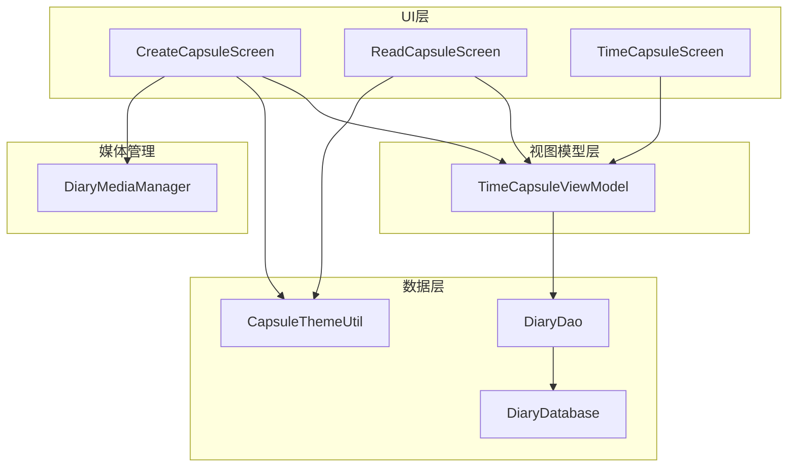
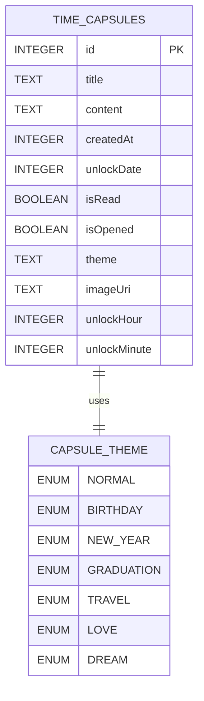
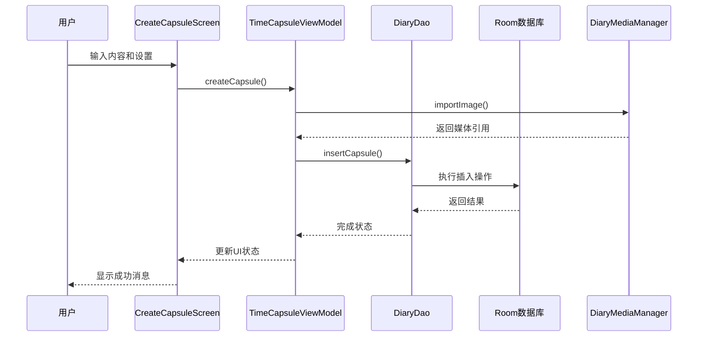
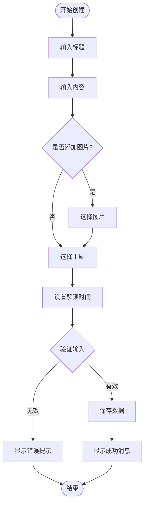
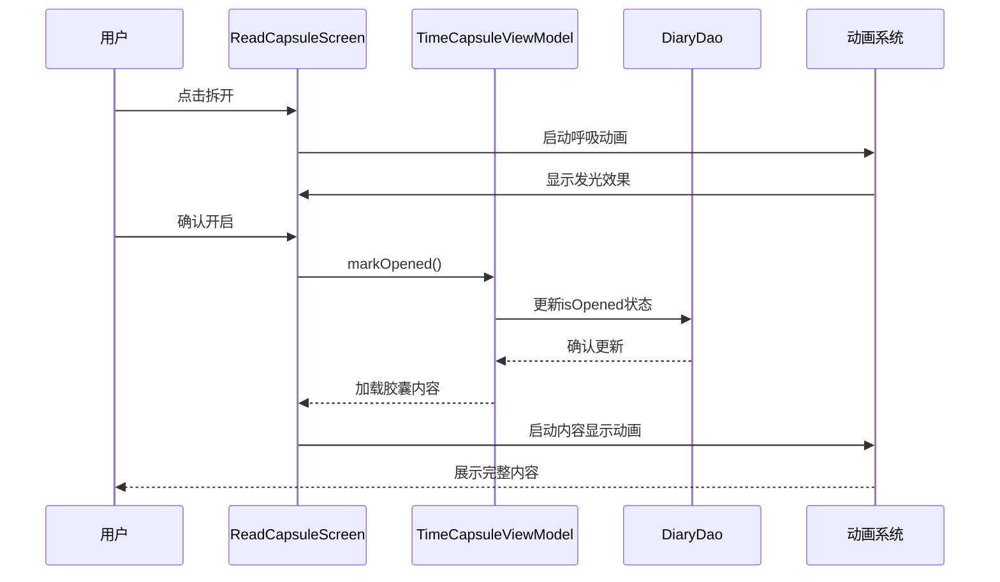
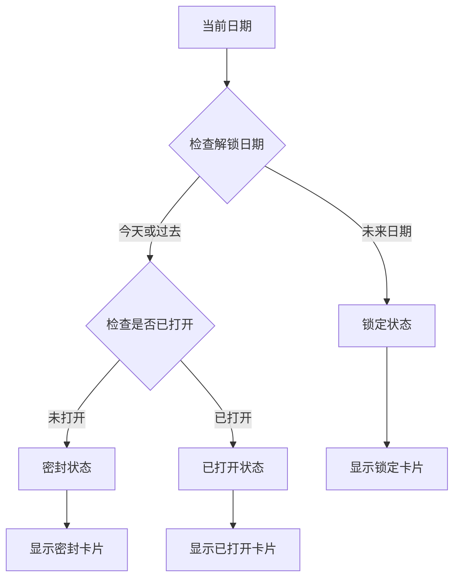
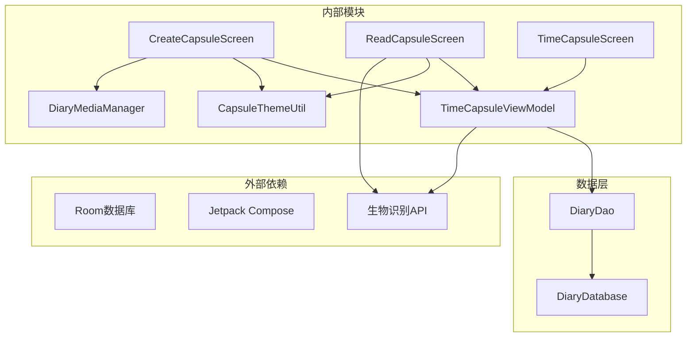

# 时间胶囊

<cite>
**本文档引用的文件**
- [TimeCapsule.kt](file://app/src/main/java/com/diary/app/data/TimeCapsule.kt)
- [DiaryDao.kt](file://app/src/main/java/com/diary/app/data/DiaryDao.kt)
- [DiaryDatabase.kt](file://app/src/main/java/com/diary/app/data/DiaryDatabase.kt)
- [DiaryMediaManager.kt](file://app/src/main/java/com/diary/app/data/DiaryMediaManager.kt)
- [CreateCapsuleScreen.kt](file://app/src/main/java/com/diary/app/ui/capsule/CreateCapsuleScreen.kt)
- [ReadCapsuleScreen.kt](file://app/src/main/java/com/diary/app/ui/capsule/ReadCapsuleScreen.kt)
- [CapsuleThemeUtil.kt](file://app/src/main/java/com/diary/app/ui/capsule/CapsuleThemeUtil.kt)
- [TimeCapsuleViewModel.kt](file://app/src/main/java/com/diary/app/ui/capsule/TimeCapsuleViewModel.kt)
- [TimeCapsuleScreen.kt](file://app/src/main/java/com/diary/app/ui/capsule/TimeCapsuleScreen.kt)
- [DiaryNavHost.kt](file://app/src/main/java/com/diary/app/ui/navigation/DiaryNavHost.kt)
- [BiometricHelper.kt](file://app/src/main/java/com/diary/app/biometric/BiometricHelper.kt)
</cite>

## 目录
1. [简介](#简介)
2. [项目结构](#项目结构)
3. [核心组件](#核心组件)
4. [架构概览](#架构概览)
5. [详细组件分析](#详细组件分析)
6. [依赖关系分析](#依赖关系分析)
7. [性能考虑](#性能考虑)
8. [故障排除指南](#故障排除指南)
9. [结论](#结论)

## 简介

时间胶囊是日记本应用中的一个核心功能模块，允许用户创建写给未来的信件，在指定的时间自动解锁展示。该模块实现了完整的加密存储机制、智能解锁条件判断、个性化主题系统以及安全的用户体验设计。

时间胶囊功能基于Android Room数据库持久化存储，采用Material Design 3设计语言，提供了丰富的视觉效果和交互体验。用户可以通过多种主题来个性化时间胶囊的外观，支持图片附件，并通过生物识别或PIN码进行安全验证。

## 项目结构

时间胶囊模块位于应用的UI和数据层之间，采用了清晰的分层架构：

**图表来源**
- [CreateCapsuleScreen.kt:140-670](file://app/src/main/java/com/diary/app/ui/capsule/CreateCapsuleScreen.kt#L140-L670)
- [ReadCapsuleScreen.kt:84-458](file://app/src/main/java/com/diary/app/ui/capsule/ReadCapsuleScreen.kt#L84-L458)
- [TimeCapsuleScreen.kt:92-599](file://app/src/main/java/com/diary/app/ui/capsule/TimeCapsuleScreen.kt#L92-L599)

**章节来源**
- [CreateCapsuleScreen.kt:1-670](file://app/src/main/java/com/diary/app/ui/capsule/CreateCapsuleScreen.kt#L1-L670)
- [ReadCapsuleScreen.kt:1-458](file://app/src/main/java/com/diary/app/ui/capsule/ReadCapsuleScreen.kt#L1-L458)
- [TimeCapsuleScreen.kt:1-599](file://app/src/main/java/com/diary/app/ui/capsule/TimeCapsuleScreen.kt#L1-L599)

## 核心组件

### 数据模型设计

时间胶囊的数据模型基于Room数据库实体，具有以下关键特性：

**图表来源**
- [TimeCapsule.kt:16-30](file://app/src/main/java/com/diary/app/data/TimeCapsule.kt#L16-L30)

### 主题系统架构

时间胶囊实现了完整的主题系统，支持7种不同的主题类型：

| 主题类型 | 中文名称 | 主色调 | 辅助色 |
|---------|---------|--------|--------|
| NORMAL | 普通 | Material主题主色 | Material主题次色 |
| BIRTHDAY | 生日 | #FFE8A0BF | #FFD4A017 |
| NEW_YEAR | 新年 | #FFE07070 | #FFD4A017 |
| GRADUATION | 毕业 | #FF9B8EBA | #FFD4A017 |
| TRAVEL | 旅行 | #FF78B8B0 | #FF50A898 |
| LOVE | 爱情 | #FFD99AB8 | #FFC87EA0 |
| DREAM | 梦想 | #FFA88BC9 | #FF9070B8 |

**章节来源**
- [TimeCapsule.kt:6-14](file://app/src/main/java/com/diary/app/data/TimeCapsule.kt#L6-L14)
- [CapsuleThemeUtil.kt:8-20](file://app/src/main/java/com/diary/app/ui/capsule/CapsuleThemeUtil.kt#L8-L20)

## 架构概览

时间胶囊模块采用了MVVM架构模式，结合Jetpack Compose的声明式UI设计：

**图表来源**
- [CreateCapsuleScreen.kt:246-305](file://app/src/main/java/com/diary/app/ui/capsule/CreateCapsuleScreen.kt#L246-L305)
- [TimeCapsuleViewModel.kt:25-48](file://app/src/main/java/com/diary/app/ui/capsule/TimeCapsuleViewModel.kt#L25-L48)
- [DiaryDao.kt:504-505](file://app/src/main/java/com/diary/app/data/DiaryDao.kt#L504-L505)

**章节来源**
- [TimeCapsuleViewModel.kt:18-83](file://app/src/main/java/com/diary/app/ui/capsule/TimeCapsuleViewModel.kt#L18-L83)
- [DiaryDao.kt:503-526](file://app/src/main/java/com/diary/app/data/DiaryDao.kt#L503-L526)

## 详细组件分析

### CreateCapsuleScreen 创建流程

CreateCapsuleScreen实现了完整的时间胶囊创建界面，包含以下核心功能：

#### 内容选择功能

**图表来源**
- [CreateCapsuleScreen.kt:239-305](file://app/src/main/java/com/diary/app/ui/capsule/CreateCapsuleScreen.kt#L239-L305)

#### 时间设定功能

时间胶囊支持两种解锁模式：

1. **固定时间解锁**：用户可以选择具体的日期和时间
2. **随机惊喜模式**：系统随机选择90-365天后的某个时间

解锁时间计算逻辑：
- 固定模式：使用用户选择的日期时间转换为毫秒时间戳
- 随机模式：当前日期 + 90-365天的随机偏移量

**章节来源**
- [CreateCapsuleScreen.kt:161-305](file://app/src/main/java/com/diary/app/ui/capsule/CreateCapsuleScreen.kt#L161-L305)

### ReadCapsuleScreen 解密展示

ReadCapsuleScreen负责时间胶囊的解密和展示，实现了丰富的动画效果和用户体验：

#### 开启动画序列

**图表来源**
- [ReadCapsuleScreen.kt:123-128](file://app/src/main/java/com/diary/app/ui/capsule/ReadCapsuleScreen.kt#L123-L128)
- [TimeCapsuleViewModel.kt:62-66](file://app/src/main/java/com/diary/app/ui/capsule/TimeCapsuleViewModel.kt#L62-L66)

#### 安全验证机制

ReadCapsuleScreen集成了应用的安全验证系统：

1. **生物识别验证**：支持指纹、面部识别等生物特征
2. **PIN码验证**：支持6位数字密码
3. **设备凭证**：支持设备屏幕锁定密码

验证失败处理：
- 连续5次错误后启用指数退避锁定
- 锁定时间从30秒开始，每次翻倍
- 最长锁定时间限制为约17分钟

**章节来源**
- [ReadCapsuleScreen.kt:84-376](file://app/src/main/java/com/diary/app/ui/capsule/ReadCapsuleScreen.kt#L84-L376)
- [BiometricHelper.kt:70-109](file://app/src/main/java/com/diary/app/biometric/BiometricHelper.kt#L70-L109)

### CapsuleThemeUtil 主题系统

CapsuleThemeUtil提供了统一的主题颜色管理：

#### 主题颜色映射

| 主题枚举 | 颜色值 | 描述 |
|---------|--------|------|
| NORMAL | MaterialTheme.colorScheme.primary | 使用系统主色调 |
| BIRTHDAY | #FFE8A0BF | 粉红色系，生日主题 |
| NEW_YEAR | #FFE07070 | 红色系，新年主题 |
| GRADUATION | #FF9B8EBA | 紫色系，毕业主题 |
| TRAVEL | #FF78B8B0 | 蓝绿色系，旅行主题 |
| LOVE | #FFD99AB8 | 玫红色系，爱情主题 |
| DREAM | #FFA88BC9 | 紫罗兰色系，梦想主题 |

**章节来源**
- [CapsuleThemeUtil.kt:8-20](file://app/src/main/java/com/diary/app/ui/capsule/CapsuleThemeUtil.kt#L8-L20)

### 时间胶囊列表管理

TimeCapsuleScreen实现了时间胶囊的集中管理：

#### 状态分类逻辑

**图表来源**
- [TimeCapsuleScreen.kt:82-90](file://app/src/main/java/com/diary/app/ui/capsule/TimeCapsuleScreen.kt#L82-L90)

**章节来源**
- [TimeCapsuleScreen.kt:75-274](file://app/src/main/java/com/diary/app/ui/capsule/TimeCapsuleScreen.kt#L75-L274)

## 依赖关系分析

时间胶囊模块的依赖关系体现了清晰的分层架构：

**图表来源**
- [DiaryNavHost.kt:544-577](file://app/src/main/java/com/diary/app/ui/navigation/DiaryNavHost.kt#L544-L577)

**章节来源**
- [DiaryNavHost.kt:544-577](file://app/src/main/java/com/diary/app/ui/navigation/DiaryNavHost.kt#L544-L577)

## 性能考虑

### 数据库优化策略

1. **索引优化**：为时间胶囊表的关键字段建立适当索引
2. **流式查询**：使用Flow进行响应式数据查询，避免阻塞主线程
3. **批量操作**：支持批量删除和更新操作

### UI性能优化

1. **懒加载**：使用LazyColumn实现列表的懒加载
2. **状态管理**：合理使用remember和LaunchedEffect避免不必要的重组
3. **动画优化**：使用animateFloatAsState进行流畅的动画过渡

### 媒体处理优化

1. **图片压缩**：支持最大尺寸1600px的图片压缩
2. **缩略图生成**：自动生成360px的缩略图用于列表显示
3. **内存管理**：使用Coil进行高效的图片加载和缓存

## 故障排除指南

### 常见问题及解决方案

#### 时间胶囊无法解锁

**可能原因**：
1. 解锁日期尚未到达
2. 应用处于锁定状态
3. 数据库连接异常

**解决步骤**：
1. 检查系统时间和时区设置
2. 确认应用安全验证已正确配置
3. 重启应用并检查数据库状态

#### 图片附件显示异常

**可能原因**：
1. 媒体文件损坏
2. 存储空间不足
3. 权限问题

**解决步骤**：
1. 检查媒体目录权限
2. 清理应用缓存
3. 重新导入图片文件

#### 主题颜色显示错误

**可能原因**：
1. Material主题配置问题
2. 颜色资源缺失
3. 设备兼容性问题

**解决步骤**：
1. 检查Material Design主题配置
2. 验证颜色资源文件完整性
3. 测试不同设备的兼容性

**章节来源**
- [BiometricHelper.kt:128-139](file://app/src/main/java/com/diary/app/biometric/BiometricHelper.kt#L128-L139)
- [DiaryMediaManager.kt:93-123](file://app/src/main/java/com/diary/app/data/DiaryMediaManager.kt#L93-L123)

## 结论

时间胶囊模块展现了现代Android应用开发的最佳实践，通过以下关键特性实现了高质量的用户体验：

### 技术优势

1. **完整的生命周期管理**：从创建到解锁的全流程自动化
2. **强大的主题系统**：支持7种主题类型的个性化定制
3. **安全的存储机制**：基于Room数据库的可靠数据持久化
4. **优雅的用户界面**：基于Jetpack Compose的现代化UI设计

### 创新特性

1. **随机惊喜模式**：增加期待感和趣味性
2. **智能状态管理**：自动区分锁定、密封、已打开三种状态
3. **多媒体支持**：完整的图片附件处理能力
4. **生物识别集成**：多层次的安全验证机制

### 扩展性考虑

模块设计充分考虑了未来的功能扩展需求，包括：
- 支持更多主题类型的扩展
- 增强的分享和导出功能
- 更灵活的解锁条件设置
- 集成更多社交元素的可能性

时间胶囊模块不仅满足了当前的功能需求，更为未来的功能演进奠定了坚实的技术基础。