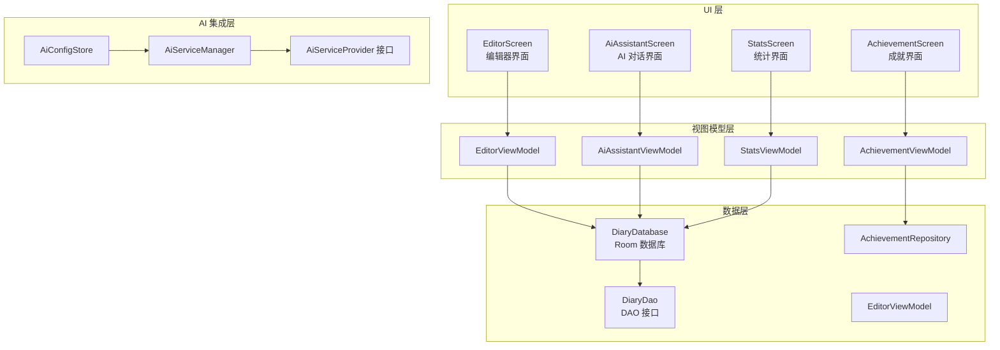
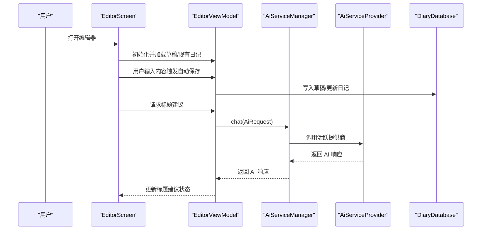
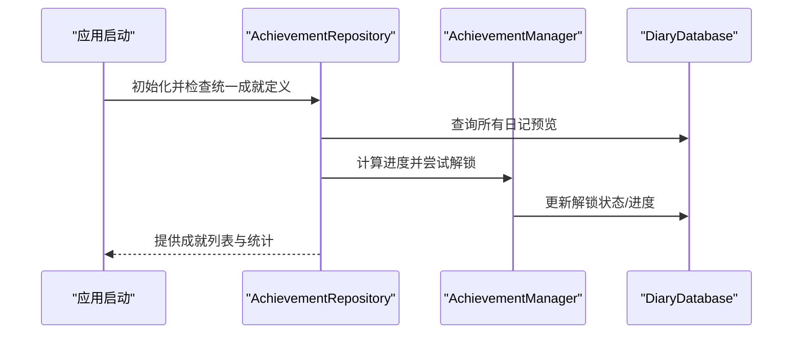
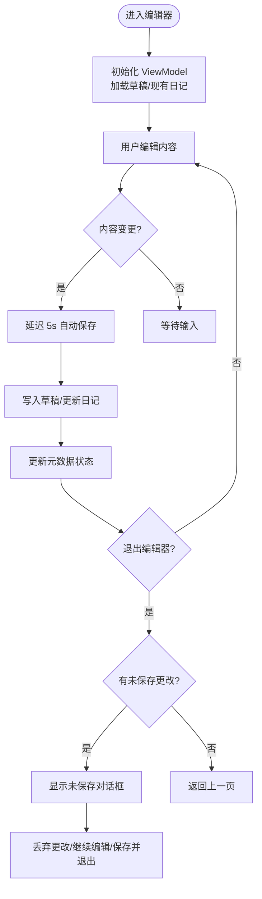
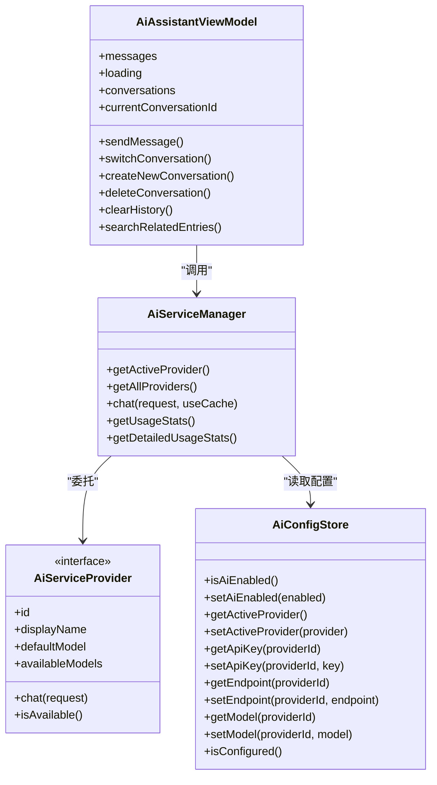
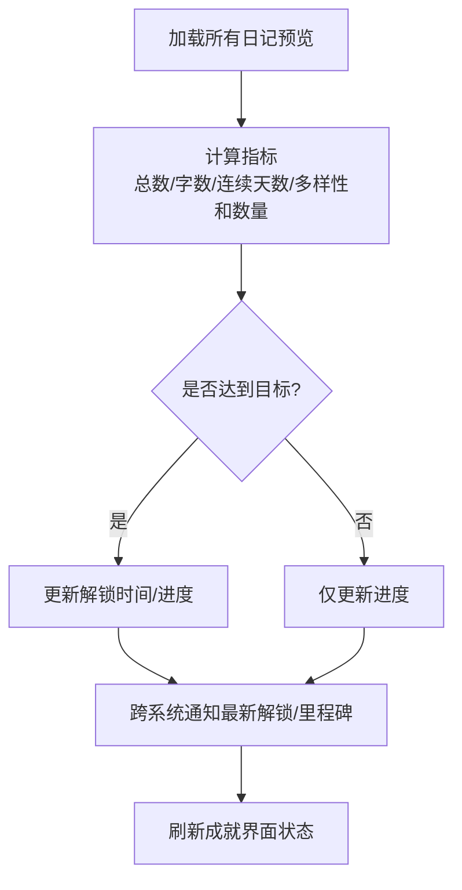
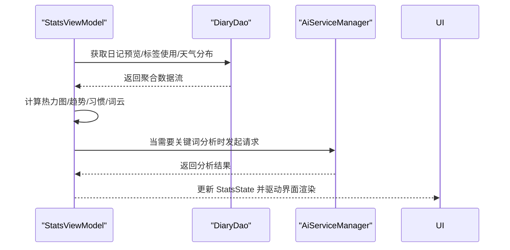
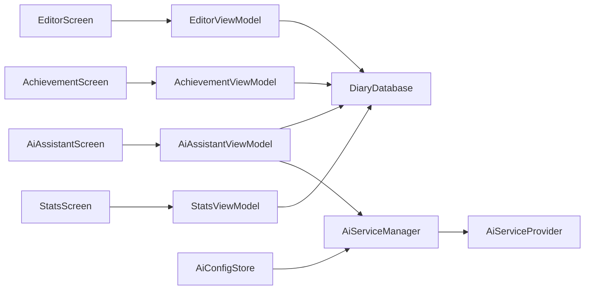

# 核心功能模块

<cite>
**本文档引用的文件**
- [EditorScreen.kt](file://app/src/main/java/com/diary/app/ui/editor/EditorScreen.kt)
- [EditorViewModel.kt](file://app/src/main/java/com/diary/app/ui/editor/EditorViewModel.kt)
- [AiAssistantViewModel.kt](file://app/src/main/java/com/diary/app/ai/AiAssistantViewModel.kt)
- [AiServiceManager.kt](file://app/src/main/java/com/diary/app/ai/AiServiceManager.kt)
- [AiConfigStore.kt](file://app/src/main/java/com/diary/app/ai/AiConfigStore.kt)
- [AiServiceProvider.kt](file://app/src/main/java/com/diary/app/ai/AiServiceProvider.kt)
- [InsightGenerator.kt](file://app/src/main/java/com/diary/app/ai/InsightGenerator.kt)
- [AchievementManager.kt](file://app/src/main/java/com/diary/app/data/AchievementManager.kt)
- [AchievementRepository.kt](file://app/src/main/java/com/diary/app/data/AchievementRepository.kt)
- [AchievementScreen.kt](file://app/src/main/java/com/diary/app/ui/achievement/AchievementScreen.kt)
- [AchievementViewModel.kt](file://app/src/main/java/com/diary/app/ui/achievement/AchievementViewModel.kt)
- [StatsScreen.kt](file://app/src/main/java/com/diary/app/ui/stats/StatsScreen.kt)
- [StatsViewModel.kt](file://app/src/main/java/com/diary/app/ui/stats/StatsViewModel.kt)
- [DiaryDatabase.kt](file://app/src/main/java/com/diary/app/data/DiaryDatabase.kt)
</cite>

## 目录
1. [简介](#简介)
2. [项目结构](#项目结构)
3. [核心组件](#核心组件)
4. [架构概览](#架构概览)
5. [详细组件分析](#详细组件分析)
6. [依赖分析](#依赖分析)
7. [性能考虑](#性能考虑)
8. [故障排除指南](#故障排除指南)
9. [结论](#结论)

## 简介
本文件为 DiaryApp 核心功能模块的综合技术文档，重点阐述以下模块的设计理念、实现方式与使用场景：
- 日记编辑器：基于 WebView 的富文本编辑与媒体插入、自动保存与草稿管理、标题建议与写作时长统计
- AI 助手：多提供商集成（Agnes、ModelScope、DeepSeek）、请求缓存与配额控制、对话上下文构建与消息持久化
- 成就系统：统一成就定义、进度追踪与解锁逻辑、跨系统通知与界面展示
- 统计数据：可视化图表与洞察（热力图、趋势、心情分布、词云、天气与标签统计）

文档还说明各模块间的协作关系与数据流，提供配置选项、自定义能力与扩展点，并涵盖生命周期管理、状态处理与错误恢复机制。

## 项目结构
DiaryApp 采用分层架构与模块化设计：
- UI 层：Compose 实现的屏幕与视图模型，负责交互与状态展示
- 数据层：Room 数据库、DAO 接口与仓库模式，封装数据访问与业务规则
- 集成层：AI 服务管理器与提供商接口，支持多供应商切换与缓存
- 工具与辅助：媒体管理、洞察生成、统计计算与迁移脚本

**图表来源**
- [EditorScreen.kt:122-800](file://app/src/main/java/com/diary/app/ui/editor/EditorScreen.kt#L122-L800)
- [AiAssistantViewModel.kt:33-364](file://app/src/main/java/com/diary/app/ai/AiAssistantViewModel.kt#L33-L364)
- [AchievementViewModel.kt:21-160](file://app/src/main/java/com/diary/app/ui/achievement/AchievementViewModel.kt#L21-L160)
- [StatsViewModel.kt:118-499](file://app/src/main/java/com/diary/app/ui/stats/StatsViewModel.kt#L118-L499)
- [DiaryDatabase.kt:10-14](file://app/src/main/java/com/diary/app/data/DiaryDatabase.kt#L10-L14)

**章节来源**
- [EditorScreen.kt:122-800](file://app/src/main/java/com/diary/app/ui/editor/EditorScreen.kt#L122-L800)
- [AiAssistantViewModel.kt:33-364](file://app/src/main/java/com/diary/app/ai/AiAssistantViewModel.kt#L33-L364)
- [AchievementViewModel.kt:21-160](file://app/src/main/java/com/diary/app/ui/achievement/AchievementViewModel.kt#L21-L160)
- [StatsViewModel.kt:118-499](file://app/src/main/java/com/diary/app/ui/stats/StatsViewModel.kt#L118-L499)
- [DiaryDatabase.kt:10-14](file://app/src/main/java/com/diary/app/data/DiaryDatabase.kt#L10-L14)

## 核心组件
本节概述四大核心模块的功能定位与关键职责：
- 日记编辑器：提供富文本编辑、媒体插入、元数据选择（心情/天气/标签/位置）、自动保存与草稿管理、标题建议与写作时长统计
- AI 助手：构建对话上下文、调用多提供商模型、缓存响应、记录用量、支持对话历史与清理
- 成就系统：统一成就定义与分类、进度计算与解锁、跨系统通知与界面展示
- 统计数据：热力图、趋势、心情分布、写作习惯、词云与天气/标签统计、AI 内容分析

**章节来源**
- [EditorScreen.kt:122-800](file://app/src/main/java/com/diary/app/ui/editor/EditorScreen.kt#L122-L800)
- [AiAssistantViewModel.kt:33-364](file://app/src/main/java/com/diary/app/ai/AiAssistantViewModel.kt#L33-L364)
- [AchievementManager.kt:12-126](file://app/src/main/java/com/diary/app/data/AchievementManager.kt#L12-L126)
- [StatsScreen.kt:1-800](file://app/src/main/java/com/diary/app/ui/stats/StatsScreen.kt#L1-800)

## 架构概览
下面以序列图展示编辑器与 AI 助手的典型交互流程，以及成就系统与数据库的解锁检查流程。

**图表来源**
- [EditorScreen.kt:122-800](file://app/src/main/java/com/diary/app/ui/editor/EditorScreen.kt#L122-L800)
- [EditorViewModel.kt:105-124](file://app/src/main/java/com/diary/app/ui/editor/EditorViewModel.kt#L105-L124)
- [AiServiceManager.kt:43-61](file://app/src/main/java/com/diary/app/ai/AiServiceManager.kt#L43-L61)
- [AiServiceProvider.kt:3-11](file://app/src/main/java/com/diary/app/ai/AiServiceProvider.kt#L3-L11)

**图表来源**
- [AchievementRepository.kt:46-119](file://app/src/main/java/com/diary/app/data/AchievementRepository.kt#L46-L119)
- [AchievementManager.kt:66-123](file://app/src/main/java/com/diary/app/data/AchievementManager.kt#L66-L123)
- [DiaryDatabase.kt:10-14](file://app/src/main/java/com/diary/app/data/DiaryDatabase.kt#L10-L14)

## 详细组件分析

### 日记编辑器模块
- 富文本处理：通过 WebView 加载本地 HTML 资源，注入 Quill 编辑器，支持图片/视频/音频插入与内容变更监听
- 元数据管理：提供心情、天气、标签、位置选择器，支持最近位置与预设标签
- 自动保存与草稿：基于 SharedPreferences 的草稿存储，支持定时自动保存与前台/后台切换保存
- 标题建议与写作时长：基于 AI 生成标题建议，统计写作时长并用于成就与洞察
- 生命周期与状态：Compose 状态管理、键盘可见性检测、WebView 销毁清理、字体大小与主题同步

**图表来源**
- [EditorScreen.kt:122-800](file://app/src/main/java/com/diary/app/ui/editor/EditorScreen.kt#L122-L800)
- [EditorViewModel.kt:144-158](file://app/src/main/java/com/diary/app/ui/editor/EditorViewModel.kt#L144-L158)

**章节来源**
- [EditorScreen.kt:122-800](file://app/src/main/java/com/diary/app/ui/editor/EditorScreen.kt#L122-L800)
- [EditorViewModel.kt:1-433](file://app/src/main/java/com/diary/app/ui/editor/EditorViewModel.kt#L1-L433)

### AI 助手模块
- 多提供商集成：支持 Agnes、ModelScope、Deepseek，通过 AiServiceManager 统一调度与缓存
- 配置与迁移：AiConfigStore 支持 per-provider 配置与旧配置迁移
- 上下文构建：AiAssistantViewModel 从数据库构建最近日记、连续写作天数、标签、地点、写作时段等上下文
- 对话持久化：对话与消息存储于数据库，支持切换/新建/删除对话与消息清理
- 使用统计：AiUsageTracker 记录用量，RateLimiter 控制调用频率

**图表来源**
- [AiServiceManager.kt:10-104](file://app/src/main/java/com/diary/app/ai/AiServiceManager.kt#L10-L104)
- [AiServiceProvider.kt:1-12](file://app/src/main/java/com/diary/app/ai/AiServiceProvider.kt#L1-L12)
- [AiConfigStore.kt:5-132](file://app/src/main/java/com/diary/app/ai/AiConfigStore.kt#L5-L132)
- [AiAssistantViewModel.kt:33-364](file://app/src/main/java/com/diary/app/ai/AiAssistantViewModel.kt#L33-L364)

**章节来源**
- [AiServiceManager.kt:10-104](file://app/src/main/java/com/diary/app/ai/AiServiceManager.kt#L10-L104)
- [AiServiceProvider.kt:1-12](file://app/src/main/java/com/diary/app/ai/AiServiceProvider.kt#L1-L12)
- [AiConfigStore.kt:5-132](file://app/src/main/java/com/diary/app/ai/AiConfigStore.kt#L5-L132)
- [AiAssistantViewModel.kt:33-364](file://app/src/main/java/com/diary/app/ai/AiAssistantViewModel.kt#L33-L364)

### 成就系统模块
- 统一定义与分类：AchievementManager/AchievementRepository 提供统一成就定义、分类、稀有度与目标值
- 进度计算与解锁：基于日记总数、字数、连续天数、心情/天气多样性、收藏数、标签/图片数量等指标
- 界面展示：AchievementScreen 与 AchievementViewModel 提供筛选、网格展示、英雄统计与详情弹窗
- 跨系统联动：解锁与里程碑通过 CrossSystemManager 同步至其他系统

**图表来源**
- [AchievementManager.kt:66-123](file://app/src/main/java/com/diary/app/data/AchievementManager.kt#L66-L123)
- [AchievementRepository.kt:66-119](file://app/src/main/java/com/diary/app/data/AchievementRepository.kt#L66-L119)
- [AchievementViewModel.kt:79-98](file://app/src/main/java/com/diary/app/ui/achievement/AchievementViewModel.kt#L79-L98)

**章节来源**
- [AchievementManager.kt:12-126](file://app/src/main/java/com/diary/app/data/AchievementManager.kt#L12-L126)
- [AchievementRepository.kt:12-127](file://app/src/main/java/com/diary/app/data/AchievementRepository.kt#L12-L127)
- [AchievementScreen.kt:1-512](file://app/src/main/java/com/diary/app/ui/achievement/AchievementScreen.kt#L1-L512)
- [AchievementViewModel.kt:1-160](file://app/src/main/java/com/diary/app/ui/achievement/AchievementViewModel.kt#L1-L160)

### 统计数据模块
- 数据聚合：StatsViewModel 基于 DiaryDao 流式数据计算热力图、月度趋势、心情分布、写作习惯、词云与天气/标签统计
- 可视化组件：StatsScreen 提供热力图卡片、趋势图、心情变化、写作习惯、词云与洞察卡片
- AI 分析：支持基于关键词检索相关日记并进行简短洞察分析
- 性能优化：使用 Flow 组合与 stateIn，避免重复计算；词云本地提取，降低对 AI 的依赖

**图表来源**
- [StatsViewModel.kt:118-499](file://app/src/main/java/com/diary/app/ui/stats/StatsViewModel.kt#L118-L499)
- [StatsScreen.kt:1-800](file://app/src/main/java/com/diary/app/ui/stats/StatsScreen.kt#L1-L800)

**章节来源**
- [StatsScreen.kt:1-800](file://app/src/main/java/com/diary/app/ui/stats/StatsScreen.kt#L1-L800)
- [StatsViewModel.kt:118-499](file://app/src/main/java/com/diary/app/ui/stats/StatsViewModel.kt#L118-L499)

## 依赖分析
- UI 与视图模型：EditorScreen/AiAssistantScreen/AchievementScreen/StatsScreen 依赖对应的 ViewModel
- 视图模型与数据层：EditorViewModel/AiAssistantViewModel/AchievementViewModel/StatsViewModel 依赖 DiaryDatabase 与 DAO
- AI 集成：AiServiceManager 依赖 AiServiceProvider 接口与 AiConfigStore；AiAssistantViewModel 依赖 AiServiceManager
- 数据库：DiaryDatabase 定义实体与迁移，确保版本演进与兼容

**图表来源**
- [EditorScreen.kt:122-800](file://app/src/main/java/com/diary/app/ui/editor/EditorScreen.kt#L122-L800)
- [AiAssistantViewModel.kt:33-364](file://app/src/main/java/com/diary/app/ai/AiAssistantViewModel.kt#L33-L364)
- [AchievementViewModel.kt:21-160](file://app/src/main/java/com/diary/app/ui/achievement/AchievementViewModel.kt#L21-L160)
- [StatsViewModel.kt:118-499](file://app/src/main/java/com/diary/app/ui/stats/StatsViewModel.kt#L118-L499)
- [AiServiceManager.kt:10-104](file://app/src/main/java/com/diary/app/ai/AiServiceManager.kt#L10-L104)
- [AiServiceProvider.kt:1-12](file://app/src/main/java/com/diary/app/ai/AiServiceProvider.kt#L1-L12)
- [AiConfigStore.kt:5-132](file://app/src/main/java/com/diary/app/ai/AiConfigStore.kt#L5-L132)
- [DiaryDatabase.kt:10-14](file://app/src/main/java/com/diary/app/data/DiaryDatabase.kt#L10-L14)

**章节来源**
- [DiaryDatabase.kt:10-14](file://app/src/main/java/com/diary/app/data/DiaryDatabase.kt#L10-L14)

## 性能考虑
- 编辑器富文本：使用 Base64 注入内容避免转义问题；内存敏感场景剥离内联 Base64 数据；WebView 销毁时清理防止泄漏
- 自动保存：5 秒防抖减少频繁 IO；前台暂停时触发保存，避免丢失
- 统计计算：基于 Flow 的组合与 stateIn，仅在依赖变化时重新计算；词云本地提取，降低网络依赖
- AI 调用：请求缓存（24h TTL）、配额限制与用量统计，避免过度调用
- 数据库：Room 迁移链完整，回调中执行回填与索引修复，保证启动安全

[本节为通用指导，无需特定文件引用]

## 故障排除指南
- 编辑器无法保存/崩溃
  - 检查 WebView 是否已准备就绪再执行 JS 注入
  - 确认 Base64 内容剥离与媒体引用转换正确
  - 参考路径：[EditorScreen.kt:340-348](file://app/src/main/java/com/diary/app/ui/editor/EditorScreen.kt#L340-L348)，[EditorViewModel.kt:308-309](file://app/src/main/java/com/diary/app/ui/editor/EditorViewModel.kt#L308-L309)
- AI 无法响应/超时
  - 检查 AiConfigStore 中提供商配置是否正确
  - 查看 AiServiceManager 缓存命中与异常日志
  - 参考路径：[AiConfigStore.kt:26-31](file://app/src/main/java/com/diary/app/ai/AiConfigStore.kt#L26-L31)，[AiServiceManager.kt:43-61](file://app/src/main/java/com/diary/app/ai/AiServiceManager.kt#L43-L61)
- 成就未解锁
  - 确认 AchievementRepository/AchievementManager 的进度计算逻辑与目标值匹配
  - 参考路径：[AchievementRepository.kt:66-119](file://app/src/main/java/com/diary/app/data/AchievementRepository.kt#L66-L119)，[AchievementManager.kt:66-123](file://app/src/main/java/com/diary/app/data/AchievementManager.kt#L66-L123)
- 统计页面空白
  - 检查 StatsViewModel 的数据流是否正常发射；确认 DAO 查询结果非空
  - 参考路径：[StatsViewModel.kt:149-205](file://app/src/main/java/com/diary/app/ui/stats/StatsViewModel.kt#L149-L205)

**章节来源**
- [EditorScreen.kt:340-348](file://app/src/main/java/com/diary/app/ui/editor/EditorScreen.kt#L340-L348)
- [EditorViewModel.kt:308-309](file://app/src/main/java/com/diary/app/ui/editor/EditorViewModel.kt#L308-L309)
- [AiConfigStore.kt:26-31](file://app/src/main/java/com/diary/app/ai/AiConfigStore.kt#L26-L31)
- [AiServiceManager.kt:43-61](file://app/src/main/java/com/diary/app/ai/AiServiceManager.kt#L43-L61)
- [AchievementRepository.kt:66-119](file://app/src/main/java/com/diary/app/data/AchievementRepository.kt#L66-L119)
- [AchievementManager.kt:66-123](file://app/src/main/java/com/diary/app/data/AchievementManager.kt#L66-L123)
- [StatsViewModel.kt:149-205](file://app/src/main/java/com/diary/app/ui/stats/StatsViewModel.kt#L149-L205)

## 结论
DiaryApp 的核心模块围绕“记录—洞察—成长”闭环展开：编辑器提供舒适的创作体验与数据采集，AI 助手提供智能辅助与个性化洞察，成就系统激励持续记录，统计数据模块则以可视化方式呈现用户的成长轨迹。模块间通过清晰的分层与接口解耦，既保证了扩展性，又确保了稳定性与性能。建议在新增功能时遵循现有模式：UI 层只负责状态展示，业务逻辑下沉至 ViewModel/Repository，数据访问统一通过 DAO 与数据库，AI 集成通过服务管理器抽象多提供商差异。